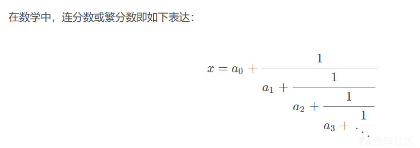
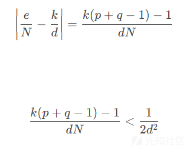
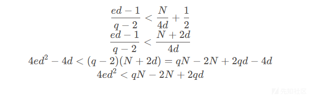
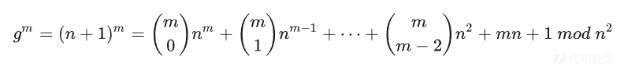

RSA 系列之《算法三》

- - -

# RSA 系列之《算法三》

就像是小学数学，中学数学，大学数学一样，我们把基本的加减乘除学好之后，才能学更多的知识、做更多的题目。下面是我对 RSA 在 CTF 中所经常用到的一些数论的总结和解释，希望能带来帮助。

## 八：维纳攻击

首先得清楚一点，维纳攻击和连分数往往是密不可分，但又有所区别的。连分数是维纳攻击的表现形式，维纳攻击是一种思路，在于 e d 的比例关系，下面我将仔细介绍这种关系的来源。

### 复习原理：连分数

[](https://xzfile.aliyuncs.com/media/upload/picture/20240228225918-f2713844-d649-1.png)

这里的 a0 是某个整数，而所有其他的数 an 都是正整数，可依样定义出更长的表达式。如果部分分子（partial numerator）和部分分母（partial denominator）允许假定任意的值，在某些上下文中可以包 e 含函数，则最终的表达式是广义连分数（Generalized continued fraction）。在需要把上述标准形式与广义连分数相区别的时候，可称它为简单或正规连分数，或称为是规范形式的。

这里做一个拓展，相关于收连分数：

设有理数 a =\[ao;a1,a2，·,an\]，则其收敛分数为 ao\],\[ao;al\],..\[ao;a1,a2,·..,an-1\],\[ao;a1,a2,.,an\]

通俗地讲，就是把连分数从某一项开始，后面的扔掉，得到 a 的一个近似值，那么，由于**任何一个有理数与其连分数形式是一一对应的**，我们有那么对于有理数，其收连分数的个数的有限的，并且越来越逼近 a。

### 形成原理：

-   e *d - k* φ = 1
-   φ = ( p - 1 ) \* ( q - 1 ) = N - ( p + q - 1)

二者合并并同除 d N，并且取好绝对值，同时将式子转换为合适的表达式从而利用该定理，即 d 相关。

[](https://xzfile.aliyuncs.com/media/upload/picture/20240228225936-fd30a63e-d649-1.png)

令 p 是一个大素数，如是我们 rsa 常见的 getprime(512)，也即 p≥q，可得 p + q -1 < 2p，代入上式连续不等式消元  
$$  
2kp < N/2d + 1  
$$  
现在我们还需要消去 k，回头看 k = ed - 1 / φ，而且φ = N - ( p + q - 1)，那么就使得  
$$  
k<(ed-1) / (N-2p)  
$$  
代入，化简，移项，计算

[](https://xzfile.aliyuncs.com/media/upload/picture/20240228230003-0d197314-d64a-1.png)

左右乘以 p，从而消去 q，再化简得到  
$$  
4ped^2<N^2-2(p-d)N  
$$

此时 k/d 是 e/N 的一个连分数收敛，枚举 e/N 的所有连分数收敛情况即可得到 k，d（前提是 k，d 互素）

板子一：

```plain
class ContinuedFraction():
    def __init__(self, numerator, denumerator):
        self.numberlist = []  # number in continued fraction
        self.fractionlist = []  # the near fraction list
        self.GenerateNumberList(numerator, denumerator)
        self.GenerateFractionList()

    def GenerateNumberList(self, numerator, denumerator):
        while numerator != 1:
            quotient = numerator // denumerator
            remainder = numerator % denumerator
            self.numberlist.append(quotient)
            numerator = denumerator
            denumerator = remainder

    def GenerateFractionList(self):
        self.fractionlist.append([self.numberlist[0], 1])
        for i in range(1, len(self.numberlist)):
            numerator = self.numberlist[i]
            denumerator = 1
            for j in range(i):
                temp = numerator
                numerator = denumerator + numerator * self.numberlist[i - j - 1]
                denumerator = temp
            self.fractionlist.append([numerator, denumerator])


a = ContinuedFraction(e, n)
```

板子二：

```plain
def continuedFra(x, y): #不断生成连分数的项
    cF = []
    while y:
        cF += [x // y]
        x, y = y, x % y
    return cF
def Simplify(ctnf): #化简
    numerator = 0
    denominator = 1
    for x in ctnf[::-1]: #注意这里是倒叙遍历
        numerator, denominator = denominator, x * denominator + numerator
    return (numerator, denominator) #把连分数分成分子和算出来的分母
def getit(c):
    cf=[]
    for i in range(1,len(c)):
        cf.append(Simplify(c[:i])) #各个阶段的连分数的分子和分母
    return cf #得到一串连分数
def wienerAttack(e, n):
    cf=continuedFra(e,n)
    for (Q2,Q1) in getit(cf):#遍历得到的连分数，令分子分母分别是 Q2，Q1
        if Q1 == 0:
            continue
        if N1%Q1==0 and Q1!=1:#满足这个条件就找到了
            return Q1
    print('not find!')
Q1=wienerAttack(N1,N2)
```

但是还是推荐 rsa-wiener-attack-master，附件已配上

## 九：指数攻击

指数攻击，为什么是指数？还记得 RSA 加密的原理吗？c = m ^ e mod n，这个指数，对应就是 e，大多数的题目中的 e，是仅作为 65537，但也有 e 很大和 e 很小的时候，这个时候就需要作更多的学习。

### 低解密指数攻击

这就是 e 很大的时候，多为上文的维纳攻击，原理不作过多赘述，这里仅放一道题

原题：

```plain
from Crypto.Util.number import *
from gmpy2 import *
from secret import flag
from random import *

gift = 

def make_gift(p, q):
    n_bits = len(bin(p * q)) - 2
    phi = (p - 1) * (q - 1)
    r = randint(11, 111)
    while True:
        a = getPrime(n_bits // 4 - r)
        if gcd(a, phi) != 1:
            continue
        b = invert(a, phi)
        e = invert(b, gift)
        if gcd(e, phi) == 1:
            break
    d = invert(e, phi)
    return (e, d)

p = getPrime(2048)
q = getPrime(2048)
n = p * q
e, d = make_gift(p, q)
c = pow(bytes_to_long(flag), e, n)

print("n:", hex(n))
print("e:", hex(e))
print("c:", hex(c))

'''
n: 
e: 
c: 
'''
```

题目分析：  
已知*e*\=invert(b,gift)，即是 b=invert(e,gift)，又有 a\*b=1modphi

观察 a = getPrime(n\_bits // 4 - r)，nce 的值，可发现很明显的维纳攻击

exp：

```plain
from gmpy2 import *
from Crypto.Util.number import *
import random

def continuedFra(x, y):
    cf = []
    while y:
        cf.append(x // y)
        x, y = y, x % y
    return cf

def gradualFra(cf):
    numerator = 0 # 分子
    denominator = 1 # 分母
    for x in cf[::-1]:
        # 这里的渐进分数分子分母要分开
        numerator, denominator = denominator, x * denominator + numerator
    return numerator, denominator

def getGradualFra(cf):
    gf = []
    for i in range(1, len(cf) + 1):
        gf.append(gradualFra(cf[:i]))
    return gf


def wienerAttack(e, n):
    cf = continuedFra(e, n)
    gf = getGradualFra(cf)
    n_bits = len(bin(n)) - 2
    for a,_ in gf: # 不得不说最后要倒一下呀！
        if  a.bit_length() < (n_bits // 4 - 11) and a.bit_length() > (n_bits // 4 - 111) and isPrime(a):
            return a

n=
e=
c=
gift = 

b = invert(e,gift)

a = wienerAttack(b,n)

def divide_pq(e, d, n):
    k = e*d - 1
    while True:
        g = random.randint(2, n-1)
        t = k
        while True:
            if t % 2 != 0:
                break
            t //= 2
            x = pow(g, t, n)
            if x > 1 and gcd(x-1, n) > 1:
                p = gcd(x-1, n)
                return (p, n//p)

p,q = divide_pq(a,b,n)
d = inverse(e,(p-1)*(q-1))
print(long_to_bytes(pow(c,d,n)))
```

### 低加密指数攻击

e 很小的时候，那就基本直接爆破的思想了，因而也叫低加密指数广播攻击

#### 1.基础题型

BUUCTF Dangerous RSA

题目：

```plain
#n:  
#e:  0x3
#c:
#so,how to get the message?
```

题目给出了 1 组数据和极小的 e，但是 n 非常大，因此可以考虑低加密指数攻击，直接上代码：

```plain
import gmpy2
import os
from functools import reduce 
from Crypto.Util.number import long_to_bytes 
def CRT(items):
    N = reduce(lambda x, y: x * y, (i[1] for i in items))
    result = 0
    for a, n in items:
        m = N // n
        d, r, s = gmpy2.gcdext(n, m)
        if d != 1:
            raise Exception("Input not pairwise co-prime")
        result += a * s * m
    return result % N, N
e = 0x3
n=
c=
data = list(zip(c, n))
x, n = CRT(data)
m = gmpy2.iroot(gmpy2.mpz(x), e)[0].digits()
print('m is: ' + long_to_bytes(m))
```

#### 2.进阶之爆破 e

有些题目中不直接给出 e，只给出几组 n 和 c，然后说明 e1=e2=…=en，这种也简单，无非根据上述代码把 n 和 c 一组一组写进去，再多写一个循环，一个个爆破 e 就完了。

例题

```plain
n1 = 
c1 = 
n2 = 
c2 =  
n3 = 
c3 = 
(e1=e2=e3)
```

上面这道例题给了 3 组 n 和 c，且说明 e1=e2=e3，我们直接上代码爆破：

```plain
import gmpy2
import os
from functools import reduce
from Crypto.Util.number import long_to_bytes
def CRT(items):
    N = reduce(lambda x, y: x * y, (i[1] for i in items))
    result = 0
    for a, n in items:
        m = N // n
        d, r, s = gmpy2.gcdext(n, m)
        if d != 1:
            raise Exception("Input not pairwise co-prime")
        result += a * s * m
    return result % N, N
e = 1
n=[,,]
c=[,,]
data = list(zip(c, n))
x, n = CRT(data)
for i in range(1,30):
    e = i
    m = gmpy2.iroot(gmpy2.mpz(x), e)[0].digits()
    print('m is: ' + long_to_bytes(m))
```

#### 3.进阶之公因数求解

某些题目会给出多组 n 和 c，但是 e 却不小，比如 e=65537，这种情况下不建议使用中国剩余定理求解，可以尝试在 n 中寻找最大公约数 gcd。

这里的 e 达到了 65537，考虑在不同的 n 中试试寻找公因数求解，求出不同 n 之间的最大公约数 gcd() 从而得到 p 或 q，进而可得 d，有私钥 d 就能得到明文。：

```plain
import gmpy2
import libnum

e = 65537

n0 = 
c0 = 

n1 = 
c1 = 

n2 = 
c2 = 

n3 = 
c3 = 

n4 = 
c4 = 

n5 = 
c5 = 
...


n=[n0,n1,n2,n3,n4,n5,n6,n7,n8,n9,n10,n11,n12,n13,n14,n15,n16,n17,n18]
c=[c0,c1,c2,c3,c4,c5,c6,c7,c8,c9,c10,c11,c12,c13,c14,c15,c16,c17,c18]

for i in range(len(n)):
    for j in range(len(n)):
        if(i!=j):
            if(gmpy2.gcd(n[i],n[j])!=1):   #对不同的 n 进行 欧几里得算法，以求出最大公约数 (p)
                print(i,j)                 #输出对应的 n 的序号
                p = gmpy2.gcd(n[i],n[j])
                print("p = ",p)
                q = n[i] // p
                print("q = ",q)
                d = gmpy2.invert(e , (p-1)*(q-1))
                print("d = ",d)
                m = pow(c[i],d,n[i])
                print("m = ",m)
print(libnum.n2s(int(m)))
```

#### 4.其他

1.  当 m^3<n 时，c=m^3，直接将 c 开三次方即可得到 m；
2.  当 m^3>n 时，c=m^3-i^n，只要找到 i，使得 c+i\*n 能够开三次方即可得到 m。

板子 1

```plain
import gmpy2
import binascii

e = 0x3
n = 
c = 

i = 0
while True:
    if gmpy2.iroot((c+i*n),3)[1] == True:   
        # 爆破出 c+i*n 开 3 次方
        m = gmpy2.iroot((c+i*n),3)[0]
        # 得到明文m
        break
    i += 1

print(m)
print(binascii.unhexlify(hex(m)[2:]))
```

板子 2

```plain
import gmpy2
import libnum

def de(c, e, n):
    k = 0
    while True:
        mm = c + n*k
        result, flag = gmpy2.iroot(mm, e)
        if True == flag:
            return result
        k += 1
e= 7
c =  
n =  
m=de(c,e,n)
print(m)
print(libnum.n2s(int(m)).decode())
```

## 十：同态攻击

先简单介绍一下何为同态加密（HE）：是指满足密文同态运算性质的加密算法，即数据经过同态加密之后，对密文进行特定的计算，得到的密文计算结果在进行对应的同态解密后的明文等同于对明文数据直接进行相同的计算，实现数据的“可算不可见”

如果满足 f(A)+f(B)=f(A+B)f(A)+f(B)=f(A+B) ，我们将这种加密函数叫做加法同态  
如果满足 f(A)×f(B)=f(A×B)f(A)×f(B)=f(A×B) ，我们将这种加密函数叫做乘法同态。

如果一种同态加密算法支持对密文进行任意形式的计算（即满足加法和乘法），则称其为全同态加密；如果支持对密文进行部分形式的计算，例如仅支持加法、仅支持乘法或支持有限次加法和乘法，则称其为半同态加密或部分同态加密。

有个很简单的例子，我们所熟知的 RSA 就是一种同态加密，存在密文 c1, c2，对应明文分别是 m1,m2。令 c=c1 *c2，可知 c=(m1* m2)^e mod N。可知，密文 c 解密后为 m1 \* m2。因此，RSA 算法为乘法同态算法。

那么何为 Paillier 同态加密？就是一种存在密文 c1, c2，对应明文分别是 m1,m2。令 c=c1+c2，可知 c=g^(m1+m2).r^(2n) mod n^2, 可知，对密文 c 解密后为 m1+m2。因此，Pailier 算法为加法同态算法。

### 形成原理

密钥生成

1.  随机选择两个大素数 p,q，满足 gcd(pq,(p-1)(q- 1))=1，且满足 p,q 长度相等
2.  计算 n = pq 以及 λ= lcm(p -1,q- 1)，这里 lcm 表示最小公倍数
3.  随机选择整数 g∈ Z\*(也可以令 g = n +1，优化计算速度，详见加密部分)
4.  定义 L 函数：L = x - 1 / n，计算μ=(L(g ^ λ mod n²)) ^ (-1) modn 公钥:(n,g)，私钥:( λ , μ)

加密过程

1.  输入明文信息 m，满足 0 ≤ m ≤ n
    
2.  选择随机数 r∈ Z 且 gcd (r,n) = 1
    
3.  选择计算密文  
    $$  
    c = g^m \* r^n mod n^2  
    $$  
    如果取 g=n +1，根据二项定理\[1\]：
    
    [](https://xzfile.aliyuncs.com/media/upload/picture/20240228230149-4cc87fd2-d64a-1.png)
    
4.  前面 m - 1 项都是 n^2 的倍数，在模 n^2 下消去，因此这里把模指数运算简化为 1 次模乘运算加速了计算过程，即： 
    $$  
    g^m = mn + 1 mod n^2  
    $$
    

解密过程：

1.  输入密文，满足 c ∈ Z
2.  计算明文消息 m =L( c ^ λ mod n²) ^μ mod n

解题思路：

有两个未知量 r 和 m，考虑先求 r。0<r<n，故求 r mod n

注意到：

-   $$  
    g=n+1  
    $$

-   $$  
    c = g^m \* r^n mod n^2  
    $$

而根据 g ^ m 的二项式展开，易知 g≡1(mod n)。因此，r^n≡c(mod n)。

要解这个方程就要求出 n 的分解。用 yafu 求出 p,q。计算φ(n)=(p-1)(q-1)。(n,φ(n))=1，因此计算 d=n-(mod φ(n))，得 r ≡ r^n ^d mod n

再对 g"二项式展开得 mn + 1 = c *r^(-n) mod n^2 <=>nm = c* r^(-n) - 1(mod n^2)

记 c \* r^(-n) - 1。故可对上式左右和模同除以 n，得  
$$  
m = a/n mod n  
$$  
用代码表示就是

```plain
'''
c = g^m * r^n (mod n^2) =>
c mod n = g^m * r^n (mod n)
g (mod n) = 1, so g^m = 1 (mod n)  
我们有 r^n = c (mod n) , 并且发现 (φ(n),n) = 1 
就像解决 RSA 一样
联立 g^m = c*r^(-n) (mod n^2)
g^m = (n+1)^m = mn + 1 (mod n^2)
设 a = c*r^(-n) - 1, 
我们有 mn = a (mod n^2)
n|a , n|mn , n|n^2 , So m = a/n (mod n) => m = a/n
'''

#那么就有
g = n + 1
φ = (p-1) * (q-1)     
r = pow(c%n, invert(n, φ), n)
a = c * pow(invert(r,n*n), n, n*n) % (n*n) - 1
```

板子 1：

```plain
#coding=utf-8

from gmpy2 import *
from Crypto.Util.number import long_to_bytes

p = 
q = 
n = 
c = 

g = n + 1
φ = (p-1) * (q-1)     
r = pow(c%n, invert(n, φ), n)
a = c * pow(invert(r,n*n), n, n*n) % (n*n) - 1
flag = long_to_bytes(m)

if __name__ == '__main__':
    # print(r)
    # print(a)
    # print((a-1) % n)
    print(flag)
```

板子 2：

```plain
# -*- coding: utf-8 -*-
from Crypto.Util.number import long_to_bytes,inverse
from sympy import nextprime
from gmpy2 import iroot

def L(x,n):
    return (x-1)/n

c=
n=

#factor(n)
a = iroot(n,2)[0]
p = nextprime(a)
q = n//p
assert p*q == n

#根据解密公式，计算所需私钥对（λ，μ）
Lambda=(p-1)*(q-1)
miu=inverse(Lambda,n*n)
m=(L(pow(c,Lambda,n**2),n)*miu)%n

print long_to_bytes(m)
```

rsa-wiener-attack-master.zip (0.128 MB) [下载附件](https://xzfile.aliyuncs.com/upload/affix/20240228230604-e44a2860-d64a-1.zip)
