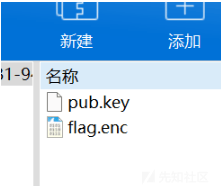

RSA 系列之基础再战

- - -

# RSA 系列之基础再战

## 导入

从这个系列开始，我将从简单到困难的将 RSA 中的题型不断更新加入此。笔者将尽力整理成册，并辅以自己的理解和总结。希望能帮助到各位读者，若有笔误或其余错误，敬请谅解并联系我更改，共勉。此篇文章主要是对 RSA 自身的学习以及相关文件的题型解析。

## 基础知识回顾

（注：熟悉该内容可跳过）

```plain
φ(n):欧拉函数，小于等于 n 的正整数中与 n 互质的数的总数
      1.如果 n 是质数的某一个次方，即 n = p^k (p 为质数，k 为大于等于 1 的整数)，则
         φ(p^k) = p^k - p^(k-1)
     2.如果 n 可以分解成两个互质的整数之积，n = p1 × p2
       则φ(n) = φ(p1p2) = φ(p1)φ(p2)
     3.欧拉定理：如果两个正整数 a 和 n 互质，则 n 的欧拉函数 φ(n) 可以让下面的等式成立：
         a^φ(n)= 1 ( mod n)
       欧拉定理：如果两个正整数 a 和 n 互质，则 n 的欧拉函数 φ(n) 可以让下面的等式成立：
         a^φ(n) ≡ 1 ( mod n)
     4.模反元素：如果两个正整数 a 和 n 互质，那么一定可以找到整数 b，ab 被 n 除的余数是 1
     ab===1(mod n),b 叫做 a 的模反元素

RSA 加密过程
p:质数 q  q:质数 q  n:质数 n=p*q
φ(n)=φ(p*q)=φ(p)φ(q)=(p-1)*(q-1)
e:随机选择一个整数 e，条件是 1< e < φ(n)，且 e 与φ(n) 互质
d:e 对于φ(n) 的模反元素 d 即：ed ≡ 1 (mod φ(n))
(n,e):公钥  (n,d):私钥
m:明文  c:用公钥加密后的密文
     那么，有无可能在已知 n 和 e 的情况下，推导出 d？
       （1）ed≡1 (mod φ(n))。只有知道 e 和φ(n)，才能算出 d。
       （2）φ(n)=(p-1)(q-1)。只有知道 p 和 q，才能算出φ(n)。
       （3）n=pq。只有将 n 因数分解，才能算出 p 和 q。
     结论：如果 n 可以被因数分解，d 就可以算出，也就意味着私钥被破解

    加密要用公钥 (n,e)，m 已知 m*e ≡ c (mod n) 
    加密算出 c，加 密 公 式：m*e ≡ c ( mod n ) → c = m*e – k*n
    解密要用私钥 (n,d)，解密公式：cd ≡ m (mod n)
```

### 欧拉函数

#### 题目描述：

```plain
import sympy
import random
from gmpy2 import gcd, invert
from Crypto.Util.number import getPrime, isPrime, getRandomNBitInteger, bytes_to_long, long_to_bytes
from z3 import *
flag = b"MRCTF{xxxx}"
base = 65537

def GCD(A):
    B = 1
    for i in range(1, len(A)):
        B = gcd(A[i-1], A[i])
    return B

def gen_p():
    P = [0 for i in range(17)]
    P[0] = getPrime(128)
    for i in range(1, 17):
        P[i] = sympy.nextprime(P[i-1])
    print("P_p :", P[9])
    n = 1
    for i in range(17):
        n *= P[i]
    p = getPrime(1024)
    factor = pow(p, base, n)
    print("P_factor :", factor)
    return sympy.nextprime(p)

def gen_q():
    sub_Q = getPrime(1024)
    Q_1 = getPrime(1024)
    Q_2 = getPrime(1024)
    Q = sub_Q ** Q_2 % Q_1
    print("Q_1: ", Q_1)
    print("Q_2: ", Q_2)
    print("sub_Q: ", sub_Q)
    return sympy.nextprime(Q)

if __name__ == "__main__":
    _E = base
    _P = gen_p()
    _Q = gen_q()
    assert (gcd(_E, (_P - 1) * (_Q - 1)) == 1)
    _M = bytes_to_long(flag)
    _C = pow(_M, _E, _P * _Q)
    print("Ciphertext = ", _C)
'''
P_p : 206027926847308612719677572554991143421
P_factor : 213671742765908980787116579976289600595864704574134469173111790965233629909513884704158446946409910475727584342641848597858942209151114627306286393390259700239698869487469080881267182803062488043469138252786381822646126962323295676431679988602406971858136496624861228526070581338082202663895710929460596143281673761666804565161435963957655012011051936180536581488499059517946308650135300428672486819645279969693519039407892941672784362868653243632727928279698588177694171797254644864554162848696210763681197279758130811723700154618280764123396312330032986093579531909363210692564988076206283296967165522152288770019720928264542910922693728918198338839
Q_1:  103766439849465588084625049495793857634556517064563488433148224524638105971161051763127718438062862548184814747601299494052813662851459740127499557785398714481909461631996020048315790167967699932967974484481209879664173009585231469785141628982021847883945871201430155071257803163523612863113967495969578605521
Q_2:  151010734276916939790591461278981486442548035032350797306496105136358723586953123484087860176438629843688462671681777513652947555325607414858514566053513243083627810686084890261120641161987614435114887565491866120507844566210561620503961205851409386041194326728437073995372322433035153519757017396063066469743
sub_Q:  168992529793593315757895995101430241994953638330919314800130536809801824971112039572562389449584350643924391984800978193707795909956472992631004290479273525116959461856227262232600089176950810729475058260332177626961286009876630340945093629959302803189668904123890991069113826241497783666995751391361028949651
Ciphertext =  1709187240516367141460862187749451047644094885791761673574674330840842792189795049968394122216854491757922647656430908587059997070488674220330847871811836724541907666983042376216411561826640060734307013458794925025684062804589439843027290282034999617915124231838524593607080377300985152179828199569474241678651559771763395596697140206072537688129790126472053987391538280007082203006348029125729650207661362371936196789562658458778312533505938858959644541233578654340925901963957980047639114170033936570060250438906130591377904182111622236567507022711176457301476543461600524993045300728432815672077399879668276471832
```

#### 题目分析：

-   首先我们分析代码，代码可以说分为 3 个模块，第一个模块（GCD 模块）个人觉得这里不需要看，后面解题并没有用它，重点是下面两模块，即 gen\_p 和 gen\_q 模块（生成 p 和生成 q 模块）
-   生成 q 模块还好说：

```plain
def gen_q():
    sub_Q = getPrime(1024)
    Q_1 = getPrime(1024)
    Q_2 = getPrime(1024)
    Q = sub_Q ** Q_2 % Q_1
    return sympy.nextprime(p)
```

```plain
其中 Q = sympy.nextprime(pow(sub_Q,Q_2,Q_1)),而 sub_Q , Q_2 , Q_1 都为已知数，那么 Q 便求出来了
```

-   重点是生成 p 模块，我们先来看生成 p 的过程：先生成 P，P 里面有 17 个质数，且每一个质数之间都有关系

```plain
def gen_p():
    P = [0 for i in range(17)]
    P[0] = getPrime(128)
    for i in range(1, 17):
        P[i] = sympy.nextprime(P[i-1])
    print("P_p :", P[9])
    n = 1
    for i in range(17):
        n *= P[i]
    p = getPrime(1024)
    factor = pow(p, base, n)
    print("P_factor :", factor)
    return sympy.nextprime(p)
```

> 做此题 必备知识  
> sympy.prevprime(x) 是求小于 x 最近的质数  
> sympy.nextprime(x) 是求大于 x 最近的质数

-   由必备知识可知 P 中有 17 个质数，后一个数是大于前一个数最近的质数，并且具有唯一性，这 16 个质数相乘得到 n，然后通过 factor = pow(p,base,n) 求得 factor , (其中 base 即为 e = 65537)。这是一个典型的欧拉函数，我们需要求出的便是这 17 个（P\[i\]-1）的乘积，其中 P\[9\]是已知的，然而我在上面也说了，每个质数之间都是相联系的，且每个质数都是唯一的，所以知道其中一个，那么其他的都能知道，然后通过 invert 求出 d1，之后求出 p。以下是求解 p 的代码：

```plain
P = [0 for i in range(17)]
P[9] = 206027926847308612719677572554991143421
for i in range(9,0,-1): # 9 8 7 6 5 4 3 2 1
    P[i-1] = sympy.prevprime(P[i])
for i in range(9,16):
    P[i+1] = sympy.nextprime(P[i]) # i = 16 时，i+1=17
n = 1
phi_n = 1
for i in range(17):
    n *= P[i]
    phi_n *= (P[i]-1)
d1 = gmpy2.invert(base,phi_n)
p = sympy.nextprime(pow(P_factor,d1,n))
```

-   完整代码如下：

```plain
import libnum
import sympy
import gmpy2
base = 65537
P_p = 206027926847308612719677572554991143421
P_factor = 213671742765908980787116579976289600595864704574134469173111790965233629909513884704158446946409910475727584342641848597858942209151114627306286393390259700239698869487469080881267182803062488043469138252786381822646126962323295676431679988602406971858136496624861228526070581338082202663895710929460596143281673761666804565161435963957655012011051936180536581488499059517946308650135300428672486819645279969693519039407892941672784362868653243632727928279698588177694171797254644864554162848696210763681197279758130811723700154618280764123396312330032986093579531909363210692564988076206283296967165522152288770019720928264542910922693728918198338839
Q_1 = 103766439849465588084625049495793857634556517064563488433148224524638105971161051763127718438062862548184814747601299494052813662851459740127499557785398714481909461631996020048315790167967699932967974484481209879664173009585231469785141628982021847883945871201430155071257803163523612863113967495969578605521
Q_2 = 151010734276916939790591461278981486442548035032350797306496105136358723586953123484087860176438629843688462671681777513652947555325607414858514566053513243083627810686084890261120641161987614435114887565491866120507844566210561620503961205851409386041194326728437073995372322433035153519757017396063066469743
sub_Q = 168992529793593315757895995101430241994953638330919314800130536809801824971112039572562389449584350643924391984800978193707795909956472992631004290479273525116959461856227262232600089176950810729475058260332177626961286009876630340945093629959302803189668904123890991069113826241497783666995751391361028949651
c = 1709187240516367141460862187749451047644094885791761673574674330840842792189795049968394122216854491757922647656430908587059997070488674220330847871811836724541907666983042376216411561826640060734307013458794925025684062804589439843027290282034999617915124231838524593607080377300985152179828199569474241678651559771763395596697140206072537688129790126472053987391538280007082203006348029125729650207661362371936196789562658458778312533505938858959644541233578654340925901963957980047639114170033936570060250438906130591377904182111622236567507022711176457301476543461600524993045300728432815672077399879668276471832

P = [0 for i in range(17)]
P[9] = 206027926847308612719677572554991143421
for i in range(9,0,-1): # 9 8 7 6 5 4 3 2 1
    P[i-1] = sympy.prevprime(P[i])
for i in range(9,16):
    P[i+1] = sympy.nextprime(P[i]) # i = 16 时，i+1=17
n = 1
phi_n = 1
for i in range(17):
    n *= P[i]
    phi_n *= (P[i]-1)
d1 = gmpy2.invert(base,phi_n)
p = sympy.nextprime(pow(P_factor,d1,n))
q = sympy.nextprime(pow(sub_Q,Q_2,Q_1))
phi = (p-1)*(q-1)
n = p * q
d = gmpy2.invert(base,phi)
m = pow(c,d,n)
print(libnum.n2s(int(m)))
#flag{sti11_@_b@by_qu3st10n}
```

### 方程计算

#### 题目描述：

```plain
import hashlib
import sympy
from Crypto.Util.number import *

flag = 'GWHT{******}'
secret = '******'
assert(len(flag) == 38)
half = len(flag) / 2

flag1 = flag[:half]
flag2 = flag[half:]

secret_num = getPrime(1024) * bytes_to_long(secret)

p = sympy.nextprime(secret_num)
q = sympy.nextprime(p)
N = p * q
e = 0x10001

F1 = bytes_to_long(flag1)
F2 = bytes_to_long(flag2)
c1 = F1 + F2
c2 = pow(F1, 3) + pow(F2, 3)
assert(c2 < N)

m1 = pow(c1, e, N)
m2 = pow(c2, e, N)

output = open('secret', 'w')
output.write('N=' + str(N) + '\n')
output.write('m1=' + str(m1) + '\n')
output.write('m2=' + str(m2) + '\n')
output.close()
```

```plain
N=636585149594574746909030160182690866222909256464847291783000651837227921337237899651287943597773270944384034858925295744880727101606841413640006527614873110651410155893776548737823152943797884729130149758279127430044739254000426610922834573094957082589539445610828279428814524313491262061930512829074466232633130599104490893572093943832740301809630847541592548921200288222432789208650949937638303429456468889100192613859073752923812454212239908948930178355331390933536771065791817643978763045030833712326162883810638120029378337092938662174119747687899484603628344079493556601422498405360731958162719296160584042671057160241284852522913676264596201906163
m1=90009974341452243216986938028371257528604943208941176518717463554774967878152694586469377765296113165659498726012712288670458884373971419842750929287658640266219686646956929872115782173093979742958745121671928568709468526098715927189829600497283118051641107305128852697032053368115181216069626606165503465125725204875578701237789292966211824002761481815276666236869005129138862782476859103086726091860497614883282949955023222414333243193268564781621699870412557822404381213804026685831221430728290755597819259339616650158674713248841654338515199405532003173732520457813901170264713085107077001478083341339002069870585378257051150217511755761491021553239
m2=487443985757405173426628188375657117604235507936967522993257972108872283698305238454465723214226871414276788912058186197039821242912736742824080627680971802511206914394672159240206910735850651999316100014691067295708138639363203596244693995562780286637116394738250774129759021080197323724805414668042318806010652814405078769738548913675466181551005527065309515364950610137206393257148357659666687091662749848560225453826362271704292692847596339533229088038820532086109421158575841077601268713175097874083536249006018948789413238783922845633494023608865256071962856581229890043896939025613600564283391329331452199062858930374565991634191495137939574539546
```

#### 题目分析：

对代码进行分析可得大致加密过程为：

-   首先给了字符串明文 flag 和 secret，然后对 flag 对半切得到 flag1 和 flag2
-   随机生成一个 1024 位（2 进制）的素数，并将 secret(字符串) 类型转化为整数类型，然后将这两个结果相乘得到 secret\_num

> 拓展：  
> bytes\_to\_long(x) ---> 字节转整数（会将字节 x 转化为它的 ascii 码）  
> long\_to\_bytes(x) ---> 整数转字节

[](https://xzfile.aliyuncs.com/media/upload/picture/20240226192622-de9d3c20-d499-1.png)

-   取 secret\_num 的下一个素数作为 p，取 p 的下一个素数作为 q，得到 N=p\*q

> 必备知识：  
> sympy.prevprime(x) 是求小于 x 最近的质数  
> sympy.nextprime(x) 是求大于 x 最近的质数

-   将 flag1 和 flag2 通过 bytes\_to\_long 转化为整数得到 F1 和 F2
-   将 F1,F2 设计成方程组得到 c1,c2，进一步加密得到 m1,m2
-   最后给出运行结果得到 N,m1,m2

-   题中给出了 N，通过以上分析可以得知 p,q 是两个相邻的素数，所以对 N 进行开方运算 (iroot(N,2)) 后可以得到一个值 x，并且 p<x>q</x>
-   通过 sympy.prevprime(x)，sympy.nextprime(x) 函数可以得到 p,q，从而可以求得 d
-   然后进行 RSA 解密得出 c1 和 c2

> c1 = pow(m1,d,N)  
> c2 = pow(m2,d,N)

-   至此，我们得到一个方程组：

> c1=F1+F2  
> c2=F13+F23

-   利用 sympy 库进行方程组求解：

```plain
from sympy import *
F1 = Symbol('F1')
F2 = Symbol('F2')
F1,F2 = solve([F1+F2-c1,(F1)**3+(F2)**3-c2])
print(F1,F2)
```

得到：

```plain
{F1: 1141553212031156130619789508463772513350070909, F2: 1590956290598033029862556611630426044507841845},
{F1: 1590956290598033029862556611630426044507841845, F2: 1141553212031156130619789508463772513350070909}
```

-   得到两组解，但仔细看只是调换的位置而已，两组都试一下，便可得到最终 flag
-   完整代码：

```plain
N=636585149594574746909030160182690866222909256464847291783000651837227921337237899651287943597773270944384034858925295744880727101606841413640006527614873110651410155893776548737823152943797884729130149758279127430044739254000426610922834573094957082589539445610828279428814524313491262061930512829074466232633130599104490893572093943832740301809630847541592548921200288222432789208650949937638303429456468889100192613859073752923812454212239908948930178355331390933536771065791817643978763045030833712326162883810638120029378337092938662174119747687899484603628344079493556601422498405360731958162719296160584042671057160241284852522913676264596201906163
m1=90009974341452243216986938028371257528604943208941176518717463554774967878152694586469377765296113165659498726012712288670458884373971419842750929287658640266219686646956929872115782173093979742958745121671928568709468526098715927189829600497283118051641107305128852697032053368115181216069626606165503465125725204875578701237789292966211824002761481815276666236869005129138862782476859103086726091860497614883282949955023222414333243193268564781621699870412557822404381213804026685831221430728290755597819259339616650158674713248841654338515199405532003173732520457813901170264713085107077001478083341339002069870585378257051150217511755761491021553239
m2=487443985757405173426628188375657117604235507936967522993257972108872283698305238454465723214226871414276788912058186197039821242912736742824080627680971802511206914394672159240206910735850651999316100014691067295708138639363203596244693995562780286637116394738250774129759021080197323724805414668042318806010652814405078769738548913675466181551005527065309515364950610137206393257148357659666687091662749848560225453826362271704292692847596339533229088038820532086109421158575841077601268713175097874083536249006018948789413238783922845633494023608865256071962856581229890043896939025613600564283391329331452199062858930374565991634191495137939574539546
e = 65537
import gmpy2
import libnum
import sympy.crypto.crypto
x = gmpy2.iroot(N,2)[0]
p = sympy.nextprime(x)
q = N//p
phi = (p-1)*(q-1)
d = gmpy2.invert(e,phi)
# m1 = pow(c1, e, N)
# m2 = pow(c2, e, N)
c1 = pow(m1,d,N)
c2 = pow(m2,d,N)
from sympy import *
F1 = Symbol('F1')
F2 = Symbol('F2')
print(solve([F1+F2-c1,(F1)**3+(F2)**3-c2]),F1,F2)
F1,F2 = solve([F1+F2-c1,(F1)**3+(F2)**3-c2])
F2 = 1141553212031156130619789508463772513350070909
F1 = 1590956290598033029862556611630426044507841845
print(libnum.n2s(int(F1))+libnum.n2s(int(F2)))
#flag{f709e0e2cfe7e530ca8972959a1033b2}
```

### q 与 p 之舞

#### 题目描述：

```plain
import sympy
from gmpy2 import gcd, invert
from random import randint
from Crypto.Util.number import getPrime, isPrime, getRandomNBitInteger, bytes_to_long, long_to_bytes
import base64

from zlib import *
flag = b"MRCTF{XXXX}"
base = 65537

def gen_prime(N):
    A = 0
    while 1:
        A = getPrime(N)
        if A % 8 == 5:
            break
    return A

def gen_p():
    p = getPrime(1024)
    q = getPrime(1024)
    assert (p < q)
    n = p * q
    print("P_n = ", n)
    F_n = (p - 1) * (q - 1)
    print("P_F_n = ", F_n)
    factor2 = 2021 * p + 2020 * q
    if factor2 < 0:
        factor2 = (-1) * factor2
    return sympy.nextprime(factor2)


def gen_q():
    p = getPrime(1024)
    q = getPrime(1024)
    assert (p < q)
    n = p * q
    print("Q_n = ", n)
    e = getRandomNBitInteger(53)
    F_n = (p - 1) * (q - 1)
    while gcd(e, F_n) != 1:
        e = getRandomNBitInteger(53)
    d = invert(e, F_n)
    print("Q_E_D = ", e * d)
    factor2 = 2021 * p - 2020 * q
    if factor2 < 0:
        factor2 = (-1) * factor2
    return sympy.nextprime(factor2)


if __name__ == "__main__":
    _E = base
    _P = gen_p()
    _Q = gen_q()
    assert (gcd(_E, (_P - 1) * (_Q - 1)) == 1)
    _M = bytes_to_long(flag)
    _C = pow(_M, _E, _P * _Q)
    print("Ciphertext = ", _C)
'''
P_n =  14057332139537395701238463644827948204030576528558543283405966933509944444681257521108769303999679955371474546213196051386802936343092965202519504111238572269823072199039812208100301939365080328518578704076769147484922508482686658959347725753762078590928561862163337382463252361958145933210306431342748775024336556028267742021320891681762543660468484018686865891073110757394154024833552558863671537491089957038648328973790692356014778420333896705595252711514117478072828880198506187667924020260600124717243067420876363980538994101929437978668709128652587073901337310278665778299513763593234951137512120572797739181693
P_F_n =  14057332139537395701238463644827948204030576528558543283405966933509944444681257521108769303999679955371474546213196051386802936343092965202519504111238572269823072199039812208100301939365080328518578704076769147484922508482686658959347725753762078590928561862163337382463252361958145933210306431342748775024099427363967321110127562039879018616082926935567951378185280882426903064598376668106616694623540074057210432790309571018778281723710994930151635857933293394780142192586806292968028305922173313521186946635709194350912242693822450297748434301924950358561859804256788098033426537956252964976682327991427626735740
Q_n =  20714298338160449749545360743688018842877274054540852096459485283936802341271363766157976112525034004319938054034934880860956966585051684483662535780621673316774842614701726445870630109196016676725183412879870463432277629916669130494040403733295593655306104176367902352484367520262917943100467697540593925707162162616635533550262718808746254599456286578409187895171015796991910123804529825519519278388910483133813330902530160448972926096083990208243274548561238253002789474920730760001104048093295680593033327818821255300893423412192265814418546134015557579236219461780344469127987669565138930308525189944897421753947
Q_E_D =  100772079222298134586116156850742817855408127716962891929259868746672572602333918958075582671752493618259518286336122772703330183037221105058298653490794337885098499073583821832532798309513538383175233429533467348390389323225198805294950484802068148590902907221150968539067980432831310376368202773212266320112670699737501054831646286585142281419237572222713975646843555024731855688573834108711874406149540078253774349708158063055754932812675786123700768288048445326199880983717504538825498103789304873682191053050366806825802602658674268440844577955499368404019114913934477160428428662847012289516655310680119638600315228284298935201
Ciphertext =  40855937355228438525361161524441274634175356845950884889338630813182607485910094677909779126550263304194796000904384775495000943424070396334435810126536165332565417336797036611773382728344687175253081047586602838685027428292621557914514629024324794275772522013126464926990620140406412999485728750385876868115091735425577555027394033416643032644774339644654011686716639760512353355719065795222201167219831780961308225780478482467294410828543488412258764446494815238766185728454416691898859462532083437213793104823759147317613637881419787581920745151430394526712790608442960106537539121880514269830696341737507717448946962021
'''
```

#### 题目分析：

（先告知：此题有简便方法，即 直接将 P\_n 和 Q\_n 进行分解，得到两组 p,q（即用线上网站将 n 分解得到 p,q）将 p,q 带入生成 factor2 的代码中，即可得到 P,Q，之后就是常规的 rsa 解密了。以下是更详细深入的解析）

-   这题与 [buu \[GWCTF 2019\]BabyRSA 1](https://blog.csdn.net/XiongSiqi_blog/article/details/129224715?spm=1001.2014.3001.5501) 比较像，分四个模块，第一个模块告诉我们生成素数的方法（对后面的分析没什么实质性关系）
-   第二个模块即生成 P 的过程（gen\_p）:

> 告诉了我们 n = p \* q , phi = (p-1) \* (q-1) = p \* q - (p+q) + 1 = n - (p+q) + 1  
> \==>n = p \* q , phi = n - (p+q) + 1  
> \==>p + q = n - phi + 1  
> \==>(p - q)^2 = (p+q)^2 - 4 \* n  
> \==>p - q = \[(p-q)^2\] ^0.5  
> \==>p = \[(p + q) + (p - q)\] // 2  
> \==>q = (p + q) - p

-   由上过程便可得出 p,q，从而求出 factor2，注意 p<q，若求出来的不符合则调换下位置
-   求 P 代码：

```plain
def get_p(n,phi):
    p_q = n - phi + 1 # p_q = p + q
    p_q_2 = p_q**2 - 4*n # p_q_2 = (p - q)^2
    p_q_1 = gmpy2.iroot(p_q_2,2)[0] # p_q_1 = p - q
    p = (p_q + p_q_1) // 2
    q = p_q - p
    if q < p:
        q,p = p,q
    factor2 = 2021 * p + 2020 * q
    if factor2 < 0:
        factor2 = (-1) * factor2
    P = sympy.nextprime(factor2)
    return P
P = get_p(P_n,P_F_n)
```

-   第三个模块即生成 Q 的过程（gen\_q）,和上面生成 P 的过程很像，

> 不过此时已知的是 n = p \* q , e \* d = 1 mod phi  
> \==>e \* d - 1 = k \* phi = k \* (p - 1) \* (q-1)  
> \==>(e \* d - 1) // p \* q < (e \* d - 1) // \[p \* q - (p + q) + 1\] = k

-   求 Q 代码如下：

```plain
def get_q(n,phi):
    p_q = n - phi + 1 # p_q = p + q
    p_q_2 = p_q ** 2 - 4 * n # p_q_2 = (p - q)^2
    p_q_1 = gmpy2.iroot(p_q_2, 2)[0] # p_q_1 = p - q
    p = (p_q + p_q_1) // 2
    q = p_q - p
    if q < p:
        q, p = p, q
    factor2 = 2021 * p - 2020 * q
    if factor2 < 0:
        factor2 = (-1) * factor2
    Q = sympy.nextprime(factor2)
    return Q
k = ((Q_E_D-1)//Q_n)+1
phi = (Q_E_D - 1)//k
Q = get_q(Q_n,phi)
```

-   第四个模块则是告诉我们关于 rsa 的基础运算过程，想必这个大家都清楚，也不过多赘述了
-   以下是完整代码：

```plain
import gmpy2
from Crypto.Util.number import *
import sympy

def get_p(n,phi):
    p_q = n - phi + 1
    p_q_2 = p_q**2 - 4*n
    p_q_1 = gmpy2.iroot(p_q_2,2)[0]
    p = (p_q + p_q_1) // 2
    q = p_q - p
    if q < p:
        q,p = p,q
    factor2 = 2021 * p + 2020 * q
    if factor2 < 0:
        factor2 = (-1) * factor2
    P = sympy.nextprime(factor2)
    return P

def get_q(n,phi):
    p_q = n - phi + 1
    p_q_2 = p_q ** 2 - 4 * n
    p_q_1 = gmpy2.iroot(p_q_2, 2)[0]
    p = (p_q + p_q_1) // 2
    q = p_q - p
    if q < p:
        q, p = p, q
    factor2 = 2021 * p - 2020 * q
    if factor2 < 0:
        factor2 = (-1) * factor2
    Q = sympy.nextprime(factor2)
    return Q

base = 65537
P_n =  14057332139537395701238463644827948204030576528558543283405966933509944444681257521108769303999679955371474546213196051386802936343092965202519504111238572269823072199039812208100301939365080328518578704076769147484922508482686658959347725753762078590928561862163337382463252361958145933210306431342748775024336556028267742021320891681762543660468484018686865891073110757394154024833552558863671537491089957038648328973790692356014778420333896705595252711514117478072828880198506187667924020260600124717243067420876363980538994101929437978668709128652587073901337310278665778299513763593234951137512120572797739181693
P_F_n =  14057332139537395701238463644827948204030576528558543283405966933509944444681257521108769303999679955371474546213196051386802936343092965202519504111238572269823072199039812208100301939365080328518578704076769147484922508482686658959347725753762078590928561862163337382463252361958145933210306431342748775024099427363967321110127562039879018616082926935567951378185280882426903064598376668106616694623540074057210432790309571018778281723710994930151635857933293394780142192586806292968028305922173313521186946635709194350912242693822450297748434301924950358561859804256788098033426537956252964976682327991427626735740
Q_n =  20714298338160449749545360743688018842877274054540852096459485283936802341271363766157976112525034004319938054034934880860956966585051684483662535780621673316774842614701726445870630109196016676725183412879870463432277629916669130494040403733295593655306104176367902352484367520262917943100467697540593925707162162616635533550262718808746254599456286578409187895171015796991910123804529825519519278388910483133813330902530160448972926096083990208243274548561238253002789474920730760001104048093295680593033327818821255300893423412192265814418546134015557579236219461780344469127987669565138930308525189944897421753947
Q_E_D =  100772079222298134586116156850742817855408127716962891929259868746672572602333918958075582671752493618259518286336122772703330183037221105058298653490794337885098499073583821832532798309513538383175233429533467348390389323225198805294950484802068148590902907221150968539067980432831310376368202773212266320112670699737501054831646286585142281419237572222713975646843555024731855688573834108711874406149540078253774349708158063055754932812675786123700768288048445326199880983717504538825498103789304873682191053050366806825802602658674268440844577955499368404019114913934477160428428662847012289516655310680119638600315228284298935201
Ciphertext =  40855937355228438525361161524441274634175356845950884889338630813182607485910094677909779126550263304194796000904384775495000943424070396334435810126536165332565417336797036611773382728344687175253081047586602838685027428292621557914514629024324794275772522013126464926990620140406412999485728750385876868115091735425577555027394033416643032644774339644654011686716639760512353355719065795222201167219831780961308225780478482467294410828543488412258764446494815238766185728454416691898859462532083437213793104823759147317613637881419787581920745151430394526712790608442960106537539121880514269830696341737507717448946962021

p = get_p(P_n,P_F_n)
k = ((Q_E_D-1)//Q_n)+1
phi = (Q_E_D - 1)//k
q = get_q(Q_n,phi)
d = gmpy2.invert(base,(p-1)*(q-1))
m = pow(Ciphertext,d,p*q)
print(long_to_bytes(m))
#flag{Ju3t_@_31mp13_que3t10n}
```

#### 收获与体会：

-   总之通过这题对 rsa 又有了更深的理解，对某些的模块的运用也更加熟练
-   看大佬的 wp，原来 k 还能这么求，真的想不到
-   k 的详细解析：

> 这里是引不等式两边的分母一个 pq，一个 pq-(p+q)+1 相差并不大，并且还是整除，所以估计 (ed-1)//pq 和 (ed-1)//(pq-(p+q)+1) 差值不到 1 用

```plain
k = ((Q_E_D - 1)//Q_n) + 1
phi = (Q_E_D - 1) // k
```

然后这里两次整除后，后面小数部分应该都省略掉了

### 多文件型

#### 题目描述：

[](https://xzfile.aliyuncs.com/media/upload/picture/20240226200330-0e7994a2-d49f-1.png)

题目四个文件，分别如下：

rsa.py

```plain
from Crypto.Util.number import bytes_to_long, getPrime
from random import randint
from gmpy2 import powmod

p = getPrime(2048)
q = getPrime(2048)
N = p*q
Phi = (p-1)*(q-1)
def get_enc_key(N,Phi):
    e = getPrime(N)
    if Phi % e == 0:
        return get_enc_key(N, Pih)
    else:
        return e
e1 = get_enc_key(randint(10, 12), Phi)
e2 = get_enc_key(randint(10, 12), Phi)

fr = open(r"./base64", "rb")#flag is in this file
f1 = open(r"./HUB1", "wb")
f2 = open(r"./HUB2", "wb")
base64 = fr.read(255)
f1.write("%d\n%d\n" % (N, e1))
f2.write("%d\n%d\n" % (N, e2))
while len(base64)>0:
    pt = bytes_to_long(base64)
    ct1 = powmod(pt, e1, N)
    ct2 = powmod(pt, e2, N)
    f1.write("\n%d" % ct1)
    f2.write("\n%d" % ct2)
    base64 = fr.read(255)
fr.close()
f1.close()
f2.close()
```

HUB1

```plain
785095419718268286866508214304816985447077293766819398728046411166917810820484759314291028976498223661229395009474063173705162627037610993539617751905443039278227583504604808251931083818909467613277587874545761074364427549966555519371913859875313577282243053150056274667798049694695703660313532933165449312949725581708965417273055582216295994587600975970124811496270080896977076946000102701030260990598181466447208054713391526313700681341093922240317428173599031624125155188216489476825606191521182034969120343287691181300399683515414809262700457525876691808180257730351707673660380698973884642306898810000633684878715402823143549139850732982897459698089649561190746850698130299458080255582312696873149210028240898137822888492559957665067936573356367589784593119016624072433872744537432005911668494455733330689385141214653091888017782049043434862620306783436169856564175929871100669913438980899219579329897753233450934770193915434791427728636586218049874617231705308003720066269312729135764175698611068808404054125581540114956463603240222497919384691718744014002554201602395969312999994159599536026359879060218056496345745457493919771337601177449899066579857630036350871090452649830775029695488575574985078428560054253180863725364147
1697

412629526163150748619328091306742267675740578011800062477174189782151273970783531227579758540364970485350157944321579108232221072397135934034064481497887079641131808838242743811511451355024436983050572020925065644355566434625618133203024215941534926113892937988520918939061441606915556516246057349589921494351383160036280826024605351878408056180907759973804117263002554923041750587548819746346813966673034182913325507826219961923932100526305289894965216608254252188398580139545189681875824089456195044984585824938384521905334289906422454152976834867304693292466676355760173232407753256256317546190171995276258924613533179898467683358934751999655196790168438343198229183747091108262988777659858609744709324571850262293294975336628234767258858873839342596887193772615000676401522431518310648303975593582965021189182246986957349253156736526071639973844039068996404290548474640668851856078201093335425412842295604919065487301340901573809617549185106072798799159726375235125260509158832996701927878713084753334549129580912412168594170659605421750204835970231909591063407612779337478065175988365401590396247576709343727196106058477166945670117868989025903023998142850338956985816131805349549059377047477131270847579095628384569645636821650
494644347943710545224678831941589086572700792465459558770782213550069709458568349686998660541810166872034041584767487150140111151788221460027897193248273461607411027815984883969396220626358625041781558277804930212654296704055890683796941327712758797770820006623289146990000114915293539639766846910274034245607746230740851938158390562286057002223177609606376329007676845450142537930798148258428701466415483232670659815791064681384406494388237742330786225557303988025468036820082959712050733095860546860468575857084616069132051094882919253745234762029759124776348047587755897123575123506976140900565238840752841856713613368250071926171873213897914794115466890719123299469964019450899291410760762179836946570945555295288184698184555018368687708432612286248476073758067175481771199066581572870175460016017100414479346437034291784837132240891321931601494414908927713208448927221095745802380014441841139882391378410438764884597938773868771896252329517440068673532468372840830510218585255432000690265226016573313570977945083879214961394087065558376158826938257664840570952233832852869328785568175434516247720356520242602299510374317488182738732700078879665745909603766482100138001417023680647717824323143388857817595766172152883484274718248
152942283599728307168144137370127212672611894072038732126041098102628831053000986759260271210671922070555948023688596575415822984026159010574404359474670428678518262175033880513984372909748992727828381694416776740981021730545374002974037896534944567124543272737618380646771071804878796585983783360553761828325817820260204820004421979881871027255562690952334900616675606524933557440263648233514757200263521499508373975003431306847453046714027687108396945719803444444954079308404947126216395526551292104722047878178373207886033071857277857997932255251315982837892164421298202073945919187779856785892717251746704537315003771369737854896595170485152591013676942418134278534037654467840633528916812275267230155352077736583130992587670941654695382287023971261529987384520843829695778029311786431227409189019205818351911572757145556993606643464336196802350204616056286497246016800105003143046120608673496196758720552776772796609670537056331996894322779267635281472481559819839042424017171718303214059720568484939239370144038161541354254182769979771948759413102933987773401644506930205164891773826513161783736386604783484446345744957119469799231796368324927570694496679453313927562345656690240414624431304646248599226046524702364131095964335
79717988936247951265489157583697956031893477858854186991051529161879478488281744062318600470906120960002282886511477294555606503083169449335174864424180701080203993329996226566203834693869525797695969610065991941396723959032680019082506816443041598300477625793433080664346470586416385854692124426348587211026568667694805849554780794033764714016521711467557284846737236374990121316809833819996821592832639024026411520407330206281265390130763948165694574512140518775603040182029818771866749548761938870605590174330887949847420877829240131490902432602005681085180807294176837646062568094875766945890382971790015490163385088144673549085079635083262975154206269679142412897438231719704933258660779310737302680265445437771977749959110744959368586293082016067927548564967400845992380076107522755566531760628823374519718763740378295585535591752887339222947397184116326706799921515431185636740825707782742373783475781052674257292910213843986132987466810027275052416774693363446184518901899202502828670309452622347532932678874990809930682575738653876289384151496807194146308614368821006660626870989784697045160231069428458961107751207771093777394616856305293335603892178327520756554333365975114235981173451368131680404850832773147333013716920
123111353650401158556639983459870663057297871992927053886971224773529636525110628183715748795987525113177540092814119928708272290370336537110381023134637759740716140969662183269370676630325583385284994943164692397459103195434968057377474610500216801375394703781249039351368816958227409657934091741509357152328382960684515093945552479461382281913961956745154260686029997827565075768703774895750561575155143606297116391666385705899138085693913246313778033627210312268959737394553510894720099165193981333775907531107232556909478156441457899797515694348816961762796703443502856101079430585547997496001098926600499728389113862894833789669213630332988693669889340482430613291490613803204484751470676686041002772556117213612152322606737150858116122936539131795111263513114569794532805886643087299918196635113037777138666914296986040549274559835214505300618256105508764026461518876579387159881983544667258537064954616097750399839661065797883103731694314852301848272092388637114950059216922969842082648527035538090054093890365647676119748995243416337805666557501345234056968476142608491830438065401219751688687373709390057521910942736632126729711606256158399963682990881473178216060827021373776598901281958527655543318413664277921492723185984
36869806815936046911848195817405817350259890871483063184373728397968909458432625046025376290214729914038387534731762237978339011724858818860181178811639468996206294711495853807311240013786226884265118119546377272154555615363105236192878292703331473547623021744317034819416624562896226194523639793573028006666236271812390759036235867495803255905843636447252225413871038762657801345647584493917576263471587347202664391908570140389126903204602391093990827188675090199750617303773574821926387194478875191828814971296674530519321530805302667925998711835019806761133078403281404889374663875077339168901297819436499920958268483684335998301056068380228873524800383911402490807139268964095165069610454677558808756444381542173782815227920906224931028457073652453777424387873533280455944646592996920617956675786286711447540353883400282402551158169958389450168079568459656526911857835375748015814860506707921852997096156275804955989964215077733621769938075413007804223217091604613132253046399456747595300404564172224333936405545921819654435437072133387523533568472443532200069133022979195685683508297337961701169394794966256415112246587706103819620428258245999539040721929317130088874161577093962579487428358736401687123174207198251449851429295
```

HUB2

```plain
785095419718268286866508214304816985447077293766819398728046411166917810820484759314291028976498223661229395009474063173705162627037610993539617751905443039278227583504604808251931083818909467613277587874545761074364427549966555519371913859875313577282243053150056274667798049694695703660313532933165449312949725581708965417273055582216295994587600975970124811496270080896977076946000102701030260990598181466447208054713391526313700681341093922240317428173599031624125155188216489476825606191521182034969120343287691181300399683515414809262700457525876691808180257730351707673660380698973884642306898810000633684878715402823143549139850732982897459698089649561190746850698130299458080255582312696873149210028240898137822888492559957665067936573356367589784593119016624072433872744537432005911668494455733330689385141214653091888017782049043434862620306783436169856564175929871100669913438980899219579329897753233450934770193915434791427728636586218049874617231705308003720066269312729135764175698611068808404054125581540114956463603240222497919384691718744014002554201602395969312999994159599536026359879060218056496345745457493919771337601177449899066579857630036350871090452649830775029695488575574985078428560054253180863725364147
599

592169079372093727306100216011395857825646323934289480976073629037543922902098120901138454462177159996376654176248238979132528728327590301098966139983157980612320563496546128644967731000716697705104079039156276714872147463350811303393260622707024952543509891692246246277965823414460326811240048060543656588688604452353899779068825120910282167004715339763187734797180326976132213325054697165320479166356562518029805927741656605174809726397565772271562066078076105491745903986597877400370206718954975288721072048333678609055008135809089304229015364348490924974097403734627265297637171818849461766523691595241613878709865506436588268999163342945070495338153600520537498539457396582804692959296612715752573140296135784933206146091436617979599749774330699946637591406356289409716084034451049094715202196203486088368791744107629271647320273259836915312794297246589501008666299165717722507702866033454215783240025504356157664454861755286285777763585177751796252655008206383024707883077513745863312079349790275094080707502392866946325796914450602264462588722052297430827681750827349094323968337670311272933785838850649376115667223821665435911506351891489985627506615492005617098615432522564204152887767244129985681083657783356557756654335186
373940646416832740878733255707567753033716583448402000789202767511920210382830343955553654111486728333980557319799362514960627879016797491389812007768832730979916230647641872759001906846747977631675704310179448857128160385701185892914523053669366534408863734305635222625590986006420486092550427301086984563126480814987024980594613542978310129247678826691418335300577577527951623696426435497835228167084738007750914270251001921329521479047662848650808989996085600197309361410863238526802127877523767262921515150984998560136647154865791163316503073285223966216441025637452229043510097323724381056976302288136843260163922706692913035222445496716008888946581535004546355744211680390731257309941902587303353139951102244865270295414474488798335404630458489706639805186573874814586736746232358849677477533671968344154242963289415569487579895910660999043578737461300406937828924818002658292769882181668784501439254131996848948120781562158861495883827848139425862249576454689133681009549361314460818658995959098228995702202268649635363105549975932395335076521137604288520082040121286614922986554652700056148966514178935952363036963217619879899671383604638416567950421350546204434902113156720006282720889591288850271076074941927715678306057176
527630926460622936571385649841758214453416849039412401087443444317101857090904711485538107058823056085840539073345920792871368232355475394571098380596835468509997340505604333730547799560998822989747473780307779717715522787724471724766494090783971030594671013168209717686720448579582618378459567979027822271918653169622428153856198907810040224340270362413432495029672123261375400927159831537760709974778708160583252613784358234858583174544777979242887938827573604837766801998381379999076416444683891078093889686055482709838668356120916040352123019019255084513769603803814947774554028717814638951416291274696771515474086351482107953150253616922787262398450376249126999644026382478413080973933173079111305142716133389111399235545279259017424722601848670061556859163943895466553927946412523750166582734005733378328468250568944945912238495877929717101722314678120172228493787964904072583905721074766711732215815561012960394537195757832959268603775112932862105945720853959285187521763557915356428113876893276879775603217718981852114599706699524551973934242045743122744146361596971245034059345915315495232135483464496114770357536576200511490922413208178149869347802988786513451486411409887164516065062084917556120712465074206435831498113605
8786437178698940322877889807009957616777351844979869726962356553244050911283984280960665761649310895230455072977431415102053987735969326553978994853162483051544656873294555116009995592043183070208706258164840540599577072097104139505857517663273929851202628854185356185647194933800084230503413037858893307713037149307477830536758283681093517617820169181420796105338681582230788318108428132051793761014952837330456262272828627355701464740578197966332613127307037255647286823496355917642353327912440019621838870388091824748629637425759125214639885130163183752378908729773517053259212525494555880921052679512582051516604297098204363525081039382358483926727008679327719083138865969291911863630382097160230960738043575559330264018212774424527719153248563876760067931499029384228993253862501939337758514377472011933279273181144830381169849387893799390755052093069179605579485710343655570028592595882436632426527654452895431758715126580164902410286422637215098476316042367916779431052267545769495994723721129943616294879642305545894912914632980455031755879087401575310699765408473606166727137934224515998416625122213056208800095077933103150699272650116151674702438463062734472714004926103668378506804002740045547964716693536349447660850580
205314962204511500352858372254132533167549960825498949618514841570703199264867431580754674275990554478140637041427842111391746883257447120035947621456863890934062044010795443059281736346976175772415034838334682726635263432655537852942177334888025283748611576171534251461847349566505628290587224150869640386437623371249743165260396675220683302142805646368906930575140628610003919131999295855501215111393294818218799982703289304596989070475000081175510085432290264502023736899104746316830742226946395027029820825791831870857382647221322734605026210073093918331247494307555600335550942340526536281372036612138713881098866303169425501998978400008829873080965592009371176208668290074288903681417933657472279670688597862835627506340169978450918788539270346340385928840299573889292189531738082166408734046381423516467694328971385421907314814283489322619386570046183556572383980777277173349209330683424343658179781015072259378576130442222984963071166207642585589822061597282467850868050737957726423713761694231879497037175627546427449730638216214828463003483408928375620315193290871300316930139260521382533279767663839278693750409419493280753368451508802658272220767624766390639285308433607255253282702383762149755935518922075584637512494819
271453634732502613378948161256470991260052778799128789839624515809143527363206813219580098196957510291648493698144497567392065251244844074992734669490296293997386198359280316655904691639367482203210051809125904410431506925238374843856343243276508280641059690938930957474434518308646618959004216831130099873532714372402117796666560677624822509159287675432413016478948594640872091688482149004426363946048517480052906306290126242866034249478040406351940088231081456109195799442996799641647167552689564613346415247906852055588498305665928450828756152103096629274760601528737639415361467941349982213641454967962723875032638267311935042334584913897338553953961877439389588793074211502597238465542889335363559052368180212013206172712561221352833891640659020253527584706465205486408990762759230842192028381048563437724528409174790022752557512795782713125166158329880702730769957185428522011430144840232256419113631679343171680631630775266488738173707357123139368825087043785842169049943237537188129367275730984789479909103397937113837824575137021012333461552176687570010445744268373840742899299977372834041925102853718964831225250407279578465008537542659673685686242773379131904890865110699190451534445434533919127658976874721029586168106207
```

README.txt

> 素数生成算法太麻烦了，有没有取巧的方法呢？  
> 诶，这里好像有个不错的想法哟。  
> 看起来节约了不少时间呢，嘿嘿嘿……  
> 顺便问问，应该大家都知道 base64 吧，用来编码还是很方便的呢！

#### 题目分析：

-   从代码中可以知道，HUB 文件中的数值分别对应：N,e，和 6 个密文 c，其中两组文件中 N 相同，e，c 不同，由此可以想到共模攻击

**共模攻击知识回顾**

> 共模攻击，也称同模攻击  
> 共模攻击利用的大前提是，RSA 体系在生成密钥的过程中使用了相同的模数 n  
> 在 CTF 题目中，就是 同一明文，同一 n，不同 e，进行加密  
> m,n 相同；e,c 不同，且 e1 和 e2 互质  
> 常规题： (c1 ^ s1 *c2 ^ s2)%n == m , gcd(e1,e2) == 1  
> 变形题：gcd(e1,e2) != 1  
> 假设 gcd(e1,e2) == x  
> (c1 ^ s1* c2 ^ s2)%n == m1^x%n = m  
> m = m1^x%n  
> m = m1^x + kn

-   由此我们可以想到 buu（滚动拼接）这一题，都是多组 c，每组求出后拼接到一起
-   由此直接上脚本：

```plain
import gmpy2

n = 785095419718268286866508214304816985447077293766819398728046411166917810820484759314291028976498223661229395009474063173705162627037610993539617751905443039278227583504604808251931083818909467613277587874545761074364427549966555519371913859875313577282243053150056274667798049694695703660313532933165449312949725581708965417273055582216295994587600975970124811496270080896977076946000102701030260990598181466447208054713391526313700681341093922240317428173599031624125155188216489476825606191521182034969120343287691181300399683515414809262700457525876691808180257730351707673660380698973884642306898810000633684878715402823143549139850732982897459698089649561190746850698130299458080255582312696873149210028240898137822888492559957665067936573356367589784593119016624072433872744537432005911668494455733330689385141214653091888017782049043434862620306783436169856564175929871100669913438980899219579329897753233450934770193915434791427728636586218049874617231705308003720066269312729135764175698611068808404054125581540114956463603240222497919384691718744014002554201602395969312999994159599536026359879060218056496345745457493919771337601177449899066579857630036350871090452649830775029695488575574985078428560054253180863725364147

e2 = 599
e1 = 1697

ct1_1 = 412629526163150748619328091306742267675740578011800062477174189782151273970783531227579758540364970485350157944321579108232221072397135934034064481497887079641131808838242743811511451355024436983050572020925065644355566434625618133203024215941534926113892937988520918939061441606915556516246057349589921494351383160036280826024605351878408056180907759973804117263002554923041750587548819746346813966673034182913325507826219961923932100526305289894965216608254252188398580139545189681875824089456195044984585824938384521905334289906422454152976834867304693292466676355760173232407753256256317546190171995276258924613533179898467683358934751999655196790168438343198229183747091108262988777659858609744709324571850262293294975336628234767258858873839342596887193772615000676401522431518310648303975593582965021189182246986957349253156736526071639973844039068996404290548474640668851856078201093335425412842295604919065487301340901573809617549185106072798799159726375235125260509158832996701927878713084753334549129580912412168594170659605421750204835970231909591063407612779337478065175988365401590396247576709343727196106058477166945670117868989025903023998142850338956985816131805349549059377047477131270847579095628384569645636821650
ct2_1 = 494644347943710545224678831941589086572700792465459558770782213550069709458568349686998660541810166872034041584767487150140111151788221460027897193248273461607411027815984883969396220626358625041781558277804930212654296704055890683796941327712758797770820006623289146990000114915293539639766846910274034245607746230740851938158390562286057002223177609606376329007676845450142537930798148258428701466415483232670659815791064681384406494388237742330786225557303988025468036820082959712050733095860546860468575857084616069132051094882919253745234762029759124776348047587755897123575123506976140900565238840752841856713613368250071926171873213897914794115466890719123299469964019450899291410760762179836946570945555295288184698184555018368687708432612286248476073758067175481771199066581572870175460016017100414479346437034291784837132240891321931601494414908927713208448927221095745802380014441841139882391378410438764884597938773868771896252329517440068673532468372840830510218585255432000690265226016573313570977945083879214961394087065558376158826938257664840570952233832852869328785568175434516247720356520242602299510374317488182738732700078879665745909603766482100138001417023680647717824323143388857817595766172152883484274718248
ct3_1 = 152942283599728307168144137370127212672611894072038732126041098102628831053000986759260271210671922070555948023688596575415822984026159010574404359474670428678518262175033880513984372909748992727828381694416776740981021730545374002974037896534944567124543272737618380646771071804878796585983783360553761828325817820260204820004421979881871027255562690952334900616675606524933557440263648233514757200263521499508373975003431306847453046714027687108396945719803444444954079308404947126216395526551292104722047878178373207886033071857277857997932255251315982837892164421298202073945919187779856785892717251746704537315003771369737854896595170485152591013676942418134278534037654467840633528916812275267230155352077736583130992587670941654695382287023971261529987384520843829695778029311786431227409189019205818351911572757145556993606643464336196802350204616056286497246016800105003143046120608673496196758720552776772796609670537056331996894322779267635281472481559819839042424017171718303214059720568484939239370144038161541354254182769979771948759413102933987773401644506930205164891773826513161783736386604783484446345744957119469799231796368324927570694496679453313927562345656690240414624431304646248599226046524702364131095964335
ct4_1 = 79717988936247951265489157583697956031893477858854186991051529161879478488281744062318600470906120960002282886511477294555606503083169449335174864424180701080203993329996226566203834693869525797695969610065991941396723959032680019082506816443041598300477625793433080664346470586416385854692124426348587211026568667694805849554780794033764714016521711467557284846737236374990121316809833819996821592832639024026411520407330206281265390130763948165694574512140518775603040182029818771866749548761938870605590174330887949847420877829240131490902432602005681085180807294176837646062568094875766945890382971790015490163385088144673549085079635083262975154206269679142412897438231719704933258660779310737302680265445437771977749959110744959368586293082016067927548564967400845992380076107522755566531760628823374519718763740378295585535591752887339222947397184116326706799921515431185636740825707782742373783475781052674257292910213843986132987466810027275052416774693363446184518901899202502828670309452622347532932678874990809930682575738653876289384151496807194146308614368821006660626870989784697045160231069428458961107751207771093777394616856305293335603892178327520756554333365975114235981173451368131680404850832773147333013716920
ct5_1 = 123111353650401158556639983459870663057297871992927053886971224773529636525110628183715748795987525113177540092814119928708272290370336537110381023134637759740716140969662183269370676630325583385284994943164692397459103195434968057377474610500216801375394703781249039351368816958227409657934091741509357152328382960684515093945552479461382281913961956745154260686029997827565075768703774895750561575155143606297116391666385705899138085693913246313778033627210312268959737394553510894720099165193981333775907531107232556909478156441457899797515694348816961762796703443502856101079430585547997496001098926600499728389113862894833789669213630332988693669889340482430613291490613803204484751470676686041002772556117213612152322606737150858116122936539131795111263513114569794532805886643087299918196635113037777138666914296986040549274559835214505300618256105508764026461518876579387159881983544667258537064954616097750399839661065797883103731694314852301848272092388637114950059216922969842082648527035538090054093890365647676119748995243416337805666557501345234056968476142608491830438065401219751688687373709390057521910942736632126729711606256158399963682990881473178216060827021373776598901281958527655543318413664277921492723185984
ct6_1 = 36869806815936046911848195817405817350259890871483063184373728397968909458432625046025376290214729914038387534731762237978339011724858818860181178811639468996206294711495853807311240013786226884265118119546377272154555615363105236192878292703331473547623021744317034819416624562896226194523639793573028006666236271812390759036235867495803255905843636447252225413871038762657801345647584493917576263471587347202664391908570140389126903204602391093990827188675090199750617303773574821926387194478875191828814971296674530519321530805302667925998711835019806761133078403281404889374663875077339168901297819436499920958268483684335998301056068380228873524800383911402490807139268964095165069610454677558808756444381542173782815227920906224931028457073652453777424387873533280455944646592996920617956675786286711447540353883400282402551158169958389450168079568459656526911857835375748015814860506707921852997096156275804955989964215077733621769938075413007804223217091604613132253046399456747595300404564172224333936405545921819654435437072133387523533568472443532200069133022979195685683508297337961701169394794966256415112246587706103819620428258245999539040721929317130088874161577093962579487428358736401687123174207198251449851429295

ct1_2 = 592169079372093727306100216011395857825646323934289480976073629037543922902098120901138454462177159996376654176248238979132528728327590301098966139983157980612320563496546128644967731000716697705104079039156276714872147463350811303393260622707024952543509891692246246277965823414460326811240048060543656588688604452353899779068825120910282167004715339763187734797180326976132213325054697165320479166356562518029805927741656605174809726397565772271562066078076105491745903986597877400370206718954975288721072048333678609055008135809089304229015364348490924974097403734627265297637171818849461766523691595241613878709865506436588268999163342945070495338153600520537498539457396582804692959296612715752573140296135784933206146091436617979599749774330699946637591406356289409716084034451049094715202196203486088368791744107629271647320273259836915312794297246589501008666299165717722507702866033454215783240025504356157664454861755286285777763585177751796252655008206383024707883077513745863312079349790275094080707502392866946325796914450602264462588722052297430827681750827349094323968337670311272933785838850649376115667223821665435911506351891489985627506615492005617098615432522564204152887767244129985681083657783356557756654335186
ct2_2 = 373940646416832740878733255707567753033716583448402000789202767511920210382830343955553654111486728333980557319799362514960627879016797491389812007768832730979916230647641872759001906846747977631675704310179448857128160385701185892914523053669366534408863734305635222625590986006420486092550427301086984563126480814987024980594613542978310129247678826691418335300577577527951623696426435497835228167084738007750914270251001921329521479047662848650808989996085600197309361410863238526802127877523767262921515150984998560136647154865791163316503073285223966216441025637452229043510097323724381056976302288136843260163922706692913035222445496716008888946581535004546355744211680390731257309941902587303353139951102244865270295414474488798335404630458489706639805186573874814586736746232358849677477533671968344154242963289415569487579895910660999043578737461300406937828924818002658292769882181668784501439254131996848948120781562158861495883827848139425862249576454689133681009549361314460818658995959098228995702202268649635363105549975932395335076521137604288520082040121286614922986554652700056148966514178935952363036963217619879899671383604638416567950421350546204434902113156720006282720889591288850271076074941927715678306057176
ct3_2 = 527630926460622936571385649841758214453416849039412401087443444317101857090904711485538107058823056085840539073345920792871368232355475394571098380596835468509997340505604333730547799560998822989747473780307779717715522787724471724766494090783971030594671013168209717686720448579582618378459567979027822271918653169622428153856198907810040224340270362413432495029672123261375400927159831537760709974778708160583252613784358234858583174544777979242887938827573604837766801998381379999076416444683891078093889686055482709838668356120916040352123019019255084513769603803814947774554028717814638951416291274696771515474086351482107953150253616922787262398450376249126999644026382478413080973933173079111305142716133389111399235545279259017424722601848670061556859163943895466553927946412523750166582734005733378328468250568944945912238495877929717101722314678120172228493787964904072583905721074766711732215815561012960394537195757832959268603775112932862105945720853959285187521763557915356428113876893276879775603217718981852114599706699524551973934242045743122744146361596971245034059345915315495232135483464496114770357536576200511490922413208178149869347802988786513451486411409887164516065062084917556120712465074206435831498113605
ct4_2 = 8786437178698940322877889807009957616777351844979869726962356553244050911283984280960665761649310895230455072977431415102053987735969326553978994853162483051544656873294555116009995592043183070208706258164840540599577072097104139505857517663273929851202628854185356185647194933800084230503413037858893307713037149307477830536758283681093517617820169181420796105338681582230788318108428132051793761014952837330456262272828627355701464740578197966332613127307037255647286823496355917642353327912440019621838870388091824748629637425759125214639885130163183752378908729773517053259212525494555880921052679512582051516604297098204363525081039382358483926727008679327719083138865969291911863630382097160230960738043575559330264018212774424527719153248563876760067931499029384228993253862501939337758514377472011933279273181144830381169849387893799390755052093069179605579485710343655570028592595882436632426527654452895431758715126580164902410286422637215098476316042367916779431052267545769495994723721129943616294879642305545894912914632980455031755879087401575310699765408473606166727137934224515998416625122213056208800095077933103150699272650116151674702438463062734472714004926103668378506804002740045547964716693536349447660850580
ct5_2 = 205314962204511500352858372254132533167549960825498949618514841570703199264867431580754674275990554478140637041427842111391746883257447120035947621456863890934062044010795443059281736346976175772415034838334682726635263432655537852942177334888025283748611576171534251461847349566505628290587224150869640386437623371249743165260396675220683302142805646368906930575140628610003919131999295855501215111393294818218799982703289304596989070475000081175510085432290264502023736899104746316830742226946395027029820825791831870857382647221322734605026210073093918331247494307555600335550942340526536281372036612138713881098866303169425501998978400008829873080965592009371176208668290074288903681417933657472279670688597862835627506340169978450918788539270346340385928840299573889292189531738082166408734046381423516467694328971385421907314814283489322619386570046183556572383980777277173349209330683424343658179781015072259378576130442222984963071166207642585589822061597282467850868050737957726423713761694231879497037175627546427449730638216214828463003483408928375620315193290871300316930139260521382533279767663839278693750409419493280753368451508802658272220767624766390639285308433607255253282702383762149755935518922075584637512494819
ct6_2 = 271453634732502613378948161256470991260052778799128789839624515809143527363206813219580098196957510291648493698144497567392065251244844074992734669490296293997386198359280316655904691639367482203210051809125904410431506925238374843856343243276508280641059690938930957474434518308646618959004216831130099873532714372402117796666560677624822509159287675432413016478948594640872091688482149004426363946048517480052906306290126242866034249478040406351940088231081456109195799442996799641647167552689564613346415247906852055588498305665928450828756152103096629274760601528737639415361467941349982213641454967962723875032638267311935042334584913897338553953961877439389588793074211502597238465542889335363559052368180212013206172712561221352833891640659020253527584706465205486408990762759230842192028381048563437724528409174790022752557512795782713125166158329880702730769957185428522011430144840232256419113631679343171680631630775266488738173707357123139368825087043785842169049943237537188129367275730984789479909103397937113837824575137021012333461552176687570010445744268373840742899299977372834041925102853718964831225250407279578465008537542659673685686242773379131904890865110699190451534445434533919127658976874721029586168106207

l1 = []
l1.append(ct1_1)
l1.append(ct2_1)
l1.append(ct3_1)
l1.append(ct4_1)
l1.append(ct5_1)
l1.append(ct6_1)

l2 = []
l2.append(ct1_2)
l2.append(ct2_2)
l2.append(ct3_2)
l2.append(ct4_2)
l2.append(ct5_2)
l2.append(ct6_2)
flag = ''
import binascii
for i in range(6):
    _,s1,s2 = gmpy2.gcdext(e1,e2)
    m = (pow(l1[i],s1,n)*pow(l2[i],s2,n))%n
    flag += binascii.unhexlify(hex(m)[2:]).decode()
```

> 得到一大串  
> MKhDOQ==  
> Zm9y  
> dGhl  
> Zmlyc3Q=  
> NjI=  
> dmFsdWVzLg==  
> .......（此处省略）

-   看起来很像 base64，但又不是寻常的 base64，看了别人的 wp，知道是用 base64 隐写术 解密
-   base64 隐写术：

[](https://xzfile.aliyuncs.com/media/upload/picture/20240226200658-8ad64842-d49f-1.png)

-   脚本：

```plain
ans = flag.split('\n')

libase64=['A','B','C','D','E','F','G','H','I','J','K','L','M','N','O','P','Q','R','S','T','U','V','W','X','Y','Z','a','b','c','d','e','f','g','h','i','j','k','l','m','n','o','p','q','r','s','t','u','v','w','x','y','z','0','1','2','3','4','5','6','7','8','9','+','/']

def myb64_bytes(str):
    s=''
    temp=str.replace('=','')
    for i in temp:
        s+=bin(libase64.index(i))[2:].zfill(6)
    return s
def bytes_to_string(str):
    s=''
    for i in range(0,len(str),8):
        s+=chr(eval('0b'+str[i:i+8]))
    return s

flag = ''
for i in ans:
    b = myb64_bytes(i)
    temp = len(b)%8
    if temp != 0:
        flag += b[-temp:]
    else:
        flag = flag
print(bytes_to_string(flag))
'''
base64 在解码的过程：
1，先去掉'='
2,8 位一读
3，末尾不足 8 位的地方舍去。
'''
#flag{7c86d8f7d6de33a87f7f9d6b005ce640}
```

#### 收获与体会：

-   在写代码过程中，发现 long\_to\_bytes(m) 与 binascii.unhexlify(hex(m)\[2:\]).decode() 有些不同

> ```plain
> flag1 += str(long_to_bytes(m))
> flag += binascii.unhexlify(hex(m)[2:]).decode()
> ```

1.  long\_to\_bytes(m)：  
    [](https://xzfile.aliyuncs.com/media/upload/picture/20240226200933-e6ad01b0-d49f-1.png)  
    2.binascii.unhexlify(hex(m)\[2:\]).decode() ：  
    [](https://xzfile.aliyuncs.com/media/upload/picture/20240226200944-edcc04fa-d49f-1.png)
    
2.  二者所得结果排版不同，对这题来说用 binascii.unhexlify(hex(m)\[2:\]).decode() 更合适，因为更适合进行分隔
    
3.  以后遇到解出来得到类似以上的结果的题目，考虑隐写术

### pem 文件

#### 题目描述：

给了 4 个文件

[](https://xzfile.aliyuncs.com/media/upload/picture/20240226201109-2025b34c-d4a0-1.png)

```plain
pubkey2.pem:

-----BEGIN PUBLIC KEY-----
MIIBIDANBgkqhkiG9w0BAQEFAAOCAQ0AMIIBCAKCAQB1qLiqKtKVDprtS+NGGN++
q7jLqDJoXMlPRRczMBAGJIRsz5Dzwtt1ulr0s5yu8RdaufiYeU6sYIKk92b3yygL
FvaYCzjdqBF2EyTWGVE7PL5lh3rPUfxwQFqDR8EhIH5x+Ob8rjlkftIjHTBt1ThJ
JXvDBumXpQKGcBIknRaR9dwR1q8GU58/gIk5ND3eCTAadhrhLByWkHbFArxalx4Q
q8s2ZUe8lDc/N6V93EOFjbKbqqqtDmhniF6jdXQDAIwWTpx6+jmzxlCJoVHd2MBs
ZCcQhvklWtuKz4IYL4+iUpMKGHlhY1vCqFx2EzD4XIljFLP9rk7+9+CoyTuIVL/D
AgJbJQ==
-----END PUBLIC KEY-----

pubkey1.pem:

-----BEGIN PUBLIC KEY-----
MIIBITANBgkqhkiG9w0BAQEFAAOCAQ4AMIIBCQKCAQB1qLiqKtKVDprtS+NGGN++
q7jLqDJoXMlPRRczMBAGJIRsz5Dzwtt1ulr0s5yu8RdaufiYeU6sYIKk92b3yygL
FvaYCzjdqBF2EyTWGVE7PL5lh3rPUfxwQFqDR8EhIH5x+Ob8rjlkftIjHTBt1ThJ
JXvDBumXpQKGcBIknRaR9dwR1q8GU58/gIk5ND3eCTAadhrhLByWkHbFArxalx4Q
q8s2ZUe8lDc/N6V93EOFjbKbqqqtDmhniF6jdXQDAIwWTpx6+jmzxlCJoVHd2MBs
ZCcQhvklWtuKz4IYL4+iUpMKGHlhY1vCqFx2EzD4XIljFLP9rk7+9+CoyTuIVL/D
AgMACR0=
-----END PUBLIC KEY-----

myflag2:

O+rRCXI3aTB6P1rYIOPUdalUp6ujpwEq4I20CoWA+HIL8xxGtqY6N5gpr0guZv9ZgOEAMFnBxOqMdVNnB9GgnhmXtt1ZWydPqIcHvlfwpd/Lyd0XSjXnjaz3P3vOQvR71cD/uXyBA0XPzmnTIMgEhuGJVFm8min0L/2qI7wg/Z7w1+4mOmi655JIXeCiG23ukDv6l9bZuqfGvWCa1KKXWDP31nLbp0ZN2obUs6jEAa1qVTaX6M4My+sks+0VvHATrAUuCrmMwVEivqIJ/nS6ymGVERN6Ohnzyr168knEBKOVj0FAOx3YLfppMM+XbOGHeqdKJRLpMvqFXDMGQInT3w==

myflag1:

R3Noy6r3WLItytAmb4FmHEygoilucEEZbO9ZYXx5JN03HNpBLDx7fXd2fl+UL5+11RCs/y0qlTGURWWDtG66eNLzGwNpAKiVj6I7RtUJl2Pcm3NvFeAFwI9UsVREyh7zIV6sI9ZP8l/2GVDorLAz5ULW+f0OINGhJmZm8FL/aDnlfTElhQ87LPicWpXYoMtyr6WrxjK6Ontn8BqCt0EjQ7TeXZhxIH9VTPWjDmFdmOqaqdVIT+LZemTgLNESwM5nn4g5S3aFDFwj1YiDYl0/+8etvKfOrfoKOwR0CxsRHagwdUUTES8EcHLmMGCxCkDZn3SzmmA6Nb3lgLeSgG8P1A==
```

#### 题目分析：

-   首先这种出现 pubkey 的题都很熟悉，那么可以用惯用的套路来求解其中的 n,e
-   第一步：在 kali 中分别使用命令 (也可用[在线解公钥网站](http://www.hiencode.com/pub_asys.html)得到 n,e)：

> openssl rsa -pubin -text -modulus -in warmup -in pubkey1.pem  
> openssl rsa -pubin -text -modulus -in warmup -in pubkey2.pem

-   分别得到：  
    [](https://xzfile.aliyuncs.com/media/upload/picture/20240226201140-32dbbe8c-d4a0-1.png)  
    [](https://xzfile.aliyuncs.com/media/upload/picture/20240226201153-3aa02838-d4a0-1.png)

-   由此可以得出：e 不同，n 相同，想到了共模攻击

> e1 = 2333  
> e2 = 23333  
> n = 0x75A8B8AA2AD2950E9AED4BE34618DFBEABB8CBA832685CC94F45173330100624846CCF90F3C2DB75BA5AF4B39CAEF1175AB9F898794EAC6082A4F766F7CB280B16F6980B38DDA811761324D619513B3CBE65877ACF51FC70405A8347C121207E71F8E6FCAE39647ED2231D306DD53849257BC306E997A502867012249D1691F5DC11D6AF06539F3F808939343DDE09301A761AE12C1C969076C502BC5A971E10ABCB366547BC94373F37A57DDC43858DB29BAAAAAD0E6867885EA3757403008C164E9C7AFA39B3C65089A151DDD8C06C64271086F9255ADB8ACF82182F8FA252930A187961635BC2A85C761330F85C896314B3FDAE4EFEF7E0A8C93B8854BFC3

-   然而共模攻击还要知道密文 c 的值，文件中 myflag 便是对应的密文（这种应该可以说是约定俗成了：公钥对应 n 和 e，私钥对应 n 和 d，flag 对应密文 c 或明文 m）
-   在 rsa 中对于类似 base64 编码的密文，我们可以用以下方式进行解码：

```plain
f1="R3Noy6r3WLItytAmb4FmHEygoilucEEZbO9ZYXx5JN03HNpBLDx7fXd2fl+UL5+11RCs/y0qlTGURWWDtG66eNLzGwNpAKiVj6I7RtUJl2Pcm3NvFeAFwI9UsVREyh7zIV6sI9ZP8l/2GVDorLAz5ULW+f0OINGhJmZm8FL/aDnlfTElhQ87LPicWpXYoMtyr6WrxjK6Ontn8BqCt0EjQ7TeXZhxIH9VTPWjDmFdmOqaqdVIT+LZemTgLNESwM5nn4g5S3aFDFwj1YiDYl0/+8etvKfOrfoKOwR0CxsRHagwdUUTES8EcHLmMGCxCkDZn3SzmmA6Nb3lgLeSgG8P1A=="
f2="O+rRCXI3aTB6P1rYIOPUdalUp6ujpwEq4I20CoWA+HIL8xxGtqY6N5gpr0guZv9ZgOEAMFnBxOqMdVNnB9GgnhmXtt1ZWydPqIcHvlfwpd/Lyd0XSjXnjaz3P3vOQvR71cD/uXyBA0XPzmnTIMgEhuGJVFm8min0L/2qI7wg/Z7w1+4mOmi655JIXeCiG23ukDv6l9bZuqfGvWCa1KKXWDP31nLbp0ZN2obUs6jEAa1qVTaX6M4My+sks+0VvHATrAUuCrmMwVEivqIJ/nS6ymGVERN6Ohnzyr168knEBKOVj0FAOx3YLfppMM+XbOGHeqdKJRLpMvqFXDMGQInT3w=="
c1 = bytes_to_long(base64.b64decode(f1)) # base64 转字节后再转整数
c2 = bytes_to_long(base64.b64decode(f2)) # base64 转字节后再转整数
```

-   由此可写出完整代码：

```plain
import gmpy2
import base64
from Crypto.Util.number import *
f1="R3Noy6r3WLItytAmb4FmHEygoilucEEZbO9ZYXx5JN03HNpBLDx7fXd2fl+UL5+11RCs/y0qlTGURWWDtG66eNLzGwNpAKiVj6I7RtUJl2Pcm3NvFeAFwI9UsVREyh7zIV6sI9ZP8l/2GVDorLAz5ULW+f0OINGhJmZm8FL/aDnlfTElhQ87LPicWpXYoMtyr6WrxjK6Ontn8BqCt0EjQ7TeXZhxIH9VTPWjDmFdmOqaqdVIT+LZemTgLNESwM5nn4g5S3aFDFwj1YiDYl0/+8etvKfOrfoKOwR0CxsRHagwdUUTES8EcHLmMGCxCkDZn3SzmmA6Nb3lgLeSgG8P1A=="
f2="O+rRCXI3aTB6P1rYIOPUdalUp6ujpwEq4I20CoWA+HIL8xxGtqY6N5gpr0guZv9ZgOEAMFnBxOqMdVNnB9GgnhmXtt1ZWydPqIcHvlfwpd/Lyd0XSjXnjaz3P3vOQvR71cD/uXyBA0XPzmnTIMgEhuGJVFm8min0L/2qI7wg/Z7w1+4mOmi655JIXeCiG23ukDv6l9bZuqfGvWCa1KKXWDP31nLbp0ZN2obUs6jEAa1qVTaX6M4My+sks+0VvHATrAUuCrmMwVEivqIJ/nS6ymGVERN6Ohnzyr168knEBKOVj0FAOx3YLfppMM+XbOGHeqdKJRLpMvqFXDMGQInT3w=="
c1 = bytes_to_long(base64.b64decode(f1)) # base64 转字节后再转
c2 = bytes_to_long(base64.b64decode(f2))
e1 = 2333
n = 0x75A8B8AA2AD2950E9AED4BE34618DFBEABB8CBA832685CC94F45173330100624846CCF90F3C2DB75BA5AF4B39CAEF1175AB9F898794EAC6082A4F766F7CB280B16F6980B38DDA811761324D619513B3CBE65877ACF51FC70405A8347C121207E71F8E6FCAE39647ED2231D306DD53849257BC306E997A502867012249D1691F5DC11D6AF06539F3F808939343DDE09301A761AE12C1C969076C502BC5A971E10ABCB366547BC94373F37A57DDC43858DB29BAAAAAD0E6867885EA3757403008C164E9C7AFA39B3C65089A151DDD8C06C64271086F9255ADB8ACF82182F8FA252930A187961635BC2A85C761330F85C896314B3FDAE4EFEF7E0A8C93B8854BFC3
e2 = 23333
_,s1,s2 = gmpy2.gcdext(e1,e2)
m = (pow(c1,s1,n)*pow(c2,s2,n)%n)
print(long_to_bytes(m))
```

-   得到 flag{23re\_SDxF\_y78hu\_5rFgS}

#### 收获与体会：

-   在 kali 中打开公钥或私钥文件用以下命令：

> openssl rsa -pubin -text -modulus -in warmup -in pubkey1.pem

-   RSA 中遇到类似 base46 的字符串用以下代码进行转码：

> c1 = bytes\_to\_long(base64.b64decode(f1))

### 加解密文件

#### 题目描述：

[](https://xzfile.aliyuncs.com/media/upload/picture/20240226201523-b79464f8-d4a0-1.png)

两个文件，都用**记事本**打开，记住用**记事本**打开

pub.key:

```plain
-----BEGIN PUBLIC KEY-----
MDwwDQYJKoZIhvcNAQEBBQADKwAwKAIhAMAzLFxkrkcYL2wch21CM2kQVFpY9+7+
/AvKr1rzQczdAgMBAAE=
-----END PUBLIC KEY-----
```

flag.enc:

```plain
A 柪 YJ^ 
柛 x 秥？y[蔜？旭？緃沚
```

#### 题目分析：

-   显然第一个文件即时普通的公钥 (n,e) 解密文件，第二个文件是密文 c 解密文件，与 \[  
    buu \[AFCTF2018\]可怜的 RSA 1\] 和 \[buu \[HDCTF2019\]together 1\] 很像
-   公钥解密按套路来，可以用线上工具，也可以用脚本  
    1.[线上公钥解析网站](http://www.hiencode.com/pub_asys.html)：

[](https://xzfile.aliyuncs.com/media/upload/picture/20240226201631-e028bbee-d4a0-1.png)

2.代码解密（将代码文件和 pub.key 文件 放同一个文件夹）：

```plain
from Crypto.PublicKey import RSA
with open('pub.key','rb') as f:
    key = RSA.import_key(f.read())
    print(key.n)
    print(key.e)
```

-   得到：

> n = 86934482296048119190666062003494800588905656017203025617216654058378322103517  
> e = 65537

-   n 分解得 p,q:

> p = 285960468890451637935629440372639283459  
> q = 304008741604601924494328155975272418463

-   最终便是求密文了，遇到此种一段乱码的直接用 python 脚本（记住就好，不必深究，挺简单的，记住将代码文件和 flag.enc 文件 放同一个文件夹）：

```plain
with open('flag.enc','rb') as f:
    print(libnum.s2n(f.read()))
```

-   最终得到密文 c:

> c = 29666689760194689065394649908301285751747553295673979512822807815563732622178

-   自此，所有未知数都已求出，完整代码如下：

```plain
from Crypto.PublicKey import RSA
import gmpy2
import libnum

# with open('pub.key','rb') as f:
#     key = RSA.import_key(f.read())
#     print(key.n)
#     print(key.e)

n = 86934482296048119190666062003494800588905656017203025617216654058378322103517
e = 65537
p = 285960468890451637935629440372639283459
q = 304008741604601924494328155975272418463

# with open('flag.enc','rb') as f:
#     print(libnum.s2n(f.read()))

c = 29666689760194689065394649908301285751747553295673979512822807815563732622178
phi = (p-1)*(q-1)
d = gmpy2.invert(e,phi)
m = pow(c,d,n)
print(libnum.n2s(int(m)))
```

-   得到 flag{decrypt\_256}

## 知识总结：

### 1.

我们经常会遇到：

> p = getPrime(1024)  
> q = getPrime(1024)

指的是获得 1024 长度 (2 进制) 的素数 p,q

> 此处所说的长度是以 Bit 为单位（二进制形式），加一减一都不影响位数，相乘的话即为位数相加，这些性质记住就行（数字逻辑第一章有此知识），以下是举例：

```plain
from Crypto.Util.number import *
e = 0x10001 # 转二进 e = 0b10000000000000001，直接数得到长度为 17
d = 19275778946037899718035455438175509175723911466127462154506916564101519923603308900331427601983476886255849200332374081996442976307058597390881168155862238533018621944733299208108185814179466844504468163200369996564265921022888670062554504758512453217434777820468049494313818291727050400752551716550403647148197148884408264686846693842118387217753516963449753809860354047619256787869400297858568139700396567519469825398575103885487624463424429913017729585620877168171603444111464692841379661112075123399343270610272287865200880398193573260848268633461983435015031227070217852728240847398084414687146397303110709214913
print(gmpy2.bit_length(e*d))
# 2064
p = getPrime(1024)
print(gmpy2.bit_length(p))
# 1024
print(gmpy2.bit_length(p-1))
# 1024
```

### 2.

留个小问题：pow(2,15) 至 pow(2,16) 中的数 位数长度是多少？  
解答：问的是处于 2^15 ~ 2^16 中的数的位数长度为多少，想要算位数长度，那么便要将数转为 2 进制形式，这里就要用到数字逻辑中学到的知识了（这些知识记住即可，方便下次做题）：

> 2^15 转 2 进制即 1 后面加 15 个 0  
> 2^15 = 1000000000000000 ————>长度为 16  
> 同理 2^16 转 2 进制即 1 后面加 16 个 0  
> 2^16 = 10000000000000000 ————>长度为 17  
> 所以处于 2^15 ~ 2^16 中的数的位数长度为 16

### 3.

若：

```plain
p = sympy.nextprime(a_num) # 其中 a_num 未知
q = sympy.nextprime(p)
n = p * q
```

n 已知，求 p,q  
由代码可知，p，q 是相邻的两个素数，那么直接对 n 开方，求开方得到的数的整数部分，然后对该整数求上一个素数和下一个素数，即可得到 p,q。如：

```plain
x = gmpy2.iroot(n,2)[0]
p = sympy.nextprime(x)
q = N//p
```

### 4.

bytes\_to\_long(x) 与 long\_to\_bytes(x) 相关知识：

> bytes\_to\_long(x) ---> 字节转整数（会将字节 x 转化为它的 ascii 码）  
> long\_to\_bytes(x) ---> 整数转字节
