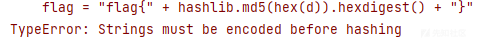
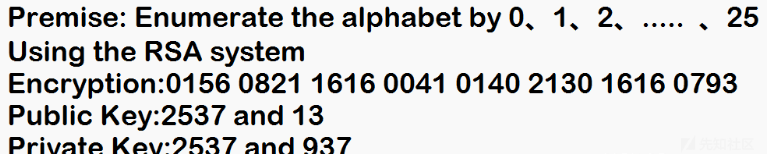
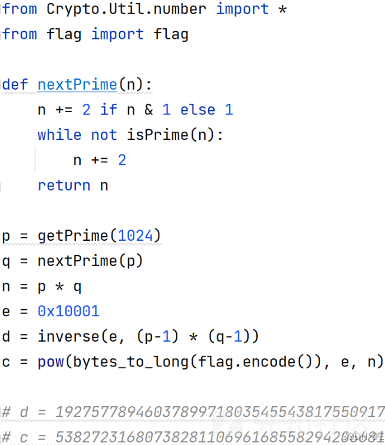
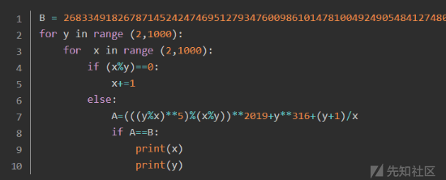
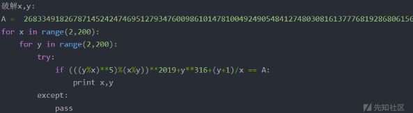

# RSA 系列之基础实战 - 先知社区

RSA 系列之基础实战

- - -

# RSA 系列之基础实战 1

## 导入

从这个系列开始，我将从简单到困难的将 RSA 中的题型不断更新加入此，无论是典型的 dp 泄露为代表计算为主的题型，或是以按行加密的代码理解为主的题型，笔者将尽力整理成册，并辅以自己的理解和总结。希望能帮助到各位读者，若有笔误或其余错误，敬请谅解并联系我更改，共勉。

## 基础知识回顾

（注：熟悉该内容可跳过）

```plain
φ(n):欧拉函数，小于等于 n 的正整数中与 n 互质的数的总数
      1.如果 n 是质数的某一个次方，即 n = p^k (p 为质数，k 为大于等于 1 的整数)，则
         φ(p^k) = p^k - p^(k-1)
     2.如果 n 可以分解成两个互质的整数之积，n = p1 × p2
       则φ(n) = φ(p1p2) = φ(p1)φ(p2)
     3.欧拉定理：如果两个正整数 a 和 n 互质，则 n 的欧拉函数 φ(n) 可以让下面的等式成立：
         a^φ(n)= 1 ( mod n)
       欧拉定理：如果两个正整数 a 和 n 互质，则 n 的欧拉函数 φ(n) 可以让下面的等式成立：
         a^φ(n) ≡ 1 ( mod n)
     4.模反元素：如果两个正整数 a 和 n 互质，那么一定可以找到整数 b，ab 被 n 除的余数是 1
     ab===1(mod n),b 叫做 a 的模反元素

RSA 加密过程
p:质数 q  q:质数 q  n:质数 n=p*q
φ(n)=φ(p*q)=φ(p)φ(q)=(p-1)*(q-1)
e:随机选择一个整数 e，条件是 1< e < φ(n)，且 e 与φ(n) 互质
d:e 对于φ(n) 的模反元素 d 即：ed ≡ 1 (mod φ(n))
(n,e):公钥  (n,d):私钥
m:明文  c:用公钥加密后的密文
     那么，有无可能在已知 n 和 e 的情况下，推导出 d？
       （1）ed≡1 (mod φ(n))。只有知道 e 和φ(n)，才能算出 d。
       （2）φ(n)=(p-1)(q-1)。只有知道 p 和 q，才能算出φ(n)。
       （3）n=pq。只有将 n 因数分解，才能算出 p 和 q。
     结论：如果 n 可以被因数分解，d 就可以算出，也就意味着私钥被破解

    加密要用公钥 (n,e)，m 已知 m*e ≡ c (mod n) 
    加密算出 c，加 密 公 式：m*e ≡ c ( mod n ) → c = m*e – k*n
    解密要用私钥 (n,d)，解密公式：cd ≡ m (mod n)
```

## 例题

### 1.最最基础的 RSA

#### 题目描述：

```plain
N = 101991809777553253470276751399264740131157682329252673501792154507006158434432009141995367241962525705950046253400188884658262496534706438791515071885860897552736656899566915731297225817250639873643376310103992170646906557242832893914902053581087502512787303322747780420210884852166586717636559058152544979471
e = 46731919563265721307105180410302518676676135509737992912625092976849075262192092549323082367518264378630543338219025744820916471913696072050291990620486581719410354385121760761374229374847695148230596005409978383369740305816082770283909611956355972181848077519920922059268376958811713365106925235218265173085
import hashlib
flag = "flag{" + hashlib.md5(hex(d)).hexdigest() + "}"
```

#### 题目分析：

-   由 flag 可知要求出 d
-   又 ed≡1 (mod φ(n))，而φ(n)=(p-1)(q-1)。只有知道 p 和 q，才能算出φ(n)
-   由 N 可通过[分解 n，得 p,q 的网站](http://factordb.com/index.php?query=322831561921859)得到 p 与 q
-   之后通过 d = gmpy2.invert(e,phi) 得到 d
-   解 d 脚本：

```plain
import gmpy2
N = 101991809777553253470276751399264740131157682329252673501792154507006158434432009141995367241962525705950046253400188884658262496534706438791515071885860897552736656899566915731297225817250639873643376310103992170646906557242832893914902053581087502512787303322747780420210884852166586717636559058152544979471
e = 46731919563265721307105180410302518676676135509737992912625092976849075262192092549323082367518264378630543338219025744820916471913696072050291990620486581719410354385121760761374229374847695148230596005409978383369740305816082770283909611956355972181848077519920922059268376958811713365106925235218265173085
p = 9046853915223503351787031888977627106934564043204783593118678181991596316582877057556463152579621699010610569526573031954779520781448550677767565207407183
q = 11273732364123571293429600400343309403733952146912318879993851141423284675797325272321856863528776914709992821287788339848962916204774010644058033316303937
phi = (p-1)*(q-1)
d = gmpy2.invert(e,phi)
print(d)
```

-   但为什么解出 d 后仍得不到 flag？？？
-   [](https://xzfile.aliyuncs.com/media/upload/picture/20240226123902-f76161b6-d460-1.png)

【字符串必须在哈希之前进行编码】

-   所以完整且正确的代码如下：

```plain
import gmpy2
import hashlib
N = 101991809777553253470276751399264740131157682329252673501792154507006158434432009141995367241962525705950046253400188884658262496534706438791515071885860897552736656899566915731297225817250639873643376310103992170646906557242832893914902053581087502512787303322747780420210884852166586717636559058152544979471
e = 46731919563265721307105180410302518676676135509737992912625092976849075262192092549323082367518264378630543338219025744820916471913696072050291990620486581719410354385121760761374229374847695148230596005409978383369740305816082770283909611956355972181848077519920922059268376958811713365106925235218265173085
p = 9046853915223503351787031888977627106934564043204783593118678181991596316582877057556463152579621699010610569526573031954779520781448550677767565207407183
q = 11273732364123571293429600400343309403733952146912318879993851141423284675797325272321856863528776914709992821287788339848962916204774010644058033316303937
phi = (p-1)*(q-1)
d = gmpy2.invert(e,phi)
flag = "flag{" + hashlib.md5(hex(d).encode()).hexdigest() + "}"
print(flag)
# flag{8159e6c4abdd3b94ce461ed9a1a24017}
```

### 2.dp

#### 题目描述：

```plain
e = 65537
n = 156808343598578774957375696815188980682166740609302831099696492068246337198792510898818496239166339015207305102101431634283168544492984586566799996471150252382144148257236707247267506165670877506370253127695314163987084076462560095456635833650720606337852199362362120808707925913897956527780930423574343287847
c = 108542078809057774666748066235473292495343753790443966020636060807418393737258696352569345621488958094856305865603100885838672591764072157183336139243588435583104423268921439473113244493821692560960443688048994557463526099985303667243623711454841573922233051289561865599722004107134302070301237345400354257869
dp = 734763139918837027274765680404546851353356952885439663987181004382601658386317353877499122276686150509151221546249750373865024485652349719427182780275825
```

#### 题目分析：

> c = m^e mod n  
> m = c^d mod n  
> ϕ(n)=(p−1)\*(q−1)  
> d∗e ≡ 1 mod ϕ(n)  
> dp = d mod (p−1)

由上式可以得到

> dp\*e≡d\*e mod (p−1)

因此可以得到

> 式 1：d∗e=k∗(p−1)+dp∗e  
> 式 2：d∗e≡1 mod ϕ(n)

式 1 带入式 2

> \=> k1∗(p−1)+dp∗e ≡1 mod ϕ(n)
> 
> \=> k1∗(p−1)+dp∗e ≡1 mod (p−1)∗(q−1)
> 
> \=> k1∗(p−1)+dp∗e = k2\*(p−1)∗(q−1)+1
> 
> \=> dp\*e = k2\*(p−1)∗(q−1)+1-k1∗(p−1)
> 
> \=> dp\*e = (p-1)\*\[k2\*(q-1)-k1\]+1

因 dp<p−1（dp 是 d//（p-1）的取整，dp<p−1）

所以 e > k2∗(q−1)−k1

再次回到

> dp *e = (p-1)*\[k2\*(q-1)-k1\]+1

假设 x=k2∗(q−1)−k1

那么 x 的范围为 (0,e)

x∗(p−1)+1=dp∗e

枚举 x 求出 p-1，即遍历 (0,e) 的范围，其中肯定有一个 p 可以被 n 整除，那么求出 p 和 q

-   最终运行代码得到 flag{dp\_leaking\_1s\_very\_d@angerous} (嚯！原来题目就是答案啊！)
-   首先我们先看下解题脚本，再进行分析：

```plain
e = 65537
n = 156808343598578774957375696815188980682166740609302831099696492068246337198792510898818496239166339015207305102101431634283168544492984586566799996471150252382144148257236707247267506165670877506370253127695314163987084076462560095456635833650720606337852199362362120808707925913897956527780930423574343287847
c = 108542078809057774666748066235473292495343753790443966020636060807418393737258696352569345621488958094856305865603100885838672591764072157183336139243588435583104423268921439473113244493821692560960443688048994557463526099985303667243623711454841573922233051289561865599722004107134302070301237345400354257869
dp = 734763139918837027274765680404546851353356952885439663987181004382601658386317353877499122276686150509151221546249750373865024485652349719427182780275825
for i in range(1,65535):
    p = (dp*e-1)//i+1
    if n%p == 0:
        q = n//p
        break
# print(p)
# print(q)
phi = (p-1)*(q-1)
d = gmpy2.invert(e,phi)
m = pow(c,d,n)
flag = libnum.n2s(int(m)).decode()
print(flag)
```

-   主要还是这串代码--->

```plain
for i in range(1,65535):
    p = (dp*e-1)//i+1
    if n%p == 0:
        q = n//p
        break
```

### 3.ROLL 按行加密

#### 题目描述：

[](https://xzfile.aliyuncs.com/media/upload/picture/20240226130147-25135882-d464-1.png)

```plain
{920139713,19}

704796792
752211152
274704164
18414022
368270835
483295235
263072905
459788476
483295235
459788476
663551792
475206804
459788476
428313374
475206804
459788476
425392137
704796792
458265677
341524652
483295235
534149509
425392137
428313374
425392137
341524652
458265677
263072905
483295235
828509797
341524652
425392137
475206804
428313374
483295235
475206804
459788476
306220148
```

#### 题目分析：

-   说实话一开始没看懂题目的意思，看完别人的 wp 才知道括号里面的两个数字是 n 与 e ,后面的是拆分的密文 c ,原来题目中的 roll 是利用题中多个 c 滚动拼接 flag 的意思
-   以下是解题代码：

```plain
import libnum
import gmpy2
list1 = [704796792,
752211152,
274704164,
18414022,
368270835,
483295235,
263072905,
459788476,
483295235,
459788476,
663551792,
475206804,
459788476,
428313374,
475206804,
459788476,
425392137,
704796792,
458265677,
341524652,
483295235,
534149509,
425392137,
428313374,
425392137,
341524652,
458265677,
263072905,
483295235,
828509797,
341524652,
425392137,
475206804,
428313374,
483295235,
475206804,
459788476,
306220148]
flag = ''
n = 920139713
e = 19
p = 18443
q = 49891
phi = (p-1)*(q-1)
for i in list1:
    c = i
    d = libnum.invmod(e,phi)
    m = pow(c,d,n)
    # string = libnum.n2s(m) 此两句的作用等同于 flag += chr(m)
    # flag += string.decode()
    flag += chr(m)
print(flag)
```

收获与体会：

-   又了解了一种 rsa 题型 ---> 滚动拼接法求 flag
-   懂了 str.decode() 的意思，即

> string = libnum.n2s(m)  
> flag += string.decode()  
> 此两句的作用等同于  
> flag += chr(m)

### 4.古典 1

#### 题目描述：

[](https://xzfile.aliyuncs.com/media/upload/picture/20240226191308-0554b1f6-d498-1.png)

#### 题目分析：

-   翻译一下可知：

> 前提：用 0、1、2、…..枚举字母表 25  
> 使用 RSA 系统  
> 加密：0156 0821 1616 0041 0140 2130 1616 0793  
> 公钥：2537 和 13  
> 私钥：2537 和 937

-   从提示可以得知 n = 2537 , e = 13 , d = 937
-   分解 n ,可知 p = 43 , q = 59
-   做过 buu RSAROLL 1 便可知道此题大致考的什么
-   里面的“0156 0821 1616 0041 0140 2130 1616 0793”即是 c ,只不过是多个 c ,将解出来的明文拼接在一起便可得到 flag
-   代码如下：

```plain
a = 'abcdefghigklmnopqrstuvwxyz'
p = 43
q = 59
e = 13
d = 937
c = '0156 0821 1616 0041 0140 2130 1616 0793'.split(' ')
flag = ''
n = p*q
for i in c:
    flag += a[pow(int(i),d,n)]
print(flag)
#flag{iloveyou}
```

#### 收获与体会：

-   此题有一个特殊之处，即里面的 c , e , n 都很小，很反常！
-   如果按 buu RSAROLL 这道题来写的话，得不到答案，因为打印 pow(int(i),d,n) 后会得到

> 8  
> 11  
> 14  
> 21  
> 4  
> 24  
> 14  
> 20

一串很小的数字，对应 ascii 码后会得到一些 特别的东西，没有字母也没有数字

-   所以就会想到可能是按照 26 个字母表进行转换，位置一一对应即可转化成功得到 flag
-   所以数字在 1~26 之间就转字母便，大于 26 就转 ascii 码

### 5.共享素数 + 爆破

#### 题目描述：

```plain
import gmpy2
from Crypto.Util.number import getPrime,bytes_to_long

flag=open("flag","rb").read()

p=getPrime(1024)
q=getPrime(1024)
assert(e<100000)
n=p*q
m=bytes_to_long(flag)
c=pow(m,e,n)
print c,n
print pow(294,e,n)

p=getPrime(1024)
n=p*q
m=bytes_to_long("BJD"*32)
c=pow(m,e,n)
print c,n

c1 = 12641635617803746150332232646354596292707861480200207537199141183624438303757120570096741248020236666965755798009656547738616399025300123043766255518596149348930444599820675230046423373053051631932557230849083426859490183732303751744004874183062594856870318614289991675980063548316499486908923209627563871554875612702079100567018698992935818206109087568166097392314105717555482926141030505639571708876213167112187962584484065321545727594135175369233925922507794999607323536976824183162923385005669930403448853465141405846835919842908469787547341752365471892495204307644586161393228776042015534147913888338316244169120
n1 = 13508774104460209743306714034546704137247627344981133461801953479736017021401725818808462898375994767375627749494839671944543822403059978073813122441407612530658168942987820256786583006947001711749230193542370570950705530167921702835627122401475251039000775017381633900222474727396823708695063136246115652622259769634591309421761269548260984426148824641285010730983215377509255011298737827621611158032976420011662547854515610597955628898073569684158225678333474543920326532893446849808112837476684390030976472053905069855522297850688026960701186543428139843783907624317274796926248829543413464754127208843070331063037
_294c = 381631268825806469518166370387352035475775677163615730759454343913563615970881967332407709901235637718936184198930226303761876517101208677107311006065728014220477966000620964056616058676999878976943319063836649085085377577273214792371548775204594097887078898598463892440141577974544939268247818937936607013100808169758675042264568547764031628431414727922168580998494695800403043312406643527637667466318473669542326169218665366423043579003388486634167642663495896607282155808331902351188500197960905672207046579647052764579411814305689137519860880916467272056778641442758940135016400808740387144508156358067955215018
c2 = 979153370552535153498477459720877329811204688208387543826122582132404214848454954722487086658061408795223805022202997613522014736983452121073860054851302343517756732701026667062765906277626879215457936330799698812755973057557620930172778859116538571207100424990838508255127616637334499680058645411786925302368790414768248611809358160197554369255458675450109457987698749584630551177577492043403656419968285163536823819817573531356497236154342689914525321673807925458651854768512396355389740863270148775362744448115581639629326362342160548500035000156097215446881251055505465713854173913142040976382500435185442521721  
n2 = 12806210903061368369054309575159360374022344774547459345216907128193957592938071815865954073287532545947370671838372144806539753829484356064919357285623305209600680570975224639214396805124350862772159272362778768036844634760917612708721787320159318432456050806227784435091161119982613987303255995543165395426658059462110056431392517548717447898084915167661172362984251201688639469652283452307712821398857016487590794996544468826705600332208535201443322267298747117528882985955375246424812616478327182399461709978893464093245135530135430007842223389360212803439850867615121148050034887767584693608776323252233254261047
```

#### 题目分析：

-   从题目中知道 e<100000，比较小，且有多个 n 与 c，且多个 n 共用一个 q，所以想到共享素数，如此便可求到 q，然后得到 p
-   之后 d 也容易得到，最后只剩 e 不知道啦，然而题目中表示 e 较小，直接爆破求出，几个未知数都知道了，那 flag 岂不手到擒来啦！
-   以下是解题代码：

```plain
c1 = 12641635617803746150332232646354596292707861480200207537199141183624438303757120570096741248020236666965755798009656547738616399025300123043766255518596149348930444599820675230046423373053051631932557230849083426859490183732303751744004874183062594856870318614289991675980063548316499486908923209627563871554875612702079100567018698992935818206109087568166097392314105717555482926141030505639571708876213167112187962584484065321545727594135175369233925922507794999607323536976824183162923385005669930403448853465141405846835919842908469787547341752365471892495204307644586161393228776042015534147913888338316244169120
n1 = 13508774104460209743306714034546704137247627344981133461801953479736017021401725818808462898375994767375627749494839671944543822403059978073813122441407612530658168942987820256786583006947001711749230193542370570950705530167921702835627122401475251039000775017381633900222474727396823708695063136246115652622259769634591309421761269548260984426148824641285010730983215377509255011298737827621611158032976420011662547854515610597955628898073569684158225678333474543920326532893446849808112837476684390030976472053905069855522297850688026960701186543428139843783907624317274796926248829543413464754127208843070331063037
_294c = 381631268825806469518166370387352035475775677163615730759454343913563615970881967332407709901235637718936184198930226303761876517101208677107311006065728014220477966000620964056616058676999878976943319063836649085085377577273214792371548775204594097887078898598463892440141577974544939268247818937936607013100808169758675042264568547764031628431414727922168580998494695800403043312406643527637667466318473669542326169218665366423043579003388486634167642663495896607282155808331902351188500197960905672207046579647052764579411814305689137519860880916467272056778641442758940135016400808740387144508156358067955215018
c2 = 979153370552535153498477459720877329811204688208387543826122582132404214848454954722487086658061408795223805022202997613522014736983452121073860054851302343517756732701026667062765906277626879215457936330799698812755973057557620930172778859116538571207100424990838508255127616637334499680058645411786925302368790414768248611809358160197554369255458675450109457987698749584630551177577492043403656419968285163536823819817573531356497236154342689914525321673807925458651854768512396355389740863270148775362744448115581639629326362342160548500035000156097215446881251055505465713854173913142040976382500435185442521721  
n2 = 12806210903061368369054309575159360374022344774547459345216907128193957592938071815865954073287532545947370671838372144806539753829484356064919357285623305209600680570975224639214396805124350862772159272362778768036844634760917612708721787320159318432456050806227784435091161119982613987303255995543165395426658059462110056431392517548717447898084915167661172362984251201688639469652283452307712821398857016487590794996544468826705600332208535201443322267298747117528882985955375246424812616478327182399461709978893464093245135530135430007842223389360212803439850867615121148050034887767584693608776323252233254261047

import gmpy2
import libnum
# n1 和 n2 公用了一个 q 用 gcd 欧几里得算法求得 q
p = gmpy2.gcd(n1,n2)
q = n1//p
print(p)
phi = (q-1)*(p-1)
# 此时知道 e 即可解题 因为我们知道 pow(294,e,n) 还知道 e 的范围所以可以爆破 e
for i in range(100000):
    if pow(294,i,n1) == _294c:
        e = i
        break

d = gmpy2.invert(e,phi)
m = pow(c1,d,n1)
print(libnum.n2s(int(m)))
# b'BJD{p_is_common_divisor}'
```

### 6.位数之谜

#### 题目描述：

[](https://xzfile.aliyuncs.com/media/upload/picture/20240226191609-71345aa2-d498-1.png)

#### 题目分析：

-   首先明确两个公式：

```plain
e*d = 1 mod (p-1)(q-1)
ed1 = e*d - 1 = k(p-1)(q-1)
```

-   想要解出此题，我们必须知道 n，而要知道 n，我们要知道 p 和 q 的值
-   通过 e\*d 的计算，我们知道其长度为 2064 位，而生成 p 的条件为 getPrime(1024)，所以（p-1)（q-1）应该为 2048 位

> 此处所说的位数长度是以 Bit 为单位，加一减一都不影响位数，相乘的话即为位数相加，这些性质记住就好，以下是计算代码：

```plain
from Crypto.Util.number import *
e = 65537 # 转二进 e = 0b10000000000000001，直接数得到长度为 17
d = 19275778946037899718035455438175509175723911466127462154506916564101519923603308900331427601983476886255849200332374081996442976307058597390881168155862238533018621944733299208108185814179466844504468163200369996564265921022888670062554504758512453217434777820468049494313818291727050400752551716550403647148197148884408264686846693842118387217753516963449753809860354047619256787869400297858568139700396567519469825398575103885487624463424429913017729585620877168171603444111464692841379661112075123399343270610272287865200880398193573260848268633461983435015031227070217852728240847398084414687146397303110709214913
print(gmpy2.bit_length(e*d))
# 2064
p = getPrime(1024)
print(gmpy2.bit_length(p))
# 1024
print(gmpy2.bit_length(p-1))
# 1024
```

-   又 ed1 = e\*d - 1 = k(p-1)(q-1)，2064-2048 = 16，所以 k 值必在 pow(2,15) 至 pow(2,16) 之间（想知道为什么看结尾的知识总结，此处专注解题，不深层探究）
-   所以，我们可以利用此条件暴力求解 k 值，从而求出 (p-1)\*(q-1),间接求出 p 和 q 的值
-   那如何间接法呢？
-   首先我们求得了 (p-1)*(q-1),而 p 和 q 是两个相邻的质数，所以我们可以使用 sympy 库对 p,q 进行求解。思路为先对 (p-1)*(q-1) 开方，再求得大于开方所得数和小于开方所得数的质数

```plain
p = sympy.prevprime(gmpy2.iroot((e*d-1)//i,2)[0])
q = sympy.nextprime(p)
```

-   其中 sympy.prevprime(x) 是求小于 x 最近的质数，sympy.nextprime(x) 是求大于 x 最近的质数。
-   解题代码如下：

```plain
import gmpy2
from Crypto.Util.number import long_to_bytes
import sympy
# e = 0x10001
e = 65537
d = 19275778946037899718035455438175509175723911466127462154506916564101519923603308900331427601983476886255849200332374081996442976307058597390881168155862238533018621944733299208108185814179466844504468163200369996564265921022888670062554504758512453217434777820468049494313818291727050400752551716550403647148197148884408264686846693842118387217753516963449753809860354047619256787869400297858568139700396567519469825398575103885487624463424429913017729585620877168171603444111464692841379661112075123399343270610272287865200880398193573260848268633461983435015031227070217852728240847398084414687146397303110709214913
c = 5382723168073828110696168558294206681757991149022777821127563301413483223874527233300721180839298617076705685041174247415826157096583055069337393987892262764211225227035880754417457056723909135525244957935906902665679777101130111392780237502928656225705262431431953003520093932924375902111280077255205118217436744112064069429678632923259898627997145803892753989255615273140300021040654505901442787810653626524305706316663169341797205752938755590056568986738227803487467274114398257187962140796551136220532809687606867385639367743705527511680719955380746377631156468689844150878381460560990755652899449340045313521804
p = 0
q = 0

for k in range(pow(2,15),pow(2,16)):
    #  pow(x,y) ---> x 的 y 次方
    #  pow(x,y,z) ---> x 的 y 次方后，取余 z
    if (e*d-1)%k == 0:
        p = sympy.prevprime(gmpy2.iroot((e*d-1)//k,2)[0])
        # sympy.prevprime(x) 是求大于 x 最近的质数
        # iroot(x,n) ---> x 开 n 次根 ,返回值有两个，前一个是开方出来的整数部分，后一个是能否开出来，若能则为 true，不能则为 flase
        q = sympy.nextprime(p)
        # sympy.nextprime(x) 是求小于 x 最近的质数
        if (p-1)*(q-1) == (e*d-1)//k:
            break

n = p*q
m = pow(c,d,n)
m1 = long_to_bytes(m)
print(m1)
#flag{70u2_nn47h_14_v3ry_gOO0000000d}
```

收获与体会：

-   了解了一些字节的相关知识
-   知道了函数 sympy.prevprime(x) 和 sympy.nextprime(x) 的相关知识

> sympy.prevprime(x) 是求小于 x 最近的质数  
> sympy.nextprime(x) 是求大于 x 最近的质数

-   回顾了 iroot(x,n) 和 pow(x,y) 的相关知识

> iroot(x,n) ---> x 开 n 次根，返回值有两个，前一个是开方出来的整数部分，后一个是能否开出来，若能则为 true，不能则为 flase  
> pow(x,y) ---> x 的 y 次方  
> pow(x,y,z) ---> x 的 y 次方后，取余 z

### 7.威尔逊

#### 题目描述：

```plain
import sympy
import random

def myGetPrime():
    A= getPrime(513)
    print(A)
    B=A-random.randint(1e3,1e5)
    print(B)
    return sympy.nextPrime((B!)%A)
p=myGetPrime()
#A1=21856963452461630437348278434191434000066076750419027493852463513469865262064340836613831066602300959772632397773487317560339056658299954464169264467234407
#B1=21856963452461630437348278434191434000066076750419027493852463513469865262064340836613831066602300959772632397773487317560339056658299954464169264467140596

q=myGetPrime()
#A2=16466113115839228119767887899308820025749260933863446888224167169857612178664139545726340867406790754560227516013796269941438076818194617030304851858418927
#B2=16466113115839228119767887899308820025749260933863446888224167169857612178664139545726340867406790754560227516013796269941438076818194617030304851858351026

r=myGetPrime()

n=p*q*r
#n=85492663786275292159831603391083876175149354309327673008716627650718160585639723100793347534649628330416631255660901307533909900431413447524262332232659153047067908693481947121069070451562822417357656432171870951184673132554213690123308042697361969986360375060954702920656364144154145812838558365334172935931441424096270206140691814662318562696925767991937369782627908408239087358033165410020690152067715711112732252038588432896758405898709010342467882264362733
c=pow(flag,e,n)
#e=0x1001
#c=75700883021669577739329316795450706204502635802310731477156998834710820770245219468703245302009998932067080383977560299708060476222089630209972629755965140317526034680452483360917378812244365884527186056341888615564335560765053550155758362271622330017433403027261127561225585912484777829588501213961110690451987625502701331485141639684356427316905122995759825241133872734362716041819819948645662803292418802204430874521342108413623635150475963121220095236776428
#so,what is the flag?
```

#### 题目分析：

-   首先我们先看到 n = p *q* r（n 分解成了三个素数） ,而 e,c 都知道，所以要求明文 m = pow(c,d,n) 先要求出 d 来
-   而 d = gmpy2.invert(e,phi)
-   其中欧拉函数 phi = (p-1) *(q-1)* (r-1)
-   所以要求 d ,那么要求出 p 与 q
-   代码中 p = myGetPrime() = sympy.nextPrime((B!)%A)

> sympy.nextprime(x) 是求大于 x 最近的质数

-   所以最终要求 (B!)%A，即 B 的阶乘模 A，其中 A,B 都知道，那么 B!（B 的阶乘）怎么求呢？
-   有一个定理可以解决这个问题，即 威尔逊定理

威尔逊定理

> 当且仅当 p 为素数时：( p -1 ) ! ≡ -1 ( mod p ) ---> (p-1) ! +1=0 (mod p)

-   A = getPrime(513)，可知 A 为素数，又 B=A-random.randint(1e3,1e5)，通过威尔逊定理，可知 (A-1) ! +1≡0 (mod A)，故 B!(B+1)(B+2)…(A-1) ≡ -1 (mod A)，即 B! \* C = ≡ -1 ( mod A )，其中 C = (A - 1)! / (B) !，也就是 B 之后的数字之积  
    两边同时乘上 C 的逆元 C1\*(C \* C1 = 1)，B ! = -1 \* C1(mod A1)
-   B ! 求出来了，那么 p = myGetPrime() = sympy.nextPrime((B!)%A) 也就求出来了
-   如此，p,q 都求出来了，r = n // (p \* q) ,自此 p,q,r，都求出来了，最终 flag 也就出来了
-   代码如下：

```plain
import libnum
import sympy
import gmpy2

A1=21856963452461630437348278434191434000066076750419027493852463513469865262064340836613831066602300959772632397773487317560339056658299954464169264467234407
B1=21856963452461630437348278434191434000066076750419027493852463513469865262064340836613831066602300959772632397773487317560339056658299954464169264467140596
A2=16466113115839228119767887899308820025749260933863446888224167169857612178664139545726340867406790754560227516013796269941438076818194617030304851858418927
B2=16466113115839228119767887899308820025749260933863446888224167169857612178664139545726340867406790754560227516013796269941438076818194617030304851858351026
n=85492663786275292159831603391083876175149354309327673008716627650718160585639723100793347534649628330416631255660901307533909900431413447524262332232659153047067908693481947121069070451562822417357656432171870951184673132554213690123308042697361969986360375060954702920656364144154145812838558365334172935931441424096270206140691814662318562696925767991937369782627908408239087358033165410020690152067715711112732252038588432896758405898709010342467882264362733
# e=0x1001，转十进制
e = 4097
c=75700883021669577739329316795450706204502635802310731477156998834710820770245219468703245302009998932067080383977560299708060476222089630209972629755965140317526034680452483360917378812244365884527186056341888615564335560765053550155758362271622330017433403027261127561225585912484777829588501213961110690451987625502701331485141639684356427316905122995759825241133872734362716041819819948645662803292418802204430874521342108413623635150475963121220095236776428
def mydecryp(A,B):
    C1 = 1
    temp = pow(-1,1,A) # temp=-1 mod A
    for i in range(B+1,A):
        C1 = (C1*gmpy2.invert(i,A))%A # C1 是从 B+1~A 中每个数对 A 的逆元的乘积
    return sympy.nextprime((C1*temp)%A) # (C1*temp) = B!， (C1*temp)%A = (B!)%A

p = mydecryp(A1,B1)
q = mydecryp(A2,B2)
r = n//p//q
phi = (p-1)*(q-1)*(r-1)
d = gmpy2.invert(e,phi)
m = pow(c,d,n)
print(libnum.n2s(int(m)))
#flag{wm-CongrAtu1ation4-1t4-ju4t-A-bAby-R4A}
```

### 8.方程计算

#### 题目描述：

```plain
A=(((y%x)**5)%(x%y))**2019+y**316+(y+1)/x
p=next_prime(z*x*y)
q=next_prime(z)
A =  2683349182678714524247469512793476009861014781004924905484127480308161377768192868061561886577048646432382128960881487463427414176114486885830693959404989743229103516924432512724195654425703453612710310587164417035878308390676612592848750287387318129424195208623440294647817367740878211949147526287091298307480502897462279102572556822231669438279317474828479089719046386411971105448723910594710418093977044179949800373224354729179833393219827789389078869290217569511230868967647963089430594258815146362187250855166897553056073744582946148472068334167445499314471518357535261186318756327890016183228412253724
n =  117930806043507374325982291823027285148807239117987369609583515353889814856088099671454394340816761242974462268435911765045576377767711593100416932019831889059333166946263184861287975722954992219766493089630810876984781113645362450398009234556085330943125568377741065242183073882558834603430862598066786475299918395341014877416901185392905676043795425126968745185649565106322336954427505104906770493155723995382318346714944184577894150229037758434597242564815299174950147754426950251419204917376517360505024549691723683358170823416757973059354784142601436519500811159036795034676360028928301979780528294114933347127
c =  41971850275428383625653350824107291609587853887037624239544762751558838294718672159979929266922528917912189124713273673948051464226519605803745171340724343705832198554680196798623263806617998072496026019940476324971696928551159371970207365741517064295956376809297272541800647747885170905737868568000101029143923792003486793278197051326716680212726111099439262589341050943913401067673851885114314709706016622157285023272496793595281054074260451116213815934843317894898883215362289599366101018081513215120728297131352439066930452281829446586562062242527329672575620261776042653626411730955819001674118193293313612128
```

#### 题目分析：

-   这题看了别人写的题解，知道了两种不同的解题方法
-   第一种是契合题目所给字母，先通过爆破求出 x,y，但奇怪的是我用 pycharm 重写了一遍他们的代码，都出现了报错：  
    [](https://xzfile.aliyuncs.com/media/upload/picture/20240226192321-72b0e76e-d499-1.png)  
    [](https://xzfile.aliyuncs.com/media/upload/picture/20240226192334-7a556c2e-d499-1.png)
    
-   上面两种一个是报错，一个是直接结束程序，反正都求不出 x,y（我也求不出）
    
-   所以尝试了另外一种方法：直接爆破求 e,（p,q 可以通过 n 分解得到），所以字母都求出来了，那么最后答案也就差不多了，代码如下：

```plain
from Crypto.Util.number import *
A = 2683349182678714524247469512793476009861014781004924905484127480308161377768192868061561886577048646432382128960881487463427414176114486885830693959404989743229103516924432512724195654425703453612710310587164417035878308390676612592848750287387318129424195208623440294647817367740878211949147526287091298307480502897462279102572556822231669438279317474828479089719046386411971105448723910594710418093977044179949800373224354729179833393219827789389078869290217569511230868967647963089430594258815146362187250855166897553056073744582946148472068334167445499314471518357535261186318756327890016183228412253724
n = 117930806043507374325982291823027285148807239117987369609583515353889814856088099671454394340816761242974462268435911765045576377767711593100416932019831889059333166946263184861287975722954992219766493089630810876984781113645362450398009234556085330943125568377741065242183073882558834603430862598066786475299918395341014877416901185392905676043795425126968745185649565106322336954427505104906770493155723995382318346714944184577894150229037758434597242564815299174950147754426950251419204917376517360505024549691723683358170823416757973059354784142601436519500811159036795034676360028928301979780528294114933347127
c = 41971850275428383625653350824107291609587853887037624239544762751558838294718672159979929266922528917912189124713273673948051464226519605803745171340724343705832198554680196798623263806617998072496026019940476324971696928551159371970207365741517064295956376809297272541800647747885170905737868568000101029143923792003486793278197051326716680212726111099439262589341050943913401067673851885114314709706016622157285023272496793595281054074260451116213815934843317894898883215362289599366101018081513215120728297131352439066930452281829446586562062242527329672575620261776042653626411730955819001674118193293313612128
p = 842868045681390934539739959201847552284980179958879667933078453950968566151662147267006293571765463137270594151138695778986165111380428806545593588078365331313084230014618714412959584843421586674162688321942889369912392031882620994944241987153078156389470370195514285850736541078623854327959382156753458569
q = 139916095583110895133596833227506693679306709873174024876891023355860781981175916446323044732913066880786918629089023499311703408489151181886568535621008644997971982182426706592551291084007983387911006261442519635405457077292515085160744169867410973960652081452455371451222265819051559818441257438021073941183

for i in range(2,100000): # 此时的 i 即为 e
    if isPrime(i): # 判断 i 是否为素数
        try:
            d = gmpy2.invert(i,(p-1)*(q-1))
            m = pow(c,d,n)
            flag = libnum.n2s(int(m)) # 此时 type(flag) = <class 'bytes'>,所以下面要转字符串，一开始没转字符串报错，所以才会想到这里
            if 'CTF' in str(flag) or 'flag' in str(flag):
                print(flag,'\n',i)
        except ZeroDivisionError:
            continue
            #flag{wm-l1l1ll1l1l1l111ll}，e = 65537
```

#### 收获与体会：

-   真是巧了，e = 65537
-   所以如果以后要求 e 来求 flag 的，我们可以先大胆令 e = 65537 来试一下，没准就瞎猫碰上死耗子，答案就出来了，省时还省力（但遇上这种题的可能性确实挺小的）

## 知识总结：

### 1.

当出现多个 c（并没有多个 n）则想到拼接法。若每个 c 相对偏小，那么就意味着求出的 m 相对偏小，若 m <= 26 则想到对应 26 个字母表，若 m > 26，则直接 flag += chr(m)

### 2.

> sympy.prevprime(x) 是求小于 x 最近的质数  
> sympy.nextprime(x) 是求大于 x 最近的质数

### 3.

encode(),decode() 相关小知识

encode() 方法以指定的编码格式编码字符串，默认编码为‘utf-8’。

对应的解码方法：bytes [decode](https://so.csdn.net/so/search?q=decode&spm=1001.2101.3001.7020)() 方法，bytes:字节。该方法返回编码后的字符串，它是一个 bytes 对象实例

bytes 通过 decode（）转换为 str（字符串）

str 通过 encode（）转换为 bytes（二进制）

在 python3 中，encode（）和 decode（）默认使用 UTF-8

```plain
print('你好'.encode('utf-8'))
# b'\xe4\xbd\xa0\xe5\xa5\xbd' (转为二进制形式)

print(b'\xe4\xbd\xa0\xe5\xa5\xbd'.decode())
# 你好 (转为字符串形式)

print('passport'.encode('utf-8'))
# b'passport'

print(b'passport'.decode())
# passport
```

### 4.

b2a\_hex(data)，a2b\_hex(hexstr)，hexlify(data)，unhexlify(hexstr) 相关知识

-   b2a\_hex(data) = hexlify(data)：  
    返回二进制数据的十六进制表示。每个字节被转换成相应的 2 位十六进制表示形式。因此，得到的字符串是是原数据长度的两倍。
    
-   a2b\_hex(hexstr) = unhexlify(hexstr)：  
    从十六进制字符串 hexstr 返回二进制数据。是 b2a\_hex 的逆向操作。hexstr 必须包含偶数个十六进制数字（可以是大写或小写），否则报 TypeError。
    
-   例如：

```plain
b = binascii.b2a_hex('woker'.encode()) # 0x4244 2 进制数据转 16 进制  
c = binascii.a2b_hex('0x4244'.encode()) # woker 16 进制转二进制数据
```

### 5.

当出现多个 c（并没有多个 n）则想到拼接法。若每个 c 相对偏小，那么就意味着求出的 m 相对偏小，则直接 flag += chr(m)

### 6.

出现多个 n 与 c，若 e 很小（小于 100），则考虑低加密指数攻击，若 e 相对较小（小于 100000）则可想到 n 之间不互素的情况
