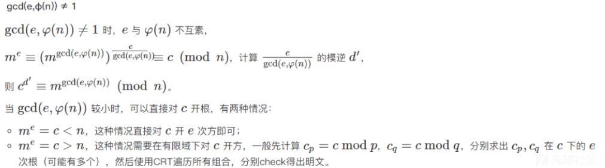
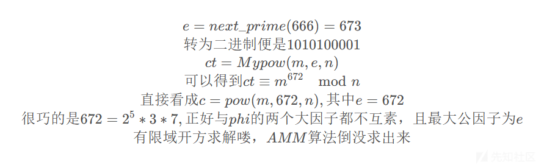
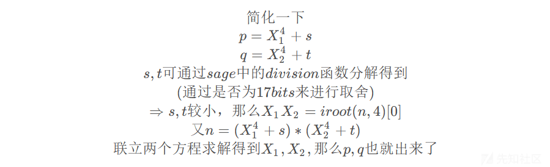

# RSA 系列解题研究——e 与 phi 不互素 - 先知社区

RSA 系列解题研究——e 与 phi 不互素

- - -

（注：AMM 算法代码仅为补充，不为重点）

# 题一 (\[MoeCTF2022\]signin)

### 题目描述：

```plain
from Crypto.Util.number import *
from secret import flag
m=bytes_to_long(flag)
p=getPrime(512)
q=getPrime(512)
print('p=',p)
print('q=',q)
n=p*q
e=65537
c=pow(m,e,n)
print('c=',c)
#p= 12408795636519868275579286477747181009018504169827579387457997229774738126230652970860811085539129972962189443268046963335610845404214331426857155412988073
#q= 12190036856294802286447270376342375357864587534233715766210874702670724440751066267168907565322961270655972226761426182258587581206888580394726683112820379
#c= 68960610962019321576894097705679955071402844421318149418040507036722717269530195000135979777852568744281930839319120003106023209276898286482202725287026853925179071583797231099755287410760748104635674307266042492611618076506037004587354018148812584502385622631122387857218023049204722123597067641896169655595
```

### 题目分析：

-   首先 e = gcd(e,phi) = 65537，所以用常规的不互素题方法做不出来，求 gcd(e,(p-1)) 和 gcd(e,(q-1))，发现 e 与 p-1 互素。而我们都知道有以下公式：
    
    > m = c ^ d mod n  
    > \==>  
    > m = c ^ d mod p  
    > m = c ^ d mod q  
    > (注：此推论满足的前提是------在 c 不是 p 或 q 的倍数，以及 d 是正整数的情况下，m = c ^ d modp 和 m = c ^ d modq 总是成立的，有兴趣的同志们可以自行查找推导过程，这里就不过多说了)
    
    故可以使用以下代码：  
    d = invert(e,p-1)  
    m = pow(c,d,p)
    
-   解题代码如下：

```plain
from Crypto.Util.number import *
import gmpy2

p= 12408795636519868275579286477747181009018504169827579387457997229774738126230652970860811085539129972962189443268046963335610845404214331426857155412988073
q= 12190036856294802286447270376342375357864587534233715766210874702670724440751066267168907565322961270655972226761426182258587581206888580394726683112820379
c= 68960610962019321576894097705679955071402844421318149418040507036722717269530195000135979777852568744281930839319120003106023209276898286482202725287026853925179071583797231099755287410760748104635674307266042492611618076506037004587354018148812584502385622631122387857218023049204722123597067641896169655595
e=65537
n = p * q
phi = (p-1)
print(gmpy2.gcd(e,phi))
d = gmpy2.invert(e,phi)
m = pow(c,d,p)
print(long_to_bytes(m))
```

-   得到：moectf{Oh~Now\_Y0u\_Kn0W\_HoW\_RsA\_W0rkS!}
    
    AMM 算法求解：
    

```plain
# sage:
import random
import time
from tqdm import tqdm
from Crypto.Util.number import *
# About 3 seconds to run
def AMM(o, r, q):
    start = time.time()
    print('\n----------------------------------------------------------------------------------')
    print('Start to run Adleman-Manders-Miller Root Extraction Method')
    print('Try to find one {:#x}th root of {} modulo {}'.format(r, o, q))
    g = GF(q)
    o = g(o)
    p = g(random.randint(1, q))
    while p ^ ((q-1) // r) == 1:
        p = g(random.randint(1, q))
    print('[+] Find p:{}'.format(p))
    t = 0
    s = q - 1
    while s % r == 0:
        t += 1
        s = s // r
    print('[+] Find s:{}, t:{}'.format(s, t))
    k = 1
    while (k * s + 1) % r != 0:
        k += 1
    alp = (k * s + 1) // r
    print('[+] Find alp:{}'.format(alp))
    a = p ^ (r**(t-1) * s)
    b = o ^ (r*alp - 1)
    c = p ^ s
    h = 1
    for i in range(1, t):
        d = b ^ (r^(t-1-i))
        if d == 1:
            j = 0
        else:
            print('[+] Calculating DLP...')
            j = - discrete_log(d, a)
            print('[+] Finish DLP...')
        b = b * (c^r)^j
        h = h * c^j
        c = c^r
    result = o^alp * h
    end = time.time()
    print("Finished in {} seconds.".format(end - start))
    print('Find one solution: {}'.format(result))
    return result

def onemod(p,r): 
    t=random.randint(2,p)
    while pow(t,(p-1)//r,p)==1: 
         t=random.randint(2,p)
    return pow(t,(p-1)//r,p) 

def solution(p,root,e):  
    while True:
        g=onemod(p,e) 
        may=[] 
        for i in tqdm(range(e)): 
            may.append(root*pow(g,i,p)%p)
        if len(may) == len(set(may)):
            return may


def solve_in_subset(ep,p):
    cp = int(pow(c,inverse(int(e//ep),p-1),p))
    com_factors = []
    while GCD(ep,p-1) !=1:
        com_factors.append(GCD(ep,p-1))
        ep //= GCD(ep,p-1)
    com_factors.sort()

    cps = [cp]
    for factor in com_factors:
        mps = []
        for cp in cps:
            mp = AMM(cp, factor, p)
            mps += solution(p,mp,factor)
        cps = mps
    for each in cps:
        assert pow(each,e,p)==c%p
    return cps

e = 65537
p= 12408795636519868275579286477747181009018504169827579387457997229774738126230652970860811085539129972962189443268046963335610845404214331426857155412988073
q= 12190036856294802286447270376342375357864587534233715766210874702670724440751066267168907565322961270655972226761426182258587581206888580394726683112820379
c= 68960610962019321576894097705679955071402844421318149418040507036722717269530195000135979777852568744281930839319120003106023209276898286482202725287026853925179071583797231099755287410760748104635674307266042492611618076506037004587354018148812584502385622631122387857218023049204722123597067641896169655595
n = p*q

m_p = solve_in_subset(1,p)
m_q = solve_in_subset(e,q)

for mpp in m_p:
    for mqq in m_q: 
        m = crt([int(mpp),int(mqq)],[p,q])
        flag = long_to_bytes(m)
        if b'ctf' in flag:
            print(flag)
            break 

# moectf{Oh~Now_Y0u_Kn0W_HoW_RsA_W0rkS!}
```

# 题二 (unusualrsa5)

### 题目描述：

```plain
from Crypto.Util.number import bytes_to_long
from secret import flag

e = 0x14
p = 733089589724903586073820965792963746076789390539824437962807679954808310072656817423828613938510684864567664345751164944269489647964227519307980688068059059377123391499328155025962198363435968318689113750910755244276996554328840879221120846257832190569086861774466785101694608744384540722995426474322431441
q = 771182695213910447650732428220054698293987458796864628535794956332865106301119308051373568460701145677164052375651484670636989109023957702790185901445649197004100341656188532246838220216919835415376078688888076677350412398198442910825884505318258393640994788407100699355386681624118606588957344077387058721
n = p*q

m = bytes_to_long(flag)
c = pow(m,e,n)
print(c)

#406314720119562590605554101860453913891646775958515375190169046313074168423687276987576196367702523895650602252851191274766072774312855212771035294337840170341052016067631007495713764510925931612800335613551752201920460877432379214684677593342046715833439574705829048358675771542989832566579493199671622475225225451781214904100440695928239014046619329247750637911015313431804069312072581674845078940868349474663382442540424342613429896445329365750444298236684237769335405534090013035238333534521759502103604033307768304224154383880727399879024077733935062478113298538634071453067782212909271392163928445051705642
```

### 题目分析：

-   首先 e = gcd(e,phi) = 20 ,发现 gcd(e,(p - 1)) = gcd(e,(q - 1)) = e = 20，这里用到了有限域开方的知识（hint 中提示了这一点）

[](https://xzfile.aliyuncs.com/media/upload/picture/20240228120221-2c052680-d5ee-1.png)

> 解析一下求根算法：

```plain
R.<x> = Zmod(p)[]
f = x ^ e - c
f = f.monic()
res1 = f.roots()
'''
这段代码是在 Sage 数学软件中运行的，用于求解一个在模质数 p 意义下的方程 x^e=c 的解。

代码定义了一个多项式环 R，请注意 R.<x> = Zmod(p)[] 这一句。这里 R 表示多项式环的名称，<x> 表示所定义的环中的变量名是 x，而 Zmod(p)[] 表示在模 p 的意义下定义了一个多项式。其中每个多项式的系数都是 p 的倍数，以确保在模 p 的意义下进行运算时不会出现浮点运算精度的问题。

接下来，代码定义了一个多项式 f = x^e - c。变量 c 和 e 在代码中的定义可能来自其他地方。通过将这个方程的领导系数归一化，再去除它，这个多项式被调整为 monic 的形式，并被保存在变量 f 中，以便计算方程的根。

接下来，代码再次调用了多项式 f 的 roots() 方法，这一次将得到方程的一个根的列表。具体地，最终生成的变量 res1 是多项式 f 在模 p 意义下的根列表。注意，如果方程没有解，则 res1 变量将为空列表。
'''
```

-   以下为所有情况：

[](https://xzfile.aliyuncs.com/media/upload/picture/20240228120257-4160b0f8-d5ee-1.png)

```plain
说明一下为什么会出现以上形式的结果：

这段代码通过调用 `f.roots()` 的方法，返回一个列表，列表中包含了方程 f(x)=x^e-c 在模 p 的意义下的所有根。

其中每个元素是一个二元组，第一个元素是方程的一个根，第二个元素为 1，表示该根的重数 (即此根的数量)。

列表中的每个元素的格式为 `(a,1)`，其中`a`是方程 x^e - c 在模 p 下的一个解。

在此二元组表示中，1 表示多重根，即该解在方程中的出现次数。

注意，列表中的根的数量可能与实际解的数量不同，因为有可能存在重复的根或者某些“假的”根。同时，注意到这是调用 Sage 的内建方法，其他代数软件实现的语法和精度亦有所不同。
```

```plain
res1= [(733089589724903586073820965792963746076789390539824437962807679954808310072656817423828613938510684864567664345751164944269489647964227519307980688068059059377123391499328155021524914773359906357153671313308407478602554319510265005085762860382683102940576377254668898119652133942180899304170329371707150164, 1), (678923693209704969852381465896650019425870260030383443168808423368601278880685781654734919678958092826800695579102973572447355792679848485826507692704568923813419881117766044423608229711484763917744685055881596752291255735808048270822124796786471676188662798449644642235738223466855946913879538299578053411, 1), (660147311087779881169338548239431864756054612093222666998714749603875812596923472248793683967669014397990139199125982652383529516284367882454604795633984744310817735291839918294987220579419849435923577095190063747058566440604560174772236817980884692508913814109640678513633481822665261866470516425285518285, 1), (656681791452498481654878002485070757012861926668381629152705461263764608739765714942200770232734120738697878503189820956143274111419030898383980731253182784661086554234440727684677249747860741931943770929571071514986737487620545162638141249825931408013949005076717924474881049785216136013509251488319927117, 1), (561634200460522548441571592444405305656486299630777500288946777401428565675621685143645766539546494757183424411676233243328896459121008394512864385381461601416842364770773986015469061716463481506742063309940039220834724151367845375195245551456554735236102965922407472562800115189890526203678874326289793386, 1), (523855729860851889306276946831707325654966799659419971520448260469324992736982246556398347232993411720682146837875080052611076416766800095923505800210207882786055877101711481659849019405604591067848093320332336464705973049736439281995689523942160283871387832933740244138033780213828909573276367363492479416, 1), (452900182350324645394395847267638113925741103910755278893324277011525974119646860179890955142636700494806732282459985420380030145373473199426467982810188731584443697329277404941404099390850352429776960314100205943189386609329123884794268027928641499784873014598307047385649837271871153730516499924907326391, 1), (416370840270302176660974325650517943145426999919261282193286142404178655729051589183139277588858670001090144796272169390365633208042166264602215868369443740484308138194802614266542495845026116458981772823239562965336426568684608791041112836390368657079922805426770894892558562813602601339340032501607476909, 1), (415121711750653986259101201654940133924221603939397750124825760079422401181007421592643535836083617458305454708658832229662210103019264900837109397638935012953657209660214900590221340670067523952418432762094850952735077742516293665730069986289396136048668366129437705942925977098013178518939090064725293698, 1), (374350165605081425148746685793120637325474206554845188409530082476947889392734021316375944344139500560536749012063348621966245700071777272257861879442907414106249944743486841972083642001920163764631575788319343002998139757149039708713099627493777332364552928705440787113844863245759659045732547084424923730, 1), (358739424119822160925074279999843108751315183984979249553277597477860420679922796107452669594371184304030915333687816322303243947892450247050118808625151645270873446755841313053878556361515804554057537962591412241278856797179801170508021218764054858204533933069025997987849745498624881677262879389897507711, 1), (317967877974249599814719764138023612152567786600426687837981919875385908891649395831185078102427067406262209637092332714607279544944962618470871290429124046423466181839113254435740857693368444366270680988815904291541918811812547213491050859968436054520418495645029079158768631646371362204056336409597137743, 1), (316718749454601409412846640142445802931362390620563155769521537550629654343605228240689336349652014863477519549478995553903856439922061254705764819698615318892815253304525540759419702518409851859707340927671192278940569985644232088180008009867463533489164056347695890209136045930781939383655393972714954532, 1), (280189407374578940679425118525325632151048286629069159069483402943282335953009957243937658795873984369760932063291179523889459502590754319881512705257870327792679694170050750084558098972585615888912153436810549301087609944999716994426852818329190690784213847176159737716044771472513386992478926549415105050, 1), (209233859864051696767544018961256420421822590880404466442359419485483317335674570867430266705517273143885517507876084891658413231197427423384474887857851176591067514397616673366113178957831377250841020430578418779571023504592401597225431322315671906697699028840726540963660828530555631149719059110829952025, 1), (171455389264381037632249373348558440420303090909046937673860902553379744397035132280182847398964190107384239934074931700940593188843219124795116302686597457960281026728554169010493136646972486811947050440970716023442272402960995504025875294801277455332983895852059312538894493554494014519316552148032638055, 1), (76407798272405104418942963307892989063927463871442808810102218691043701332891102481627843705776564125869785842561343988126215536545196620923999956814876274716036837264887427341284948615575226386745342821339683729290259066708295716582979596431900782555137856697748860626813558959168404709486174986002504324, 1), (72942278637123704904482417553531881320734778446601770964092930350932497475733345175034929970841670466577525146625182291885960131679859636853375892434074315066305656207488236730974977784016118882765536655720691497218430113724280704448884028276947498060173047664826106588061126921719278856524910049036913156, 1), (54165896515198616221439499896313726650919130509440994793999256586207031191971035769093694259552592037766968766648191371822133855284379033481472995363490135563703510381562110602353968651951204400944428695029158491985740818520792608398996049471360514380424063324822142865956385277528593809115888174744378030, 1), (4437283590076061961535442437602347765674442234818575874135357985875149087628510484519797886982042474802203641418825097102615281277, 1)]
res2= [(771182695213910447650732428220054698293987458796864628535794956332865106301119308051373568460701145677164052375651484670636989109023957702790185901445649197004100341656188532242400936626843773453840636251285728911675970163379867036690526519443109306012484303887302812373344206821914965170132246974771777444, 1), (766556454188661342717183441830753958949866417494716064331308873001400640185512932266682617111675304940672393843056881975135838366629757426494074139282338667675175892353840088889909195938963702112766349904198019372558645141384798583534383188883052267525748815134207587721641571601904662560056137622206973489, 1), (697252901173481151775023987079186148934671702095573239439077382532564148810196647295908000048808838516420504907242412420648310319468654564849006791509953203253591756022067984445917819993348421480837383431739473210443093160532003684668638512409524578887612424272056500338100724912084684072451333028872106867, 1), (637570615943233551403071638054753581415867520631437658239907745441121975126808316940174715476757666870531167942851357415707186407189108694841070152707092245309731475509435021166725640089960139181871460785130772780846084823629102758039859600829870217520667468256249544673326609044266687450424519008597139038, 1), (632327011426499994189315859401811158465010667761983995201046936822397685624551714172153350143852663041545272586491513748551456122474881151730273573849696707727190136249011496534362800230143294818909726182851035741169036440948865157971659975327810387018738693032165869052686855576696780303333160382173118510, 1), (603167942216453034450263940413887436639768290870012743059006350279961914111784943446402628202860617054930140073926171776018499373620898476085657301360306887162235526834606378738074341266663645930616670338128013164422994099750629106515540742416974080150559276654019646352903381932805758744985229930025215589, 1), (530466680163017973833308694998245966701824340964042532641356089137879243186221081260746979341797675072378875885003058544820764758046575857925699945279145064801793820479054735901259358468262299180565694104881447986591164582548172740211166270336596928161447369253455709413986912995034928572096835678138857265, 1), (465540790416036816247600567320870976232163306630453288403325643427712780000576148136992329436841499597503643564252159872723910561052802444806966727618888569275392200705998247985267055114981110557102594418390662751642665628146458339378829747379733648664063153493767191146530568857443383384153565928824587631, 1), (416074710242252176401044812192140737030784340427479537135890013577916016785682458613448218282243236911584933444225849145353809933396731357693587977285142052644526842758534194394543388181747428573306033684592492190246496510265285685848535401569621598453391802767037373579958843978087833160938909090562342099, 1), (394136899723687893136044300058080845383423389432958570785292421247573616646066598716388388801380799317671805332945423860473016951589636840148122537670603031835993896874831423637875155136425033395934564235988401408318773868625275203793169278596739058672957150515186335729596174779705646162358930520576725303, 1), (377045795490222554514688128161973852910564069363906057750502535085291489655052709334985179659320346359492247042706060810163972157434320862642063363775046165168106444781357108608963065080494802019441514452899675269031638529573167707032715226721519334968037637891914363625790506844412960426598413556810333418, 1), (355107984971658271249687616027913961263203118369385091399904942754949089515436849437925350178457908765579118931425635525283179175627226345096597924160507144359573498897654337852294832035172406842070045004295584487103915887933157224977349103748636795187602985640063325775427837646030773428018434986824716622, 1), (305641904797873631403131860899183722061824152166411340132469312905152326300543159914381239023859646079660408811399324797913078547971155257983219173826760627728708140950190284261571165101938724858273484270497413925707746770051984571447054757938524744976931634913333508208856112766675223204803778148562471090, 1), (240716015050892473817423733221808731592163117832822095894438867194985863114898226790626589118903470604785176490648426125816224350977381844864485956166504132202306521177133796345578861748657536234810384584006628690759247815650270170614718234981661465479547419153644989941399768629083678016860508399248201456, 1), (168014752997457413200468487806167261654219167926851885476788606052903192189334364604970940257840528622233912301725312894618489735403059226704528600085342309841864814821582153508763878950256189484759408350760063512927418298447813804310343762901284313490435511753081053002483299691312847843972114147361843132, 1), (138855683787410453461416568818243539828976791034880633334748019510467420676567593879220218316848482635618779789159970922085532986549076551059912327595952489276910205407177035712475419986776540596466352506037040936181375957249577752854224529990448006622256095374934830302699826047421826285624183695213940211, 1), (133612079270676896247660790165301116878119938165426970295887210891743131174310991111198852983943478806632884432800127254929802701834849007949115748738556951694368866146753511080112580126959696233504617903757303896504327574569340152786024904488388176120327320150851154682060072579851919138532825068789919683, 1), (73929794040429295875708441140868549359315756701291389096717573800300957490922660755465568411892307160743547468409072249988678789555303137941179109935695993750508585634120547800920400223571413934538695257148603466907319237666439226157245992908733814753382364135044199017285956712033922516506011048514951854, 1), (4626241025249104933548986389300739344121041302148564204486083331464466115606375784690951349025840736491658532594602695501150742394200276296111762163310529328924449302348443356929024277956133302609728784690057304791767256813644327291501316435206126115245973272893111633745110022213944028901206455180085232, 1), (4437283590076061961535442437602347765674442234818575874135357985875149087628510484519797886982042474802203641418825097102615281277, 1)]
```

-   之后便可用中国剩余定理求解 m 了

```plain
from Crypto.Util.number import  *
import libnum

p = 733089589724903586073820965792963746076789390539824437962807679954808310072656817423828613938510684864567664345751164944269489647964227519307980688068059059377123391499328155025962198363435968318689113750910755244276996554328840879221120846257832190569086861774466785101694608744384540722995426474322431441
q = 771182695213910447650732428220054698293987458796864628535794956332865106301119308051373568460701145677164052375651484670636989109023957702790185901445649197004100341656188532246838220216919835415376078688888076677350412398198442910825884505318258393640994788407100699355386681624118606588957344077387058721
n = 9057141637995599750120273501711128117576789048411357158233050845658505488383724832915968443730006384810721595601723748471745315354759415044859624198755098491311647992728384572103262800310263916249536898582100747311978019829291619921741682336800665277699122504431456051606407509905004993708771825443764723285750825546500765451509998514747599779552241055519485714649825416851221219747115910385536482995890893190128149999622905611239433481756073333147782531765685320972075370276543786386451560493093416152466142374684450770169257924330366774896526508005296520372463932722237001341584625279676089901419404816917142209281664709940400762785892142918132066900664643155176180059403739
c = 406314720119562590605554101860453913891646775958515375190169046313074168423687276987576196367702523895650602252851191274766072774312855212771035294337840170341052016067631007495713764510925931612800335613551752201920460877432379214684677593342046715833439574705829048358675771542989832566579493199671622475225225451781214904100440695928239014046619329247750637911015313431804069312072581674845078940868349474663382442540424342613429896445329365750444298236684237769335405534090013035238333534521759502103604033307768304224154383880727399879024077733935062478113298538634071453067782212909271392163928445051705642
e= 20
res1= [(733089589724903586073820965792963746076789390539824437962807679954808310072656817423828613938510684864567664345751164944269489647964227519307980688068059059377123391499328155021524914773359906357153671313308407478602554319510265005085762860382683102940576377254668898119652133942180899304170329371707150164, 1), (678923693209704969852381465896650019425870260030383443168808423368601278880685781654734919678958092826800695579102973572447355792679848485826507692704568923813419881117766044423608229711484763917744685055881596752291255735808048270822124796786471676188662798449644642235738223466855946913879538299578053411, 1), (660147311087779881169338548239431864756054612093222666998714749603875812596923472248793683967669014397990139199125982652383529516284367882454604795633984744310817735291839918294987220579419849435923577095190063747058566440604560174772236817980884692508913814109640678513633481822665261866470516425285518285, 1), (656681791452498481654878002485070757012861926668381629152705461263764608739765714942200770232734120738697878503189820956143274111419030898383980731253182784661086554234440727684677249747860741931943770929571071514986737487620545162638141249825931408013949005076717924474881049785216136013509251488319927117, 1), (561634200460522548441571592444405305656486299630777500288946777401428565675621685143645766539546494757183424411676233243328896459121008394512864385381461601416842364770773986015469061716463481506742063309940039220834724151367845375195245551456554735236102965922407472562800115189890526203678874326289793386, 1), (523855729860851889306276946831707325654966799659419971520448260469324992736982246556398347232993411720682146837875080052611076416766800095923505800210207882786055877101711481659849019405604591067848093320332336464705973049736439281995689523942160283871387832933740244138033780213828909573276367363492479416, 1), (452900182350324645394395847267638113925741103910755278893324277011525974119646860179890955142636700494806732282459985420380030145373473199426467982810188731584443697329277404941404099390850352429776960314100205943189386609329123884794268027928641499784873014598307047385649837271871153730516499924907326391, 1), (416370840270302176660974325650517943145426999919261282193286142404178655729051589183139277588858670001090144796272169390365633208042166264602215868369443740484308138194802614266542495845026116458981772823239562965336426568684608791041112836390368657079922805426770894892558562813602601339340032501607476909, 1), (415121711750653986259101201654940133924221603939397750124825760079422401181007421592643535836083617458305454708658832229662210103019264900837109397638935012953657209660214900590221340670067523952418432762094850952735077742516293665730069986289396136048668366129437705942925977098013178518939090064725293698, 1), (374350165605081425148746685793120637325474206554845188409530082476947889392734021316375944344139500560536749012063348621966245700071777272257861879442907414106249944743486841972083642001920163764631575788319343002998139757149039708713099627493777332364552928705440787113844863245759659045732547084424923730, 1), (358739424119822160925074279999843108751315183984979249553277597477860420679922796107452669594371184304030915333687816322303243947892450247050118808625151645270873446755841313053878556361515804554057537962591412241278856797179801170508021218764054858204533933069025997987849745498624881677262879389897507711, 1), (317967877974249599814719764138023612152567786600426687837981919875385908891649395831185078102427067406262209637092332714607279544944962618470871290429124046423466181839113254435740857693368444366270680988815904291541918811812547213491050859968436054520418495645029079158768631646371362204056336409597137743, 1), (316718749454601409412846640142445802931362390620563155769521537550629654343605228240689336349652014863477519549478995553903856439922061254705764819698615318892815253304525540759419702518409851859707340927671192278940569985644232088180008009867463533489164056347695890209136045930781939383655393972714954532, 1), (280189407374578940679425118525325632151048286629069159069483402943282335953009957243937658795873984369760932063291179523889459502590754319881512705257870327792679694170050750084558098972585615888912153436810549301087609944999716994426852818329190690784213847176159737716044771472513386992478926549415105050, 1), (209233859864051696767544018961256420421822590880404466442359419485483317335674570867430266705517273143885517507876084891658413231197427423384474887857851176591067514397616673366113178957831377250841020430578418779571023504592401597225431322315671906697699028840726540963660828530555631149719059110829952025, 1), (171455389264381037632249373348558440420303090909046937673860902553379744397035132280182847398964190107384239934074931700940593188843219124795116302686597457960281026728554169010493136646972486811947050440970716023442272402960995504025875294801277455332983895852059312538894493554494014519316552148032638055, 1), (76407798272405104418942963307892989063927463871442808810102218691043701332891102481627843705776564125869785842561343988126215536545196620923999956814876274716036837264887427341284948615575226386745342821339683729290259066708295716582979596431900782555137856697748860626813558959168404709486174986002504324, 1), (72942278637123704904482417553531881320734778446601770964092930350932497475733345175034929970841670466577525146625182291885960131679859636853375892434074315066305656207488236730974977784016118882765536655720691497218430113724280704448884028276947498060173047664826106588061126921719278856524910049036913156, 1), (54165896515198616221439499896313726650919130509440994793999256586207031191971035769093694259552592037766968766648191371822133855284379033481472995363490135563703510381562110602353968651951204400944428695029158491985740818520792608398996049471360514380424063324822142865956385277528593809115888174744378030, 1), (4437283590076061961535442437602347765674442234818575874135357985875149087628510484519797886982042474802203641418825097102615281277, 1)]
res2= [(771182695213910447650732428220054698293987458796864628535794956332865106301119308051373568460701145677164052375651484670636989109023957702790185901445649197004100341656188532242400936626843773453840636251285728911675970163379867036690526519443109306012484303887302812373344206821914965170132246974771777444, 1), (766556454188661342717183441830753958949866417494716064331308873001400640185512932266682617111675304940672393843056881975135838366629757426494074139282338667675175892353840088889909195938963702112766349904198019372558645141384798583534383188883052267525748815134207587721641571601904662560056137622206973489, 1), (697252901173481151775023987079186148934671702095573239439077382532564148810196647295908000048808838516420504907242412420648310319468654564849006791509953203253591756022067984445917819993348421480837383431739473210443093160532003684668638512409524578887612424272056500338100724912084684072451333028872106867, 1), (637570615943233551403071638054753581415867520631437658239907745441121975126808316940174715476757666870531167942851357415707186407189108694841070152707092245309731475509435021166725640089960139181871460785130772780846084823629102758039859600829870217520667468256249544673326609044266687450424519008597139038, 1), (632327011426499994189315859401811158465010667761983995201046936822397685624551714172153350143852663041545272586491513748551456122474881151730273573849696707727190136249011496534362800230143294818909726182851035741169036440948865157971659975327810387018738693032165869052686855576696780303333160382173118510, 1), (603167942216453034450263940413887436639768290870012743059006350279961914111784943446402628202860617054930140073926171776018499373620898476085657301360306887162235526834606378738074341266663645930616670338128013164422994099750629106515540742416974080150559276654019646352903381932805758744985229930025215589, 1), (530466680163017973833308694998245966701824340964042532641356089137879243186221081260746979341797675072378875885003058544820764758046575857925699945279145064801793820479054735901259358468262299180565694104881447986591164582548172740211166270336596928161447369253455709413986912995034928572096835678138857265, 1), (465540790416036816247600567320870976232163306630453288403325643427712780000576148136992329436841499597503643564252159872723910561052802444806966727618888569275392200705998247985267055114981110557102594418390662751642665628146458339378829747379733648664063153493767191146530568857443383384153565928824587631, 1), (416074710242252176401044812192140737030784340427479537135890013577916016785682458613448218282243236911584933444225849145353809933396731357693587977285142052644526842758534194394543388181747428573306033684592492190246496510265285685848535401569621598453391802767037373579958843978087833160938909090562342099, 1), (394136899723687893136044300058080845383423389432958570785292421247573616646066598716388388801380799317671805332945423860473016951589636840148122537670603031835993896874831423637875155136425033395934564235988401408318773868625275203793169278596739058672957150515186335729596174779705646162358930520576725303, 1), (377045795490222554514688128161973852910564069363906057750502535085291489655052709334985179659320346359492247042706060810163972157434320862642063363775046165168106444781357108608963065080494802019441514452899675269031638529573167707032715226721519334968037637891914363625790506844412960426598413556810333418, 1), (355107984971658271249687616027913961263203118369385091399904942754949089515436849437925350178457908765579118931425635525283179175627226345096597924160507144359573498897654337852294832035172406842070045004295584487103915887933157224977349103748636795187602985640063325775427837646030773428018434986824716622, 1), (305641904797873631403131860899183722061824152166411340132469312905152326300543159914381239023859646079660408811399324797913078547971155257983219173826760627728708140950190284261571165101938724858273484270497413925707746770051984571447054757938524744976931634913333508208856112766675223204803778148562471090, 1), (240716015050892473817423733221808731592163117832822095894438867194985863114898226790626589118903470604785176490648426125816224350977381844864485956166504132202306521177133796345578861748657536234810384584006628690759247815650270170614718234981661465479547419153644989941399768629083678016860508399248201456, 1), (168014752997457413200468487806167261654219167926851885476788606052903192189334364604970940257840528622233912301725312894618489735403059226704528600085342309841864814821582153508763878950256189484759408350760063512927418298447813804310343762901284313490435511753081053002483299691312847843972114147361843132, 1), (138855683787410453461416568818243539828976791034880633334748019510467420676567593879220218316848482635618779789159970922085532986549076551059912327595952489276910205407177035712475419986776540596466352506037040936181375957249577752854224529990448006622256095374934830302699826047421826285624183695213940211, 1), (133612079270676896247660790165301116878119938165426970295887210891743131174310991111198852983943478806632884432800127254929802701834849007949115748738556951694368866146753511080112580126959696233504617903757303896504327574569340152786024904488388176120327320150851154682060072579851919138532825068789919683, 1), (73929794040429295875708441140868549359315756701291389096717573800300957490922660755465568411892307160743547468409072249988678789555303137941179109935695993750508585634120547800920400223571413934538695257148603466907319237666439226157245992908733814753382364135044199017285956712033922516506011048514951854, 1), (4626241025249104933548986389300739344121041302148564204486083331464466115606375784690951349025840736491658532594602695501150742394200276296111762163310529328924449302348443356929024277956133302609728784690057304791767256813644327291501316435206126115245973272893111633745110022213944028901206455180085232, 1), (4437283590076061961535442437602347765674442234818575874135357985875149087628510484519797886982042474802203641418825097102615281277, 1)]
for i in res1:
    for j in res2:
        # 中国剩余定理
        m =libnum.solve_crt([int(i[0]),int(j[0])],[p,q])#c3=libnum.solve_crt([c1,c2], [q1,q2])
        flag = long_to_bytes(m)
        if flag.startswith(b'flag'):
            print(flag)
# ​flag{r54__d34l1n6_w17h_3v3n_3 _&_f1nd1n6_n-7h_r0075~~}
```

```plain
说明一下此中国剩余定理求解的是啥：
m = mi % p
m = mj % q
其中：
mi = res1[i[0]]
mj = res2[j[0]]
最终求出的便是 m，故不需对 m 开 e 次方
```

用 AMM 算法没求出来

# 题三 (\[0ctf 2016\]RSA?)

### 题目描述：

```plain
c = 2485360255306619684345131431867350432205477625621366642887752720125176463993839766742234027524
n = 0x2CAA9C09DC1061E507E5B7F39DDE3455FCFE127A2C69B621C83FD9D3D3EAA3AAC42147CD7188C53
e = 3
```

### 题目分析：

-   分解 c，得到：

```plain
p = 26440615366395242196516853423447
q = 27038194053540661979045656526063
r = 32581479300404876772405716877547
```

-   发现 gcd(e, p-1) = gcd(e, r-1) = e = 3, gcd(e, q-1) = 1
    
    > 但用  
    > e\*d = 1 mod (q-1)  
    > m = c ^ d mod q  
    > 求不出 m
    

`所以这里为什么求不出m，而题一可以求出m ?`  
`因为m与p或q大小比较的问题，题一中p为512bits，明显比flag大，用p便可单独出来，而这题q明显比flag小，故求不出也在情理之中了`

-   因此尝试用有限域开方求解，代码如下：

```plain
# n = 0x2CAA9C09DC1061E507E5B7F39DDE3455FCFE127A2C69B621C83FD9D3D3EAA3AAC42147CD7188C53
import gmpy2
from Crypto.Util.number import *
import libnum
e = 3
c = 2485360255306619684345131431867350432205477625621366642887752720125176463993839766742234027524
n = 23292710978670380403641273270002884747060006568046290011918413375473934024039715180540887338067
p = 26440615366395242196516853423447
q = 27038194053540661979045656526063
r = 32581479300404876772405716877547

'''
sage:
R.<x> = Zmod(p)[]
f = x ^ e - c
f = f.monic()
res1 = f.roots()

R.<x> = Zmod(q)[]
f = x ^ e - c
f = f.monic()
res2 = f.roots()

R.<x> = Zmod(r)[]
f = x ^ e - c
f = f.monic()
res3 = f.roots()

print('res1 =',res1)
print('res2 =',res2)
print('res3 =',res3)
'''

res1 = [(13374868592866626517389128266735, 1), (7379361747422713811654086477766, 1), (5686385026105901867473638678946, 1)]
res2 = [(19616973567618515464515107624812, 1)]
res3 = [(13404203109409336045283549715377, 1), (13028011585706956936052628027629, 1), (6149264605288583791069539134541, 1)]
for i in res1:
    for j in res2:
        for k in res3:
            m = libnum.solve_crt([int(i[0]),int(j[0]),int(k[0])],[p,q,r])
            print(long_to_bytes(m))
# 0ctf{HahA!Thi5_1s_n0T_rSa~}
```

AMM:

```plain
import random
import time
from tqdm import tqdm
from Crypto.Util.number import *
# About 3 seconds to run
def AMM(o, r, q):
    start = time.time()
    print('\n----------------------------------------------------------------------------------')
    print('Start to run Adleman-Manders-Miller Root Extraction Method')
    print('Try to find one {:#x}th root of {} modulo {}'.format(r, o, q))
    g = GF(q)
    o = g(o)
    p = g(random.randint(1, q))
    while p ^ ((q-1) // r) == 1:
        p = g(random.randint(1, q))
    print('[+] Find p:{}'.format(p))
    t = 0
    s = q - 1
    while s % r == 0:
        t += 1
        s = s // r
    print('[+] Find s:{}, t:{}'.format(s, t))
    k = 1
    while (k * s + 1) % r != 0:
        k += 1
    alp = (k * s + 1) // r
    print('[+] Find alp:{}'.format(alp))
    a = p ^ (r**(t-1) * s)
    b = o ^ (r*alp - 1)
    c = p ^ s
    h = 1
    for i in range(1, t):
        d = b ^ (r^(t-1-i))
        if d == 1:
            j = 0
        else:
            print('[+] Calculating DLP...')
            j = - discrete_log(d, a)
            print('[+] Finish DLP...')
        b = b * (c^r)^j
        h = h * c^j
        c = c^r
    result = o^alp * h
    end = time.time()
    print("Finished in {} seconds.".format(end - start))
    print('Find one solution: {}'.format(result))
    return result

def onemod(p,r): 
    t=random.randint(2,p)
    while pow(t,(p-1)//r,p)==1: 
         t=random.randint(2,p)
    return pow(t,(p-1)//r,p) 

def solution(p,root,e):  
    while True:
        g=onemod(p,e) 
        may=[] 
        for i in tqdm(range(e)): 
            may.append(root*pow(g,i,p)%p)
        if len(may) == len(set(may)):
            return may


def solve_in_subset(ep,p):
    cp = int(pow(c,inverse(int(e//ep),p-1),p))
    com_factors = []
    while GCD(ep,p-1) !=1:
        com_factors.append(GCD(ep,p-1))
        ep //= GCD(ep,p-1)
    com_factors.sort()

    cps = [cp]
    for factor in com_factors:
        mps = []
        for cp in cps:
            mp = AMM(cp, factor, p)
            mps += solution(p,mp,factor)
        cps = mps
    for each in cps:
        assert pow(each,e,p)==c%p
    return cps

e = 3
c = 2485360255306619684345131431867350432205477625621366642887752720125176463993839766742234027524
n = 23292710978670380403641273270002884747060006568046290011918413375473934024039715180540887338067
p = 26440615366395242196516853423447
q = 27038194053540661979045656526063
r = 32581479300404876772405716877547


m_p = solve_in_subset(e,p)
m_q = solve_in_subset(1,q)
m_r = solve_in_subset(e,r)

flag = []
for mpp in m_p:
    for mqq in m_q: 
        for mrr in m_r:
            m = crt([int(mpp),int(mqq),int(mrr)],[p,q,r])
            flag = long_to_bytes(m)
            if b'ctf' in flag:
                print(flag)
                break

# 0ctf{HahA!Thi5_1s_n0T_rSa~}
```

# 题四 (2022ctfshow 卷王杯现代密码签到)

### 题目描述：

```plain
from Crypto.Util.number import bytes_to_long
from secrets import p,q,r,s,t,flag

n = p * q * r * s * t
e = 2
m = bytes_to_long(os.urandom(500) + flag)
c = pow(m,e,n)

print(p,q,r,s,t,sep='\n')
print(c)

'''
p = 145332367700944303747548912160113939198078051436029477960348968315913956664143693347226702600438608693933768134575289286283267810723137895903153829001826223446477799895493265422562348917012216790077395795861238257357035152687833639085415763850743538206986781418939737511715957738982536382066693822159860701263
q = 116660458253067608044065523310547233337730583902133756095473339390057738510707447906971188577217274861047379404014140178165569604404468897712846876108444468370709141219302291601408652742006268186059762087155933131837323952675627966299810891805398890428420575425160696531236660480933905879208166090591482794763
r = 157931722402853245421436270609912823260313730941283152856444641969403238646482562190531038393124087232554754746464603598717356255570166081501573727336977292059427220330169044611674973569766966838498453232642731737958791706086957762244686953294662693939604300864961637325536379321027705854708492453330690705531
s = 100973451687449518854742673778783266158999451072058606348222018797891147675959983616210003484476577612134482311993701677242007759556951494382833070563369964294544839433671087037596159753825249018950693369209927951667775267086896180395776150188902057785214767230658487267587289809918132337927575673868568976679
t = 93960345071948255233882121683650797512129333868351496468898834736770441398743300745703393838320587998953678254272245400344928586394089488734271897540051673996675973642347859306921527430850673334243441180183460927865980713929789963587608547554858491264614271309608925634272282292964002897650355047792764365447
c = 9144597920381774885442906257311149465702295057238600973973598305004391534618770363098565074541384771979931799878381439264848137810353858418200992191234142740194489573540381681161219332611454834544291634628456257670178843484698324641739324687497388018406214041657278323855749902661752448796122517061920880552011343608609622885787617238758769398972009949575526258430282648817039091284796330585349957724522615105102735930258969562103112238020133587096826386028128471852377225525357348919204333121695432662339443004327748973224423132988376298843862056631045488285859621661802413201793962883794915513510467912312842687601478117040419013468059983777273699192408773551806581458197324620065210523913467414181480875280203580147077789063808832356486197271376615883221558265591069223727607585313240243619515521180600435114131162272519949101464089935441251751426683447701142156416866113627126765919641034042927519834229168536331952275698122511502745177547569813354280565828372968703810158857859460406828090199683324760956105682902577189283246483314689365570862217407333103243336691401424548702387876409228977278498691200028282744239512091373110111792177228979867318546462714521296256938374618636206565791541769138267080789842400796973226733816939794717596194090232425688504890234304977612220790858557639246367437740975495450011676714198668471438814299689325208882261918460708833888406187912527346628912894921059735420931656953236560178909180587372589456926690219114173193202048332172538564489660440225377822914097420807957784201785024166011709377791129
'''
```

### 题目分析：

-   这题 e = 2，和 p-1,q-1,r-1,s-1,t-1 都不互素，且 gcd = 2 = e

有限域开方求解：

```plain
from Crypto.Util.number import *
import gmpy2
import libnum
e = 2
p = 145332367700944303747548912160113939198078051436029477960348968315913956664143693347226702600438608693933768134575289286283267810723137895903153829001826223446477799895493265422562348917012216790077395795861238257357035152687833639085415763850743538206986781418939737511715957738982536382066693822159860701263
q = 116660458253067608044065523310547233337730583902133756095473339390057738510707447906971188577217274861047379404014140178165569604404468897712846876108444468370709141219302291601408652742006268186059762087155933131837323952675627966299810891805398890428420575425160696531236660480933905879208166090591482794763
r = 157931722402853245421436270609912823260313730941283152856444641969403238646482562190531038393124087232554754746464603598717356255570166081501573727336977292059427220330169044611674973569766966838498453232642731737958791706086957762244686953294662693939604300864961637325536379321027705854708492453330690705531
s = 100973451687449518854742673778783266158999451072058606348222018797891147675959983616210003484476577612134482311993701677242007759556951494382833070563369964294544839433671087037596159753825249018950693369209927951667775267086896180395776150188902057785214767230658487267587289809918132337927575673868568976679
t = 93960345071948255233882121683650797512129333868351496468898834736770441398743300745703393838320587998953678254272245400344928586394089488734271897540051673996675973642347859306921527430850673334243441180183460927865980713929789963587608547554858491264614271309608925634272282292964002897650355047792764365447
c = 9144597920381774885442906257311149465702295057238600973973598305004391534618770363098565074541384771979931799878381439264848137810353858418200992191234142740194489573540381681161219332611454834544291634628456257670178843484698324641739324687497388018406214041657278323855749902661752448796122517061920880552011343608609622885787617238758769398972009949575526258430282648817039091284796330585349957724522615105102735930258969562103112238020133587096826386028128471852377225525357348919204333121695432662339443004327748973224423132988376298843862056631045488285859621661802413201793962883794915513510467912312842687601478117040419013468059983777273699192408773551806581458197324620065210523913467414181480875280203580147077789063808832356486197271376615883221558265591069223727607585313240243619515521180600435114131162272519949101464089935441251751426683447701142156416866113627126765919641034042927519834229168536331952275698122511502745177547569813354280565828372968703810158857859460406828090199683324760956105682902577189283246483314689365570862217407333103243336691401424548702387876409228977278498691200028282744239512091373110111792177228979867318546462714521296256938374618636206565791541769138267080789842400796973226733816939794717596194090232425688504890234304977612220790858557639246367437740975495450011676714198668471438814299689325208882261918460708833888406187912527346628912894921059735420931656953236560178909180587372589456926690219114173193202048332172538564489660440225377822914097420807957784201785024166011709377791129
n = p * q * r * s * t

'''
sage:
R.<x> = Zmod(p)[]
f = x ^ e - c
f = f.monic()
res1 = f.roots()

R.<x> = Zmod(q)[]
f = x ^ e - c
f = f.monic()
res2 = f.roots()

R.<x> = Zmod(r)[]
f = x ^ e - c
f = f.monic()
res3 = f.roots()

R.<x> = Zmod(s)[]
f = x ^ e - c
f = f.monic()
res4 = f.roots()

R.<x> = Zmod(t)[]
f = x ^ e - c
f = f.monic()
res5 = f.roots()

print('res1 =',res1)
print('res2 =',res2)
print('res3 =',res3)
print('res4 =',res4)
print('res5 =',res5)
'''

res1 = [(105759306796604458734616988025041070894254086177961955152266241983599552436038417164589781800548170263137744573303899679801944648323570236444662118586389843689723523559621259451179955280920984411241370317372577352603546061045989233542252380860541664590826871711240796449926428967356180623320755399312333855914, 1), (39573060904339845012931924135072868303823965258067522808082726332314404228105276182636920799890438430796023561271389606481323162399567659458491710415436379756754276335872005971382393636091232378836025478488660904753489091641844405543163382990201873616159909707698941061789528771626355758745938422847526845349, 1)]
res2 = [(61271467210118412966724984292095335317733695256090878426560686891756079924997989716821358995235922204013829340494037064720729099316872761029080019202081517084920407823716674786308109091176385109278967641331532338629650874309430534283470953619914746783509470375167910894276568010726761673444218996017135114156, 1), (55388991042949195077340539018451898019996888646042877668912652498301658585709458190149829581981352657033550063520103113444840505087596136683766856906362951285788733395585616815100543650829883076780794445824400793207673078366197432016339938185484143644911105049992785636960092470207144205763947094574347680607, 1)]
res3 = [(81494645874260988911158916071880589359987692444861294147300186590570368369310500749798165469954243389790515045742691754565984336157619549494162814548778978629336604244757475768337171648672659348063737408489515868219005399374680983335675188997145621903581258458582232536740517461870029388465524596256244426733, 1), (76437076528592256510277354538032233900326038496421858709144455378832870277172061440732872923169843842764239700721911844151371919412546532007410912788198313430090616085411568843337801921094307490434715824153215869739786306712276778909011764297517072036023042406379404788795861859157676466242967857074446278798, 1)]
res4 = [(51144823034893467516049830013634908954947282240108395637750270980709555996962447979999247978745025424678021661508447789536796050829892155378538642362300766072138752230839087308843963081621082317370683937461997061050952181636902197426079036843036405576746588315389276602207691439303029900209974821989735900029, 1), (49828628652556051338692843765148357204052168831950210710471747817181591678997535636210755505731552187456460650485253887705211708727059339004294428201069198222406087202831999728752196672204166701580009431747930890616823085449993982969697113345865652208468178915269210665379598370615102437717600851878833076650, 1)]
res5 = [(56637279121653393183765926394036757622063751326302092068920147262287397466384343814073144226967254272339029262947175891947262297560109802237295059464880607159848782193114481656026708061277319588698540513237321988174311640122032153576262583677645331084360321934219426057528705181800937189748999636758570257615, 1), (37323065950294862050116195289614039890065582542049404399978687474483043932358956931630249611353333726614648991325069508397666288833979686496976838075171066836827191449233377650894819369573353745544900666946138939691669073807757810011345963877213160180253949375389499576743577111163065707901355411034194107832, 1)]
for i in res1:
    for j in res2:
        for k in res3:
            for a in res4:
                for b in res5:
                    m = libnum.solve_crt([int(i[0]),int(j[0]),int(k[0]),int(a[0]),int(b[0])],[p,q,r,s,t])
                    flag = long_to_bytes(m)
                    if b'ctf' in flag:
                        print(flag)
                        break
# ctfshow{D0_y0u_R3aLly_Kn0w_Ra8IN_alg0RI7HM?}
```

AMM 算法求解：

```plain
import random
import time
from tqdm import tqdm
from Crypto.Util.number import *
# About 3 seconds to run
def AMM(o, r, q):
    start = time.time()
    print('\n----------------------------------------------------------------------------------')
    print('Start to run Adleman-Manders-Miller Root Extraction Method')
    print('Try to find one {:#x}th root of {} modulo {}'.format(r, o, q))
    g = GF(q)
    o = g(o)
    p = g(random.randint(1, q))
    while p ^ ((q-1) // r) == 1:
        p = g(random.randint(1, q))
    print('[+] Find p:{}'.format(p))
    t = 0
    s = q - 1
    while s % r == 0:
        t += 1
        s = s // r
    print('[+] Find s:{}, t:{}'.format(s, t))
    k = 1
    while (k * s + 1) % r != 0:
        k += 1
    alp = (k * s + 1) // r
    print('[+] Find alp:{}'.format(alp))
    a = p ^ (r**(t-1) * s)
    b = o ^ (r*alp - 1)
    c = p ^ s
    h = 1
    for i in range(1, t):
        d = b ^ (r^(t-1-i))
        if d == 1:
            j = 0
        else:
            print('[+] Calculating DLP...')
            j = - discrete_log(d, a)
            print('[+] Finish DLP...')
        b = b * (c^r)^j
        h = h * c^j
        c = c^r
    result = o^alp * h
    end = time.time()
    print("Finished in {} seconds.".format(end - start))
    print('Find one solution: {}'.format(result))
    return result

def onemod(p,r): 
    t=random.randint(2,p)
    while pow(t,(p-1)//r,p)==1: 
         t=random.randint(2,p)
    return pow(t,(p-1)//r,p) 

def solution(p,root,e):  
    while True:
        g=onemod(p,e) 
        may=[] 
        for i in tqdm(range(e)): 
            may.append(root*pow(g,i,p)%p)
        if len(may) == len(set(may)):
            return may


def solve_in_subset(ep,p):
    cp = int(pow(c,inverse(int(e//ep),p-1),p))
    com_factors = []
    while GCD(ep,p-1) !=1:
        com_factors.append(GCD(ep,p-1))
        ep //= GCD(ep,p-1)
    com_factors.sort()

    cps = [cp]
    for factor in com_factors:
        mps = []
        for cp in cps:
            mp = AMM(cp, factor, p)
            mps += solution(p,mp,factor)
        cps = mps
    for each in cps:
        assert pow(each,e,p)==c%p
    return cps

e = 2
p = 145332367700944303747548912160113939198078051436029477960348968315913956664143693347226702600438608693933768134575289286283267810723137895903153829001826223446477799895493265422562348917012216790077395795861238257357035152687833639085415763850743538206986781418939737511715957738982536382066693822159860701263
q = 116660458253067608044065523310547233337730583902133756095473339390057738510707447906971188577217274861047379404014140178165569604404468897712846876108444468370709141219302291601408652742006268186059762087155933131837323952675627966299810891805398890428420575425160696531236660480933905879208166090591482794763
r = 157931722402853245421436270609912823260313730941283152856444641969403238646482562190531038393124087232554754746464603598717356255570166081501573727336977292059427220330169044611674973569766966838498453232642731737958791706086957762244686953294662693939604300864961637325536379321027705854708492453330690705531
s = 100973451687449518854742673778783266158999451072058606348222018797891147675959983616210003484476577612134482311993701677242007759556951494382833070563369964294544839433671087037596159753825249018950693369209927951667775267086896180395776150188902057785214767230658487267587289809918132337927575673868568976679
t = 93960345071948255233882121683650797512129333868351496468898834736770441398743300745703393838320587998953678254272245400344928586394089488734271897540051673996675973642347859306921527430850673334243441180183460927865980713929789963587608547554858491264614271309608925634272282292964002897650355047792764365447
c = 9144597920381774885442906257311149465702295057238600973973598305004391534618770363098565074541384771979931799878381439264848137810353858418200992191234142740194489573540381681161219332611454834544291634628456257670178843484698324641739324687497388018406214041657278323855749902661752448796122517061920880552011343608609622885787617238758769398972009949575526258430282648817039091284796330585349957724522615105102735930258969562103112238020133587096826386028128471852377225525357348919204333121695432662339443004327748973224423132988376298843862056631045488285859621661802413201793962883794915513510467912312842687601478117040419013468059983777273699192408773551806581458197324620065210523913467414181480875280203580147077789063808832356486197271376615883221558265591069223727607585313240243619515521180600435114131162272519949101464089935441251751426683447701142156416866113627126765919641034042927519834229168536331952275698122511502745177547569813354280565828372968703810158857859460406828090199683324760956105682902577189283246483314689365570862217407333103243336691401424548702387876409228977278498691200028282744239512091373110111792177228979867318546462714521296256938374618636206565791541769138267080789842400796973226733816939794717596194090232425688504890234304977612220790858557639246367437740975495450011676714198668471438814299689325208882261918460708833888406187912527346628912894921059735420931656953236560178909180587372589456926690219114173193202048332172538564489660440225377822914097420807957784201785024166011709377791129
n = p * q * r * s * t


m_p = solve_in_subset(e,p)
m_q = solve_in_subset(e,q)
m_r = solve_in_subset(e,r)
m_s = solve_in_subset(e,s)
m_t = solve_in_subset(e,t)

flag = []
for mpp in m_p:
    for mqq in m_q:
        for mrr in m_r:
            for msss in m_s:
                for mtt in m_t:            
                    m = crt([int(mpp),int(mqq),int(mrr),int(msss),int(mtt)],[p,q,r,s,t])
                    flag = long_to_bytes(m)
                    if b'ctfshow' in flag:
                        print(flag)
                        break

# ctfshow{D0_y0u_R3aLly_Kn0w_Ra8IN_alg0RI7HM?}
```

# 浅记一下

只能说，对于以上问题，有限域开方都能解决，所以在 AMM 和有限域间，首推有限域开方算法。当然遇到 phi 中有大因子与 e 互素，还是要先尝试题一的解题方式，毕竟更快呀。嗯，就这样

# 持续更新中...

# 题五 (\[第三届江西省网络安全大赛\]factor)

**2023/06/30**

### 题目描述：

```plain
n = 3454083680130687060405946528826790951695785465926614724373
e = 3
c = 1347530713288996422676156069761604101177635382955634367208
```

### 题目分析：

-   和题三很像
-   n 分解得到：
    
    ```plain
    p=11761833764528579549 # 1
    q=17100682436035561357 # 3
    r=17172929050033177661 # 1
    ```
    
-   当直接 phi=(p-1)*(q-1)*(r-1) 时，发现 e 和 phi 有公约数，使用 gcd 发现，e 和 p 有最大公约数 3
-   这里用题一的方法可以得到 flag（因为 flag 长度很短）
    
    ```plain
    n = 3454083680130687060405946528826790951695785465926614724373
    e = 3
    c = 1347530713288996422676156069761604101177635382955634367208
    p=11761833764528579549 # 1
    q=17100682436035561357 # 3
    r=17172929050033177661 # 1
    print(gmpy2.gcd(e,p-1))
    print(gmpy2.gcd(e,q-1)) # 3
    print(gmpy2.gcd(e,r-1))
    d = gmpy2.invert(e,(p-1)*(r-1))
    m = pow(c,d,p * r)
    print(long_to_bytes(m))
    # CMISCCTF{3_RSA}
    ```
    
-   有限域开方也可：

```plain
from Crypto.Util.number import *

n = 3454083680130687060405946528826790951695785465926614724373
e = 3
c = 1347530713288996422676156069761604101177635382955634367208
p=11761833764528579549 # 1
q=17100682436035561357 # 3
r=17172929050033177661 # 1
R.<x> = Zmod(p)[]
f = x ^ e - c
f = f.monic()
res1 = f.roots()

R.<x> = Zmod(q)[]
f = x ^ e - c
f = f.monic()
res2 = f.roots()

R.<x> = Zmod(r)[]
f = x ^ e - c
f = f.monic()
res3 = f.roots()

for i in res1:
    for j in res2:
        for k in res3:
            m = crt([int(i[0]),int(j[0]),int(k[0])],[p,q,r])
            print(long_to_bytes(int(m)))

# CMISCCTF{3_RSA}
```

AMM:

```plain
import random
import time
from tqdm import tqdm
from Crypto.Util.number import *
# About 3 seconds to run
def AMM(o, r, q):
    start = time.time()
    print('\n----------------------------------------------------------------------------------')
    print('Start to run Adleman-Manders-Miller Root Extraction Method')
    print('Try to find one {:#x}th root of {} modulo {}'.format(r, o, q))
    g = GF(q)
    o = g(o)
    p = g(random.randint(1, q))
    while p ^ ((q-1) // r) == 1:
        p = g(random.randint(1, q))
    print('[+] Find p:{}'.format(p))
    t = 0
    s = q - 1
    while s % r == 0:
        t += 1
        s = s // r
    print('[+] Find s:{}, t:{}'.format(s, t))
    k = 1
    while (k * s + 1) % r != 0:
        k += 1
    alp = (k * s + 1) // r
    print('[+] Find alp:{}'.format(alp))
    a = p ^ (r**(t-1) * s)
    b = o ^ (r*alp - 1)
    c = p ^ s
    h = 1
    for i in range(1, t):
        d = b ^ (r^(t-1-i))
        if d == 1:
            j = 0
        else:
            print('[+] Calculating DLP...')
            j = - discrete_log(d, a)
            print('[+] Finish DLP...')
        b = b * (c^r)^j
        h = h * c^j
        c = c^r
    result = o^alp * h
    end = time.time()
    print("Finished in {} seconds.".format(end - start))
    print('Find one solution: {}'.format(result))
    return result

def onemod(p,r): 
    t=random.randint(2,p)
    while pow(t,(p-1)//r,p)==1: 
         t=random.randint(2,p)
    return pow(t,(p-1)//r,p) 

def solution(p,root,e):  
    while True:
        g=onemod(p,e) 
        may=[] 
        for i in tqdm(range(e)): 
            may.append(root*pow(g,i,p)%p)
        if len(may) == len(set(may)):
            return may


def solve_in_subset(ep,p):
    cp = int(pow(c,inverse(int(e//ep),p-1),p))
    com_factors = []
    while GCD(ep,p-1) !=1:
        com_factors.append(GCD(ep,p-1))
        ep //= GCD(ep,p-1)
    com_factors.sort()

    cps = [cp]
    for factor in com_factors:
        mps = []
        for cp in cps:
            mp = AMM(cp, factor, p)
            mps += solution(p,mp,factor)
        cps = mps
    for each in cps:
        assert pow(each,e,p)==c%p
    return cps

n = 3454083680130687060405946528826790951695785465926614724373
e = 3
c = 1347530713288996422676156069761604101177635382955634367208
p=11761833764528579549 # 1
q=17100682436035561357 # 3
r=17172929050033177661 # 1

m_p = solve_in_subset(1,p)
m_q = solve_in_subset(e,q)
m_r = solve_in_subset(1,r)

flag = []
for mpp in m_p:
    for mqq in m_q: 
        for mrr in m_r:
            m = crt([int(mpp),int(mqq),int(mrr)],[p,q,r])
            flag = long_to_bytes(m)
            if b'CTF' in flag:
                print(flag)
                break

# CMISCCTF{3_RSA}
```

# 题六 (\[第一届交通运输行业网络安全大赛决赛\]Mypow)

**2023/08/09**

### 题目描述：

```plain
+from Crypto.Util.number import *
from gmpy2 import *
import os

flag = b'xxx'
def Mypow(b, e, mod):
    a = 1
    while e:
        e >>= 1
        b = (b*b)%mod
        if e&1:
            a = (a*b)%mod
    return a

def Genp(bit_length):
    coeff = 2 ** 5 * 3 * 7
    while True:
        tmp_prime = getRandomNBitInteger(bit_length - 10)
        p = coeff * tmp_prime + 1
        if is_prime(p):
            break
    return p

def Genkeys(bit_length):
    p,q = Genp(bit_length),Genp(bit_length)
    n = p * q
    hint = (2 * p + 7 * q) % n
    return n, hint

if __name__ == '__main__':
    e = next_prime(666)
    n, hint = Genkeys(512)
    m = bytes_to_long(os.urandom(30) + flag)
    ct = Mypow(m,e,n)
    print(f'n = {n}')
    print(f'hint = {hint}')
    print(f'ct = {ct}')

'''
n = 36443283250594259606482132779262570582448178589602577809591307671554949253094255209079689901493052116793388954529442162972106210862341856282788030374324677114528044629385805693771773377070021111949953333360526159026822968061585876873187059674130307295006486032106471182393880915860569773206853864515489855553
hint = 57792516722001523643789088224096258172899052039145876393373730235406451592173971020702024058282699663364267742428240581839287357212741266617791207580236457
ct = 24482128269957355675512496312977308128712253968496848873519792376434347925427116612997489113223781321628516365811583310346553402215907938918891908853234881284620764982626375301219763593402089309909155204943747718536894186749932544428588048770663458669109073657836937287831725958017345747881678942488157429000
'''
```

### 题目分析：

[](https://xzfile.aliyuncs.com/media/upload/picture/20240228120535-9fef04b2-d5ee-1.png)

```plain
n = 36443283250594259606482132779262570582448178589602577809591307671554949253094255209079689901493052116793388954529442162972106210862341856282788030374324677114528044629385805693771773377070021111949953333360526159026822968061585876873187059674130307295006486032106471182393880915860569773206853864515489855553
hint = 57792516722001523643789088224096258172899052039145876393373730235406451592173971020702024058282699663364267742428240581839287357212741266617791207580236457
PR.<p> = PolynomialRing(Zmod())
f = 2 * p ^ 2 + 7 * n - hint * p
# print(f.roots())
p = 5437194409937079365796361293969364604939627149039784073055530959237847229851327425147129937145179737622218931435682823431052499320577471182347267982471329
q = n // p
```

[](https://xzfile.aliyuncs.com/media/upload/picture/20240228120610-b4bffbee-d5ee-1.png)

```plain
import gmpy2
from Crypto.Util.number import *
import libnum
n = 36443283250594259606482132779262570582448178589602577809591307671554949253094255209079689901493052116793388954529442162972106210862341856282788030374324677114528044629385805693771773377070021111949953333360526159026822968061585876873187059674130307295006486032106471182393880915860569773206853864515489855553
hint = 57792516722001523643789088224096258172899052039145876393373730235406451592173971020702024058282699663364267742428240581839287357212741266617791207580236457
c = 24482128269957355675512496312977308128712253968496848873519792376434347925427116612997489113223781321628516365811583310346553402215907938918891908853234881284620764982626375301219763593402089309909155204943747718536894186749932544428588048770663458669109073657836937287831725958017345747881678942488157429000
e = 672
p = 5437194409937079365796361293969364604939627149039784073055530959237847229851327425147129937145179737622218931435682823431052499320577471182347267982471329
q = n // p

R.<x> = Zmod(p)[]
f = x ^ e - c
f = f.monic()
res1 = f.roots()

R.<x> = Zmod(q)[]
f = x ^ e - c
f = f.monic()
res2 = f.roots()

print('res1 =',res1)
print('res2 =',res2)

k = 0
for i in res1:
    for j in res2:
        m = libnum.solve_crt([int(i[0]),int(j[0])],[p,q])
        m = long_to_bytes(int(m))
        if b'DASCTF' in m:
            print(m)
            break
        print(k)
        k += 1
# DASCTF{FastP0w3r_4nd_AMM_0f_R5A}
```

所以还是那句话，首推有限域开方

# 题七 (\[羊城杯 -2023\]Danger\_RSA)

**2023/09/04**

### 题目描述：

```plain
from Crypto.Util.number import *

m = bytes_to_long(flag)


def get_key(a, nbit):
    assert a >= 2
    while True:
        X = getRandomInteger(nbit // a)
        s = getRandomRange(pow(2, a ** 2 - a + 4), pow(2, a ** 2 - a + 5))
        p = X ** a + s
        if isPrime(p):
            return (p, s)

p, s = get_key(a, 1024)
q, t = get_key(a, 1024)

N = p * q
e = s * t
c = pow(m, e, N)
print("N =", N)
print("e =", e)
print("c =", c)

N = 20289788565671012003324307131062103060859990244423187333725116068731043744218295859587498278382150779775620675092152011336913225797849717782573829179765649320271927359983554162082141908877255319715400550981462988869084618816967398571437725114356308935833701495015311197958172878812521403732038749414005661189594761246154666465178024563227666440066723650451362032162000998737626370987794816660694178305939474922064726534186386488052827919792122844587807300048430756990391177266977583227470089929347969731703368720788359127837289988944365786283419724178187242169399457608505627145016468888402441344333481249304670223
e = 11079917583
c = 13354219204055754230025847310134936965811370208880054443449019813095522768684299807719787421318648141224402269593016895821181312342830493800652737679627324687428327297369122017160142465940412477792023917546122283870042482432790385644640286392037986185997262289003477817675380787176650410819568815448960281666117602590863047680652856789877783422272330706693947399620261349458556870056095723068536573904350085124198592111773470010262148170379730937529246069218004969402885134027857991552224816835834207152308645148250837667184968030600819179396545349582556181916861808402629154688779221034610013350165801919342549766
```

### 题目分析：

e.nbits() = 34，可知 s,t 分别为 17bits,a^2 - a + 5 = 17=>a = 4 (可以自己去测试这个结果)

[](https://xzfile.aliyuncs.com/media/upload/picture/20240228120724-e0f6fb5e-d5ee-1.png)

```plain
# sage
from gmpy2 import *
from Crypto import *
n = 20289788565671012003324307131062103060859990244423187333725116068731043744218295859587498278382150779775620675092152011336913225797849717782573829179765649320271927359983554162082141908877255319715400550981462988869084618816967398571437725114356308935833701495015311197958172878812521403732038749414005661189594761246154666465178024563227666440066723650451362032162000998737626370987794816660694178305939474922064726534186386488052827919792122844587807300048430756990391177266977583227470089929347969731703368720788359127837289988944365786283419724178187242169399457608505627145016468888402441344333481249304670223
e = 11079917583
c = 13354219204055754230025847310134936965811370208880054443449019813095522768684299807719787421318648141224402269593016895821181312342830493800652737679627324687428327297369122017160142465940412477792023917546122283870042482432790385644640286392037986185997262289003477817675380787176650410819568815448960281666117602590863047680652856789877783422272330706693947399620261349458556870056095723068536573904350085124198592111773470010262148170379730937529246069218004969402885134027857991552224816835834207152308645148250837667184968030600819179396545349582556181916861808402629154688779221034610013350165801919342549766

# a = divisors(e)
# for i in a:
#     if i.nbits() == 17 and (e // i).nbits() == 17:
#         print(i)
#         print(e // i)

r,s = 91903,120561
X1X2 = int(iroot(n,4)[0])

# X1,X2 = var('X1 X2')
# f1 = X1 * X2 == X1X2
# f2 = (X1 ** 4 + s) * (X2 ** 4 + t) == n
# print(solve([f1,f2],[X1,X2]))

X1 = 44416071018427916652440592614276227563515579156219730344722242565477265479486
X2 = 47783641287938625512681830427927501009821495321018170621907812035456872958654
p = X1 ** 4 + r
q = X2 ** 4 + s
```

可以发现 gcd(e,p - 1) 与 gcd(e,q-1) 都不为 1，(e,p-1) = 49,(e,q-1) = 3。又 p，q 长度为 1024，比 flag 大得多，可直接进行在模 p 或 q 下的有限域开方，之后再遍历即可得到 flag

```plain
# 承接上面代码
d = invert(e // 3,(q - 1))
m_3 = pow(c,d,q)
e = 3
R.<x> = Zmod(q)[]
f=x^e-m_3
mps=f.monic().roots()

for i in mps:
    flag=long_to_bytes(int(i[0]))
    if b'CTF' in flag:
        print(flag) 

# b'DASCTF{C0nsTruct!n9_Techn1qUe2_f0r_RSA_Pr1me_EnC2ypt10N}'
```

AMM：

```plain
import random
import time
from tqdm import tqdm
from Crypto.Util.number import *
# About 3 seconds to run
def AMM(o, r, q):
    start = time.time()
    print('\n----------------------------------------------------------------------------------')
    print('Start to run Adleman-Manders-Miller Root Extraction Method')
    print('Try to find one {:#x}th root of {} modulo {}'.format(r, o, q))
    g = GF(q)
    o = g(o)
    p = g(random.randint(1, q))
    while p ^ ((q-1) // r) == 1:
        p = g(random.randint(1, q))
    print('[+] Find p:{}'.format(p))
    t = 0
    s = q - 1
    while s % r == 0:
        t += 1
        s = s // r
    print('[+] Find s:{}, t:{}'.format(s, t))
    k = 1
    while (k * s + 1) % r != 0:
        k += 1
    alp = (k * s + 1) // r
    print('[+] Find alp:{}'.format(alp))
    a = p ^ (r**(t-1) * s)
    b = o ^ (r*alp - 1)
    c = p ^ s
    h = 1
    for i in range(1, t):
        d = b ^ (r^(t-1-i))
        if d == 1:
            j = 0
        else:
            print('[+] Calculating DLP...')
            j = - discrete_log(d, a)
            print('[+] Finish DLP...')
        b = b * (c^r)^j
        h = h * c^j
        c = c^r
    result = o^alp * h
    end = time.time()
    print("Finished in {} seconds.".format(end - start))
    print('Find one solution: {}'.format(result))
    return result

def onemod(p,r): 
    t=random.randint(2,p)
    while pow(t,(p-1)//r,p)==1: 
         t=random.randint(2,p)
    return pow(t,(p-1)//r,p) 

def solution(p,root,e):  
    while True:
        g=onemod(p,e) 
        may=[] 
        for i in tqdm(range(e)): 
            may.append(root*pow(g,i,p)%p)
        if len(may) == len(set(may)):
            return may


def solve_in_subset(ep,p):
    cp = int(pow(c,inverse(int(e//ep),p-1),p))
    com_factors = []
    while GCD(ep,p-1) !=1:
        com_factors.append(GCD(ep,p-1))
        ep //= GCD(ep,p-1)
    com_factors.sort()

    cps = [cp]
    for factor in com_factors:
        mps = []
        for cp in cps:
            mp = AMM(cp, factor, p)
            mps += solution(p,mp,factor)
        cps = mps
    for each in cps:
        assert pow(each,e,p)==c%p
    return cps

n = 20289788565671012003324307131062103060859990244423187333725116068731043744218295859587498278382150779775620675092152011336913225797849717782573829179765649320271927359983554162082141908877255319715400550981462988869084618816967398571437725114356308935833701495015311197958172878812521403732038749414005661189594761246154666465178024563227666440066723650451362032162000998737626370987794816660694178305939474922064726534186386488052827919792122844587807300048430756990391177266977583227470089929347969731703368720788359127837289988944365786283419724178187242169399457608505627145016468888402441344333481249304670223
e = 11079917583
p = 3891889986375336330559716098591764128742918441309724777337583126578227827768865619689858547513951476952436981068109005313431255086775128227872912287517417948310766208005723508039484956447166240210962374423348694952997002274647622939970550008327647559433222317977926773242269276334110863262269534189811138319
q = 5213351003420231819415242686664610206224730148063270274863722096379841592931572096469136339538500817713355302889731144789372844731378975059329731297860686270736540109105854515590165681366189003405833252270606896051264517339339578167231093908235856718285980689179840159807651185918046198419707669304960745217
c = 13354219204055754230025847310134936965811370208880054443449019813095522768684299807719787421318648141224402269593016895821181312342830493800652737679627324687428327297369122017160142465940412477792023917546122283870042482432790385644640286392037986185997262289003477817675380787176650410819568815448960281666117602590863047680652856789877783422272330706693947399620261349458556870056095723068536573904350085124198592111773470010262148170379730937529246069218004969402885134027857991552224816835834207152308645148250837667184968030600819179396545349582556181916861808402629154688779221034610013350165801919342549766


ep = 49
eq = 3

m_p = solve_in_subset(49,p)
m_q = solve_in_subset(3,q)

for mpp in m_p:
    for mqq in m_q: 
        m = crt([int(mpp),int(mqq)],[p,q])
        flag = long_to_bytes(m)
        if b'CTF' in flag:
            print(flag)
            break

# b'DASCTF{C0nsTruct!n9_Techn1qUe2_f0r_RSA_Pr1me_EnC2ypt10N}'
```

有限域很好用
