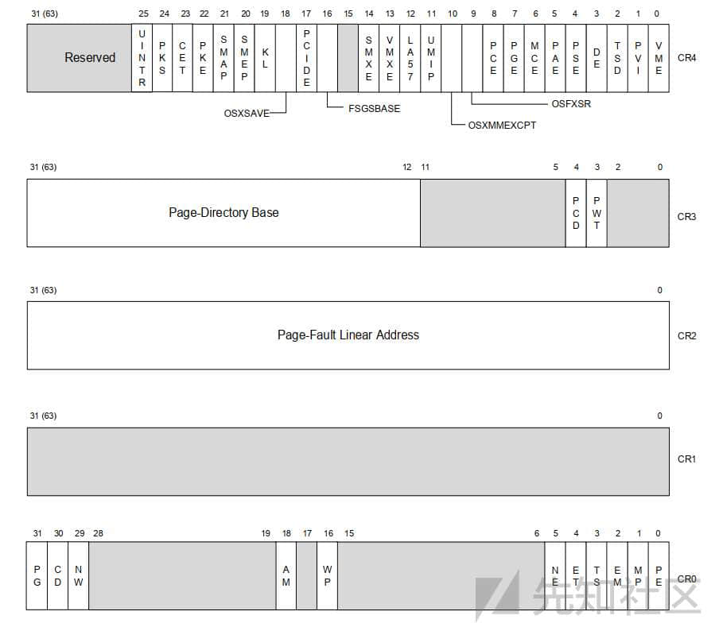
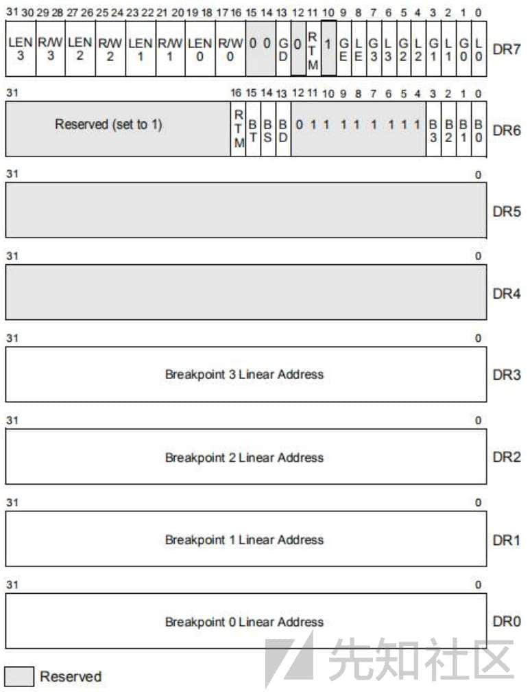
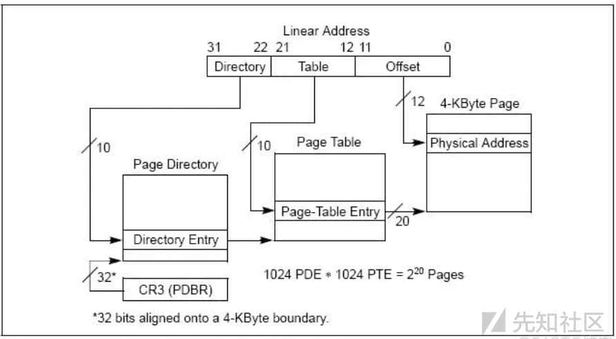
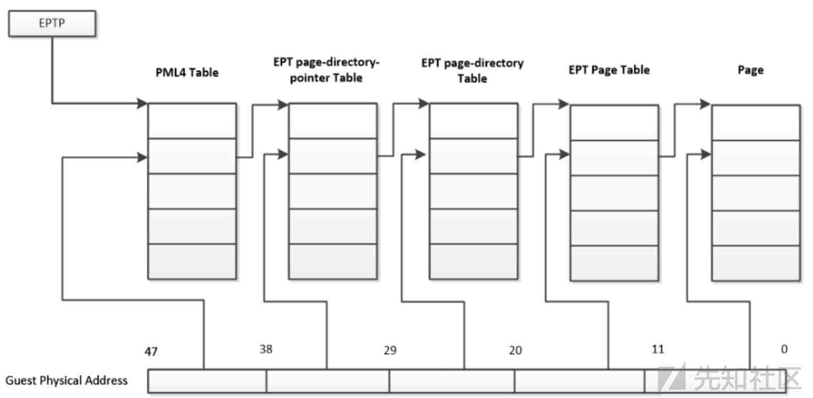
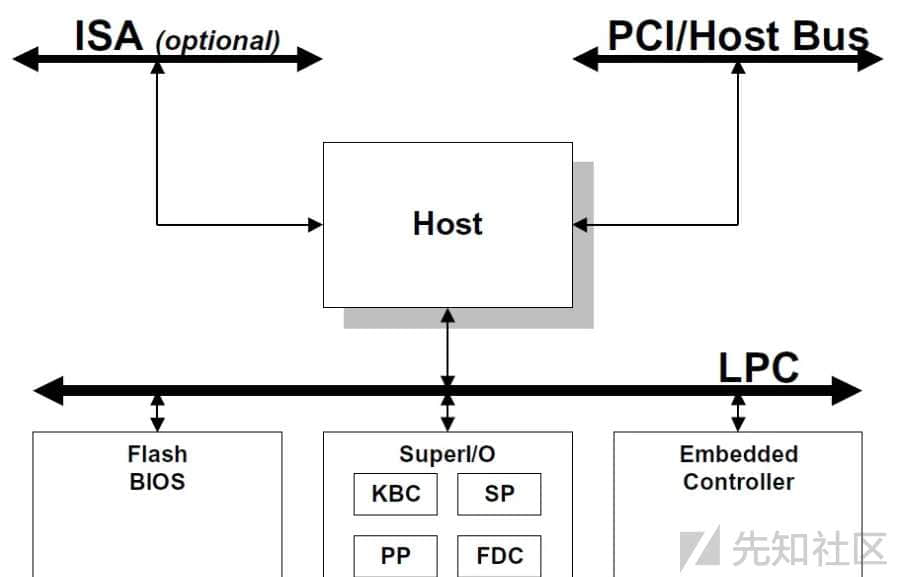

# Rust Hypervisor Attack Defense Part A - 先知社区

Rust Hypervisor Attack Defense Part A

- - -

### 前言

  笔者大多数代码基于 C/C++ 实践，部分使用 Go/Py 实践，对 Rust 的态度保持中立，但 Rust 肯定值得探索和使用。基于 Rust 尝试重构 C/C++ 代码，Rust Hypervisor 系列文章也是过程性知识分享和探讨。  
  文章不局限于 Rust Driver，EPT，MSR，SPI 等内容，注重实践过程，对端点安全和虚拟化攻防，具有实践意义和研究价值。  
  这里虚拟化泛指 Intel VT-x 技术实践，对系统的攻防有什么研究价值和意义呢？

#### 虚拟化漏洞挖掘和研究

  虚拟化漏洞较为火热的话题便是虚拟机逃逸，Kvm Xen Hyper-v 等本质上是 VT-x 和 AMD-V 代码缺陷，真实危害程度和利用难度都非常高。

#### 游戏反作弊对抗

  功和防都很激烈，VT 反调试和 VT 调试器，EPT 读写保护和 EPT 读写绕过，CR/DR 寄存器控制权争夺战。

#### 沙箱/EDR/端点引擎对抗

  安全类产品应偏于 HOOK 探针，VT 在 X64 过 PG，基于 MSR/EPT 的 SSDT HOOK 较为常见。微软已经有了 Hyper-PG，后续 VT HOOK 高版本 X64 是否可以安全使用，还是未知数。

#### Rootkit/Bootkit攻防对抗

  Rootkit 泛指 Kernel 下恶意驱动，Windows X64 PG 已经对 Rootkit 做了最大的限制，仍然有很多利用方式，如 PCI，SPI，APIC(IPI)，是把双刃剑。

### Rust Windows

  基于 Rust 编码 Linux/Windows 语法一致，涉及到不同平台 API 调用差异比较大，基于 Windows System 代码做基础铺垫，过程性代码。

#### Rust Project

##### 工程创建

```plain
cargo new rs-hypervisor
cargo build 
cargo run

cargo new --lib rdriver
cargo new --lib rhypervisor
```

##### 单元测试

```plain
- .rs 文件内直接声明 cfg(test)
#[cfg(test)]
mod test{
}
```

##### 集成测试

```plain
- 创建 tests 目录
- tests 目录下，创建集成测试.rs 文件，use 引用集成.rs
- use netCom::DrivenManageImpl;
```

#### Win API

##### Cargo.toml

```plain
[dependencies.windows]
version = "0.52"
features = [
    "Win32_Foundation",
    "Win32_Security",
    "Win32_Storage_FileSystem",
    "Win32_System_Threading",
    "Win32_System_IO",
]
```

##### main.rs

```plain
use windows::{
    core::*, Win32::Foundation::*, Win32::Storage::FileSystem::*, Win32::System::Threading::*,
    Win32::System::IO::*,
};
unsafe {
    let dwAttribute:u32 = 2147483648u32 | 1073741824u32;
    let hResult: std::prelude::v1::Result<HANDLE, Error> = CreateFileA(
        PCSTR(strDrivenName.as_ptr()),
        dwAttribute,
        FILE_SHARE_MODE(0),
        None,
        OPEN_EXISTING,
        FILE_FLAG_OVERLAPPED,
        None,
    );
    if hResult.is_ok() {
        let hDriver: HANDLE = hResult.unwrap();
        self.m_hDriver = hDriver;
        return true;
    }
    else {
        let hResultError: std::prelude::v1::Result<(), Error> = GetLastError();
        println!("{}",hResultError.unwrap_err().code()); 
        return false;
    }
}
```

#### Win Driven

##### Cargo.toml

```plain
[lib]
# staticlib
crate-type = ["cdylib"]

[dependencies]
wdk = "0.1.0"
wdk-alloc = "0.1.0"
wdk-panic = "0.1.0"
wdk-sys = "0.1.0"
wdk-macros = "0.1.0"

[build-dependencies]
wdk-build = "0.1.0"

[profile.dev]
panic = "abort"
lto = true # optional setting to enable Link Time Optimizations

[profile.release]
panic = "abort"
lto = true # optional setting to enable Link Time Optimizations
```

##### lib.rs

```plain
use wdk_alloc::WDKAllocator;
use wdk_macros::call_unsafe_wdf_function_binding;
use wdk_sys::{
    ntddk::DbgPrint,
    DRIVER_OBJECT,
    NTSTATUS,
    PCUNICODE_STRING,
    ULONG,
    WDFDEVICE,
    WDFDEVICE_INIT,
    WDFDRIVER,
    WDF_DRIVER_CONFIG,
    WDF_NO_HANDLE,
    WDF_NO_OBJECT_ATTRIBUTES,
};

/// Function is unsafe since it dereferences raw pointers passed to it from WDF
#[export_name = "DriverEntry"] // WDF expects a symbol with the name DriverEntry
pub unsafe extern "system" fn driver_entry(
    driver: &mut DRIVER_OBJECT,
    registry_path: PCUNICODE_STRING,
) -> NTSTATUS {
    0
}
```

##### build.rs

```plain
fn main() -> Result<(), wdk_build::ConfigError> {
    wdk_build::Config::from_env_auto()?.configure_binary_build();
    Ok(())
}
```

##### Build Driver

-   Install cargo make
    
    ```plain
    cargo install --locked cargo-make --no-default-features --features tls-native
    // 可选
    cargo install cargo-expand cargo-edit cargo-workspaces
    // 文档
    cargo doc --document-private-items --open
    ```
    
-   编译指令
    
    ```plain
    cargo make
    ```
    
-   官网文案
    
    ```plain
    See: https://github.com/microsoft/windows-drivers-rs
    ```
    
-   Build 驱动工程出现错误如下，表示 EWDK 环境出现了问题：
    
    ```plain
    WDKContentRoot should be able to be detected. Ensure that the WDK is installed, or that the environment setup scripts in the eWDK have been run.
    ```
    
    按照 Rust Windows 去配置，EWDK 完整 ISO 下载下来有 15GB 大小，要注意磁盘空间：

```plain
See: https://learn.microsoft.com/en-us/windows-hardware/drivers/develop/using-the-enterprise-wdk
```

安装完成以后有两种编译方案：

```plain
1. LaunchBuildEnv.cmd 里面编译 Rust Driven
2. 设置系统环境变量 WDKContentRoot=F:\Program Files\Windows Kits\10\
```

LIBCLANG\_PATH 依赖相关问题，LLVM 变量设置问题：

```plain
thread 'main' panicked at D:\Rust\.cargo\registry\src\index.crates.io-6f17d22bba15001f\bindgen-0.68.1\lib.rs:611:31:
Unable to find libclang: "couldn't find any valid shared libraries matching: ['clang.dll', 'libclang.dll'], set the `LIBCLANG_PATH` environment variable to a path where one of these files can be found (invalid: [])"
```

解决方案根据提示设置环境变量，设置完成后重启下 VSCode：

```plain
set LIBCLANG_PATH=D:\LLVM\bin\ 或者系统变量设置
如果仍有问题，可以尝试：
https://github.com/KyleMayes/clang-sys
```

最终效果编译出来文件包含.sys，具备基本的 Windows Rust Driver 实践能力。

### VMCS Table Padding

默认读者有虚拟化基础，对 Intel VT-X 技术有了解，具备虚拟化实践编码能力，反之请先移步到基础读物阅读：

```plain
1. KVM 循序渐进耳之基础篇：https://xz.aliyun.com/t/9587
2. KVM 循序渐进耳之原理篇：https://xz.aliyun.com/t/13491
3. Intel Vt 虚拟化笔记：https://blog.51cto.com/u_13352079/2545416
4. Intel Virtualization Technology: 19~31 章节
```

#### CR/DR

-   Control Registers

[](https://xzfile.aliyuncs.com/media/upload/picture/20240219153807-d2b186aa-cef9-1.jpeg)

```plain
CR0 - 处理器标志控制位，如 PE,PG,WP 等
CR1 - 预留
CR2 - 页面故障线性地址 (导致页面故障的线性地址)
CR3 - CR3 寄存器页目录指针表的基址
CR4 - 包含一组标志架构扩展，并指示操作系统或对特定处理器功能的执行支持。
CR8 - 提供对任务优先级寄存器 (TPR) 的读写访问。指定优先级阈值，操作系统用来控制允许中断的外部中断的优先级类处理器。(64 位模式可用)
See: 2.5 CONTROL REGISTERS
```

  游戏攻防关注基本是 CR3，它的意义在于对进程物理页保护，让恶意程序或者没有办法拿到地址，不能做内存读写。常见做法就是构造假的 CR3 地址或者直接将 CR3 清零，某厂保护这样做过。

-   DR

[](https://xzfile.aliyuncs.com/media/upload/picture/20240219153816-d871c604-cef9-1.jpeg)

```plain
DR0-DR3 硬件断点的地址，
DR4 - 保留
DR5 - 保留
DR6 - 调试异常信息
DR7 - 属性，断点启用、类型、长度等信息。
See: v3 17Part Debug Registers
```

  反调试方式有很多种，PEB，TLS，三方调试器检测，API 返回等，DR0~DR3 保存了硬中断地址，硬中断最多有 4 个只提供了四个寄存器，这里就可以做反硬中断了，清 0 寄存器可以实现效果。 
  R3 也可以调试器，int3 软中断 0xcc 访问触发异常，异常分发中处理，设置 eflage.TF 标志位进行单步。同样硬中断也可以设置寄存器，但是不管哪一种，硬中断也需要处理 DR7，这里不做过多扩展：

```plain
if (0 == pDr7->L1){
        m_conText->Dr1 = uAddress;
        pDr7->RW1 = 0;
        pDr7->LEN1 = 0;
        pDr7->L1 = 1;
    }
```

```plain
typedef struct _DBG_REG7
{
    /*
    // 局部断点 (L0~3) 与全局断点 (G0~3) 的标记位
    */
    unsigned L0 : 1;  // 对 Dr0 保存的地址启用 局部断点
    unsigned G0 : 1;  // 对 Dr0 保存的地址启用 全局断点
    unsigned L1 : 1;  // 对 Dr1 保存的地址启用 局部断点
    unsigned G1 : 1;  // 对 Dr1 保存的地址启用 全局断点
    unsigned L2 : 1;  // 对 Dr2 保存的地址启用 局部断点
    unsigned G2 : 1;  // 对 Dr2 保存的地址启用 全局断点
    unsigned L3 : 1;  // 对 Dr3 保存的地址启用 局部断点
    unsigned G3 : 1;  // 对 Dr3 保存的地址启用 全局断点
                      /*
                      // 【以弃用】用于降低 CPU 频率，以方便准确检测断点异常
                      */
    unsigned LE : 1;
    unsigned GE : 1;
    /*
    // 保留字段
    */
    unsigned Reserve1 : 3;
    /*
    // 保护调试寄存器标志位，如果此位为 1，则有指令修改条是寄存器时会触发异常
    */
    unsigned GD : 1;
    /*
    // 保留字段
    */
    unsigned Reserve2 : 2;
    /*
    保存 Dr0~Dr3 地址所指向位置的断点类型 (RW0~3) 与断点长度 (LEN0~3)，状态描述如下：
    00：执行 01：写入  11：读写
    00:1 字节 01:2 字节  11:4 字节
    */
    unsigned RW0 : 2;  // 设定 Dr0 指向地址的断点类型 
    unsigned LEN0 : 2;  // 设定 Dr0 指向地址的断点长度
    unsigned RW1 : 2;  // 设定 Dr1 指向地址的断点类型
    unsigned LEN1 : 2;  // 设定 Dr1 指向地址的断点长度
    unsigned RW2 : 2;  // 设定 Dr2 指向地址的断点类型
    unsigned LEN2 : 2;  // 设定 Dr2 指向地址的断点长度
    unsigned RW3 : 2;  // 设定 Dr3 指向地址的断点类型
    unsigned LEN3 : 2;  // 设定 Dr3 指向地址的断点长度
}DBG_REG7, *PDBG_REG7;
```

#### EPT

说 EPT 之前先了解点基础东西，CR0 寄存器里面有很多标志蛮重要的，比如想知道是不是开了保护模式和分页机制检测 PE、PG 标志位即可。

```plain
CR0.PE=1
CR0.PG=1
```

分页模式有非物理地址扩展模式 (非 PAE 模式) 和 物理地址扩展模式 (PAE 模式)，CR3 可以拿到页目录地址，三级页目录结构：

| 名称  | 描述  |
| --- | --- |
| 页目录索引表（PDT） | 一级索引 |
| 页表索引表（PTT） | 二级索引 |
| 页表项（PTE） | 页表项 PDT（1024 项 PDE），PTT（1024 项 PTE） |

[](https://xzfile.aliyuncs.com/media/upload/picture/20240219153854-ef1cd3d0-cef9-1.jpeg)

EPT(Extended Page Table) 好像和这些无关？上述转换来说确实无关，EPT 是为了实现内存虚拟化添加的，Guest 不允许直接访问 HPA，需要耗费很大性能才能访问到 HPA：

```plain
GVA(Guest Virtual Address) - GPA(Guest Physical Address) -> HVA(Host Virtual Address) -> HPA(Host Physical Address)
```

  EPT 为了减少上述换搞出来，也就是 GVA->HPA 的过程，使用了硬件来维护了 GPA->HPA。另外还有影子页表也是类似的功效，如 KVM 也会对 CR3 退出监控，其实触发 VMEXIT Hash 记录映射一张表 Table，但是 CR3 每次都会触发 VMExit，影子页表维护映射 Table 和 CR3 VMX 切换开销还是很大的，但是 EPT 性能的话只有缺页才会引发 VMX 切换。  
  EPT 的概念太多，安全切面我们经常可以听到一些词，EPT 无痕 HOOK，EPT 隐藏，这其实都是对 EPT 结构和 VMX 切换 (VMExit) 做处理，EPT Hook 通常用于 SSDT Hook，做安全沙箱和 API 防护，EPT 隐藏指的物理内存隐藏，这些东西甚至还有论文，文雅点叫 EptViolation 的欺骗。

```plain
EPT：Extended Page Table，扩展页表
EPTP：Extended-Page-Table Pointer，扩展页表指针
EPT PML4T：EPT Page Map Level 4 Table , EPT PML4E 是其表项  L4
PDPT：Page-Directory-Pointer Table , PDPTE 是其表项  L3
PDT：Page-Directory Table , PDE 是其表项 L2
PT：Page Table , PTE 是其表项 L1
GPA：Guest-Physical Address，虚拟机物理地址
HPA：Host-Physical Address，真实机物理地址
EPT MMU：一块专门的用作硬件虚拟化的硬件
```

[](https://xzfile.aliyuncs.com/media/upload/picture/20240219153830-e086abe8-cef9-1.jpeg)

#### MSRs

Model Specific Register 寄存器，我们关注的是 Instruction-specific support

```plain
• Performance-monitoring counters (see Chapter 20, “Performance Monitoring”).
• Debug extensions (see Chapter 18, “Debug, Branch Profile, TSC, and Intel® Resource Director Technology
(Intel® RDT) Features”).
• Machine-check exception capability and its accompanying machine-check architecture (see Chapter 16,
“Machine-Check Architecture”).
• MTRRs (see Section 12.11, “Memory Type Range Registers (MTRRs)”).
• Thermal and power management.
• Instruction-specific support (for example: SYSENTER, SYSEXIT, SWAPGS, etc.).
• Processor feature/mode support (for example: IA32_EFER, IA32_FEATURE_CONTROL).
```

  简单说通过指令操作系统可以从应用层切换到内核层，过个程就涉及到 SYSENTER, SYSEXIT 指令执行。MSR HOOK 指的什么？R3/R0 都可以实现，泛指 HOOK 的方式不同，应用层 r3 主流就是对 KiFastSystemCall 进行 Inline HOOK，R0 是对 KiSystemServiceCopyEnd、KiSystemCall64 进行 HOOK.

```plain
SyscallEntryPoint PROC
    ;cli                                    ; Disable interrupts
    swapgs                                  ; swap GS base to kernel PCR
    mov         gs:[USERMD_STACK_GS], rsp   ; save user stack pointer

    cmp         rax, MAX_SYSCALL_INDEX      ; Is the index larger than the array size?
    jge         KiSystemCall64              ;

    lea         rsp, offset HookEnabled     ; RSP = &SyscallHookEnabled
    cmp         byte ptr [rsp + rax], 0     ; Is hooking enabled for this index?
    jne         KiSystemCall64_Emulate      ; NE = index is hooked
SyscallEntryPoint ENDP
```

  VT MSR Hook 并不是修改了这种 HOOK 方式，只不过对 PG 进行欺骗，PG 会读取 MSR 的值，这时候触发 VMX 切换 VMexit 进行 MSR.0xC0000082 处理，从而绕过 PG 使 MSR Hook 相对稳定。

#### PCI/SPI

```plain
Industry Standard Architecture(ISA)
Peripheral Component Interconnect(PCI)
Peripheral Component Interconnect Express(PCIe)
Low Pin Count(LPC)
Serial Peripheral Interface(SPI)
Enhanced Serial Peripheral Interface(eSPI)
```

[](https://xzfile.aliyuncs.com/media/upload/picture/20240219153837-e48b50a4-cef9-1.jpeg)

  很多老式电脑圆孔绿色插鼠标，紫色插键盘，就是 PS(Personal System)/2 标准，这个是 IBM 发明的。Windows 下 PS/2 外设和 USB 处理是两套驱动，就拿键盘来说，PS/2 键盘端口驱动是 i8042prt，基于 USB 是 Kbdhid，这块有兴趣可以扩展阅读下。

```plain
I8042_STATUS_REG
IN al, 0x60h
OUT 0x64, al
```

  现代的 Inetl 应该只有南桥芯片了，南桥芯片是一个大集合，外设输入输出不与 CPU 直接打交道，低速总线处理都要过南桥芯片，上述说的 PS/2 USB SAST 都在南桥芯片上，还有电源管理啥的都属于南桥控制范围，HAL 层这类驱动应该也是和南桥芯片接口打交道。  
  基于 VT-x 和 Ept 可以做点什么？可以监控 SPI Flash ROM 还有 xHCI（USB3) 攻击和异常，这里有一个相对成熟的项目可以参考

```plain
https://github.com/KelvinMsft/DeviceMon?tab=readme-ov-file
```

Part A 偏技术科普和铺垫，续篇会对 VMCS/VMExit 处理和 Rust 实践源码分析，对攻防的技术原理细节分享。
