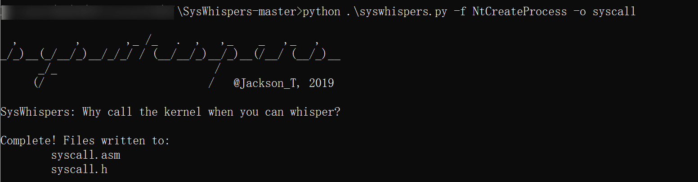

# Syscall 学习 - 先知社区

Syscall 学习

- - -

## 基础知识

我们知道，系统核心态指的是 R0，用户态指的是 R3，系统代码在核心态下运行，用户代码在用户态下运行。系统中一共有四个权限级别，R1 和 R2 运行设备驱动，R0 到 R3 权限依次降低，R0 和 R3 的权限分别为最高和最低。  
[](https://cdn.nlark.com/yuque/0/2024/png/40360538/1707647459591-9477f65c-e26a-41bc-a26b-c0c30640f779.png#averageHue=%2359523f&clientId=u6161dcd0-72b0-4&from=paste&height=493&id=u5efb1907&originHeight=739&originWidth=1035&originalType=binary&ratio=1.5&rotation=0&showTitle=false&size=367406&status=done&style=none&taskId=ud3028170-0075-4611-9a78-0429461cec2&title=&width=690)  
而我们的 **syscall** 是一个计算机操作系统中的指令，用于向操作系统内核发起系统调用。系统调用是用户空间程序与操作系统内核进行交互的方式之一，用于请求操作系统执行特定的功能，如文件操作、进程管理、网络通信等。  
在用户态运行的系统要控制系统时，或者要运行系统代码就必须取得 R0 权限。用户从 R3 到 R0 需要借助 ntdll.dll 中的函数，这些函数分别以“Nt”和“Zw”开头，这种函数叫做 Native API，下图是调用过程：  
[](https://cdn.nlark.com/yuque/0/2024/png/40360538/1707648727387-4dd5a0c2-d0e5-404f-b428-7b7fbe59f1c2.png#averageHue=%23f9f9f9&clientId=u6161dcd0-72b0-4&from=paste&height=568&id=u6e3c7a52&originHeight=852&originWidth=799&originalType=binary&ratio=1.5&rotation=0&showTitle=false&size=64089&status=done&style=none&taskId=u0efaa92f-42d7-45da-8c82-39c8b069261&title=&width=532.6666666666666)  
比如当我们调用类似 kernel32.dll 中 CreateThread() 时，最终会进入 0 环 (即 R0) 调用 ntdll.dll 中的 ZwCreateThreadEx()，接下来我们来逆向一下该函数的实现。  
[](https://cdn.nlark.com/yuque/0/2024/png/40360538/1707647682433-63abed09-8409-4043-b6cc-326963b427a4.png#averageHue=%23ecf9f8&clientId=u6161dcd0-72b0-4&from=paste&height=644&id=u4cc8106f&originHeight=966&originWidth=2042&originalType=binary&ratio=1.5&rotation=0&showTitle=false&size=65423&status=done&style=none&taskId=u348298da-a0ea-4e02-95ad-94274015737&title=&width=1361.3333333333333)  
可以看到先向 eax 里面存储了一个值，即系统调用号 SSN，然后再进行 syscall。  
我们再看一下相邻函数的 SSN，会发现该值是递增的，且大致格式都如下：

```plain
mov     r10,rcx
mov     eax,xxh
syscall
```

## Syscall 是如何绕过 EDR 的？

要回答这个问题之前，我们要先明白 EDR 是如何工作的。  
EDR 通常会对恶意软件常用的 api 进行 hook，即在调用 api 之前先进入 EDR 进行检查，检查通过之后才可以继续调用 api。下面是没有被 hook 时 NtReadVirtualMemory 的样子：  
[](https://cdn.nlark.com/yuque/0/2024/png/40360538/1707657577152-96ece47c-a820-4544-913e-b02081f40713.png#averageHue=%23e9e7e6&clientId=u6161dcd0-72b0-4&from=paste&height=200&id=udbf3148a&originHeight=300&originWidth=1314&originalType=binary&ratio=1.5&rotation=0&showTitle=false&size=68849&status=done&style=none&taskId=ue2ef56fd-128c-4964-bc88-edb8986366a&title=&width=876)  
下面是被 hook 时的样子：  
[](https://cdn.nlark.com/yuque/0/2024/png/40360538/1707657651179-eb260278-53ff-47a7-af8d-82191008006b.png#averageHue=%23eddbdb&clientId=u6161dcd0-72b0-4&from=paste&height=120&id=uc0c6bdf5&originHeight=180&originWidth=1123&originalType=binary&ratio=1.5&rotation=0&showTitle=false&size=19304&status=done&style=none&taskId=u444c0d51-c2f3-4281-92d6-c0d73548eb2&title=&width=748.6666666666666)  
可以看到在 NtReadVirtualMemory 的开头就被插入了一条 jmp 指令，跳转到了内存中的其他地方。  
我们现在知道 syscall 的通用模板，那么我们就自己想办法获取 SSN，然后自己 syscall 一下，那么不就绕过了 EDR 的 hook，直接去调用内核层的一些东西了。

## 项目学习

Syscall 有很多使用的项目都值得我们学习，不同的项目也都是了作者和 EDR 厂商的对抗，下面是我对于几个经典项目的一些理解，大家不要只看文章，一定要去看看源码，这样思路才会清晰。

### Hell's Gate 地狱之门

我们先一起看一下经典的地狱之门，项目地址：[https://github.com/am0nsec/HellsGate/](https://github.com/am0nsec/HellsGate/)  
首先看 main.c 中的 main 函数：  
先调用了 RtlGetThreadEnvironmentBlock 函数  
[](https://cdn.nlark.com/yuque/0/2024/png/40360538/1707742734581-97985671-6dc9-4f42-b25a-53db15aae4da.png#averageHue=%23212121&clientId=ud7d4e3bc-3548-4&from=paste&height=681&id=u3a14718e&originHeight=1022&originWidth=2190&originalType=binary&ratio=1.5&rotation=0&showTitle=false&size=306678&status=done&style=none&taskId=uba1c2064-2bc2-4ff5-b8fc-b76bd0ff388&title=&width=1460)  
这个函数是获取 TEB 的，因为这个项目涉及到了一些 PEB 的知识，如果对 PEB 和 TEB 不太熟悉可以看一下[https://xz.aliyun.com/t/13556](https://xz.aliyun.com/t/13556)  
[](https://cdn.nlark.com/yuque/0/2024/png/40360538/1707742778097-4508029b-a484-4de0-a74e-042ff5ba85e1.png#averageHue=%23212120&clientId=ud7d4e3bc-3548-4&from=paste&height=378&id=u10e55deb&originHeight=567&originWidth=2190&originalType=binary&ratio=1.5&rotation=0&showTitle=false&size=112260&status=done&style=none&taskId=ud496703d-793f-4a6b-8da5-2d7e8507c23&title=&width=1460)  
接下来两句代码就是先获取 PEB，然后判断系统版本是不是 Win10，如果不是的话就直接退出。  
[](https://cdn.nlark.com/yuque/0/2024/png/40360538/1707743328844-35bd7364-cb89-4b0d-acae-375e01232eee.png#averageHue=%23212120&clientId=ud7d4e3bc-3548-4&from=paste&height=681&id=ub1e0c083&originHeight=1022&originWidth=2190&originalType=binary&ratio=1.5&rotation=0&showTitle=false&size=272228&status=done&style=none&taskId=u22421be7-bdb0-497f-b719-19ca3b007f1&title=&width=1460)  
然后通过 PEB 的相关知识获取到 ntdll 的 module，然后紧接着看一下导出表的相关信息，如果没有则证明前面的步骤发生了错误，直接退出。其中 GetImageExportDirectory 函数需要一些 PE 的知识才可以看懂。  
[](https://cdn.nlark.com/yuque/0/2024/png/40360538/1707744148735-2f340449-5fad-4692-849e-49807e6858f8.png#averageHue=%23222121&clientId=uaac3b226-e21c-4&from=paste&height=681&id=u178cd49b&originHeight=1022&originWidth=2190&originalType=binary&ratio=1.5&rotation=0&showTitle=false&size=358182&status=done&style=none&taskId=ucb2d635d-8871-41e8-8fa8-ed3f2334d9d&title=&width=1460)  
然后就进入代码的关键部分了，先给出 Table 中需要 syscall 的函数名的 hash 值，然后调用 GetVxTableEntry 去获取 SSN，去看一下函数的实现  
[](https://cdn.nlark.com/yuque/0/2024/png/40360538/1707799338687-c94a85e0-4077-4d3d-8980-d933853ae992.png#averageHue=%23212121&clientId=u22855839-c673-4&from=paste&height=785&id=u58fe0670&originHeight=1177&originWidth=2190&originalType=binary&ratio=1.5&rotation=0&showTitle=false&size=482403&status=done&style=none&taskId=u2044f6b6-f32b-4a9b-bd9f-eedcac17e62&title=&width=1460)  
[](https://cdn.nlark.com/yuque/0/2024/png/40360538/1707799348992-4c71d9a2-7711-417b-9b3f-754490aefed5.png#averageHue=%23212020&clientId=u22855839-c673-4&from=paste&height=785&id=u3639e7dc&originHeight=1177&originWidth=2190&originalType=binary&ratio=1.5&rotation=0&showTitle=false&size=328259&status=done&style=none&taskId=uccd3d3c8-0108-45ec-8c4c-c174b640c38&title=&width=1460)  
这个函数先是获取到导出表的相关结构，然后循环比较，并使用 djb2 这个哈希函数来计算当前函数名称的 hash，如果一样则证明找到了该函数，并且将地址存储到了`pVxTableEntry->pAddress`  
然后判断了下所在位置是不是已经超过了寻找的范围还没有找到，推荐一个汇编和 hex 互相转换的网站：[https://defuse.ca/online-x86-assembler.htm](https://defuse.ca/online-x86-assembler.htm)。cw 的作用是方便逐个字节比较  
[](https://cdn.nlark.com/yuque/0/2024/png/40360538/1707811190176-180b7c32-aeb2-4a8a-b170-cd3512713314.png#averageHue=%231f1e1e&clientId=u22855839-c673-4&from=paste&height=187&id=u201070a6&originHeight=280&originWidth=1980&originalType=binary&ratio=1.5&rotation=0&showTitle=false&size=78737&status=done&style=none&taskId=ube8df1fc-dba9-4954-bc10-cb3a761ebc7&title=&width=1320)  
然后就是寻找 SSN，这里通过判断上面 syscall 格式来获取 SSN，然后分别获取高位和低位，高位左移 8 位再和低位或操作得到正确的 SSN，并存储到`pVxTableEntry->wSystemCall`。  
[](https://cdn.nlark.com/yuque/0/2024/png/40360538/1707811892123-097d4fbc-78f7-4817-a90e-4cc16f10aac3.png#averageHue=%233f3f3e&clientId=u22855839-c673-4&from=paste&height=611&id=udf0f2dc5&originHeight=917&originWidth=2526&originalType=binary&ratio=1.5&rotation=0&showTitle=false&size=367025&status=done&style=none&taskId=u29923c0b-f0a5-4f74-989b-75a9a258661&title=&width=1684)  
然后我们回到 main 函数，又调用了 payload 函数，这个函数就是执行我们 payload 的地方  
[](https://cdn.nlark.com/yuque/0/2024/png/40360538/1707812729857-520c5135-a055-4d4c-b465-f29583cd8ddb.png#averageHue=%23222121&clientId=u22855839-c673-4&from=paste&height=611&id=uccd38ba3&originHeight=917&originWidth=2190&originalType=binary&ratio=1.5&rotation=0&showTitle=false&size=278940&status=done&style=none&taskId=u7b0eeaf3-1279-4891-88ab-3aa69474bae&title=&width=1460)  
我们重点看红框框出来的函数  
[](https://cdn.nlark.com/yuque/0/2024/png/40360538/1707813559528-91c4cf0b-7338-42f6-a1ac-9169e2c15a9a.png#averageHue=%23222121&clientId=u22855839-c673-4&from=paste&height=611&id=u177b4aa2&originHeight=917&originWidth=2190&originalType=binary&ratio=1.5&rotation=0&showTitle=false&size=296611&status=done&style=none&taskId=u0dbc2d7e-4868-4c55-aa11-5c745848735&title=&width=1460)  
这两个函数是从别的文件导入的  
[](https://cdn.nlark.com/yuque/0/2024/png/40360538/1707813818854-67787c8e-9a09-4b3d-b731-5ab340e70e3e.png#averageHue=%23232221&clientId=u22855839-c673-4&from=paste&height=75&id=u1c45d396&originHeight=112&originWidth=837&originalType=binary&ratio=1.5&rotation=0&showTitle=false&size=30406&status=done&style=none&taskId=u6078b1fe-f47b-4a56-bfd4-2b0e6781edb&title=&width=558)  
看一下 asm 文件里面就是这两个函数  
[](https://cdn.nlark.com/yuque/0/2024/png/40360538/1707813898355-aa20f482-db95-4a68-b464-1fdab1ddb27c.png#averageHue=%23202020&clientId=u22855839-c673-4&from=paste&height=611&id=udc98c4b2&originHeight=917&originWidth=2190&originalType=binary&ratio=1.5&rotation=0&showTitle=false&size=133087&status=done&style=none&taskId=ub1de37d9-a724-42ee-a9b2-d07f28c2a6f&title=&width=1460)  
先在数据段定义了 wSystemCall，用来存放 SSN。  
HellsGate 的参数就是我们的 SSN，参数会根据调用约定放到了 ecx 中，所以 wSystemCall 就获取了正确的 SSN。  
HellDescent 则直接仿照我们上面的格式进行 syscall，参数正常传参即可，这样就在被 hook 的情况下绕过 hook 完成一次对内核的操作，所以 HellsGate 和 HellDescent 成对出现即可，用法还是比较简单的。  
至此我们来总结一下地狱之门项目：

-   从内存中已经加载的 ntdll.dll 模块中通过遍历解析导出表，定位函数地址，再获取系统调用号
-   实现了动态获取 SSN
-   需要一块干净的内存 ntdll 模块，否则无法正常获取 SSN
-   直接系统调用

### Halo's Gate 光环之门

项目地址：[https://github.com/trickster0/TartarusGate/](https://github.com/trickster0/TartarusGate/)  
地狱之门实现了动态获取 SSN，但是有一个缺点，那就是 ntdll 的内存必须是干净的，否则无法获取 SSN，这个时候我们就需要光环之门了。  
原理如下：当我们所需要的 Nt 函数被 hook 时，它相邻的 Nt 函数可能没有被 hook，因为 EDR 不可能 hook 所有的 Nt 函数，总有一些不敏感的 Nt 函数没有被 hook，这样我们从我们需要的 Nt 函数出发，向上或者向下寻找，找到没有被 hook 的 Nt 函数，然后它的 SSN 加上或减去步数就得到了我们需要的 SSN。  
看下图，ZwMapViewOfSection 显然被 hook 了，因为它开头是`jmp <offset>`指令，而不是 `mov r10, rcx`，但是相邻的 ZwSetInformationFile 和 NtAccessCheckAndAuditAlarm 却是干净的，他们的系统调用号分别是 0x27 和 0x29。因此，确定 ZwMapViewOfSection 编号非常简单，只需查看邻居编号并相应地进行调整即可。如果邻居也被 hook 了，那么检查邻居的邻居，依此类推：  
[](https://cdn.nlark.com/yuque/0/2024/png/40360538/1707877533768-6a28c4f5-4dd9-48a2-88c6-e4a64efaaf5d.png#averageHue=%23f9f0e0&clientId=ua1b94b79-a585-4&from=paste&height=357&id=u02d0b4e6&originHeight=535&originWidth=1179&originalType=binary&ratio=1.5&rotation=0&showTitle=false&size=326386&status=done&style=none&taskId=ue3230792-aba7-46cd-bb16-33c3ff10ee3&title=&width=786)  
这个项目和地狱之门的大致思路是一样的，但是函数是用汇编实现的，我们重点看下面三个过程，findSyscallNumber，halosGateUp 和 halosGateDown，分别是直接获取 SSN 以及向上和向下获取 SSN 的过程。  
[](https://cdn.nlark.com/yuque/0/2024/png/40360538/1707896664443-23a779f9-e1bb-4c53-ab3a-07d15083f753.png#averageHue=%23222121&clientId=ua1b94b79-a585-4&from=paste&height=611&id=uce7abd7a&originHeight=917&originWidth=2190&originalType=binary&ratio=1.5&rotation=0&showTitle=false&size=246598&status=done&style=none&taskId=ud7da2e4a-1ff0-4809-b094-c7143b4779f&title=&width=1460)  
[](https://cdn.nlark.com/yuque/0/2024/png/40360538/1707896141483-0c7e6002-b2fe-46c8-91d6-b72cba287155.png#averageHue=%23222121&clientId=ua1b94b79-a585-4&from=paste&height=611&id=u2d0dfb85&originHeight=917&originWidth=2190&originalType=binary&ratio=1.5&rotation=0&showTitle=false&size=247328&status=done&style=none&taskId=u3c80bc14-7c07-4e4d-8bf0-86bbaccb1e3&title=&width=1460)  
[](https://cdn.nlark.com/yuque/0/2024/png/40360538/1707896152106-aa8f8ed3-0233-4769-8138-a631d5decac2.png#averageHue=%23222121&clientId=ua1b94b79-a585-4&from=paste&height=611&id=u6481ebf4&originHeight=917&originWidth=2190&originalType=binary&ratio=1.5&rotation=0&showTitle=false&size=244119&status=done&style=none&taskId=u4ed03bb8-4afd-482d-9458-d20794828b5&title=&width=1460)  
我们可以观察到代码中有一处硬编码，其实是对应 Nt 函数的 raw hex 格式，我们通过下图可以看到前四个字节是`4c8bd1b8`，由于是小端格式存储，在内存中就变成了`00B8D18B4Ch`  
[](https://cdn.nlark.com/yuque/0/2024/png/40360538/1707899473115-fab8c67d-964d-480f-8138-a9e634a3abdc.png#averageHue=%23e8e6e4&clientId=ua1b94b79-a585-4&from=paste&height=187&id=u2fc99238&originHeight=280&originWidth=1151&originalType=binary&ratio=1.5&rotation=0&showTitle=false&size=70047&status=done&style=none&taskId=u815e24a8-be31-4ead-a83e-93a3f56549a&title=&width=767.3333333333334)  
上面第一个名为 `findSyscallNumber` 的过程很简单，就是比较硬编码和在内存中获取的是不是一样，如果不一样我们就认为它被 hook 了，并且跳转到 error 过程，如果一样就直接获取 SSN 返回。  
而 `halosGateUp` 和 `halosGateDown`两个过程是在上面的基础上加了一个寻找 rdx 偏移的步骤，思路还是一样的。如果感到汇编比较难懂的话可以看下面的项目，是对该项目的补充版且用 c++ 实现。  
项目总结：

-   该项目在地狱之门的基础上增加了检查前四个字节确定是否被 hook 的步骤，并且如果被 hook 尝试查找邻居是否被 hook 来获取 SSN

### TartarusGate

根据作者描述，这个项目是光环之门的进化版，因为 EDR 的 hook 不一定就是在第一条指令，在第二条指令中也可能出现 jmp 指令，比如下图就是这样：  
[](https://cdn.nlark.com/yuque/0/2024/png/40360538/1707911419441-7d148027-f5a0-43fa-862b-3f4c37c89caf.png#averageHue=%23e8e5e2&clientId=ua1b94b79-a585-4&from=paste&height=119&id=u9da7b283&originHeight=178&originWidth=1135&originalType=binary&ratio=1.5&rotation=0&showTitle=false&size=108559&status=done&style=none&taskId=uf4980e7a-bdd2-43d0-85b3-cf7f6e29bf2&title=&width=756.6666666666666)  
所以说这个项目对这种情况进行了判断，在`GetVxTableEntry()`里我们可以看到进行了两次 if 判断，同时我们也看到了光环之门那两个过程对应的 c++ 实现。  
[](https://cdn.nlark.com/yuque/0/2024/png/40360538/1707911671831-195e72af-40af-426f-80f2-063ee19576d7.png#averageHue=%23212020&clientId=ua1b94b79-a585-4&from=paste&height=855&id=u10a519fd&originHeight=1282&originWidth=2190&originalType=binary&ratio=1.5&rotation=0&showTitle=false&size=452072&status=done&style=none&taskId=u14a506da-a3e2-4fa7-a63f-661182ae01f&title=&width=1460)  
除此之外，这个项目在 asm 文件中增加了一些 nop 指令来混淆  
[](https://cdn.nlark.com/yuque/0/2024/png/40360538/1707911824228-131be742-5283-4902-9ece-d52395f5d886.png#averageHue=%23201f1f&clientId=ua1b94b79-a585-4&from=paste&height=854&id=u68fa638f&originHeight=1281&originWidth=2190&originalType=binary&ratio=1.5&rotation=0&showTitle=false&size=168209&status=done&style=none&taskId=u0114008e-d782-45e1-93a6-67c17fcb0e7&title=&width=1460)

### GetSSN

这是一个获取 SSN 的思路，方法比较简单，不需要 unhook，不需要手动从代码存根中读取，也不需要加载 NTDLL 新副本。  
我们知道 SSN 是递增的，所以我们遍历 ntdll 所有导出函数，然后按照地址升序排序，从 0 开始，不就得到了所有导出函数的 SSN 了。

```plain
int GetSSN()
{
    std::map<int, string> Nt_Table;
    PBYTE ImageBase;
    PIMAGE_DOS_HEADER Dos = NULL;
    PIMAGE_NT_HEADERS Nt = NULL;
    PIMAGE_FILE_HEADER File = NULL;
    PIMAGE_OPTIONAL_HEADER Optional = NULL;
    PIMAGE_EXPORT_DIRECTORY ExportTable = NULL;

    PPEB Peb = (PPEB)__readgsqword(0x60);
    PLDR_MODULE pLoadModule;
    // NTDLL
    pLoadModule = (PLDR_MODULE)((PBYTE)Peb->LoaderData->InMemoryOrderModuleList.Flink->Flink - 0x10);
    ImageBase = (PBYTE)pLoadModule->BaseAddress;

    Dos = (PIMAGE_DOS_HEADER)ImageBase;
    if (Dos->e_magic != IMAGE_DOS_SIGNATURE)
        return 1;
    Nt = (PIMAGE_NT_HEADERS)((PBYTE)Dos + Dos->e_lfanew);
    File = (PIMAGE_FILE_HEADER)(ImageBase + (Dos->e_lfanew + sizeof(DWORD)));
    Optional = (PIMAGE_OPTIONAL_HEADER)((PBYTE)File + sizeof(IMAGE_FILE_HEADER));
    ExportTable = (PIMAGE_EXPORT_DIRECTORY)(ImageBase + Optional->DataDirectory[0].VirtualAddress);

    PDWORD pdwAddressOfFunctions = (PDWORD)((PBYTE)(ImageBase + ExportTable->AddressOfFunctions));
    PDWORD pdwAddressOfNames = (PDWORD)((PBYTE)ImageBase + ExportTable->AddressOfNames);
    PWORD pwAddressOfNameOrdinales = (PWORD)((PBYTE)ImageBase + ExportTable->AddressOfNameOrdinals);
    for (WORD cx = 0; cx < ExportTable->NumberOfNames; cx++)
    {
        PCHAR pczFunctionName = (PCHAR)((PBYTE)ImageBase + pdwAddressOfNames[cx]);
        PVOID pFunctionAddress = (PBYTE)ImageBase + pdwAddressOfFunctions[pwAddressOfNameOrdinales[cx]];
        if (strncmp((char*)pczFunctionName, "Zw",2) == 0) {
           printf("Function Name:%s\tFunction Address:%p\n", pczFunctionName, pFunctionAddress);
            Nt_Table[(int)pFunctionAddress] = (string)pczFunctionName;
        }
    }
    int index = 0;
    for (std::map<int, string>::iterator iter = Nt_Table.begin(); iter != Nt_Table.end(); ++iter) {
        cout << "index:" << index  << ' ' << iter->second << endl;
        index += 1;
    }
}
```

### SysWhispers

项目地址：[https://github.com/jthuraisamy/SysWhispers](https://github.com/jthuraisamy/SysWhispers)  
这是老外写的一个直接系统调用的框架，这个框架现在有三个版本，我们先一起来看第一个版本。  
我们知道 SSN 在不同版本下是不一样的，因此直接系统调用要适配多版本可能会有些麻烦，而这个项目就可以帮助我们解决这个问题。在不指定版本的情况下，Syswhispers 会导出指定函数的所有已知版本的系统调用号，根据操作系统版本的不同再进行指定调用。  
不同操作系统间调用号的不同详情可参考

-   [https://j00ru.vexillium.org/syscalls/nt/32/](https://j00ru.vexillium.org/syscalls/nt/32/)
-   [https://j00ru.vexillium.org/syscalls/nt/64/](https://j00ru.vexillium.org/syscalls/nt/64/)

我们以 NtCreateProcess 为例看一下用法，命令如下：  
`python .\syswhispers.py -f NtCreateProcess -o syscall`  
然后我们得到了一个 asm 和一个.h 文件，通过包含头文件就可以进行 syscall。  
[](https://cdn.nlark.com/yuque/0/2024/png/40360538/1708056989069-e5439e8a-91d5-4dee-a950-c9238a45bca8.png#averageHue=%230e0e0d&clientId=u0e5bdd6b-21f0-4&from=paste&height=271&id=uab8242c7&originHeight=406&originWidth=1552&originalType=binary&ratio=1.5&rotation=0&showTitle=false&size=31498&status=done&style=none&taskId=u3507c012-8457-45c7-bd50-0720c426a92&title=&width=1034.6666666666667)  
将两个文件包含到头文件中，然后按照博客中配置一下：[https://blog.csdn.net/qq\_29176323/article/details/129145326](https://blog.csdn.net/qq_29176323/article/details/129145326)  
[](https://cdn.nlark.com/yuque/0/2024/png/40360538/1708057644348-77e9580b-3452-4c2e-a930-f6b5c2e3808c.png#averageHue=%232a2928&clientId=u0e5bdd6b-21f0-4&from=paste&height=201&id=u11df78bb&originHeight=301&originWidth=335&originalType=binary&ratio=1.5&rotation=0&showTitle=false&size=14920&status=done&style=none&taskId=u6923e213-49e6-43a5-ac6b-8a45d7c30b9&title=&width=223.33333333333334)  
.h 文件中声明了 NtCreateProcess 原型  
[](https://cdn.nlark.com/yuque/0/2024/png/40360538/1708057707141-f51b1b75-9770-4751-a698-92dae577cf44.png#averageHue=%23202020&clientId=u0e5bdd6b-21f0-4&from=paste&height=855&id=u68bd239c&originHeight=1282&originWidth=2190&originalType=binary&ratio=1.5&rotation=0&showTitle=false&size=283229&status=done&style=none&taskId=u1e852e07-f259-48fa-aa70-dd13f82dc6a&title=&width=1460)  
看 asm 文件，其实就是不断的比较系统版本然后跳转  
[](https://cdn.nlark.com/yuque/0/2024/png/40360538/1708057885928-ebf32cac-fb16-41db-aca3-62f63023f222.png#averageHue=%23232322&clientId=u0e5bdd6b-21f0-4&from=paste&height=854&id=ub1f90371&originHeight=1281&originWidth=2190&originalType=binary&ratio=1.5&rotation=0&showTitle=false&size=406681&status=done&style=none&taskId=u55eaef2c-c0f6-4a07-a2fb-a42d43f0e9d&title=&width=1460)  
然后可以在 cpp 里面写一个简单的小 demo：

```plain
#include "syscall.h"
#include <stdio.h>
int main() {
    // 准备创建进程的参数
    OBJECT_ATTRIBUTES objAttr;
    InitializeObjectAttributes(&objAttr, NULL, 0, NULL, NULL);

    // 使用 NtCreateProcess 创建一个新的进程
    HANDLE hProcess;
    NTSTATUS status = NtCreateProcess(&hProcess, PROCESS_ALL_ACCESS, &objAttr, GetCurrentProcess(), FALSE, NULL, NULL, NULL);

}
```

但是一版本的项目特征太多，很容易被 AV/EDR 针对，所以出现了二版本。

### SysWhispers2

项目地址：[https://github.com/jthuraisamy/SysWhispers2](https://github.com/jthuraisamy/SysWhispers2)  
用法与 Syswhispers 大致相同，但是会生成很多文件：  
[](https://cdn.nlark.com/yuque/0/2024/png/40360538/1708071677681-d713c2f4-32b0-432b-b864-08809d9e75fa.png#averageHue=%230e0d0d&clientId=u4f349bd6-8944-4&from=paste&height=669&id=u88e35491&originHeight=1004&originWidth=1680&originalType=binary&ratio=1.5&rotation=0&showTitle=false&size=89352&status=done&style=none&taskId=u28f6fd33-eefc-4b9d-b105-84565696562&title=&width=1120)

-   有 x64 的，有 x86 的，这个区别应该就不用介绍了；
-   有.nasm 的，有.asm 的，这个是因为 SysWhispers2 为了适配 mingw-gcc 而做出的改变，后缀 nasm 的文件可以被 gcc 直接编译，而 vs 中无法直接编译，并且 mingw-gcc 支持 x64 的内联汇编，这点就十分方便；
-   有 std 的，有 rnd 的，这个是 std 是基础的 syscall 方法，rnd 则是使用了 Random Syscall Jumps 的方法，下面会有具体介绍。

我们以 NtCreateThreadEx 为例，分析一下调用过程，我们在 syscall.h 文件中找到了 NtCreateThreadEx，是通过外部导入的  
[](https://cdn.nlark.com/yuque/0/2024/png/40360538/1708074099429-70e2c03a-ec9c-4b1a-bd7f-eb351209ddb8.png#averageHue=%23202020&clientId=u4f349bd6-8944-4&from=paste&height=890&id=uc54d299c&originHeight=1335&originWidth=2538&originalType=binary&ratio=1.5&rotation=0&showTitle=false&size=282723&status=done&style=none&taskId=u9257b38f-0bff-400a-af6e-3ce797d9f54&title=&width=1692)  
去看 asm 文件，找到了该函数（过程），先是将计算出的 hash 值赋给 currentHash，每次使用时 hash 都不一样，然后再调用 WhisperMain 过程。  
[](https://cdn.nlark.com/yuque/0/2024/png/40360538/1708074576809-747e046d-107c-4314-8c52-067791f69da3.png#averageHue=%23232221&clientId=u4f349bd6-8944-4&from=paste&height=133&id=u5735a610&originHeight=199&originWidth=1928&originalType=binary&ratio=1.5&rotation=0&showTitle=false&size=60746&status=done&style=none&taskId=ue05b6a64-63cd-468a-80f7-1a3257f1682&title=&width=1285.3333333333333)  
看一下 WhisperMain 过程  
[](https://cdn.nlark.com/yuque/0/2024/png/40360538/1708074746680-dafa24d1-e372-4bd7-a89e-5bba1ea4865d.png#averageHue=%23212020&clientId=u4f349bd6-8944-4&from=paste&height=890&id=u793eb893&originHeight=1335&originWidth=2538&originalType=binary&ratio=1.5&rotation=0&showTitle=false&size=320530&status=done&style=none&taskId=u07074a6f-1c25-4c7c-bce1-facc841c4b1&title=&width=1692)  
首先是一些保护寄存器的操作，不用关心，然后将上个过程的 currentHash 给 ecx，作为参数调用 SW2\_GetSyscallNumber，获取系统调用号，然后将结果存储到 syscallNumber 变量中。然后再调用 SW2\_GetRandomSyscallAddress，随机获取一个 ntdll 导出函数中的一个 syscall 指令的地址，SysWhispers2 并没有直接在主程序中调用 syscall 指令，而是采用了间接系统调用，随机获取一个 syscall 指令的地址后，跳转到该地址执行 syscall 指令，这样就规避了在主程序中直接系统调用的特征。然后就是一些回复寄存器的操作，也不用关心，紧接着后面就是 call 随机的 syscall 地址。

#### SW2\_GetSyscallNumber

我们接下来看一下几个关键函数的实现，首先是 SW2\_GetSyscallNumber：  
[](https://cdn.nlark.com/yuque/0/2024/png/40360538/1708076932126-b624ee4a-273b-4cf3-8d81-d264825d2c13.png#averageHue=%231f1e1e&clientId=uff4a1772-fc0b-4&from=paste&height=459&id=uc110c573&originHeight=689&originWidth=1938&originalType=binary&ratio=1.5&rotation=0&showTitle=false&size=124602&status=done&style=none&taskId=u95184780-4413-4b6c-b7a2-ef2e1adcfd6&title=&width=1292)  
里面首先调用了 SW2\_PopulateSyscallList，跟进看一下：  
代码有点长，我们慢慢来分析，首先先判断 SW2\_SyscallList 是否被填充，如果被填充直接返回即可，如果没有被填充就继续接下来的填充操作，先通过 PEB 得到 ntdll  
[](https://cdn.nlark.com/yuque/0/2024/png/40360538/1708077013413-24a7eeef-5188-491f-ab24-7eeb11dd53b8.png#averageHue=%23202020&clientId=uff4a1772-fc0b-4&from=paste&height=890&id=u58be1318&originHeight=1335&originWidth=2538&originalType=binary&ratio=1.5&rotation=0&showTitle=false&size=460356&status=done&style=none&taskId=udb04de39-e86b-41f1-a28d-2c4f2755834&title=&width=1692)  
然后遍历导出表，定位所有 Zw 开头函数，并且将其 hash 和地址存入 Entries  
[](https://cdn.nlark.com/yuque/0/2024/png/40360538/1708077852001-e45fcb28-10fb-45d7-9ae7-77317a248ed1.png#averageHue=%23202020&clientId=uff4a1772-fc0b-4&from=paste&height=890&id=u5d7f729d&originHeight=1335&originWidth=2538&originalType=binary&ratio=1.5&rotation=0&showTitle=false&size=383476&status=done&style=none&taskId=ubeff2c51-80fe-49ac-bf77-0b313aa3d8a&title=&width=1692)  
然后就是一个冒泡排序，根据地址升序排序，对应的序号就是 SSN  
[](https://cdn.nlark.com/yuque/0/2024/png/40360538/1708077998099-2de315a7-0b75-4b00-ac51-a0d9222b736d.png#averageHue=%23202020&clientId=uff4a1772-fc0b-4&from=paste&height=890&id=u3268bcf4&originHeight=1335&originWidth=2538&originalType=binary&ratio=1.5&rotation=0&showTitle=false&size=277949&status=done&style=none&taskId=ubd437507-2705-4f73-8239-eb56fbb8ca9&title=&width=1692)  
分析完之后再看 SW2\_GetSyscallNumber 就很简单了，剩下的部分就是循环匹配 hash，如果匹配到了就返回 SSN，找不到就返回 -1。

#### SW2\_GetRandomSyscallAddress

再看 SW2\_GetRandomSyscallAddress，我们需要先`#define RANDSYSCALL` 声明宏才能开启  
[](https://cdn.nlark.com/yuque/0/2024/png/40360538/1708078895517-d06b72b9-51db-4824-a6eb-52241a82f317.png#averageHue=%23202020&clientId=uff4a1772-fc0b-4&from=paste&height=890&id=u426e46be&originHeight=1335&originWidth=2538&originalType=binary&ratio=1.5&rotation=0&showTitle=false&size=260492&status=done&style=none&taskId=uc8bd28bd-5998-4a80-9d14-68d730c38a9&title=&width=1692)  
如上代码，Zw 函数起始偏移 0x12 的位置即是 syscall 指令，其对应的第一个字节是 0x0F。然后通过随机数的方式随机找到一处 ntdll 里面的 syscall 来进行间接系统调用。

### 间接/直接系统调用

在继续学习三版本的项目之前，我们先对比一下直接系统调用和间接系统调用，直接系统调用就行上面的地狱之门等项目一样，直接在汇编中写出来 syscall，没有进入 ntdll 中 syscall，而间接 syscall 就像 SysWhispers2 一样，进入到 ntdll 里面随便找一个 syscall 进行 call。  
我们借助[https://redops.at/en/blog/direct-syscalls-vs-indirect-syscalls](https://redops.at/en/blog/direct-syscalls-vs-indirect-syscalls)里面的一张图片来说明直接系统调用和间接系统调用在堆栈上的区别。  
对于直接系统调用，系统调用本身及其返回执行发生在执行进程的.exe 文件的内存空间中，这会导致调用堆栈的顶帧来自.exe 内存，而不是 ntdll.dll 内存，这个特征可能会导致程序被杀掉，但是间接系统调用的表现就更合法。系统调用的执行和返回指令都发生在 ntdll.dll 的内存中，这是正常应用程序进程中的预期行为。  
[](https://cdn.nlark.com/yuque/0/2024/png/40360538/1708083608596-ab14d176-8d0a-4b80-aed4-a7ff412c4afe.png#averageHue=%23d3cb80&clientId=uff4a1772-fc0b-4&from=paste&height=293&id=u31369b9c&originHeight=439&originWidth=1418&originalType=binary&ratio=1.5&rotation=0&showTitle=false&size=213270&status=done&style=none&taskId=u5fedcf12-20f7-48e8-96cd-93550bec3b6&title=&width=945.3333333333334)  
再补充两张图，正常程序的调用顺序如下：  
[](https://cdn.nlark.com/yuque/0/2024/png/40360538/1708083888598-44e2865b-1948-4322-9ad0-b6c868ef8eee.png#averageHue=%23fdfbfa&clientId=uff4a1772-fc0b-4&from=paste&height=253&id=u48e1b418&originHeight=380&originWidth=1145&originalType=binary&ratio=1.5&rotation=0&showTitle=false&size=42260&status=done&style=none&taskId=ud3cc86d3-59b0-4027-b819-3eb7797a75b&title=&width=763.3333333333334)  
直接系统调用的如下：  
[](https://cdn.nlark.com/yuque/0/2024/png/40360538/1708083870364-4b0e0a3b-d83a-466d-a3bb-bd209a7e4266.png#averageHue=%23fcf9f6&clientId=uff4a1772-fc0b-4&from=paste&height=173&id=u76c30a37&originHeight=260&originWidth=1102&originalType=binary&ratio=1.5&rotation=0&showTitle=false&size=19351&status=done&style=none&taskId=u2635b173-c5f5-4684-b684-b4be08a1a97&title=&width=734.6666666666666)  
我们可以观察到 RIP 指向不同，因此很容易被查杀。

### SysWhispers3

项目地址：[https://github.com/klezVirus/SysWhispers3](https://github.com/klezVirus/SysWhispers3)  
它的主要提升是支持使用 egg\_hunter，以及使用 jumper & jumper\_randomized 来进行间接 syscall。

#### egg\_hunter

它的作用是在内存中先用一些垃圾字符占位，然后运行时再从内存中找出来替换成 syscall。  
下面是一个简单的 demo，放置一个已知字节序列（egg）作为 syscall 指令的占位符，并在运行时替换它，这个字节序列时 w00tw00t

```plain
NtAllocateVirtualMemory PROC
  mov [rsp +8], rcx          ; Save registers.
  mov [rsp+16], rdx
  mov [rsp+24], r8
  mov [rsp+32], r9
  sub rsp, 28h
  mov ecx, 003970B07h        ; Load function hash into ECX.
  call SW2_GetSyscallNumber  ; Resolve function hash into syscall number.
  add rsp, 28h
  mov rcx, [rsp +8]          ; Restore registers.
  mov rdx, [rsp+16]
  mov r8, [rsp+24]
  mov r9, [rsp+32]
  mov r10, rcx
  DB 77h                     ; "w"
  DB 0h                      ; "0"
  DB 0h                      ; "0"
  DB 74h                     ; "t"
  DB 77h                     ; "w"
  DB 0h                      ; "0"
  DB 0h                      ; "0"
  DB 74h                     ; "t"
  ret
NtAllocateVirtualMemory ENDP
```

这样直接运行当然会报错，为了可用，我们需要使用必要的操作码修改内存中的“w00tw00t”，在这种情况下 0f 05 c3 90 90 90 cc cc，这转换为 syscall; nop; nop; ret; nop; int3; int3  
以下是作者给出的 FindAndReplace 函数的 demo：

```plain
#include <stdio.h>
#include <stdlib.h>
#include <Windows.h>
#include <psapi.h>

#define DEBUG 0

HMODULE GetMainModule(HANDLE);
BOOL GetMainModuleInformation(PULONG64, PULONG64);
void FindAndReplace(unsigned char[], unsigned char[]);

HMODULE GetMainModule(HANDLE hProcess)
{
    HMODULE mainModule = NULL;
    HMODULE* lphModule;
    LPBYTE lphModuleBytes;
    DWORD lpcbNeeded;

    // First call needed to know the space (bytes) required to store the modules' handles
    BOOL success = EnumProcessModules(hProcess, NULL, 0, &lpcbNeeded);

    // We already know that lpcbNeeded is always > 0
    if (!success || lpcbNeeded == 0)
    {
        printf("[-] Error enumerating process modules\n");
        // At this point, we already know we won't be able to dyncamically
        // place the syscall instruction, so we can exit
        exit(1);
    }
    // Once we got the number of bytes required to store all the handles for
    // the process' modules, we can allocate space for them
    lphModuleBytes = (LPBYTE)LocalAlloc(LPTR, lpcbNeeded);

    if (lphModuleBytes == NULL)
    {
        printf("[-] Error allocating memory to store process modules handles\n");
        exit(1);
    }
    unsigned int moduleCount;

    moduleCount = lpcbNeeded / sizeof(HMODULE);
    lphModule = (HMODULE*)lphModuleBytes;

    success = EnumProcessModules(hProcess, lphModule, lpcbNeeded, &lpcbNeeded);

    if (!success)
    {
        printf("[-] Error enumerating process modules\n");
        exit(1);
    }

    // Finally storing the main module
    mainModule = lphModule[0];

    // Avoid memory leak
    LocalFree(lphModuleBytes);

    // Return main module
    return mainModule;
}

BOOL GetMainModuleInformation(PULONG64 startAddress, PULONG64 length)
{
    HANDLE hProcess = GetCurrentProcess();
    HMODULE hModule = GetMainModule(hProcess);
    MODULEINFO mi;

    GetModuleInformation(hProcess, hModule, &mi, sizeof(mi));

    printf("Base Address: 0x%llu\n", (ULONG64)mi.lpBaseOfDll);
    printf("Image Size:   %u\n", (ULONG)mi.SizeOfImage);
    printf("Entry Point:  0x%llu\n", (ULONG64)mi.EntryPoint);
    printf("\n");

    *startAddress = (ULONG64)mi.lpBaseOfDll;
    *length = (ULONG64)mi.SizeOfImage;

    DWORD oldProtect;
    VirtualProtect(mi.lpBaseOfDll, mi.SizeOfImage, PAGE_EXECUTE_READWRITE, &oldProtect);

    return 0;
}

void FindAndReplace(unsigned char egg[], unsigned char replace[])
{

    ULONG64 startAddress = 0;
    ULONG64 size = 0;

    GetMainModuleInformation(&startAddress, &size);

    if (size <= 0) {
        printf("[-] Error detecting main module size");
        exit(1);
    }

    ULONG64 currentOffset = 0;

    unsigned char* current = (unsigned char*)malloc(8*sizeof(unsigned char*));
    size_t nBytesRead;

    printf("Starting search from: 0x%llu\n", (ULONG64)startAddress + currentOffset);

    while (currentOffset < size - 8)
    {
        currentOffset++;
        LPVOID currentAddress = (LPVOID)(startAddress + currentOffset);
        if(DEBUG > 0){
            printf("Searching at 0x%llu\n", (ULONG64)currentAddress);
        }
        if (!ReadProcessMemory((HANDLE)((int)-1), currentAddress, current, 8, &nBytesRead)) {
            printf("[-] Error reading from memory\n");
            exit(1);
        }
        if (nBytesRead != 8) {
            printf("[-] Error reading from memory\n");
            continue;
        }

        if(DEBUG > 0){
            for (int i = 0; i < nBytesRead; i++){
                printf("%02x ", current[i]);
            }
            printf("\n");
        }

        if (memcmp(egg, current, 8) == 0)
        {
            printf("Found at %llu\n", (ULONG64)currentAddress);
            WriteProcessMemory((HANDLE)((int)-1), currentAddress, replace, 8, &nBytesRead);
        }

    }
    printf("Ended search at:   0x%llu\n", (ULONG64)startAddress + currentOffset);
    free(current);
}
```

然后是主函数中：

```plain
int main(int argc, char** argv) {

    unsigned char egg[] = { 0x77, 0x00, 0x00, 0x74, 0x77, 0x00, 0x00, 0x74 }; // w00tw00t
    unsigned char replace[] = { 0x0f, 0x05, 0x90, 0x90, 0xC3, 0x90, 0xCC, 0xCC }; // syscall; nop; nop; ret; nop; int3; int3

    //####SELF_TAMPERING####
    (egg, replace);

    Inject();
    return 0;
}
```

比较简单就不再详细解释了。  
但是这种方法还是属于直接系统调用，EDR 只要检测 RIP 的指向即可检测到异常，就有了接下来要介绍技术。

#### jumper & jumper\_randomized

先来看 jumper，使用命令`python syswhispers.py -f NtCreateThreadEx -m jumper -o jumper`来生成一个采用该技术的 demo  
看 asm 文件，可以看到先将 syscall 的地址放到 r15，再 `jump r15`实现的  
[](https://cdn.nlark.com/yuque/0/2024/png/40360538/1708089616674-201c6ae2-04d2-41f0-8556-91b0f7da89c8.png#averageHue=%2320201f&clientId=uff4a1772-fc0b-4&from=paste&height=890&id=u29694da6&originHeight=1335&originWidth=2538&originalType=binary&ratio=1.5&rotation=0&showTitle=false&size=262835&status=done&style=none&taskId=u3df4e558-22d4-4fad-84cb-1284e5e06de&title=&width=1692)  
再来看 jumper\_randomized，这项技术和和 SysWhisper2 非常相似，使用 SW3\_GetRandomSyscallAddress 函数先获取一个随机的 syscall 地址，实现和二版本的项目几乎一样，放到 r11 中，然后再`jmp r11` 即可  
[](https://cdn.nlark.com/yuque/0/2024/png/40360538/1708089850862-8121606a-5997-4a3c-a138-4b931c45d6eb.png#averageHue=%23202020&clientId=uff4a1772-fc0b-4&from=paste&height=890&id=ud21344fb&originHeight=1335&originWidth=2538&originalType=binary&ratio=1.5&rotation=0&showTitle=false&size=268423&status=done&style=none&taskId=u817d7bc0-838c-4f60-8e94-6953129589b&title=&width=1692)

## 总结

看到这里相信大家对 syscall 都有了一定的了解了，我们再简单的总结一下。  
首先，为了防止 api 被 hook，提出了 syscall 函数，这产生了地狱之门的项目，然而，当 **ntdll** 被 hook 时，这种方法就失效了，因此出现了更高级的技术，如“光环之门”，试图通过邻居来获取系统调用号（SSN）。然而，即使获取了 SSN，仍然有可能被安全软件检测到，因为系统调用的签名（sysall）可能会被查杀。为了解决这个问题，出现了“egg\_hunter”等技术。但是堆栈的问题还没有解决，我们需要合法的堆栈，SysWhispers2 和 SysWhispers3，它们提出了间接系统调用的方案，进一步提高了对系统调用的隐藏性和逃避性，使得安全工具更难检测到和拦截这些调用。
