# TetCTF2024 RUST VM 题解 - 先知社区

TetCTF2024 RUST VM 题解

- - -

翻译：  
[https://lephuduc.github.io/posts/tetctf2024/](https://lephuduc.github.io/posts/tetctf2024/)  
并不是英语，按照自己对题目的理解来写的，图片 + 代码参考上面文章

# 开始分析

程序中的主处理函数，它接受输入，加载字节码（unk\_4B170），运行字节码等。

[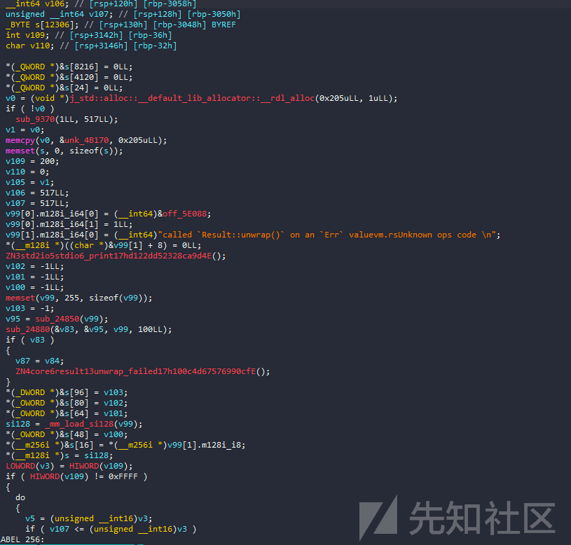](https://xzfile.aliyuncs.com/media/upload/picture/20240204001353-39930184-c2af-1.png)  
这是主循环，以及相关 opcode 的处理

[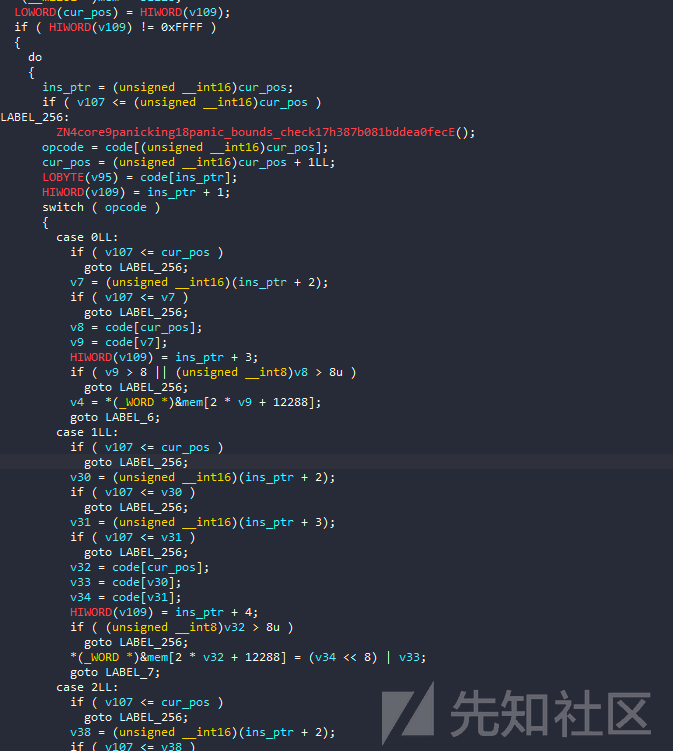](https://xzfile.aliyuncs.com/media/upload/picture/20240204001422-4ab7d9da-c2af-1.png)

逆向一个 VM 题 最重要的还是确定以下因素：

```plain
- opcode
- register
- memory
- instruction pointer
- stack
```

首先，我们有一个基本的缓冲区，姑且称之为 mem，在粗略的调试后，我知道寄存器位于&mem +0x3000 的位置，共有 9 个寄存器，大小为 16 位。  
堆栈位于&mem +0x1000 上，mem 的头部将包含我们的输入。  
每个操作码都取一个指令的第一个字节，指令长度不是固定的，可以是 2、3 或 4 个字节。

[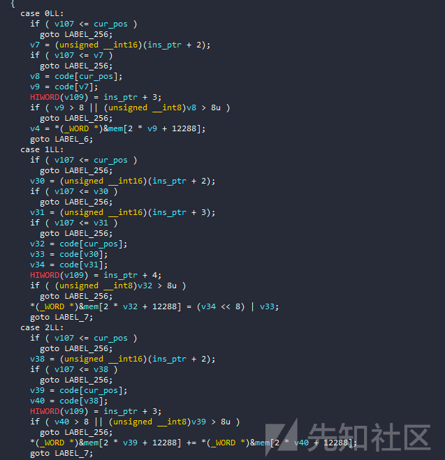](https://xzfile.aliyuncs.com/media/upload/picture/20240204001638-9c0927bc-c2af-1.png)

[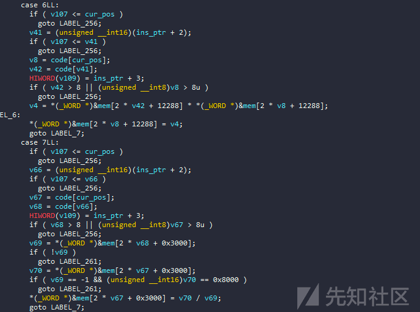](https://xzfile.aliyuncs.com/media/upload/picture/20240204001646-a0e5dca8-c2af-1.png)  
我们看到第一个指令通常是基本的操作符，如 mov，add,xor 等。  
接下来是更难的指令，如 cmp 或 jmp，jne，jg 等。

[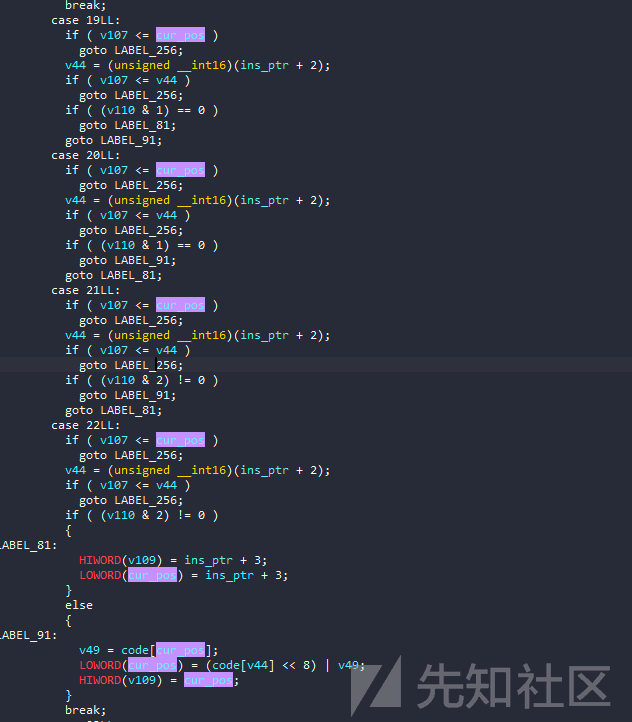](https://xzfile.aliyuncs.com/media/upload/picture/20240204001718-b3f47a98-c2af-1.png)  
在这个 vm 中，我区分 call 和 ret 的原因是因为除了 push 命令之外，pop 与堆栈交互，它还将返回地址推到堆栈上，反之亦然。

[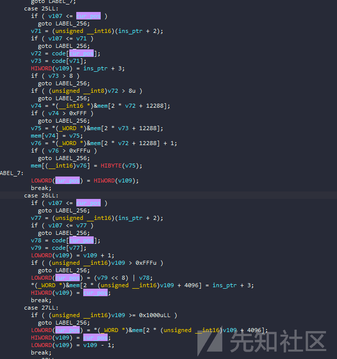](https://xzfile.aliyuncs.com/media/upload/picture/20240204001807-d0de3c5c-c2af-1.png)

# 编写反汇编程序

因此，从这些数据中，我们可以很容易地写出一个基本的反汇编程序。

```plain
code = b'\x01\x00\x01\x00\x01\x01p\x00\x01\x02\x02\x00\x19\x01\x00\x02\x01\x02\x19\x01\x00\x02\x01\x02\x01\x00\x02\x00\x19\x01\x00\x02\x01\x02\x19\x01\x00\x01\x00\xff\xff\x02\x01\x02\x19\x01\x00\x02\x01\x02\x19\x01\x00\x01\x00\xfe\xff\x02\x01\x02\x19\x01\x00\x02\x01\x02\x19\x01\x00\x01\x00\x02\x00\x01\x01\x80\x00\x19\x01\x00\x01\x00\xfe\xff\x02\x01\x02\x19\x01\x00\x01\x00\x01\x00\x02\x01\x02\x19\x01\x00\x01\x00\xff\xff\x02\x01\x02\x19\x01\x00\x01\x00\x02\x00\x02\x01\x02\x19\x01\x00\x01\x00\xfe\xff\x02\x01\x02\x19\x01\x00\x01\x00\x01\x00\x02\x01\x02\x19\x01\x00\x01\x00\xff\xff\x02\x01\x02\x19\x01\x00\x01\x07\x02\x00\x01\x08\x06\x00\x1ah\x01\x01\x03\x00\x00\x01\x01\x00\x00\x02\x01\x03\x04\x01\x01\x00\x02\x01\x01\x04\x04\x00\x0e\x02\x04\x01\x04\x0f\x00\x0b\x01\x04\x1a\xf1\x00\x01\x04\x00\x00\x11\x00\x04\x13\xed\x00\x00\x07\x01\x00\x08\x02\x1a\x8c\x01\x01\x04\x01\x00\x11\x00\x04\x13\xed\x00\x1ah\x01\x01\x01\x01\x00\x02\x03\x01\x12\xa5\x00\x1a\xac\x01\x17\x0f\x03\x0f\x04\x0f\x05\x0f\x06\x01\x03\x07\x00\x01\x04\xff\xff\x11\x01\x04\x16T\x01\x11\x01\x03\x15T\x01\x11\x02\x04\x16T\x01\x11\x02\x03\x15T\x01\x01\x04\x00\x00\x01\x03p\x00\x02\x03\x04\x05\x03\x03\x02\x03\x07\x11\x03\x01\x14C\x01\x01\x03\x80\x00\x02\x03\x04\x05\x03\x03\x02\x03\x08\x11\x03\x02\x13[\x01\x01\x03\x02\x00\x02\x04\x03\x01\x03\x0e\x00\x11\x04\x03\x16\x1d\x01\x01\x00\x00\x00\x12_\x01\x01\x00\x01\x00\x10\x06\x10\x05\x10\x04\x10\x03\x1b\x0f\x01\x0f\x02\x0f\x03\x01\x01\xa0\x00\x02\x01\x08\x04\x03\x01\x01\x02\x01\x00\r\x02\x07\x0c\x03\x02\x18\x01\x03\x10\x03\x10\x02\x10\x01\x1b\x0f\x01\x0f\x02\x01\x01\xa0\x00\x02\x01\x08\x04\x01\x01\x0e\x01\x07\x01\x02\x01\x00\x0b\x01\x02\x00\x00\x01\x10\x02\x10\x01\x1b\x0f\x01\x0f\x02\x0f\x03\x0f\x04\x01\x00\x00\x00\x01\x01\xa0\x00\x01\x02\xa8\x00\x01\x03\x01\x00\x04\x04\x01\x02\x00\x04\x02\x01\x03\x11\x01\x02\x14\xc4\x01\x01\x01\xf8\x07\x00\x02\x00\x01\x00\x00\x00\x11\x01\x02\x14\xfc\x01\x01\x01\x07\x00\x11\x07\x01\x14\xfc\x01\x01\x01\x02\x00\x11\x08\x01\x14\xfc\x01\x01\x00\x01\x00\x10\x04\x10\x03\x10\x02\x10\x01\x1b'

ip = 0
while ip < len(code):
    opcode = code[ip]
    ins = f'L_{hex(ip)}:   {opcode}'.ljust(20,' ')
    match opcode:
        case 0:
            v1 = code[ip+1]
            v2 = code[ip+2]
            ins += f"mov reg{v1}, reg{v2}"
            ip += 3
        case 1:
            v1 = code[ip+1]
            v2 = code[ip+2]
            v3 = code[ip+3]
            ins += f"mov reg{v1}, {hex((v3<<8)|v2)}"
            ip += 4
        case 2:
            v1 = code[ip+1]
            v2 = code[ip+2]
            ins += f"add reg{v1}, reg{v2}"
            ip += 3
        case 3:
            v1 = code[ip+1]
            v2 = code[ip+2]
            ins += f"sub reg{v1}, reg{v2}"
            ip += 3
        case 4:
            v1 = code[ip+1]
            v2 = code[ip+2]
            ins += f"mov reg{v1}, BYTE mem[reg{v2}]"
            ip += 3
        case 5:
            v1 = code[ip+1]
            v2 = code[ip+2]
            ins += f"mov reg{v1}, WORD mem[reg{v2}]"
            ip += 3
        case 6:
            v1 = code[ip+1]
            v2 = code[ip+2]
            ins += f"mul reg{v1}, reg{v2}"
            ip += 3
        case 7:
            v1 = code[ip+1]
            v2 = code[ip+2]
            ins += f"div reg{v1}, reg{v2}"
            ip += 3
        case 8:
            v1 = code[ip+1]
            v2 = code[ip+2]
            ins += f"mod reg{v1}, reg{v2}"
            ip += 3
        case 9:
            v1 = code[ip+1]
            v2 = code[ip+2]
            ins += f"xor reg{v1}, reg{v2}"
            ip += 3
        case 10:
            v1 = code[ip+1]
            ins += f"not reg{v1}"
            ip += 2
        case 11:
            v1 = code[ip+1]
            v2 = code[ip+2]
            ins += f"and reg{v1}, reg{v2}"
            ip += 3
        case 12:
            v1 = code[ip+1]
            v2 = code[ip+2]
            ins += f"or reg{v1}, reg{v2}"
            ip += 3
        case 13:
            v1 = code[ip+1]
            v2 = code[ip+2]
            ins += f"shl reg{v1}, reg{v2}"
            ip += 3
        case 14:
            v1 = code[ip+1]
            v2 = code[ip+2]
            ins += f"shr reg{v1}, reg{v2}"
            ip += 3
        case 15:
            v1 = code[ip+1]
            ins += f"push reg{v1}"
            ip += 2
        case 16:
            v1 = code[ip+1]
            ins += f"pop reg{v1}"
            ip += 2
        case 17:
            v1 = code[ip+1]
            v2 = code[ip+2]
            ins += f"cmp reg{v1}, reg{v2}"
            ip += 3
        case 18:
            v1 = code[ip+1]
            v2 = code[ip+2]
            ins += f"jmp {hex(v1|(v2<<8))}"
            ip += 3
        case 19:
            v1 = code[ip+1]
            v2 = code[ip+2]
            ins += f"je {hex(v1|(v2<<8))}"
            ip += 3 
        case 20:
            v1 = code[ip+1]
            v2 = code[ip+2]
            ins += f"jne {hex(v1|(v2<<8))}"
            ip += 3 
        case 21:
            v1 = code[ip+1]
            v2 = code[ip+2]
            ins += f"jl {hex(v1|(v2<<8))}"
            ip += 3
        case 22:
            v1 = code[ip+1]
            v2 = code[ip+2]
            ins += f"jge {hex(v1|(v2<<8))}"
            ip += 3
        case 23:
            ins += f'final check ;(reg0==1)?(WIN:LOST)\n'
            ip+=1
        case 24:
            v1 = code[ip+1]
            v2 = code[ip+2]
            ins += f"mov BYTE [reg{v1}], reg{v2}"
            ip += 3
        case 25:
            v1 = code[ip+1]
            v2 = code[ip+2]
            ins += f"mov WORD [reg{v1}], reg{v2}"
            ip += 3
        case 26:
            v1 = code[ip+1]
            v2 = code[ip+2]
            ins += f"call {hex(v1|(v2<<8))}"
            ip += 3
        case 27:
            ins += f"ret\n"
            ip += 1
        case 28:
            ins = 'exit'
            ip+=1
        case _:
            print('Unknown opcode!')
            break
    print(ins)
```

由于指令数量较少，所以我使用了 switch-case 语句以提高执行速度。在反汇编和稍微调整后，我得到了以下优雅的代码段：

```plain
L_0x0:   1          mov reg0, 0x1
L_0x4:   1          mov reg1, 0x70
L_0x8:   1          mov reg2, 0x2
L_0xc:   25         mov WORD [reg1], reg0
L_0xf:   2          add reg1, reg2
L_0x12:   25        mov WORD [reg1], reg0
L_0x15:   2         add reg1, reg2
L_0x18:   1         mov reg0, 0x2
L_0x1c:   25        mov WORD [reg1], reg0
L_0x1f:   2         add reg1, reg2
L_0x22:   25        mov WORD [reg1], reg0
L_0x25:   1         mov reg0, 0xffff
L_0x29:   2         add reg1, reg2
L_0x2c:   25        mov WORD [reg1], reg0
L_0x2f:   2         add reg1, reg2
L_0x32:   25        mov WORD [reg1], reg0
L_0x35:   1         mov reg0, 0xfffe
L_0x39:   2         add reg1, reg2
L_0x3c:   25        mov WORD [reg1], reg0
L_0x3f:   2         add reg1, reg2
L_0x42:   25        mov WORD [reg1], reg0
L_0x45:   1         mov reg0, 0x2
L_0x49:   1         mov reg1, 0x80
L_0x4d:   25        mov WORD [reg1], reg0
L_0x50:   1         mov reg0, 0xfffe
L_0x54:   2         add reg1, reg2
L_0x57:   25        mov WORD [reg1], reg0
L_0x5a:   1         mov reg0, 0x1
L_0x5e:   2         add reg1, reg2
L_0x61:   25        mov WORD [reg1], reg0
L_0x64:   1         mov reg0, 0xffff
L_0x68:   2         add reg1, reg2
L_0x6b:   25        mov WORD [reg1], reg0
L_0x6e:   1         mov reg0, 0x2
L_0x72:   2         add reg1, reg2
L_0x75:   25        mov WORD [reg1], reg0
L_0x78:   1         mov reg0, 0xfffe
L_0x7c:   2         add reg1, reg2
L_0x7f:   25        mov WORD [reg1], reg0
L_0x82:   1         mov reg0, 0x1
L_0x86:   2         add reg1, reg2
L_0x89:   25        mov WORD [reg1], reg0
L_0x8c:   1         mov reg0, 0xffff
L_0x90:   2         add reg1, reg2
L_0x93:   25        mov WORD [reg1], reg0
L_0x96:   1         mov reg7, 0x2
L_0x9a:   1         mov reg8, 0x6
L_0x9e:   26        call 0x168
L_0xa1:   1         mov reg3, 0x0
L_0xa5:   1         mov reg1, 0x0
L_0xa9:   2         add reg1, reg3
L_0xac:   4         mov reg1, BYTE mem[reg1]
L_0xaf:   0         mov reg2, reg1
L_0xb2:   1         mov reg4, 0x4
L_0xb6:   14        shr reg2, reg4
L_0xb9:   1         mov reg4, 0xf
L_0xbd:   11        and reg1, reg4
L_0xc0:   26        call 0xf1
L_0xc3:   1         mov reg4, 0x0
L_0xc7:   17        cmp reg0, reg4
L_0xca:   19        je 0xed
L_0xcd:   0         mov reg7, reg1
L_0xd0:   0         mov reg8, reg2
L_0xd3:   26        call 0x18c
L_0xd6:   1         mov reg4, 0x1
L_0xda:   17        cmp reg0, reg4
L_0xdd:   19        je 0xed
L_0xe0:   26        call 0x168
L_0xe3:   1         mov reg1, 0x1
L_0xe7:   2         add reg3, reg1
L_0xea:   18        jmp 0xa5
L_0xed:   26        call 0x1ac
L_0xf0:   23        final check ;(reg0==1)?(WIN:LOST)

L_0xf1:   15        push reg3
L_0xf3:   15        push reg4
L_0xf5:   15        push reg5
L_0xf7:   15        push reg6
L_0xf9:   1         mov reg3, 0x7
L_0xfd:   1         mov reg4, 0xffff
L_0x101:   17       cmp reg1, reg4
L_0x104:   22       jle 0x154
L_0x107:   17       cmp reg1, reg3
L_0x10a:   21       jg 0x154
L_0x10d:   17       cmp reg2, reg4
L_0x110:   22       jle 0x154
L_0x113:   17       cmp reg2, reg3
L_0x116:   21       jg 0x154
L_0x119:   1        mov reg4, 0x0
L_0x11d:   1        mov reg3, 0x70
L_0x121:   2        add reg3, reg4
L_0x124:   5        mov reg3, WORD mem[reg3]
L_0x127:   2        add reg3, reg7
L_0x12a:   17       cmp reg3, reg1
L_0x12d:   20       jne 0x143
L_0x130:   1        mov reg3, 0x80
L_0x134:   2        add reg3, reg4
L_0x137:   5        mov reg3, WORD mem[reg3]
L_0x13a:   2        add reg3, reg8
L_0x13d:   17       cmp reg3, reg2
L_0x140:   19       je 0x15b
L_0x143:   1        mov reg3, 0x2
L_0x147:   2        add reg4, reg3
L_0x14a:   1        mov reg3, 0xe
L_0x14e:   17       cmp reg4, reg3
L_0x151:   22       jle 0x11d
L_0x154:   1        mov reg0, 0x0
L_0x158:   18       jmp 0x15f
L_0x15b:   1        mov reg0, 0x1
L_0x15f:   16       pop reg6
L_0x161:   16       pop reg5
L_0x163:   16       pop reg4
L_0x165:   16       pop reg3
L_0x167:   27       ret

L_0x168:   15       push reg1
L_0x16a:   15       push reg2
L_0x16c:   15       push reg3
L_0x16e:   1        mov reg1, 0xa0
L_0x172:   2        add reg1, reg8
L_0x175:   4        mov reg3, BYTE mem[reg1]
L_0x178:   1        mov reg2, 0x1
L_0x17c:   13       shl reg2, reg7
L_0x17f:   12       or reg3, reg2
L_0x182:   24       mov BYTE [reg1], reg3
L_0x185:   16       pop reg3
L_0x187:   16       pop reg2
L_0x189:   16       pop reg1
L_0x18b:   27       ret

L_0x18c:   15       push reg1
L_0x18e:   15       push reg2
L_0x190:   1        mov reg1, 0xa0
L_0x194:   2        add reg1, reg8
L_0x197:   4        mov reg1, BYTE mem[reg1]
L_0x19a:   14       shr reg1, reg7
L_0x19d:   1        mov reg2, 0x1
L_0x1a1:   11       and reg1, reg2
L_0x1a4:   0        mov reg0, reg1
L_0x1a7:   16       pop reg2
L_0x1a9:   16       pop reg1
L_0x1ab:   27       ret

L_0x1ac:   15       push reg1
L_0x1ae:   15       push reg2
L_0x1b0:   15       push reg3
L_0x1b2:   15       push reg4
L_0x1b4:   1        mov reg0, 0x0
L_0x1b8:   1        mov reg1, 0xa0
L_0x1bc:   1        mov reg2, 0xa8
L_0x1c0:   1        mov reg3, 0x1
L_0x1c4:   4        mov reg4, BYTE mem[reg1]
L_0x1c7:   2        add reg0, reg4
L_0x1ca:   2        add reg1, reg3
L_0x1cd:   17       cmp reg1, reg2
L_0x1d0:   20       jne 0x1c4
L_0x1d3:   1        mov reg1, 0x7f8
L_0x1d7:   0        mov reg2, reg0
L_0x1da:   1        mov reg0, 0x0
L_0x1de:   17       cmp reg1, reg2
L_0x1e1:   20       jne 0x1fc
L_0x1e4:   1        mov reg1, 0x7
L_0x1e8:   17       cmp reg7, reg1
L_0x1eb:   20       jne 0x1fc
L_0x1ee:   1        mov reg1, 0x2
L_0x1f2:   17       cmp reg8, reg1
L_0x1f5:   20       jne 0x1fc
L_0x1f8:   1        mov reg0, 0x1
L_0x1fc:   16       pop reg4
L_0x1fe:   16       pop reg3
L_0x200:   16       pop reg2
L_0x202:   16       pop reg1
L_0x204:   27       ret
```

# 分析

我们可以立即看到程序有一个主函数和四个其他函数，分别进行解析：

```plain
L_0x168:   15       push reg1
L_0x16a:   15       push reg2
L_0x16c:   15       push reg3
L_0x16e:   1        mov reg1, 0xa0
L_0x172:   2        add reg1, reg8
L_0x175:   4        mov reg3, BYTE input[reg1]
L_0x178:   1        mov reg2, 0x1
L_0x17c:   13       shl reg2, reg7
L_0x17f:   12       or reg3, reg2
L_0x182:   24       mov BYTE [reg1], reg3
L_0x185:   16       pop reg3
L_0x187:   16       pop reg2
L_0x189:   16       pop reg1
L_0x18b:   27       ret
```

由于 0x168 函数很短，所以它首先从 0x168 函数开始，这个函数试图从给定的索引中启用一位：

```plain
def func_0x168(reg7,reg8):
    reg3 = mem[0xa0 + reg8]
    reg3 = reg3|(1<<reg7)
    mem[0xa0 + reg8] = reg3
```

类似于函数 0x18c，它与上述函数相反，它从给定的索引中提取一位

```plain
L_0x18c:   15       push reg1
L_0x18e:   15       push reg2
L_0x190:   1        mov reg1, 0xa0
L_0x194:   2        add reg1, reg8
L_0x197:   4        mov reg1, BYTE mem[reg1]
L_0x19a:   14       shr reg1, reg7
L_0x19d:   1        mov reg2, 0x1
L_0x1a1:   11       and reg1, reg2
L_0x1a4:   0        mov reg0, reg1
L_0x1a7:   16       pop reg2
L_0x1a9:   16       pop reg1
L_0x1ab:   27       ret
```

```plain
def func_0x18c(reg7,reg8):
    reg1 = mem[0xa0 + reg8]
    return (reg1>>reg7)&1
```

函数 L\_0x1ac 是 main 函数中最后一个被调用的函数。它计算位于 &mem + 0xa0 处的连续 0xa8 个元素的总和，并检查 reg7 是否等于 7 且 reg8 是否等于 2。

```plain
L_0x1ac:   15       push reg1
L_0x1ae:   15       push reg2
L_0x1b0:   15       push reg3
L_0x1b2:   15       push reg4
L_0x1b4:   1        mov reg0, 0x0
L_0x1b8:   1        mov reg1, 0xa0
L_0x1bc:   1        mov reg2, 0xa8
L_0x1c0:   1        mov reg3, 0x1
L_0x1c4:   4        mov reg4, BYTE mem[reg1]
L_0x1c7:   2        add reg0, reg4
L_0x1ca:   2        add reg1, reg3
L_0x1cd:   17       cmp reg1, reg2
L_0x1d0:   20       jne 0x1c4
L_0x1d3:   1        mov reg1, 0x7f8
L_0x1d7:   0        mov reg2, reg0
L_0x1da:   1        mov reg0, 0x0
L_0x1de:   17       cmp reg1, reg2
L_0x1e1:   20       jne 0x1fc
L_0x1e4:   1        mov reg1, 0x7
L_0x1e8:   17       cmp reg7, reg1
L_0x1eb:   20       jne 0x1fc
L_0x1ee:   1        mov reg1, 0x2
L_0x1f2:   17       cmp reg8, reg1
L_0x1f5:   20       jne 0x1fc
L_0x1f8:   1        mov reg0, 0x1
L_0x1fc:   16       pop reg4
L_0x1fe:   16       pop reg3
L_0x200:   16       pop reg2
L_0x202:   16       pop reg1
L_0x204:   27       ret
```

```plain
def func_0x1ac(reg7,reg8):
    i = 0
    s = 0
    while i < 0xa8:
        reg4 = mem[0xa0 + i]
        s += reg4
        i+=1
    if s==0x7f8 and reg7==7 and reg8==2:
        return 1
    return 0
```

对于函数 0xf1，它接受两个参数到 reg1 和 reg2，然后执行操作来检查这两个参数：

```plain
L_0xf1:   15        push reg3
L_0xf3:   15        push reg4
L_0xf5:   15        push reg5
L_0xf7:   15        push reg6
L_0xf9:   1         mov reg3, 0x7
L_0xfd:   1         mov reg4, 0xffff
L_0x101:   17       cmp reg1, reg4
L_0x104:   22       jge 0x154
L_0x107:   17       cmp reg1, reg3
L_0x10a:   21       jl 0x154
L_0x10d:   17       cmp reg2, reg4
L_0x110:   22       jge 0x154
L_0x113:   17       cmp reg2, reg3
L_0x116:   21       jl 0x154
L_0x119:   1        mov reg4, 0x0
L_0x11d:   1        mov reg3, 0x70
L_0x121:   2        add reg3, reg4
L_0x124:   5        mov reg3, WORD mem[reg3]
L_0x127:   2        add reg3, reg7
L_0x12a:   17       cmp reg3, reg1
L_0x12d:   20       jne 0x143
L_0x130:   1        mov reg3, 0x80
L_0x134:   2        add reg3, reg4
L_0x137:   5        mov reg3, WORD mem[reg3]
L_0x13a:   2        add reg3, reg8
L_0x13d:   17       cmp reg3, reg2
L_0x140:   19       je 0x15b
L_0x143:   1        mov reg3, 0x2
L_0x147:   2        add reg4, reg3
L_0x14a:   1        mov reg3, 0xe
L_0x14e:   17       cmp reg4, reg3
L_0x151:   22       jge 0x11d
L_0x154:   1        mov reg0, 0x0
L_0x158:   18       jmp 0x15f
L_0x15b:   1        mov reg0, 0x1
L_0x15f:   16       pop reg6
L_0x161:   16       pop reg5
L_0x163:   16       pop reg4
L_0x165:   16       pop reg3
L_0x167:   27       ret

def func_0xf1(reg1,reg2,reg7,reg8):
    if reg1<= -1 or reg1 > 7 or reg2 <= -1 or reg2 > 7:
        return 0
    i = 0
    while i < 0xe:
        reg3 = mem[0x70 + i]
        reg3 += reg7
        if reg3==reg1:
            reg3 = mem[0x80 + i]
            reg3 += reg8
            if reg3==reg2:
                return 1
        i+=2
    return 0
```

最后是 main：

```plain
L_0x0:   1          mov reg0, 0x1
L_0x4:   1          mov reg1, 0x70
L_0x8:   1          mov reg2, 0x2
L_0xc:   25         mov WORD [reg1], reg0
L_0xf:   2          add reg1, reg2
L_0x12:   25        mov WORD [reg1], reg0
...
L_0x96:   1         mov reg7, 0x2
L_0x9a:   1         mov reg8, 0x6
L_0x9e:   26        call 0x168
L_0xa1:   1         mov reg3, 0x0
L_0xa5:   1         mov reg1, 0x0
L_0xa9:   2         add reg1, reg3
L_0xac:   4         mov reg1, BYTE mem[reg1]
L_0xaf:   0         mov reg2, reg1
L_0xb2:   1         mov reg4, 0x4
L_0xb6:   14        shr reg2, reg4
L_0xb9:   1         mov reg4, 0xf
L_0xbd:   11        and reg1, reg4
L_0xc0:   26        call 0xf1
L_0xc3:   1         mov reg4, 0x0
L_0xc7:   17        cmp reg0, reg4
L_0xca:   19        je 0xed
L_0xcd:   0         mov reg7, reg1
L_0xd0:   0         mov reg8, reg2
L_0xd3:   26        call 0x18c
L_0xd6:   1         mov reg4, 0x1
L_0xda:   17        cmp reg0, reg4
L_0xdd:   19        je 0xed
L_0xe0:   26        call 0x168
L_0xe3:   1         mov reg1, 0x1
L_0xe7:   2         add reg3, reg1
L_0xea:   18        jmp 0xa5
L_0xed:   26        call 0x1ac
L_0xf0:   23        final check ;(reg0==1)?(WIN:LOST)
```

把所有的东西都放在一起之后，我们得到了如下的程序代码：

```plain
mem = []
def func_0x168(reg7,reg8):
    reg3 = mem[0xa0 + reg8]
    reg3 = reg3|(1<<reg7)
    mem[0xa0 + reg8] = reg3

def func_0x18c(reg7,reg8):
    reg1 = mem[0xa0 + reg8]
    return (reg1>>reg7)&1

def func_0x1ac(reg7,reg8):
    i = 0
    s = 0
    while i < 0xa8:
        reg4 = mem[0xa0 + i]
        s += reg4
        i+=1
    if s==0x7f8 and reg7==7 and reg8==2:
        return 1
    return 0

def func_0xf1(reg1,reg2,reg7,reg8):
    if reg1<= -1 or reg1 > 7 or reg2 <= -1 or reg2 > 7:
        return 0
    i = 0
    while i < 0xe:
        reg3 = mem[0x70 + i]
        reg3 += reg7
        if reg3==reg1:
            reg3 = mem[0x80 + i]
            reg3 += reg8
            if reg3==reg2:
                return 1
        i+=2
    return 0


def main(input):
    mem[0x70:0x7e] = [1,1,2,2,-1,-1,-2,-2,...] 
    mem[0x80:0x8e] = [2,-2,1,-1,2,-2,1,-1,...] 
    reg7 = 2
    reg8 = 6
    func_0x168(reg7,reg8)
    i = 0
    while True:
        b = input[i]
        reg2 = b>>4
        reg1 = b&0xf
        if func_0xf1(reg1,reg2,reg7,reg8) == 0:
            break
        reg7,reg8 = reg1,reg2
        if func_0x18c(reg7,reg8)==1:
            break
        func_0x168(reg7,reg8)
        i+=1
    func_0x1ac()
    exit()
```

# 解决

现在我们要做的就是思考这究竟是什么？  
经过研究，我们确实得到了一个 8 × 8 的矩阵，但它是以位的形式出现的，也就是 64 位。

[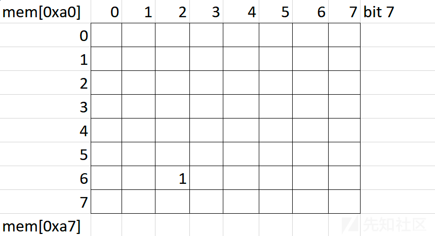](https://xzfile.aliyuncs.com/media/upload/picture/20240204002632-fda9a13a-c2b0-1.png)

接下来我们的输入会改变这个矩阵中的比特，而不是在那些已经打开的比特上。  
当我们打开矩阵中的所有位（总和= 0x7f8 = 2040）时，我们就赢了，并且有了标志。  
这一切都让我想起了国际象棋中一个有趣的游戏，那就是步巡码：  
[https://vi.wikipedia.org/wiki/B%C3%A0i\_to%C3%A1n\_m%C3%A3\_%C4%91i\_tu%E1%BA%A7n](https://vi.wikipedia.org/wiki/B%C3%A0i_to%C3%A1n_m%C3%A3_%C4%91i_tu%E1%BA%A7n) [https://en.wikipedia.org/wiki/Knight%27s\_tour](https://en.wikipedia.org/wiki/Knight%27s_tour)

[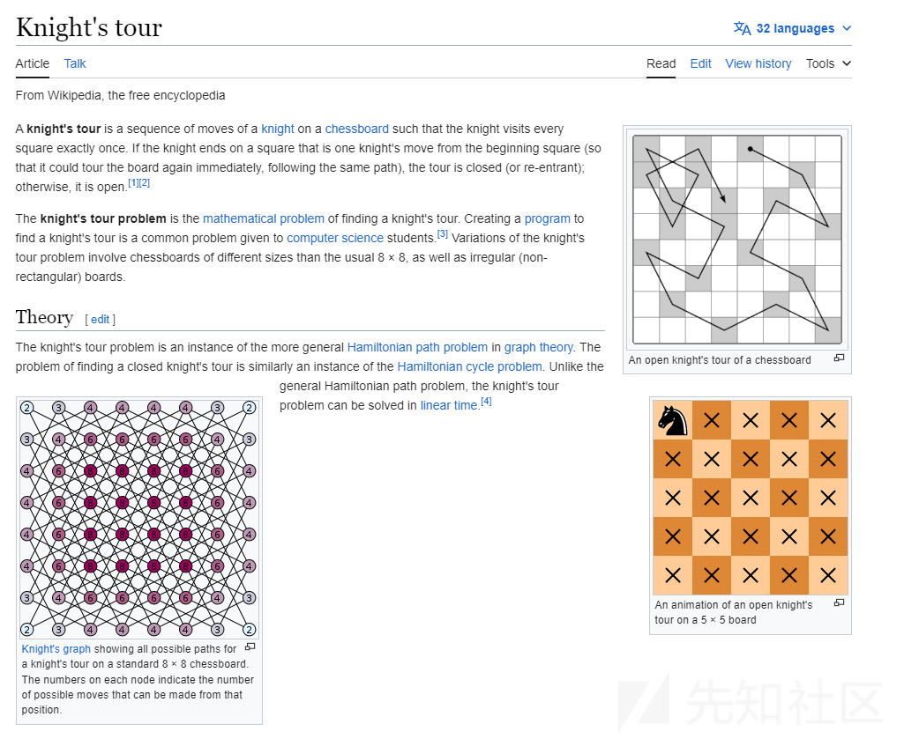](https://xzfile.aliyuncs.com/media/upload/picture/20240204002704-1128df50-c2b1-1.png)  
总而言之，在棋盘上，马有一个非常有趣的移动，它可以走完整个棋盘而不去覆盖旧的。我们可以为马选择两个起点和终点，并找到正确的路径。  
准确地说，下面存储的值是有效的马的移动：

```plain
mem[0x70:0x7e] = [1,1,2,2,-1,-1,-2,-2,...] 
mem[0x80:0x8e] = [2,-2,1,-1,2,-2,1,-1,...]
```

我们有函数 func\_0x168 来标记移动，func\_0xf1 来检查移动是否有效，func\_0x1ac 来检查棋盘并给出最后一个标志。在输入中，前 4 位和后 4 位是下一个移动的坐标。  
至此，我只需要解决下一次巡逻的密码问题就可以找到旗子，有两种解决方法：  
做手，因为它有诀窍，很快就找到了路  
代码使用了一个算法，我尝试使用 bFS/dFS 来查找路径，但是它只适用于任何端点，而不是像程序（7，2）中那样在端点之前选择。  
在紧急情况下，我已经按照这个视频指导做了手，我们有如下的开始和结束：

[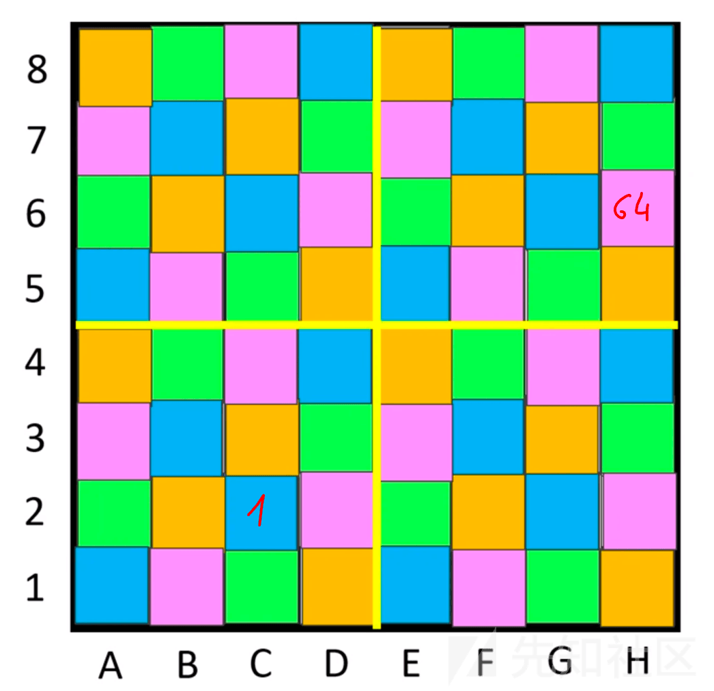](https://xzfile.aliyuncs.com/media/upload/picture/20240204002754-2e88aabc-c2b1-1.png)  
我的工作就是让我的小马一个接一个地走完与起点相对应的颜色序列，然后把它放进包含最后一个终点的颜色序列。

[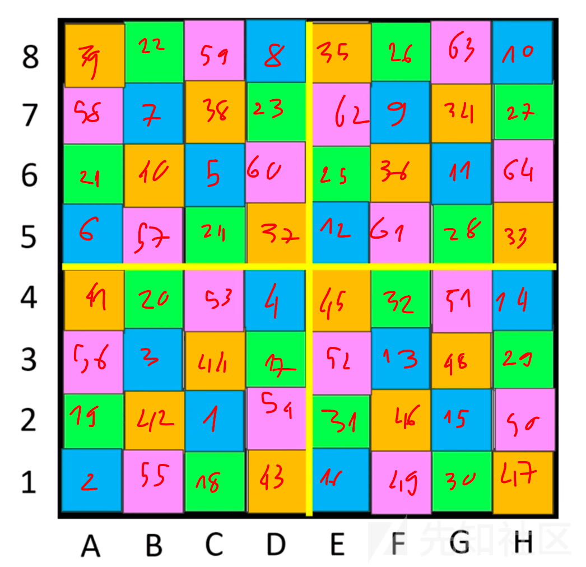](https://xzfile.aliyuncs.com/media/upload/picture/20240204002809-377b7e06-c2b1-1.png)

[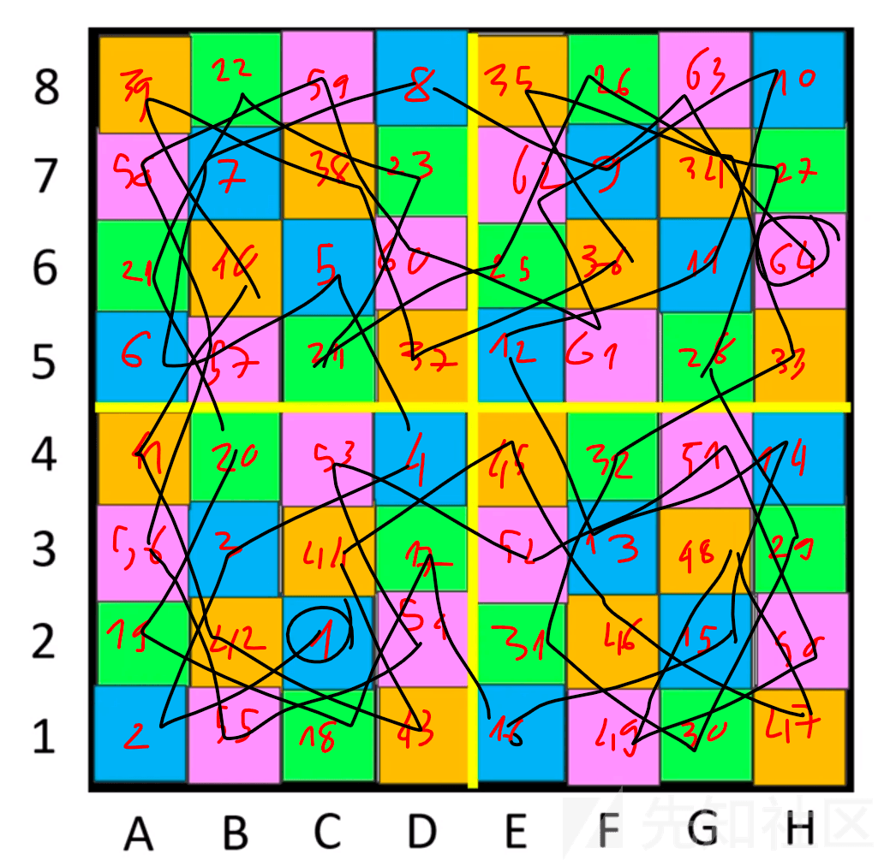](https://xzfile.aliyuncs.com/media/upload/picture/20240204002814-3a98986c-c2b1-1.png)  
这不需要时间，太多了。从这里我们只需要转换成合法的路由并发送到程序。

```plain
from pwn import *
chess = [
    [39,22,59,8,35,26,63,10],
    [58,7,38,23,62,9,34,27],
    [21,40,5,60,25,36,11,64],
    [6,57,24,37,12,61,28,33],
    [41,20,53,4,45,32,51,14],
    [56,3,44,17,52,13,48,29],
    [19,42,1,54,31,46,15,50],
    [2,55,18,43,16,49,30,47]
]
flat = []
for l in chess:
    flat.extend(l)
to_send = []
for i in range(2,65):
    if i not in flat:
        print('sus',i)
    pos = flat.index(i)
    x,y = (pos%8,pos//8)
    to_send.append((y<<4)|x)
to_send = bytes(to_send)
print(to_send)
# io = process('./rust_vm')
io = remote('139.162.1.95',31337)
io.recv()
io.sendline(to_send)
io.interactive()
```

[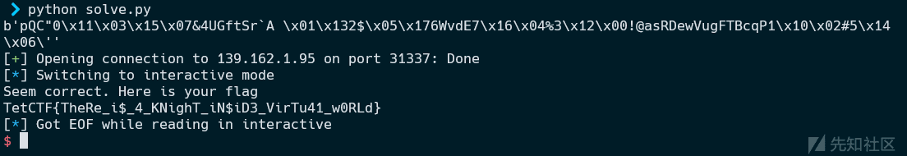](https://xzfile.aliyuncs.com/media/upload/picture/20240204002838-49331546-c2b1-1.png)  
Flag: TetCTF{TheRe\_i$\_4\_KNighT\_iN$iD3\_VirTu41\_w0RLd}
