# Unidbg 如何秒解 CTF-Android 题目？ - 先知社区

Unidbg 如何秒解 CTF-Android 题目？

- - -

本文没有分享 Unidbg 最基础东西，比如 Unidbg 是什么，主要写了 Unidbg 如何应用。  
实战过好，不禁感叹，Unidbg 在模拟 so 这块真的是太方便啦。  
完整 Unidbg 脚本会放在后面，本文的重点在于使用 Unidbg 的分析 so 能力，关于 Unidbg 的安装可以自行搜索。

# 创建一个项目框架

[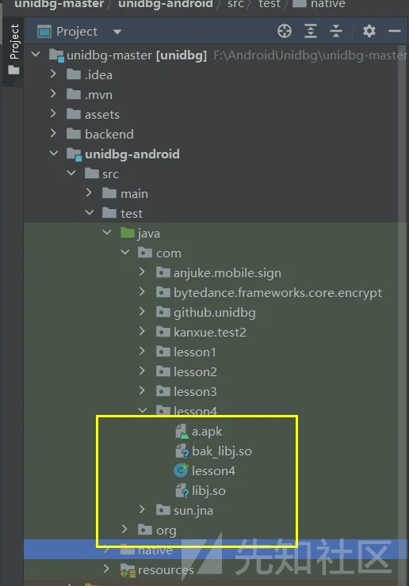](https://xzfile.aliyuncs.com/media/upload/picture/20240127225224-ae59a4aa-bd23-1.png)

## Java 层分析

使用 aapt 获得对应的启动 Activity

```plain
aapt dump badging apk 名字
```

[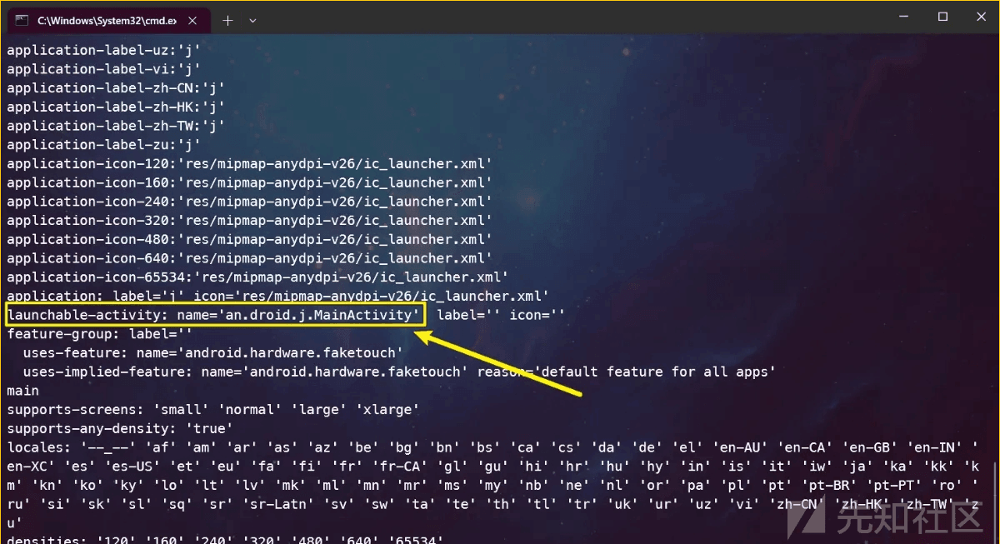](https://xzfile.aliyuncs.com/media/upload/picture/20240127225355-e4ac341e-bd23-1.png)

开始分析代码

可以看到，重点是分析 so 的 j 和 p 方法

[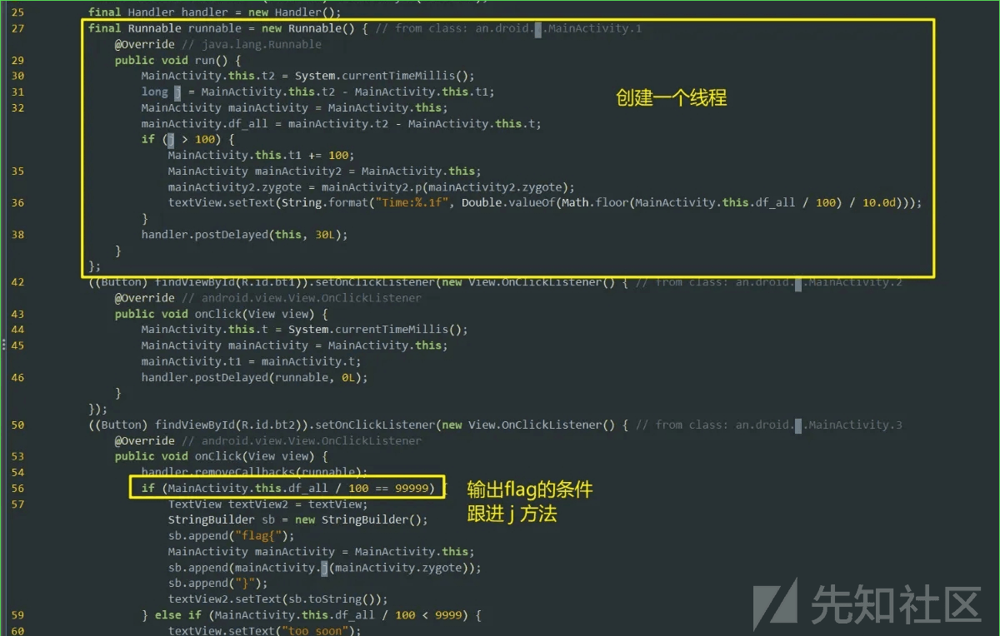](https://xzfile.aliyuncs.com/media/upload/picture/20240127225524-1a11acce-bd24-1.png)

## so 分析

有两个 so 文件，先看 app 使用的 libj.so

分析 libj.so

[](https://xzfile.aliyuncs.com/media/upload/picture/20240127230927-108cbdea-bd26-1.png)

搜索 JNI\_onload，说明是静态注册函数

[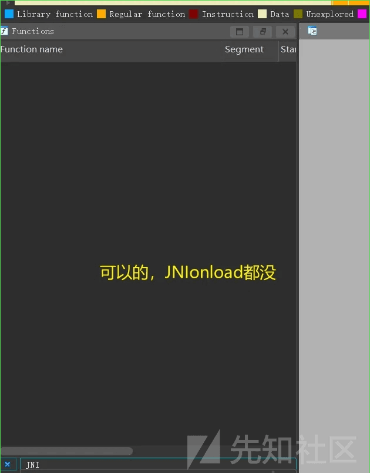](https://xzfile.aliyuncs.com/media/upload/picture/20240127225658-51a1e352-bd24-1.png)

[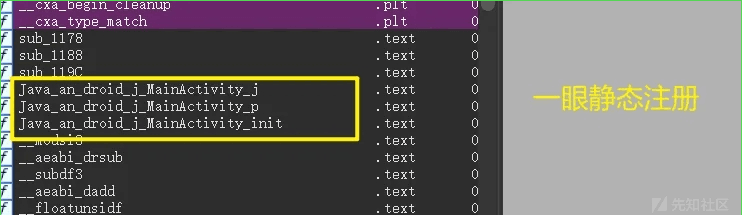](https://xzfile.aliyuncs.com/media/upload/picture/20240127225707-570e25ee-bd24-1.png)

## j 方法

先分析 j 方法，发现没有参数，尝试使用 Unidbg 跑一遍（完整脚本在后面，这里不占用文章内容了）

```plain
int __fastcall Java_an_droid_j_MainActivity_j(JNIEnv *a1)
{
  int i; // r1
  int v2; // r0
  int v3; // r0
  char v5[32]; // [sp-40h] [bp-70h] BYREF
  _BYTE v6[36]; // [sp-20h] [bp-50h] BYREF
  JNIEnv *v7; // [sp+4h] [bp-2Ch]
  int *v8; // [sp+8h] [bp-28h]
  int v9; // [sp+Ch] [bp-24h]
  int v10; // [sp+10h] [bp-20h]
  _BYTE *v11; // [sp+14h] [bp-1Ch]
  int v12; // [sp+1Ch] [bp-14h] BYREF

  v8 = &v12;
  v7 = a1;
  for ( i = -1178200092; ; i = 52119689 )
  {
    do
    {
      v3 = i;
      i = 1445388760;
    }
    while ( v3 == -1178200092 );
    if ( v3 == 52119689 )
      break;
    v11 = v6;
    strcpy(v5, "FlagLostHelpMeGetItBack");
    v10 = 30;
    v9 = 97;
    v5[29] = 0;
    *(_WORD *)&v5[27] = 0;
    v5[24] = 0;
    *(_WORD *)&v5[25] = 0;
    v5[30] = 80;
    qmemcpy(v6, v5, 0x1Eu);
    v2 = (int)(*v7)->NewStringUTF(v7, v6);
    *v8 = v2;
  }
  return *v8;
}
```

```plain
public String func_j(){
    DvmClass dvmClass=vm.resolveClass("an.droid.j.MainActivity");
    DvmObject<?> object = dvmClass.newObject(null);
    DvmObject<?> object1 = object.callJniMethodObject(emulator, "j()Ljava/lang/String;");
    return object1.getValue().toString();
}
```

[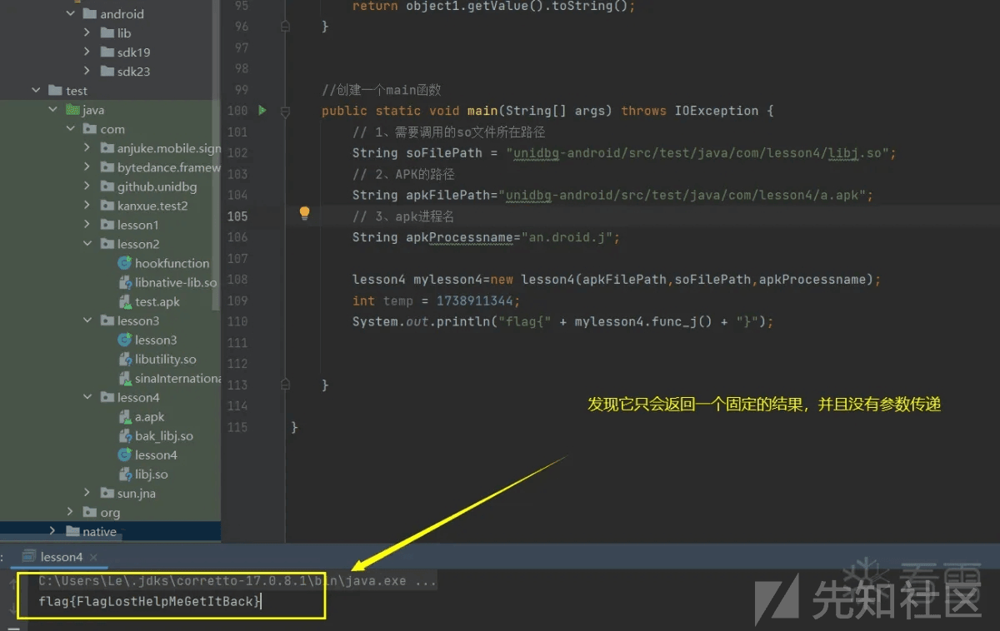](https://xzfile.aliyuncs.com/media/upload/picture/20240127230301-2a23074c-bd25-1.png)

就说这个函数其实并没有什么用，总是返回固定值！

## p 方法

看不了一点，加了混淆

[](https://xzfile.aliyuncs.com/media/upload/picture/20240127230317-33883528-bd25-1.png)

[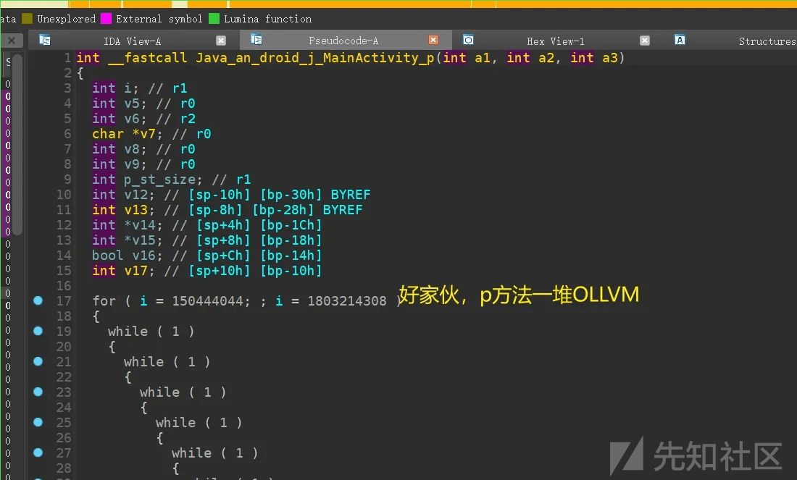](https://xzfile.aliyuncs.com/media/upload/picture/20240127230338-40102dbe-bd25-1.png)  
这里可以使用葫芦娃大佬的插件，Obpo([https://github.com/obpo-project/obpo-plugin)​](https://github.com/obpo-project/obpo-plugin)%E2%80%8B)

使用插件来进行恢复即可（详细使用开看 Obpo 文档）

耐心等待  
[](https://xzfile.aliyuncs.com/media/upload/picture/20240127230351-48511290-bd25-1.png)

[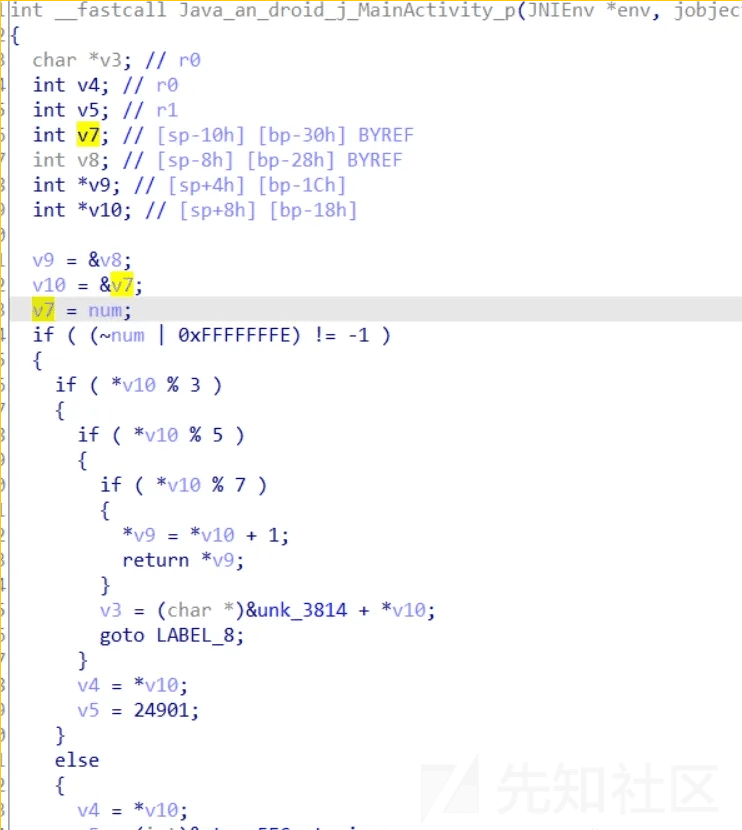](https://xzfile.aliyuncs.com/media/upload/picture/20240127230404-4fe316e8-bd25-1.png)  
发现只是经过一个运算，然后输出对应的值，为了方便以后运算，这里也写出对应的 Unidbg 方法

```plain
public int func_p(int args){
    DvmClass dvmClass=vm.resolveClass("an.droid.j.MainActivity");
    DvmObject<?> object=dvmClass.newObject(null);
    int object1=object.callJniMethodInt(emulator,"p(I)I",args);
    return object1;
}
```

[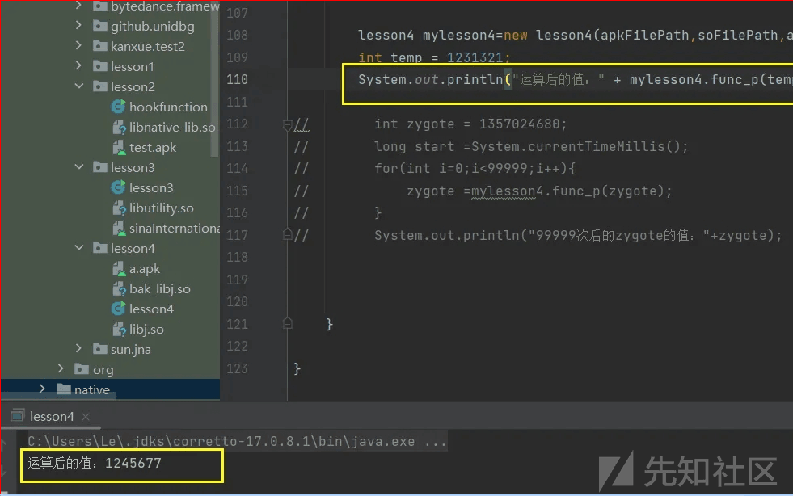](https://xzfile.aliyuncs.com/media/upload/picture/20240127230433-6127b738-bd25-1.png)

## init 方法

该方法在 java 层没有被调用，但不代表没有用处

```plain
jstring __fastcall Java_an_droid_j_MainActivity_init(JNIEnv *a1, jobject a2, int a3)
```

可以看到，它接收一个参数 a3，返回值为 string 类型

[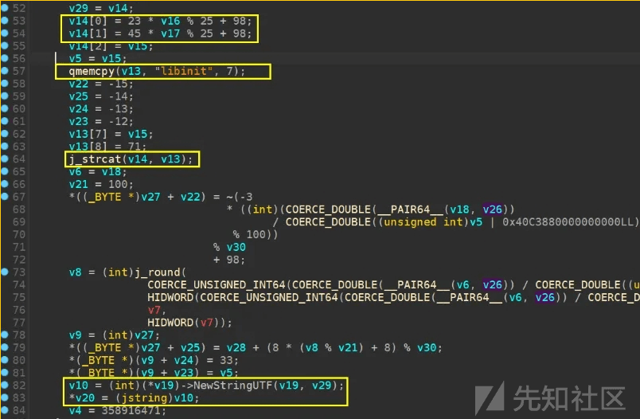](https://xzfile.aliyuncs.com/media/upload/picture/20240127230513-78cbc79e-bd25-1.png)  
其实就是将输入的 int 类型，分别取高四位与低四位作为两个数据，然后计算一个含“libinit”​的字符串并返回

但是加密比较复杂，我们猜测将正确的 zygote 值传入，看师傅能得到 flag

先尝试传递 zygote=9999，看看结果是怎样的？

[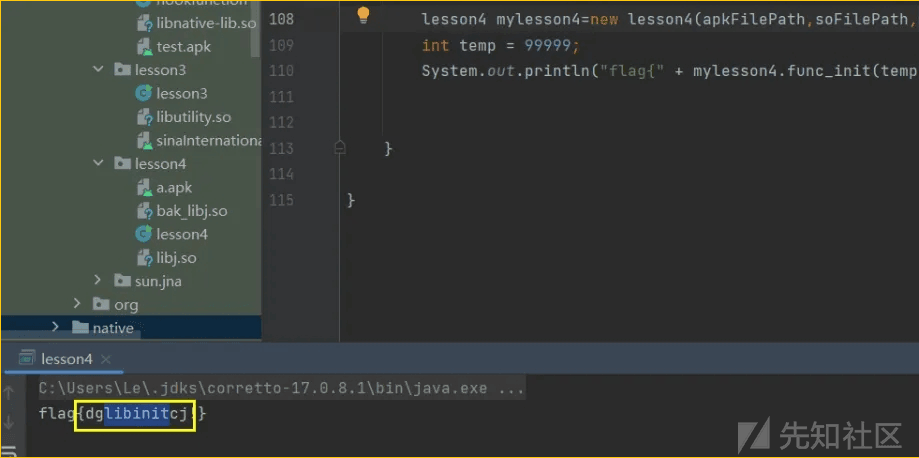](https://xzfile.aliyuncs.com/media/upload/picture/20240127230527-81134f58-bd25-1.png)  
可以看到输出了含有 libinit 的字符串

猜测输入正确的 zygote 值，也将得到 flag

## 获得正确的 zygote 值

正确的 zygote 值要执行 99999 次才能得到，并且调用了 libj.so 的 p 方法，我们也可以使用 Unidbg 来模拟获得这个值

这里写出 p 方法对应的 Unidbg

```plain
public int func_p(int args){
    DvmClass dvmClass=vm.resolveClass("an.droid.j.MainActivity");
    DvmObject<?> object=dvmClass.newObject(null);
    int object1=object.callJniMethodInt(emulator,"p(I)I",args);
    return object1;
}
```

然后使用 Unidbg 写出执行脚本

```plain
int zygote = 1357024680;
long start =System.currentTimeMillis();
for(int i=0;i<99999;i++){
    zygote =mylesson4.func_p(zygote);
}
System.out.println("99999 次后的 zygote 的值："+zygote);
```

但是跑了好长时间，人麻了  
[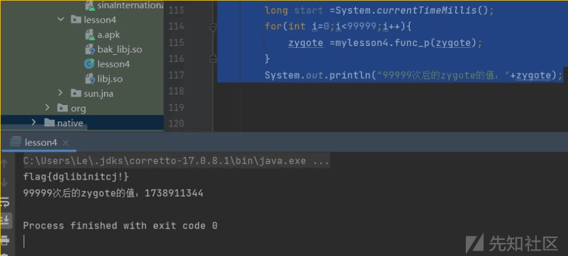](https://xzfile.aliyuncs.com/media/upload/picture/20240127230620-a08c90b0-bd25-1.png)

## 将 zygote 值填入 init 函数

```plain
lesson4 mylesson4=new lesson4(apkFilePath,soFilePath,apkProcessname);
int temp = 1738911344;
System.out.println("flag{" + mylesson4.func_init(temp) + "}");
```

这就是 Unidbg 的强大之处，直接模拟，调用 so 方法一把嗦

[](https://xzfile.aliyuncs.com/media/upload/picture/20240127230656-b6515fa2-bd25-1.png)

# 完整脚本

开始编写 Unidbg 脚本（模板复制一下，稍作修改就可以）

```plain
package com.lesson4;

import com.github.unidbg.linux.android.AndroidEmulatorBuilder;
import com.github.unidbg.linux.android.AndroidResolver;

// 导入通用且标准的类库
import com.github.unidbg.linux.android.dvm.AbstractJni;
import com.github.unidbg.AndroidEmulator;
import com.github.unidbg.Module;
import com.github.unidbg.linux.android.AndroidEmulatorBuilder;
import com.github.unidbg.linux.android.AndroidResolver;
import com.github.unidbg.linux.android.dvm.*;
import com.github.unidbg.linux.android.dvm.array.ByteArray;
import com.github.unidbg.linux.android.dvm.jni.ProxyDvmObject;
import com.github.unidbg.memory.Memory;
import com.lession1.oasis;

import java.io.File;
import java.io.IOException;
import java.util.ArrayList;
import java.util.List;


public class lesson4 extends AbstractJni{
    private final AndroidEmulator emulator; //android 模拟器
    private final VM vm;//vm 虚拟机
    private final Module module;
    private  final Memory memory;
    private  final DalvikModule dm;
    //将该类封装起来，以后直接套用模板
    public lesson4(String apkFilePath,String soFilePath,String apkProcessname) throws IOException {
        // 创建模拟器实例，进程名建议依照实际进程名填写，可以规避针对进程名的校验
        emulator = AndroidEmulatorBuilder.for32Bit().setProcessName(apkProcessname).build();

        //.addBackendFactory(new DynarmicFactory((true)))  下面会创建一个快速模拟器实例，加载速度快，但是某些特性不支持
        //.setProcessName()设置进程名，避免原进程对进程名进行检验


        // 获取模拟器的内存操作接口
        memory = emulator.getMemory();
        // 设置系统类库解析  支持19和23，因为在main/resources/android只集成了两个版本
        memory.setLibraryResolver(new AndroidResolver(23));


        // 创建Android虚拟机,传入APK,可以过掉签名校验，路径比如："unidbg-android\\src\\test\\java\\com\\lesson1\\123.apk"
        vm = emulator.createDalvikVM(new File(apkFilePath));
        vm.setVerbose(false); // 打印日志，会在调用初始化JNI_onload打印一些信息，默认：false

        // 加载目标SO
        dm = vm.loadLibrary(new File(soFilePath), true); // 加载so到虚拟内存，第二个参数：是否需要初始化
        //获取本SO模块的句柄
        module = dm.getModule();

        vm.setJni(this); //设置Jni，防止报错
        //创建完后，需要调用JNI_onload函数
        //dm.callJNI_OnLoad(emulator); // 调用JNI OnLoad，进行动态注册某些函数。如果都是静态注册，那就不用调用这个函数

        //本次样本连个 JNI_onLoad都没有

    }

    //这个是模拟 bak_libj.so的j方法
    public String func_j(String method,double args){
        DvmClass dvmClass=vm.resolveClass("an.droid.j.MainActivity");
        DvmObject<?> object=dvmClass.newObject(null);
        //获得一个DvmObject对象
        //DvmObject object= ProxyDvmObject.createObject(vm,"an.droid.j"); //因为我创建的类全包名和原app不一样，所以换一种方式来寻找到对应的类对象
        DvmObject object1=object.callJniMethodObject(emulator,method,args);
        String return_value=object1.getValue().toString();
        return return_value;

    }


    //下面两个是模拟 libj.so的init、p和j方法
    //均使用了动态获得dvmclass的方式
    public int func_p(int args){
        DvmClass dvmClass=vm.resolveClass("an.droid.j.MainActivity");
        DvmObject<?> object=dvmClass.newObject(null);
        int object1=object.callJniMethodInt(emulator,"p(I)I",args);
        return object1;
    }

    public String func_init(int args){
        DvmClass dvmClass=vm.resolveClass("an.droid.j.MainActivity");
        DvmObject<?> object=dvmClass.newObject(null);
        //方法签名在对应的so文件中推导出，其实不难的，看参数和看返回值
        DvmObject<?> object1 = object.callJniMethodObject(emulator, "init(I)Ljava/lang/String;", args);
        return object1.getValue().toString();
    }
    public String func_j(){
        DvmClass dvmClass=vm.resolveClass("an.droid.j.MainActivity");
        DvmObject<?> object = dvmClass.newObject(null);
        DvmObject<?> object1 = object.callJniMethodObject(emulator, "j()Ljava/lang/String;");
        return object1.getValue().toString();
    }


    //创建一个main函数
    public static void main(String[] args) throws IOException {
        // 1、需要调用的so文件所在路径
        String soFilePath = "unidbg-android/src/test/java/com/lesson4/libj.so";
        // 2、APK的路径
        String apkFilePath="unidbg-android/src/test/java/com/lesson4/a.apk";
        // 3、apk进程名
        String apkProcessname="an.droid.j";

        lesson4 mylesson4=new lesson4(apkFilePath,soFilePath,apkProcessname);
        int temp = 1738911344;
        System.out.println("flag{" + mylesson4.func_init(temp) + "}");

//        int zygote = 1357024680;
//        long start =System.currentTimeMillis();
//        for(int i=0;i<99999;i++){
//            zygote =mylesson4.func_p(zygote);
//        }
//        System.out.println("99999 次后的 zygote 的值："+zygote);


    }

}
```
