# Webassembly 逆向手法 - 先知社区

Webassembly 逆向手法

- - -

# 0x00 前言

WebAssembly 缩写为 wasm，是一种低级的类汇编语言，可以在浏览器中运行。由于其足够“低级”，逆向有非常大的难度。本文主要学习在 ctf 中可能会遇到的 wasm 类题的逆向手法，并不是正向的开发学习。

# 0x01 介绍

从官方的开发文档来看，WebAssembly 是一种运行在现代网络浏览器中的新型代码，并且提供新的性能特性和效果。它设计的目的不是为了手写代码而是为诸如 C、C++ 和 Rust 等低级源语言提供一个高效的编译目标。

特点包括：

1.  **二进制格式：** Wasm 是一种基于栈式虚拟机的二进制指令集，这使得它更紧凑、更快速地加载和解析。
2.  **跨平台：** Wasm 是一个跨平台的执行格式，可以在不同体系结构和操作系统上运行，而不受特定编程语言或硬件的限制。
3.  **性能：** Wasm 被设计为在现代硬件上实现高性能，因此它通常比传统的 JavaScript 执行更快。
4.  **安全性：** Wasm 被设计为在沙盒环境中运行，以增加安全性。它通过强制执行严格的类型检查和内存访问限制来减少安全漏洞的风险。

Wasm 的主要用途之一是将底层的计算密集型任务移至浏览器之外，以便在 Web 应用程序中实现更复杂和性能要求更高的功能。开发人员可以使用诸如 C、C++、Rust 等语言来编写 Wasm 模块，然后通过 JavaScript 或其他支持 Wasm 的语言在 Web 页面中调用这些模块。

而在 ctf 里，一道 wasm 题就是用高级语言编写然后转为 wasm，我们解析 wasm 里的算法。最终给我们的题目形式可能是一个网址，这就够了。

接下来几点是一些基础知识的学习，之后是逆向 wasm 的实战。

# 0x02wasm 文件两种后缀

一是.wasm；二是.wat

## .wasm

下面是一个简要的 WebAssembly（.wasm）文件结构概述：

1.  **魔数（Magic Number）**：
    -   WebAssembly 文件的前四个字节是固定的魔数，用于标识文件格式。魔数为 0x00 0x61 0x73 0x6D，即 ASCII 编码的"\\0asm"。
2.  **版本号（Version Number）**：
    -   紧随魔数之后的四个字节表示 WebAssembly 的版本号。当前版本是 1。
3.  **Sections（段）**：
    -   WebAssembly 文件由多个段组成，每个段都有其特定的功能。常见的段包括：
        -   Type Section（类型段）：定义了函数的参数和返回值类型。
        -   Import Section（导入段）：定义了模块引入的外部函数、表和内存。
        -   Function Section（函数段）：定义了模块中的函数。
        -   Table Section（表段）：定义了模块中的表。
        -   Memory Section（内存段）：定义了模块中的内存。
        -   Global Section（全局段）：定义了模块中的全局变量。
        -   Export Section（导出段）：定义了模块中可供外部访问的函数、表和内存。
        -   Code Section（代码段）：定义了模块中的函数代码。
        -   Data Section（数据段）：定义了模块的初始数据。
4.  **自定义段（Custom Sections）**：
    -   除了上述标准段之外，Wasm 文件还可以包含自定义段，用于存储一些额外的信息。自定义段不会影响模块的执行，而是用于存储元数据或其他非执行相关的信息。
5.  **其他元数据**：
    -   在段之后，可能还有一些其他元数据，如调试信息等。
6.  **字节码（Bytecode）**：
    -   最后，文件的剩余部分是实际的字节码指令，用于执行 WebAssembly 模块中的逻辑。这些指令以一种紧凑的二进制格式表示，可以被 WebAssembly 虚拟机解释执行。

### 010editor 查看

可以使用 010editor 查看

[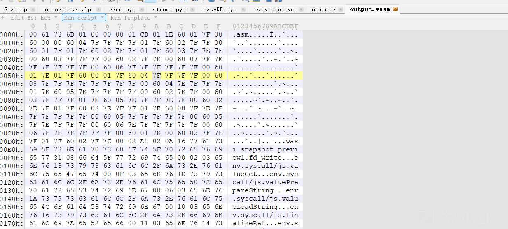](https://xzfile.aliyuncs.com/media/upload/picture/20240220214950-eae11f3a-cff6-1.png)

里面有很多字符串信息，但是其他部分我们是无法理解的。我们在动态调试的时候看的也不是.wasm 的，而是与之等价的.wat 的。

## .wat

wat 是 WebAssembly 文本格式的文件扩展名，也是一种人类可读的表示，通常用于调试、学习和分析 WebAssembly 代码。这种文本格式可以通过将 Wasm 二进制文件反汇编而生成，或者直接手动编写。

如下面一段打印 Hello, world 的代码，它是由一对对 **()**括起来的。

```plain
(module
  (type $type0 (func (param i32)))
  (type $type1 (func))
  (func $import0 (import "sys" "print") (param i32))
  (memory $memory0 200 200)
  (export "memory" (memory $memory0))
  (export "main" (func $func1))
  (func $func1
    i32.const 0
    call $import0
  )
  (data (i32.const 0) "Hello, world\00")
)
```

### 手写一个 wat

打开在线网址，[https://wasmdev.cn/wabt-online/wat2wasm/index.html](https://wasmdev.cn/wabt-online/wat2wasm/index.html)  
[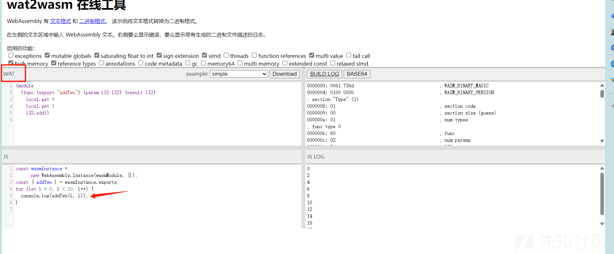](https://xzfile.aliyuncs.com/media/upload/picture/20240220215022-fddb7aea-cff6-1.png)

我们在看 simple 给的代码之前，了解一下 S-表达式

代码中的基本单元是一个模块。在文本格式 wat 中，一个模块被表示为一个大的 S-表达式。S-表达式是一个非常古老和非常简单的用来表示树的文本格式。因此，我们可以把一个模块想象为一棵由描述了模块结构和代码的节点组成的树。不过，与一门编程语言的抽象语法树不同的是，WebAssembly 的树是相当平的，也就是大部分包含了指令列表。

首先，让我们看下 S-表达式长什么样。树上的每个一个节点都有一对括号——( ... )——包围。括号内的第一个标签告诉你该节点的类型，其后跟随的是由空格分隔的属性或孩子节点列表。

如下：

```plain
(module (memory 1) (func))
```

**函数模块**:

```plain
( func <signature> <locals> <body> )
```

-   **签名** 声明函数需要的参数以及函数的返回值。
-   **局部变量** 像 JavaScript 中的变量，但是显式的声明了类型。
-   **函数体** 是一个低级指令的线性列表。

这时候就能看懂了

**simple.wat**

```plain
(module
  (func (export "addTwo") (param i32 i32) (result i32)
    local.get 0
    local.get 1
    i32.add))
```

export 是导出 "addTwo"，方便在 js 代码里调用。 **func addTwo**就是实现了两数相加的功能

**local.get** num 是从局部变量取值，**i32**是类型，**result**是返回，**i32.add**是寄存器里的数值相加

我们可以自己写一个三数相加，如下

```plain
(module
  (func (export "add") (param i32 i32 i32) (result i32)
    local.get 0
    local.get 1
    i32.add
    local.get 2
    i32.add
))
```

[](https://xzfile.aliyuncs.com/media/upload/picture/20240220215049-0df92b52-cff7-1.png)

# 0x03 运行流程

在 mdn 上介绍了两种加载方式

第一种是：

```plain
var importObject = {
  imports: {
    imported_func: function (arg) {
      console.log(arg);
    },
  },
  env: {
    abort: () => {},
  },
};

/* 2019-08-03：importObject 必须存在 env 对象以及 env 对象的 abort 方法 */

fetch("simple.wasm")
  .then((response) => response.arrayBuffer())
  .then((bytes) => WebAssembly.instantiate(bytes, importObject))
  .then((result) => result.instance.exports);
```

第二种是：

```plain
var worker = new Worker("wasm_worker.js");

fetch("simple.wasm")
  .then((response) => response.arrayBuffer())
  .then((bytes) => WebAssembly.compile(bytes))
  .then((mod) => worker.postMessage(mod));
```

都需要拿到 wasm 文件，然后编译并拿到实例，有了实例之后才可以调用各个模块和其中的方法

# 0x04 静态分析方法

静态分析主要借助 jeb 和 ida 来反编译 wasm 代码，有时候效果可能不是很好，同时，如果我们修改需要 wasm 代码，最好先转为 wat，这个时候需要借助 wabt 工具。

## wabt:

[https://github.com/WebAssembly/wabt](https://github.com/WebAssembly/wabt)

首先下载源码：

```plain
$ git clone --recursive https://github.com/WebAssembly/wabt
$ cd wabt
$ git submodule update --init
```

接着用 cmake 编译

```plain
$ mkdir build
$ cd build
$ cmake ..
$ cmake --build .
```

找到 bin 目录，然后使用给出的 demo 浅唱一下

```plain
~/git_project/wabt/bin$ ./wasm2c hello.wasm -o hello.c
```

[](https://xzfile.aliyuncs.com/media/upload/picture/20240220215225-477edee4-cff7-1.png)

## ida

用 gcc 编译 c 代码，然后把生成的.o 文件拖进去分析

## jeb

直接拖进去分析

[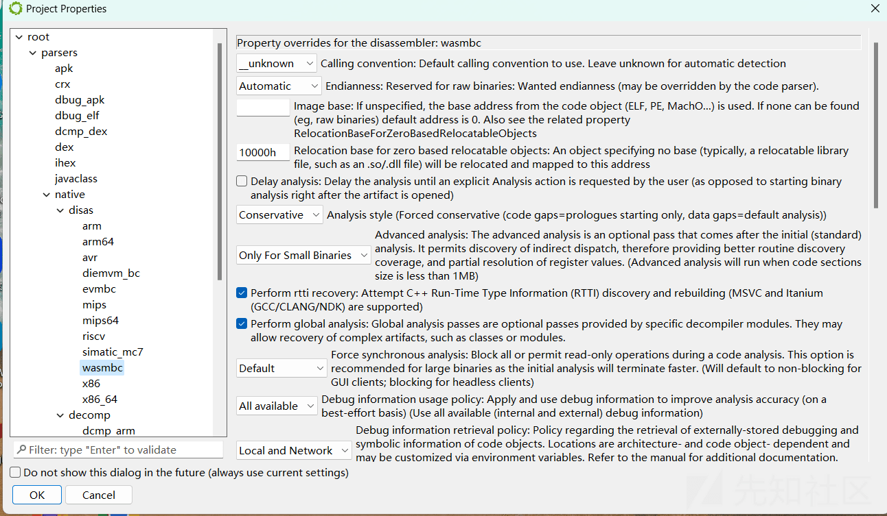](https://xzfile.aliyuncs.com/media/upload/picture/20240220215239-4fe5313c-cff7-1.png)

这边就是函数

[](https://xzfile.aliyuncs.com/media/upload/picture/20240220215251-569dec30-cff7-1.png)

[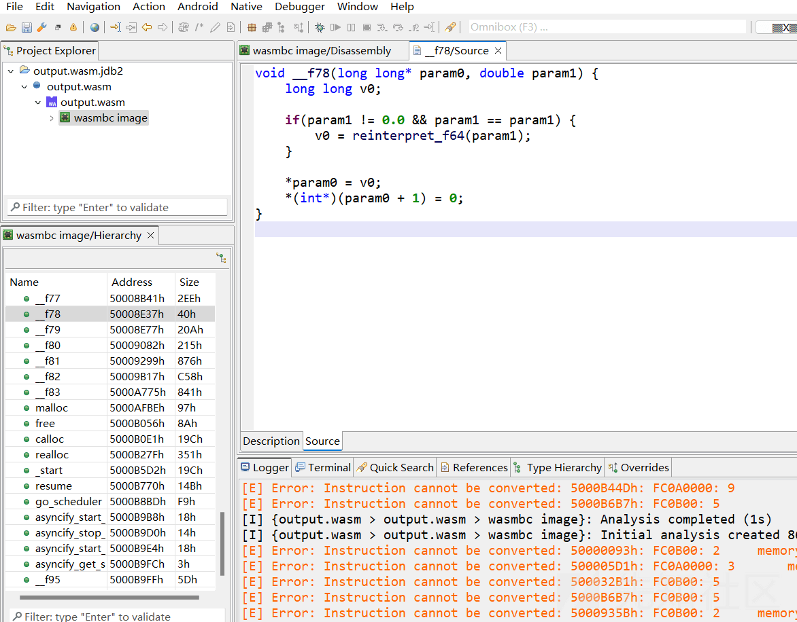](https://xzfile.aliyuncs.com/media/upload/picture/20240220215258-5b32df80-cff7-1.png)

# 0x05 动态调试方法

动态调试主要借助的浏览器，版本高一点的浏览器应该都支持。

打开开发者工具可以看到

[](https://xzfile.aliyuncs.com/media/upload/picture/20240220215313-64239b7a-cff7-1.png)

去设置里把下面的也给勾上

[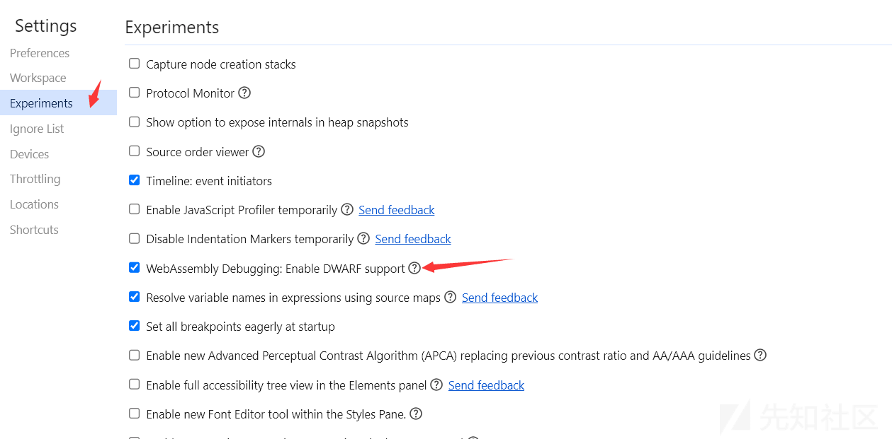](https://xzfile.aliyuncs.com/media/upload/picture/20240220215322-696f8116-cff7-1.png)

前面说过，我们动态调试调试就是 wat 格式的，让我们看看在开发者工具的呈现形式。

必须掌握的是，下面图片框起来的部分；当我们进入 wasm 的代码，就会是 wat 格式的了。

[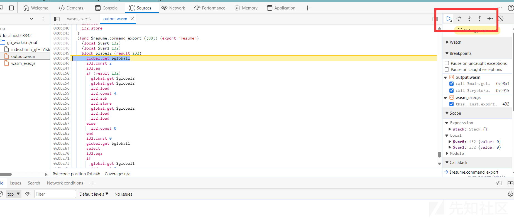](https://xzfile.aliyuncs.com/media/upload/picture/20240220215332-6f67d87a-cff7-1.png)

我们在看 wat 的时候，看不到字符串什么的，只能看到内存的数值

[](https://xzfile.aliyuncs.com/media/upload/picture/20240220215341-74ce1252-cff7-1.png)

那么我们就要想办法查看内存指针对应的字符串或者数值了。

[](https://xzfile.aliyuncs.com/media/upload/picture/20240220215355-7ce319b0-cff7-1.png)

比如

```plain
memories[0].buffer.slice(78060, 78060 + 16)
```

[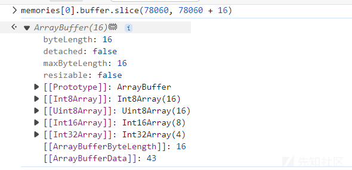](https://xzfile.aliyuncs.com/media/upload/picture/20240220215404-8234bbe4-cff7-1.png)

当然我们可以封装一下

```plain
viewChar = (addr, size = 16) =>{
    const arr = new Uint8Array(memories[0].buffer.slice(addr, addr + size));
    return String.fromCharCode.apply(null, arr);
};
```

再去看看内存对应的字符

[](https://xzfile.aliyuncs.com/media/upload/picture/20240220215415-8922ca4a-cff7-1.png)

下面给出封装的一些函数

## code.js

```plain
wasm = i.instance.exports;
memories = [wasm.memory]
viewDWORD = (addr) =>{
    const arr = new Uint32Array(memories[0].buffer.slice(addr, addr + 16));
    return arr;
};
viewChar = (addr, size = 16) =>{
    const arr = new Uint8Array(memories[0].buffer.slice(addr, addr + size));
    return String.fromCharCode.apply(null, arr);
};
viewHEX = (addr, size = 16) =>{
    const arr = new Uint8Array(memories[0].buffer.slice(addr, addr + size));
    return (Array.from(arr, x =>x.toString(16).padStart(2, '0')).join(' '));
};
viewHexCode = (addr, size = 16) =>{
    const arr = new Uint8Array(memories[0].buffer.slice(addr, addr + size));
    return (Array.from(arr, x =>'0x' + x.toString(16).padStart(2, '0')).join(', '));
};
dumpMemory = (addr, size = 16) =>{
    const arr = new Uint8Array(memories[0].buffer.slice(addr, addr + size));
    return arr;
};
viewString = (addr, size = 16) =>{
    const arr = new Uint8Array(memories[0].buffer.slice(addr, addr + size));
    let max = size;
    for (let i = 0; i < size; i++) {
        if (arr[i] === 0) {
            max = i;
            break;
        }
    }
    return String.fromCharCode.apply(null, arr.slice(0, max));
};
search = function(stirng) {
    const m = new Uint8Array(memories[0].buffer);
    // vid=35402, 9AAizQZJ
    // vid=20268, a3fMpSkB
    const k = Array.from(stirng, x =>x.charCodeAt());

    const match = (j) =>{
        return k.every((b, i) =>m[i + j] === b);
    };
    const max = Math.min(10_000_000, m.byteLength || m.length);
    for (let i = 0; i < max; i++) {
        if (match(i)) {
            console.info(i);
        }
    }
    console.info('done');
}
```

# 0x06 例子

源码链接：[https://pan.baidu.com/s/1C-SadGS9SAmsWkbjWyrnSA?pwd=ev0s](https://pan.baidu.com/s/1C-SadGS9SAmsWkbjWyrnSA?pwd=ev0s)

这是一道 ctf 题，目标是找到加密算法和密钥

## 主页

我们本地搭建一下环境，先来看看主页

[](https://xzfile.aliyuncs.com/media/upload/picture/20240220215430-920f60e6-cff7-1.png)

功能非常简单，输入字符串进行加密和解密

## 定位加密函数

我们可以直接看到 onclick 绑定的加解密函数

```plain
<label for="plaintext">明文：</label>
<input type="text" id="plaintext"><br><br>
<button onclick="encryptText()">加密</button><br><br>
<label for="encryptedtext">密文：</label>
<input type="text" id="encryptedtext"><br><br>
<button onclick="decryptText()">解密</button>
```

翻了下没有经过混淆，很是容易定位

```plain
<script>
        function encryptText() {
            var plainText = document.getElementById("plaintext").value;
            var encryptedText = window.encrypt(plainText);
            document.getElementById("encryptedtext").value = encryptedText;
        }

        function decryptText() {
            var cipherText = document.getElementById("encryptedtext").value;
            var decryptedText = window.decrypt(cipherText);
            document.getElementById("plaintext").value = decryptedText;
        }
    </script>
```

然后就是下断点，跟栈、单步调试等操作

## 本地替换

[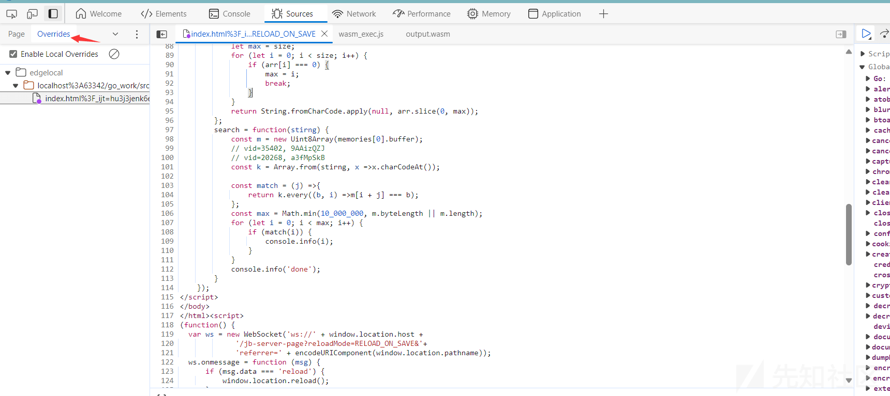](https://xzfile.aliyuncs.com/media/upload/picture/20240220215440-97f3e5c2-cff7-1.png)

然后找到加载 wasm 的地方，把代码注入进去

这里给一下完整的代码：

```plain
<script>
    const go = new Go();
    WebAssembly.instantiateStreaming(fetch("output.wasm"), go.importObject).then((result) => {
        go.run(result.instance);
        wasm = result.instance.exports;
        memories = [wasm.memory]
        viewDWORD = (addr) =>{
            const arr = new Uint32Array(memories[0].buffer.slice(addr, addr + 16));
            return arr;
        };
        viewChar = (addr, size = 16) =>{
            const arr = new Uint8Array(memories[0].buffer.slice(addr, addr + size));
            return String.fromCharCode.apply(null, arr);
        };
        viewHEX = (addr, size = 16) =>{
            const arr = new Uint8Array(memories[0].buffer.slice(addr, addr + size));
            return (Array.from(arr, x =>x.toString(16).padStart(2, '0')).join(' '));
        };
        viewHexCode = (addr, size = 16) =>{
            const arr = new Uint8Array(memories[0].buffer.slice(addr, addr + size));
            return (Array.from(arr, x =>'0x' + x.toString(16).padStart(2, '0')).join(', '));
        };
        dumpMemory = (addr, size = 16) =>{
            const arr = new Uint8Array(memories[0].buffer.slice(addr, addr + size));
            return arr;
        };
        viewString = (addr, size = 16) =>{
            const arr = new Uint8Array(memories[0].buffer.slice(addr, addr + size));
            let max = size;
            for (let i = 0; i < size; i++) {
                if (arr[i] === 0) {
                    max = i;
                    break;
                }
            }
            return String.fromCharCode.apply(null, arr.slice(0, max));
        };
        search = function(stirng) {
            const m = new Uint8Array(memories[0].buffer);
            // vid=35402, 9AAizQZJ
            // vid=20268, a3fMpSkB
            const k = Array.from(stirng, x =>x.charCodeAt());

            const match = (j) =>{
                return k.every((b, i) =>m[i + j] === b);
            };
            const max = Math.min(10_000_000, m.byteLength || m.length);
            for (let i = 0; i < max; i++) {
                if (match(i)) {
                    console.info(i);
                }
            }
            console.info('done');
        }
    });
</script>
```

这样我们就可以愉快地查看内存对应的值了

## 漫长的调试

这个只能自己慢慢走了

[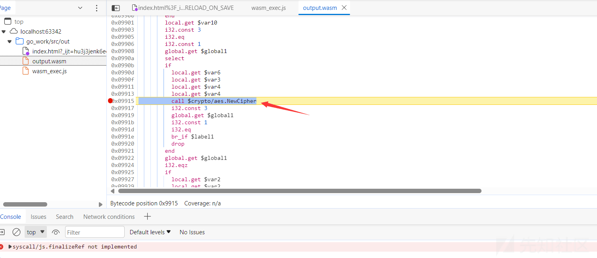](https://xzfile.aliyuncs.com/media/upload/picture/20240220215453-9f886c90-cff7-1.png)

[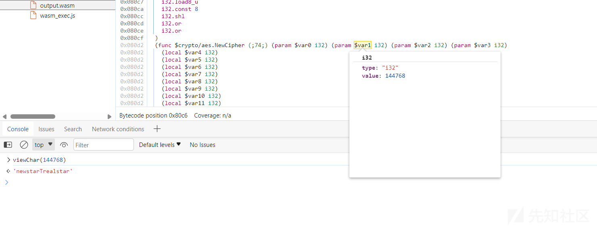](https://xzfile.aliyuncs.com/media/upload/picture/20240220215459-a33296fe-cff7-1.png)

## 借助 wabt 和 ida

这里我直接演示 ida 反编译的文件

[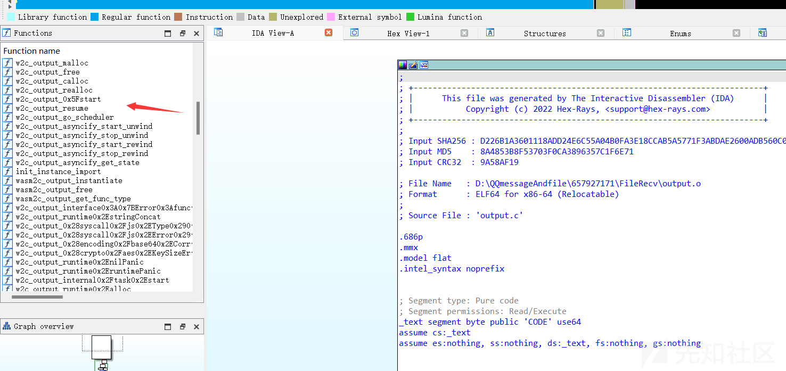](https://xzfile.aliyuncs.com/media/upload/picture/20240220215508-a8a6d5d2-cff7-1.png)

查看字符串信息也可以看到，aes

[](https://xzfile.aliyuncs.com/media/upload/picture/20240220215521-b02dec64-cff7-1.png)

getKey 函数：

```plain
i32_store8(a1 + 8, v10 + 3LL, 0LL);
      i32_store16(a1 + 8, v10 + 1LL, 0LL);
      v4 = i32_load8_u(a1 + 8, (unsigned int)&loc_12B28 + v13);
      i32_store8(a1 + 8, v10, v4 ^ 0xAu);
      i32_store(a1 + 8, v12 + 32LL, v10);
      i32_store(a1 + 8, v12 + 36LL, v10);
      i32_store(a1 + 8, v12 + 28LL, v10);
      i32_store(a1 + 8, v12 + 24LL, v10);
      i32_store(a1 + 8, v12 + 20LL, v10);
```

v4 ^ 0xAu 引起我们的关注

[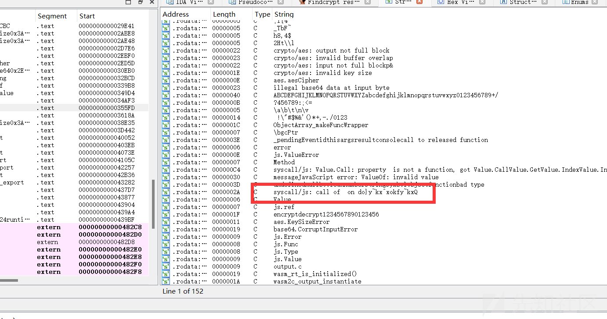](https://xzfile.aliyuncs.com/media/upload/picture/20240220220424-f3997aee-cff8-1.png)

异或一下就是 key 了

# 0x07 总结

以上我们了解了 wasm 是什么，以及动态调试如何使用本地替换和静态分析的工具和一般流程

# reference

[https://developer.mozilla.org/zh-CN/docs/WebAssembly](https://developer.mozilla.org/zh-CN/docs/WebAssembly)

[https://www.52pojie.cn/forum.php?mod=viewthread&tid=1773515&highlight=wasm](https://www.52pojie.cn/forum.php?mod=viewthread&tid=1773515&highlight=wasm)
