# Windows Service Tracing 服务漏洞学习 - 先知社区

Windows Service Tracing 服务漏洞学习

- - -

## **前言介绍**

Windows Service Tracing 并非指特定的 Windows 服务，而是与事件跟踪和日志记录相关的功能。在 Windows 操作系统中，有一些功能允许管理员和开发人员对系统和应用程序的运行进行跟踪和日志记录，以便进行故障排除、性能监视和分析。  
Service Tracing 是一项旧功能模块最早可以追溯到 Windows XP，但它可能已经存在于操作系统的早期版本中。它旨在提供一些有关正在运行的服务和模块的基本调试信息。任何本地用户都可以配置它，通过编辑注册表->  
HKEY\_LOCAL\_MACHINE\\SOFTWARE\\Microsoft\\Tracing 下边的一些注册表项和值即可。

[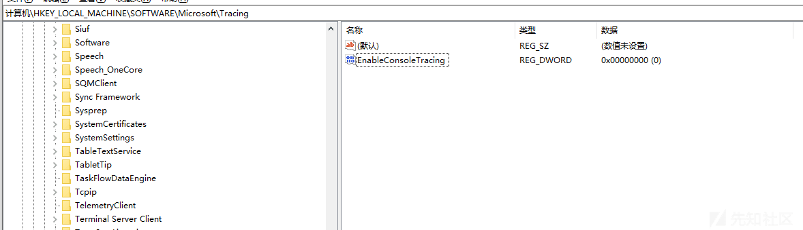](https://xzfile.aliyuncs.com/media/upload/picture/20240130220504-90fe2d7a-bf78-1.png)

微软为其很多组件的服务都提供了方便用户去跟踪的选项配置，比如 EnableDebuggerTracing 代表启用对用户和内核模式调试器的跟踪；再比如若要启用对文件的跟踪 设置 EnableFileTracing 的值。

[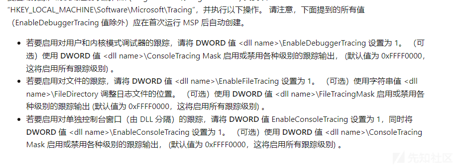](https://xzfile.aliyuncs.com/media/upload/picture/20240130220512-95d36be4-bf78-1.png)

像下图中的 WDS 组件也是，到此可以明白凡是要启用跟踪都是需要在上述的注册表下进行设置的，而设置的名字比较关键的也就是启动跟踪和保存跟踪信息写入文件了所以文件的保存位置也是相当关键的。

[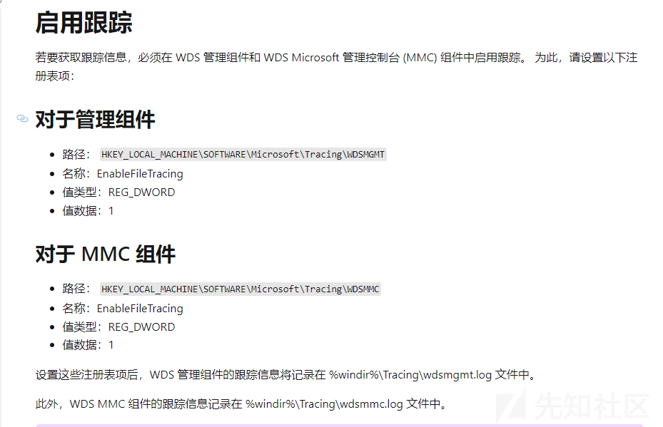](https://xzfile.aliyuncs.com/media/upload/picture/20240130220521-9b69ec40-bf78-1.png)

在这里我们需要重点关注值有 3 个分别是：EnableFileTracing(启用/禁用“tracing”)，FileDirectory(设置输出日志文件的位置) 和 MaxFileSize(设置日志文件的最大文件大小)。在我们启用 EnableFileTracing 后，目标服务将开始向您选择的目录中的日志文件写入数据。一旦输出文件的大小超过 MaxFileSize，它就会被移动 (.log 扩展名被.old 取代) 并创建一个新的日志文件，这些值在下方的漏洞中是有所涉及。

## **CVE-2020-0668**

漏洞存在于 Service Tracing 功能中，可以通过此功能，并且使用符号链接的组合，将攻击者的文件移动到文件系统上的任何位置。例如，一个专门制作的 DLL 可以被移动到“System32”文件夹中，以升级权限并以 NT AUTHORITY\\SYSTEM 中执行任意代码。  
服务的跟踪特性：上述提到服务跟踪功能可以由任何本地用户配置（通过下图工具查询），只需在 HKEY\_LOCAL\_MACHINE\\SOFTWARE\\Microsoft\\Tracing 下编辑一些注册表项和值。

[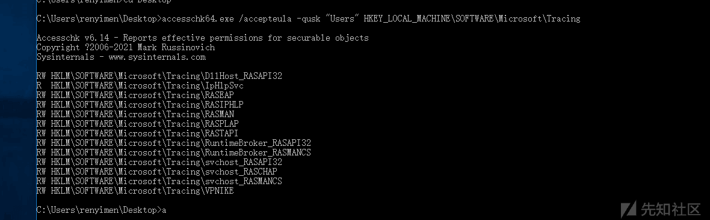](https://xzfile.aliyuncs.com/media/upload/picture/20240130220544-a89906da-bf78-1.png)

这里使用 Tracing 下的 RASTAPI 来做一下测试，下图是默认的值我们来做一下修改，主要修改 EnableFileTracing 的值从 0 改为 1，前言中我们已经介绍了其作用是什么了这里不在阐述。设置目录为 C:\\LOGS

[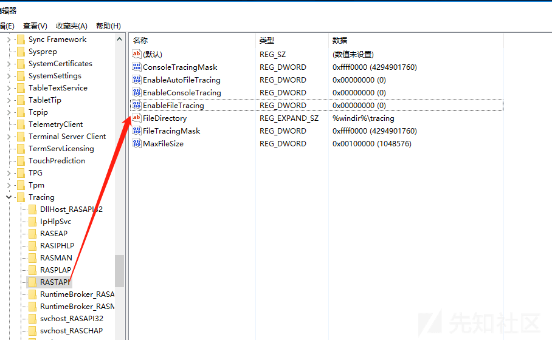](https://xzfile.aliyuncs.com/media/upload/picture/20240130220551-ad3dcfd6-bf78-1.png)

这里可以通过命令 rasdial VPNTEST test test /PHONEBOOK:C:\\Users\\renyimen\\Desktop\\test.pbk  
也可以通过直接设置拨号然后 vpn 连接来去触发。然后可以在目标下发现一个 RASTAPI.LOG 文件  
这里我就直接采用 vpn 设置拨号触发

[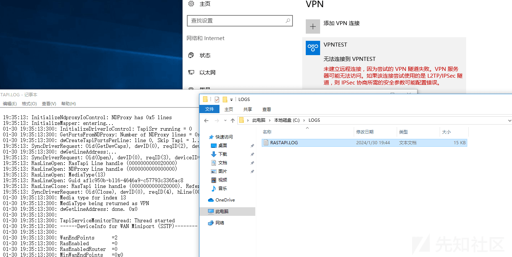](https://xzfile.aliyuncs.com/media/upload/picture/20240130220601-b2fc52bc-bf78-1.png)

[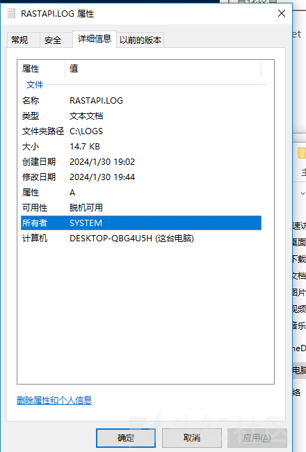](https://xzfile.aliyuncs.com/media/upload/picture/20240130220614-baee6a14-bf78-1.png)

而且可以发现此文件是由 NT AUTHORITY\\SYSTEM 创建的。然后我们将 MaxFileSize 设置为 0x4000 再次尝试一下

[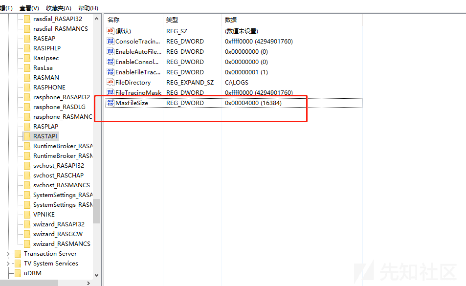](https://xzfile.aliyuncs.com/media/upload/picture/20240130220632-c5b18b8e-bf78-1.png)

[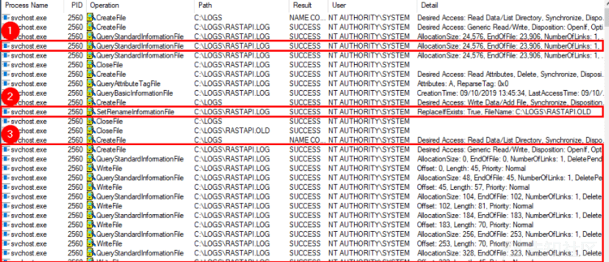](https://xzfile.aliyuncs.com/media/upload/picture/20240130220636-c82039a6-bf78-1.png)

[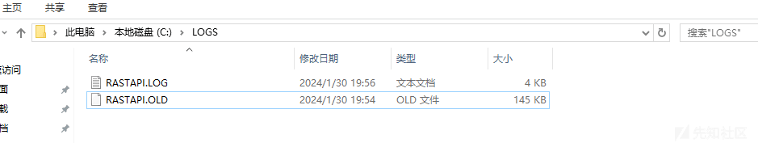](https://xzfile.aliyuncs.com/media/upload/picture/20240130220642-cb2f22f6-bf78-1.png)

通过上述两种图可以看到，服务获取日志文件的基本信息。然后可以看到 EndOfFile 位于偏移量 23,906 处这是当前文件的大小。但是我们指定了 MaxFileSize 大小为 16,384 字节。所以这时候系统将认为没有更多的可用空间。  
所以 C:\\LOGS\\RASTAPI.OLD 调用 SetRenameInformationFile。因为现有的文件被认为是满的，然后它将会从 C:\\LOGS\\RASTAPI.LOG 移动到 C:\\LOGS\\RASTAPI.OLD。此时该服务就会创建一个新的 C:\\LOGS\\RASTAPI.LOG 文件并开始写入。所以上述 log 文件的大小突然变的很小，然后 old 文件出现了。此时我们要注意上述的所有操作都是以 system 的权限进行的。  
利用：此时我们要用到一个很关键的工具就是 James Forshaw symbolic link testing tools 符号链接工具  
利用这个设置：  
\\RPC Control\\RASTAPI.LOG -> \\??\\C:\\EXPLOIT\\FakeDll.dll (owner = current user)  
\\RPC Control\\RASTAPI. OLD -> \\??\\C:\\Windows\\System32\\WindowsCoreDeviceInfo.dll  
然后设置注册表的值：FileDirectory = C:\\EXPLOIT\\mountpoint，MaxFileSize = 0x8000 (32,768 bytes)  
EnableFileTracing = 1，目的就是为了启动这个服务并且设置最大文件内容的大小，这样再通过 Windows API 中的 RasDial 函数去触发 Rasapi 这样就会触发漏洞点导致我们的 Dll 被 SYSTEM 加载了完成利用。  
其实此处最关键的就是关于符号链接的设置，但得益于 James 已经做好利用链子就导致后续的过程轻松很多  
这一类漏洞其实是逻辑类型漏洞，可以通过 Process Monitor 去监控其实就能发现漏洞问题了，主要关键点在于能否发现在设置文件的大小到达上限后的创建新的文件的逻辑问题。

## **CVE-2020-0863**

此漏洞首先是利用了 Rpcview 工具看一下 Diagtrack 暴露的接口，通过工具我们可以很清楚的看到爆破的出来 RPC 接口，因此当分析 RPC 服务器的行为时，我们总是会通过 RPC 接口调用服务器对外提供的 API。我们可以通过 RPC 客户端向服务器发送 RPC 请求与 RPC 交互。

[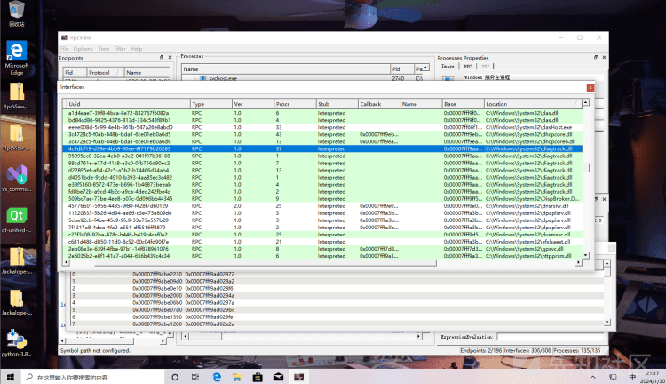](https://xzfile.aliyuncs.com/media/upload/picture/20240130220708-db0b7c92-bf78-1.png)

漏洞位于 UtcApi\_DownloadLatestSettings 中，当然此接口就用到了上述 rpcview 用获得到的接口去触发，要知道  
在使用 RPC 时，您要做的第一件事是使用远程接口的唯一标识符 (例如上图中 4c9dbf19-d39e-4bb9-90ee-8f7179b20283) 获取其句柄。在获得远程接口上的绑定句柄下一步就是尝试参数去调用此函数了。  
RpcView 可以生成与 RPC 接口对应的 IDL 文件当编译完成后，我们就能得到 UtcApi\_DownloadLatestSettings 函数  
long DownloadLatestSettings(  
/ *\[in\]* / handle\_t IDL\_handle,  
/ *\[in\]* / long arg\_1,  
/ *\[in\]* / long arg\_2  
)  
我们要知道此服务是一直以 NT AUTHORITY\\SYSTEM 的身份运行的，调用此服务时会发现  
C:\\Users\\renyi\\AppData\\Local\\Packages\\Microsoft.Windows.ContentDeliveryManager\_cw5n1h2txyewy\\LocalState\\Tips 它会在这个目录下读取.xml 后缀的文件还有其内容然后还会将其复制到 C:\\ProgramData\\Microsoft\\Diagnosis\\SoftLandingStage 此目录下并且文件名都会遵循用户赋予的不会修改。  
最后结束的时候就会删除复制过来的所有文件了。

[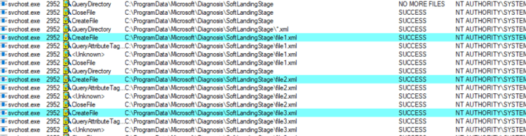](https://xzfile.aliyuncs.com/media/upload/picture/20240130220725-e4cb0a9a-bf78-1.png)  
其实此漏洞到这已经明了，又是 Tracing 服务 在对文件进行了一些在我们看来莫名其妙的文件操作了，而且最关键的是这个是系统的服务，它的所作所为都是套上了 system 的外壳。  
针对上述此服务的操作过程，我们可以思考一点：  
C:\\Users\\renyi\\AppData\\Local\\Packages\\Microsoft.Windows.ContentDeliveryManager\_cw5n1h2txyewy\\LocalState\\Tips 我们可以将此文件夹替换为一个对象目录的挂载点，然后执向文件系统上一个文件的伪符号链接  
比如下述利用方式  
C:\\Users\\renyi\\AppData\\Local\\Packages\\Microsoft.Windows.ContentDeliveryManager\_cw5n1h2txyewy\\LocalState\\Tips -> \\RPC Control  
\\RPC\\Control\\file1.xml -> \\??\\C:\\Windows\\Repair\\SAM  
但我们还要解决几个问题 diagtrack 查找文件使用的函数是 FindFirstFileW。因为我们通过符号链接挂载的并不是一个真正的 文件夹，所以过不了函数的检查。

[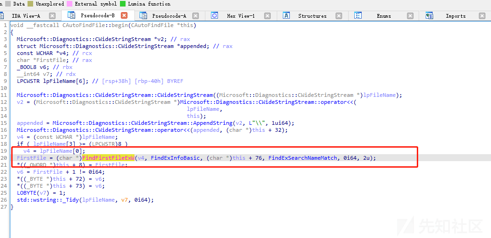](https://xzfile.aliyuncs.com/media/upload/picture/20240130220742-ef442696-bf78-1.png)

但是我们可以通过如下的方式：首先我们在目录下放两个文件 test.xml test2.xml 然后创建挂载点；C:\\Users\\renyi\\AppData\\Local\\Packages\\Microsoft.Windows.ContentDeliveryManager\_cw5n1h2txyewy\\LocalState\\Tips -> C:\\workspace。这样 FindFirstFileW() 就能成功获取到文件。然后我们将此文件上锁也就是 oplock；如此在触发 oplock 时 启动另一个线程将挂载点切换到对象目录；然后设置符号链接  
C:\\Users\\renyi\\AppData\\Local\\Packages\\Microsoft.Windows.ContentDeliveryManager\_cw5n1h2txyewy\\LocalState\\Tips -> \\RPC Control  
\\RPC Control\\file2.xml -> \\??\\C:\\users\\renyimen\\desktop\\secret.txt  
这样当服务触发到漏洞函数的时候，它看似打开的是 Tips 目录下的 test2.xml 实际上打开的 secret.txt。而且根据函数的后溪功能链子 它还会将文件的内容和文件名复制到 C:\\ProgramData\\Microsoft\\Diagnosis\\SoftLandingStage 目录下了这样就有了一个任意文件读取了  
但别忘记了读取之后，此目录下的文件将会被删除。这里好玩的点来了 作者也是在这想到了一个好的利用就是条件竞争，windows 上其实这一类的条件并不少见。因为此函数流程它其实是在最后才完成的删除操作这样就导致了一个时间差的出现。这样我们就可以通过设置 oplock 完成利用：（注下述的文件 后缀均为.xml 这样才能满足其服务特性）  
当 DiagTrack 开始进行流程的时候读取第一个文件时，会触发我们设置的 oplock；然后切换挂载点创建上述的两个符号链接，然后在第三个文件也设置 oplock 这个就是为了最后的删除准备的；然后 DiagTrack 复制第一个文件和第二个文件时候这里指向的就是 secret.txt 了；然后 DiagTrack 也在读取第三个文件的时候就会触发第二个 oplock  
拿到文件后通过释放第二个 oplock 这样三个文件最后都会被删除。而漏洞利用代码中关键的几个点就在于上述，首先是 rpc 端口的绑定

然后就是对于服务的获取和触发过程了

然后就是最关键的就是对于两个锁 FileOpLock::CreateLock 的创建，和对两个锁释放时机的掌握了，其实文件删除读取也就是牵扯到文件这一类的漏洞利用绕过来绕过去当逃不过 oplock 的帮，还有符号链接的利用了。

这一类的漏洞还有 CVE-2020-1029 跟上述漏洞的发现过程相似度很高，就简单阐述一下因为其漏洞产生原理大致相同包括其最后的利用原理也大差不差的。因为此漏洞也是从我们 user 用户可以获取且利用到的 rpc 接口出发的；而此漏洞涉及到的函数则是 UtcApi\_StartCustomTrace 这一类过程；这类过程的主要参数是绝对文件路径。相应的文件必须是 Windows 性能记录器配置文件（即后缀是.wprp 文件）；这类过程也是会输出报告到文件里然后再进行删除操作。服务还是通过追踪服务（SYSTEM）运行的；这样通过设置符号链接操作最终完成任意文件删除漏洞的利用。

参考：  
[https://github.com/itm4n/CVEs](https://github.com/itm4n/CVEs)
