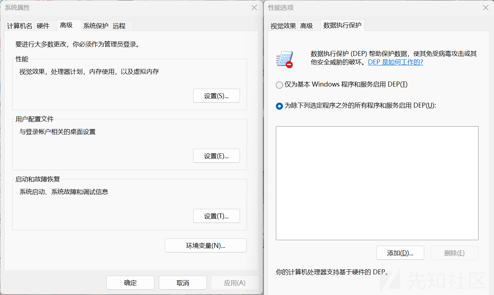

# Windows 下 DEP 保护机制详解及其绕过 - 先知社区

Windows 下 DEP 保护机制详解及其绕过

- - -

在开始 DEP 保护机制的介绍之前，想一想没有开保护时我们的攻击过程，以及开了我们前面介绍的 GS 和 SafeSEH 保护的攻击过程，相信大家都能发现一个问题：就是我们本来写入数据区的数据被当作代码执行了，那么站在一个开发者的角度，我们该如何避免这种问题？

## 一.DEP 保护机制详解

我们溢出攻击的根源就是现代计算机对代码和数据没有做明确的区分导致存储在数据区的数据被当作代码执行，而 DEP 保护机制，就是来弥补计算机这个缺陷的。  
DEP 将内存中的代码区和数据区明确区分开来，阻止数据页（如默认的堆页，各种堆栈页以及内存池页）执行代码，当指令指针指向数据区的时候，就会抛出异常。微软从 Windows XP SP2 就开始支持这种技术了。  
关于段页保护机制，可以看看大佬写的这篇文章：[操作系统学习 — 启动操作系统：进入保护模式](https://zhuanlan.zhihu.com/p/596820045)  
而根据实现的机制不同，可以分为软件 DEP 和硬件 DEP。

-   软件 DEP  
    软件 DEP 实际上就是我们前面介绍的 SafeSEH，大家回想一下，是不是阻止数据区代码执行？它的目的是阻止利用 SEH 的攻击。
-   硬件 DEP  
    可以说硬件 DEP 才是真正的 DEP，硬件 DEP 需要 CPU 的支持，AMD 和 Intel 都为此做了设计，AMD 称之为 No-Execute Page-Protection(NX)，Intel 称之为 Execute Disable Bit(XD)，两者的工作原理实际上都在本质上相同。

由于软件 DEP 我们前面已经介绍过了，在这篇文章中我们就来着重介绍一下硬件 DEP。  
我们先来检查一下我们的 CPU 是否支持硬件 DEP：  
右键点击此电脑->点击属性->系统保护->设置性能选项->数据执行保护：

[](https://xzfile.aliyuncs.com/media/upload/picture/20240226101736-355d9610-d44d-1.png)

可以看到这里有两个选项

1.  仅为基本 Windows 程序和服务启用（Option）：  
    这也就是 DEP 的 Option 模式，只对 Windows 系统组件和服务启用保护，这种模式可以被应用程序动态关闭
2.  为除下列选定的程序之外的所有程序和服务启用（Optout）：  
    这也就是白名单机制，对于很多应用程序都提供了保护，这种模式可以被应用程序动态关闭  
    除此之外，实际上还有两种模式：
3.  AlwaysOn：  
    对所有的进程启用 DEP 保护，不存在排序列表，在这种模式下，DEP 不可以被关闭，且目前只能在 64 位操作系统上才能启用
4.  AlwaysOff：  
    对所有进程禁止使用 DEP，DEP 也能被动态开启，这种模式一般只有在极少的特定情况下才使用，比如 DEP 干扰应用程序的运行。

我们可以通过修改`C:\boot.ini`中的`/noexecute`启动项来控制 DEP 的模式。

## 二.DEP 的绕过方式

我们看起来这种保护机制无懈可击，但是天才“黑客”们总会想出办法来突破的。我们来分析一下绕过方式：

1.  首先，如果要让 DEP 发挥出真正的作用，就要硬件的支持，如果说硬件不支持 DEP 的话，DEP 保护机制根本就发挥不了作用，我们就很容易攻击
2.  其次，处于兼容性考虑，肯定在某些情况下是不会开启 DEP 的，比如说加载一个 dll，而这个 dll 没有启用 DEP，那么对涉及到这个 dll 的程序就不敢贸然开启 DEP，因为可能影响到程序的正常执行。我们可以让程序加载不启用 DEP 的 dll，然后去攻击
3.  大家有没有发现，操作系统给我们设置到 DEP 模式只有两种，而且默认的还是 Option 模式，而这两种模式，DEP 是可以动态关闭的！那我们劫持程序流程，让程序去把 DEP 关掉，然后我们在数据区的 shellcode 就可以正常执行了
4.  页可否执行，也是有一些标记的，我们使用 Windows API，将我们存储 shellcode 的那一页标记为可执行，我们的 shellcode 也可以正常执行
5.  我们可以使用 Windows API，申请一段可以执行的内存，然后将我们的 shellcode 放到该内存，我们的 shellcode 也可以正常执行。

## 三.DEP 的突破方式详解

## 1.攻击未启用 DEP 的程序

这种方法不能称之为“绕过”，因为应用程序压根就没开启 DEP，DEP 保护机制固然很安全，但是我们前面也分析了，有很多应用程序根本就没打开，因为 DEP 保护是进程级别的，只要该进程中加载了一个没有开启 DEP 的 DLL，它就不敢贸然开启 DEP。  
攻击这种应用程序想必大家都很熟悉了，这里就不再多赘述了。

## 2.利用 Ret2Libc 绕过 DEP

### <1>.Ret2Libc 利用之 ZwSetInformationProcess

一个进程的 DEP 设置保存在 KPROCESS 结构体中的\_KEXECUTE\_OPTION 上，这个标识我们可以通过 ZwSetInformationProcess 修改，进而关闭 DEP。  
我们先来到微软官方文档看看这个函数：

```plain
BOOL SetProcessInformation(
  [in] HANDLE                    hProcess,
  [in] PROCESS_INFORMATION_CLASS ProcessInformationClass,
       LPVOID                    ProcessInformation,
  [in] DWORD                     ProcessInformationSize
);
```

[MSDN：setProcessInformation 函数 (processthreadsapi.h)](https://learn.microsoft.com/zh-cn/windows/win32/api/processthreadsapi/nf-processthreadsapi-setprocessinformation)  
这样看来，只要我们构造一个合理的栈帧，劫持程序流程，先让程序关闭 DEP，然后再调回来执行我们的 shellcode，就可以成功绕过 DEP。

### <2>.Ret2Libc 利用之 VirualProtect

通过这个 API，我们可以修改指定地址上的属性，我们来到微软的官方文档看看该函数：

函数功能：更改调用进程的虚拟地址空间中已提交页面区域的保护。

```plain
BOOL VirtualProtect(
  [in]  LPVOID lpAddress,
  [in]  SIZE_T dwSize,
  [in]  DWORD  flNewProtect,
  [out] PDWORD lpflOldProtect
);
```

[MSDN：VirtualProtect 函数](https://learn.microsoft.com/zh-cn/windows/win32/api/memoryapi/nf-memoryapi-virtualprotect)  
使用这个绕过方法，构造栈帧的时候比较困难，shellcode 大小，修改的内存属性我们都可以构造，但是 shellcode 起始地址需要动态确定，而且函数参数中含有`\x00`，进行 strcpy 等函数溢出的时候，会遭到截断。  
具体的攻击过程这里不再演示，如果自己构造不出来 ROP 链，可以参考这篇文章：  
[Windows Shellcode 学习笔记——通过 VirtualProtect 绕过 DEP](https://zhuanlan.zhihu.com/p/26012567)

### <3>.Ret2Libc 利用之 VirtualAlloc

通过这个 API，我们可以申请一段可以执行的内存空间，然后将我们的 shellcode 复制到这一段空间内，然后我们就可以正常执行 shellcode 了，我们还是来到微软官方文档看看这个函数：

函数功能：保留、提交或更改调用进程的虚拟地址空间中页面区域的状态。此函数分配的内存会自动初始化为零。

```plain
LPVOID VirtualAlloc(
  [in, optional] LPVOID lpAddress,
  [in]           SIZE_T dwSize,
  [in]           DWORD  flAllocationType,
  [in]           DWORD  flProtect
);
```

[MSDN：VirtualAlloc 函数](https://learn.microsoft.com/zh-cn/windows/win32/api/memoryapi/nf-memoryapi-virtualalloc)  
这里还是需要我们巧妙地构造栈帧，劫持程序流程，跳转到该函数，然后将 shellcode 复制，然后再拿到程序的控制权，进而执行我们的 shellcode。  
具体的攻击过程这里不再演示，如果自己构造不出来 ROP 链，可以参考这篇文章：[Windows Shellcode 学习笔记——利用 VirtualAlloc 绕过 DEP](https://zhuanlan.zhihu.com/p/26175089)

## 3.利用可执行内存绕过 DEP

有时候，在程序内存中，会存在一段可读可写可执行的内存，我们如果能够将 shellcode 复制到这一段内存中的话，就可以完美执行。  
这种绕过方式比前面的 Ret2Libc 简单很多，但是需要一点运气，因为有些应用程序中是没有这样一段内存的。  
我们来讲讲这种绕过方式的具体思路：

1.  找到溢出点，溢出缓冲区后，覆盖返回地址
2.  构造合理的栈帧，跳转到 memcpy 函数，将 shellcode 复制到可读可写可执行的内存中
3.  返回后拿到程序控制权，跳转到我们的 shellcode 执行。

具体的攻击过程这里就不再演示了，主要就是巧妙地构造 ROP 链。
