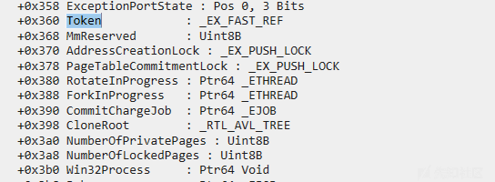
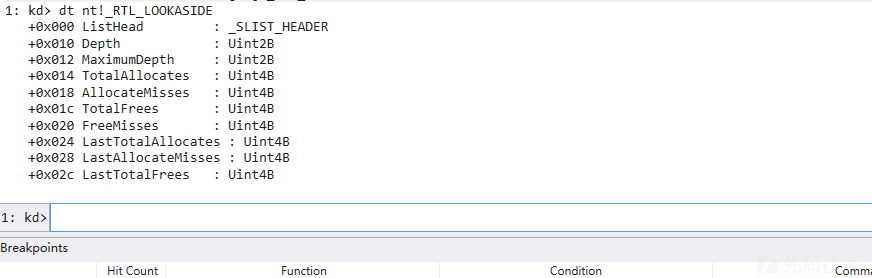

# Windows 内核利用小总结 - 先知社区

Windows 内核利用小总结

- - -

## **利用手法**

此文主要是梳理最近 windows 上 cve 多数人比较常用的几个手法，肯定有所遗漏但涵盖主流常见手法用以学习。  
漏洞的品相也决定了漏洞的利用手法的多样，像比较直接的可以进行任意地址读写的操作，就可以通过修改 Token 来实现提权，这就涉及到了 windows 中令牌的这一概念，windows 进程所关联的用户访问权限等都是由令牌去进行校验的，也是常说的 token 概念。而在 EPROCESS 里有个 token 结构，是进程的权限令牌，如果只要把 system 进程的 token 替换到我们需要提权进程的 eprocess 里，则就获得 system 权限。但是这个操作需要 Ring0 的权限。  
我们可以通过内核调试 dt nt!\_EPROCESS 命令直接查看其结构

[](https://xzfile.aliyuncs.com/media/upload/picture/20240126185209-f3d821be-bc38-1.png)

可以看到在 Token 的值存放在 eprocess 偏移为 0x360 的地方，不同 windows 版本其偏移不相同，在其后边发现 token 是一个\_EX\_FAST\_REF 结构，是因为在 windows 上 16 字节的边界上需要将内核数据结构对齐到内存中所以指向 token 或其他任何内核对象的指针最低的 4 个位永远都是 0 如下图所示。

[](https://xzfile.aliyuncs.com/media/upload/picture/20240126185219-f9cdb688-bc38-1.png)

[](https://xzfile.aliyuncs.com/media/upload/picture/20240126185224-fcff5db6-bc38-1.png)

[](https://xzfile.aliyuncs.com/media/upload/picture/20240126185228-ff2dcafa-bc38-1.png)

其次还有大多数漏洞利用都是为了铺垫一个教好的内存布局从而达到可以修改 PreviousMode 字段的作用。  
PreviousMode：用户态程序调用系统的 Nt 或 Zw 时，系统调用机制会将调用线程捕获到内核模式。为了标识参数源自用户模式，系统调用的处理程序将调用方线程对象中的 PreviousMode 字段设置为 UserMode。  
而内核态程序调用系统例程并将参数值传递给来自内核态的例程，当前线程对象中的 PreviousMode 字段应为 KernelMode。系统会检查调用线程的 PreviousMode 字段。这样通过参数就可以知道是来自用户态还是内核态了。所以当 PreviousMode 设置为 1 时，来自用户空间的 NT 或 Zw 版本函数调用将其中进行地址验证。在这种情况下，对内核内存的任意写将失败，因为此时 PreviousMode 是用户态的状态。当 PreviousMode 设置为 0 (此时是内核态) 时，将跳过地址验证写入任意内核内存地址，从而完成提权。比如 CVE-2023-36802

[](https://xzfile.aliyuncs.com/media/upload/picture/20240126185241-06f09376-bc39-1.png)  
还有任意文件删除到提权可以参考先知这篇[文章](https://xz.aliyun.com/t/13230?time__1311=mqmxnDBD9DyD0AD2DBu%3DwNPrEDuQG0eD "文章")

## **Scoop the Windows 10 pool!**

再来谈一下 Scoop the Windows 10 pool!，这篇很多知识是为了铺垫方便理解布局所以内容比较繁琐。  
win10 最近改变了内核空间中管理堆的方式，所以研究 Windows 堆的机制从而挖掘出一种新的利用手法。  
原文-Scoop\_The\_Windows\_10\_pool.pdf，此段落主要辅佐 cve 漏洞加以分析了解此利用手法所以对一些内容进行了省略，而且利用方式是针对于 x64 架构存在。  
介绍和了解：  
首先了解池是保留给 Windows 系统内核空间的堆，而池的分配不同于用户空间的分配。而在用户空间使用的堆已经被引入内核。还需要了解一下前置的知识比如常见分配池中的内存，这里分配的主要函数和 Windows 释放池的主要函数分别是：

```plain
void * ExAllocatePoolWithTag ( POOL_TYPE PoolType ,size_t NumberOfBytes ,unsigned int Tag );
void ExFreePoolWithTag ( void * P, unsigned int Tag );
```

而 ExAllocatePoolWithTag 中的 PoolType 池类型是一个位字段具体如下：  
这样一些信息是就存储在 PoolType 中的：使用的内存类型：NonPagedPool，PagePool,SessionPool 或 NonPagedPoolNx。如果分配关键位（bit 1)，必须成功。如果分配失败，它会触发一个 BugCheck。  
如果分配符合缓存大小 (bit 2) 对齐，如果分配使用了 PoolQuota 机制 (bit 3)，其他未记录的机制。

```plain
NonPagedPool = 0
PagedPool = 1
NonPagedPoolMustSucceed = 2
DontUseThisType = 3
NonPagedPoolCacheAligned = 4
PagedPoolCacheAligned = 5
NonPagedPoolCacheAlignedMustSucceed = 6
MaxPoolType = 7
PoolQuota = 8
NonPagedPoolSession = 20h
PagedPoolSession = 21h
NonPagedPoolMustSucceedSession = 22h
DontUseThisTypeSession = 23h
NonPagedPoolCacheAlignedSession = 24h
PagedPoolCacheAlignedSession = 25h
NonPagedPoolCacheAlignedMustSSession = 26h
NonPagedPoolNx = 200 h
NonPagedPoolNxCacheAligned = 204 h
NonPagedPoolSessionNx = 220 h
```

而在这其中使用的内存类型很重要，因为它隔离了分配在不同的内存范围内。使用的两种主要内存类型是 PagedPool NonPagedPool。MSDN 文档关于它的描述："非分页池是不可分页的系统内存。它可以从任何 IRQL 访问，但是它是一种稀缺资源，驱动程序应该只在必要时分配它。分页池是可分页的系统内存，只能在 IRQL 小于 DISPATCH\_LEVEL 时候分配和访问。而 NonPagedPoolNx 在 Windows 8 中必须使用，而不是 NonPagedPool。SessionPool 是用于分配会话空间，并且是唯一的到每个用户会话它主要由 Win32k 使用。

## **The POOL\_HEADER**

在池中包含在单个页面中的所有块都是从一个 POOL\_HEADER 结构开始的。当我们编写利用 Windows 内核中的堆溢出漏洞时，首选要覆盖的就是 POOL\_Header 结构。这时我们可以选择重写 POOL\_HEADER 结构，也可以选择修改 POOL\_HEADER 结构中的部分信息，下述是在 windows 1809 上简述的 POOL\_HEADER 结构体

```plain
struct POOL_HEADER
{
    char PreviousSize ;
    char PoolIndex ;
    char BlockSize ;
    char PoolType ;
    int PoolTag ;
    Ptr64 ProcessBilled ;
};
```

虽然 POOL\_HEADER 结构略有改进但总是保持相同的主要字段：  
PreviousSize：是先前的 chunk 的大小除以 16  
PoolIndex : 是 PoolDescriptor 数组中的一个索引  
BlockSize : 是当前分配大小除以 16  
PoolTye : 是一个包含分配类型信息的位字段  
ProcessBilled：是一个指向进行分配的 KPROCESS 的指针只有在 PoolType 中设置了 PoolQuota Flag 时才会设置该参数。  
win7 时 ExAllocatePoolWithQuotaTag 将利用 processbilling 字段来指向存储\_KPROCESS 的指针与分配。此攻击使用堆溢出漏洞去覆盖分配块 POOL\_HEADER 中的 processbilling 指针。当释放块时，如果块的 PoolType 包含 PoolQuota（0x8），那么 ProcessBilled 字段存储的指针将被用于解引用一个值。所以控制 ProcessBilled 指针可以提供一个任意指针解引用原语从而完成提权。  
win8 开始 ExpPoolQuotaCookie 被引入，此攻击手法被缓解。因为在系统启动的引到阶段会生成一个 Cookie，这个 Cookie 的值用于保护指针不被攻击者覆盖。而且当块被释放的时候，内核还会检查编码的指针是不是一个有效的 KPROCESS 指针。

```plain
process_ptr = (struct _KPROCESS *)(chunk_addr ^ ExpPoolQuotaCookie ^ chunk_addr ->process_billed );
if ( process_ptr )
{
    if (process_ptr < 0xFFFF800000000000 || (process_ptr ->Header.Type & 0x7F) != 3 )
    KeBugCheckEx ([...])
    [...]
}
```

而 win8 中，还引入了 NonPagedPoolNx--一种新的池内存类型，其工作原理与 NonPagedPool 相同只是其内存页是不可执行的这样即使塞入 shellcode 到其内存中也是无法利用。  
但随着 windows 不断更新和引入新的机制，Segment Heap 的出现重新改变了 POOL\_HEADER 利用方式让我们可以通过堆溢出漏洞实现提权操作。  
Segment Heap--段堆自 Windows 10 19H1 开始用于内核空间，与用户空间中使用的段堆非常相似。就像在用户态使用的一样，段堆是为根据分配大小的不同提供不同的功能，为此来定义了多种不同类型的后端处理。  
win10 之后堆分为两种：Segment heap 和 NT heap。当一个进程分配堆的时候，大部分场合默认使用的堆都是后面那种，前面的 segment heap 通常会在 winapp 或者某些特殊的进程（核心进程）中会使用到。  
这两种堆称为前端堆（Frontend Heap）和后端堆（Backend Heap）

```plain
Low Fragmentation Heap(abbr LFH):RtlHpLfhContextAllocate
Variable Size(abbr VS):RtlHpVsContextAllocateInternal
Segment Alloc(abbr Seg):RtlHpSegAlloc
Large Alloc: RtlHpLargeAlloc
```

而且还为其分配的大小和其设定的不同类型的后端的选择做了对应的处理：

[](https://xzfile.aliyuncs.com/media/upload/picture/20240126190006-10a2c122-bc3a-1.png)  
Seg，VS，LFH 这是前三个后端分别与\_HEAP\_SEG\_CONTEXT， \_HEAP\_VS\_CONTEXT 和\_HEAP\_LFH\_CONTEXT 相关联。而后端的内容则存储在\_SEGMENT\_HEAP 结构中。通过 dt nt!\_SEGMENT\_HEAP。

[](https://xzfile.aliyuncs.com/media/upload/picture/20240126190016-161bb154-bc3a-1.png)  
存在 5 个\_SEGMENT\_HEAP 结构，对应不同的\_POOL\_TYPE 值。第五个\_SEGMENT\_HEAP 被分配，但作者无法找到其目的。其中前三个与 NonPaged、NonPagedNx、Paged pools 是被存储在 HEAP\_POOL\_NODES 中。与 PagedPoolSession 相关联的段堆被存储在当前线程中。

```plain
NonPaged pools (bit 0 unset)
NonPagedNx pool (bit 0 unset and bit 9 set)
Paged pools (bit 0 set)
PagedSession pool (bit 5 and 1 set)
```

[](https://xzfile.aliyuncs.com/media/upload/picture/20240126190117-3ad8c9f0-bc3a-1.png)  
上图是段后端内部结构  
虽然用户空间下段堆在 128kb~508kb 只使用一个段分配上下文进行分配，但在内核空间下，段堆使用 2 个段分配上下文。第二个是用于 508 KB~7 GB 之间的分配。

## **Segment Backend(段后端）**

首先了解了段后端是用于分配大小在 128 KB 和 7 GB 之间的内存块。它也用于后台，为 VS 和 LFH 后端分配内存。  
段后端上下文存储在一个名为\_HEAP\_SEG\_CONTEXT 的结构中。如下图查看

[](https://xzfile.aliyuncs.com/media/upload/picture/20240126190138-46fabb08-bc3a-1.png)  
这是其内部结构图。

[](https://xzfile.aliyuncs.com/media/upload/picture/20240126190146-4c53b366-bc3a-1.png)  
段后端按称为段的可变大小的块来分配内存。每个段都由多个可分配的页组成。段存储在存储在 SegmentListHead 中的链表中。段头为\_HEAP\_PAGE\_SEGMENT，后面是 256 个\_HEAP\_PAGE\_RANGE\_DESCRIPTOR 结构。

[](https://xzfile.aliyuncs.com/media/upload/picture/20240126190223-61fe3632-bc3a-1.png)

[](https://xzfile.aliyuncs.com/media/upload/picture/20240126190229-65e31b6e-bc3a-1.png)

\_HEAP\_SEG\_CONTEXT 中还维护了一个红黑树，而\_HEAP\_PAGE\_SEGMENT 中的 Signature 是每个\_HEAP\_PAGE\_SEGMENT 都有的一个签名计算 - 计算方法：

```plain
Signature = Segment ^ SegContext ^ RtlpHpHeapGlobals ^ 0xA2E64EADA2E64EAD;
```

个 Signature 用于任何已分配的内存块中检索\_HEAP\_SEG\_CONTEXT 和相应的\_SEGMENT\_HEAP。  
通过使用存储在\_HEAP\_SEG\_CONTEXT 中的 SegmentMask 掩码，可以很容易地从任何地址计算出原始段。SegmentMask 的值为 0xfffffffffff00000。

```plain
Segment = Addr & SegContext ->SegmentMask;
```

通过使用\_HEAP\_SEG\_CONTEXT 中的 UnitShift，可以轻松从任意地址计算出相应的 PageRange。UnitShift 设置为 12。当 Segment Backend 被另一个后端使用时，\_HEAP\_PAGE\_RANGE\_DESCRIPTOR 的 RangeFlags 字段被用于存储请求分配的后端。

```plain
PageRange = Segment + sizeof( _HEAP_PAGE_RANGE_DESCRIPTOR ) * (Addr- Segment) >> SegContext ->UnitShift;
```

## **Variable Size Backend**

可变大小后端分配 512B 到 128KB 大小的块。它的目的是在提供对空闲块的重用。它存储在\_HEAP\_VS\_CONTEXT 结构体中。

[](https://xzfile.aliyuncs.com/media/upload/picture/20240126190324-86c0381c-bc3a-1.png)  
空闲块以\_HEAP\_VS\_CHUNK\_FREE\_HEADER 的专用结构体为头部。

[](https://xzfile.aliyuncs.com/media/upload/picture/20240126190337-8e2ec56e-bc3a-1.png)  
而已经被分配的块都会以\_HEAP\_VS\_CHUNK\_HEADER 的结构体开头。而 header 结构体中的所有字段都与 RtlHpHeapGlobals 和块的地址进行异或。

[](https://xzfile.aliyuncs.com/media/upload/picture/20240126190346-936412f0-bc3a-1.png)

```plain
Chunk ->Sizes = Chunk ->Sizes ^ Chunk ^ RtlpHpHeapGlobals ;
```

在内部，VS 分配器使用段分配器。它通过\_HEAP\_VS\_CONTXT 中的\_HEAP\_SUBALLOCATOR\_CALLBACKS 字段在 RtlpHpVsSubsegmentCreate 中使用。子分配器回调函数都与 VS 上下文和 RtlpHpHeapGlobals 地址进行异或。  
callbacks.Allocate = RtlpHpSegVsAllocate ;  
callbacks.Free = RtlpHpSegLfhVsFree ;  
callbacks.Commit = RtlpHpSegLfhVsCommit ;  
callbacks.Decommit = RtlpHpSegLfhVsDecommit ;  
callbacks.ExtendContext = NULL;  
如果 FreeChunkTree 中没有足够大的块，则会在子段列表中分配并插入一个新的子段，其大小范围为 64~256（KB）。它以\_HEAP\_VS\_SUBSEGMENT 结构体为首。所有剩余的块都用作空闲块被插入到 FreeChunkTree 中。

[](https://xzfile.aliyuncs.com/media/upload/picture/20240126190402-9d55b12e-bc3a-1.png)

当 VS 块被释放时，如果它小于 1KB 并且 VS 的后端是正确配置的，它将被临时存储在 DelayFreeContext 列表中。  
一旦 DelayFreeContext 填充了 32 个块，这些块将一次性全部被释放。要注意的是 DelayFreeContext 从不用于直接分配。  
如果当一个 VS 块真的被释放，此时它与其他两个空闲块相邻时，那么这三个空闲块将利用函数 RtlpHpVsChunkCoalesce 合并在一起。然后合并后的大块将被插入到 FreeChunkTree 中。

## **Low Fragmentation Heap Backend**

Low Fragmentation Heap Backend 是一个后端，专门为从 1B ~ 512 B 分配。LFH 后端上下文存储在\_HEAP\_LFH\_CONTEXT 的结构体中。LFH 后端的主要特点是使用不同大小的 bucket 来避免碎片化

[](https://xzfile.aliyuncs.com/media/upload/picture/20240126190416-a54be07e-bc3a-1.png)  
LFH 子段以\_HEAP\_LFH\_SUBSEGMENT 结构体为头部

[](https://xzfile.aliyuncs.com/media/upload/picture/20240126190427-abe920a4-bc3a-1.png)  
然后，每个子段被分割成不同的 LFH 块与相应的 bucket 大小。为了知道哪个 bucket 被使用，在每个子段的 header 中维护了一个 bitmap。当请求一个分配的时候，LFH 分配器将首先在\_HEAP\_LFH\_SUBSEGMENT 结构中寻找 Freelist 子段，目的是为了找到子段中最后释放的块的偏移。

## **Dynamic Lookaside**

大小在 0x200 和 0xF80 字节之间的释放块可以临时存储在一个查找备用表中，以提供快速分配。当它们在边上时，这些块不会通过它们各自的后端自由机制。  
这个表由\_RTL\_DYNAMIC\_LOOKASIDE 结构体来表示，并存储在\_SEGMENT\_HEAP 结构体中的 UserContext 中。

[](https://xzfile.aliyuncs.com/media/upload/picture/20240126190449-b905771a-bc3a-1.png)  
每个释放的块都存储在与其大小相对应的\_RTL\_LOOKASIDE 中，大小对应着 LFH 中 Bucket。

[](https://xzfile.aliyuncs.com/media/upload/picture/20240126190456-bd7110d4-bc3a-1.png)

## **POOL\_HEADER**

随着内核层堆分配器的更新，POOL\_HEADER 的大部分字段都是无用的，但还是有少部分分配的内存以 POOL\_HEADER 为头部。下述是自从 windows 19H1 以来 POOL\_HEADER 结构体字段的用途

```plain
PreviousSize：未使用的，并保持为 0
PoolIndex：未使用的
BlockSize：块的大小，仅用于最终将块存储在动态快表中
PoolType：用法没有改变，依旧是请求的 POOL_TYPE
PoolTag：用法没有改变，依旧是 PoolTag
ProcessBilled：用法没有改变，保持对请求分配内存的进程进行追踪，如果池类型为 PoolQuota，那么 ProcessBilled 的计算方法如下
ProcessBilled = chunk_addr ^ ExpPoolQuotaCookie ^ KPROCESS
```

Cache Aligned - 缓存对齐：当调用 ExAllocatPoolWithTag 如果 PoolType 有 CacheAligned 位被设置，函数执行后返回的内存是与 Cache 对齐的。  
首先分配器会增加 ExpCacheLineSize 的大小，但如果新分配的大小不能容纳在单个页中，那么 CacheAligned 位将会被忽略。  
并且，分配的块必须遵守下面的三个条件：  
最终分配的地址必须与 ExpCacheLineSize 对齐  
在块的最开始处，必须有一个 POOL\_HEADER 头  
块在分配的地址减去 POOL\_HEADER 的大小的地址处必须有一个 POOL\_HEADER。  
因此，如果分配的地址没有正确的对齐，那么块可能会有两个 headers。

[](https://xzfile.aliyuncs.com/media/upload/picture/20240126190550-dd7acf3c-bc3a-1.png)

第一个 POOL\_HEADER 将在块的起始处，第二个将在 ExpCacheLineSize-Sizeof(POOL\_HEADER) 上对齐，使最终的分配地址与 ExpCacheLineSize 对齐。CacheAligned 将从第一个 POOL\_HEADER 中移除，且第二个 POOL\_HEADER 将使用以下值来填充：PreviousSize：用来保存两个 headers 之间的偏移  
PoolIndex：未使用 BlockSize：在第一个 POOL\_HEADER 中申请的 bucket 的大小。  
PoolType：和之前一样，但是 CacheAligned 位必须设置 PoolTag：像往常一样，两个 POOL\_HEADER 是相同的  
ProcessBilled：未使用。此外，如果对齐填充中有足够的空间，则我们命名为 AlignedPoolHeader 的指针可能会存储在第一个 POOL\_HEADER 之后。它指向第二个 POOL\_HEADER，并与 ExpPoolQuotaCookie 异或。

## **总结**

自从 Segment Heap 被引入，一些存储在块的 POOL\_HEADER 中的信息就不再被需要了。但 PoolType  
PoolTag 还有 CacheAligned 和 PoolQuota 依旧在被使用。  
其次不同的后端，申请的内存块是不同的 header。如果请求的分配用 CacheAligned 对齐的话，那么块就可能包含两个 Pool\_Header 头。

[](https://xzfile.aliyuncs.com/media/upload/picture/20240126190609-e8f6828e-bc3a-1.png)  
像下图，一个使用 LFH 而且需要与 Cache Size 对齐的块，所以开头是两个 POOL\_HEADER

[](https://xzfile.aliyuncs.com/media/upload/picture/20240126190618-ede965fe-bc3a-1.png)

## **利用 POOL\_HEADER 和漏洞利用技术**

如果此时我们有一个堆溢出漏洞能控制写入的数据和大小，那么我们只需要重写 POOL\_HEADER 然后去更改下一块的数据。此时就需要去控制 PoolType 中的 PoolQuota 位让其没有被设置，这样在释放破坏的块时就可以避免对 ProcessBilled 字段的检查了。  
而此时通过上述的知识铺垫，我们可以知道释放时，BlockSize 字段被用与存储一些块到动态块表中。这样我们可以堆溢出漏洞去更改 BlockSize 字段的值让其变的更大 (>0x200)。这样通过堆喷技术，我们是可以实现将一个 3 字节的堆溢出变成更大的 0xFD0 字节的堆溢出。  
PoolType：改变存储在 PoolType 中的内存类型实际上不会改变分配的内存的类型。但是对于 PoolQuota 和 CacheAligned 就不是这样的。设置 PoolQuota 位将触发 POOL\_HEADER 中 ProcessBilled 指针的使用，以便在释放时解除对配额的引用。但在上述中，对 ProcessBilled 指针的攻击已经得到了缓解。  
CacheAligned：自从池分配器使用 Segment Heap 来分配，一些检查被错误的删除了。所以因为缺乏检查，我们可以使用 PoolType 作为目标。通过使用堆溢出来设置下一个块的 PoolType 字段的 CacheAligned 位。  
从而完全控制 PreviousSize 字段。当块被释放时，释放机制使用受控的 PreviousSize 字段寻找原始块，并释放它。因为 PreviousSize 字段存储在一个字节中，所以可以在原始块地址之前释放任意对齐在 0x10 上的地址。最多：0xFF\*0x10 = 0xFF0。  
Windows System：在上述描述中，我们知道可以通过控制下一个块的 POOL\_HEADER 的 PoolType 字段和 PreviousSize 字段，可以更改被覆盖的块实际释放的位置。  
当将 PreviousSize 字段设置为漏洞块的大小时，这将允许 UAF 情况下实现池溢出。  
但这里选择了另一种利用方法：该利用原语是可以被用来在漏洞块的中间触发被覆盖块的释放。可以在漏洞块中伪造一个假的 POOL\_HEADER，并且使用 PoolType 攻击重定向到该块上的空闲部分，这就导致在合法块的中间创建了一个虚假的块。此时这个块叫 ghost chunk 幽灵块

[](https://xzfile.aliyuncs.com/media/upload/picture/20240126190635-f83f8c72-bc3a-1.png)  
而 ghost chunk 的前提是：能提供任意读写的原语，有能力控制它的分配和释放。具有最小 0x210 的可变大小。  
喷射和内存布局：为了获得上述介绍中提出的内存布局，必须进行一些堆喷。堆喷取决于块的大小，因为它最终将在不同的分配后端。如果块小于 0x200，那么它将位于 LFH 后端。  
然后，喷射将会在完全相同的块中完成，以确保他们都从同一个 bucket 中分配。  
当请求分配时，LFH 后端将扫描最多以 32 个 block 块为一组的 BlockBitmap，并随机选择一个空闲块。在分配的漏洞块的前后各分配超过 32 个合适大小的块，这样可以对抗随机化。  
如果漏洞块大于 0x200 但小于 0x10000，最终它将在 Variable Size Backend 中。  
然后喷射将以漏洞块的大小完成。过大的块会被分开，因此堆喷将会失败。  
首先，分配上千个选中大小的块，以确保清空所有 FreeChunkTree 中大于选中大小的块，然后分配器将分配一个 0x10000 字节大小的新的 VS 子段并放在 FreeChunkTree 中。  
然后再分配上千个块，最终都位于一个新的大空闲块。然后释放最后分配的块的三分之一，以填充 FreeChunkTree。释放三分之一就行以确保没有块被合并。  
然后使得漏洞块被分配，最终，释放的块将被重新分配以最大限度的增加喷射机会。  
由于利用过程都需要释放和重新分配漏洞块和幽灵块，为此，方案是分配上千个相应大小的块，等两秒，分配另外上千个块等一秒。这样我们就可以确保管理器重新平衡了相应的快表。而分配上千个块以确保其在最常使用的快表中，确保被打开并且确保有足够的空间。

## **利用过程**

上述文章中的主要利用过程就是：先从相邻块进行释放从而得到申请幽灵块，此时漏洞块和幽灵块共享了同一部分内存。再通过 NtFsControlFile 来获取漏洞块的属性值，那么实际获取到的其实是幽灵块的 Pipe\_Attribute 结构的值。  
幽灵块伪造一个 Fake\_Pipe\_Attribute，同时在利用结束后，需要恢复幽灵块的 Pipe\_Attribute 的原始值，以防蓝屏。幽灵块和漏洞块共享同一块内存，所以要修改幽灵块的 Pipe\_Attribute，实际只需要修改漏洞块的 Pipe\_Attribute 值即可。分页池创建管道后，用户可以向管道添加属性。从而可以控制了幽灵块中 Pipe\_Attribute 的指针值使其指向用户层的 Pipe\_Attribute  
所以用户层的 PipeAttribute 结构体的 AttributeValue 和 AttributeValueSize 字段就可以任意指定，也就可以在内核中任意读利用原语。获取 kernel\_base，触发漏洞替换 EPROCESS 地址完成操作  
像 CVE-2022-24521 漏洞其利用就采用的 Scoop the Windows 10 pool 中的技术进行漏洞原语的利用  
创建管道对象，使用 NtFsControlFile API 添加管道属性：

```plain
CreatePipe( hR , hW , NULL , bufsize ) ;
NTSTATUS status = NtFsControlFile(
    hR,
    0,
    NULL,
    NULL,
    &ret,
    0x11003C,
    input,
    input_size,
    output,
    output_size
);
```

属性是键值对而且存储在链表中。PipeAttribute 对象在分页池中分配，并在内核中通过以下结构定义  
注意，分配必须足够大 (x64 上为 4064+ 字节) 才能在大池中处理。

```plain
struct PipeAttribute {
    LIST_ENTRY list ;
    char * AttributeName;
    uint64_t AttributeValueSize;
    char * AttributeValue;
    char data [0];
};
```

每当内核模式组件的分配超过上述限制时，就会进行大池分配。然后使用 NtQuerySystemInformation 去转储池所分配的信息类有大小，tag 还有类型（Paged 或是 Non-Paged）还有内核虚拟地址。

```plain
NTSTATUS status = STATUS_SUCCESS;
if (NT_SUCCESS(status = ZwQuerySystemInformation(SystemBigPoolInformation, mem, len, &len))) {
    PSYSTEM_BIGPOOL_INFORMATION pBuf = (PSYSTEM_BIGPOOL_INFORMATION)(mem);
    for (ULONG i = 0; i < pBuf->Count; i++) {
        __try {
            if (pBuf->AllocatedInfo[i].TagUlong == PIPE_ATTR_TAG) {
                // save me
            }
        }
        __except (EXCEPTION_EXECUTE_HANDLER) {
            DPRINT_LOG("(%s) Access Violation was raised.", __FUNCTION__);
        }
    }
}
```

使用这个特性，我们可以很容易地获得新创建的管道对象的地址。然后开始分配 fake\_pipe\_attribute 对象，以便稍后将其地址注入到最开始双链表中。用如下方式保存内核 pipe\_attribute 指针

```plain
fake_pipe_attribute = (PipeAttributes*)VirtualAlloc(NULL, ATTRIBUTE_SIZE, MEM_RESERVE | MEM_COMMIT, PAGE_READWRITE);
fake_pipe_attribute->list.Flink = pipe_attribute_1;
fake_pipe_attribute->list.Blink = pipe_attribute_2;
fake_pipe_attribute->id = ANY;
fake_pipe_attribute->length = NEEDED;
```

通过 NtQuerySystemInformation 获取基址

```plain
ntStatus = NtQuerySystemInformation(SystemModuleInformation,   
                                    &module, /*pSysModInfo*/  
                                    sizeof(module), /*sizeof(pSysModInfo) or 0*/  
                                    &dwNeededSize );  
{

if (STATUS_INFO_LENGTH_MISMATCH == ntStatus)   
{  
    pSysModInfo = ExAllocatePoolWithTag(NonPagedPool, dwNeededSize, 'GETK');  

    if (pSysModInfo) {  
        ntStatus = NtQuerySystemInformation(SystemModuleInformation,   
                                            pSysModInfo,   
                                            dwNeededSize,   
                                            NULL );            
        if (NT_SUCCESS(ntStatus))  
        {  
            for (int i=0; i<(int)pSysModInfo->dwNumberOfModules; ++i)  
            {  
                StrUpr(pSysModInfo->smi[i].ImageName); // Convert characters to uppercase  
                if (strstr(pSysModInfo->smi[i].ImageName, MODULE_NAME))  {  
                    pModuleBase  = pSysModInfo->smi[i].Base;                      
                    break;  
                }  
            }     
        }  
        else { return; }  

        ExFreePool(pSysModInfo)  
        pSysModInfo = NULL;  
    }  
}

}
```

然后触发漏洞获取到可以任意地址写的指针去进行覆盖，要覆盖 fake\_pipe\_attribute 的指针 pipe\_attribute\_1->list.Flink 和 pipe\_attribute\_2->list.Blink。然后通过读取 pipe\_attribute\_1 / pipe\_attribute\_2 上的属性 (调用 NtFsControlFile)，内核就会去读取且使用用户态中的 PipeAttribute，从而完成利用，这样控制了 AttributeValue 指针和 AttributeValueSize 就有了一个任意地址读的原语，可以用来获取 EPROCESS 地址的 token 完成提权操作了。  
此漏洞的利用过程总的来说就是：创建管道对象并添加管道属性。属性是键值对，存储在链表中，PipeAttribute 对象在分页池中分配。使用 NtQuerySystemInformation 来泄漏池管道对象的内核虚拟地址。分配 fake\_pipe\_attribute 对象，稍后将使用它将其地址注入到原始的双链表中。使用 NtQuerySystemInformation 获取选定的模块基址。触发 CLFS 错误，它允许我们调用执行任意数据修改的来实现可用于获取 EPROCESS 地址的任意读原语。触发 CLFS bug，覆盖用户模式进程令牌以提升系统权限。

## **I/O Ring**

其次来介绍一下 I/O Ring，因为上述说完了 win10 中的利用，再来谈谈 win11 中的利用。  
此技术是新起于 Win11 上的新的漏洞原语技术，通过 I/O Ring 来对 Windows 内核进行读写操作。  
I/O 环是一种新的异步 I/O 机制，该机制是模仿 linux 的 io\_uring(是 linux 提供的异步 I/O 接口）。  
从下述的一张图来更好的了解一下。

[](https://xzfile.aliyuncs.com/media/upload/picture/20240126185358-34f75f2a-bc39-1.png)  
应用程序可以执行的操作之一是为其未来的 I/O 操作分配所有缓冲区，然后将它们注册到 I/O ring。预先注册好的缓冲区通过 I/O ring 的 object 被引用，IORING\_OBJECT 的结构体如下

```plain
typedef struct _IORING_OBJECT
{
  USHORT Type;
  USHORT Size;
  NT_IORING_INFO Info;
  PSECTION SectionObject;
  PVOID KernelMappedBase;
  PMDL Mdl;
  PVOID MdlMappedBase;
  ULONG_PTR ViewSize;
  ULONG SubmitInProgress;
  PVOID IoRingEntryLock;
  PVOID EntriesCompleted;
  PVOID EntriesSubmitted;
  KEVENT RingEvent;
  PVOID EntriesPending;
  ULONG BuffersRegistered;
  PIORING_BUFFER_INFO BufferArray;
  ULONG FilesRegistered;
  PHANDLE FileHandleArray;
} IORING_OBJECT, *PIORING_OBJECT;
```

当发送请求时，IoRing->RegBuffers 和 IoRing->RegBuffersCount 都被设置为 0，内核会进行验证 Sqe->RegisterBuffers.Buffers 和 Sqe->RegisterBuffers.Count 都不是 0。  
如果请求来自用户模式，则会对数组进行探测，来验证它是否完全位于用户模式下的地址空间中  
，此时数组的大小可以达到 sizeof(ULONG)。  
如果 Ring 已经有了一个预先注册好的缓冲区数组，并且新缓冲区的大小与旧的缓冲区大小相同，则旧的缓冲区大小将被放回到 Ring 中，新缓冲区将被忽略。  
如果前边的检查都通过了，并且要使用新的缓冲区。然后会进行新的分页池分配，这就通过使用 IoRing->RegBuffers 从用户态的数组复制数据。  
如果先前的 I/O Ring 在之前指向过已经注册过的缓冲区数组，那么它就会被复制到新的内核数组中。任何新的缓冲区都将添加到相同的分配中，并且在旧的缓冲区之后。  
然后探测从用户态发送数组的每个数据，用来验证所请求的缓冲区是否处于用户态下，然后再将其复制到内核态，然后再释放掉旧的内核数组。  
数据只从用户模式读取一次，而且都有对数据进行校验，这样就能尽可能的保证过程的安全性，这样后续使用缓冲区的话，都将从内核态的缓冲区去获取。

但假设我们可以对内核进行任意写（漏洞）操作，这样我们就可以覆盖 指针 IoRing->RegBuffers，将其指向一个我们可控的假的缓冲区。我们可以使用内核态下的地址进行填充，并将其作为 I/O 操作中的缓冲区，当缓冲区被索引引用的时候，如果缓冲区在注册的时候是安全的，就会被复制到内核中进行分配。  
然后我们就可以通过任意写的漏洞原语和一个假的缓冲区数组，来完全操作内核的地址空间了。  
使用预先注册的文件句柄和缓冲区的队列条目的概率如下图所示  
总结利用过程  
IoRing->RegBuffers 执行假的并且用户可控的数组，这样我们就能通过 I/O Ring 来进行内核的读写操作到我们想要的地址，通过指定一个索引到我们的假数组作为缓冲区：

1.  读操作 and 内核地址：内核将来自我们的文件读到指定的内核地址
2.  写操作 and 内核地址：内核将指定地址中的数据写入到我们选择的文件，从而导致任意读。  
    然后经过改进，漏洞的利用原语不在依赖于文件，而是改用于命名管道这样不会在磁盘上留下很急。  
    这样改进后的步骤如下：
3.  通过 CreateNamedPipe 创建两个命名管道，一个用于任意内核写入的输入，一个用于任意内核读取的输出。在使用 CreateNamePipe 创建管道时，在参数 dwOpenMode 选择 PIPE\_ACCESS\_DUPLEX（这种模式为服务器提供了对管道可 Read,Write 的访问）标志，来允许读写操作。

[](https://xzfile.aliyuncs.com/media/upload/picture/20240126185440-4e3ae3c6-bc39-1.png)  
2.通过 CreateFile 打开到两个管道的客户端句柄，且具备读写权限。再用 CreateIoRing 创建 I/O Ring

[](https://xzfile.aliyuncs.com/media/upload/picture/20240126185455-57029ee0-bc39-1.png)

1.  在堆中分配一个假缓冲区数组，注：从 22H2 版本后，注册的缓冲区是一个 IOP\_MC\_BUFFER\_ENTRY 结构的数组。
2.  需要查找新创建的 I/O Ring 对象的地址，因为 I/O Ring 使用的对象类型是 IORING\_OBJECT，此时我们可以使用 bypass KASLR 来泄露其地址。NtQuerySystemInformation 的 SystemHandleInformation 会泄露对象的内核地址，这样就能得到 I/O Ring object。但 NtQuerySystemInformation 只能最低被 Medium IL 利用，所以 low IL 无法利用。
3.  使用漏洞任意写，用假的伪造的用户态的数组的地址去覆盖掉 IoRing->RegBuffers，如果没有注册一个有效的缓冲区数组的话，还必须覆盖 IoRing->RegBuffersCount，使其值不为 0 即可。
4.  其次就是查找内核模块的基地址，或使用 I/O Ring 内部可用的指针，这些指针指向分页池中的结构。然后用内核指针填充假的伪造的缓冲区数组。
5.  通过 BuildIoRingReadFile 和 BuildIoRingWriteFile 对 I/O Ring 中的读写操作进行排队处理。  
    这样最后任意读写的漏洞原语就不会局限于指针的大小了，可变的很大且同时读写多页的内核数据  
    但在 22H2 之后有一个改变，有一个新的结构体 IOP\_MC\_BUFFER\_ENTRY。
    
    ```plain
    typedef struct _IOP_MC_BUFFER_ENTRY
    {
     USHORT Type;
     USHORT Reserved;
     ULONG Size;
     ULONG ReferenceCount;
     ULONG Flags;
     _LIST_ENTRY GlobalDataLink;
     PVOID Address;
     ULONG Length;
     CHAR AccessMode;
     ULONG MdlRef;
     struct _MDL* Mdl;
     KEVENT MdlRundownEvent;
     PULONG64 PfnArray;
     BYTE PageNodes[1];
    } IOP_MC_BUFFER_ENTRY, * PIOP_MC_BUFFER_ENTRY;
    ```
    
    这导致一些变化，还是分配一个假缓冲区数组大小为 sizeof(PVOID) \* NumberOfEntries。其次为每个假缓冲区分配 IOP\_MC\_BUFFER\_ENTRY 结构，并将指针放入假缓冲区数组中。然后用下方代码进行一些设置即可
    
    ```plain
    mcBufferEntry->Address = TargetAddress;
    mcBufferEntry->Length = Length;
    mcBufferEntry->Type = 0xc02;
    mcBufferEntry->Size = 0x80; // 0x20 * (numberOfPagesInBuffer + 3)
    mcBufferEntry->AccessMode = 1;
    mcBufferEntry->ReferenceCount = 1;
    ```
    
    \## **CVE 利用代码分析**  
    这里结合实际的 CVE-2023-21768 漏洞来探究其真实漏洞场景中的实现步骤  
    用户初始化 I/O Ring 有两个独立的结构，一个用户态 一个内核态  
    而在内核态有两个对象就是我们上文介绍中提到的 RegBuffersCount RegBuffers  
    用户态调用 kernelbase!CreateIoRing 成功后，您将返回一个 I/O 环句柄。这个句柄是一个指向未记录结构的指针  
    如果漏洞能做到去更新 RegBuffersCount RegBuffers 字段，那么我们就能使用 I/O Ring api 来进行内核内存的读写原语。  
    漏洞利用代码中主要有两个文件是主要操作  
    ioring\_lpe.c -- getobjptr 函数主要就是从系统句柄信息中查找指定进程和句柄值对应的对象地址  
    通过\_NtQuerySystemInformation 查询系统句柄信息，然后又对句柄进行信息遍历等操作，最后释放内存和返回。

[](https://xzfile.aliyuncs.com/media/upload/picture/20240126185540-72064cf0-bc39-1.png)  
在 ioring\_setup 函数中 首先直接调用 CreateIoRing api 去创建 I/O Ring 并且设置了环的大小 0x10000 还有提交环的大小 0x20000. 然后又通过 getobjptr 获取指向 I/O Ring 的指针等句柄信息。  
随便创建两个命名管道用于输入和输出的操作，并将管道的都设置为 PIPE\_ACCESS\_DUPLEX 这样允许双向通信可以通过管道进行读写数据的操作。随后又创建了两个管道的客户端分别连接上述中的输入和输出管道。客户端的创建就是留着和进程进行通信的文件句柄

```plain
ret = CreateIoRing(IORING_VERSION_3, ioRingFlags, 0x10000, 0x20000, &hIoRing);
ret = getobjptr(ppIoRingAddr, GetCurrentProcessId(), *(PHANDLE)hIoRing);
hInPipe = CreateNamedPipe(L"\\\\.\\pipe\\ioring_in", PIPE_ACCESS_DUPLEX, PIPE_WAIT, 255, 0x1000, 0x1000, 0, NULL);
hOutPipe = CreateNamedPipe(L"\\\\.\\pipe\\ioring_out", PIPE_ACCESS_DUPLEX, PIPE_WAIT, 255, 0x1000, 0x1000, 0, NULL);
hInPipeClient = CreateFile(L"\\\\.\\pipe\\ioring_in", GENERIC_READ | GENERIC_WRITE, FILE_SHARE_READ | FILE_SHARE_WRITE, NULL, OPEN_ALWAYS, FILE_ATTRIBUTE_NORMAL, NULL);
hOutPipeClient = CreateFile(L"\\\\.\\pipe\\ioring_out", GENERIC_READ | GENERIC_WRITE, FILE_SHARE_READ | FILE_SHARE_WRITE, NULL, OPEN_ALWAYS, FILE_ATTRIBUTE_NORMAL, NULL);
```

随便在往下此文件中还有两个函数 ioring\_read 和 ioring\_write 和明显这两个函数就是对 I/O Ring 进行读写操作的函数 ioring\_read 的入参为 pRegisterBuffers pReadAddr pReadBuffer ulReadLen

```plain
int ioring_read(PULONG64 pRegisterBuffers, ULONG64 pReadAddr, PVOID pReadBuffer, ULONG ulReadLen)
```

首先分配一块内存大小为 IOP\_MC\_BUFFER\_ENTRY（sizeof）, 然后进内存进行填充 设置一些地址 长度 等  
随后将地址保存到 pRegisterBuffers 数组中，随后就是构造 I/O 请求 提交请求等待完成的常规流程操作了

[](https://xzfile.aliyuncs.com/media/upload/picture/20240126185614-863a301a-bc39-1.png)  
然后 ioring\_write 函数 依旧是 先去分配内存然后 填充 IOP\_MC\_BUFFER\_ENTRY 数据结构，最后再将其保存到 pRegisterBuffers 中。最后在跟上述读操作一样构建 提交 等待 I/O 操作的完成

```plain
pMcBufferEntry->Address = pWriteAddr;
pMcBufferEntry->Length = ulWriteLen;
pMcBufferEntry->Type = 0xc02;
pMcBufferEntry->Size = 0x80;
pMcBufferEntry->AccessMode = 1;
pMcBufferEntry->ReferenceCount = 1;
pRegisterBuffers[0] = pMcBufferEntry;

ret = BuildIoRingReadFile(hIoRing, reqFile, reqBuffer, ulWriteLen, 0, NULL, IOSQE_FLAGS_NONE);
```

然后到 ioring\_lpe 函数 随后 此函数通过 pid 接受需要提权的进程号。  
ioring\_lpe(ULONG pid, ULONG64 ullFakeRegBufferAddr, ULONG ulFakeRegBufferCnt) 、  
通过 OpenProcess 打开进程且具备 PROCESS\_QUERY\_INFORMATION 权限，然后通过 getobjptr 函数获取系统和目标的 EPROC address 地址。然后分配内存拿到 pFakeRegBuffers，再去设置其缓冲区和大小

```plain
phIoRing->RegBufferArray = pFakeRegBuffers;
phIoRing->BufferArraySize = ulFakeRegBufferCnt;
```

通过 ioring\_read 去读取系统的 token 令牌，也就是系统 EPROCESS 结构体中的令牌地址。最后通过 ioring\_write 函数将系统令牌写入目标进程的 EPROCESS 结构体中。最后还清空 I/O Ring 的注册缓冲区

[](https://xzfile.aliyuncs.com/media/upload/picture/20240126185700-a184d410-bc39-1.png)

ioring\_lpe.c 就是 I / O Ring 漏洞利用原语后续 替换操作提权的具体代码。  
exploit.c 中的函数 主要是为了触发漏洞函数在 ArbitraryKernelWrite0x1 函数中完成了向 AFD 驱动发现 I/O 操作然后通过\_NtDeviceIoControlFile 函数通过 IOCTL 对 AFD 驱动还有其中的函数进行调用。  
随便在 main 函数中设置 ioring\_setup I/O 环。然后调用 ArbitraryKernelWrite0x1 函数，将 IoRing->RegBuffers 的地址覆盖为 0x1000000，然后再调用 ArbitraryKernelWrite0x1 函数去覆盖 IoRing->RegBuffersCount 的值为 0x1。将值覆盖完成之后就去调用了 ioring\_lpe 完成提权操作了。

[](https://xzfile.aliyuncs.com/media/upload/picture/20240126185715-aa97c6f2-bc39-1.png)  
可以注意到这段 poc 用到了我们上述铺垫提到的 IOP\_MC\_BUFFER\_ENTRY 结构体，

[](https://xzfile.aliyuncs.com/media/upload/picture/20240126185723-af63d3e2-bc39-1.png)

然后利用漏洞的读写原语 进行 IoRing->RegBuffers IoRing->RegBuffersCount 进行了读写操作，在通过 ioread 和 iowrite 对进程的权限令牌进行替换操作从而完成提权。  
相同利用手法的漏洞还有 CVE-2023-36802 等。

引用：  
[https://windows-internals.com/one-i-o-ring-to-rule-them-all-a-full-read-write-exploit-primitive-on-windows-11/](https://windows-internals.com/one-i-o-ring-to-rule-them-all-a-full-read-write-exploit-primitive-on-windows-11/)  
Scoop the Windows 10 pool
