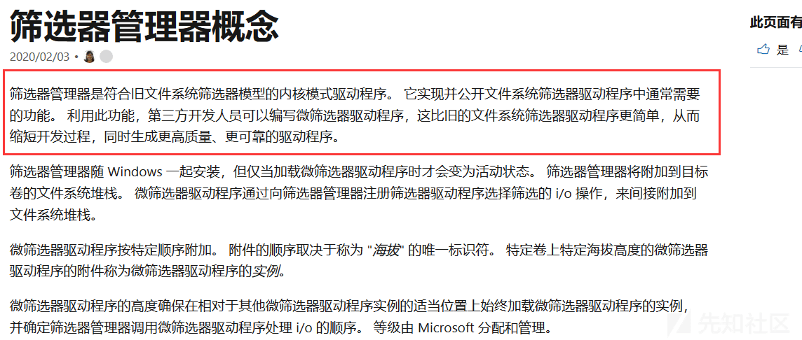
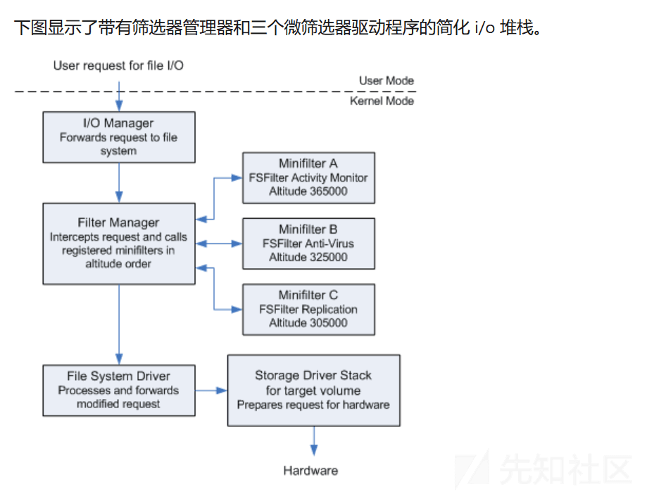
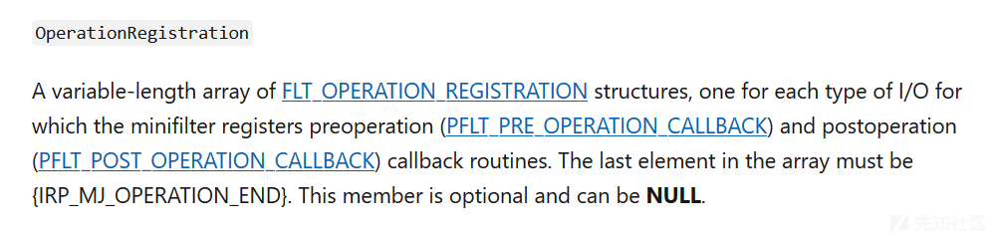
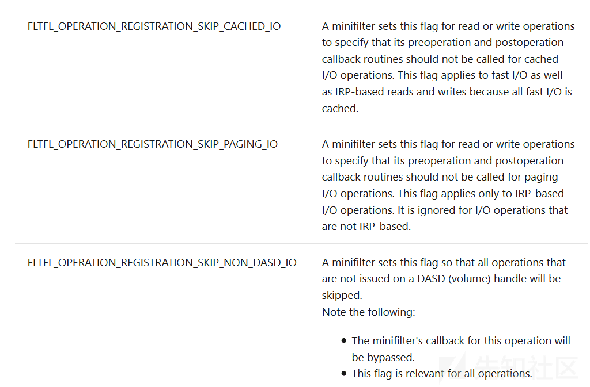
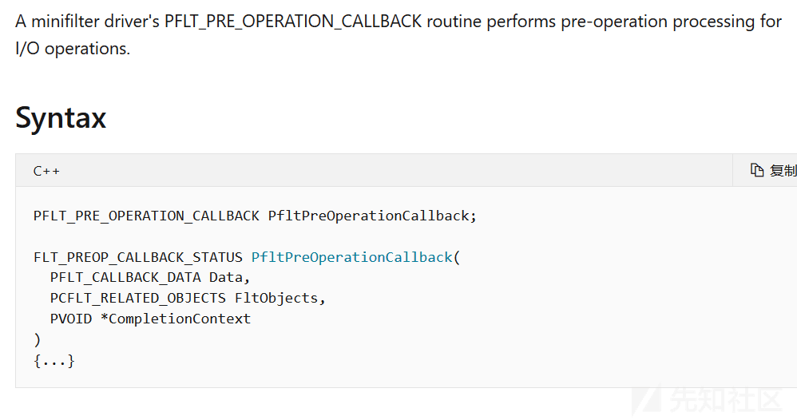

# Windows 驱动编程之文件过滤 - 先知社区

Windows 驱动编程之文件过滤

- - -

### 引言

  Windows 文件过滤驱动应用广泛，覆盖安全 EDR/DLP，游戏反作弊，云存储，云游戏等商用场景，有良好的市场表现，本文主题过程性实践和文件过滤安全技术分享。

### MiniFilter 简介：

  MiniFilter(Mini-filter Installable File System) 框架，MiniFilter 拥有良好兼容性，高封装接口，加快软件开发周期和降低了难度门槛，也是微软官方推荐文件过滤框架。早期微软各版本驱动兼容性问题，开发周期变动大。对外统一接口，按照 API 来约束办事，也是一贯风格，解决安全挂钩合理性，减少开发者文件过滤驱动对系统带来的不确定因素。  
[](https://xzfile.aliyuncs.com/media/upload/picture/20240202170301-ddefa360-c1a9-1.png)

用户请求 IO(用户态出发)，经历如下步骤：

```plain
1. 将 I/O 请求转发到文件系统。
2. 过滤管理拦截请求按照循序 A-B-C 来调用已注册的微型过滤器，然后将 I/O 请求转发到下一个较低的驱动程序。
3. 文件系统驱动程序处理并转发修改后的请求。
4. 目标卷的存储驱动程序堆栈准备对硬件请求 (HAL)。
```

[](https://xzfile.aliyuncs.com/media/upload/picture/20240202170311-e4043d74-c1a9-1.png)

```plain
See Minifilter: https://docs.microsoft.com/zh-cn/windows-hardware/drivers/ifs/advantages-of-the-filter-manager-model
```

### Minifilter 框架分析：

#### Miniflter Register Filter Callback

传统型文件过滤寻找对象生成过滤驱动绑定设备栈，编写分发，体积庞大，而新框架代码层面主要注册 - 启动 - 预操作 - 后操作四部分。IRP 工作都交给了 Filter Manager，非常清爽：

```plain
CONST FLT_REGISTRATION FilterRegistration = {

    sizeof(FLT_REGISTRATION),           //  Size
    FLT_REGISTRATION_VERSION,           //  Version
    0,                                  //  Flags

    NULL,                               //  Context
    Callbacks,                          //  Operation callbacks

    NULL,                               //  MiniFilterUnload

    FsFilter1InstanceSetup,                    //  InstanceSetup
    FsFilter1InstanceQueryTeardown,            //  InstanceQueryTeardown
    FsFilter1InstanceTeardownStart,            //  InstanceTeardownStart
    FsFilter1InstanceTeardownComplete,         //  InstanceTeardownComplete

    NULL,                               //  GenerateFileName
    NULL,                               //  GenerateDestinationFileName
    NULL                                //  NormalizeNameComponent
};
NTSTATUS status;
status = FltRegisterFilter(
           DriverObject,                  //Driver
           &FilterRegistration,           //Registration
           &MiniSpyData.FilterHandle);    //RetFilter
```

```plain
See Msdn: https://docs.microsoft.com/zh-cn/windows-hardware/drivers/ddi/fltkernel/ns-fltkernel-_flt_registration
```

CONST FLT\_OPERATION\_REGISTRATION 结构体中第五个域，需要重点关注的  
[](https://xzfile.aliyuncs.com/media/upload/picture/20240202170323-eb68e68c-c1a9-1.png)

```plain
typedef struct _FLT_OPERATION_REGISTRATION {
  UCHAR                            MajorFunction;
  FLT_OPERATION_REGISTRATION_FLAGS Flags;
  PFLT_PRE_OPERATION_CALLBACK      PreOperation;
  PFLT_POST_OPERATION_CALLBACK     PostOperation;
  PVOID                            Reserved1;
} FLT_OPERATION_REGISTRATION, *PFLT_OPERATION_REGISTRATION;
```

参数一功能号，想拦截读操作，需要从 IRP\_MJ\_READ 入手，文件创建则需要 IRP\_MJ\_CREATE 入手。

```plain
IRP_MJ_CLEANUP
IRP_MJ_CLOSE
IRP_MJ_CREATE
IRP_MJ_DEVICE_CONTROL
IRP_MJ_FILE_SYSTEM_CONTROL
IRP_MJ_FLUSH_BUFFERS
IRP_MJ_INTERNAL_DEVICE_CONTROL
IRP_MJ_PNP
IRP_MJ_POWER
IRP_MJ_QUERY_INFORMATION
IRP_MJ_READ
IRP_MJ_SET_INFORMATION
IRP_MJ_SHUTDOWN
IRP_MJ_SYSTEM_CONTROL
IRP_MJ_WRITE
```

参数二

```plain
SKIP_CACHED_IO 不过滤缓冲区读写。
SKIP_PAGING_IO 不过滤分页读写。
SKIP_NON_DASD_IO 仅对读写回调有用。
```

[](https://xzfile.aliyuncs.com/media/upload/picture/20240202170337-f35c1dfa-c1a9-1.png)

  参数三和四是功能函数，预操作和后操作回调，IRP 攻防业务处理的地方。传统的过滤中，基于 IRP 分发和事件回调两种方式可以实现主要的功能模块，处理预操作回调和后操作回调即可，通常是在预操作回调实现过滤。  
[](https://xzfile.aliyuncs.com/media/upload/picture/20240202170347-f98e82b2-c1a9-1.png)

  预操作回调函数参数，可以从 Data 和 Object 对象中，获取 I/O 请求的基础数据，使用 Flt 系列 API 来获取文件信息和上下文。后操作回调函数在 IRP 完成后被调用，已完成动作基本不做太多处理。

#### Minifilter IPC

R0~R3 Minifilter 提供了一套交互 IPC，类似于创建 Socket 通信。

##### r0

```plain
// FltBuildDefaultSecurityDescriptor 绑定安全描述符，FLT_PORT_ALL_ACCESS。
FltBuildDefaultSecurityDescriptor(&sd, FLT_PORT_ALL_ACCESS);

//  初始化属性对象 OBJECT_ATTRIBUTES 对象，初始化通信端口定义名称 MINSPY_PORT_NAME。
RtlSetDaclSecurityDescriptor(sd, TRUE, NULL, FALSE);
RtlInitUnicodeString(&EventPortName, L"\\HadesEventFltPort");
InitializeObjectAttributes(
    &oa,
    &EventPortName,
    OBJ_KERNEL_HANDLE | OBJ_CASE_INSENSITIVE,
    NULL,
    sd
);
status = FltCreateCommunicationPort(
    g_FltServerPortEvnet,
    &g_FltServerPortEvnetPort,
    &oa,
    NULL,
    CommunicateConnect,
    CommunicateDisconnect,
    NULL,
    1
);
```

FltCreateCommunicationPort 注册，这个地方有三个回调函数是必须处理的，利用 FilterConnectCommunicationPort 和 FilterSendMessage 进行交互。

##### r3

```plain
#include <fltuser.h>
// 连接驱动创建的 Port
Status = FilterConnectCommunicationPort(
    L"\\HadesEventFltPort", // Driver CreatePortName
    0,
    NULL,
    0,
    NULL,
    &g_hPort);
if (Status == HRESULT_FROM_WIN32(S_OK))

// 绑定 IOCP 端口 (异步接收)
g_comPletion = CreateIoCompletionPort(g_hPort, NULL, 0, 4);
if (nullptr == g_comPletion)
{
    CloseHandle(g_hPort);
    g_hPort = nullptr;
    continue;
}

// 获取消息分发处理
Status = FilterGetMessage(
    g_hPort,
    &msg->MessageHeader,
    FIELD_OFFSET(COMMAND_MESSAGE, Overlapped),
    &msg->Overlapped
);
```

### Minifilter 安全技术：

#### 文件/目录保护：

  访问文件或目录，Windows 下要通过文件句柄 Handle 进行操作，也就是 Open 或者 Create。基于 Minfilter 推荐在 IRP\_MJ\_CREATE PreCallback 进行过滤操作，IRP\_MJ\_CREATE 不一定全面，还会有删除/重命名/修改等属性，需要注册 IRP\_MJ\_SET\_INFORMATION。

```plain
{ IRP_MJ_CREATE,
0,
FsFilter1PreOperation,
NULL/*FsFilter1PostOperation*/},

{ IRP_MJ_SET_INFORMATION,
0,
FsFilter1PreOperation,
NULL },
```

  不同的 IRP 操作，注册回调可以使用同函数进行处理，可以都使用 FsFilter1PreOperation 前操作回调，通过 IRP 类别区分即可。r3 通过 CreateFile 或者 OpenFile 等 API 访问文件，I/O 到过滤文件系统以后，会触发我们注册的回调，需要业务规则检测访问权限。

-   IRP 类别

```plain
const unsigned char IRP_MJ_CODE = Data->Iopb->MajorFunction;
if (IRP_MJ_CODE == IRP_MJ_CREATE) {

}
else if (IRP_MJ_CODE == IRP_MJ_SET_INFORMATION) {

}
```

-   访问进程 PID
    
    ```plain
    const DWORD dwPID = (DWORD)PsGetCurrentProcessId();
    ```
    
-   通过 Data 参数获取被访问的文件或目录完整路径
    
    ```plain
    PFLT_FILE_NAME_INFORMATION pNameInfo = NULL;
    NTSTATUS status = FltGetFileNameInformation(Data, FLT_FILE_NAME_NORMALIZED | FLT_FILE_NAME_QUERY_DEFAULT, &pNameInfo);
    ```
    
-   访问目标属性，比如我们需要对 IRP\_MJ\_SET\_INFORMATION 做细分识别
    
    ```plain
    Data->Iopb->Parameters.SetFileInformation.FileInformationClass;
    ```
    
    ```plain
    // Rename
    case FileRenameInformation:
    // IRP_MJ_SET_INFORMATION Rename 触发 NameInfo
    case FileNameInformation:
    // Delete
    case FileDispositionInformation:
    ```
    
-   正常访问返回 FLT\_PREOP\_SUCCESS\_NO\_CALLBACK，不允许访问 FLT\_PREOP\_COMPLETE
    
    ```plain
    Data->IoStatus.Status = STATUS_ACCESS_DENIED;
    Data->IoStatus.Information = 0;
    return FLT_PREOP_COMPLETE;
    ```
    
-   IRP\_MJ\_CREATE 权限
    

```plain
if (((Data->Iopb->Parameters.Create.Options >> 24) & 0x000000ff) == FILE_CREATE ||
    ((Data->Iopb->Parameters.Create.Options >> 24) & 0x000000ff) == FILE_OPEN_IF ||
    ((Data->Iopb->Parameters.Create.Options >> 24) & 0x000000ff) == FILE_OVERWRITE_IF)
- FILE_DELETE_ON_CLOSE 也比较特殊
```

上述的过程性代码可以根据 PID，被访问路径，访问的属性和权限进行业务规则，拒绝被恶意进程访问，可以使用 FLT\_PREOP\_COMPLETE 进行保护或者拦截。

#### 文件隐藏：

  隐藏挂钩方式有很多种，应用层可以通过 WINAPI 来查询，递归枚举目录文件。大部分查找都是通过查询方式来做的，但基于 Ntfs MFT 磁盘解析，动作不会进入到文件过滤驱动 IRP。  
  Minifilter 通过 IRP 查询拦截可以使用 IRP\_MJ\_DIRECTORY\_CONTROL 过滤来实现，前回调 FsFilterAntsDrPostFileHide 处理，IRP 处理不好会影响性能，访问枚举性能很高，基线条件要处理好。

```plain
{ IRP_MJ_DIRECTORY_CONTROL,
0,
FsFilterAntsDrPostFileHide,
NULL },
```

-   请求属性获取 IRP\_MN\_QUERY\_DIRECTORY，判断 FileBothDirectoryInformation.
    
    ```plain
    if (Data->Iopb->MinorFunction == IRP_MN_QUERY_DIRECTORY &&
      (Data->Iopb->Parameters.DirectoryControl.QueryDirectory.FileInformationClass == FileBothDirectoryInformation) &&
      Data->Iopb->Parameters.DirectoryControl.QueryDirectory.Length > 0 &&
      NT_SUCCESS(Data->IoStatus.Status))
      {
      }
    ```
    
-   IRP\_MJ\_DIRECTORY\_CONTROL 不能通过返回值来进行权限拒绝，需要通过映射 MDL 进行修改。
    

```plain
if (Data->Iopb->Parameters.DirectoryControl.QueryDirectory.MdlAddress != NULL)
{

    Bufferptr = MmGetSystemAddressForMdl(Data->Iopb->Parameters.DirectoryControl.QueryDirectory.MdlAddress,
        NormalPagePriority);
}
else
{
    Bufferptr = Data->Iopb->Parameters.DirectoryControl.QueryDirectory.DirectoryBuffer;
}

if (Bufferptr == NULL)
    return FLT_POSTOP_FINISHED_PROCESSING;

// 推荐使用 MmGetSystemAddressForMdlSafe
```

-   获取映射的 MDL，FILE\_BOTH\_DIR\_INFORMATION 进行摘除。

```plain
PFILE_BOTH_DIR_INFORMATION pCutFileInfo = (PFILE_BOTH_DIR_INFORMATION)Bufferptr;
PFILE_BOTH_DIR_INFORMATION pPreFileInfo = pCutFileInfo;
PFILE_BOTH_DIR_INFORMATION pNextFileInfo = 0;
ULONG uNextOffset = 0;
if (pCutFileInfo == NULL)
    return FLT_POSTOP_FINISHED_PROCESSING;

// 可以找到隐藏的文件名
pCutFileInfo->FileName, HideFileName, wcslen(HideFileName)

// 摘除
if (uNextOffset == 0)
    pPreFileInfo->NextEntryOffset = 0;
else
    pPreFileInfo->NextEntryOffset = (ULONG)((PCHAR)pCutFileInfo - (PCHAR)pPreFileInfo + uNextOffset);
pCutFileInfo = pNextFileInfo;
```

#### 进程/模块拦截：

进程拦截，保护推荐使用 PsSetCreateProcessNotifyRoutineEx、ObRegisterCallbacks.

```plain
// See: Available starting with Windows Vista with SP1 and Windows Server 2008.
// Msdn: https://docs.microsoft.com/en-us/windows-hardware/drivers/ddi/ntddk/nf-ntddk-pssetcreateprocessnotifyroutineex
PsSetCreateProcessNotifyRoutineEx((PCREATE_PROCESS_NOTIFY_ROUTINE_EX)Process_NotifyProcessEx, FALSE);

// See: Available starting with Windows Vista with Service Pack 1 (SP1) and Windows Server 2008.
// Msdn: https://docs.microsoft.com/en-us/windows-hardware/drivers/ddi/wdm/nf-wdm-obregistercallbacks
NTSTATUS status = ObRegisterCallbacks(&obReg, &g_handleobj);

// 卸载
PsSetCreateProcessNotifyRoutineEx((PCREATE_PROCESS_NOTIFY_ROUTINE_EX)Process_NotifyProcessEx, TRUE);
ObUnRegisterCallbacks(g_handleobj);
```

  DLL 拦截模块有多种方式，已落地文件在 Open/Craete IRP 做拦截，使其没有权限打开失败，基于 Minfilter 注册 IRP\_MJ\_ACQUIRE\_FOR\_SECTION\_SYNCHRONIZATION 也可以做到相同效果的拦截。

```plain
{ IRP_MJ_ACQUIRE_FOR_SECTION_SYNCHRONIZATION,
0,
FsFilterAntsDrvPreExe,
NULL },
```

-   加载的名字或 PID
    
    ```plain
    const DWORD dwPID = (DWORD)PsGetCurrentProcessId();
    FltGetFileNameInformation(Data, FLT_FILE_NAME_NORMALIZED | FLT_FILE_NAME_QUERY_DEFAULT, &pNameInfo)
    ```
    
-   PageProtection 执行状态
    
    ```plain
    if (Data->Iopb->Parameters.AcquireForSectionSynchronization.PageProtection == PAGE_EXECUTE)
    {
      return FLT_PREOP_SUCCESS_NO_CALLBACK;
    }
    ```
    
-   拦截方式
    
    ```plain
    Data->IoStatus.Status = STATUS_INSUFFICIENT_RESOURCES // DLL 弹出资源错误窗口，可以设置。
    Data->IoStatus.Status = STATUS_ACCESS_DENIED
    Data->Iostatus.information = 0;
    return FLT_PREOP_COMPLETE;
    ```
    
    实践中发现很多其他的调用也会进入到注册回调，这时候可以做 PE 区分，通过解析来区分有效性 EXE/DLL 模块，FltReadFile 读取 FileObject 对象，拿到数据做 NT 解析即可。
