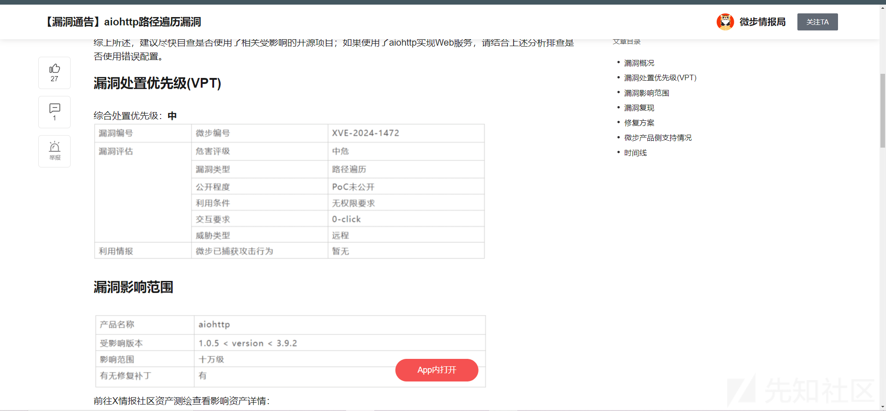
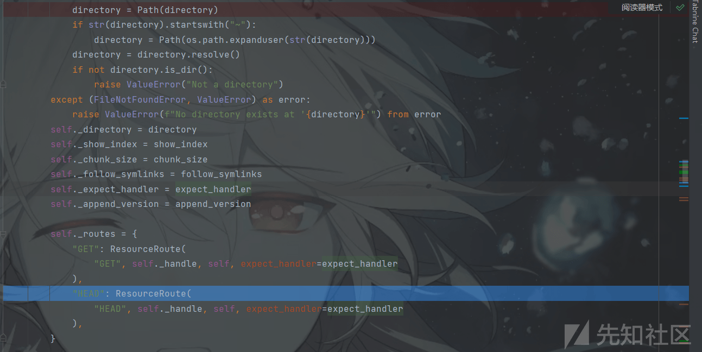

# aiohttp 路径遍历漏洞分析 (XCE-2024-1472) - 先知社区

aiohttp 路径遍历漏洞分析 (XCE-2024-1472)

- - -

# 前言

微步发的漏洞通告**aiohttp**存在路径遍历漏洞，**fofa**搜了一下资产，确实挺多的，因为**poc**没有公布，所以并不知道漏洞的详情，但是见了这么多的路径遍历，基本上都不会产生什么变化，最多就是转换下编码的问题，比如说**GlassFish**出现的**UTF8**超长编码导致的任意文件读取等等，于是就来简单分析下，顺便学习一下`aiohttp`处理请求的一些流程。

[](https://xzfile.aliyuncs.com/media/upload/picture/20240227224137-4f880570-d57e-1.png)

# 关于 aiohttp

之前并没有使用过**aiohttp** 进行一些开发的操作，所以对这个框架的处理源代码并不熟悉，但是应该与`async`这类异步的东西有关系。

`aiohttp` 是一个基于异步的 Python Web 开发框架，可用于编写基于 `asyncio` 的异步网络应用程序。它提供了对 HTTP 客户端和服务器的支持，使得编写高效的异步 Web 服务变得更加简单。

`aiohttp` 基于 Python 3.5+ 的 `asyncio` 模块，使用异步的方式处理网络请求和响应，从而实现高并发的网络通信。它支持 `WebSocket`、HTTP/1.1 和 HTTP/2 协议，并提供了丰富而灵活的 `API`，使得开发者能够轻松地构建异步的 Web 应用程序。

使用 `aiohttp`，开发者可以通过异步的方式处理并发请求、管理长连接、支持 `WebSockets` 等功能，同时享受到 Python 的简洁和易用性。它非常适合构建需要高性能、高并发的 Web 服务，尤其适用于 I/O 密集型的应用场景。

## 源码对比

从[aiohttp 源码](https://github.com/aio-libs/aiohttp/) 里面对比一下版本，大致能够知道开发者修复的东西，这里修复的版本后是`3.9.2`之后，所以这里拿了`3.9.1`与`3.9.2`对比找修改的地方，最终是在`urlDispatcher`即 URL 的分发和处理模块找到了异常，开发者更改了条件判断语句的方式，并且原先的`joinpath`改成了`os.path.normpath`，`os.path.normpath`有一个优点就是会消除掉路径中的`.`或`..`分隔符，返回规范化的路径，这里原先的代码应该就是漏洞的产生点，也就是与`follow_symlinks`参数有关。

[](https://xzfile.aliyuncs.com/media/upload/picture/20240227224212-64d7c37a-d57e-1.png)

关于`follow_symlinks`:

在 **aiohttp** 中，`follow_symlinks` 参数用于指定是否应该跟随符号链接。符号链接是一种特殊的文件类型，它是文件系统中的一个指向另一个文件或目录的链接。当 `follow_symlinks` 参数设置为 `True` 时，**aiohttp** 会跟随符号链接来访问目标文件或目录；当设置为 `False` 时，**aiohttp** 不会跟随符号链接而是直接访问链接本身。

用例子来说就是，比如有下面的这样一段代码：

```plain
from aiohttp import web

async def handle(request):
    return web.FileResponse('./static/index.html')

app = web.Application()
app.router.add_static('/static', 'static', follow_symlinks=True)

app.router.add_get('/', handle)

web.run_app(app)
```

> 比如说这个例子如果在 static 文件夹里面创建一个`link`的符号链接，指向另一个文件夹，那么就可以通过`/static/link`访问符号链接指向的静态文件，也就是另一个文件夹中的静态文件。

# 漏洞分析

看上面的改的代码修复方式，应该就是最简单的`../`穿越的形式，通过**fofa**找资产来进行测试的时候，验证到确实是这样的，当访问一些静态文件的时候，可以通过目录穿越的形式进行文件的读取。

[](https://xzfile.aliyuncs.com/media/upload/picture/20240227224222-6a991c6e-d57e-1.png)

尝试在本地起环境，因为是与`静态文件`以及`follow_symlinks`有关系，所以应该是在设置静态文件的访问路径的时候通过`add_static`函数造成的。

```plain
from aiohttp import web

app = web.Application()
app.router.add_static('/static/', './images', follow_symlinks=True)
if __name__ == '__main__':
    web.run_app(app, host='0.0.0.0', port=8888)
```

程序就五行代码，在这里打断点访问静态文件肯定是没反应的，所以只能在处理源代码里面打断点，首先简单分析下在启动程序时`add_static`的操作，它会到`web_urldispatcher#StaticResource`静态资源类中根据参数配置一些静态资源。

[](https://xzfile.aliyuncs.com/media/upload/picture/20240227224235-72064940-d57e-1.png)

> 首先根据你写的路径创建一个`Path`类，就是指明静态资源的文件夹路径，然后判断路径是否以`~`开头，对`linux`系统中用户目录做特殊处理，然后判断路径是否是目录，是否为空，最终将`foolow_symlinks`、`chunk_size`等赋值进去，`chunk_size`是返回静态文件时分块的大小，最终配置路由和处理器，只允许`GET`或`HEAD`请求，这里的`_hadler`是静态资源的处理器，即`StaticResource._handle`

创建完成`staticResouce`类后，通过`register_resource`对静态资源进行注册。

[](https://xzfile.aliyuncs.com/media/upload/picture/20240227224240-7526003e-d57e-1.png)

在`register_resource`方法中，判断资源类型是否是动态资源 (指的是通过请求响应动态生成的一些页面等资源)，再判断注册的路由是否是不可用的路由中，下面再通过是否赋值了`name`等特殊处理，最终是将资源加到了`_resources`列表里面完成了`add_static`

下面是漏洞请求触发的具体流程：

首先发起请求后，会进入到`_handler`，判断是否有线程循环，是否是`debug`模式后，会来到`UrlDispacher`类的`resolve`对路由请求进行处理，获取到请求的`method`后，遍历前面的资源列表获取`resource`，

[](https://xzfile.aliyuncs.com/media/upload/picture/20240227224305-83e90d46-d57e-1.png)

`resource.resolve`的处理逻辑也是十分简单，获取到请求的完整文件路径后，通过`self_prefix`也就是`add_static`时候写的`/static`，然后从完整路径中去除`/static`作为文件名，最终返回请求方法和一个`UrlMappingMatchInfo`类，这个类记录了请求的方法，文件名，要处理的`handler`，请求的路径等。

[](https://xzfile.aliyuncs.com/media/upload/picture/20240227224311-88008274-d57e-1.png)

当请求的前缀是正确的，并且方法也是允许的，返回一个有效的`UrlMappingMatchInfo`返回到`_handler`中，经过异常处理后，将应用程序对象添加到路由匹配信息，路由匹配信息用于存储与请求 URL 相关的路由信息，包括路由处理函数、路由参数等，当这些路由信息都准备完毕，通过`freeze`锁定路由信息，确保在后续的处理过程中信息不会被意外修改。再从请求头中获取`Expect`的信息，选择`expect_handler` 处理器处理 (这里没有)，它就选择了`UrlMappingMatchInfo`中的`StaticResource._handler`进行处理。

选择好了`handler`后，会通过判断是否有中间件，先做中间件的处理，这里没有就不看了，最终会使用选择到的处理器处理`request`请求。

[](https://xzfile.aliyuncs.com/media/upload/picture/20240227224331-93e0ba46-d57e-1.png)

来到处理器对应的方法后，会取出先前的文件名，然后创建`Path`类，`Path`类对判断系统，分出`Windows`系统或是其它系统，如果是`Window`系统，会调用`_from_parts`将文件名中的`/`都转换成`\`。然后会判断`filename.anchor`，这里的作用就是不允许`http`请求的静态资源文件名存在类似于网络共享路径或本地盘符路径的写法。  
[](https://xzfile.aliyuncs.com/media/upload/picture/20240227224340-99086190-d57e-1.png)

```plain
def __new__(cls, *args, **kwargs):
        if cls is Path:
            cls = WindowsPath if os.name == 'nt' else PosixPath
        self = cls._from_parts(args)
        if not self._flavour.is_supported:
            raise NotImplementedError("cannot instantiate %r on your system"
                                      % (cls.__name__,))
        return self
```

[](https://xzfile.aliyuncs.com/media/upload/picture/20240227224350-9ec754e2-d57e-1.png)

最终来到了漏洞的语句`filepath = self._directory.joinpath(filename).resolve()`中，在处理`joinpath`的时候，它会将`filename`以为`\`分开，分成`驱动器`，`根`，`parts`，同样也会将前面预先有的静态文件的绝对路径以同样的形式分开，一起传入到`join_parsed_parts`中。

这里的以`E:\\src\images\icon.jpg`表示的话，`drv=E：` `root=\\` `parts=[E:\\,src,images,icon.jpg]`，而`filename`请求文件名的`drv2=空` `root2=空` `parts=图中所示`

[](https://xzfile.aliyuncs.com/media/upload/picture/20240227224358-a3a5848e-d57e-1.png)

在`join_parsed_parts`中，会进行条件判断 (看下面)，我们的请求方式会来到第三个`else`，因为我们访问的静态资源取出的`filename`是相对路径，没有驱动器，也没有`\\`，最终返回的其实是 `('E:', '\\', ['E:\\', 'aiohttp', 'src', 'images', 'images', 'icon.jpg', '..', '..', 'data.db'])`，其实前面的两个条件判断处理，也是为了最终返回的`parts`要是完整的绝对路径，但是没有对`..`进行处理。

[](https://xzfile.aliyuncs.com/media/upload/picture/20240227224407-a9543830-d57e-1.png)

-   当 `root2` 不为空时，且 `drv2` 为空且 `drv` 不为空时，将 `drv` 保留，将 `root2` 作为新的根，并将第二个路径的部分连接起来，形成一个新的路径元组。
-   当 `drv2` 不为空时，判断两个驱动器是否相同，如果相同，则认为第二个路径是相对于第一个路径的，将第一个路径的信息作为新路径的一部分，并将第二个路径的部分连接起来，形成一个新的路径元组。
-   当以上条件不满足时，将第二个路径作为非锚定的路径（即普通路径）处理，将两个路径的部分连接起来，形成一个新的路径元组。

返回了绝对路径的`parts`之后，来到`resolve`方法，`resolve`方法会通过`os.path.realpath`对`self`也就是刚才`parts`部分进行处理，规范化了路径，将两个`..`去掉，并把目录往前移了两位。

[](https://xzfile.aliyuncs.com/media/upload/picture/20240227224417-af085edc-d57e-1.png)

[](https://xzfile.aliyuncs.com/media/upload/picture/20240227224424-b383b86c-d57e-1.png)

继续往`handler`下面走，如果前面得到的规范化路径，也就是`E:\\aiohttp\src\images\data.db`是一个目录，则将目录转换成`html`页面返回，如果是文件，则使用`FileResponse`返回。

[](https://xzfile.aliyuncs.com/media/upload/picture/20240227224432-b7ccfa8c-d57e-1.png)

直至这一步，`filepath`就被确定了，到`FileResponse`后面还有挺多处理的，包括根据`Content-Type`来进行不同的响应如`Gzip、application/octet-stream`等，以及各种请求头做对应的处理等等，就不继续看下去了。

为什么`follow_symlinks==True`，当`follow_symlinks!=True`回进入`relative_to`获取文件的路径，这也是后面修复使用的方法。

[](https://xzfile.aliyuncs.com/media/upload/picture/20240227224441-bd904474-d57e-1.png)

# 修复

修复主要是改变了原先路径的拼接方式，将拼接的方式改到了`relative_to`方法，通过比较请求的`filename`路径相对于指定的静态目录路径，如果请求的`filename`路径不是静态目录的子路径，则会抛出异常，最终返回`404`

[](https://xzfile.aliyuncs.com/media/upload/picture/20240227224455-c5ea4264-d57e-1.png)

```plain
def relative_to(self, *other):
        if not other:
            raise TypeError("need at least one argument")
        parts = self._parts
        drv = self._drv
        root = self._root
        if root:
            abs_parts = [drv, root] + parts[1:]
        else:
            abs_parts = parts
        to_drv, to_root, to_parts = self._parse_args(other)
        if to_root:
            to_abs_parts = [to_drv, to_root] + to_parts[1:]
        else:
            to_abs_parts = to_parts
        n = len(to_abs_parts)
        cf = self._flavour.casefold_parts
        if (root or drv) if n == 0 else cf(abs_parts[:n]) != cf(to_abs_parts):
            formatted = self._format_parsed_parts(to_drv, wto_root, to_parts)
            raise ValueError("{!r} is not in the subpath of {!r}"
                    " OR one path is relative and the other is absolute."
                             .format(str(self), str(formatted)))
        return self._from_parsed_parts('', root if n == 1 else '',
                                       abs_parts[n:])
```

> -   首先，将当前路径 (filename 路径) 和传入的其他路径 (静态目录路径) 参数进行解析，提取出各自的驱动器（drive）、根路径（root）、路径部分（parts）等信息。
> -   接着，根据条件判断当前路径和其他路径的情况，包括是否带有根路径或驱动器等。
> -   进行路径的比较，判断当前路径是否是其他路径的子路径或在同一目录结构下，如果不是则抛出异常。
> -   如果当前路径是其他路径的子路径，则返回当前路径相对于其他路径的相对路径。

# 总结

主要是因为开发者在对`follow_symlinks==True`情况时，处理的方法不对导致的，没有对请求的`filename`路径与`静态文件的路径`进行比较判断是否是子路径导致的问题。写的比较啰嗦，主要还是为了看看`aiohttp`，这个框架的代码为了达到异步，里面用了很多的`await`对定义函数的处理。
