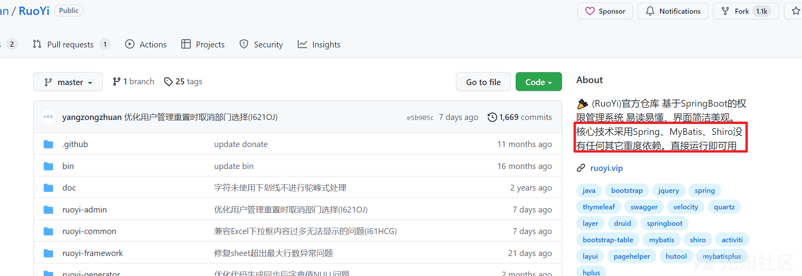
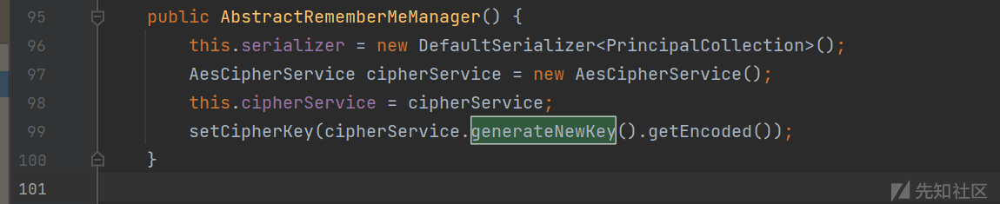
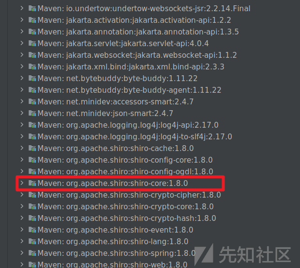
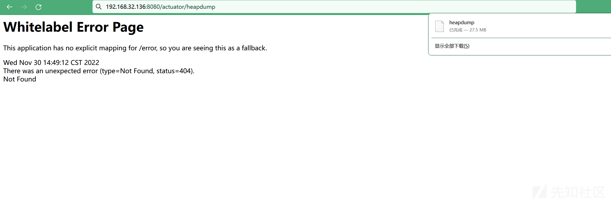
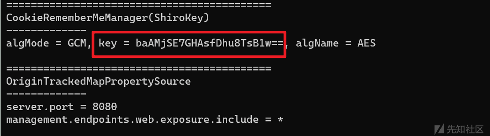
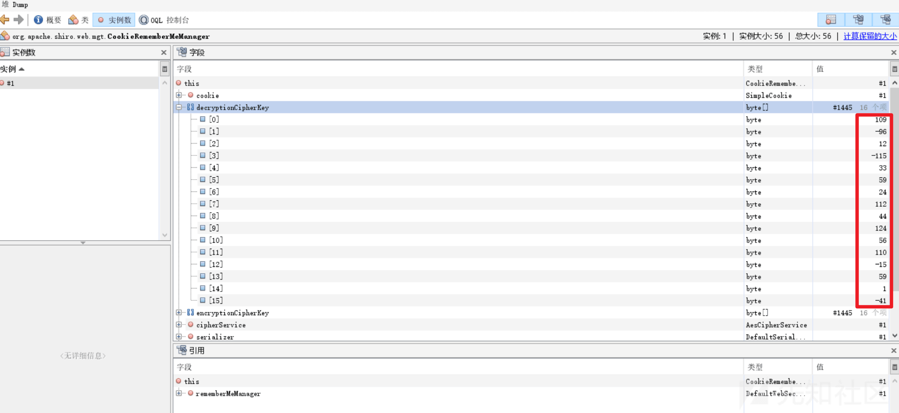
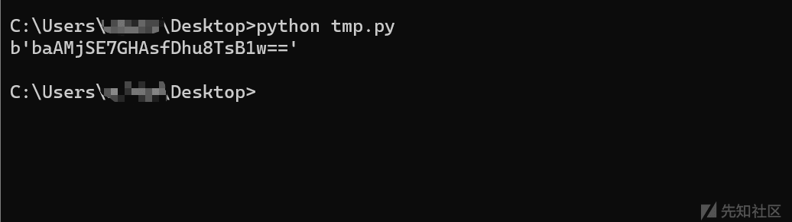
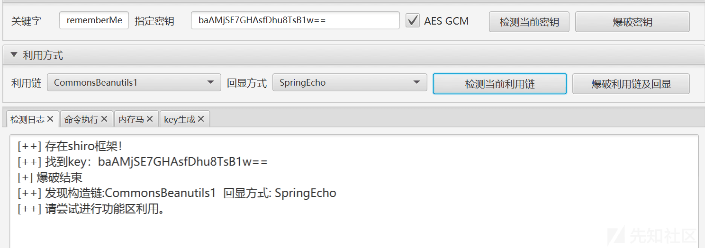
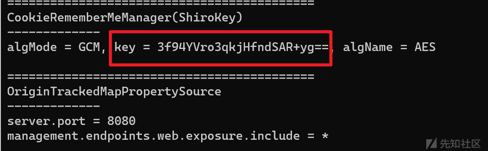
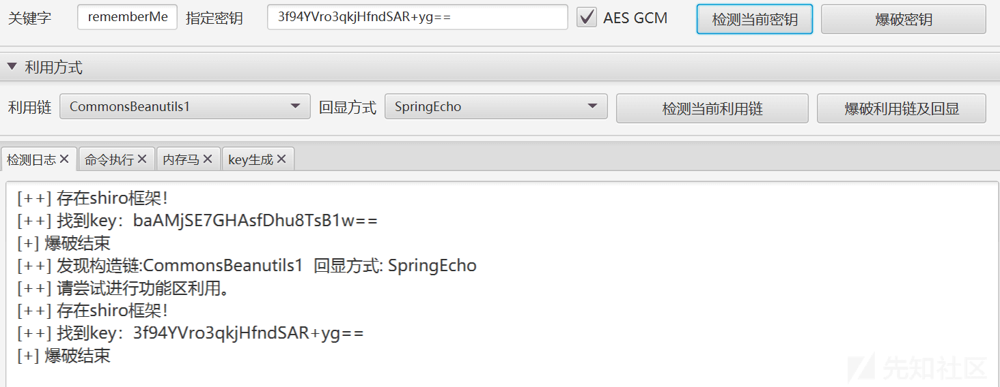

# heapdump 泄露 Shiro key 从而 RCE - 先知社区

heapdump 泄露 Shiro key 从而 RCE

- - -

## 1\. 简介

我搭建了一个 Spring heapdump 泄露 shiro key 从而 RCE 的漏洞环境，Github 地址：[https://github.com/P4r4d1se/heapdump\_shiro\_vuln](https://github.com/P4r4d1se/heapdump_shiro_vuln)  
漏洞利用条件：

-   Spring Shiro 环境
-   存在 heapdump 文件泄露
-   存在可利用链

## 2\. 漏洞原理

Shiro 相关的漏洞原理和调试分析已经有很多大佬分享过了，这里不再赘述，这里主要针对这个漏洞环境进行说明：  
（1）Spring 其实是有自己默认安全框架的，叫 Spring Security，但可能有的开发用 Shiro 用习惯了，将 Spring Securiy 替换成了 Shiro，这种情况并不少见，比如若依就是 Spring shiro。  
[](https://xzfile.aliyuncs.com/media/upload/picture/20221130172619-0c0ab6ce-7091-1.png)  
（2）在有 key 的情况下，即使是最新版的 Shiro 也一样存在漏洞，而且在很多时候都会因为开发、部署等问题导致 shiro key 的泄露。  
（3）Shiro 大于 1.2.4 的版本中，在没有开发人员人工干预的情况下 key 改为了随机生成，这个随机生成是在每次启动 Web 环境的时候，重启前这个 key 不会改变，可以在 JVM 虚拟机内存里找到。  
[](https://xzfile.aliyuncs.com/media/upload/picture/20221130172627-10e0b590-7091-1.png)  
（4）Spring 的 heapdump 文件就是从 JVM 虚拟机内存导出的。  
综上所述导致了这个组合漏洞的产生。

## 3\. 漏洞演示

加载漏洞环境后，可以看到 Shiro 版本为 1.8.0：  
[](https://xzfile.aliyuncs.com/media/upload/picture/20221130172657-23125b56-7091-1.png)  
访问 8080 端口的/actuator/heapdump 获取 heapdump 文件：  
[](https://xzfile.aliyuncs.com/media/upload/picture/20221130172704-26bfa8da-7091-1.png)  
获取其中的 shiro key，我常用的有两种方式：  
（1）JDumpSpider：[https://github.com/whwlsfb/JDumpSpider](https://github.com/whwlsfb/JDumpSpider)  
这个小工具可以自动爬取 heapdump 中的变量信息，比较方便，坏处是可能会漏掉没在爬取列表中的信息。  
直接运行:java -jar JDumpSpider.jar heapdump 即可自动获取变量信息，这里获取到 ShiroKey：  
[](https://xzfile.aliyuncs.com/media/upload/picture/20221130172718-2f9afe50-7091-1.png)  
（2）jvisualvm.exe：Java 自带的工具，默认路径为：JDK 目录/bin/jvisualvm.exe  
这个工具需要手动去找想要的信息，在过滤里输入 org.apache.shiro.web.mgt.CookieRememberMeManager，圈出来的 16 个字节的值就是 key：  
[](https://xzfile.aliyuncs.com/media/upload/picture/20221130172731-36d0914e-7091-1.png)  
用一个 Python 小脚本转成 base64 编码后的 Shiro key：

```plain
import base64
import struct

print(base64.b64encode(struct.pack('<bbbbbbbbbbbbbbbb', 109,-96,12,-115,33,59,24,112,44,124,56,110,-15,59,1,-41)))
```

[](https://xzfile.aliyuncs.com/media/upload/picture/20221130172827-58bc8dc6-7091-1.png)  
使用获得的 key 进行利用成功：  
[](https://xzfile.aliyuncs.com/media/upload/picture/20221130172910-723fddf2-7091-1.png)  
重新启动服务器再次获取 shiro key，可以看到 key 改变了，验证了漏洞原理的第 3 点，每次启动生成一个随机 key：  
[](https://xzfile.aliyuncs.com/media/upload/picture/20221130172921-7897c976-7091-1.png)  
改用新的 key 仍然可进行利用：  
[](https://xzfile.aliyuncs.com/media/upload/picture/20221130172927-7c76e054-7091-1.png)
