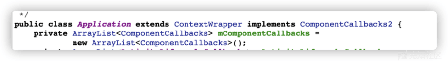
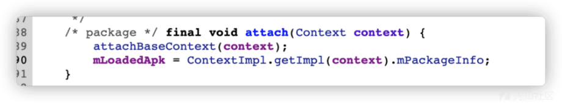
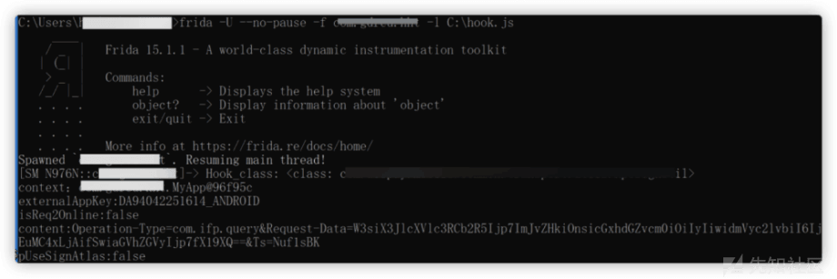

# hook 某银行加固 app - 先知社区

hook 某银行加固 app

- - -

# 分析

要在未修复 dex 并打包情况下对其 app 内在类进行 hook，单纯的 hook 会由于加固的问题而导致加载不到内在想 hook 的类。因此需要进行加载加固的 classloader。  
在此之前需要先了解 Context

```plain
在 Android 中，只有 Application、Activity 以及 Service 有自己的 Context。
Application 的 Context
我们知道 Application 的 Context 是伴随着 Application 的创建而创建的，AMS 在需要启动应用进程的时候，通过本地 socket 通知 Zygote 来 fork 应用进程，应用进程在启动完成之后，会通过 Binder 机制向 AMS 报告“我已经启动好了”，AMS 在接收到该 Binder 调用之后，会立即通过 Binder 调用通知应用进程创建 Application。
应用在创建 Application 的时候，首先通过 ClassLoader 加载对应的 class 文件，并通过 newInstance 创建一个应用的 Application 对象，这样就经过了 Application 的构造函数，同时应用进程还会实例化一个 Context 对象，通过 Application 对象的 attachBaseContext 方法赋值给 Application，这些都做完之后，应用进程才会调用 Application 对象的 onCreate 方法。这里需要注意，Application 中的 context 其实只是一个空壳，真正起作用的是应用进程通过 attachBaseContext 赋值的 mBase，Application 的 context 其实是 mBase 的静态代理。
Application 的总结
● 继承关系：Application <- ContextWrap <- Context
● 调用顺序：构造函数 -> attachBaseContext -> onCreate
ContextWrap 中包含了一个 Context（mBase 变量，是应用进程通过 attachBaseContext 赋值的），Application 中关于 Context 的调用都是委托给它
```

在 android 的 android.app.Application 的源码中可以发现

[](https://xzfile.aliyuncs.com/media/upload/picture/20240125110501-87f3adac-bb2e-1.png)

Application 继承 ContextWrapper

[](https://xzfile.aliyuncs.com/media/upload/picture/20240125110510-8d144e40-bb2e-1.png)

attachBaseContext 方法被 attach 调用，而大部分的壳都是在 attachBaseContext 这个方法里面去完成代码的解密，使用加固之后的应用的 classloader 会被换成其加固应用本身的。  
编写  
因此可以利用 java.use 编写脚本加载样本 app 的 classloader

```plain
if(Java.available) {
    Java.perform(function(){
        var application = Java.use("android.app.Application");
        application.attach.overload('android.content.Context').implementation = function(context) {
            var result = this.attach(context); // 先执行原来的 attach 方法
            var classloader = context.getClassLoader();

            return result;
        }

    });
}
```

利用加载到的 classloader 再次对样本 app 的类进行 hook

```plain
//框架为
if(Java.available) {
    Java.perform(function(){
        var application = Java.use("android.app.Application");

        application.attach.overload('android.content.Context').implementation = function(context) {
            var result = this.attach(context); // 先执行原来的attach方法
            var classloader = context.getClassLoader(); // 获取classloader
            Java.classFactory.loader = classloader;
            var Hook_class = Java.classFactory.use("com.xxx.xxx");  // app的类
            console.log("Hook_class: " + Hook_class);
            // 下面代码和写正常的hook一样
            Hook_class.函数.implementation = function()  // 有参数填参数
            {

            }

            return result;
        }
    });
}
```

有一处 root 检测，只需要将其返回的值为 false 就可以了。

```plain
public class RootCheckUtil {
    private static final String TAG = RootCheckUtil.class.getSimpleName();

    public static boolean isRooted() {
        if (Build.MODEL.equals("Redmi Note 4")) {
            return false;
        }
        if (isExecuted("/system/xbin/su")) {
            return true;
        }
        if (isExecuted("/system/bin/su")) {
            return true;
        }
        if (isExecuted("/su/bin/su")) {
            return true;
        }
        if (isExecuted("/system/sbin/su")) {
            return true;
        }
        if (isExecuted("/sbin/su")) {
            return true;
        }
        if (isExecuted("/vendor/bin/su")) {
            return true;
        }
        return checkRootMethod2();
    }

    private static boolean isExecuted(String path) {
        boolean ret = false;
        try {
            if (new File(path).exists()) {
                Process exec = Runtime.getRuntime().exec("ls -l " + path + "\n");
                BufferedReader br = new BufferedReader(new InputStreamReader(exec.getInputStream()));
                while (true) {
                    String str = br.readLine();
                    if (str == null) {
                        break;
                    } else if (str.length() > 10) {
                        String key = (String) str.subSequence(9, 10);
                        if (key.equals("x") || key.equals(d.ap)) {
                            ret = true;
                        }
                    }
                }
                exec.waitFor();
                br.close();
            }
        } catch (Exception e) {
            LoggerFactory.getTraceLogger().debug(TAG, "Exception rootcheck e");
        }
        return ret;
    }

    private static boolean checkRootMethod2() {
        try {
            return new File("/system/app/Superuser.apk").exists();
        } catch (Exception e) {
            LoggerFactory.getTraceLogger().debug(TAG, "Exception checkRootMethod e");
            return false;
        }
    }
}
```

在 hook signature 的过程中发现存在 Context 字段内存在一个 Request-Data，对其产生了兴趣，代码如下

```plain
private RpcSignUtil.SignData a(String operationType, byte[] body, String ts, InnerRpcInvokeContext invokeContext, int[] signCostPtr) {
        StringBuffer signPlain = new StringBuffer();
        signPlain.append("Operation-Type=").append(operationType).append("&");
        signPlain.append("Request-Data=").append(Base64.encodeToString(body, 2)).append("&");
        signPlain.append("Ts=").append(ts);
        String content = signPlain.toString();
        if (MiscUtils.isDebugger(getRpcFactory().getContext())) {
            LogCatUtil.debug("RpcInvoker", "[getSignData] sign content: " + content);
        }
        boolean useSignAtlas = MiscUtils.isAlipayGW(invokeContext.gwUrl);
        long startTime = SystemClock.elapsedRealtime();
        MonitorInfoUtil.startLinkRecordPhase(operationType, WbCloudFaceContant.SIGN, null);
        try {
            return RpcSignUtil.signature(this.d.getContext(), invokeContext.appKey, isReq2Online(invokeContext), content, useSignAtlas);
        } finally {
            long signCost = SystemClock.elapsedRealtime() - startTime;
            signCostPtr[0] = (int) signCost;
            LogCatUtil.debug("RpcInvoker", "[getSignData] sign time = " + signCost + "ms. ");
            MonitorInfoUtil.endLinkRecordPhase(operationType, WbCloudFaceContant.SIGN, null);
        }
    }
```

在写 hook 的过程，发现其加密的发现是调用了 android 的原生包中的类 android.util.Base64。而真正想要 hook 的类为

```plain
public static SignData signature(Context context, String externalAppKey, boolean isReq2Online, String content, boolean pUseSignAtlas) {
        try {
            SignRequest signRequest = new SignRequest();
            signRequest.appkey = MpaasPropertiesUtil.getAppkey(externalAppKey, isReq2Online, context);
            signRequest.content = content;
            if (a(context, pUseSignAtlas)) {
                signRequest.signType = SignRequest.SIGN_TYPE_ATLAS;
            }
            return SignData.createSignDataBySignResult(SecurityUtil.signature(signRequest));
        } catch (Throwable e) {
            LoggerFactory.getTraceLogger().warn("RpcSignUtil", e);
            return SignData.newEmptySignData();
        }
    }
```

综合上述，最终的 hook 脚本为

```plain
if(Java.available) {
    Java.perform(function(){
        var application = Java.use("android.app.Application");
        var dedata1 = Java.use("android.util.Base64");

        application.attach.overload('android.content.Context').implementation = function(context) {
            var result = this.attach(context);
            var classloader = context.getClassLoader();
            Java.classFactory.loader = classloader;
            var Hook_class = Java.classFactory.use("com.alipay.mobile.common.transport.utils.RpcSignUtil");
            var passroot = Java.classFactory.use("com.1111.common.api.util.RootCheckUtil");
            var requestdata = Java.classFactory.use("com.alipay.mobile.common.rpc.RpcInvoker");
            console.log("Hook_class: " + Hook_class);

            Hook_class.signature.implementation = function(context,externalAppKey,isReq2Online,dcontent,pUseSignAtlas)
            {
                console.log("context："+ context);
                console.log("externalAppKey:"+ externalAppKey);
                console.log("isReq2Online:"+ isReq2Online);
                console.log("content:"+ dcontent);
                console.log("pUseSignAtlas:"+ pUseSignAtlas);
            }

            requestdata.a.overload('java.lang.String', '[B', 'java.lang.String', 'com.alipay.mobile.common.rpc.transport.InnerRpcInvokeContext', '[I').implementation = function (operationType,body,ts,invokeContext,signCostPtr) {
                console.log("-------------------");
                console.log("-------------------");

                var ret = dedata1.encodeToString(body, 10);
                console.log("Request-Data"+ret);
                console.log("=========decode========");
                console.log(base64decode(ret));
            }

            passroot.isRooted.implementation = function (){
                return false;
            }

            passroot.isExecuted.implementation = function (path){
                return false;
            }

            passroot.checkRootMethod2.implementation = function (){
                return false;
            }
            return result;
        }

        function base64decode(str){
            var base64DecodeChars = new Array(
                -1, -1, -1, -1, -1, -1, -1, -1, -1, -1, -1, -1, -1, -1, -1, -1,
                -1, -1, -1, -1, -1, -1, -1, -1, -1, -1, -1, -1, -1, -1, -1, -1,
                -1, -1, -1, -1, -1, -1, -1, -1, -1, -1, -1, 62, -1, -1, -1, 63,
                52, 53, 54, 55, 56, 57, 58, 59, 60, 61, -1, -1, -1, -1, -1, -1,
                -1,  0,  1,  2,  3,  4,  5,  6,  7,  8,  9, 10, 11, 12, 13, 14,
                15, 16, 17, 18, 19, 20, 21, 22, 23, 24, 25, -1, -1, -1, -1, -1,
                -1, 26, 27, 28, 29, 30, 31, 32, 33, 34, 35, 36, 37, 38, 39, 40,
                41, 42, 43, 44, 45, 46, 47, 48, 49, 50, 51, -1, -1, -1, -1, -1);
            var c1, c2, c3, c4;
            var i, len, out;
            len = str.length;
            i = 0;
            out = "";
            while(i < len) {
                do {
                    c1 = base64DecodeChars[str.charCodeAt(i++) & 0xff];
                } while(i < len && c1 == -1);
                if(c1 == -1)
                    break;
                do {
                    c2 = base64DecodeChars[str.charCodeAt(i++) & 0xff];
                } while(i < len && c2 == -1);
                if(c2 == -1)
                    break;
                out += String.fromCharCode((c1 << 2) | ((c2 & 0x30) >> 4));
                do {
                    c3 = str.charCodeAt(i++) & 0xff;
                    if(c3 == 61)
                        return out;
                    c3 = base64DecodeChars[c3];
                } while(i < len && c3 == -1);
                if(c3 == -1)
                    break;
                out += String.fromCharCode(((c2 & 0XF) << 4) | ((c3 & 0x3C) >> 2));
                do {
                    c4 = str.charCodeAt(i++) & 0xff;
                    if(c4 == 61)
                        return out;
                    c4 = base64DecodeChars[c4];
                } while(i < len && c4 == -1);
                if(c4 == -1)
                    break;
                out += String.fromCharCode(((c3 & 0x03) << 6) | c4);
            }
            return out;
        }
    });
 }
```

最后进行 hook 的效果

[](https://xzfile.aliyuncs.com/media/upload/picture/20240125110527-9776bfc6-bb2e-1.png)
