# nmap 扫描特征分析 - 先知社区

nmap 扫描特征分析

- - -

本文基于 ET 公开的规则集 [https://rules.emergingthreats.net/OPEN\_download\_instructions.html](https://rules.emergingthreats.net/OPEN_download_instructions.html) 中的 emerging-scan.rules 来进行 nmap 扫描特征分析

## rule 简介

以该规则为例

> alert ip any any -> any any (msg: "IP Packet detected";)

它会检测所有传入的 IP 数据包并输出一个消息："IP Packet detected"

> Snort 的规则被分为两个部分：规则头和规则选项  
> 规则头包含规则的动作，协议，源和目标 ip 地址与网络掩码，以及源和目标端口信息；规则选项部分包含报警消息内容和要检查的包的具体部分

在上面这个规则里面

-   alert 表示如果包与后面的规则匹配 则产生一个告警信息（Snort 的动作有 alert、log、pass、activate 和 dynamic.）
-   ip 指规则用在所有的 IP 包上
-   第一组 any any IP 包的源 IP 和源端口
-   \-> 指数据流动方向
-   第二组 any any IP 包的目的 IP 和目的端口 这里两组都是指匹配任何 IP 地址和任何端口
-   括号内的是规则选项，msg 是一个告警信息作为提示信息，语法为 关键字：变量，不同的规则之间用；分隔

例如这条规则选项的含义就是匹配 TTL 为 100 的数据包

> （msg:"Ping with TLL=100"; ttl: 100;）

## nmap 检测规则

部分规则类似，选择差别比较大的规则来讲解  
攻击机环境：windows11、Nmap 7.92  
受害机环境：kali linux

### nmap -sS TCP SYN 扫描

nmap -sS 表示进行 TCP SYN 扫描，Nmap 发送一个 TCP 包只设置 SYN（同步）标志位给目标端口，然后等待目标主机的响应。根据不同情况的响应，Nmap 可以确定目标主机上的端口是开放的、关闭的还是过滤的  
TCP SYN 扫描的优点在于它能够在不与完整的 TCP 连接建立之前进行扫描，因此相对隐蔽，并且速度较快  
对应的规则集是

> alert tcp $EXTERNAL\_NET any -> $HOME\_NET any (msg:"ET SCAN NMAP -sS window 2048"; fragbits:!D; dsize:0; flags:S,12; ack:0; window:2048; threshold: type both, track by\_dst, count 1, seconds 60; reference:url,doc.emergingthreats.net/2000537; classtype:attempted-recon; sid:2000537; rev:8; metadata:created\_at 2010\_07\_30, updated\_at 2010\_07\_30;)

我们主要关注规则选项

-   fragbits:!D 该部分表示数据包的标志位中不包含 DF（Don't Fragment）位
-   dsize:0 数据包大小为 0
-   flags:S,12 数据包的标志位，其中 S 表示 SYN 位被设置，12 表示保留位未被设置
-   ack:0 数据包的确认号（ACK）为 0
-   window:2048 TCP 窗口大小为 2048
-   threshold: type both, track by\_dst, count 1, seconds 60 设置了规则的阈值，当满足条件时，在 60 秒内针对同一目的地 IP 地址只允许出现 1 次匹配

使用 nmap 进行扫描

> nmap -sS 192.168.6.128

[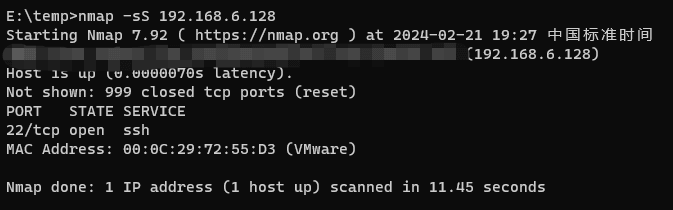](https://cdn.nlark.com/yuque/0/2024/png/21398751/1708515141546-543ca646-fa51-4d9d-8c9e-cd52fe4e118e.png#averageHue=%231a1a1a&clientId=u168205ed-a6b1-4&from=paste&height=140&id=u533c81bf&originHeight=210&originWidth=673&originalType=binary&ratio=1.5&rotation=0&showTitle=false&size=23852&status=done&style=none&taskId=u0762a7ac-9384-4ec8-b7d5-7c20a3c2148&title=&width=448.6666666666667)  
为了方便查看我们使用 wireshark，过滤攻击机 IP

> ip.src\_host == 192.168.6.1

[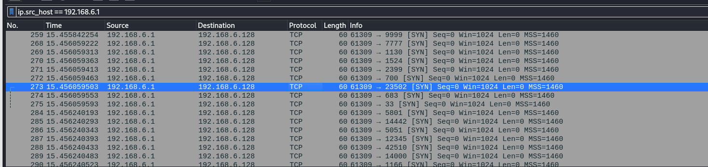](https://cdn.nlark.com/yuque/0/2024/png/21398751/1708515105937-759e0f66-c0b4-43a1-ad02-20c3c59cb56b.png#averageHue=%23e6e3df&clientId=u168205ed-a6b1-4&from=paste&height=231&id=uc57de225&originHeight=347&originWidth=1467&originalType=binary&ratio=1.5&rotation=0&showTitle=false&size=100377&status=done&style=none&taskId=u2f0773cf-b748-4bf1-bf16-9e2bfba5dbe&title=&width=978)  
很显然这里是不符合上面的规则 window:2048  
[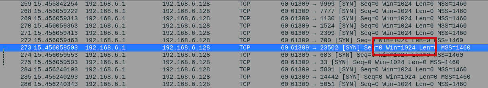](https://cdn.nlark.com/yuque/0/2024/png/21398751/1708515186833-5733dcdf-5c61-4ce7-ad8e-a2bc1f193cf8.png#averageHue=%238b919b&clientId=u168205ed-a6b1-4&from=paste&height=145&id=u3b0b481e&originHeight=217&originWidth=1197&originalType=binary&ratio=1.5&rotation=0&showTitle=false&size=68585&status=done&style=none&taskId=u3a9eea0e-0b6d-40f0-b06f-979c81c1328&title=&width=798)  
找到了它的姐妹规则 是有 window 1024 的

> alert tcp $EXTERNAL\_NET any -> $HOME\_NET any (msg:"ET SCAN NMAP -sS window 1024"; fragbits:!D; dsize:0; flags:S,12; ack:0; window:1024; threshold: type both, track by\_dst, count 1, seconds 60; reference:url,doc.emergingthreats.net/2009582; classtype:attempted-recon; sid:2009582; rev:3; metadata:created\_at 2010\_07\_30, updated\_at 2014\_03\_18;)
> 
> alert tcp $EXTERNAL\_NET any -> $HOME\_NET any (msg:"ET SCAN NMAP -sS window 3072"; fragbits:!D; dsize:0; flags:S,12; ack:0; window:3072; threshold: type both, track by\_dst, count 1, seconds 60; reference:url,doc.emergingthreats.net/2009583; classtype:attempted-recon; sid:2009583; rev:3; metadata:created\_at 2010\_07\_30, updated\_at 2014\_03\_18;)
> 
> alert tcp $EXTERNAL\_NET any -> $HOME\_NET any (msg:"ET SCAN NMAP -sS window 4096"; fragbits:!D; dsize:0; flags:S,12; ack:0; window:4096; threshold: type both, track by\_dst, count 1, seconds 60; reference:url,doc.emergingthreats.net/2009584; classtype:attempted-recon; sid:2009584; rev:2; metadata:created\_at 2010\_07\_30, updated\_at 2014\_03\_18;)

fragbits 不允许分段  
[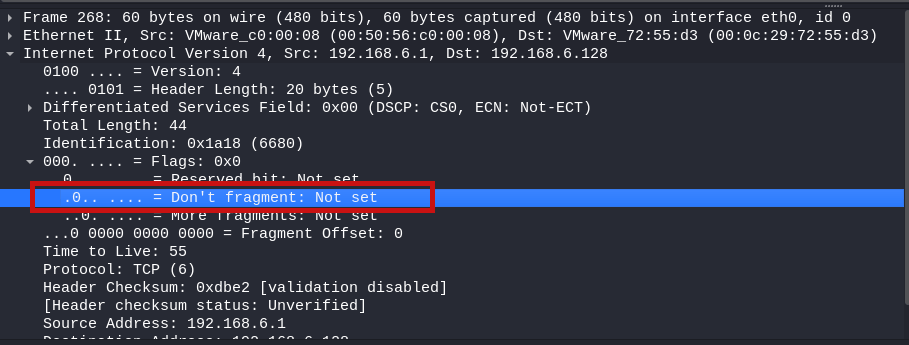](https://cdn.nlark.com/yuque/0/2024/png/21398751/1708515311698-54eeff28-2e60-4544-813c-86e2925267d3.png#averageHue=%232e3444&clientId=u168205ed-a6b1-4&from=paste&height=230&id=u8246747b&originHeight=345&originWidth=909&originalType=binary&ratio=1.5&rotation=0&showTitle=false&size=58286&status=done&style=none&taskId=u716502c2-601e-4673-9fee-10314b17255&title=&width=606)  
dsize 传输层 payload 大小为 0  
[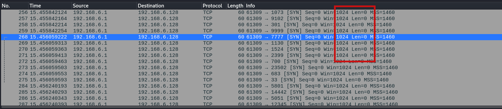](https://cdn.nlark.com/yuque/0/2024/png/21398751/1708515371817-f7c46a72-3fb4-414d-86e2-8550565c1ab8.png#averageHue=%23838890&clientId=u168205ed-a6b1-4&from=paste&height=213&id=u8c253c6a&originHeight=320&originWidth=1461&originalType=binary&ratio=1.5&rotation=0&showTitle=false&size=97301&status=done&style=none&taskId=ue9ba2b89-b604-474f-bef2-93f9caec0db&title=&width=974)  
flags:S,12 flags 位置设置了 SYN 位，忽略 CWR 和 ECE 位  
[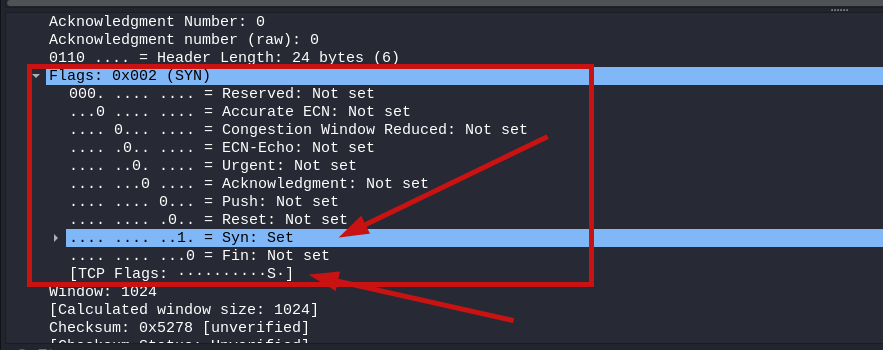](https://cdn.nlark.com/yuque/0/2024/png/21398751/1708515431922-636e947d-1442-4424-bb9c-703d0155c650.png#averageHue=%23343b4a&clientId=u168205ed-a6b1-4&from=paste&height=233&id=ua1546975&originHeight=350&originWidth=883&originalType=binary&ratio=1.5&rotation=0&showTitle=false&size=53915&status=done&style=none&taskId=u1f67fbbd-4ab0-4668-b1d4-6d567aae1d2&title=&width=588.6666666666666)  
ack:0 ack 位为 0  
[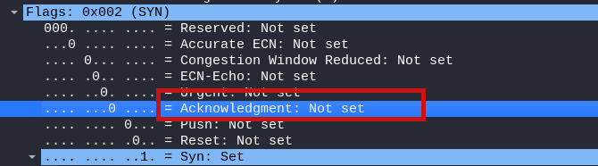](https://cdn.nlark.com/yuque/0/2024/png/21398751/1708515647825-82dfde85-57fa-4e24-9fbe-25b87830c3be.png#averageHue=%233d506f&clientId=u168205ed-a6b1-4&from=paste&height=124&id=u64a23242&originHeight=186&originWidth=670&originalType=binary&ratio=1.5&rotation=0&showTitle=false&size=23444&status=done&style=none&taskId=u9174aea7-4f1c-4819-9428-6625b44acf6&title=&width=446.6666666666667)  
threshold: type both, track by\_dst, count 1, seconds 60  
当满足条件时，在 60 秒内针对同一目的地 IP 地址只允许出现 1 次匹配，这条不会在 wireshark 里面看出来

### nmap -sA TCP ACK 扫描

[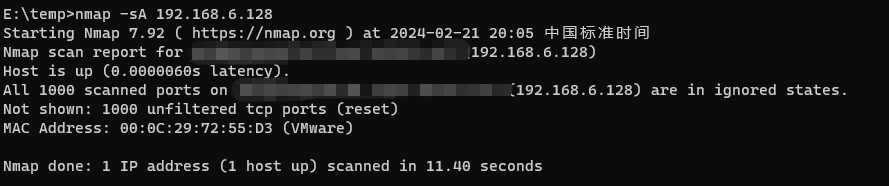](https://cdn.nlark.com/yuque/0/2024/png/21398751/1708517197991-8e68c4e1-a52b-499c-bae7-b8f6ad6f1147.png#averageHue=%231a1a1a&clientId=u168205ed-a6b1-4&from=paste&height=124&id=u5208b97b&originHeight=186&originWidth=889&originalType=binary&ratio=1.5&rotation=0&showTitle=false&size=26692&status=done&style=none&taskId=u7c43c166-0fbc-4fde-8808-04589692f5e&title=&width=592.6666666666666)

> alert tcp $EXTERNAL\_NET any -> $HOME\_NET any (msg:"ET SCAN NMAP -sA (1)"; fragbits:!D; dsize:0; flags:A,12; window:1024; threshold: type both, track by\_dst, count 1, seconds 60; reference:url,doc.emergingthreats.net/2000538; classtype:attempted-recon; sid:2000538; rev:8; metadata:created\_at 2010\_07\_30, updated\_at 2010\_07\_30;)

ACK 扫描最关键的当然是 flags:A,12  
[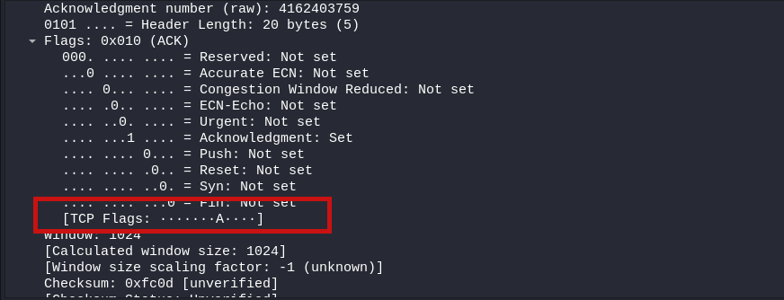](https://cdn.nlark.com/yuque/0/2024/png/21398751/1708517325852-0d5e2f12-3b09-4c54-8538-888a6b8e49a5.png#averageHue=%232c2f38&clientId=u168205ed-a6b1-4&from=paste&height=223&id=u1ed855c2&originHeight=334&originWidth=872&originalType=binary&ratio=1.5&rotation=0&showTitle=false&size=49179&status=done&style=none&taskId=ue03c32e3-f3a1-4a6c-8cda-cce4d350caf&title=&width=581.3333333333334)  
但是如果只是看 ACK 包又会有很多的误报，所以其他的规则我理解是为了降低误报，比如 window 1024，大多数情况下，TCP 数据包的大小是动态变化的

第二个 sA 扫描的规则也是类似，只是改变了数据包大小为 3072

> alert tcp $EXTERNAL\_NET any -> $HOME\_NET any (msg:"ET SCAN NMAP -sA (2)"; fragbits:!D; dsize:0; flags:A,12; window:3072; threshold: type both, track by\_dst, count 1, seconds 60; reference:url,doc.emergingthreats.net/2000540; classtype:attempted-recon; sid:2000540; rev:8; metadata:created\_at 2010\_07\_30, updated\_at 2010\_07\_30;)

### nmap User-Agent 检测

使用 nmap 的脚本对 IP 进行扫描  
[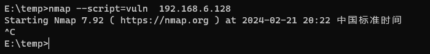](https://cdn.nlark.com/yuque/0/2024/png/21398751/1708518549710-64d67799-6e63-418e-a2ee-3081a07ec176.png#averageHue=%23161616&clientId=uc41b99e9-44be-4&from=paste&height=59&id=u7bb54d31&originHeight=88&originWidth=700&originalType=binary&ratio=1.5&rotation=0&showTitle=false&size=8770&status=done&style=none&taskId=ud0e66ead-c490-499a-9b22-c272f6a3c94&title=&width=466.6666666666667)

> alert tcp $EXTERNAL\_NET any -> $HOME\_NET $HTTP\_PORTS (msg:"ET SCAN Nmap Scripting Engine User-Agent Detected (Nmap Scripting Engine)"; flow:to\_server,established; content:"User-Agent|3a| Mozilla/5.0 (compatible|3b| Nmap Scripting Engine"; fast\_pattern:38,20; http\_header; nocase; reference:url,doc.emergingthreats.net/2009358; classtype:web-application-attack; sid:2009358; rev:5; metadata:created\_at 2010\_07\_30, updated\_at 2010\_11\_22;)

在规则里面的 |3a| 代表 ASCII 字符冒号，|3b|代表 ASCII 字符分号，所以 content 为

> User-Agent: Mozilla/5.0 (compatible; Nmap Scripting Engine

剩下的 fast\_pattern:38,20; http\_header; nocase; 这些选项组合在一起，用于指定在 HTTP 头部中进行快速、大小写不敏感的匹配检查。这样可以加快规则的匹配速度，并且更灵活地捕获目标内容  
[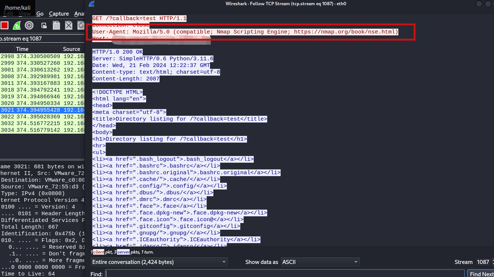](https://cdn.nlark.com/yuque/0/2024/png/21398751/1708518612580-ecb4e564-22da-4afb-967f-b308d317a56d.png#averageHue=%23434654&clientId=uc41b99e9-44be-4&from=paste&height=496&id=ua9d33e92&originHeight=744&originWidth=1322&originalType=binary&ratio=1.5&rotation=0&showTitle=false&size=200296&status=done&style=none&taskId=ued9fa36f-ca05-4098-8fa2-26f0246d424&title=&width=881.3333333333334)

### nmap SQL 注入扫描

> alert tcp $EXTERNAL\_NET any -> $HTTP\_SERVERS $HTTP\_PORTS (msg:"ET SCAN NMAP SQL Spider Scan"; flow:established,to\_server; content:"GET"; http\_method; content:" OR sqlspider"; http\_uri; reference:url,nmap.org/nsedoc/scripts/sql-injection.html; classtype:web-application-attack; sid:2013778; rev:1; metadata:created\_at 2011\_10\_19, updated\_at 2011\_10\_19;)

SQL 注入检测的关键位置是 uri 包含 " OR sqlspider"  
为什么要这么检测，需要从 nmap 的这个 SQL 脚本里面寻找答案 - [https://svn.nmap.org/nmap/scripts/http-sql-injection.nse](https://svn.nmap.org/nmap/scripts/http-sql-injection.nse)  
它会把参数的值修改为 ' OR sqlspider，用来触发 SQL 注入报错  
[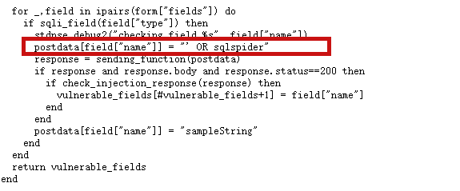](https://cdn.nlark.com/yuque/0/2024/png/21398751/1708519724247-34bda629-a656-41ed-bb85-5c4eae8f127d.png#averageHue=%23f2ecec&clientId=uc41b99e9-44be-4&from=paste&height=159&id=u5547f795&originHeight=239&originWidth=575&originalType=binary&ratio=1.5&rotation=0&showTitle=false&size=6178&status=done&style=none&taskId=uc9b20941-e9c2-4851-ac84-e8f56913e19&title=&width=383.3333333333333)  
具体怎么判断是否 SQL 注入报错，LUA 脚本使用了一个 check\_injection\_response 方法

```plain
local function check_injection_response(response)

  local body = string.lower(response.body)

  if not (response.status == 200 or response.status ~= 500) then
    return false
  end

  if errorstrings then
    for _,e in ipairs(errorstrings) do
      if string.find(body, e) then
        stdnse.debug2("error string matched: %s", e)
        return true
      end
    end
  end
  return false
end
```

对攻击后的页面进行字符串检测，默认的报错关键字列表为

```plain
errorstrings = {"invalid query", "sql syntax", "odbc drivers error"}
```

所以一切都说得通了

### nmap 操作系统探测

检测规则为

> alert udp $EXTERNAL\_NET 10000: -> $HOME\_NET 10000: (msg:"ET SCAN NMAP OS Detection Probe"; dsize:300; content:"CCCCCCCCCCCCCCCCCCCC"; fast\_pattern:only; content:"CCCCCCCCCCCCCCCCCCCCCCCCCCCCCCCCCCCCCCCCCCCCCCCCCCCCCCCCCCCCCCCCCCCCCCCCCCCCCCCCCCCCCCCCCCCCCCCCCCCCCCCCCCCCCCCCCCCCCCCCCCCCCCCCCCCCCCCCCCCCCCCCCCCCCCCCCCCCCCCCCCCCCCCCCCCCCCCCCCCCCCCCCCCCCCCCCCCCCCCCCCCCCCCCCCCCCCCCCCCCCCCCCCCCCCCCCCCCCCCCCCCCCCCCCCCCCCC"; depth:255; content:"CCCCCCCCCCCCCCCCCCCCCCCCCCCCCCCCCCCCCCCCCCCCC"; within:45; classtype:attempted-recon; sid:2018489; rev:3; metadata:created\_at 2014\_05\_21, updated\_at 2014\_05\_21;)

这里的规则需要 nmap 探测 OS 版本的时候触发  
[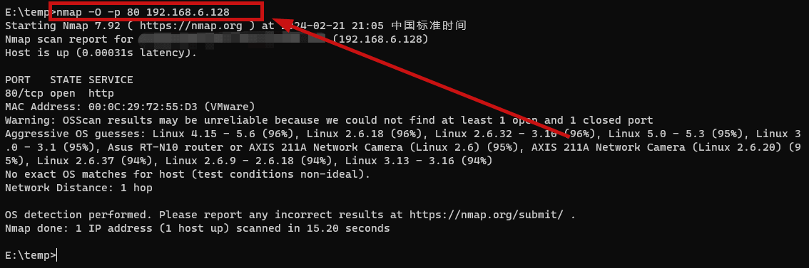](https://cdn.nlark.com/yuque/0/2024/png/21398751/1708520915512-c70e4616-54e5-4903-9d37-56eaab466f0f.png#averageHue=%23191717&clientId=uc41b99e9-44be-4&from=paste&height=251&id=uba6d50b7&originHeight=377&originWidth=1134&originalType=binary&ratio=1.5&rotation=0&showTitle=false&size=54868&status=done&style=none&taskId=uc7c6e791-c16c-4536-894c-157b7719ef1&title=&width=756)  
查看 wireshark，UDP 包对应的 Data 里面被填充为 C，这个特征很明显，并且很难误报  
[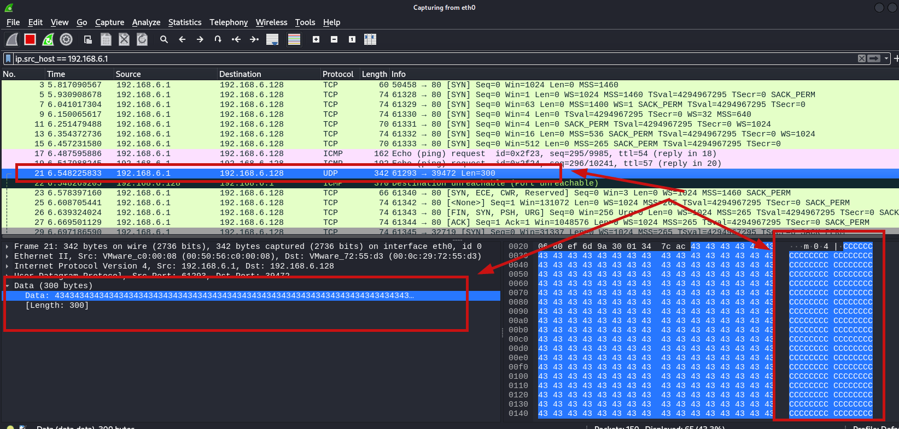](https://cdn.nlark.com/yuque/0/2024/png/21398751/1708520963426-853489a2-db6b-476d-bdf3-77af44436a3c.png#averageHue=%23314f81&clientId=uc41b99e9-44be-4&from=paste&height=524&id=u2fbeacdb&originHeight=786&originWidth=1644&originalType=binary&ratio=1.5&rotation=0&showTitle=false&size=217162&status=done&style=none&taskId=u96d04c96-20ea-4903-838c-5357da812f0&title=&width=1096)

## 小结

即便使用最新版本的 nmap，nmap 大部分扫描的特征还是会存在，想要绕过 IDS 的话就需要自行修改 nmap 源码，去除特征后自行编译

## 参考链接

-   [https://www.cnblogs.com/starrys/p/15257712.html](https://www.cnblogs.com/starrys/p/15257712.html)
-   [https://rce.moe/2022/11/06/portscantoolsanalyse/](https://rce.moe/2022/11/06/portscantoolsanalyse/)
-   [https://github.com/al0ne/Nmap\_Bypass\_IDS](https://github.com/al0ne/Nmap_Bypass_IDS)
-   [https://xz.aliyun.com/t/6002](https://xz.aliyun.com/t/6002)
-   [https://zhuanlan.zhihu.com/p/248625327](https://zhuanlan.zhihu.com/p/248625327)
-   [https://rules.emergingthreats.net/OPEN\_download\_instructions.html](https://rules.emergingthreats.net/OPEN_download_instructions.html)
-   [https://svn.nmap.org/nmap/scripts/http-sql-injection.nse](https://svn.nmap.org/nmap/scripts/http-sql-injection.nse)
-   [https://www.cnblogs.com/yuersan/p/15236326.html](https://www.cnblogs.com/yuersan/p/15236326.html)
-   [https://jax777.win/2019/08/18/nmap/](https://jax777.win/2019/08/18/nmap/)
