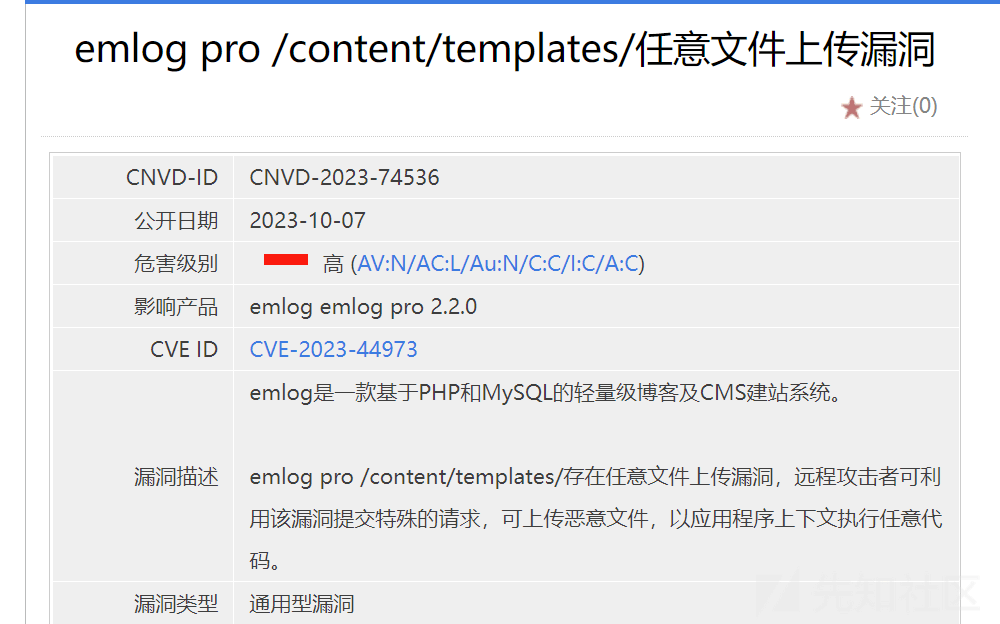
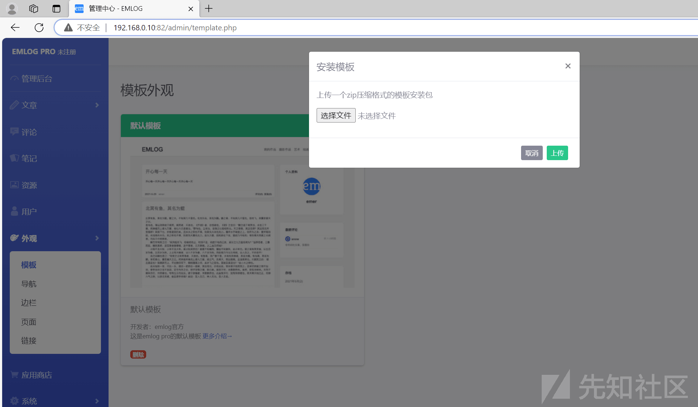
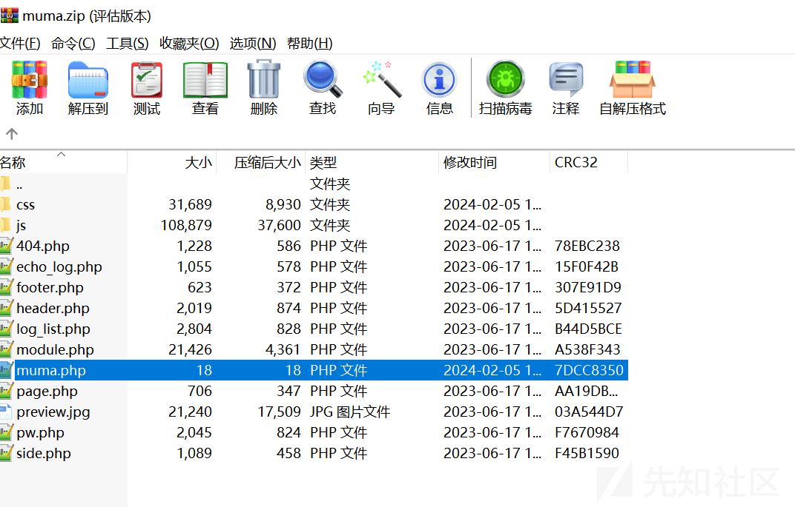
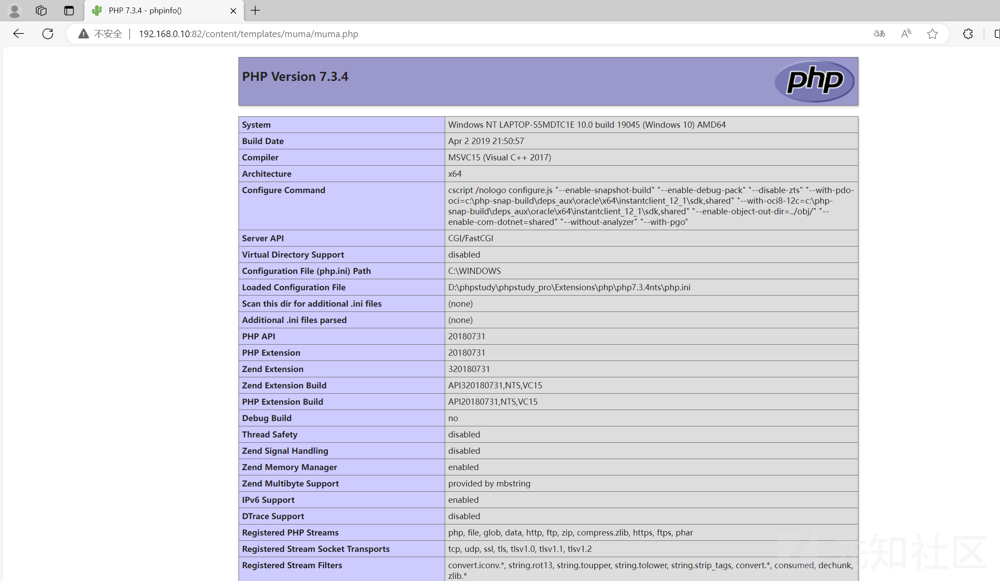
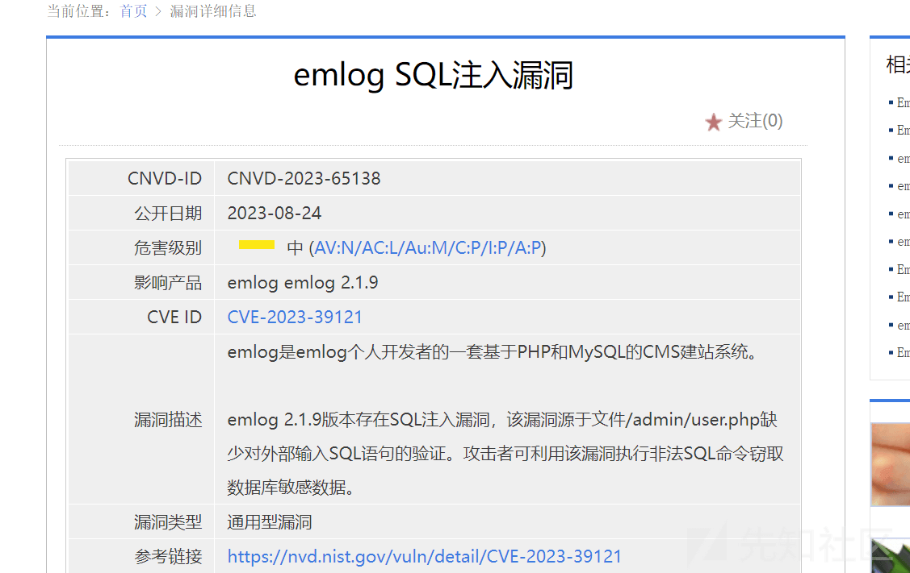
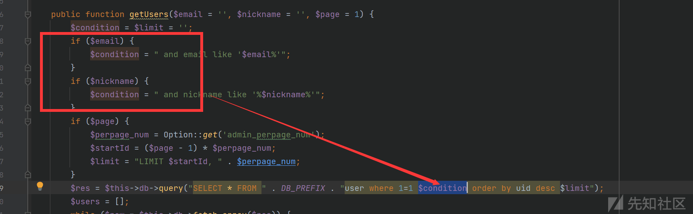
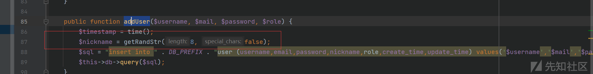
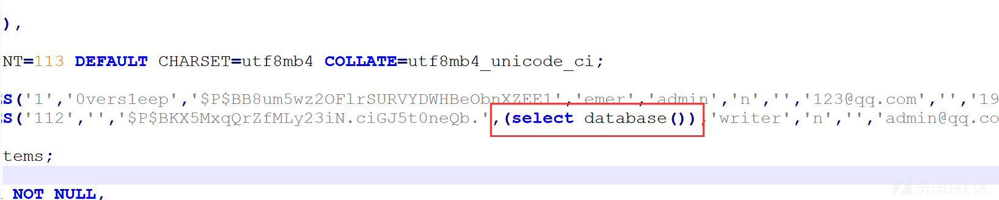
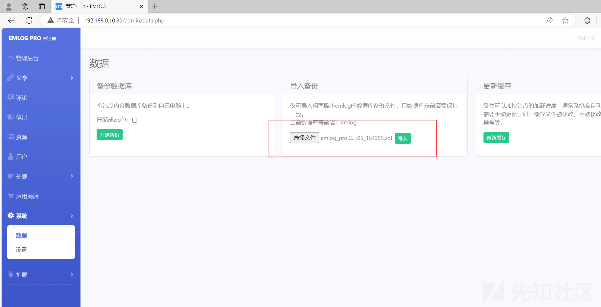
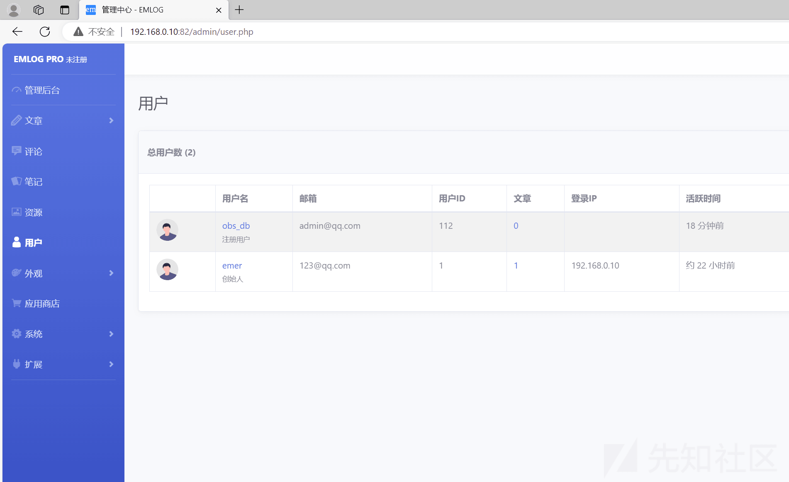

# php 代码审计-emlog 漏洞分析（1day 分析） - 先知社区

php 代码审计-emlog 漏洞分析（1day 分析）

- - -

## 0X00 前言

这是我的第一篇代码审计的文章，师傅们多多指点！！

官网：[https://www.emlog.net/](https://www.emlog.net/)  
version:emlog pro 2.1.9

## 0X01 文件上传漏洞（CVE-2023-44974）

#### 漏洞分析

[](https://xzfile.aliyuncs.com/media/upload/picture/20240204192249-ba5ccc82-c34f-1.png)  
根据漏洞情报，说明该漏洞出现在 /content/templates/ 目录下，实际上表达的意思应该是该漏洞存在于安装模块这里  
[](https://xzfile.aliyuncs.com/media/upload/picture/20240204204525-446ae5a2-c35b-1.png)  
通过关键字定位，我们定位到 admin/template.php 文件，寻找关于上传的代码段  
以下就是关于上传的代码段

```plain
if ($action === 'upload_zip') {
    LoginAuth::checkToken();
    $zipfile = isset($_FILES['tplzip']) ? $_FILES['tplzip'] : '';

    if ($zipfile['error'] == 4) {
        emDirect("./template.php?error_d=1");
    }
    if ($zipfile['error'] == 1) {
        emDirect("./template.php?error_f=1");
    }
    if (!$zipfile || $zipfile['error'] > 0 || empty($zipfile['tmp_name'])) {
        emMsg('模板上传失败， 错误码：' . $zipfile['error']);
    }
    if (getFileSuffix($zipfile['name']) != 'zip') {
        emDirect("./template.php?error_a=1");
    }

    $ret = emUnZip($zipfile['tmp_name'], '../content/templates/', 'tpl');
    switch ($ret) {
        case 0:
            emDirect("./template.php?activate_install=1");
            break;
        case -2:
            emDirect("./template.php?error_e=1");
            break;
        case 1:
        case 2:
            emDirect("./template.php?error_b=1");
            break;
        case 3:
            emDirect("./template.php?error_c=1");
            break;
    }
}
```

当**action**为**upload\_zip**时，执行**if**后面的语句，**LoginAuth::checkToken();**是用来检测登录状态的。**$zipfile**用来接收**tplzip**上传上来的数据，然后对上传的数据进行各种错误判断，判断成功后，执行下面的**emUnZip**函数进行解压，并把解压后的文件放到/content/templates/目录下，我们在追踪一下**emUnZip**函数看看是否有过滤等情况

```plain
function emUnZip($zipfile, $path, $type = 'tpl') {
    if (!class_exists('ZipArchive', FALSE)) {
        return 3;//zip 模块问题
    }
    $zip = new ZipArchive();
    if (@$zip->open($zipfile) !== TRUE) {
        return 2;//文件权限问题
    }
    $r = explode('/', $zip->getNameIndex(0), 2);
    $dir = isset($r[0]) ? $r[0] . '/' : '';
    switch ($type) {
        case 'tpl':
            $re = $zip->getFromName($dir . 'header.php');
            if (false === $re) {
                return -2;
            }
            break;
        case 'plugin':
            $plugin_name = substr($dir, 0, -1);
            $re = $zip->getFromName($dir . $plugin_name . '.php');
            if (false === $re) {
                return -1;
            }
            break;
        case 'backup':
            $sql_name = substr($dir, 0, -1);
            if (getFileSuffix($sql_name) != 'sql') {
                return -3;
            }
            break;
        case 'update':
            break;
    }
    if (true === @$zip->extractTo($path)) {
        $zip->close();
        return 0;
    }

    return 1; //文件权限问题
}
```

我们不难看出**emUnZip**函数只是核对压缩包里的文件名称，压缩包和压缩包里的文件名必须相同，并没有进行过滤等操作，于是我们构造一个恶意的文件模板

#### 利用过程

制作过程：将源码自带的模板里插入一个恶意文件 muma.php  
最终效果  
[](https://xzfile.aliyuncs.com/media/upload/picture/20240205123225-8fbce6d4-c3df-1.png)  
查看结果  
[](https://xzfile.aliyuncs.com/media/upload/picture/20240205123246-9cbe5aca-c3df-1.png)  
成功触发漏洞

## 0X02 sql 注入漏洞（CVE-2023-39121）

#### 漏洞分析

[](https://xzfile.aliyuncs.com/media/upload/picture/20240205123542-0582d202-c3e0-1.png)  
也是根据漏洞情报，说明该漏洞出现在 /admin/user.php 目录下，我们进行分析  
挖 sql 注入最重要的就是抓住**可控变量**，在通篇看了 user.php 文件后，似乎并没有可控的变量  
于是我在追踪他用到的各类函数  
[](https://xzfile.aliyuncs.com/media/upload/picture/20240205162213-aa69b9ba-c3ff-1.png)  
在$email 和$nickname 不为空的时候是可以控制的，于是添加用户发现，用户名不可在添加时控制，他是随机生成 8 位的随机字符串（如下图所示），于是想办法看看如何控制用户名。  
[](https://xzfile.aliyuncs.com/media/upload/picture/20240205163804-e12d2728-c401-1.png)  
于是在功能点上找到了，上传数据库备份的功能，我们可以直接在数据库中进行更改用户名的方式插入 payload

#### 利用过程

于是直接套用他现成的模板，将用户名的值改为 payload  
[](https://xzfile.aliyuncs.com/media/upload/picture/20240205165215-dc62d38a-c403-1.png)  
上传数据库备份，进行导入  
[](https://xzfile.aliyuncs.com/media/upload/picture/20240205164610-029af088-c403-1.png)  
查看结果  
[](https://xzfile.aliyuncs.com/media/upload/picture/20240205165238-ea3cd442-c403-1.png)  
复现完成
