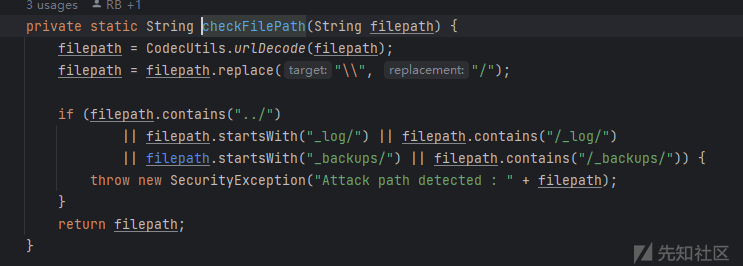
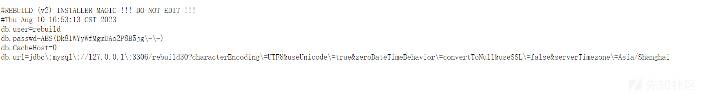
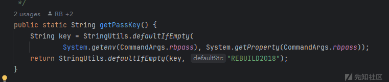
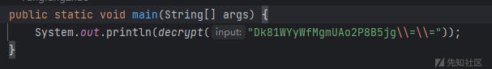
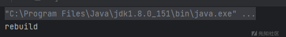
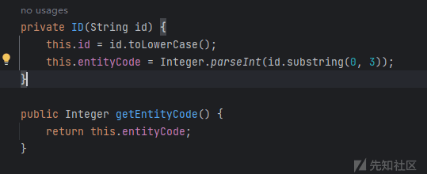
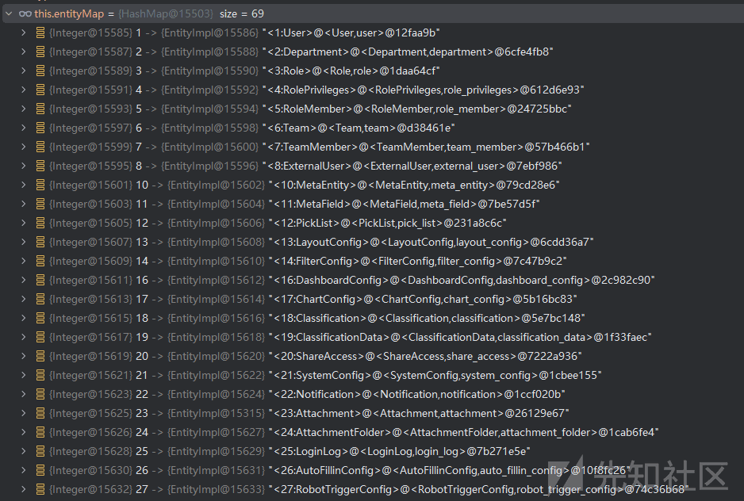
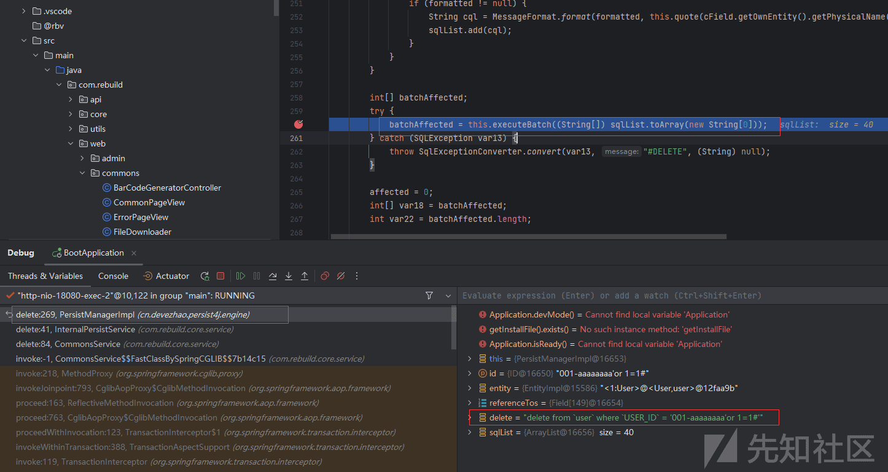

# rebuild 代码审计 - 先知社区

rebuild 代码审计

- - -

注：以下漏洞测试在 rebuild 历史版本，且都已提交 CNNVD 并通过

## 鉴权分析

com.rebuild.web.RebuildWebInterceptor#preHandle

```plain
if (!Application.isReady()) {  
            final boolean isError = requestUri.endsWith("/error") || requestUri.contains("/error/");  
​  
            // 已安装  
            if (checkInstalled()) {  
                log.error("Server Unavailable : " + requestEntry);  
​  
                if (isError) {  
                    return true;  
                } else {  
                    sendRedirect(response, "/error/server-status", null);  
                    return false;  
                }  
            }  
            // 未安装  
            else if (!(requestUri.contains("/setup/") || requestUri.contains("/commons/theme/") || isError)) {  
                sendRedirect(response, "/setup/install", null);  
                return false;  
            } else {  
                return true;  
            }  
        }
```

首先会有一个安装文件

-   安装文件位置 ～/.rebuild/.rebuild

com.rebuild.core.support.setup.InstallState#checkInstalled进行检查

```plain
default boolean checkInstalled() {  
        return Application.devMode() || getInstallFile().exists();  
    }
```

前面的选项通过配置检查是否 dev 环境，默认不是，后面检查.rebuild 文件是否存在，所以如果存在任意文件删除，删除掉.rebuild 文件就会存在 jdbc attack

在接下去看没有授权信息时的处理

```plain
} else if (!isIgnoreAuth(requestUri)) {  
            // 独立验证逻辑  
            if (requestUri.contains("/filex/")) return true;  
​  
            log.warn("Unauthorized access {}", RebuildWebConfigurer.getRequestUrls(request));  
​  
            if (isHtmlRequest(requestUri, request)) {  
                sendRedirect(response, "/user/login", requestEntry.getRequestUriWithQuery());  
            } else {  
                response.sendError(HttpStatus.UNAUTHORIZED.value());  
            }  
​  
            return false;  
        } else {  
            skipCheckSafeUse = true;  
        }
```

看 com.rebuild.web.RebuildWebInterceptor#isIgnoreAuth

```plain
private boolean isIgnoreAuth(String requestUri) {  
        if (requestUri.contains("/user/") && !requestUri.contains("/user/admin")) {  
            return true;  
        }  
​  
        requestUri = requestUri.replaceFirst(AppUtils.getContextPath(), "");  
​  
        return requestUri.length() < 3  
                || requestUri.endsWith("/error") || requestUri.contains("/error/")  
                || requestUri.endsWith("/logout")  
                || requestUri.startsWith("/f/")  
                || requestUri.startsWith("/s/")  
                || requestUri.startsWith("/gw/")  
                || requestUri.startsWith("/setup/")  
                || requestUri.startsWith("/language/")  
                || requestUri.startsWith("/filex/access/")  
                || requestUri.startsWith("/filex/download/")  
                || requestUri.startsWith("/filex/img/")  
                || requestUri.startsWith("/commons/announcements")  
                || requestUri.startsWith("/commons/url-safe")  
                || requestUri.startsWith("/commons/barcode/render")  
                || requestUri.startsWith("/commons/theme/")  
                || requestUri.startsWith("/account/user-avatar/")  
                || requestUri.startsWith("/rbmob/env");  
    }
```

当返回为 ture 时不需要授权 也就是

-   1：满足 isIgnoreAuth 函数 return 中任意条件可以跳过授权
-   2：url 中存在/user/但不存在/user/admin
-   3：url 中包含/filex/

注：且 controller 函数体中不能存在 getRequestUser  
根据以上代码获取到未授权接口再进行测试，发现以下未授权漏洞

## 未授权敏感信息泄露

### 代码分析

漏洞点：com.rebuild.web.commons.FileDownloader#readRaw

```plain
@GetMapping(value = "read-raw")  
    public void readRaw(HttpServletRequest request, HttpServletResponse response) throws IOException {  
        String filePath = getParameterNotNull(request, "url");  
        boolean fullUrl = CommonsUtils.isExternalUrl(filePath);  
        final String charset = getParameter(request, "charset", AppUtils.UTF8);  
        final int cut = getIntParameter(request, "cut");  // MB  
​  
        String content;  
        if (QiniuCloud.instance().available()) {  
            FileInfo fi = QiniuCloud.instance().stat(filePath);  
            if (fi == null) {  
                content = "ERROR:FILE_NOT_EXISTS";  
            } else if (cut > 0 && fi.fsize / 1024 / 1024 > cut) {  
                content = "ERROR:FILE_TOO_LARGE";  
            } else {  
                String privateUrl = fullUrl ? filePath : QiniuCloud.instance().makeUrl(filePath);  
                content = OkHttpUtils.get(privateUrl, null, charset);  
            }  
​  
        } else {  
            if (fullUrl) {  
                String e = filePath.split("\\?e=")[1];  
                RbAssert.is(checkEsign(e), "Unauthorized access");  
                filePath = filePath.split("/filex/access/")[1].split("\\?")[0];  
            }  
​  
            // Local storage  
            filePath = checkFilePath(filePath);  
            File file = RebuildConfiguration.getFileOfData(filePath);  
​  
            if (!file.exists()) {  
                content = "ERROR:FILE_NOT_EXISTS";  
            } else if (cut > 0 && FileUtils.sizeOf(file) / 1024 / 1024 > cut) {  
                content = "ERROR:FILE_TOO_LARGE";  
            } else {  
                content = FileUtils.readFileToString(file, charset);  
            }  
        }  
​  
        ServletUtils.write(response, content);  
    }
```

#### 存在限制条件

限制了目录穿越和一些目录：com.rebuild.web.commons.FileDownloader#checkFilePath

[](https://xzfile.aliyuncs.com/media/upload/picture/20240129105315-8c6d30ee-be51-1.png)

但是能够直接读取.rebuild 中的环境变量

[](https://xzfile.aliyuncs.com/media/upload/picture/20240129105324-921099dc-be51-1.png)

其中数据库密码由 aes 加密，当开发者未指定配置 aeskey 时

com.rebuild.utils.AES#getPassKey使用默认key：REBUILD2018

[](https://xzfile.aliyuncs.com/media/upload/picture/20240129105331-96415794-be51-1.png)

可以用com.rebuild.utils.AES#main进行解密

[](https://xzfile.aliyuncs.com/media/upload/picture/20240129105338-9a4ba92a-be51-1.png)

得到解密结果

[](https://xzfile.aliyuncs.com/media/upload/picture/20240129105344-9d96c5a6-be51-1.png)

也就是未授权限制性文件读取->未授权的敏感信息获取

## 未授权 sql 注入

### 代码分析

漏洞点：com.rebuild.web.commons.FileShareController#delShareFile

```plain
@PostMapping("/filex/del-make-share")  
public RespBody delShareFile(@IdParam ID shortId) {  
    Application.getCommonsService().delete(shortId, false);  
    return RespBody.ok();  
}
```

#### 存在限制条件

将 payload 分为三部分

1：实体 id3 位，需要为 int 类型且真实存在才不会走到异常（这里可以使用爆破 001-999）即可探测  
2：-符号 1 位  
3：字符串 16 位，因为限制了整个 payload 为 20 位，所以可以操作的字符串只有 16 位

其中 2,3 部分的限制逻辑在：cn.devezhao.persist4j.engine.ID#isId

```plain
public static boolean isId(Object id) {  
        if (id instanceof ID) {  
            return true;  
        } else if (id != null && !StringUtils.isEmpty(id.toString()) && id.toString().length() == idLength) {  
            return id.toString().charAt(3) == '-';  
        } else {  
            return false;  
        }  
    }
```

idLength 默认为 20

1 部分的限制逻辑有两处

第一处在：cn.devezhao.persist4j.engine.ID#valueOf

```plain
public static ID valueOf(String id) {  
        if (!isId(id)) {  
            throw new IllegalArgumentException("Invaild id character: " + id);  
        } else {  
            return new ID(id);  
        }  
    }
```

限制了 id 类型

第二处在：com.rebuild.core.service.CommonsService#tryIfHasPrivileges

```plain
private void tryIfHasPrivileges(Object idOrRecord) throws PrivilegesException {  
        Entity entity;  
        if (idOrRecord instanceof ID) {  
            entity = MetadataHelper.getEntity(((ID) idOrRecord).getEntityCode());  
        } else if (idOrRecord instanceof Record) {  
            entity = ((Record) idOrRecord).getEntity();  
        } else {  
            throw new RebuildException("Invalid argument [idOrRecord] : " + idOrRecord);  
        }  
​  
        // 验证主实体  
        if (entity.getMainEntity() != null) {  
            entity = entity.getMainEntity();  
        }  
​  
        if (MetadataHelper.hasPrivilegesField(entity)) {  
            throw new PrivilegesException("Privileges/Business entity cannot use this class (methods) : " + entity.getName());  
        }  
    }
```

getEntityCode 就是获取前三位实体 id

[](https://xzfile.aliyuncs.com/media/upload/picture/20240129105358-a672e966-be51-1.png)

然后步入 com.rebuild.core.metadata.MetadataHelper#getEntity(int)

```plain
public static Entity getEntity(int entityCode) throws MissingMetaExcetion {  
        try {  
            return getMetadataFactory().getEntity(entityCode);  
        } catch (MissingMetaExcetion ex) {  
            throw new MissingMetaExcetion(Language.L("实体 [%s] 已经不存在，请检查配置", entityCode));  
        }  
    }
```

如果实体不存在就会走入异常

在运行过程中其实在存在很多实体，所以使用低位实体 id 都是可以成功

[](https://xzfile.aliyuncs.com/media/upload/picture/20240129105406-aad70afa-be51-1.png)

根据以上代码分析结果，虽然存在长度限制，但是因为是 delete 操作，依旧可以用恶意 payload 导致拒绝服务

-   id=001-aaaaaaaa'or+1=1%23

[](https://xzfile.aliyuncs.com/media/upload/picture/20240129105413-af36b50a-be51-1.png)
