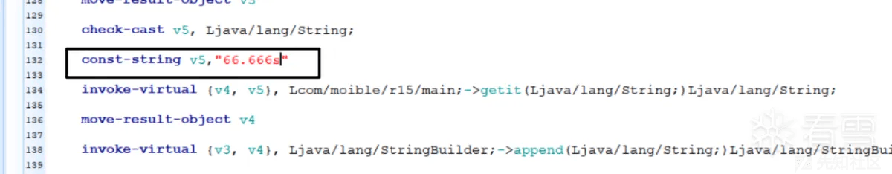

# smali 修改+log 动态插桩在 Android 中的应用 - 先知社区

smali 修改+log 动态插桩在 Android 中的应用

- - -

非首发 - 作者本人

由一道 ctf 题目来学习一下这项基本的技术。  
本次题目来自 NSSCTF-2nd  
想到了可以用 smali 修改来做，顺带记录了一下（两种方法）  
smali 日志打印本质在于打印输出关键信息，先介绍一下 smali 语法

# smali 学习

Smali 是一种基于 Java 语法的反汇编语言，用于描述 Android 应用程序的 Dalvik 虚拟机指令集。它可以被用来反编译已安装在 Android 设备上的应用程序，或者对 APK（Android 安装包）文件进行静态分析。

Smali 代码是一种基于文本的格式，它将 Dalvik 指令和 Java 代码结合起来，以可读的方式表示 Android 应用程序的类、方法、字段等信息。Smali 代码使用了逆波兰表示法（Reverse Polish Notation）来表示指令和操作数。

以下是一个简单的 Smali 代码示例，展示了一个计算两个整数之和的方法：

```plain
.class public HelloWorld
.super Ljava/lang/Object;

.method public static add(II)I
    .registers 3

    add-int/2addr v0, v1   ; 将v0和v1相加，并将结果保存在v0中
    return v0              ; 返回结果
.end method
```

上述代码定义了一个名为 HelloWorld 的公共类，其中包含一个名为 add 的静态方法。该方法接受两个整数参数，并返回它们的和。在方法体中，使用了指令 add-int/2addr 将两个寄存器中的值相加，并将结果保存在第一个寄存器中，然后使用 return 指令将结果返回。  
通过编写和阅读 Smali 代码，可以深入了解 Android 应用程序的内部结构和运行机制，并进行诸如应用逆向工程、代码分析和修改等操作。

# Android 的 debuggable 属性

在 Android 开发中，debuggable 是一个应用程序清单文件（AndroidManifest.xml）中的属性，用于控制应用程序是否可以进行调试。

当将 debuggable 属性设置为 true 时，应用程序将允许使用调试器进行调试，包括在开发环境中使用 Android Studio 进行断点调试、查看变量值和执行步骤等操作。

以下是一个示例的应用程序清单文件（AndroidManifest.xml），展示了如何设置 debuggable 属性：

```plain
<manifest xmlns:android="http://schemas.android.com/apk/res/android"
    package="com.example.myapp">

    <application
        android:debuggable="true"
        ...>
        ...
    </application>
</manifest>
```

需要注意的是，将 debuggable 属性设置为 true 可能会增加应用程序的安全风险  
一般开发的 app 设置为 false

# log 日志插桩技术

Log 插桩指的是反编译 APK 文件，在对应的 smali 文件里添加相应的 smali 代码，将程序中的关键信息，以 log 日志的形式进行输出。  
我们要注意参数问题

[](https://xzfile.aliyuncs.com/media/upload/picture/20240130150956-92cb2b1a-bf3e-1.png)  
然后使用 Android killer 插件来插入

[](https://xzfile.aliyuncs.com/media/upload/picture/20240130151023-a288e1a0-bf3e-1.png)  
使用 ddms 工具即可看到回显：

[](https://xzfile.aliyuncs.com/media/upload/picture/20240130151058-b77945aa-bf3e-1.png)  
一定要注意插入过程中的寄存器问题哦  
下面开始实现

# 1、samli 修改跳转 + 赋值

app 自己开了 debug

[](https://xzfile.aliyuncs.com/media/upload/picture/20240129142435-126ffa60-be6f-1.png)  
使用 aapt 获得启动包名

[](https://xzfile.aliyuncs.com/media/upload/picture/20240129142534-35a15358-be6f-1.png)

smali 修改，调用目标函数直接传参数

[](https://xzfile.aliyuncs.com/media/upload/picture/20240129142641-5d56112c-be6f-1.png)

[](https://xzfile.aliyuncs.com/media/upload/picture/20240129142702-69e6d520-be6f-1.png)

我的 Android killer 有点小问题，只能结合 jdax 来进行定位分析

[](https://xzfile.aliyuncs.com/media/upload/picture/20240129142736-7e1ff210-be6f-1.png)  
Android killer 上手修改

[](https://xzfile.aliyuncs.com/media/upload/picture/20240129142752-87d5025a-be6f-1.png)

```plain
if-ne  v1,v2  ;v1!=v2 则跳转
if-eq  v1,v2  ;v1==v2 则跳转
```

改为相反条件即可

[](https://xzfile.aliyuncs.com/media/upload/picture/20240129142829-9e27f350-be6f-1.png)  
将 v5 赋值为对应的值

[](https://xzfile.aliyuncs.com/media/upload/picture/20240129142842-a5b7dffe-be6f-1.png)

Android killer 保存编译

[](https://xzfile.aliyuncs.com/media/upload/picture/20240129142905-b33a0a3a-be6f-1.png)

flag：  
NSSCTF{1a74ee530fafa690dcddd0ce38260755}

# 2、smali 动态插桩

前面的准备工作都是一样的

（动态插桩的做法在这道题，显得比较鸡肋，但是顺带练习一下哈哈哈）

在某些题目，动态插桩的做法会输出很多重要的值，帮助我们来进行分析  
前面的修改不要动  
动态插桩的模板：  
（注意：v0 在原 samli 中可能会被用到，此时 v0 要替换为任意一个非重要寄存器，本题的 v0 在后面用到了，因此我替换为 v4）

```plain
move-result-object v6   #v6 是某个重要的值，需要我们来输出的值

const-string v0,"自定义："  #v0 自定义标签值，方便我们观察

invoke-static {v0,v6}, Landroid/util/Log;->d(Ljava/lang/String;Ljava/lang/String;)I #传入对应的值（string 类型）

move-result v0  #调用即可
```

不报错的动态插桩 smali 代码

```plain
const-string v4, "myobject_soso:" 

invoke-static {v4,v3}, Landroid/util/Log;->d(Ljava/lang/String;Ljava/lang/String;)I

move-result v4
```

然后在 logcat 里面查看输出

```plain
adb logcat | find "myobject_soso:"
```

[](https://xzfile.aliyuncs.com/media/upload/picture/20240129143101-f89101d8-be6f-1.png)  
分享结束~！
