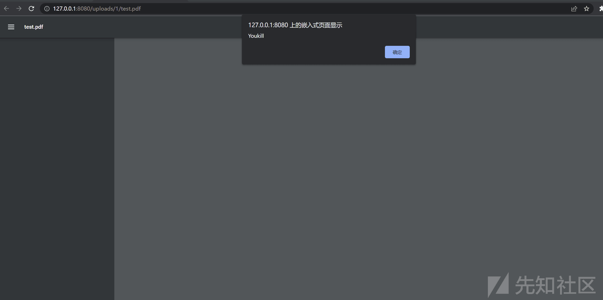

# ujcms-8.0.2 任意文件上传漏洞 (CVE-2023-51806) - 先知社区

ujcms-8.0.2 任意文件上传漏洞 (CVE-2023-51806)

- - -

## 前言

### 前沿知识

关于 xss 漏洞，它的本质其实就是执行了 javascript 里面的 js 代码，而简单的 wps 是没有携带转 pdf 的，但我们可以通过脚本的方式对 pdf 添加 javascript 代码并且可使用。  
首先，（Acrobat）JavaScript 工作的主要条件是使用的 PDF 查看器实现了（Acrobat）JavaScript（至少是表单中使用的对象、属性和方法)

#### xss 漏洞

跨站脚本攻击 XSS 通过将恶意得 Script 代码注入到 Web 页面中，当用户浏览该页之时，嵌入其中 Web 里面的 Script 代码会被执行，从而达到恶意攻击用户的目的。  
可以理解为网站的注入攻击，将恶意脚本注入到网页，别的用户访问时，浏览器就会对网页进行解析执行，达到攻击网站的其它访问者。  
XSS 主要基于 JavaScript 完成恶意的攻击行为，由于 JS 可以非常灵活地操作 html、css 和浏览器。  
所以 XSS 漏洞的攻击对象并不是网站，，而是访问网站的用户。

## 漏洞描述

Ujcms v.8.0.2 存在文件上传漏洞，本地攻击者可以通过精心制作的文件执行任意代码。

## 影响版本

Ujcms v.8.0.2

## 漏洞成因

没有对其过滤用户上传的 PDF 文件，判断其中是否存有 js 代码  
[](https://xzfile.aliyuncs.com/media/upload/picture/20240125114721-719a8084-bb34-1.png)  
这一段是对其进行文件上传部分，没有对其 pdf 进行验证

## 代码分析

先进行到这里  
[](https://xzfile.aliyuncs.com/media/upload/picture/20240125114751-83d388ae-bb34-1.png)  
checkFilesManagementEnabled()：检查文件管理是否启用，可能是一个预处理步骤，确保文件管理功能处于正确的状态。  
String name = FilenameUtils.getName(params.id);：从参数中获取文件 ID，并使用 FilenameUtils 工具类获取文件名。  
checkId(params.id);：检查文件 ID，可能是确保文件 ID 的有效性的检查。  
checkName(name, params.name);：检查文件名，可能是确保文件名的有效性的检查。  
FileHandler fileHandler = storage.getFileHandler(pathResolver);：从给定的存储配置中获取文件处理器（FileHandler），  
if (StringUtils.equalsAny(FilenameUtils.getExtension(params.id), TEXT\_EXTENSIONS))：检查文件扩展名是否与预定义的文本文件扩展名匹配。如果是文本文件，则执行下一步，但这一步没有进行检验  
fileHandler.store(params.id, params.text);：如果是文本文件，则将文件内容存储到文件处理器中。  
if (!StringUtils.equals(name, params.name))：检查文件名是否需要修改。  
fileHandler.rename(params.id, params.name);：如果文件名需要修改，则将文件重命名为新的文件名。  
[](https://xzfile.aliyuncs.com/media/upload/picture/20240125123322-df966af2-bb3a-1.png)

中级有一个检查文件名的地方

[](https://xzfile.aliyuncs.com/media/upload/picture/20240125124329-49121f98-bb3c-1.png)  
先是检查的是斜杠一类和点

[](https://xzfile.aliyuncs.com/media/upload/picture/20240125124703-c8b92e44-bb3c-1.png)

[](https://xzfile.aliyuncs.com/media/upload/picture/20240125124820-f6e6ea68-bb3c-1.png)  
这是先获取长度，判断是否为空

这里就没有对其内容进行验证

## 漏洞的利用

[](https://xzfile.aliyuncs.com/media/upload/picture/20240125170224-74d234f0-bb60-1.png)

[](https://xzfile.aliyuncs.com/media/upload/picture/20240125170505-d4c3f452-bb60-1.png)

[](https://xzfile.aliyuncs.com/media/upload/picture/20240125170605-f8aa607c-bb60-1.png)  
点击预览，然后发给朋友或者谁打开

[](https://xzfile.aliyuncs.com/media/upload/picture/20240125170716-229714b6-bb61-1.png)

## 文件上传中的 pdf 的生成

使用 PyPDF2 库  
pip install PyPDF2

下面只是基础的 xss 的形成，具体按需求修改

```plain
from   PyPDF2   import   PdfReader,   PdfWriter
output_pdf   =   PdfWriter()
page   =   output_pdf.add_blank_page(width=72,   height=72)
output_pdf.add_js("app.alert('Youkill');")
with   open("xss.pdf",   "wb")   as   f:
            output_pdf.write(f)
```

#### 仅学习使用
