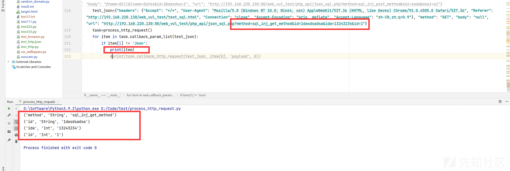
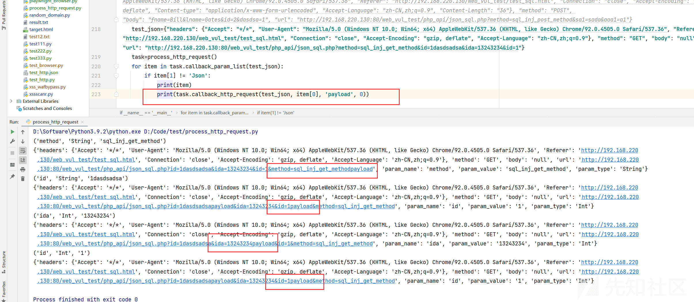
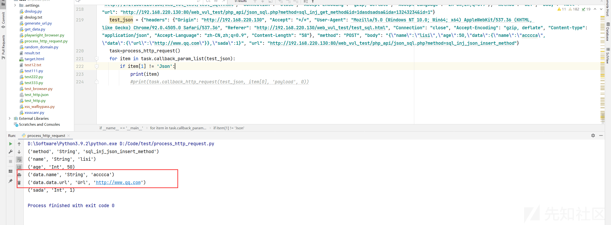
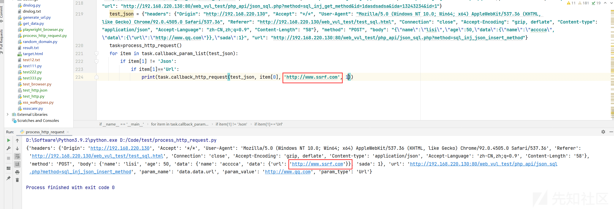
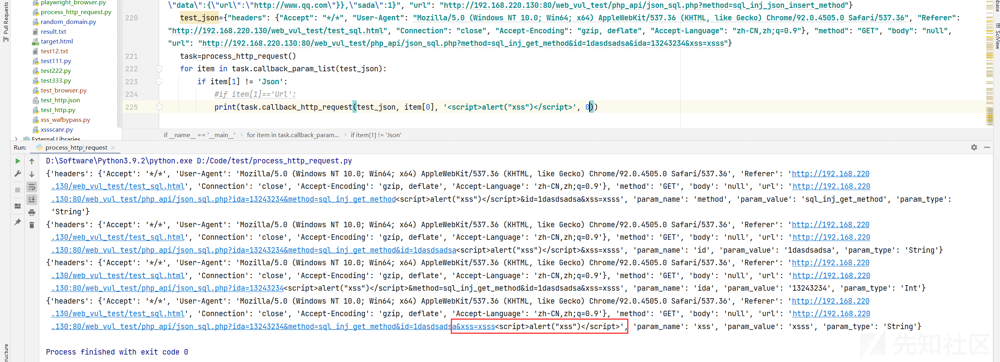

# # web 漏洞测试工具研发-http/s 请求包处理 - 先知社区

\# web 漏洞测试工具研发-http/s 请求包处理

- - -

*自动化躺赚系列 02* 以后可能还有，哈哈哈。

自动化躺赚系列 01 业务漏洞挖掘笔记 [https://xz.aliyun.com/t/9028](https://xz.aliyun.com/t/9028)

## 1.自动黑盒漏洞检测思路

黑盒测试，也就是盲测 http 请求，进行漏洞挖掘，如检测挖掘 XSS\\SQL\\SSRF\\命令执行\\代码执行 甚至于越权之类漏洞，此类漏洞都属于，代码/命令 拼接时不严谨出现的问题。

```plain
如挖 sql 注入，'"   如 xss '"><script>, 如 ssrf，替换请求参数值为 url 链接的请求，命令执行 代码执行依次...
```

在黑盒挖掘它们时的操作规律为在参数值后面“追加/替换/值前追加" payload 等操作，既然发现此规律，我们就可以依此规律分析后，进行编程，做出一个减少重复操作和降低人工操作成本小工具。

## 2.功能分析

所需知识技能，Python PHP HTML JavaScript 语言 Http 协议之类，和一些常见漏洞的理解 XSS\\SQL\\SSRF\\RCE 之类。

如上所说，在黑盒挖掘漏洞时的操作规律为在参数值后面“追加/替换/值前追加" payload 等操作，如：

原 URL [http://192.168.220.130:80/web\_vul\_test/php\_api/json\_sql.php?id=111](http://192.168.220.130/web_vul_test/php_api/json_sql.php?id=111)

[http://192.168.220.130:80/web\_vul\_test/php\_api/json\_sql.php?as&fds=111payload](http://192.168.220.130/web_vul_test/php_api/json_sql.php?as&fds=111payload) 为追加

[http://192.168.220.130:80/web\_vul\_test/php\_api/json\_sql.php?as&fds=payload](http://192.168.220.130/web_vul_test/php_api/json_sql.php?as&fds=payload) 为替换

[http://192.168.220.130:80/web\_vul\_test/php\_api/json\_sql.php?as&fds=payload111](http://192.168.220.130/web_vul_test/php_api/json_sql.php?as&fds=payload111) 值前追加

这三类操作就能覆盖大部分黑盒测试场景。

在 HTTP 请求时，大概有 8 种请求方式

1、OPTIONS

返回服务器针对特定资源所支持的 HTTP 请求方法，也可以利用向 web 服务器发送‘\*’的请求来测试服务器的功能性

2、HEAD

向服务器索与 GET 请求相一致的响应，只不过响应体将不会被返回。这一方法可以再不必传输整个响应内容的情况下，就可以获取包含在响应小消息头中的元信息。

3、GET

向特定的资源发出请求。注意：GET 方法不应当被用于产生“副作用”的操作中，例如在 Web Application 中，其中一个原因是 GET 可能会被网络蜘蛛等随意访问。Loadrunner 中对应 get 请求函数：web\_link 和 web\_url

4、POST

向指定资源提交数据进行处理请求（例如提交表单或者上传文件）。数据被包含在请求体中。POST 请求可能会导致新的资源的建立和/或已有资源的修改。

5、PUT

向指定资源位置上传其最新内容

6、DELETE

请求服务器删除 Request-URL 所标识的资源

7、TRACE

回显服务器收到的请求，主要用于测试或诊断

8、CONNECT

HTTP/1.1协议中预留给能够将连接改为管道方式的代理服务器。

最为常见的是 GET/POST 两种，为了节省代码量和篇幅，我也就介绍这两种方式的黑盒自动化测试。

## 3.代码实现

process\_http\_request.py

```plain
# coding: utf-8
"""
@Time :    6/18/2021 17:02
@Author:  guimaizi
@File: process_http_request.py
@Software: PyCharm
"""
import json,copy
from urllib.parse import urlparse
from urllib import parse
class process_http_request:
    def __init__(self):
        self.list_data=[]

    def type_param(self,param_data):
        '''
        返回数据类型  INT Json List Url String
        :param param_data:
        :return:
        '''
        try:
            int(param_data)
            return 'Int'
        except:pass
        try:
            if type(param_data) == type({'a': 1}):return 'Json'
        except:pass
        try:
            if type(json.loads(param_data)) == type({'a': 1}):return 'Json'
        except:pass
        try:
            if type(param_data) == type([]):return 'List'
        except:pass
        if parse.unquote(param_data).startswith('http://') or parse.unquote(param_data).startswith('https://'):return 'Url'
        return 'String'

    def process_payload(self,json_data, num, payload):
        '''
        Payload处理 0追加 1替换 2值前添加
        :param json_data:
        :param num:
        :param payload:
        :return:
        '''
        #print(num)
        if num == 0:
            json_data = str(json_data) + payload
        elif num == 1:
            json_data = payload
        elif num == 2:
            json_data = payload + str(json_data)
        return json_data

    def process_json(self,http_request_body, param_name=''):
        '''
        遍历json键名
        :param http_request_body:
        :param param_name:
        :return:
        '''
        for name in http_request_body:
            #print(name)
            if param_name != '':
                self.list_data.append((param_name + '.' + name,self.type_param(http_request_body[name]),http_request_body[name]))
            else:
                self.list_data.append((name,self.type_param(http_request_body[name]),http_request_body[name]))
            if isinstance(http_request_body[name], dict):
                if param_name != '':
                    self.process_json(http_request_body[name], param_name + '.' + name)
                else:
                    self.process_json(http_request_body[name], name)
    def callback_set_json(self,http_request,data):
        http_request["param_name"] = data["param_name"]
        http_request["param_value"] = data["param_value"]
        http_request["param_type"] = data["param_type"]
        return http_request

    def callback_json_http_request(self,http_request_body, param_name_list, payload='', payload_num=0):
        '''
        Json格式http body返回
        :param http_request_body:
        :param param_name_list:json键名
        :param payload:
        :param num:
        :return:
        '''
        param_name_list = param_name_list.split('.')
        num_param = len(param_name_list)
        num=0
        task_name = 'http_request_body[param_name_list[%s]]' % num
        for i in range(num_param):
            if num ==num_param-1:
                param_type = self.type_param(eval(task_name))
                param_value=eval(task_name)
                item=eval('task_name')+" = self.process_payload("+eval('task_name')+", payload_num, payload)"
                exec(item)
            num = num + 1
            task_name =task_name+'[param_name_list[%s]]'%num
        return {"param_name": '.'.join(param_name_list), "param_value": param_value, "param_type": param_type,
                "data": http_request_body}

    def callback_param_http_request(self, http_request_body, param, payload='', payload_num=0):
        '''
        a=str&b=str&c=1 返回
        :param http_request_body:
        :param param: 参数名
        :param payload:
        :param num:
        :return:
        '''
        try:
            list_data=[]
            task_list=list(set(http_request_body.split('&')))
            if '' in task_list:
                task_list.remove('')
            #print(task_list)
            for tmp in task_list:
                #print(tmp.split('=')[0])
                #print(param)
                tmp=copy.deepcopy(tmp)
                if '=' in tmp and str(tmp.split('=')[0])==param:
                    param_name=tmp.split('=')[0]
                    param_value=tmp.split('=')[1]
                    param_type=self.type_param(tmp.split('=')[1])
                    list_data.append(tmp.split('=')[0]+'='+self.process_payload(tmp.split('=')[1],payload_num,payload))
                else:
                    #print(tmp.split('='))
                    if len(tmp.split('='))==2:
                        list_data.append(tmp.split('=')[0] + '=' + tmp.split('=')[1])
                    else:
                        param_value='Null'
                        param_type='Null'
                        list_data.append(tmp.split('=')[0] + '=' + param_value)
            #print(list_data)
            return {"param_name":param_name, "param_value": param_value, "param_type": param_type,"param_data":'&'.join(list_data)}
        except:return {}
    def process_param(self, http_request_body, param_name=''):
        '''
        遍历参数名 a=str&b=str&c=1  这类参数处理
        :param http_request:
        :param param_name:
        :return:
        '''
        try:
            callback_param = []
            for tmp in http_request_body.split('&'):
                if len(tmp.split('='))==2:
                    callback_param.append((tmp.split('=')[0],self.type_param(tmp.split('=')[1]),tmp.split('=')[1]))
                else:callback_param.append((tmp.split('=')[0],'Null','Null'))
            return callback_param
        except Exception as e:
            print(e)
            return []
    def callback_param_list(self,http_request):
        '''

        :param http_request:
        :return: (参数名 , 参数值类型)
        [('method', 'String'), ('name', 'String'), ('age', 'Int'), ('data', 'Json'), ('data.name', 'String'), ('sada', 'Int')]
        '''
        param_list=[]
        query = parse.urlparse(http_request['url']).query
        if http_request['method'] == 'GET' and query!='':
            param_list.extend(self.process_param(query))
        elif http_request['method'] == 'POST' and http_request['body']!='':
            if query!='':param_list.extend(self.process_param(query))
            if self.type_param(http_request['body'])=='Json':
                if type(http_request['body'])==type({}):
                    self.process_json(http_request['body'])
                else:
                    self.process_json(json.loads(http_request['body']))
                param_list.extend(self.list_data)
            else:
                param_list.extend(self.process_param(http_request['body']))
        self.list_data=[]
        return param_list
    def callback_http_request(self,http_request,param,payload='',payload_num=0):
        '''
        返回设置payload后的http请求包
        :param http_request:
        :param param:
        :param payload:
        :param payload_num:
        :return:
        '''
        http_request=copy.deepcopy(http_request)
        if self.type_param(http_request['body'])=='Json':
            http_request['body']=json.loads(http_request['body'])
        url_process = parse.urlparse(http_request['url'])
        http_get_data = self.callback_param_http_request(copy.deepcopy(url_process.query), param, payload, payload_num)
        if http_request['method'] == 'GET' and url_process.query!='' and http_get_data!= {}:
            http_request['url'] = url_process.scheme + '://' + url_process.netloc + url_process.path + '?' + http_get_data[
                'param_data']
            http_request=self.callback_set_json(http_request,http_get_data)
            return http_request
        elif http_request['method'] == 'POST' and http_request['body'] != 'Null':
            if url_process.query != '' and http_get_data!= {}:
                http_request['url']=url_process.scheme+'://'+url_process.netloc+url_process.path+'?'+http_get_data['param_data']
                http_request=self.callback_set_json(http_request,http_get_data)
                return http_request
            if self.type_param(http_request['body'] )=='Json':
                json_data=self.callback_json_http_request(http_request['body'],param,payload,payload_num)
                http_request = self.callback_set_json(http_request, json_data)
                http_request["body"] = json_data["data"]
                return http_request
            elif http_request['body']!='Null' :
                post_data = self.callback_param_http_request(copy.deepcopy(http_request["body"]), param, payload,payload_num)
                if post_data!={}:
                    http_request = self.callback_set_json(http_request, post_data)
                    http_request["body"] = post_data["param_data"]
                    return http_request
        return http_request

if __name__ == '__main__':
    test_json={"headers": {"Origin": "http://192.168.220.130", "Cookie": "PHPSESSID=1db5thrprbsm1nms5fer3fdj7c", "Accept": "*/*", "User-Agent": "Mozilla/5.0 (Windows NT 10.0; Win64; x64) AppleWebKit/537.36 (KHTML, like Gecko) Chrome/92.0.4505.0 Safari/537.36", "Referer": "http://192.168.220.130/web_vul_test/test_sql.html", "Connection": "close", "Accept-Encoding": "gzip, deflate", "Content-type": "application/json", "Accept-Language": "zh-CN,zh;q=0.9", "Content-Length": "58"}, "method": "POST", "body": "{\"name\":\"lisi\",\"age\":50,\"data\":{\"name\":\"acccca\"},\"sada\":1}", "url": "http://192.168.220.130:80/web_vul_test/php_api/json_sql.php?method=sql_inj_json_insert_method&dsadas=aa1111111"}
    #test_json = {"headers": {"Cookie": "PHPSESSID=1db5thrprbsm1nms5fer3fdj7c", "Accept": "*/*", "User-Agent": "Mozilla/5.0 (Windows NT 10.0; Win64; x64) AppleWebKit/537.36 (KHTML, like Gecko) Chrome/92.0.4505.0 Safari/537.36", "Referer": "http://192.168.220.130/web_vul_test/test_sql.html", "Connection": "close", "Accept-Encoding": "gzip, deflate", "Accept-Language": "zh-CN,zh;q=0.9"}, "method": "GET", "body": "null", "url": "http://192.168.220.130:80/web_vul_test/php_api/json_sql.php?as&fds=111"}
    #test_json={"headers": {"Origin": "http://192.168.220.130", "Cookie": "PHPSESSID=1db5thrprbsm1nms5fer3fdj7c", "Accept": "*/*", "User-Agent": "Mozilla/5.0 (Windows NT 10.0; Win64; x64) AppleWebKit/537.36 (KHTML, like Gecko) Chrome/92.0.4505.0 Safari/537.36", "Referer": "http://192.168.220.130/web_vul_test/test_sql.html", "Connection": "close", "Accept-Encoding": "gzip, deflate", "Content-type": "application/x-www-form-urlencoded", "Accept-Language": "zh-CN,zh;q=0.9", "Content-Length": "36"}, "method": "POST", "body": "fname=Bill&lname=Gates&id=2&dasdsa=1", "url": "http://192.168.220.130:80/web_vul_test/php_api/json_sql.php?method=sql_inj_post_method&sa1=sada&aaa1=a1"}
    task=process_http_request()
    for item in task.callback_param_list(test_json):
        if item[1] != 'Json':
            print(item)
            print(task.callback_http_request(test_json, item[0], 'payload', 0))
```

以上为要用到的代码

### 案例解释 1:

用 burp 抓包得到的 GET 请求：

```plain
GET /web_vul_test/php_api/json_sql.php?method=sql_inj_get_method&id=1dasdsadsa&ida=13243234&id=1 HTTP/1.1
Host: 192.168.220.130
User-Agent: Mozilla/5.0 (Windows NT 10.0; Win64; x64) AppleWebKit/537.36 (KHTML, like Gecko) Chrome/92.0.4505.0 Safari/537.36
Accept: */*
Referer: http://192.168.220.130/web_vul_test/test_sql.html
Accept-Encoding: gzip, deflate
Accept-Language: zh-CN,zh;q=0.9
Connection: close
```

通过我的 burp 插件 (这个之后写) 处理后为：

```plain
{
    "headers": 
    {
        "Accept": "*/*",
         "User-Agent": "Mozilla/5.0 (Windows NT 10.0; Win64; x64) AppleWebKit/537.36 (KHTML,like Gecko) Chrome/92.0.4505.0 Safari/537.36",
         "Referer": "http://192.168.220.130/web_vul_test/test_sql.html",
         "Connection": "close",
         "Accept-Encoding": "gzip,deflate",
         "Accept-Language": "zh-CN,zh;q=0.9"
    },
     "method": "GET",
     "body": "null",
     "url": "http://192.168.220.130:80/web_vul_test/php_api/json_sql.php?method=sql_inj_get_method&id=1dasdsadsa&ida=13243234&id=1"
}
```

这个时候从漏洞检测的角度讲，我完全可以通过修改 User-Agent/Referer/Cookie，之类的 header 参数值，进行些黑盒漏洞测试，当然我们要讲的不在这里，是在 URL:[http://192.168.220.130:80/web\_vul\_test/php\_api/json\_sql.php?method=sql\_inj\_get\_method&id=1dasdsadsa&ida=13243234&id=1](http://192.168.220.130/web_vul_test/php_api/json_sql.php?method=sql_inj_get_method&id=1dasdsadsa&ida=13243234&id=1) 的参数段，

method=sql\_inj\_get\_method&id=1dasdsadsa&ida=13243234&id=1，web 漏洞不考虑 0/N-day 的情况下，大部分漏洞都在这个地方，我们以上的代码 process\_http\_request.py 也就是为了处理这个地方。

[](https://xzfile.aliyuncs.com/media/upload/picture/20210626193547-a654570e-d672-1.png)

如图所示，结果为

```plain
method=sql_inj_get_method&id=1dasdsadsa&ida=13243234&id=1

(参数名，参数值类型，参数值)

('method', 'String', 'sql_inj_get_method')
('id', 'String', '1dasdsadsa')
('ida', 'Int', '13243234')
('id', 'Int', '1')
```

那么我们取消掉图上注释执行结果：

[](https://xzfile.aliyuncs.com/media/upload/picture/20210626193623-bc149e14-d672-1.png)

```plain
('method', 'String', 'sql_inj_get_method')
{'headers': {'Accept': '*/*', 'User-Agent': 'Mozilla/5.0 (Windows NT 10.0; Win64; x64) AppleWebKit/537.36 (KHTML, like Gecko) Chrome/92.0.4505.0 Safari/537.36', 'Referer': 'http://192.168.220.130/web_vul_test/test_sql.html', 'Connection': 'close', 'Accept-Encoding': 'gzip, deflate', 'Accept-Language': 'zh-CN,zh;q=0.9'}, 'method': 'GET', 'body': 'null', 'url': 'http://192.168.220.130:80/web_vul_test/php_api/json_sql.php?id=1dasdsadsa&ida=13243234&id=1&method=sql_inj_get_methodpayload', 'param_name': 'method', 'param_value': 'sql_inj_get_method', 'param_type': 'String'}
('id', 'String', '1dasdsadsa')
{'headers': {'Accept': '*/*', 'User-Agent': 'Mozilla/5.0 (Windows NT 10.0; Win64; x64) AppleWebKit/537.36 (KHTML, like Gecko) Chrome/92.0.4505.0 Safari/537.36', 'Referer': 'http://192.168.220.130/web_vul_test/test_sql.html', 'Connection': 'close', 'Accept-Encoding': 'gzip, deflate', 'Accept-Language': 'zh-CN,zh;q=0.9'}, 'method': 'GET', 'body': 'null', 'url': 'http://192.168.220.130:80/web_vul_test/php_api/json_sql.php?id=1dasdsadsapayload&ida=13243234&id=1payload&method=sql_inj_get_method', 'param_name': 'id', 'param_value': '1', 'param_type': 'Int'}
('ida', 'Int', '13243234')
{'headers': {'Accept': '*/*', 'User-Agent': 'Mozilla/5.0 (Windows NT 10.0; Win64; x64) AppleWebKit/537.36 (KHTML, like Gecko) Chrome/92.0.4505.0 Safari/537.36', 'Referer': 'http://192.168.220.130/web_vul_test/test_sql.html', 'Connection': 'close', 'Accept-Encoding': 'gzip, deflate', 'Accept-Language': 'zh-CN,zh;q=0.9'}, 'method': 'GET', 'body': 'null', 'url': 'http://192.168.220.130:80/web_vul_test/php_api/json_sql.php?id=1dasdsadsa&ida=13243234payload&id=1&method=sql_inj_get_method', 'param_name': 'ida', 'param_value': '13243234', 'param_type': 'Int'}
('id', 'Int', '1')
{'headers': {'Accept': '*/*', 'User-Agent': 'Mozilla/5.0 (Windows NT 10.0; Win64; x64) AppleWebKit/537.36 (KHTML, like Gecko) Chrome/92.0.4505.0 Safari/537.36', 'Referer': 'http://192.168.220.130/web_vul_test/test_sql.html', 'Connection': 'close', 'Accept-Encoding': 'gzip, deflate', 'Accept-Language': 'zh-CN,zh;q=0.9'}, 'method': 'GET', 'body': 'null', 'url': 'http://192.168.220.130:80/web_vul_test/php_api/json_sql.php?id=1dasdsadsapayload&ida=13243234&id=1payload&method=sql_inj_get_method', 'param_name': 'id', 'param_value': '1', 'param_type': 'Int'}
```

请自行发现规律和理解下...

该代码主要用这两个方法：

1.  `callback_param_list` 方法为，遍历 http 的请求参数 并遍历返回 (参数名，参数值类型，参数值)
    
2.  `callback_http_request` 方法为：
    

```plain
callback_http_request(burp 转好的 http request，要设置的参数名，payload,payload_num)
payload_num  0 为值后追加 1 为替换 2 为值前追加
```

然后返回设置好 payload 的 http request。

### 案例解释 2:

POST 方式 JSON 数据格式传参的 http 请求

```plain
{
    "headers": 
    {
        "Origin": "http://192.168.220.130",
         "Accept": "*/*",
         "User-Agent": "Mozilla/5.0 (Windows NT 10.0; Win64; x64) AppleWebKit/537.36 (KHTML,
         like Gecko) Chrome/92.0.4505.0 Safari/537.36",
         "Referer": "http://192.168.220.130/web_vul_test/test_sql.html",
         "Connection": "close",
         "Accept-Encoding": "gzip,deflate",
         "Content-type": "application/json",
         "Accept-Language": "zh-CN,zh;q=0.9",
         "Content-Length": "58"
    },
     "method": "POST",
     "body": "
    {
        \"name\":\"lisi\",
        \"age\":50,
        \"data\":
        {
            \"name\":\"acccca\",
            \"data\":
            {
                \"url\":\"http://www.qq.com\"
            }
        },
        \"sada\":1
    }
    ",
     "url": "http://192.168.220.130:80/web_vul_test/php_api/json_sql.php?method=sql_inj_json_insert_method"
}
```

[](https://xzfile.aliyuncs.com/media/upload/picture/20210626193719-dd93a026-d672-1.png)

其实了和案例 1 没有什么区别，就是 GET 和 POST 参数处理，支持处理 GET POST, a=1&b=c&asda=dsadsa 和 JSON 方式传参，并且遍历 json N 层 json 嵌套都可以。

## 漏洞检测案例

### 案例 1 ssrf 检测

关于案例而的实战应用，假设 url 参数名是一个 ssrf 漏洞，实际黑盒漏洞挖掘中，我们需要手工换掉[http://www.qq.com](http://www.qq.com/) 为[http://www.ssrf.com](http://www.ssrf.com/)

在本代码中

[](https://xzfile.aliyuncs.com/media/upload/picture/20210626193759-f579a884-d672-1.png)

执行结果：

```plain
{'headers': {'Origin': 'http://192.168.220.130', 'Accept': '*/*', 'User-Agent': 'Mozilla/5.0 (Windows NT 10.0; Win64; x64) AppleWebKit/537.36 (KHTML, like Gecko) Chrome/92.0.4505.0 Safari/537.36', 'Referer': 'http://192.168.220.130/web_vul_test/test_sql.html', 'Connection': 'close', 'Accept-Encoding': 'gzip, deflate', 'Content-type': 'application/json', 'Accept-Language': 'zh-CN,zh;q=0.9', 'Content-Length': '58'}, 'method': 'POST', 'body': {'name': 'lisi', 'age': 50, 'data': {'name': 'acccca', 'data': {'url': 'http://www.ssrf.com'}}, 'sada': 1}, 'url': 'http://192.168.220.130:80/web_vul_test/php_api/json_sql.php?method=sql_inj_json_insert_method', 'param_name': 'data.data.url', 'param_value': 'http://www.qq.com', 'param_type': 'Url'}
```

然后我们二次重放这个 http request，就是在进行 SSRF 漏洞检测了。

### 案例 2 反射 XSS 检测

反射 XSS 的检测原理为判断响应包。

1，是否为 http 响应为可浏览器解析渲染的页面 如 Response 的`Content-Type:` 是 html/xml 之类，

2, http 响应内容里是否存在有 请求包 URL 上可控的参数。

3，该可控参数是否可以执行 JavaScript

```plain
{
    "headers": 
    {
        "Accept": "*/*",
         "User-Agent": "Mozilla/5.0 (Windows NT 10.0; Win64; x64) AppleWebKit/537.36 (KHTML,
         like Gecko) Chrome/92.0.4505.0 Safari/537.36",
         "Referer": "http://192.168.220.130/web_vul_test/test_sql.html",
         "Connection": "close",
         "Accept-Encoding": "gzip,
         deflate",
         "Accept-Language": "zh-CN,
        zh;q=0.9"
    },
     "method": "GET",
     "body": "null",
     "url": "http://192.168.220.130:80/web_vul_test/php_api/json_sql.php?method=sql_inj_get_method&id=1dasdsadsa&ida=13243234&xss=xsss"
}
```

假设如上请求包，URL 上参数名为 xss 的符合 以上三个反射 XSS 的条件，是个反射型 XSS 漏洞，我们通过 process\_http\_request.py 来进行操作，

[](https://xzfile.aliyuncs.com/media/upload/picture/20210626193902-1a9c5d50-d673-1.png)

如图遍历所有参数 追加 payload，并再重放 http 请求，就能检测到 xss 名是存在 XSS 漏洞的。

## END

*这篇就是很单纯的 http 请求包处理，属于漏洞检测的核心功能，配合 burp/爬虫之类，用于自动化漏扫和被动式漏扫，方便自动化设置 payload*，web 漏洞测试工具研发是很麻烦的，首先第一步得搞一个靶场，各种奇葩的靶场环境，并且有很多 http，html，JavaScript，css, php, nodejs, jsp 之类奇奇怪怪的 web 场景案例，http 协议上的各种奇怪问题，比如 GraphQL 方式传参，以及响应包里的奇怪问题，甚至于为了覆盖检测某些奇葩业务还要考虑 vbscript 的靶场案例来满足扫描器的需求，还有响应内容的问题... 。

欢迎扫描器技术交流 wechat: guimaizi
